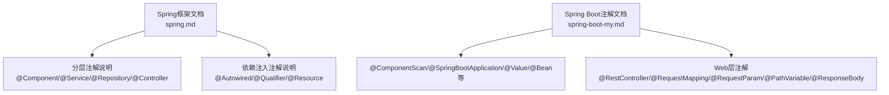
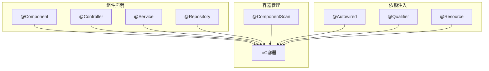
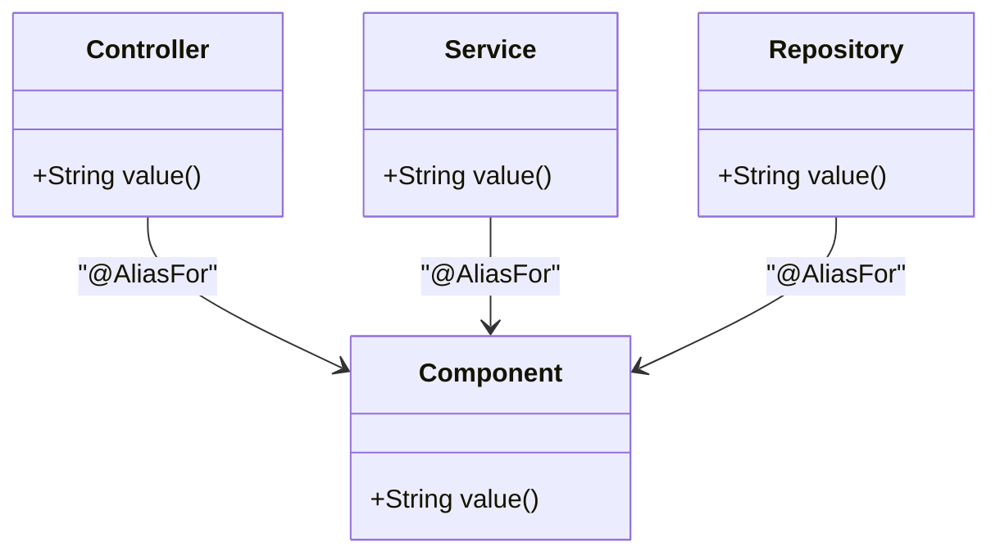
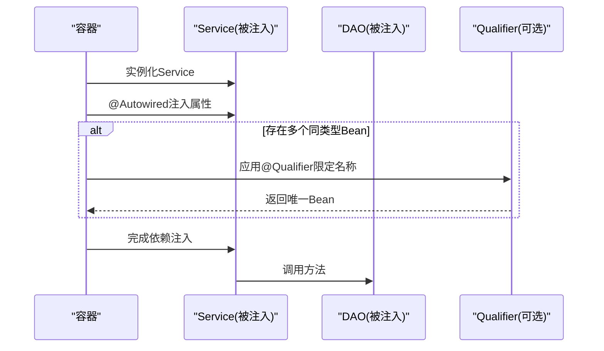
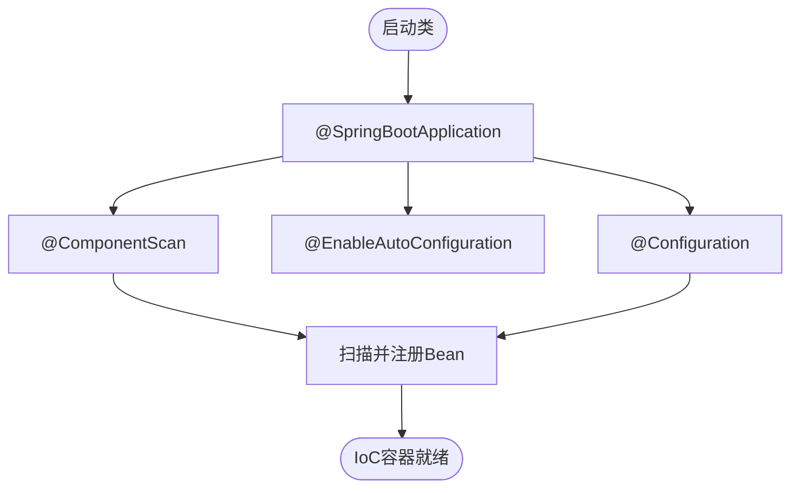

# IoC容器注解

<cite>
**本文引用的文件**
- [spring.md](file://docs/backend-base/spring/spring.md)
- [spring-boot-my.md](file://docs/backend-base/spring/spring-boot-my.md)
</cite>

## 目录
1. [引言](#引言)
2. [项目结构](#项目结构)
3. [核心组件](#核心组件)
4. [架构总览](#架构总览)
5. [详细组件分析](#详细组件分析)
6. [依赖分析](#依赖分析)
7. [性能考虑](#性能考虑)
8. [故障排查指南](#故障排查指南)
9. [结论](#结论)
10. [附录](#附录)

## 引言
本技术文档围绕Spring Boot IoC容器相关注解展开，重点讲解@Component、@Service、@Repository、@Controller等分层注解的使用场景与差异，以及@Autowired、@Qualifier、@Resource等依赖注入注解的工作原理与实践方法。文档结合仓库中的Spring框架与Spring Boot资料，提供可追溯的章节来源，帮助读者在实际项目中正确使用这些注解进行组件管理和依赖注入。

## 项目结构
本仓库为知识型文档集合，与Spring框架相关的注解说明集中在“backend-base/spring”目录下的文档中。本文档以该目录为核心参考，梳理IoC容器注解的使用方法与最佳实践。

**图表来源**
- [spring.md: 5707-5806:5707-5806](file://docs/backend-base/spring/spring.md#L5707-L5806)
- [spring.md: 6106-6696:6106-6696](file://docs/backend-base/spring/spring.md#L6106-L6696)
- [spring-boot-my.md: 43-214:43-214](file://docs/backend-base/spring/spring-boot-my.md#L43-L214)

**章节来源**
- [spring.md: 5707-5806:5707-5806](file://docs/backend-base/spring/spring.md#L5707-L5806)
- [spring.md: 6106-6696:6106-6696](file://docs/backend-base/spring/spring.md#L6106-L6696)
- [spring-boot-my.md: 43-214:43-214](file://docs/backend-base/spring/spring-boot-my.md#L43-L214)

## 核心组件
- 分层注解：用于声明组件并纳入IoC容器管理，便于按职责划分与扫描。
  - @Component：通用组件注解，作为元注解被其他分层注解复用。
  - @Controller：标注控制层组件（如Web控制器）。
  - @Service：标注业务层组件。
  - @Repository：标注数据访问层组件（DAO）。
- 依赖注入注解：用于在运行时为组件属性注入依赖。
  - @Autowired：默认按类型(byType)注入，可配合@Qualifier按名称(byName)限定。
  - @Qualifier：限定具体Bean名称，解决歧义。
  - @Resource：默认按名称(byName)注入，未指定name时使用属性名；若未找到再回退到按类型(byType)。

**章节来源**
- [spring.md: 5707-5806:5707-5806](file://docs/backend-base/spring/spring.md#L5707-L5806)
- [spring.md: 6106-6696:6106-6696](file://docs/backend-base/spring/spring.md#L6106-L6696)
- [spring-boot-my.md: 174-214:174-214](file://docs/backend-base/spring/spring-boot-my.md#L174-L214)

## 架构总览
下图展示了分层注解与依赖注入注解在IoC容器中的协作关系：通过@ComponentScan扫描组件，将标注的类注册为Bean；随后通过@Autowired/@Qualifier/@Resource完成属性注入，形成清晰的控制反转与依赖注入架构。

**图表来源**
- [spring.md: 5707-5806:5707-5806](file://docs/backend-base/spring/spring.md#L5707-L5806)
- [spring.md: 6106-6696:6106-6696](file://docs/backend-base/spring/spring.md#L6106-L6696)
- [spring-boot-my.md: 184-190:184-190](file://docs/backend-base/spring/spring-boot-my.md#L184-L190)

## 详细组件分析

### 分层注解：@Component/@Controller/@Service/@Repository
- 设计意图与作用
  - @Component为元注解，@Controller/@Service/@Repository均通过@AliasFor继承@Component，用于增强可读性与职责划分。
  - 建议在控制层使用@Controller、业务层使用@Service、数据访问层使用@Repository，通用组件使用@Component。
- Bean命名策略
  - 注解的value属性可显式指定Bean名称；若省略，Spring会采用“类名首字母小写”的默认命名规则。
- 包扫描与过滤
  - 通过@ComponentScan指定扫描包，支持use-default-filters与include-filter/exclude-filter实现选择性实例化。

**图表来源**
- [spring.md: 5716-5796:5716-5796](file://docs/backend-base/spring/spring.md#L5716-L5796)

**章节来源**
- [spring.md: 5707-5806:5707-5806](file://docs/backend-base/spring/spring.md#L5707-L5806)
- [spring.md: 5808-6015:5808-6015](file://docs/backend-base/spring/spring.md#L5808-L6015)
- [spring-boot-my.md: 184-190:184-190](file://docs/backend-base/spring/spring-boot-my.md#L184-L190)

### 依赖注入注解：@Autowired/@Qualifier/@Resource
- @Autowired
  - 默认按类型(byType)注入，适用于单实现场景。
  - 当存在多个同类型Bean时，需配合@Qualifier按名称限定。
  - 可用于属性、setter方法、构造方法及其参数上；当仅有一个构造方法时可省略注解。
- @Qualifier
  - 与@Autowired配合使用，通过指定Bean名称消除歧义。
- @Resource
  - 默认按名称(byName)注入；未指定name时使用属性名；若未找到再回退到按类型(byType)。
  - 适用于属性与setter方法；在某些JDK版本需要引入额外依赖。

**图表来源**
- [spring.md: 6231-6454:6231-6454](file://docs/backend-base/spring/spring.md#L6231-L6454)
- [spring.md: 6474-6538:6474-6538](file://docs/backend-base/spring/spring.md#L6474-L6538)
- [spring.md: 6521-6696:6521-6696](file://docs/backend-base/spring/spring.md#L6521-L6696)

**章节来源**
- [spring.md: 6106-6696:6106-6696](file://docs/backend-base/spring/spring.md#L6106-L6696)
- [spring-boot-my.md: 192-214:192-214](file://docs/backend-base/spring/spring-boot-my.md#L192-L214)

### Spring Boot常用注解补充
- @SpringBootApplication：组合@Configuration、@EnableAutoConfiguration、@ComponentScan，用于启动Spring Boot应用。
- @ComponentScan：指定扫描包，替代XML配置。
- @Value：从配置文件注入简单类型属性。
- @Bean：在配置类中定义Bean。
- Web层注解：@RestController、@RequestMapping、@RequestParam、@PathVariable、@ResponseBody等。

**图表来源**
- [spring-boot-my.md: 45-66:45-66](file://docs/backend-base/spring/spring-boot-my.md#L45-L66)
- [spring-boot-my.md: 184-190:184-190](file://docs/backend-base/spring/spring-boot-my.md#L184-L190)

**章节来源**
- [spring-boot-my.md: 43-214:43-214](file://docs/backend-base/spring/spring-boot-my.md#L43-L214)

## 依赖分析
- 注解间关系
  - @Controller/@Service/@Repository均为@Component的别名，具备相同作用域与生命周期管理能力。
  - @Autowired/@Qualifier/@Resource均服务于依赖注入，前者默认byType，后者默认byName，后者在不同JDK版本可能需要额外依赖。
- 包扫描与Bean注册
  - @ComponentScan决定哪些包下的组件被纳入容器管理，影响后续依赖注入的可用性。
- 典型依赖链
  - 控制器层(@Controller)依赖业务层(@Service)，业务层依赖数据访问层(@Repository)，通过@Autowired/@Qualifier/@Resource完成注入。

**图表来源**
- [spring.md: 5707-5806:5707-5806](file://docs/backend-base/spring/spring.md#L5707-L5806)
- [spring.md: 6106-6696:6106-6696](file://docs/backend-base/spring/spring.md#L6106-L6696)

**章节来源**
- [spring.md: 5707-5806:5707-5806](file://docs/backend-base/spring/spring.md#L5707-L5806)
- [spring.md: 6106-6696:6106-6696](file://docs/backend-base/spring/spring.md#L6106-L6696)

## 性能考虑
- 组件扫描范围
  - 合理设置@ComponentScan的包范围，避免扫描过多无关包，减少启动时间与内存占用。
- Bean命名与限定
  - 明确Bean名称，减少歧义，避免容器在注入时进行多余匹配与回退逻辑。
- 注解使用一致性
  - 在同一项目中保持注解风格一致，有助于提升可维护性与团队协作效率。

## 故障排查指南
- 多个同类型Bean导致注入失败
  - 症状：按类型注入时报错，提示Bean数量大于1。
  - 解决：使用@Qualifier指定Bean名称，或调整实现类的命名以消除歧义。
- @Resource未找到Bean
  - 症状：按名称注入失败。
  - 解决：确认Bean名称与属性名一致，或显式指定name；若仍失败，检查是否回退到按类型注入且存在多个实现。
- JDK版本兼容
  - @Resource在某些JDK版本需要引入额外依赖，请根据项目JDK版本确认依赖配置。

**章节来源**
- [spring.md: 6455-6474:6455-6474](file://docs/backend-base/spring/spring.md#L6455-L6474)
- [spring.md: 6521-6696:6521-6696](file://docs/backend-base/spring/spring.md#L6521-L6696)

## 结论
- 分层注解用于明确职责与可读性，@Controller/@Service/@Repository均为@Component的别名，推荐按职责选择使用。
- 依赖注入注解中，@Autowired默认按类型注入，@Qualifier用于按名称限定；@Resource默认按名称注入，未命中时回退按类型。
- 在Spring Boot项目中，@SpringBootApplication与@ComponentScan简化了组件扫描与启动配置；@Value/@Bean等注解完善了配置与Bean定义能力。
- 实践建议：合理规划包结构与扫描范围，明确Bean命名，统一注解风格，确保依赖注入稳定可靠。

## 附录
- 示例路径参考（不直接展示代码）
  - 分层注解与包扫描示例：[spring.md: 5808-6015:5808-6015](file://docs/backend-base/spring/spring.md#L5808-L6015)
  - @Autowired/@Qualifier使用示例：[spring.md: 6231-6454:6231-6454](file://docs/backend-base/spring/spring.md#L6231-L6454)
  - @Resource使用示例与回退机制：[spring.md: 6521-6696:6521-6696](file://docs/backend-base/spring/spring.md#L6521-L6696)
  - Spring Boot常用注解与Web注解：[spring-boot-my.md: 43-214:43-214](file://docs/backend-base/spring/spring-boot-my.md#L43-L214)