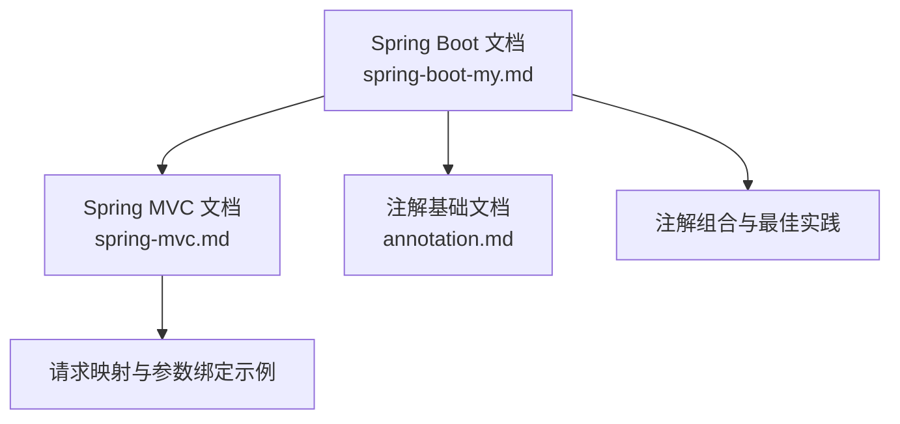
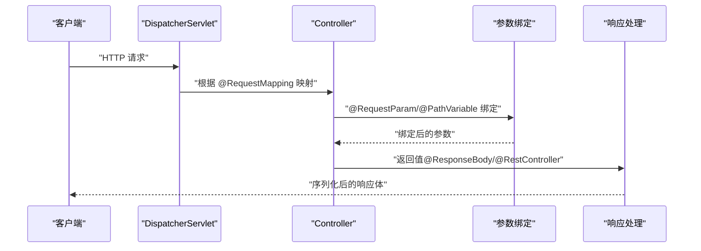
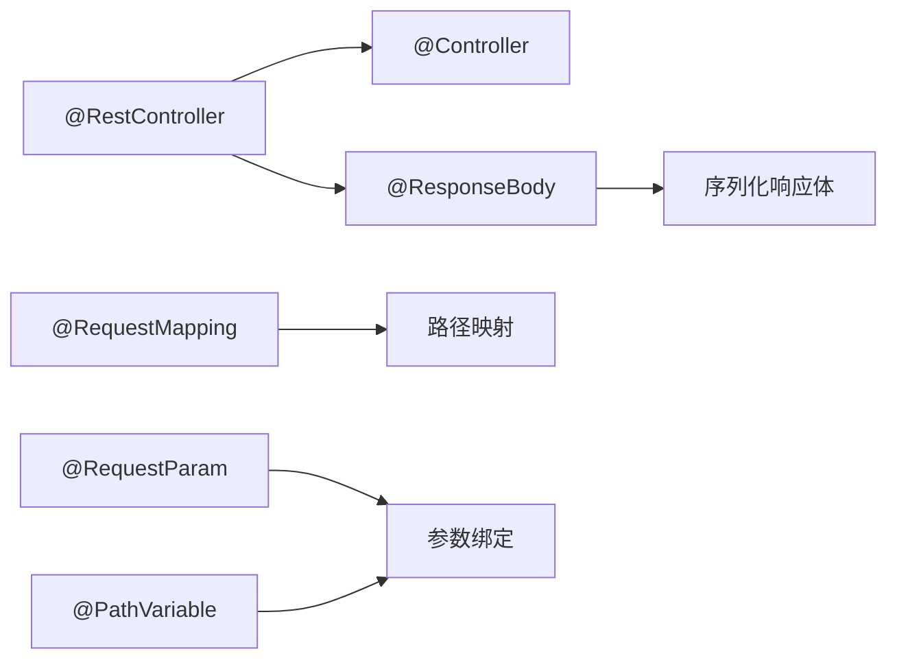

# Web开发注解

<cite>
**本文引用的文件**
- [spring-boot-my.md](file://docs/backend-base/spring/spring-boot-my.md)
- [spring-mvc.md](file://docs/backend-base/spring/spring-mvc.md)
- [annotation.md](file://docs/backend-base/java/annotation.md)
</cite>

## 目录
1. [引言](#引言)
2. [项目结构](#项目结构)
3. [核心组件](#核心组件)
4. [架构总览](#架构总览)
5. [详细组件分析](#详细组件分析)
6. [依赖分析](#依赖分析)
7. [性能考虑](#性能考虑)
8. [故障排查指南](#故障排查指南)
9. [结论](#结论)
10. [附录](#附录)

## 引言
本文件围绕Spring Boot Web开发中的关键注解展开，系统梳理@RestController、@RequestMapping、@RequestParam、@PathVariable、@ResponseBody等注解的使用方法、应用场景与最佳实践。文档以仓库内的Spring与Spring MVC相关文档为依据，结合RESTful API开发的常见模式，提供从概念到实操的完整知识体系，帮助读者快速掌握注解组合与落地技巧。

## 项目结构
本仓库与Spring Boot/Web开发相关的文档主要集中在 backend-base/spring 目录下，涵盖Spring、Spring MVC、Spring Boot等主题。本文档将重点参考以下文件：
- docs/backend-base/spring/spring-boot-my.md：包含Spring Boot常用注解与Web开发要点
- docs/backend-base/spring/spring-mvc.md：包含Spring MVC请求映射、参数绑定、响应处理等
- docs/backend-base/java/annotation.md：注解基础与生命周期、作用域说明

**图表来源**
- [spring-boot-my.md:108-122](file://docs/backend-base/spring/spring-boot-my.md#L108-L122)
- [spring-mvc.md:467-4750](file://docs/backend-base/spring/spring-mvc.md#L467-L4750)
- [annotation.md:11-42](file://docs/backend-base/java/annotation.md#L11-L42)

**章节来源**
- [spring-boot-my.md:108-122](file://docs/backend-base/spring/spring-boot-my.md#L108-L122)
- [spring-mvc.md:467-4750](file://docs/backend-base/spring/spring-mvc.md#L467-L4750)
- [annotation.md:11-42](file://docs/backend-base/java/annotation.md#L11-L42)

## 核心组件
本节聚焦于Web开发中最常用的注解及其职责：
- @RestController：组合@Controller与@ResponseBody，用于构建REST API，方法返回值直接写入响应体
- @RequestMapping：映射请求路径与处理方法，支持类级与方法级组合，支持HTTP方法、媒体类型等限定
- @RequestParam：将请求参数绑定到方法形参，支持必填、默认值、数组等
- @PathVariable：从URL路径中提取动态参数，常用于RESTful风格
- @ResponseBody：将返回值序列化为响应体（常与@RestController组合）

上述注解在Spring Boot与Spring MVC文档中均有明确说明与示例，详见下文“详细组件分析”。

**章节来源**
- [spring-boot-my.md:108-122](file://docs/backend-base/spring/spring-boot-my.md#L108-L122)
- [spring-mvc.md:467-4750](file://docs/backend-base/spring/spring-mvc.md#L467-L4750)

## 架构总览
下图展示了基于注解的Web请求处理流程：客户端发起HTTP请求，DispatcherServlet根据@RequestMapping映射到Controller方法，参数通过@RequestParam/@PathVariable绑定，方法返回值经@ResponseBody/@RestController序列化后返回。

**图表来源**
- [spring-mvc.md:467-4750](file://docs/backend-base/spring/spring-mvc.md#L467-L4750)
- [spring-boot-my.md:108-122](file://docs/backend-base/spring/spring-boot-my.md#L108-L122)

## 详细组件分析

### @RestController 注解
- 作用：组合@Controller与@ResponseBody，使Controller类的所有方法默认将返回值写入响应体，适合REST API
- 应用场景：前后端分离的接口开发、JSON响应
- 示例路径：[spring-boot-my.md:108-111](file://docs/backend-base/spring/spring-boot-my.md#L108-L111)

最佳实践
- 优先使用@RestController简化响应体输出
- 若需部分方法返回视图，可将该方法显式标注@Controller或在类上使用@Controller并在该方法上标注@ResponseBody

**章节来源**
- [spring-boot-my.md:108-111](file://docs/backend-base/spring/spring-boot-my.md#L108-L111)

### @RequestMapping 注解
- 作用：映射请求路径与处理方法，支持类级与方法级组合，支持HTTP方法、媒体类型、Produces等限定
- 应用场景：RESTful API路径设计、类级命名空间、方法级HTTP方法限定
- 示例路径：[spring-boot-my.md:112-122](file://docs/backend-base/spring/spring-boot-my.md#L112-L122)

最佳实践
- 类级@RequestMapping提供命名空间，方法级@RequestMapping继承类级路径
- 使用method属性限定HTTP方法，避免跨方法误映射
- 使用produces限定响应媒体类型，确保客户端正确解析

**章节来源**
- [spring-boot-my.md:112-122](file://docs/backend-base/spring/spring-boot-my.md#L112-L122)

### @RequestParam 注解
- 作用：将请求参数（query参数、表单字段）绑定到方法形参
- 应用场景：查询参数、表单提交、数组参数
- 示例路径：[spring-boot-my.md:124-134](file://docs/backend-base/spring/spring-boot-my.md#L124-L134)

最佳实践
- 必填参数使用required=true，非必填参数提供默认值
- 数组/集合参数使用数组类型接收
- 注意value/name属性与提交字段名一致

**章节来源**
- [spring-boot-my.md:124-134](file://docs/backend-base/spring/spring-boot-my.md#L124-L134)

### @PathVariable 注解
- 作用：从URL路径中提取动态参数，常用于RESTful风格
- 应用场景：RESTful资源路径、多段动态参数
- 示例路径：[spring-boot-my.md:136-154](file://docs/backend-base/spring/spring-boot-my.md#L136-L154)

最佳实践
- 路径变量与占位符一一对应，命名清晰
- 结合类级@RequestMapping提供资源前缀，提升可读性

**章节来源**
- [spring-boot-my.md:136-154](file://docs/backend-base/spring/spring-boot-my.md#L136-L154)

### @ResponseBody 注解
- 作用：将返回值写入响应体，常与@RestController组合使用
- 应用场景：API接口返回JSON/XML等序列化数据
- 示例路径：[spring-boot-my.md:156-159](file://docs/backend-base/spring/spring-boot-my.md#L156-L159)

最佳实践
- @RestController等价于在类上标注@Controller与@ResponseBody
- 如需部分方法返回视图，可在类上使用@Controller并在该方法上标注@ResponseBody

**章节来源**
- [spring-boot-my.md:156-159](file://docs/backend-base/spring/spring-boot-my.md#L156-L159)

### 注解组合与RESTful最佳实践
- 类级@RequestMapping提供资源前缀，方法级@RequestMapping继承类级路径
- 使用@PathVariable实现RESTful资源定位
- 使用@RequestBody接收请求体（如JSON）
- 使用produces限定响应媒体类型
- 使用required与默认值控制参数健壮性

示例路径
- [spring-boot-my.md:112-122](file://docs/backend-base/spring/spring-boot-my.md#L112-L122)
- [spring-mvc.md:820-834](file://docs/backend-base/spring/spring-mvc.md#L820-L834)

**章节来源**
- [spring-boot-my.md:112-122](file://docs/backend-base/spring/spring-boot-my.md#L112-L122)
- [spring-mvc.md:820-834](file://docs/backend-base/spring/spring-mvc.md#L820-L834)

## 依赖分析
注解之间的依赖关系与职责边界如下：
- @RestController依赖于@Controller与@ResponseBody，提供便捷的API响应
- @RequestMapping提供请求映射与路径组合能力，支持类级与方法级
- @RequestParam与@PathVariable分别负责查询参数与路径参数的绑定
- @ResponseBody负责返回值的序列化输出

**图表来源**
- [spring-boot-my.md:108-159](file://docs/backend-base/spring/spring-boot-my.md#L108-L159)

**章节来源**
- [spring-boot-my.md:108-159](file://docs/backend-base/spring/spring-boot-my.md#L108-L159)

## 性能考虑
- 参数绑定与序列化：合理使用@RequestBody与@ResponseBody，避免不必要的对象转换
- 路径映射优化：类级@RequestMapping提供命名空间，减少重复路径拼接
- 媒体类型限定：通过produces限定响应类型，减少不必要的格式转换

[本节为通用指导，无需特定文件引用]

## 故障排查指南
常见问题与定位思路
- 请求路径映射冲突：类级与方法级@RequestMapping冲突或重复映射，需调整路径或使用method限定
- 参数绑定失败：@RequestParam的value/name与提交字段名不一致，或required参数缺失
- 路径变量不匹配：@PathVariable与路径占位符不一致，或顺序错误
- 响应体未序列化：未使用@RestController或@ResponseBody，或返回值类型未正确序列化

定位路径
- 路径映射冲突：参考类级与方法级@RequestMapping组合规则
  - [spring-mvc.md:597-643](file://docs/backend-base/spring/spring-mvc.md#L597-L643)
- 参数绑定失败：核对@RequestParam的value/name与提交字段名
  - [spring-boot-my.md:124-134](file://docs/backend-base/spring/spring-boot-my.md#L124-L134)
- 路径变量不匹配：核对@PathVariable与路径占位符
  - [spring-boot-my.md:136-154](file://docs/backend-base/spring/spring-boot-my.md#L136-L154)
- 响应体未序列化：确认@RestController或@ResponseBody使用
  - [spring-boot-my.md:156-159](file://docs/backend-base/spring/spring-boot-my.md#L156-L159)

**章节来源**
- [spring-mvc.md:597-643](file://docs/backend-base/spring/spring-mvc.md#L597-L643)
- [spring-boot-my.md:124-159](file://docs/backend-base/spring/spring-boot-my.md#L124-L159)

## 结论
@RestController、@RequestMapping、@RequestParam、@PathVariable、@ResponseBody构成了Spring Boot Web开发的核心注解体系。通过类级与方法级@RequestMapping组合、@PathVariable实现RESTful路径、@RequestParam处理查询参数、@ResponseBody统一响应体输出，可高效构建清晰、可维护的RESTful API。遵循最佳实践与故障排查清单，可显著提升开发效率与系统稳定性。

[本节为总结性内容，无需特定文件引用]

## 附录
- 注解基础与生命周期：了解注解的生命周期与作用域有助于正确选择与使用注解
  - [annotation.md:11-42](file://docs/backend-base/java/annotation.md#L11-L42)

**章节来源**
- [annotation.md:11-42](file://docs/backend-base/java/annotation.md#L11-L42)