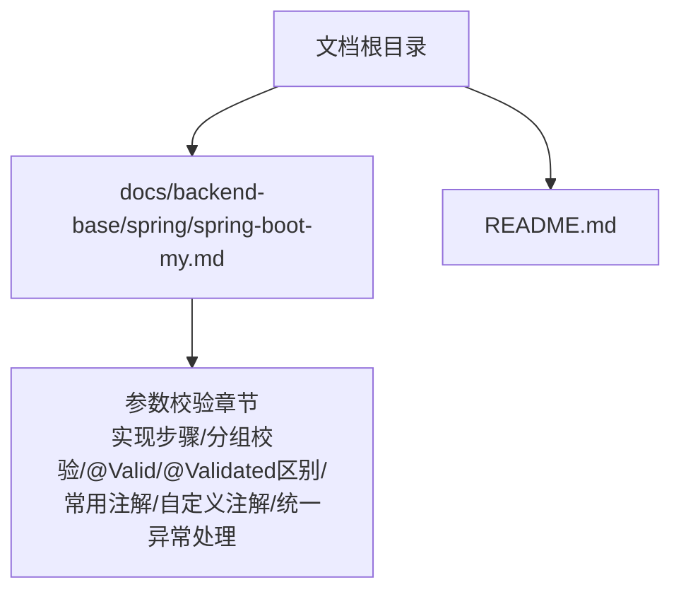
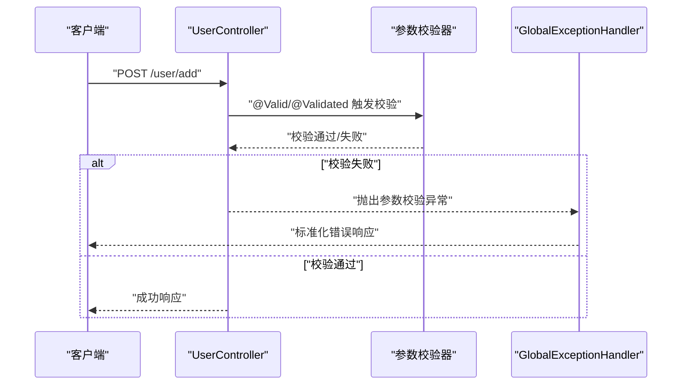
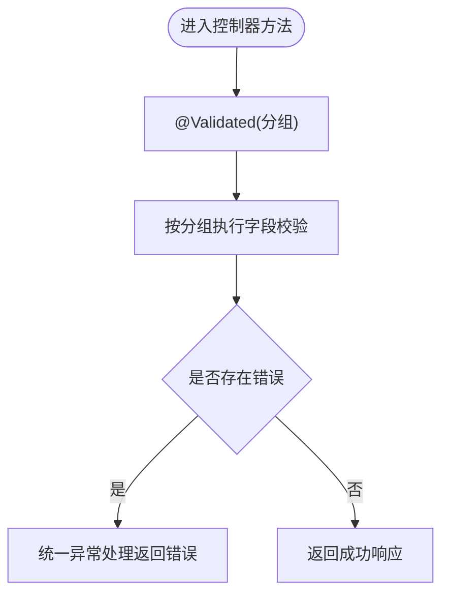
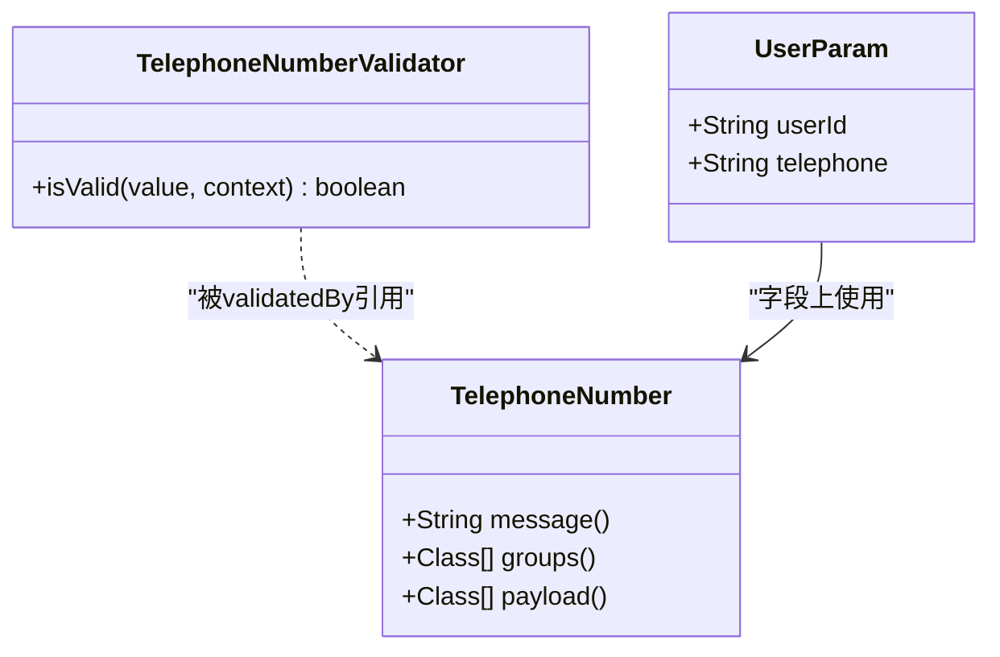
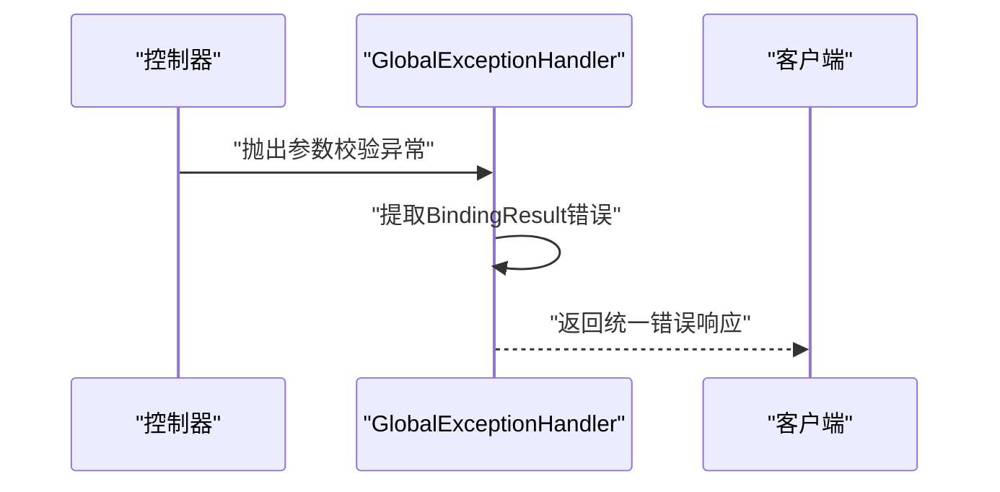

# 参数校验注解

<cite>
**本文引用的文件**
- [spring-boot-my.md](file://docs/backend-base/spring/spring-boot-my.md)
- [README.md](file://README.md)
</cite>

## 目录
1. [简介](#简介)
2. [项目结构](#项目结构)
3. [核心组件](#核心组件)
4. [架构总览](#架构总览)
5. [详细组件分析](#详细组件分析)
6. [依赖分析](#依赖分析)
7. [性能考虑](#性能考虑)
8. [故障排查指南](#故障排查指南)
9. [结论](#结论)
10. [附录](#附录)

## 简介
本技术文档围绕Spring Boot参数校验注解展开，系统性介绍JSR-349标准注解与Spring Validation扩展注解的使用方法，涵盖@Valid、@Validated、@NotBlank、@NotNull、@Email、@Pattern等常用注解；深入讲解分组校验的概念与实现；并提供自定义校验注解的开发流程与最佳实践。同时，结合统一异常处理机制，帮助读者在实际项目中高效落地参数校验。

## 项目结构
本仓库为知识型文档站点，参数校验相关内容集中于后端基础模块下的Spring专题文档中。本文档基于该文档进行提炼与可视化说明，便于快速定位与查阅。

图表来源
- [spring-boot-my.md:289-647](file://docs/backend-base/spring/spring-boot-my.md#L289-L647)

章节来源
- [spring-boot-my.md:1-12](file://docs/backend-base/spring/spring-boot-my.md#L1-L12)
- [README.md:1-12](file://README.md#L1-L12)

## 核心组件
- 参数校验起步依赖：spring-boot-starter-validation
- 参数封装DTO：将请求参数封装为独立DTO，避免污染实体模型
- 控制器参数校验：使用@Valid或@Validated触发校验，并通过BindingResult接收错误信息
- 分组校验：通过定义分组接口，按场景启用不同规则
- 自定义校验注解：定义ConstraintValidator与注解元数据，实现业务特定校验
- 统一异常处理：通过@RestControllerAdvice集中处理参数校验异常

章节来源
- [spring-boot-my.md:295-303](file://docs/backend-base/spring/spring-boot-my.md#L295-L303)
- [spring-boot-my.md:305-348](file://docs/backend-base/spring/spring-boot-my.md#L305-L348)
- [spring-boot-my.md:350-384](file://docs/backend-base/spring/spring-boot-my.md#L350-L384)
- [spring-boot-my.md:387-450](file://docs/backend-base/spring/spring-boot-my.md#L387-L450)
- [spring-boot-my.md:521-583](file://docs/backend-base/spring/spring-boot-my.md#L521-L583)
- [spring-boot-my.md:585-627](file://docs/backend-base/spring/spring-boot-my.md#L585-L627)

## 架构总览
下图展示了参数校验在Spring MVC中的典型调用链路：客户端请求到达控制器，控制器方法通过@Valid/@Validated触发校验，校验失败由统一异常处理器捕获并返回标准化错误响应。

图表来源
- [spring-boot-my.md:354-384](file://docs/backend-base/spring/spring-boot-my.md#L354-L384)
- [spring-boot-my.md:589-627](file://docs/backend-base/spring/spring-boot-my.md#L589-L627)

## 详细组件分析

### JSR-349与Spring Validation常用注解
- JSR-349注解族：包含布尔判断、数值范围、时间日期、字符串长度/大小、正则匹配等基础能力
- Spring Validation扩展：提供长度、范围、URL、HTML安全、持续时间等增强注解
- 常用注解示例：@NotBlank、@NotNull、@Email、@Pattern、@Size、@Max、@Min、@Range等

章节来源
- [spring-boot-my.md:468-519](file://docs/backend-base/spring/spring-boot-my.md#L468-L519)

### @Valid vs @Validated
- @Validated：支持分组校验，适用于类型、方法与方法参数；无法直接标注字段
- @Valid：可标注字段、方法、构造函数、方法参数；支持嵌套对象校验
- 在需要按场景启用不同规则时，应使用@Validated并传入对应分组

章节来源
- [spring-boot-my.md:454-467](file://docs/backend-base/spring/spring-boot-my.md#L454-L467)

### 参数封装与控制器校验
- 将请求参数封装为DTO，避免污染实体模型
- 使用@RequestBody接收JSON体，配合@Valid/@Validated触发校验
- 通过BindingResult获取错误列表，进行日志记录与统一处理

章节来源
- [spring-boot-my.md:305-348](file://docs/backend-base/spring/spring-boot-my.md#L305-L348)
- [spring-boot-my.md:350-384](file://docs/backend-base/spring/spring-boot-my.md#L350-L384)

### 分组校验
- 定义分组接口（如AddValidationGroup、EditValidationGroup）
- 在字段上声明groups属性，限定在特定分组下生效
- 控制器方法使用@Validated(分组.class)启用对应规则

图表来源
- [spring-boot-my.md:390-450](file://docs/backend-base/spring/spring-boot-my.md#L390-L450)

章节来源
- [spring-boot-my.md:387-450](file://docs/backend-base/spring/spring-boot-my.md#L387-L450)

### 自定义校验注解
- 步骤一：实现ConstraintValidator<TelephoneNumber, String>，编写isValid逻辑
- 步骤二：定义注解元数据，声明message、groups、payload及validatedBy
- 步骤三：在DTO字段上使用自定义注解，完成业务规则校验

图表来源
- [spring-boot-my.md:525-539](file://docs/backend-base/spring/spring-boot-my.md#L525-L539)
- [spring-boot-my.md:543-564](file://docs/backend-base/spring/spring-boot-my.md#L543-L564)
- [spring-boot-my.md:568-583](file://docs/backend-base/spring/spring-boot-my.md#L568-L583)

章节来源
- [spring-boot-my.md:521-583](file://docs/backend-base/spring/spring-boot-my.md#L521-L583)

### 统一异常处理
- 使用@RestControllerAdvice定义全局异常处理类
- 捕获BindException、ValidationException、MethodArgumentNotValidException等参数校验异常
- 将BindingResult中的错误聚合为统一错误消息返回

图表来源
- [spring-boot-my.md:589-627](file://docs/backend-base/spring/spring-boot-my.md#L589-L627)

章节来源
- [spring-boot-my.md:585-627](file://docs/backend-base/spring/spring-boot-my.md#L585-L627)

## 依赖分析
- 参数校验起步依赖：spring-boot-starter-validation
- 作用：引入JSR-303/Hibernate Validator与Spring MVC集成，开启自动参数校验

章节来源
- [spring-boot-my.md:295-303](file://docs/backend-base/spring/spring-boot-my.md#L295-L303)

## 性能考虑
- 合理拆分DTO，避免一次性承载过多字段，降低校验开销
- 对高频校验使用简单规则，复杂规则尽量延迟或异步处理
- 分组校验减少不必要的字段校验，提升接口吞吐
- 统一异常处理避免重复序列化与日志输出，保持一致的错误响应格式

## 故障排查指南
- 症状：@Valid标注字段无效
  - 排查：确认使用@Validated进行方法参数校验，或在嵌套对象上使用@Valid
- 症状：分组校验不生效
  - 排查：确保字段groups与控制器@Validated分组一致
- 症状：自定义注解未触发
  - 排查：检查validatedBy是否指向正确校验器，注解元数据是否完整
- 症状：异常未被统一处理
  - 排查：确认@RestControllerAdvice已扫描到异常类型，异常处理器签名匹配

章节来源
- [spring-boot-my.md:454-467](file://docs/backend-base/spring/spring-boot-my.md#L454-L467)
- [spring-boot-my.md:585-627](file://docs/backend-base/spring/spring-boot-my.md#L585-L627)

## 结论
通过引入spring-boot-starter-validation并在控制器中使用@Valid/@Validated，结合DTO封装与分组校验，可有效提升接口健壮性与可维护性。配合自定义校验注解与统一异常处理，能够满足复杂业务场景下的参数校验需求，并提供一致的错误反馈体验。

## 附录
- 常用注解速查：@NotBlank、@NotNull、@Email、@Pattern、@Size、@Max、@Min、@Range、@Length、@URL等
- 最佳实践清单
  - 所有对外接口参数使用DTO封装
  - 明确区分新增与编辑场景，使用分组校验
  - 自定义校验注解需提供清晰的错误消息
  - 统一异常处理覆盖常见参数校验异常类型

章节来源
- [spring-boot-my.md:468-519](file://docs/backend-base/spring/spring-boot-my.md#L468-L519)
- [spring-boot-my.md:585-627](file://docs/backend-base/spring/spring-boot-my.md#L585-L627)