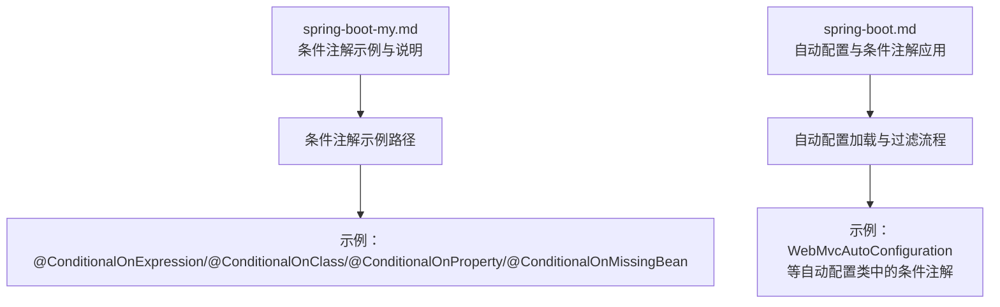
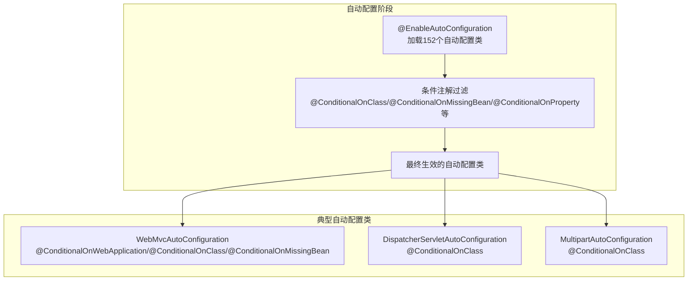
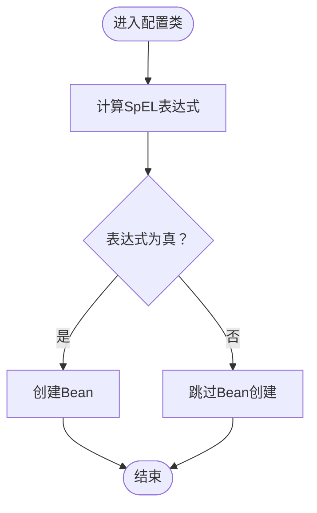
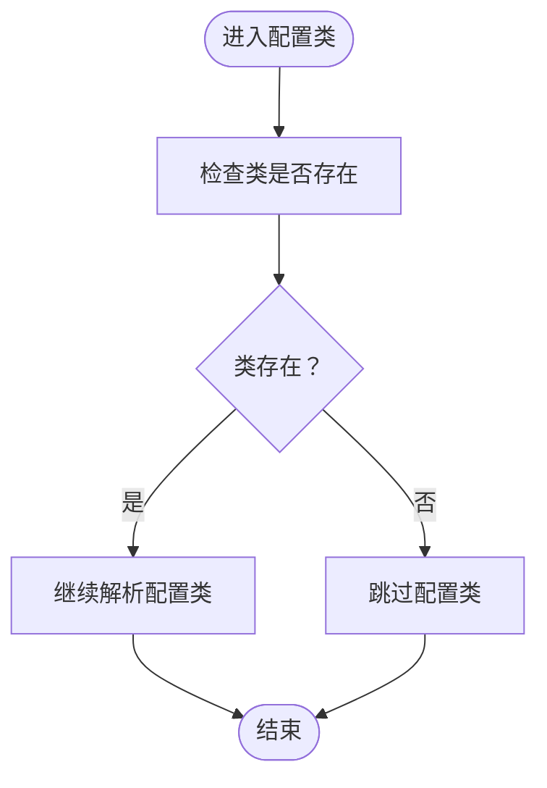
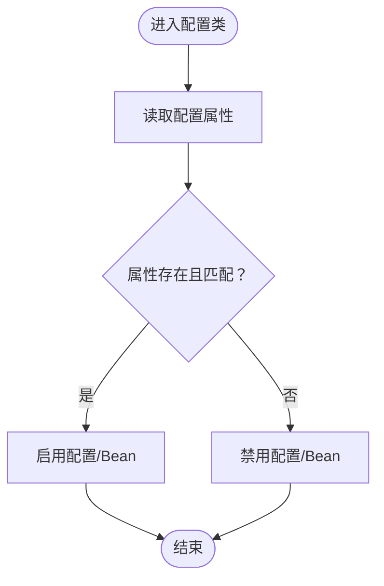
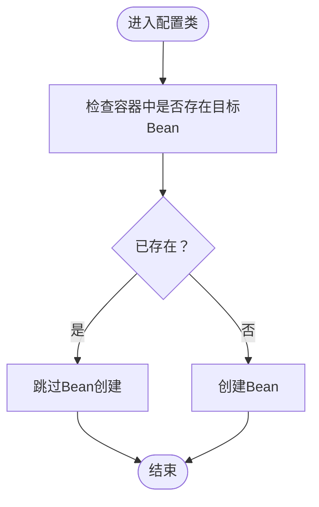
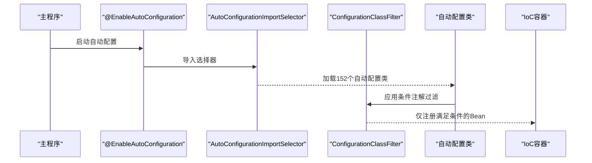
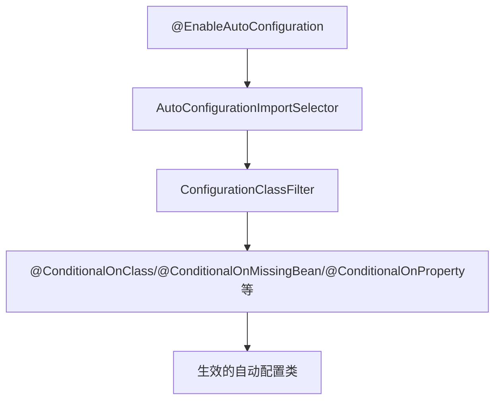

# 条件注解

<cite>
**本文引用的文件**
- [spring-boot-my.md](file://docs/backend-base/spring/spring-boot-my.md)
- [spring-boot.md](file://docs/backend-base/spring/spring-boot.md)
</cite>

## 目录
1. [引言](#引言)
2. [项目结构](#项目结构)
3. [核心组件](#核心组件)
4. [架构总览](#架构总览)
5. [详细组件分析](#详细组件分析)
6. [依赖分析](#依赖分析)
7. [性能考量](#性能考量)
8. [故障排查指南](#故障排查指南)
9. [结论](#结论)
10. [附录](#附录)

## 引言
本篇文档围绕Spring Boot条件注解展开，重点讲解@ConditionalOnExpression、@ConditionalOnClass、@ConditionalOnProperty、@ConditionalOnMissingBean等注解的工作原理与使用场景，阐明它们如何实现基于条件的Bean创建与配置选择，并说明在Spring Boot自动配置中的关键作用。文档结合仓库内的知识库资料，给出可追溯的示例路径与实现要点，帮助读者在实际项目中正确使用这些注解。

## 项目结构
本仓库与Spring Boot条件注解相关的内容集中在“backend-base/spring”目录下的两篇Markdown文档中：
- spring-boot-my.md：包含条件注解的示例与简要说明，覆盖@ConditionalOnExpression、@ConditionalOnClass、@ConditionalOnProperty、@ConditionalOnMissingBean等。
- spring-boot.md：系统阐述Spring Boot自动配置原理，包含条件注解在自动配置中的应用与过滤机制。

**章节来源**
- [spring-boot-my.md:243-287](file://docs/backend-base/spring/spring-boot-my.md#L243-L287)
- [spring-boot.md:3651-3720](file://docs/backend-base/spring/spring-boot.md#L3651-L3720)

## 核心组件
本节聚焦四大条件注解及其在Spring Boot自动配置中的角色与用法。

- @ConditionalOnExpression
  - 作用：基于SpEL表达式的结果决定是否创建Bean。
  - 示例路径：[spring-boot-my.md:247-255](file://docs/backend-base/spring/spring-boot-my.md#L247-L255)
  - 场景：通过配置开关控制功能启用与否，如示例中的enabled开关。

- @ConditionalOnClass
  - 作用：当指定的类存在于类路径时，才创建Bean或启用配置类。
  - 示例路径：[spring-boot-my.md:262-274](file://docs/backend-base/spring/spring-boot-my.md#L262-L274)
  - 场景：当引入某依赖（如Gson）时，自动提供默认Bean。

- @ConditionalOnProperty
  - 作用：当配置文件中存在指定属性且可选的值匹配时，才创建Bean或启用配置类。
  - 示例路径：[spring-boot-my.md:277-279](file://docs/backend-base/spring/spring-boot-my.md#L277-L279)
  - 场景：通过application.properties/yml中的属性控制功能开关。

- @ConditionalOnMissingBean
  - 作用：当容器中不存在指定Bean时，才创建当前Bean。
  - 示例路径：[spring-boot-my.md:167](file://docs/backend-base/spring/spring-boot-my.md#L167)、[spring-boot-my.md:269-273](file://docs/backend-base/spring/spring-boot-my.md#L269-L273)
  - 场景：提供默认Bean，避免用户自定义Bean覆盖。

此外，spring-boot.md还列举了更多条件注解（如@ConditionalOnMissingClass、@ConditionalOnBean、@ConditionalOnResource、@ConditionalOnWebApplication等），并在自动配置加载与过滤环节强调了条件注解的判断作用。

**章节来源**
- [spring-boot-my.md:167](file://docs/backend-base/spring/spring-boot-my.md#L167)
- [spring-boot-my.md:247-255](file://docs/backend-base/spring/spring-boot-my.md#L247-L255)
- [spring-boot-my.md:262-274](file://docs/backend-base/spring/spring-boot-my.md#L262-L274)
- [spring-boot-my.md:277-279](file://docs/backend-base/spring/spring-boot-my.md#L277-L279)
- [spring-boot.md:3656-3666](file://docs/backend-base/spring/spring-boot.md#L3656-L3666)
- [spring-boot.md:3801-3803](file://docs/backend-base/spring/spring-boot.md#L3801-L3803)

## 架构总览
Spring Boot通过@EnableAutoConfiguration加载大量自动配置类，随后利用条件注解对这些配置类进行筛选，仅保留满足条件的配置类生效。WebMvcAutoConfiguration等典型自动配置类中广泛使用@ConditionalOnClass、@ConditionalOnMissingBean、@ConditionalOnProperty等注解，确保在满足运行环境与用户配置的前提下启用相应功能。

**图表来源**
- [spring-boot.md:3754-3756](file://docs/backend-base/spring/spring-boot.md#L3754-L3756)
- [spring-boot.md:3801-3803](file://docs/backend-base/spring/spring-boot.md#L3801-L3803)
- [spring-boot.md:4034-4052](file://docs/backend-base/spring/spring-boot.md#L4034-L4052)

**章节来源**
- [spring-boot.md:3746-3807](file://docs/backend-base/spring/spring-boot.md#L3746-L3807)
- [spring-boot.md:4034-4052](file://docs/backend-base/spring/spring-boot.md#L4034-L4052)

## 详细组件分析

### @ConditionalOnExpression 工作机制与示例
- 工作原理：基于SpEL表达式计算结果，true时创建Bean，false时跳过。
- 示例路径：[spring-boot-my.md:247-255](file://docs/backend-base/spring/spring-boot-my.md#L247-L255)
- 使用建议：
  - 将开关置于配置文件中，便于运维控制。
  - 表达式可结合占位符与默认值，提升健壮性。

**章节来源**
- [spring-boot-my.md:247-255](file://docs/backend-base/spring/spring-boot-my.md#L247-L255)

### @ConditionalOnClass 工作机制与示例
- 工作原理：类路径中存在指定类时，配置类生效；否则跳过。
- 示例路径：[spring-boot-my.md:262-274](file://docs/backend-base/spring/spring-boot-my.md#L262-L274)
- 使用建议：
  - 用于“按依赖启用”场景，如引入Gson后自动提供默认Bean。
  - 与@ConditionalOnMissingBean配合，避免用户自定义Bean被覆盖。

**章节来源**
- [spring-boot-my.md:262-274](file://docs/backend-base/spring/spring-boot-my.md#L262-L274)

### @ConditionalOnProperty 工作机制与示例
- 工作原理：读取配置文件中的属性值，若存在且与期望值匹配（可选），则启用配置类或Bean。
- 示例路径：[spring-boot-my.md:277-279](file://docs/backend-base/spring/spring-boot-my.md#L277-L279)
- 使用建议：
  - 通过前缀与属性名组织配置，便于集中管理。
  - 结合matchIfMissing等属性，控制默认行为。

**章节来源**
- [spring-boot-my.md:277-279](file://docs/backend-base/spring/spring-boot-my.md#L277-L279)

### @ConditionalOnMissingBean 工作机制与示例
- 工作原理：容器中不存在指定Bean时创建当前Bean；若已存在则跳过。
- 示例路径：[spring-boot-my.md:167](file://docs/backend-base/spring/spring-boot-my.md#L167)、[spring-boot-my.md:269-273](file://docs/backend-base/spring/spring-boot-my.md#L269-L273)
- 使用建议：
  - 作为默认Bean提供者，避免与用户自定义Bean冲突。
  - 与@Primary等注解配合，明确默认Bean优先级。

**章节来源**
- [spring-boot-my.md:167](file://docs/backend-base/spring/spring-boot-my.md#L167)
- [spring-boot-my.md:269-273](file://docs/backend-base/spring/spring-boot-my.md#L269-L273)

### 自动配置中的条件注解应用
- 加载与过滤：@EnableAutoConfiguration加载152个自动配置类，随后通过条件注解进行进一步过滤，最终仅保留26个生效配置。
- 典型案例：WebMvcAutoConfiguration等自动配置类广泛使用@ConditionalOnClass、@ConditionalOnMissingBean、@ConditionalOnProperty等注解，确保在满足运行环境与用户配置的前提下启用相应功能。
- 示例路径：
  - 自动配置加载与过滤流程：[spring-boot.md:3754-3803](file://docs/backend-base/spring/spring-boot.md#L3754-L3803)
  - WebMvcAutoConfiguration条件注解示例：[spring-boot.md:4034-4052](file://docs/backend-base/spring/spring-boot.md#L4034-L4052)

**图表来源**
- [spring-boot.md:3754-3756](file://docs/backend-base/spring/spring-boot.md#L3754-L3756)
- [spring-boot.md:3801-3803](file://docs/backend-base/spring/spring-boot.md#L3801-L3803)

**章节来源**
- [spring-boot.md:3754-3803](file://docs/backend-base/spring/spring-boot.md#L3754-L3803)
- [spring-boot.md:4034-4052](file://docs/backend-base/spring/spring-boot.md#L4034-L4052)

## 依赖分析
- 条件注解与自动配置的关系
  - 条件注解是自动配置生效的关键判定依据，贯穿加载与过滤阶段。
  - 典型依赖链：@EnableAutoConfiguration → AutoConfigurationImportSelector → ConfigurationClassFilter → 条件注解判定 → 生效的自动配置类。
- 典型依赖示例
  - WebMvcAutoConfiguration依赖@ConditionalOnWebApplication、@ConditionalOnClass、@ConditionalOnMissingBean等注解，确保在Servlet Web环境中且缺少特定Bean时生效。
  - 示例路径：[spring-boot.md:4034-4052](file://docs/backend-base/spring/spring-boot.md#L4034-L4052)

**图表来源**
- [spring-boot.md:3754-3756](file://docs/backend-base/spring/spring-boot.md#L3754-L3756)
- [spring-boot.md:3801-3803](file://docs/backend-base/spring/spring-boot.md#L3801-L3803)

**章节来源**
- [spring-boot.md:3754-3803](file://docs/backend-base/spring/spring-boot.md#L3754-L3803)

## 性能考量
- 条件注解的判断成本较低，主要涉及类存在性检查、Bean存在性检查与配置读取，通常对启动性能影响有限。
- 在大量自动配置类场景下，合理使用条件注解有助于减少不必要的Bean创建与初始化，从而缩短启动时间。
- 建议：
  - 将条件注解尽量靠近需要控制的Bean或配置类，避免过度复杂的条件组合。
  - 对于频繁读取的配置属性，可通过合理的前缀与命名提升可读性与维护性。

## 故障排查指南
- 常见问题与排查思路
  - 自动配置未生效：检查是否满足@ConditionalOnClass、@ConditionalOnMissingBean、@ConditionalOnProperty等条件；确认依赖是否正确引入。
  - Bean被意外覆盖：确认是否已有用户自定义Bean；必要时使用@Primary或调整条件注解。
  - 配置开关无效：检查配置文件中的属性名与前缀是否正确，以及SpEL表达式语法是否正确。
- 参考示例路径
  - 条件注解在自动配置中的应用与过滤：[spring-boot.md:3801-3803](file://docs/backend-base/spring/spring-boot.md#L3801-L3803)
  - WebMvcAutoConfiguration条件注解示例：[spring-boot.md:4034-4052](file://docs/backend-base/spring/spring-boot.md#L4034-L4052)

**章节来源**
- [spring-boot.md:3801-3803](file://docs/backend-base/spring/spring-boot.md#L3801-L3803)
- [spring-boot.md:4034-4052](file://docs/backend-base/spring/spring-boot.md#L4034-L4052)

## 结论
条件注解是Spring Boot实现“按需加载”与“智能配置”的关键手段。通过@ConditionalOnExpression、@ConditionalOnClass、@ConditionalOnProperty、@ConditionalOnMissingBean等注解，Spring Boot能够在启动阶段根据运行环境与配置动态选择性地创建Bean与启用配置，从而实现高度可插拔与可定制的自动配置体系。在实际项目中，应结合业务场景合理使用这些注解，并遵循最佳实践以确保配置清晰、可维护与高性能。

## 附录
- 相关示例路径汇总
  - @ConditionalOnExpression示例：[spring-boot-my.md:247-255](file://docs/backend-base/spring/spring-boot-my.md#L247-L255)
  - @ConditionalOnClass示例：[spring-boot-my.md:262-274](file://docs/backend-base/spring/spring-boot-my.md#L262-L274)
  - @ConditionalOnProperty说明：[spring-boot-my.md:277-279](file://docs/backend-base/spring/spring-boot-my.md#L277-L279)
  - @ConditionalOnMissingBean示例与说明：[spring-boot-my.md:167](file://docs/backend-base/spring/spring-boot-my.md#L167)、[spring-boot-my.md:269-273](file://docs/backend-base/spring/spring-boot-my.md#L269-L273)
  - 自动配置加载与过滤流程：[spring-boot.md:3754-3803](file://docs/backend-base/spring/spring-boot.md#L3754-L3803)
  - WebMvcAutoConfiguration条件注解示例：[spring-boot.md:4034-4052](file://docs/backend-base/spring/spring-boot.md#L4034-L4052)