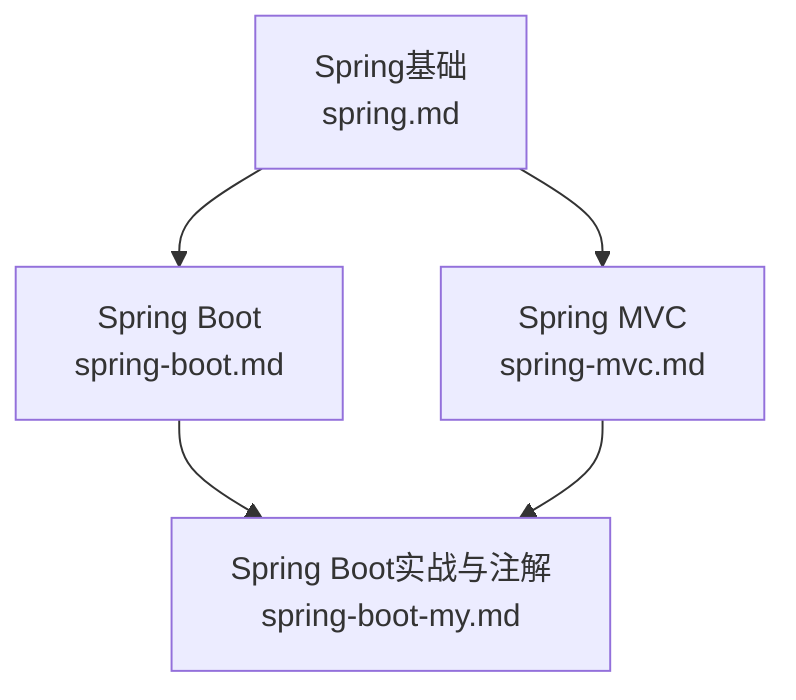
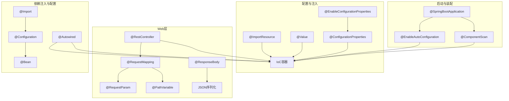
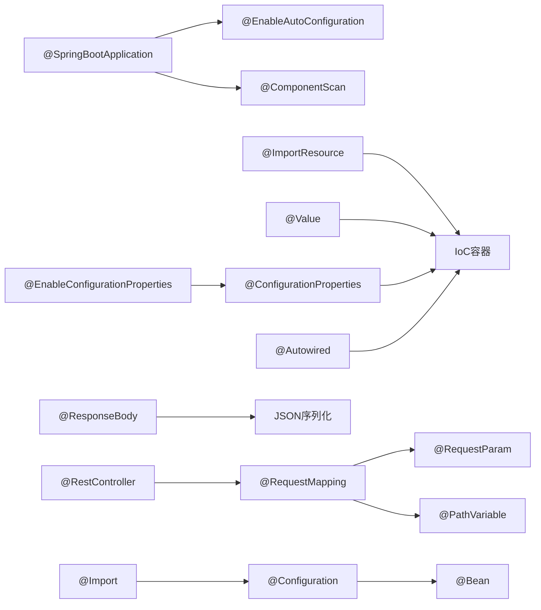

# 核心注解

<cite>
**本文引用的文件**
- [spring-boot-my.md](file://docs/backend-base/spring/spring-boot-my.md)
- [spring.md](file://docs/backend-base/spring/spring.md)
- [spring-boot.md](file://docs/backend-base/spring/spring-boot.md)
- [spring-mvc.md](file://docs/backend-base/spring/spring-mvc.md)
</cite>

## 目录
1. [引言](#引言)
2. [项目结构](#项目结构)
3. [核心组件](#核心组件)
4. [架构总览](#架构总览)
5. [详细组件分析](#详细组件分析)
6. [依赖分析](#依赖分析)
7. [性能考虑](#性能考虑)
8. [故障排查指南](#故障排查指南)
9. [结论](#结论)
10. [附录](#附录)

## 引言
本技术文档围绕Spring Boot核心注解展开，系统梳理@SpringBootApplication、@EnableAutoConfiguration、@ComponentScan、@ImportResource、@Value、@ConfigurationProperties、@RestController、@RequestMapping、@RequestParam、@PathVariable、@Component/@Service/@Repository/@Controller、@Autowired、@Configuration等注解的组成、作用机制与最佳实践。文档结合仓库中的Spring与Spring Boot相关文档，提供从概念到实操的完整说明，并辅以可视化图表帮助理解。

## 项目结构
本仓库与Spring/Spring Boot注解相关的知识主要集中在docs/backend-base/spring目录下的多篇Markdown文档中，涵盖Spring基础、Spring MVC、Spring Boot入门与实战等内容。本文档将这些文档中的注解要点进行整合与提炼，形成面向“核心注解”的专题文档。

**章节来源**
- [spring.md:1-200](file://docs/backend-base/spring/spring.md#L1-L200)
- [spring-boot.md:1-200](file://docs/backend-base/spring/spring-boot.md#L1-L200)
- [spring-boot-my.md:43-214](file://docs/backend-base/spring/spring-boot-my.md#L43-L214)

## 核心组件
本节聚焦Spring Boot与Web开发中最常用的注解族，按功能域划分如下：
- 启动与自动装配：@SpringBootApplication、@EnableAutoConfiguration、@ComponentScan
- 配置与注入：@ImportResource、@Value、@ConfigurationProperties、@EnableConfigurationProperties
- Web开发：@RestController、@RequestMapping、@RequestParam、@PathVariable、@ResponseBody
- 分层注解：@Component、@Service、@Repository、@Controller
- 依赖注入与配置：@Autowired、@Configuration、@Bean、@Import、条件化注解

**章节来源**
- [spring-boot-my.md:45-214](file://docs/backend-base/spring/spring-boot-my.md#L45-L214)
- [spring.md:5707-5806](file://docs/backend-base/spring/spring.md#L5707-L5806)

## 架构总览
Spring Boot通过“约定优于配置”的理念，将IoC容器、自动装配、Web MVC、事务、日志等能力以Starter与自动配置的形式提供。核心注解在启动、装配、Web映射、依赖注入等关键环节协同工作，形成从应用启动到请求处理的完整链路。

**图表来源**
- [spring-boot-my.md:45-214](file://docs/backend-base/spring/spring-boot-my.md#L45-L214)
- [spring-boot.md:618-667](file://docs/backend-base/spring/spring-boot.md#L618-L667)

## 详细组件分析

### @SpringBootApplication：启动入口与装配总开关
- 组成与作用
  - @SpringBootApplication是一个复合注解，内部聚合了@Configuration、@EnableAutoConfiguration、@ComponentScan。
  - @EnableAutoConfiguration：根据类路径依赖进行自动配置，如Web、事务、日志等。
  - @ComponentScan：默认扫描启动类所在包及其子包，纳入IoC容器管理。
- 使用建议
  - 将启动类置于顶层包，确保能扫描到所有业务组件。
  - 如需跨包扫描，可通过scanBasePackages显式指定。
- 典型路径
  - [spring-boot-my.md:45-66](file://docs/backend-base/spring/spring-boot-my.md#L45-L66)
  - [spring-boot.md:618-667](file://docs/backend-base/spring/spring-boot.md#L618-L667)

**章节来源**
- [spring-boot-my.md:45-66](file://docs/backend-base/spring/spring-boot-my.md#L45-L66)
- [spring-boot.md:618-667](file://docs/backend-base/spring/spring-boot.md#L618-L667)

### @EnableAutoConfiguration：自动装配的触发器
- 作用机制
  - 依据类路径依赖推断并注册相应的自动配置类，如Web、MyBatis、事务、日志等。
  - 通过条件注解（如@ConditionalOnClass、@ConditionalOnMissingBean）决定是否生效。
- 典型路径
  - [spring-boot-my.md:68-70](file://docs/backend-base/spring/spring-boot-my.md#L68-L70)
  - [spring-boot.md:3571-3581](file://docs/backend-base/spring/spring-boot.md#L3571-L3581)

**章节来源**
- [spring-boot-my.md:68-70](file://docs/backend-base/spring/spring-boot-my.md#L68-L70)
- [spring-boot.md:3571-3581](file://docs/backend-base/spring/spring-boot.md#L3571-L3581)

### @ComponentScan：组件扫描与包路径策略
- 作用机制
  - 默认扫描启动类所在包及子包；可通过scanBasePackages自定义。
  - 未在扫描范围内时，组件不会被纳入IoC容器。
- 典型路径
  - [spring-boot-my.md:184-190](file://docs/backend-base/spring/spring-boot-my.md#L184-L190)
  - [spring-boot.md:618-667](file://docs/backend-base/spring/spring-boot.md#L618-L667)

**章节来源**
- [spring-boot-my.md:184-190](file://docs/backend-base/spring/spring-boot-my.md#L184-L190)
- [spring-boot.md:618-667](file://docs/backend-base/spring/spring-boot.md#L618-L667)

### @ImportResource：加载XML配置
- 作用机制
  - 在启动类上使用，加载classpath下的XML配置文件，常用于迁移旧项目或引入传统配置。
- 典型路径
  - [spring-boot-my.md:72-80](file://docs/backend-base/spring/spring-boot-my.md#L72-L80)

**章节来源**
- [spring-boot-my.md:72-80](file://docs/backend-base/spring/spring-boot-my.md#L72-L80)

### @Value：属性注入
- 作用机制
  - 从application.properties/yml中读取键值，注入到字段或方法参数。
  - 支持默认值表达式。
- 典型路径
  - [spring-boot-my.md:82-91](file://docs/backend-base/spring/spring-boot-my.md#L82-L91)

**章节来源**
- [spring-boot-my.md:82-91](file://docs/backend-base/spring/spring-boot-my.md#L82-L91)

### @ConfigurationProperties与@EnableConfigurationProperties：配置类绑定
- 作用机制
  - @ConfigurationProperties用于将配置文件的前缀属性绑定到类实例。
  - @EnableConfigurationProperties用于启用该类的注册与装配。
- 典型路径
  - [spring-boot-my.md:93-106](file://docs/backend-base/spring/spring-boot-my.md#L93-L106)

**章节来源**
- [spring-boot-my.md:93-106](file://docs/backend-base/spring/spring-boot-my.md#L93-L106)

### @RestController与@RequestMapping：Web控制器与映射
- 作用机制
  - @RestController组合@Controller与@ResponseBody，简化API返回。
  - @RequestMapping用于类或方法级别的URL映射，支持HTTP方法、produces等属性。
- 典型路径
  - [spring-boot-my.md:108-122](file://docs/backend-base/spring/spring-boot-my.md#L108-L122)
  - [spring-mvc.md:597-642](file://docs/backend-base/spring/spring-mvc.md#L597-L642)

**章节来源**
- [spring-boot-my.md:108-122](file://docs/backend-base/spring/spring-boot-my.md#L108-L122)
- [spring-mvc.md:597-642](file://docs/backend-base/spring/spring-mvc.md#L597-L642)

### @RequestParam与@PathVariable：参数提取
- 作用机制
  - @RequestParam用于从查询参数或表单参数中提取值。
  - @PathVariable用于从URL路径中提取动态参数。
- 典型路径
  - [spring-boot-my.md:124-154](file://docs/backend-base/spring/spring-boot-my.md#L124-L154)
  - [spring-mvc.md:1473-1498](file://docs/backend-base/spring/spring-mvc.md#L1473-L1498)

**章节来源**
- [spring-boot-my.md:124-154](file://docs/backend-base/spring/spring-boot-my.md#L124-L154)
- [spring-mvc.md:1473-1498](file://docs/backend-base/spring/spring-mvc.md#L1473-L1498)

### @ResponseBody：响应体返回
- 作用机制
  - 将返回值写入响应体，常用于Ajax接口返回JSON。
- 典型路径
  - [spring-boot-my.md:156-158](file://docs/backend-base/spring/spring-boot-my.md#L156-L158)

**章节来源**
- [spring-boot-my.md:156-158](file://docs/backend-base/spring/spring-boot-my.md#L156-L158)

### 分层注解：@Component/@Service/@Repository/@Controller
- 作用机制
  - @Controller、@Service、@Repository均为@Component的派生注解，用于增强可读性与分层识别。
  - 建议在控制层、业务层、数据访问层分别使用对应注解。
- 典型路径
  - [spring-boot-my.md:174-182](file://docs/backend-base/spring/spring-boot-my.md#L174-L182)
  - [spring.md:5707-5806](file://docs/backend-base/spring/spring.md#L5707-L5806)

**章节来源**
- [spring-boot-my.md:174-182](file://docs/backend-base/spring/spring-boot-my.md#L174-L182)
- [spring.md:5707-5806](file://docs/backend-base/spring/spring.md#L5707-L5806)

### @Autowired：依赖注入
- 作用机制
  - 默认按类型注入；若存在多个候选，需配合@Qualifier指定名称。
  - 可通过required=false避免找不到Bean时报错。
- 典型路径
  - [spring-boot-my.md:192-194](file://docs/backend-base/spring/spring-boot-my.md#L192-L194)

**章节来源**
- [spring-boot-my.md:192-194](file://docs/backend-base/spring/spring-boot-my.md#L192-L194)

### @Configuration与@Bean：Java配置与Bean注册
- 作用机制
  - @Configuration标记配置类；@Bean在方法上注册Bean；可结合@Import导入其他配置类。
  - 常用于替代XML配置，实现声明式Bean注册与条件化装配。
- 典型路径
  - [spring-boot-my.md:196-214](file://docs/backend-base/spring/spring-boot-my.md#L196-L214)
  - [spring-boot-my.md:216-241](file://docs/backend-base/spring/spring-boot-my.md#L216-L241)

**章节来源**
- [spring-boot-my.md:196-214](file://docs/backend-base/spring/spring-boot-my.md#L196-L214)
- [spring-boot-my.md:216-241](file://docs/backend-base/spring/spring-boot-my.md#L216-L241)

### 条件化注解：@ConditionalOnExpression/@ConditionalOnClass/@ConditionalOnProperty等
- 作用机制
  - 通过表达式、类存在性、属性值等条件控制配置类或Bean的注册。
- 典型路径
  - [spring-boot-my.md:243-287](file://docs/backend-base/spring/spring-boot-my.md#L243-L287)

**章节来源**
- [spring-boot-my.md:243-287](file://docs/backend-base/spring/spring-boot-my.md#L243-L287)

## 依赖分析
- 启动与装配
  - @SpringBootApplication聚合@ImportResource、@EnableAutoConfiguration、@ComponentScan，形成启动与装配闭环。
- Web映射
  - @RestController/@RequestMapping/@ResponseBody共同构成Web层的请求处理链。
- 注入与配置
  - @Autowired与@Value/@ConfigurationProperties配合，实现属性注入与配置类绑定。
- 条件化装配
  - 条件注解贯穿自动配置与自定义配置，确保按需启用。

**图表来源**
- [spring-boot-my.md:45-214](file://docs/backend-base/spring/spring-boot-my.md#L45-L214)

**章节来源**
- [spring-boot-my.md:45-214](file://docs/backend-base/spring/spring-boot-my.md#L45-L214)

## 性能考虑
- 自动装配的代价
  - 自动配置会增加启动时的类扫描与条件判断成本，建议在生产环境合理裁剪不必要的Starter。
- 组件扫描范围
  - 扩大扫描范围会增加容器初始化时间，应尽量将启动类置于顶层包，避免过度扫描。
- JSON序列化
  - @ResponseBody依赖消息转换器，合理选择转换器与序列化策略可优化响应性能。

[本节为通用建议，不直接分析具体文件]

## 故障排查指南
- 组件未被扫描
  - 症状：控制器无法访问。
  - 排查：确认启动类包路径与组件包路径关系；必要时使用scanBasePackages显式指定。
  - 参考路径：[spring-boot.md:618-667](file://docs/backend-base/spring/spring-boot.md#L618-L667)
- 属性注入失败
  - 症状：@Value注入为null或默认值。
  - 排查：确认配置文件存在且键名正确；检查@EnableConfigurationProperties是否启用。
  - 参考路径：[spring-boot-my.md:82-106](file://docs/backend-base/spring/spring-boot-my.md#L82-L106)
- 参数绑定异常
  - 症状：@RequestParam/@PathVariable取值为null或类型不匹配。
  - 排查：核对请求参数名与注解value一致；确认URL路径变量与@PathVariable名称匹配。
  - 参考路径：[spring-boot-my.md:124-154](file://docs/backend-base/spring/spring-boot-my.md#L124-L154)
- 注入冲突
  - 症状：@Autowired按类型注入失败。
  - 排查：使用@Qualifier指定Bean名称；或调整构造/Setter注入策略。
  - 参考路径：[spring-boot-my.md:192-194](file://docs/backend-base/spring/spring-boot-my.md#L192-L194)

**章节来源**
- [spring-boot.md:618-667](file://docs/backend-base/spring/spring-boot.md#L618-L667)
- [spring-boot-my.md:82-106](file://docs/backend-base/spring/spring-boot-my.md#L82-L106)
- [spring-boot-my.md:124-154](file://docs/backend-base/spring/spring-boot-my.md#L124-L154)
- [spring-boot-my.md:192-194](file://docs/backend-base/spring/spring-boot-my.md#L192-L194)

## 结论
Spring Boot的核心注解以“约定优于配置”为核心，通过@SpringBootApplication统一启动与装配，借助@EnableAutoConfiguration与@ComponentScan实现自动装配与组件发现，配合@ImportResource、@Value、@ConfigurationProperties实现配置注入，再以@RestController、@RequestMapping、@RequestParam、@PathVariable等注解完成Web层映射与参数提取，最后通过@Autowired、@Configuration、@Bean等实现依赖注入与配置注册。掌握这些注解的组成与协作机制，有助于快速构建高性能、可维护的Spring Boot应用。

[本节为总结性内容，不直接分析具体文件]

## 附录
- 相关文档索引
  - Spring基础与IoC/AOP：[spring.md](file://docs/backend-base/spring/spring.md)
  - Spring MVC映射与参数：[spring-mvc.md](file://docs/backend-base/spring/spring-mvc.md)
  - Spring Boot启动与自动装配：[spring-boot.md](file://docs/backend-base/spring/spring-boot.md)
  - Spring Boot注解与实战：[spring-boot-my.md](file://docs/backend-base/spring/spring-boot-my.md)

[本节为补充索引，不直接分析具体文件]