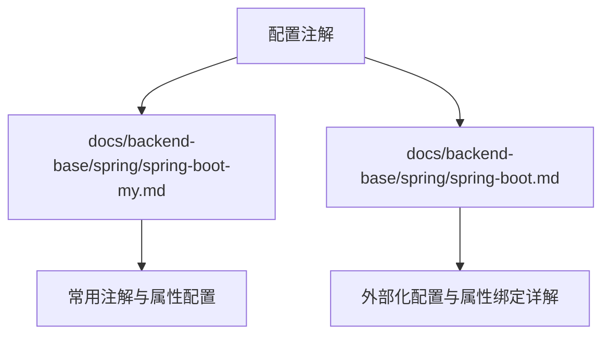
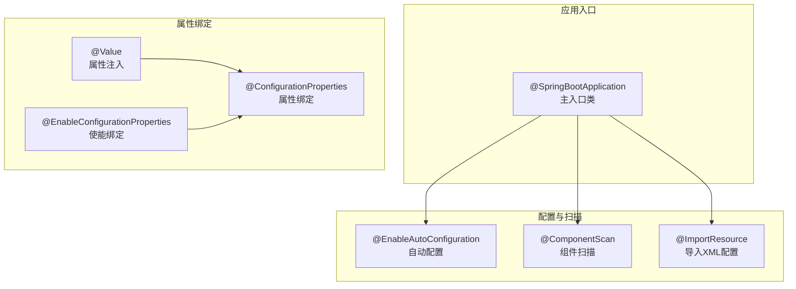
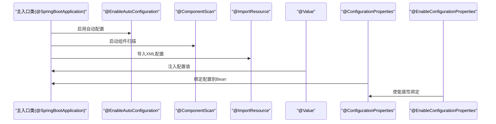

# 配置相关注解

<cite>
**本文档引用的文件**
- [spring-boot-my.md](file://docs/backend-base/spring/spring-boot-my.md)
- [spring-boot.md](file://docs/backend-base/spring/spring-boot.md)
</cite>

## 目录
1. [简介](#简介)
2. [项目结构](#项目结构)
3. [核心组件](#核心组件)
4. [架构概览](#架构概览)
5. [详细组件分析](#详细组件分析)
6. [依赖分析](#依赖分析)
7. [性能考虑](#性能考虑)
8. [故障排查指南](#故障排查指南)
9. [结论](#结论)

## 简介
本文件围绕Spring Boot配置相关注解展开，系统梳理@EnableAutoConfiguration、@ImportResource、@Configuration、@ComponentScan等配置注解的作用与使用方法，并深入讲解@Value、@ConfigurationProperties、@EnableConfigurationProperties等属性绑定注解的使用场景与最佳实践。文档结合仓库中的Spring Boot学习资料，提供可追溯的章节来源与图示，帮助读者在实际项目中正确配置与管理应用属性。

## 项目结构
本项目为知识库文档结构，与Spring Boot配置注解相关的资料集中在docs/backend-base/spring目录下的两篇Markdown文档中：
- spring-boot-my.md：涵盖常用注解与属性配置要点
- spring-boot.md：涵盖外部化配置、@Value、@ConfigurationProperties、@ImportResource等详细内容

**图表来源**
- [spring-boot-my.md:1-647](file://docs/backend-base/spring/spring-boot-my.md#L1-L647)
- [spring-boot.md:1-800](file://docs/backend-base/spring/spring-boot.md#L1-L800)

**章节来源**
- [spring-boot-my.md:1-647](file://docs/backend-base/spring/spring-boot-my.md#L1-L647)
- [spring-boot.md:1-800](file://docs/backend-base/spring/spring-boot.md#L1-L800)

## 核心组件
本节聚焦Spring Boot配置注解的关键作用与使用方式：

- @SpringBootApplication
  - 作为主入口类注解，组合了@ImportResource、@EnableAutoConfiguration、@ComponentScan等能力，用于启动Spring Boot应用。
  - 参考：[spring-boot-my.md:45-66](file://docs/backend-base/spring/spring-boot-my.md#L45-L66)

- @EnableAutoConfiguration
  - 启用自动配置，依据类路径依赖自动装配Bean，减少手工配置。
  - 参考：[spring-boot-my.md:68-71](file://docs/backend-base/spring/spring-boot-my.md#L68-L71)

- @ImportResource
  - 导入XML配置文件，常置于主入口类上，用于兼容传统Spring XML配置。
  - 参考：[spring-boot-my.md:72-80](file://docs/backend-base/spring/spring-boot-my.md#L72-L80)

- @Configuration
  - 标识配置类，可配合@Bean定义Bean；也可用于@ConfigurationProperties绑定。
  - 参考：[spring-boot-my.md:196-214](file://docs/backend-base/spring/spring-boot-my.md#L196-L214)

- @ComponentScan
  - 启动组件扫描，默认扫描主入口类所在包及子包。
  - 参考：[spring-boot-my.md:184-191](file://docs/backend-base/spring/spring-boot-my.md#L184-L191)

- @Value
  - 将配置文件中的属性注入到字段或方法参数，支持默认值。
  - 参考：[spring-boot-my.md:82-91](file://docs/backend-base/spring/spring-boot-my.md#L82-L91)

- @ConfigurationProperties
  - 将配置文件前缀映射到Bean属性，支持简单、嵌套、集合等类型绑定。
  - 参考：[spring-boot-my.md:93-106](file://docs/backend-base/spring/spring-boot-my.md#L93-L106)

- @EnableConfigurationProperties
  - 使能@ConfigurationProperties注解生效，或将属性类纳入IoC容器。
  - 参考：[spring-boot-my.md:93-106](file://docs/backend-base/spring/spring-boot-my.md#L93-L106)

**章节来源**
- [spring-boot-my.md:45-106](file://docs/backend-base/spring/spring-boot-my.md#L45-L106)

## 架构概览
下图展示了Spring Boot主入口类如何通过组合注解实现自动配置与组件扫描，并通过@ImportResource导入XML配置，以及属性绑定注解在配置流程中的位置。

**图表来源**
- [spring-boot-my.md:45-106](file://docs/backend-base/spring/spring-boot-my.md#L45-L106)

**章节来源**
- [spring-boot-my.md:45-106](file://docs/backend-base/spring/spring-boot-my.md#L45-L106)

## 详细组件分析

### @SpringBootApplication 注解分析
- 组合能力
  - @SpringBootConfiguration：标识主配置类，允许通过@Bean注册Bean。
  - @EnableAutoConfiguration：启用自动配置。
  - @ComponentScan：默认扫描主入口类所在包及子包。
- 使用建议
  - 主入口类应位于合适的基础包，避免扫描遗漏。
  - 可通过scanBasePackages自定义扫描范围。
- 参考路径
  - [spring-boot-my.md:45-66](file://docs/backend-base/spring/spring-boot-my.md#L45-L66)
  - [spring-boot.md:560-598](file://docs/backend-base/spring/spring-boot.md#L560-L598)

**章节来源**
- [spring-boot-my.md:45-66](file://docs/backend-base/spring/spring-boot-my.md#L45-L66)
- [spring-boot.md:560-598](file://docs/backend-base/spring/spring-boot.md#L560-L598)

### @EnableAutoConfiguration 注解分析
- 作用
  - 根据类路径依赖自动装配Bean，减少手工配置。
- 实现机制
  - 通过@Import导入AutoConfigurationImportSelector，收集并筛选自动配置类。
- 参考路径
  - [spring-boot-my.md:68-71](file://docs/backend-base/spring/spring-boot-my.md#L68-L71)
  - [spring-boot.md:3722-3847](file://docs/backend-base/spring/spring-boot.md#L3722-L3847)

**章节来源**
- [spring-boot-my.md:68-71](file://docs/backend-base/spring/spring-boot-my.md#L68-L71)
- [spring-boot.md:3722-3847](file://docs/backend-base/spring/spring-boot.md#L3722-L3847)

### @ImportResource 注解分析
- 作用
  - 导入XML配置文件，将XML中定义的Bean纳入IoC容器。
- 使用场景
  - 从传统Spring迁移或保留已有XML配置。
- 参考路径
  - [spring-boot-my.md:72-80](file://docs/backend-base/spring/spring-boot-my.md#L72-L80)
  - [spring-boot.md:1766-1851](file://docs/backend-base/spring/spring-boot.md#L1766-L1851)

**章节来源**
- [spring-boot-my.md:72-80](file://docs/backend-base/spring/spring-boot-my.md#L72-L80)
- [spring-boot.md:1766-1851](file://docs/backend-base/spring/spring-boot.md#L1766-L1851)

### @Configuration 注解分析
- 作用
  - 标识配置类，可配合@Bean定义Bean；也可用于@ConfigurationProperties绑定。
- 参考路径
  - [spring-boot-my.md:196-214](file://docs/backend-base/spring/spring-boot-my.md#L196-L214)
  - [spring-boot.md:1267-1290](file://docs/backend-base/spring/spring-boot.md#L1267-L1290)

**章节来源**
- [spring-boot-my.md:196-214](file://docs/backend-base/spring/spring-boot-my.md#L196-L214)
- [spring-boot.md:1267-1290](file://docs/backend-base/spring/spring-boot.md#L1267-L1290)

### @ComponentScan 注解分析
- 作用
  - 启动组件扫描，默认扫描主入口类所在包及子包。
- 参考路径
  - [spring-boot-my.md:184-191](file://docs/backend-base/spring/spring-boot-my.md#L184-L191)
  - [spring-boot.md:618-669](file://docs/backend-base/spring/spring-boot.md#L618-L669)

**章节来源**
- [spring-boot-my.md:184-191](file://docs/backend-base/spring/spring-boot-my.md#L184-L191)
- [spring-boot.md:618-669](file://docs/backend-base/spring/spring-boot.md#L618-L669)

### @Value 注解分析
- 作用
  - 将application.properties/yml中的配置注入到字段或方法参数，支持默认值。
- 使用要点
  - 语法：@Value("${key:default}")，支持默认值。
- 参考路径
  - [spring-boot-my.md:82-91](file://docs/backend-base/spring/spring-boot-my.md#L82-L91)
  - [spring-boot.md:824-924](file://docs/backend-base/spring/spring-boot.md#L824-L924)

**章节来源**
- [spring-boot-my.md:82-91](file://docs/backend-base/spring/spring-boot-my.md#L82-L91)
- [spring-boot.md:824-924](file://docs/backend-base/spring/spring-boot.md#L824-L924)

### @ConfigurationProperties 注解分析
- 作用
  - 将配置文件前缀映射到Bean属性，支持简单、嵌套、集合等类型绑定。
- 使用方式
  - 与@Component/@Configuration配合使用。
  - 通过@EnableConfigurationProperties或@ConfigurationPropertiesScan使能。
- 参考路径
  - [spring-boot-my.md:93-106](file://docs/backend-base/spring/spring-boot-my.md#L93-L106)
  - [spring-boot.md:1186-1611](file://docs/backend-base/spring/spring-boot.md#L1186-L1611)

**章节来源**
- [spring-boot-my.md:93-106](file://docs/backend-base/spring/spring-boot-my.md#L93-L106)
- [spring-boot.md:1186-1611](file://docs/backend-base/spring/spring-boot.md#L1186-L1611)

### @EnableConfigurationProperties 注解分析
- 作用
  - 使能@ConfigurationProperties注解生效，或将属性类纳入IoC容器。
- 参考路径
  - [spring-boot-my.md:93-106](file://docs/backend-base/spring/spring-boot-my.md#L93-L106)
  - [spring-boot.md:1433-1466](file://docs/backend-base/spring/spring-boot.md#L1433-L1466)

**章节来源**
- [spring-boot-my.md:93-106](file://docs/backend-base/spring/spring-boot-my.md#L93-L106)
- [spring-boot.md:1433-1466](file://docs/backend-base/spring/spring-boot.md#L1433-L1466)

## 依赖分析
下图展示Spring Boot配置注解在应用启动与配置流程中的依赖关系与调用顺序。

**图表来源**
- [spring-boot-my.md:45-106](file://docs/backend-base/spring/spring-boot-my.md#L45-L106)
- [spring-boot.md:824-1611](file://docs/backend-base/spring/spring-boot.md#L824-L1611)

**章节来源**
- [spring-boot-my.md:45-106](file://docs/backend-base/spring/spring-boot-my.md#L45-L106)
- [spring-boot.md:824-1611](file://docs/backend-base/spring/spring-boot.md#L824-L1611)

## 性能考虑
- 自动配置按需加载
  - Spring Boot通过条件注解实现按需加载，仅在满足条件时创建Bean，减少不必要的初始化开销。
  - 参考：[spring-boot.md:3651-3667](file://docs/backend-base/spring/spring-boot.md#L3651-L3667)
- 组件代理与性能
  - @ConfigurationProperties默认生成代理对象，可通过proxyBeanMethods=false关闭代理以提升性能。
  - 参考：[spring-boot.md:1291-1302](file://docs/backend-base/spring/spring-boot.md#L1291-L1302)

**章节来源**
- [spring-boot.md:3651-3667](file://docs/backend-base/spring/spring-boot.md#L3651-L3667)
- [spring-boot.md:1291-1302](file://docs/backend-base/spring/spring-boot.md#L1291-L1302)

## 故障排查指南
- 组件扫描范围问题
  - 若Bean未被纳入IoC容器，检查主入口类包位置与@ComponentScan范围。
  - 参考：[spring-boot.md:618-669](file://docs/backend-base/spring/spring-boot.md#L618-L669)
- @Value默认值与配置缺失
  - 当配置缺失时，@Value支持默认值，避免注入失败。
  - 参考：[spring-boot.md:882-924](file://docs/backend-base/spring/spring-boot.md#L882-L924)
- @ConfigurationProperties绑定失败
  - 确保Bean具备setter方法、属性名与配置键一致，并通过@EnableConfigurationProperties或@ConfigurationPropertiesScan使能。
  - 参考：[spring-boot.md:1186-1611](file://docs/backend-base/spring/spring-boot.md#L1186-L1611)
- XML配置未生效
  - 检查@ImportResource路径与文件位置，确认XML中Bean定义正确。
  - 参考：[spring-boot.md:1766-1851](file://docs/backend-base/spring/spring-boot.md#L1766-L1851)

**章节来源**
- [spring-boot.md:618-669](file://docs/backend-base/spring/spring-boot.md#L618-L669)
- [spring-boot.md:882-924](file://docs/backend-base/spring/spring-boot.md#L882-L924)
- [spring-boot.md:1186-1611](file://docs/backend-base/spring/spring-boot.md#L1186-L1611)
- [spring-boot.md:1766-1851](file://docs/backend-base/spring/spring-boot.md#L1766-L1851)

## 结论
通过组合使用@EnableAutoConfiguration、@ImportResource、@Configuration、@ComponentScan等注解，Spring Boot实现了“约定优于配置”的开发体验；配合@Value、@ConfigurationProperties、@EnableConfigurationProperties等属性绑定注解，可灵活地将配置文件中的键值映射到Bean属性，满足多样化的配置管理需求。在实际项目中，建议：
- 合理规划主入口类包结构，确保组件扫描覆盖所需范围；
- 使用@EnableConfigurationProperties或@ConfigurationPropertiesScan简化属性绑定；
- 通过默认值与条件注解提升配置健壮性与可维护性。