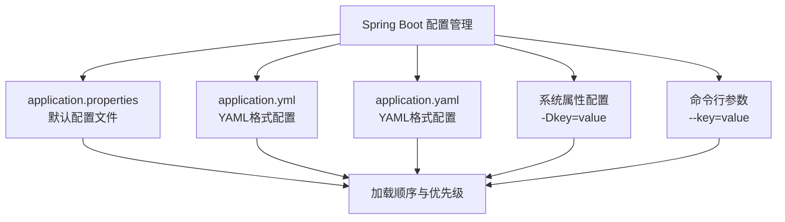
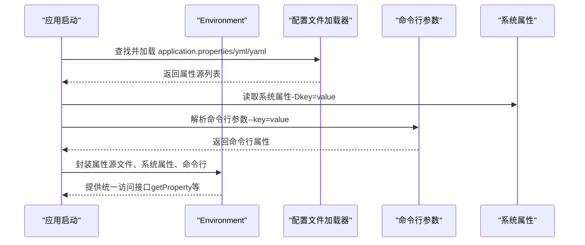
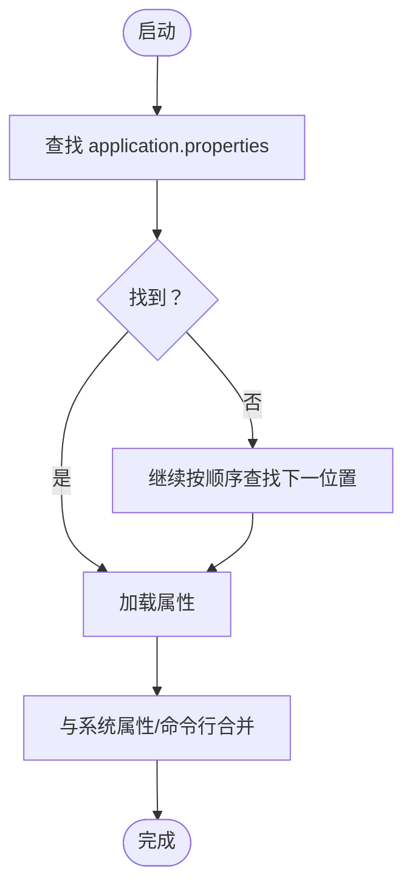
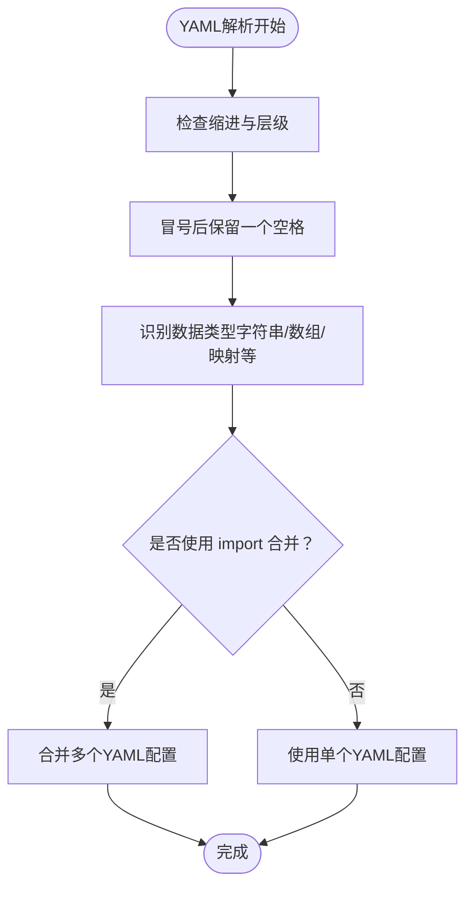
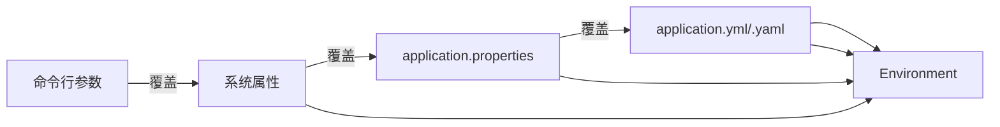

# 配置管理

<cite>
**本文引用的文件**
- [spring-boot-my.md](file://docs/backend-base/spring/spring-boot-my.md)
- [spring-boot.md](file://docs/backend-base/spring/spring-boot.md)
</cite>

## 目录
1. [简介](#简介)
2. [项目结构](#项目结构)
3. [核心组件](#核心组件)
4. [架构总览](#架构总览)
5. [详细组件分析](#详细组件分析)
6. [依赖分析](#依赖分析)
7. [性能考虑](#性能考虑)
8. [故障排查指南](#故障排查指南)
9. [结论](#结论)
10. [附录](#附录)

## 简介
本技术文档围绕Spring Boot的配置管理展开，系统阐述application.properties、application.yml与application.yaml三种配置文件的使用方法、层级结构与缩进规则、属性冒号后的空格要求，以及配置优先级关系。同时，文档详细说明系统属性配置（-Dkey=value）与命令行参数（--key=value）的配置方式与应用场景，并给出最佳实践与性能优化建议。为便于读者快速定位与参考，文档在各章节末尾提供“章节来源”，并在图示下方提供“图表来源”。

## 项目结构
本仓库中与Spring Boot配置管理直接相关的知识主要集中在以下两份文档：
- docs/backend-base/spring/spring-boot-my.md：涵盖参数配置（含三种配置文件与优先级）、常用注解、参数校验、统一异常处理等内容。
- docs/backend-base/spring/spring-boot.md：涵盖application.properties与application.yml的加载顺序、外部化配置、@Value注解、@ConfigurationProperties绑定、Environment环境信息、多环境切换、配置文件合并、命令行参数与系统属性等。



图表来源
- [spring-boot-my.md:第3-41行:3-41](file://docs/backend-base/spring/spring-boot-my.md#L3-L41)
- [spring-boot.md:第795-822行:795-822](file://docs/backend-base/spring/spring-boot.md#L795-L822)

章节来源
- [spring-boot-my.md:第3-41行:3-41](file://docs/backend-base/spring/spring-boot-my.md#L3-L41)
- [spring-boot.md:第795-822行:795-822](file://docs/backend-base/spring/spring-boot.md#L795-L822)

## 核心组件
- 配置文件类型与优先级
  - application.properties > application.yml > application.yaml > application-{env}.yml > application-{env}.yaml
  - 命令行参数 > 系统属性 > properties > yml > yaml
- 外部化配置与加载顺序
  - Spring Boot启动时按固定顺序加载application.properties/yml/yaml，若同一属性在多个位置定义，以最先检查位置为准。
- 注解与绑定
  - @Value用于注入单个属性
  - @ConfigurationProperties用于批量绑定到Bean
  - Environment用于获取环境信息（系统属性、环境变量、命令行参数等）
- 多环境与配置合并
  - 通过spring.profiles.active切换环境
  - 通过spring.config.import或spring.config.import合并多个配置文件

章节来源
- [spring-boot-my.md:第24-41行:24-41](file://docs/backend-base/spring/spring-boot-my.md#L24-L41)
- [spring-boot.md:第804-822行:804-822](file://docs/backend-base/spring/spring-boot.md#L804-L822)
- [spring-boot.md:第1185-1290行:1185-1290](file://docs/backend-base/spring/spring-boot.md#L1185-L1290)
- [spring-boot.md:第1852-1895行:1852-1895](file://docs/backend-base/spring/spring-boot.md#L1852-L1895)
- [spring-boot.md:第1141-1182行:1141-1182](file://docs/backend-base/spring/spring-boot.md#L1141-L1182)
- [spring-boot.md:第1054-1140行:1054-1140](file://docs/backend-base/spring/spring-boot.md#L1054-L1140)

## 架构总览
下图展示了Spring Boot配置加载与优先级的整体流程，包括文件加载顺序、命令行参数与系统属性的介入时机，以及Environment对各类配置源的封装。



图表来源
- [spring-boot.md:第804-822行:804-822](file://docs/backend-base/spring/spring-boot.md#L804-L822)
- [spring-boot.md:第1852-1895行:1852-1895](file://docs/backend-base/spring/spring-boot.md#L1852-L1895)

章节来源
- [spring-boot.md:第804-822行:804-822](file://docs/backend-base/spring/spring-boot.md#L804-L822)
- [spring-boot.md:第1852-1895行:1852-1895](file://docs/backend-base/spring/spring-boot.md#L1852-L1895)

## 详细组件分析

### application.properties 使用与加载顺序
- 默认配置文件，可位于类路径或项目外部，支持外部化配置。
- 加载顺序（从高优先级到低优先级）：
  - 当前工作目录下的 config 子目录
  - 当前工作目录
  - 类路径 /config/
  - 类路径根目录
- 可通过 --spring.config.location 指定自定义位置，覆盖默认位置。
- 使用 @Value 注解注入属性，支持默认值语法。



图表来源
- [spring-boot.md:第804-822行:804-822](file://docs/backend-base/spring/spring-boot.md#L804-L822)
- [spring-boot.md:第824-923行:824-923](file://docs/backend-base/spring/spring-boot.md#L824-L923)

章节来源
- [spring-boot.md:第795-822行:795-822](file://docs/backend-base/spring/spring-boot.md#L795-L822)
- [spring-boot.md:第824-923行:824-923](file://docs/backend-base/spring/spring-boot.md#L824-L923)

### application.yml 与 application.yaml 使用与层级规则
- YAML支持层级结构，使用缩进表示层级，冒号后需保留一个空格。
- 常见数据类型：字符串、数字、布尔、数组、列表、映射等。
- 在同一目录下同时存在 application.properties 与 application.yml 时，Spring Boot优先解析 application.properties。
- 可通过 spring.config.import 或 spring.config.import 合并多个YAML配置文件。



图表来源
- [spring-boot.md:第975-1027行:975-1027](file://docs/backend-base/spring/spring-boot.md#L975-L1027)
- [spring-boot.md:第1030-1052行:1030-1052](file://docs/backend-base/spring/spring-boot.md#L1030-L1052)
- [spring-boot.md:第1107-1140行:1107-1140](file://docs/backend-base/spring/spring-boot.md#L1107-L1140)

章节来源
- [spring-boot.md:第975-1027行:975-1027](file://docs/backend-base/spring/spring-boot.md#L975-L1027)
- [spring-boot.md:第1030-1052行:1030-1052](file://docs/backend-base/spring/spring-boot.md#L1030-L1052)
- [spring-boot.md:第1107-1140行:1107-1140](file://docs/backend-base/spring/spring-boot.md#L1107-L1140)

### 系统属性配置（-Dkey=value）
- 在IDE或命令行中以 -Dkey=value 的形式传入系统属性。
- 优先级低于命令行参数，高于文件配置。
- 适合在启动阶段覆盖某些关键属性，如端口、调试开关等。

章节来源
- [spring-boot-my.md:第28-32行:28-32](file://docs/backend-base/spring/spring-boot-my.md#L28-L32)
- [spring-boot-my.md:第40-41行:40-41](file://docs/backend-base/spring/spring-boot-my.md#L40-L41)

### 命令行参数（--key=value）
- 在启动命令中以 --key=value 的形式传入。
- 优先级最高，会覆盖系统属性与配置文件。
- 适合临时覆盖、灰度发布、多实例差异化配置等场景。

章节来源
- [spring-boot-my.md:第34-38行:34-38](file://docs/backend-base/spring/spring-boot-my.md#L34-L38)
- [spring-boot-my.md:第40-41行:40-41](file://docs/backend-base/spring/spring-boot-my.md#L40-L41)
- [spring-boot.md:第814-822行:814-822](file://docs/backend-base/spring/spring-boot.md#L814-L822)

### 配置绑定与Bean注入
- @Value：单个属性注入，支持默认值。
- @ConfigurationProperties：批量绑定到Bean，支持简单类型、集合、嵌套对象等。
- Environment：统一访问系统属性、环境变量、命令行参数等。

```mermaid
classDiagram
class Environment {
+getActiveProfiles()
+getProperty(key)
}
class ValueInjection {
+@Value("${key}")
}
class BeanBinding {
+@ConfigurationProperties(prefix="app")
}
ValueInjection --> Environment : "读取属性"
BeanBinding --> Environment : "批量绑定"
```

图表来源
- [spring-boot.md:第1852-1895行:1852-1895](file://docs/backend-base/spring/spring-boot.md#L1852-L1895)
- [spring-boot.md:第824-923行:824-923](file://docs/backend-base/spring/spring-boot.md#L824-L923)
- [spring-boot.md:第1185-1290行:1185-1290](file://docs/backend-base/spring/spring-boot.md#L1185-L1290)

章节来源
- [spring-boot.md:第824-923行:824-923](file://docs/backend-base/spring/spring-boot.md#L824-L923)
- [spring-boot.md:第1185-1290行:1185-1290](file://docs/backend-base/spring/spring-boot.md#L1185-L1290)
- [spring-boot.md:第1852-1895行:1852-1895](file://docs/backend-base/spring/spring-boot.md#L1852-L1895)

### 多环境与配置合并
- 多环境：通过 application-{profile}.properties/yml 定义不同环境配置，使用 spring.profiles.active 激活。
- 配置合并：通过 spring.config.import 或 spring.config.import 将多个配置文件合并到主配置中。

章节来源
- [spring-boot.md:第1141-1182行:1141-1182](file://docs/backend-base/spring/spring-boot.md#L1141-L1182)
- [spring-boot.md:第1054-1140行:1054-1140](file://docs/backend-base/spring/spring-boot.md#L1054-L1140)

## 依赖分析
- 配置源之间的耦合关系
  - 文件配置与命令行参数存在覆盖关系，命令行参数优先级最高。
  - 系统属性位于命令行参数与文件配置之间。
  - YAML与Properties在同一目录下时，Properties优先。
- 环境封装
  - Environment统一承载系统属性、环境变量、命令行参数等，为应用提供一致的访问接口。



图表来源
- [spring-boot-my.md:第24-41行:24-41](file://docs/backend-base/spring/spring-boot-my.md#L24-L41)
- [spring-boot.md:第804-822行:804-822](file://docs/backend-base/spring/spring-boot.md#L804-L822)
- [spring-boot.md:第1852-1895行:1852-1895](file://docs/backend-base/spring/spring-boot.md#L1852-L1895)

章节来源
- [spring-boot-my.md:第24-41行:24-41](file://docs/backend-base/spring/spring-boot-my.md#L24-L41)
- [spring-boot.md:第804-822行:804-822](file://docs/backend-base/spring/spring-boot.md#L804-L822)
- [spring-boot.md:第1852-1895行:1852-1895](file://docs/backend-base/spring/spring-boot.md#L1852-L1895)

## 性能考虑
- 配置文件合并与导入
  - 合理拆分配置文件（如按模块或环境）有助于提升可维护性，但应避免过度拆分导致加载链路过长。
- YAML缩进与解析
  - 规范的缩进与空格有助于减少解析错误与调试成本，避免不必要的解析失败。
- 命令行参数覆盖
  - 在生产环境尽量避免频繁通过命令行覆盖关键配置，可通过配置中心或环境变量统一管理，减少启动参数复杂度。
- Environment访问
  - 通过Environment统一访问配置可减少重复解析与缓存开销，建议在需要频繁访问的场景中复用Environment实例。

## 故障排查指南
- 配置未生效
  - 检查配置文件是否位于正确的加载路径（当前工作目录、类路径等）。
  - 确认是否存在同名属性在更高优先级位置被覆盖。
- YAML解析错误
  - 检查缩进是否正确，冒号后是否保留一个空格，同级元素是否左对齐。
- 命令行参数未覆盖
  - 确认命令行参数格式是否正确（--key=value），以及是否在启动时传入。
- 系统属性未生效
  - 确认系统属性格式是否正确（-Dkey=value），并确认启动方式支持该参数传入。
- 多环境切换
  - 确认 spring.profiles.active 的值与目标环境文件名一致，且文件存在于正确路径。

章节来源
- [spring-boot.md:第804-822行:804-822](file://docs/backend-base/spring/spring-boot.md#L804-L822)
- [spring-boot.md:第975-1027行:975-1027](file://docs/backend-base/spring/spring-boot.md#L975-L1027)
- [spring-boot.md:第1141-1182行:1141-1182](file://docs/backend-base/spring/spring-boot.md#L1141-L1182)

## 结论
Spring Boot的配置管理以“约定优于配置”为核心理念，通过明确的加载顺序与优先级体系，结合@Value与@ConfigurationProperties等注解，为应用提供了灵活、可维护的配置能力。合理使用application.properties、application.yml/.yaml、系统属性与命令行参数，并遵循YAML缩进与空格规范，可在保证可读性的同时提升配置管理效率。在生产环境中，建议通过配置中心或环境变量统一管理关键配置，减少命令行覆盖带来的风险。

## 附录
- 最佳实践
  - 将通用配置放入 application.properties，复杂结构放入 application.yml/.yaml。
  - 使用 spring.profiles.active 管理多环境，避免在命令行中频繁覆盖。
  - 使用 @ConfigurationProperties 批量绑定，配合 Environment 统一访问。
  - 规范YAML缩进与空格，避免解析错误。
- 性能优化建议
  - 合理拆分配置文件，避免过度拆分导致加载链路过长。
  - 在高频访问场景中复用Environment实例，减少重复解析。
  - 避免在启动参数中传入大量配置，优先使用配置中心或环境变量。