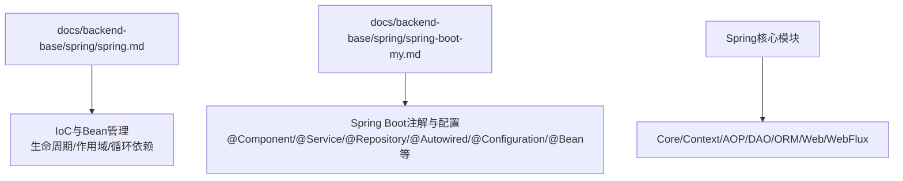
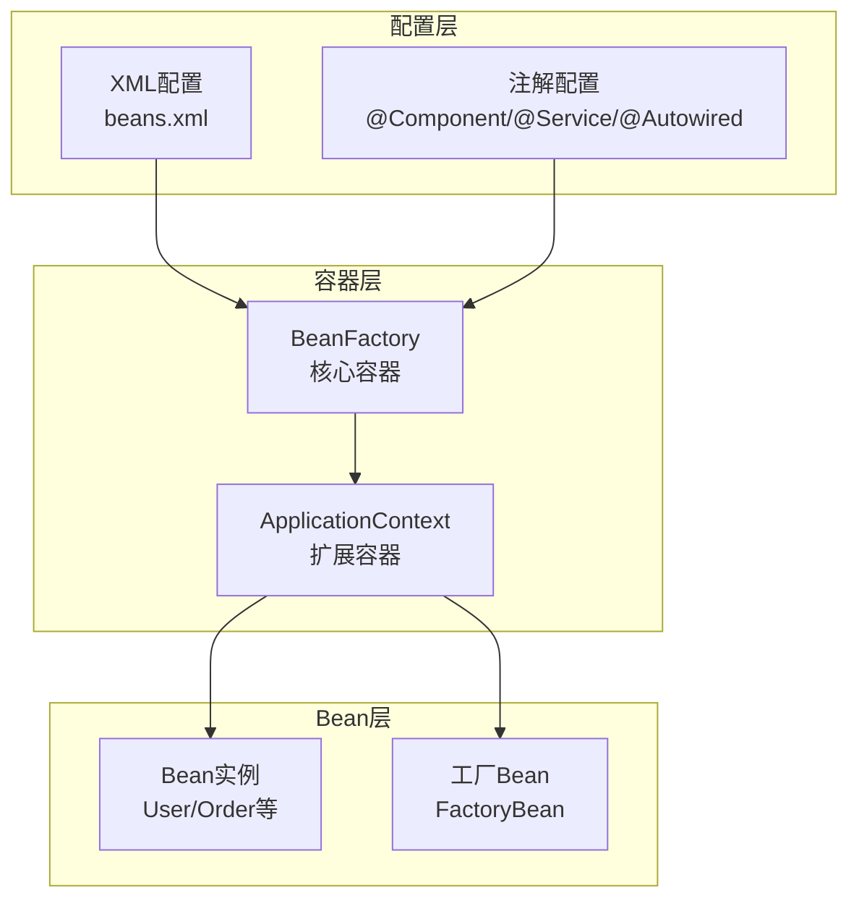
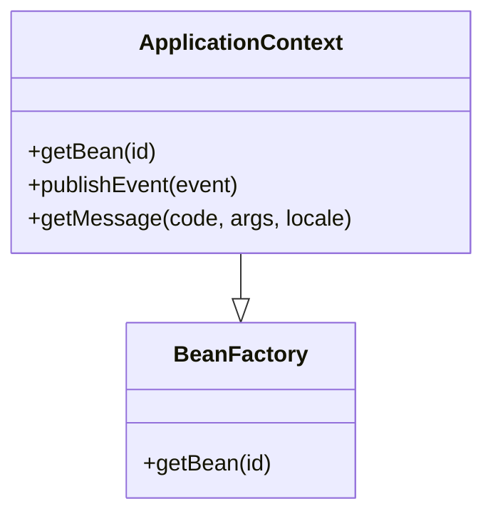
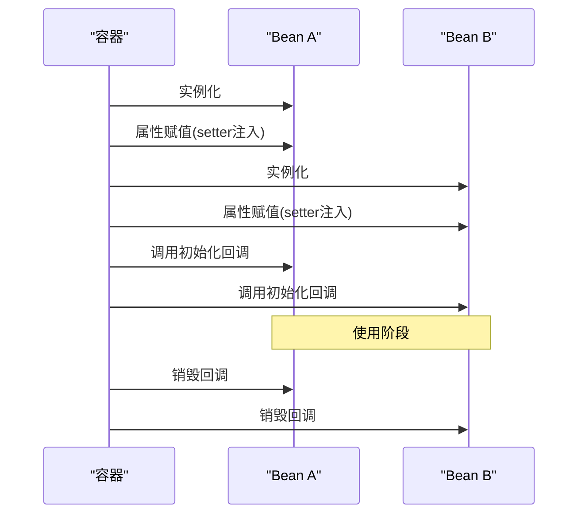
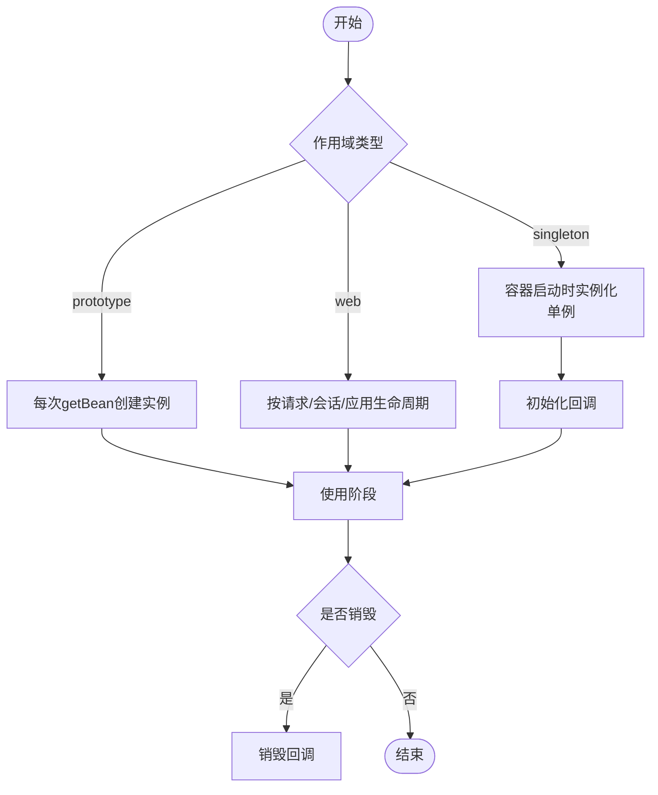
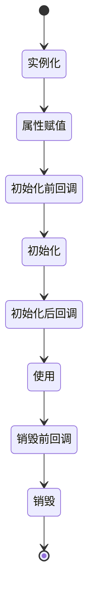
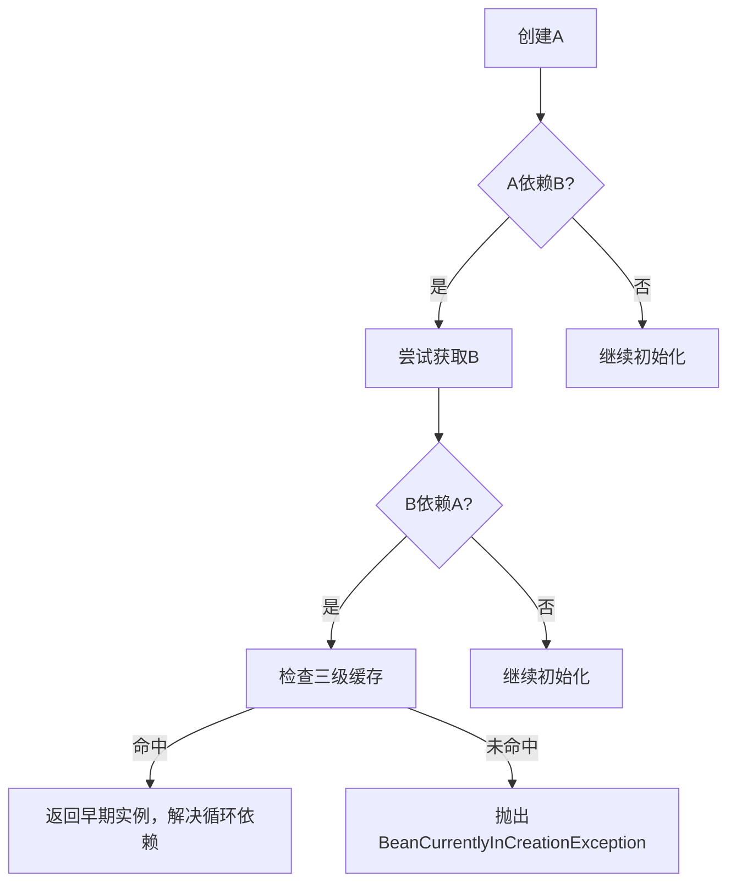
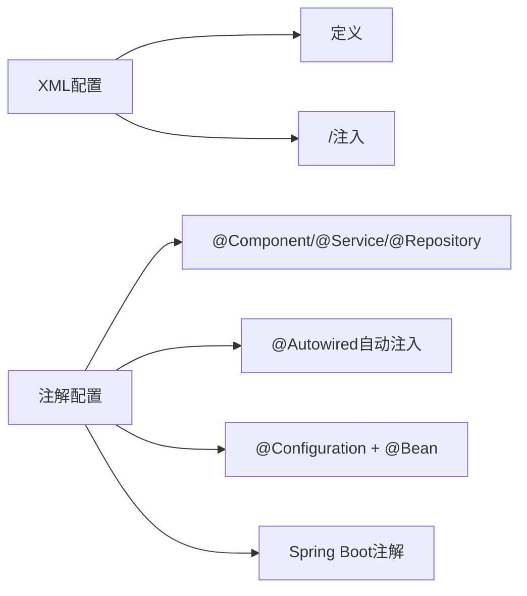
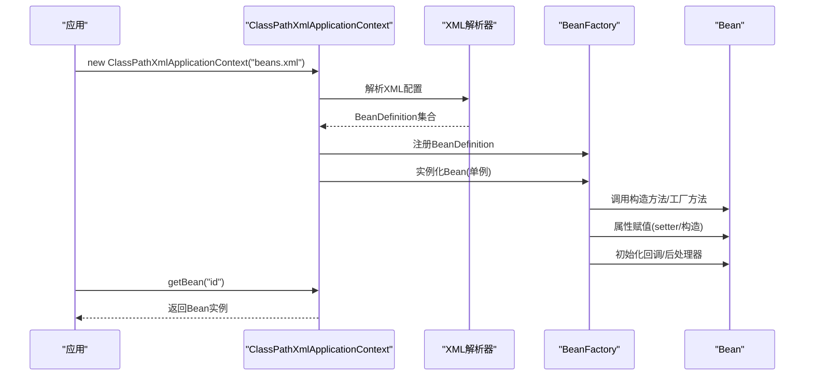
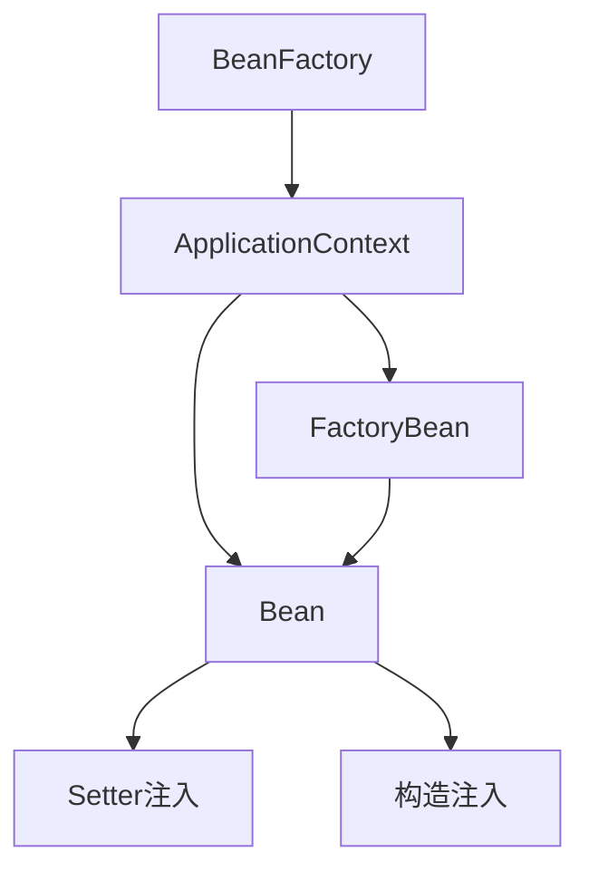

# IoC容器与Bean管理

<cite>
**本文档引用的文件**
- [spring.md](file://docs/backend-base/spring/spring.md)
- [spring-boot-my.md](file://docs/backend-base/spring/spring-boot-my.md)
</cite>

## 目录
1. [引言](#引言)
2. [项目结构](#项目结构)
3. [核心组件](#核心组件)
4. [架构总览](#架构总览)
5. [详细组件分析](#详细组件分析)
6. [依赖分析](#依赖分析)
7. [性能考虑](#性能考虑)
8. [故障排查指南](#故障排查指南)
9. [结论](#结论)
10. [附录](#附录)

## 引言
本技术文档围绕Spring IoC容器与Bean管理展开，系统阐述控制反转（IoC）与依赖注入（DI）的原理、Bean的生命周期与作用域、容器初始化流程、XML与注解两种配置方式，以及在企业级场景中的最佳实践。文档兼顾初学者与高级开发者的需求，既提供概念性理解，也给出深入的技术细节与可视化图示。

## 项目结构
本仓库与Spring IoC相关的核心内容集中在docs/backend-base/spring目录下的两篇文档：
- spring.md：系统讲解IoC、Bean管理、生命周期、作用域、循环依赖、反射机制等
- spring-boot-my.md：补充Spring Boot常用注解与参数配置，便于在现代项目中落地

**章节来源**
- [spring.md:1-120](file://docs/backend-base/spring/spring.md#L1-L120)
- [spring-boot-my.md:43-288](file://docs/backend-base/spring/spring-boot-my.md#L43-L288)

## 核心组件
- IoC容器与BeanFactory
  - BeanFactory是Spring容器的顶级接口，负责Bean的创建与管理；ApplicationContext是其扩展，提供国际化、事件传播、AOP等能力
- 依赖注入（DI）
  - 通过setter方法注入与构造方法注入实现Bean间依赖关系的建立
- Bean的作用域
  - singleton（默认）、prototype、request、session、application、websocket及自定义作用域
- Bean生命周期
  - 实例化、属性赋值、初始化（含Aware回调与BeanPostProcessor）、使用、销毁（含DisposableBean与destroy-method）

**章节来源**
- [spring.md:151-159](file://docs/backend-base/spring/spring.md#L151-L159)
- [spring.md:4016-4026](file://docs/backend-base/spring/spring.md#L4016-L4026)
- [spring.md:2801-2943](file://docs/backend-base/spring/spring.md#L2801-L2943)

## 架构总览
Spring IoC容器通过XML或注解配置Bean，解析配置后完成Bean的实例化、属性注入、初始化与注册，最终对外提供依赖注入能力。ApplicationContext在BeanFactory基础上扩展了更多企业级特性。

**图表来源**
- [spring.md:151-159](file://docs/backend-base/spring/spring.md#L151-L159)
- [spring.md:3818-3887](file://docs/backend-base/spring/spring.md#L3818-L3887)

**章节来源**
- [spring.md:151-159](file://docs/backend-base/spring/spring.md#L151-L159)
- [spring.md:3889-3898](file://docs/backend-base/spring/spring.md#L3889-L3898)

## 详细组件分析

### 1) IoC与BeanFactory、ApplicationContext
- BeanFactory：提供最基本的Bean管理能力，负责实例化、配置与组装Bean
- ApplicationContext：在BeanFactory基础上扩展，提供事件传播、国际化、AOP、Web集成等
- 关系：ApplicationContext继承BeanFactory，具备更丰富的功能

**图表来源**
- [spring.md:151-159](file://docs/backend-base/spring/spring.md#L151-L159)

**章节来源**
- [spring.md:151-159](file://docs/backend-base/spring/spring.md#L151-L159)

### 2) 依赖注入（DI）与装配方式
- setter注入：通过property ref/value完成Bean属性赋值
- 构造注入：通过constructor-arg完成构造方法参数注入
- 自动装配：byName/byType按名称或类型自动装配
- p命名空间与c命名空间：简化setter与构造注入
- util命名空间：复用集合与属性配置

**图表来源**
- [spring.md:896-965](file://docs/backend-base/spring/spring.md#L896-L965)
- [spring.md:1070-1117](file://docs/backend-base/spring/spring.md#L1070-L1117)

**章节来源**
- [spring.md:896-965](file://docs/backend-base/spring/spring.md#L896-L965)
- [spring.md:1070-1117](file://docs/backend-base/spring/spring.md#L1070-L1117)
- [spring.md:2265-2390](file://docs/backend-base/spring/spring.md#L2265-L2390)
- [spring.md:2391-2486](file://docs/backend-base/spring/spring.md#L2391-L2486)
- [spring.md:2488-2696](file://docs/backend-base/spring/spring.md#L2488-L2696)

### 3) Bean的作用域与实例化方式
- 作用域
  - singleton（默认）：容器启动时创建，单例
  - prototype：每次getBean创建新实例
  - WEB相关：request/session/application/websocket/globalSession
  - 自定义作用域
- 实例化方式
  - 构造方法实例化（默认）
  - 简单工厂实例化（factory-method）
  - 工厂Bean实例化（factory-bean + factory-method）
  - FactoryBean接口实例化（getObject/isSingleton）

**图表来源**
- [spring.md:2801-2943](file://docs/backend-base/spring/spring.md#L2801-L2943)
- [spring.md:3657-3887](file://docs/backend-base/spring/spring.md#L3657-L3887)

**章节来源**
- [spring.md:2801-2943](file://docs/backend-base/spring/spring.md#L2801-L2943)
- [spring.md:3657-3887](file://docs/backend-base/spring/spring.md#L3657-L3887)

### 4) Bean生命周期与回调
- 生命周期五步：实例化 → 属性赋值 → 初始化 → 使用 → 销毁
- 生命周期七步：在初始化前后加入BeanPostProcessor回调
- 生命周期十步：Aware接口回调（BeanName/ClassLoader/BeanFactory）与InitializingBean/DisposableBean
- prototype作用域：容器仅负责创建，后续生命周期不由容器管理

**图表来源**
- [spring.md:4016-4026](file://docs/backend-base/spring/spring.md#L4016-L4026)
- [spring.md:4112-4151](file://docs/backend-base/spring/spring.md#L4112-L4151)
- [spring.md:4153-4265](file://docs/backend-base/spring/spring.md#L4153-L4265)

**章节来源**
- [spring.md:4016-4026](file://docs/backend-base/spring/spring.md#L4016-L4026)
- [spring.md:4112-4151](file://docs/backend-base/spring/spring.md#L4112-L4151)
- [spring.md:4153-4265](file://docs/backend-base/spring/spring.md#L4153-L4265)

### 5) 循环依赖与解决机理
- singleton + setter注入：可解决循环依赖，通过三级缓存提前暴露早期Bean实例
- singleton + 构造注入：无法解决，因实例化与属性赋值未分离
- prototype + setter注入：若所有Bean均为prototype，无法解决，抛出BeanCurrentlyInCreationException

**图表来源**
- [spring.md:4348-4663](file://docs/backend-base/spring/spring.md#L4348-L4663)

**章节来源**
- [spring.md:4348-4663](file://docs/backend-base/spring/spring.md#L4348-L4663)

### 6) XML与注解配置对比
- XML配置
  - 通过<bean>、<property>、<constructor-arg>等标签定义Bean与依赖
  - 适合集中式配置与传统项目
- 注解配置
  - @Component/@Service/@Repository/@Controller标注组件
  - @Autowired实现自动注入
  - @Configuration + @Bean定义配置类与Bean
  - Spring Boot常用注解：@SpringBootApplication、@EnableAutoConfiguration、@ImportResource、@Value、@ConfigurationProperties等

**图表来源**
- [spring.md:432-444](file://docs/backend-base/spring/spring.md#L432-L444)
- [spring-boot-my.md:160-173](file://docs/backend-base/spring/spring-boot-my.md#L160-L173)
- [spring-boot-my.md:174-191](file://docs/backend-base/spring/spring-boot-my.md#L174-L191)
- [spring-boot-my.md:192-195](file://docs/backend-base/spring/spring-boot-my.md#L192-L195)
- [spring-boot-my.md:196-214](file://docs/backend-base/spring/spring-boot-my.md#L196-L214)
- [spring-boot-my.md:216-242](file://docs/backend-base/spring/spring-boot-my.md#L216-L242)
- [spring-boot-my.md:243-288](file://docs/backend-base/spring/spring-boot-my.md#L243-L288)

**章节来源**
- [spring.md:432-444](file://docs/backend-base/spring/spring.md#L432-L444)
- [spring-boot-my.md:160-173](file://docs/backend-base/spring/spring-boot-my.md#L160-L173)
- [spring-boot-my.md:174-191](file://docs/backend-base/spring/spring-boot-my.md#L174-L191)
- [spring-boot-my.md:192-195](file://docs/backend-base/spring/spring-boot-my.md#L192-L195)
- [spring-boot-my.md:196-214](file://docs/backend-base/spring/spring-boot-my.md#L196-L214)
- [spring-boot-my.md:216-242](file://docs/backend-base/spring/spring-boot-my.md#L216-L242)
- [spring-boot-my.md:243-288](file://docs/backend-base/spring/spring-boot-my.md#L243-L288)

### 7) 容器初始化与启动流程
- 加载配置：ClassPathXmlApplicationContext加载beans.xml
- 解析配置：dom4j解析XML，反射实例化Bean
- 注册Bean：将Bean放入容器（单例池、早期Bean缓存、工厂缓存）
- 初始化：执行初始化回调与后处理器
- 提供服务：getBean获取Bean并注入依赖

**图表来源**
- [spring.md:477-480](file://docs/backend-base/spring/spring.md#L477-L480)
- [spring.md:555-562](file://docs/backend-base/spring/spring.md#L555-L562)

**章节来源**
- [spring.md:477-480](file://docs/backend-base/spring/spring.md#L477-L480)
- [spring.md:555-562](file://docs/backend-base/spring/spring.md#L555-L562)

### 8) 企业级应用场景与最佳实践
- 应用场景
  - 数据源配置：通过XML或注解注入驱动、URL、用户名、密码
  - 业务组件拆分：Service层、DAO层、Controller层，使用@Component/@Service/@Repository/@Controller
  - 自动装配：@Autowired按类型或@Qualifier按名称限定
  - 配置类：@Configuration + @Bean定义第三方组件或复杂Bean
  - 参数注入：@Value从配置文件注入属性
  - 条件化Bean：@ConditionalOnClass/@ConditionalOnMissingBean等
- 最佳实践
  - 优先使用构造注入保证不可变与强制依赖
  - 避免循环依赖，必要时重构设计
  - singleton单例Bean避免持有可变共享状态
  - 使用@Lazy延迟初始化重型Bean
  - 利用Profile与条件注解实现环境隔离

**章节来源**
- [spring.md:1312-1311](file://docs/backend-base/spring/spring.md#L1312-L1311)
- [spring-boot-my.md:160-173](file://docs/backend-base/spring/spring-boot-my.md#L160-L173)
- [spring-boot-my.md:174-191](file://docs/backend-base/spring/spring-boot-my.md#L174-L191)
- [spring-boot-my.md:192-195](file://docs/backend-base/spring/spring-boot-my.md#L192-L195)
- [spring-boot-my.md:243-288](file://docs/backend-base/spring/spring-boot-my.md#L243-L288)

## 依赖分析
- 组件耦合
  - BeanFactory与ApplicationContext：继承关系，后者依赖前者提供基础设施
  - Bean与依赖：通过setter/构造注入解耦
  - 工厂Bean与普通Bean：工厂Bean用于辅助创建复杂Bean
- 外部依赖
  - Spring核心模块：core、beans、context、expression等
  - 日志：Log4j2集成（spring-boot-my.md中说明）

**图表来源**
- [spring.md:151-159](file://docs/backend-base/spring/spring.md#L151-L159)
- [spring.md:3818-3887](file://docs/backend-base/spring/spring.md#L3818-L3887)

**章节来源**
- [spring.md:151-159](file://docs/backend-base/spring/spring.md#L151-L159)
- [spring.md:3818-3887](file://docs/backend-base/spring/spring.md#L3818-L3887)

## 性能考虑
- 单例Bean复用减少对象创建开销
- 延迟初始化（@Lazy）避免冷启动时的资源占用
- 集合注入优化：util命名空间复用配置，减少重复定义
- Spring 5+对类路径扫描的性能优化（context-indexer）
- 避免深度循环依赖，减少初始化时的回溯成本

[本节为通用指导，不直接分析具体文件]

## 故障排查指南
- getBean时ID不存在：抛出异常，检查配置文件中id是否正确
- 缺少无参构造：无法通过默认构造实例化，需提供无参构造或使用工厂方法
- 循环依赖异常：singleton+构造注入或prototype+setter均可能导致异常，需重构设计
- 销毁方法未执行：仅ClassPathXmlApplicationContext关闭时触发destroy-method，确保正确关闭容器
- 自定义Date注入：Date字符串格式严格，可通过FactoryBean自定义解析策略

**章节来源**
- [spring.md:656-661](file://docs/backend-base/spring/spring.md#L656-L661)
- [spring.md:555-562](file://docs/backend-base/spring/spring.md#L555-L562)
- [spring.md:4524-4532](file://docs/backend-base/spring/spring.md#L4524-L4532)
- [spring.md:4097-4111](file://docs/backend-base/spring/spring.md#L4097-L4111)
- [spring.md:3951-3999](file://docs/backend-base/spring/spring.md#L3951-L3999)

## 结论
Spring IoC容器通过控制反转与依赖注入实现了对象创建与关系维护的解耦，结合生命周期回调、作用域管理与自动装配，为企业级应用提供了强大的基础设施。在实践中，应优先采用构造注入与单例Bean，避免循环依赖，善用注解与条件化配置，结合Spring Boot注解提升开发效率与可维护性。

[本节为总结性内容，不直接分析具体文件]

## 附录
- 参考示例路径（代码片段路径）
  - [XML配置Bean示例:432-444](file://docs/backend-base/spring/spring.md#L432-L444)
  - [setter注入示例:855-891](file://docs/backend-base/spring/spring.md#L855-L891)
  - [构造注入示例:1008-1022](file://docs/backend-base/spring/spring.md#L1008-L1022)
  - [p命名空间注入示例:2302-2322](file://docs/backend-base/spring/spring.md#L2302-L2322)
  - [c命名空间注入示例:2363-2383](file://docs/backend-base/spring/spring.md#L2363-L2383)
  - [util命名空间复用示例:2449-2472](file://docs/backend-base/spring/spring.md#L2449-L2472)
  - [@Bean定义示例:160-173](file://docs/backend-base/spring/spring-boot-my.md#L160-L173)
  - [@Autowired自动注入示例:192-195](file://docs/backend-base/spring/spring-boot-my.md#L192-L195)
  - [@Configuration + @Bean示例:196-214](file://docs/backend-base/spring/spring-boot-my.md#L196-L214)
  - [@ImportResource加载XML示例:72-80](file://docs/backend-base/spring/spring-boot-my.md#L72-L80)
  - [参数注入@Value示例:82-91](file://docs/backend-base/spring/spring-boot-my.md#L82-L91)

[本节为索引性内容，不直接分析具体文件]