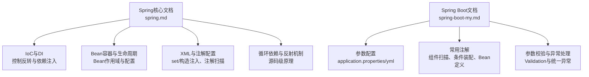
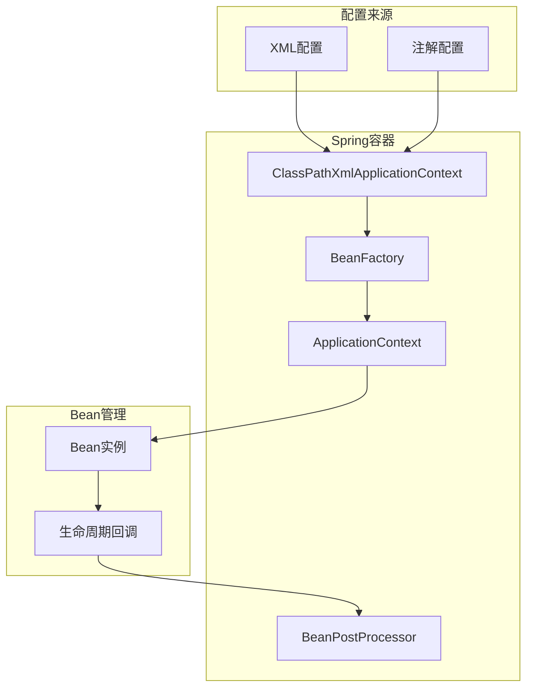
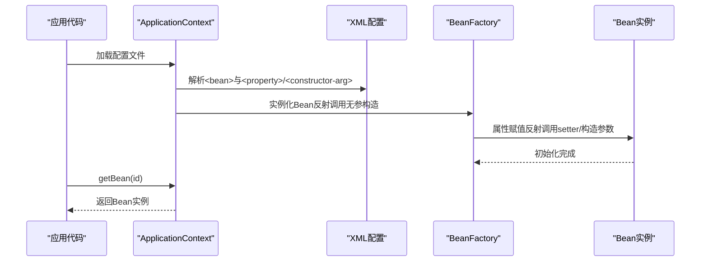
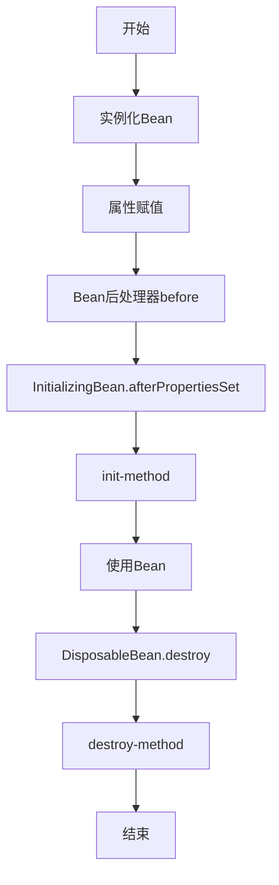
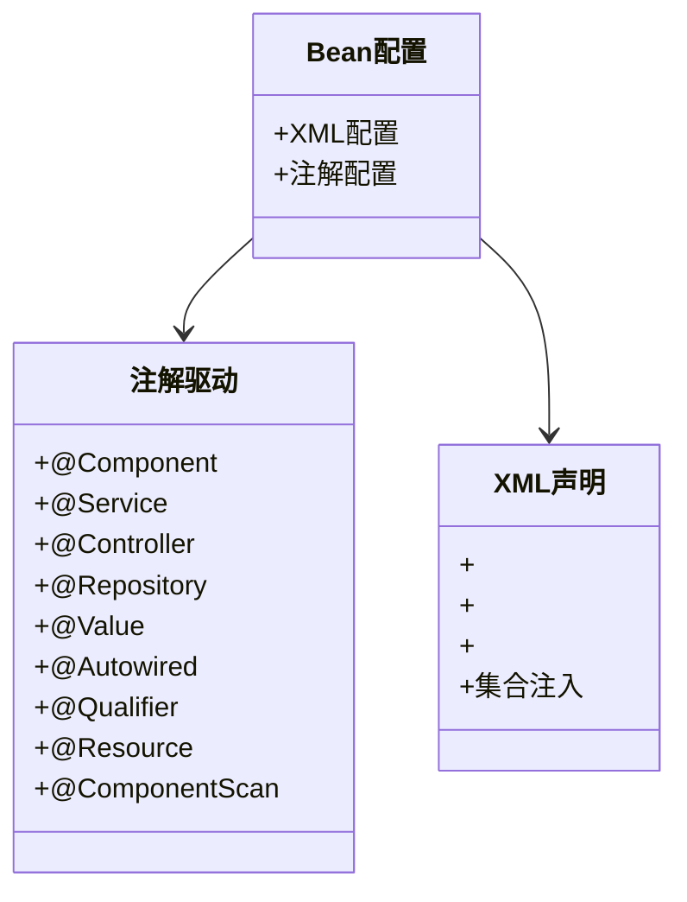
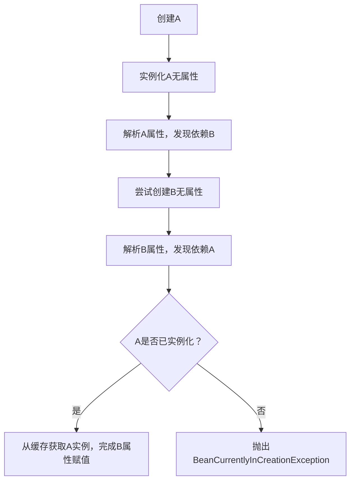
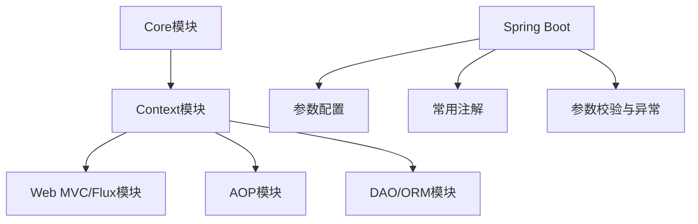

# Spring核心概念

<cite>
**本文档引用的文件**
- [spring.md](file://docs/backend-base/spring/spring.md)
- [spring-boot-my.md](file://docs/backend-base/spring/spring-boot-my.md)
</cite>

## 目录
1. [引言](#引言)
2. [项目结构](#项目结构)
3. [核心组件](#核心组件)
4. [架构总览](#架构总览)
5. [详细组件分析](#详细组件分析)
6. [依赖关系分析](#依赖关系分析)
7. [性能考量](#性能考量)
8. [故障排查指南](#故障排查指南)
9. [结论](#结论)
10. [附录](#附录)

## 引言
本技术文档围绕Spring框架的核心概念展开，系统讲解控制反转（IoC）、依赖注入（DI）、Bean容器、Bean生命周期、作用域与配置方式，并结合XML配置与注解方式给出可操作的示例路径。文档同时覆盖Spring Boot参数配置、常用注解及企业级应用实践，帮助初学者快速建立概念体系，同时为高级开发者提供深入的技术细节与最佳实践。

## 项目结构
本仓库中与Spring相关的知识主要集中在docs/backend-base/spring目录下的两篇文档：
- spring.md：系统讲解Spring IoC、DI、Bean容器、Bean生命周期、作用域、XML与注解配置、循环依赖、反射机制、手写Spring框架等内容。
- spring-boot-my.md：聚焦Spring Boot参数配置、常用注解（如@SpringBootApplication、@EnableAutoConfiguration、@ImportResource、@Value、@ConfigurationProperties、@RestController、@RequestMapping、@RequestParam、@PathVariable、@ResponseBody、@Bean、@Controller/@Service/@Repository/@Component、@ComponentScan、@Autowired、@Configuration、@Import、@ConditionalOnExpression、@ConditionalOnClass、@ConditionalOnProperty、@ConditionOnMissingBean等）及参数校验、统一异常处理等。

**图表来源**
- [spring.md](file://docs/backend-base/spring/spring.md)
- [spring-boot-my.md](file://docs/backend-base/spring/spring-boot-my.md)

**章节来源**
- [spring.md:1-120](file://docs/backend-base/spring/spring.md#L1-L120)
- [spring-boot-my.md:1-60](file://docs/backend-base/spring/spring-boot-my.md#L1-L60)

## 核心组件
- 控制反转（IoC）：将对象的创建权与关系维护权从应用代码中剥离，交由Spring容器管理，降低耦合度，提升可测试性与可维护性。
- 依赖注入（DI）：IoC的具体实现方式，通过set方法注入、构造方法注入等方式完成对象间依赖关系的建立。
- Bean容器：Spring的核心容器，负责Bean的创建、配置、生命周期管理与依赖注入。
- Bean生命周期：实例化、属性赋值、初始化（含Bean后处理器）、使用、销毁（含DisposableBean与destroy-method）。
- Bean作用域：singleton（默认）、prototype、request、session、global session、application、websocket等。
- XML配置与注解配置：XML声明Bean与依赖，注解驱动的组件扫描与自动装配。

**章节来源**
- [spring.md:742-766](file://docs/backend-base/spring/spring.md#L742-L766)
- [spring.md:4002-4026](file://docs/backend-base/spring/spring.md#L4002-L4026)
- [spring.md:2839-2931](file://docs/backend-base/spring/spring.md#L2839-L2931)
- [spring.md:4312-4346](file://docs/backend-base/spring/spring.md#L4312-L4346)

## 架构总览
Spring框架以IoC为核心，通过Bean容器管理Bean的生命周期与依赖关系。容器在启动时解析配置（XML或注解），完成Bean的实例化、属性注入、初始化与注册，运行期间按需提供Bean实例，关闭时触发销毁流程。

**图表来源**
- [spring.md:4002-4026](file://docs/backend-base/spring/spring.md#L4002-L4026)
- [spring.md:4112-4150](file://docs/backend-base/spring/spring.md#L4112-L4150)

## 详细组件分析

### 控制反转与依赖注入
- IoC思想：将对象创建与关系维护权交给容器，遵循依赖倒置原则（DIP）与开闭原则（OCP），降低耦合度。
- DI实现方式：set方法注入、构造方法注入；Spring通过反射机制在运行时调用setter或构造方法完成依赖装配。
- 示例路径（XML配置）：[spring.md:855-893](file://docs/backend-base/spring/spring.md#L855-L893)
- 示例路径（构造注入）：[spring.md:1008-1117](file://docs/backend-base/spring/spring.md#L1008-L1117)

**图表来源**
- [spring.md:855-893](file://docs/backend-base/spring/spring.md#L855-L893)
- [spring.md:1008-1117](file://docs/backend-base/spring/spring.md#L1008-L1117)

**章节来源**
- [spring.md:101-127](file://docs/backend-base/spring/spring.md#L101-L127)
- [spring.md:742-766](file://docs/backend-base/spring/spring.md#L742-L766)

### Bean容器与生命周期
- 生命周期阶段：实例化、属性赋值、Bean后处理器before、InitializingBean.afterPropertiesSet、init-method、使用、Bean后处理器after、DisposableBean.destroy、destroy-method。
- 示例路径（生命周期回调）：[spring.md:4027-4075](file://docs/backend-base/spring/spring.md#L4027-L4075)
- 示例路径（Bean后处理器）：[spring.md:4114-4147](file://docs/backend-base/spring/spring.md#L4114-L4147)
- 示例路径（实现Aware接口与后处理器）：[spring.md:4171-4265](file://docs/backend-base/spring/spring.md#L4171-L4265)

**图表来源**
- [spring.md:4002-4026](file://docs/backend-base/spring/spring.md#L4002-L4026)
- [spring.md:4112-4150](file://docs/backend-base/spring/spring.md#L4112-L4150)
- [spring.md:4171-4265](file://docs/backend-base/spring/spring.md#L4171-L4265)

**章节来源**
- [spring.md:4002-4026](file://docs/backend-base/spring/spring.md#L4002-L4026)
- [spring.md:4112-4150](file://docs/backend-base/spring/spring.md#L4112-L4150)
- [spring.md:4171-4265](file://docs/backend-base/spring/spring.md#L4171-L4265)

### Bean作用域与配置
- 默认作用域：singleton（单例），在容器启动时创建。
- 多例作用域：prototype，每次getBean时创建新实例。
- 其他Web作用域：request、session、application、websocket；portlet专用global session。
- 示例路径（singleton与prototype对比）：[spring.md:2839-2931](file://docs/backend-base/spring/spring.md#L2839-L2931)
- 示例路径（自定义Scope说明）：[spring.md:2945-2946](file://docs/backend-base/spring/spring.md#L2945-L2946)

**章节来源**
- [spring.md:2839-2931](file://docs/backend-base/spring/spring.md#L2839-L2931)
- [spring.md:2933-2944](file://docs/backend-base/spring/spring.md#L2933-L2944)

### XML配置与注解配置
- XML配置：通过<bean>、<property>、<constructor-arg>等标签声明Bean与依赖；支持简单类型、数组、List、Set等集合注入。
- 注解配置：@Component/@Controller/@Service/@Repository声明Bean；@Value注入简单类型；@Autowired/@Qualifier/@Resource完成非简单类型注入；@ComponentScan开启组件扫描。
- 示例路径（XML注入简单类型）：[spring.md:1221-1247](file://docs/backend-base/spring/spring.md#L1221-L1247)
- 示例路径（注解扫描与Bean命名）：[spring.md:5815-5935](file://docs/backend-base/spring/spring.md#L5815-L5935)
- 示例路径（@Autowired与@Qualifier）：[spring.md:6231-6520](file://docs/backend-base/spring/spring.md#L6231-L6520)
- 示例路径（@Resource）：[spring.md:6521-6614](file://docs/backend-base/spring/spring.md#L6521-L6614)

**图表来源**
- [spring.md:5815-5935](file://docs/backend-base/spring/spring.md#L5815-L5935)
- [spring.md:6231-6520](file://docs/backend-base/spring/spring.md#L6231-L6520)
- [spring.md:6521-6614](file://docs/backend-base/spring/spring.md#L6521-L6614)
- [spring.md:1221-1247](file://docs/backend-base/spring/spring.md#L1221-L1247)

**章节来源**
- [spring.md:5815-5935](file://docs/backend-base/spring/spring.md#L5815-L5935)
- [spring.md:6231-6520](file://docs/backend-base/spring/spring.md#L6231-L6520)
- [spring.md:6521-6614](file://docs/backend-base/spring/spring.md#L6521-L6614)
- [spring.md:1221-1247](file://docs/backend-base/spring/spring.md#L1221-L1247)

### 循环依赖与反射机制
- singleton + setter注入：Spring通过三级缓存（单例对象缓存、早期单例对象缓存、单例工厂缓存）解决循环依赖。
- prototype + setter注入：若所有Bean均为prototype，会产生BeanCurrentlyInCreationException。
- 构造注入：在实例化与属性赋值未分离时，无法解决循环依赖。
- 示例路径（singleton + setter循环依赖）：[spring.md:4384-4504](file://docs/backend-base/spring/spring.md#L4384-L4504)
- 示例路径（prototype + setter循环依赖）：[spring.md:4506-4532](file://docs/backend-base/spring/spring.md#L4506-L4532)
- 示例路径（构造注入循环依赖）：[spring.md:4536-4642](file://docs/backend-base/spring/spring.md#L4536-L4642)

**图表来源**
- [spring.md:4384-4504](file://docs/backend-base/spring/spring.md#L4384-L4504)
- [spring.md:4506-4532](file://docs/backend-base/spring/spring.md#L4506-L4532)
- [spring.md:4536-4642](file://docs/backend-base/spring/spring.md#L4536-L4642)

**章节来源**
- [spring.md:4384-4504](file://docs/backend-base/spring/spring.md#L4384-L4504)
- [spring.md:4506-4532](file://docs/backend-base/spring/spring.md#L4506-L4532)
- [spring.md:4536-4642](file://docs/backend-base/spring/spring.md#L4536-L4642)

### Spring Boot参数配置与常用注解
- 参数配置：application.properties、application.yml、application.yaml及其优先级；系统属性与命令行参数。
- 常用注解：@SpringBootApplication、@EnableAutoConfiguration、@ImportResource、@Value、@EnableConfigurationProperties与@ConfigurationProperties、@RestController、@RequestMapping、@RequestParam、@PathVariable、@ResponseBody、@Bean、@Controller/@Service/@Repository/@Component、@ComponentScan、@Autowired、@Configuration、@Import、@ConditionalOnExpression、@ConditionalOnClass、@ConditionalOnProperty、@ConditionOnMissingBean等。
- 参数校验：Spring Validation对hibernate validation的二次封装，支持分组校验与统一异常处理。
- 示例路径（参数配置优先级）：[spring-boot-my.md:24-42](file://docs/backend-base/spring/spring-boot-my.md#L24-L42)
- 示例路径（常用注解汇总）：[spring-boot-my.md:43-288](file://docs/backend-base/spring/spring-boot-my.md#L43-L288)
- 示例路径（参数校验与统一异常）：[spring-boot-my.md:289-647](file://docs/backend-base/spring/spring-boot-my.md#L289-L647)

**章节来源**
- [spring-boot-my.md:24-42](file://docs/backend-base/spring/spring-boot-my.md#L24-L42)
- [spring-boot-my.md:43-288](file://docs/backend-base/spring/spring-boot-my.md#L43-L288)
- [spring-boot-my.md:289-647](file://docs/backend-base/spring/spring-boot-my.md#L289-L647)

## 依赖关系分析
- Spring核心模块：Core、Context、AOP、DAO、ORM、Web MVC、WebFlux、Web。
- Spring Boot模块：参数配置、常用注解、参数校验、统一异常处理。
- 依赖注入与Bean管理：通过XML或注解声明Bean，容器负责实例化、属性注入、生命周期回调与销毁。

**图表来源**
- [spring.md:147-184](file://docs/backend-base/spring/spring.md#L147-L184)
- [spring-boot-my.md:3-42](file://docs/backend-base/spring/spring-boot-my.md#L3-L42)

**章节来源**
- [spring.md:147-184](file://docs/backend-base/spring/spring.md#L147-L184)
- [spring-boot-my.md:3-42](file://docs/backend-base/spring/spring-boot-my.md#L3-L42)

## 性能考量
- 单例Bean：默认单例，减少对象创建与销毁开销，适合无状态或线程安全的组件。
- 多例Bean：每次请求创建新实例，适合有状态或非线程安全组件，但会增加GC压力。
- 条件装配：通过@ConditionalOnClass、@ConditionalOnProperty等减少不必要的Bean创建。
- 日志框架：集成Log4j2可提升可观测性与性能监控能力。
- Web作用域：request/session/application/websocket按需使用，避免不必要的上下文持有。

[本节为通用指导，无需特定文件引用]

## 故障排查指南
- Bean创建异常：确认XML中id唯一、类具备无参构造、类名正确；检查构造参数类型与顺序。
- 循环依赖：singleton + setter注入可解决；prototype或构造注入可能导致异常。
- 注入失败：@Autowired默认按类型装配，存在多个候选时需配合@Qualifier按名称装配；@Resource默认按名称装配，未指定时回退按类型。
- 生命周期回调：确保init-method/destroy-method与实现的InitializingBean/DisposableBean方法顺序正确。
- 日志与诊断：启用Log4j2，观察容器启动与Bean生命周期关键节点日志。

**章节来源**
- [spring.md:506-554](file://docs/backend-base/spring/spring.md#L506-L554)
- [spring.md:4524-4532](file://docs/backend-base/spring/spring.md#L4524-L4532)
- [spring.md:6474-6520](file://docs/backend-base/spring/spring.md#L6474-L6520)
- [spring.md:4196-4202](file://docs/backend-base/spring/spring.md#L4196-L4202)
- [spring.md:695-742](file://docs/backend-base/spring/spring.md#L695-L742)

## 结论
Spring通过IoC与DI实现了对象创建与关系管理的解耦，Bean容器贯穿Bean的生命周期，提供灵活的配置方式（XML与注解）。理解Bean作用域、生命周期与循环依赖的解决机制，有助于在企业级应用中构建高内聚、低耦合、可维护的系统。结合Spring Boot的参数配置与常用注解，可快速落地现代化应用开发。

[本节为总结性内容，无需特定文件引用]

## 附录
- 企业级应用场景与最佳实践
  - 使用单例Bean承载无状态服务，避免共享可变状态；必要时使用原型Bean或线程局部变量。
  - 利用@ConditionalOnClass/@ConditionalOnProperty实现环境适配与功能开关。
  - 通过@ImportResource与@Import整合XML与Java配置，保持灵活性。
  - 使用Spring Validation与统一异常处理提升接口健壮性与一致性。
  - 合理划分模块与包，使用@ComponentScan精准扫描，避免过度扫描带来的性能损耗。

**章节来源**
- [spring-boot-my.md:43-288](file://docs/backend-base/spring/spring-boot-my.md#L43-L288)
- [spring-boot-my.md:289-647](file://docs/backend-base/spring/spring-boot-my.md#L289-L647)