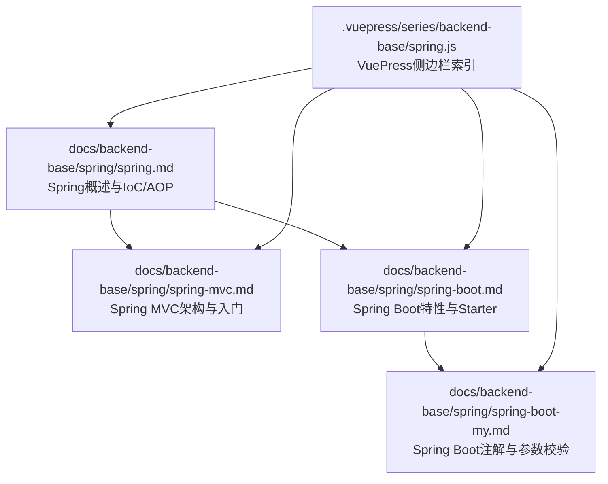
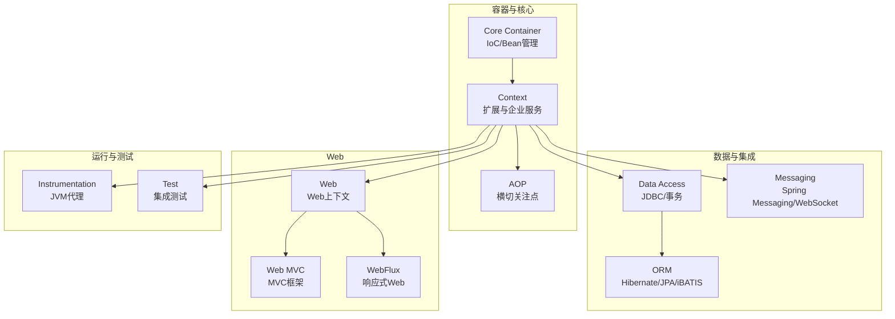
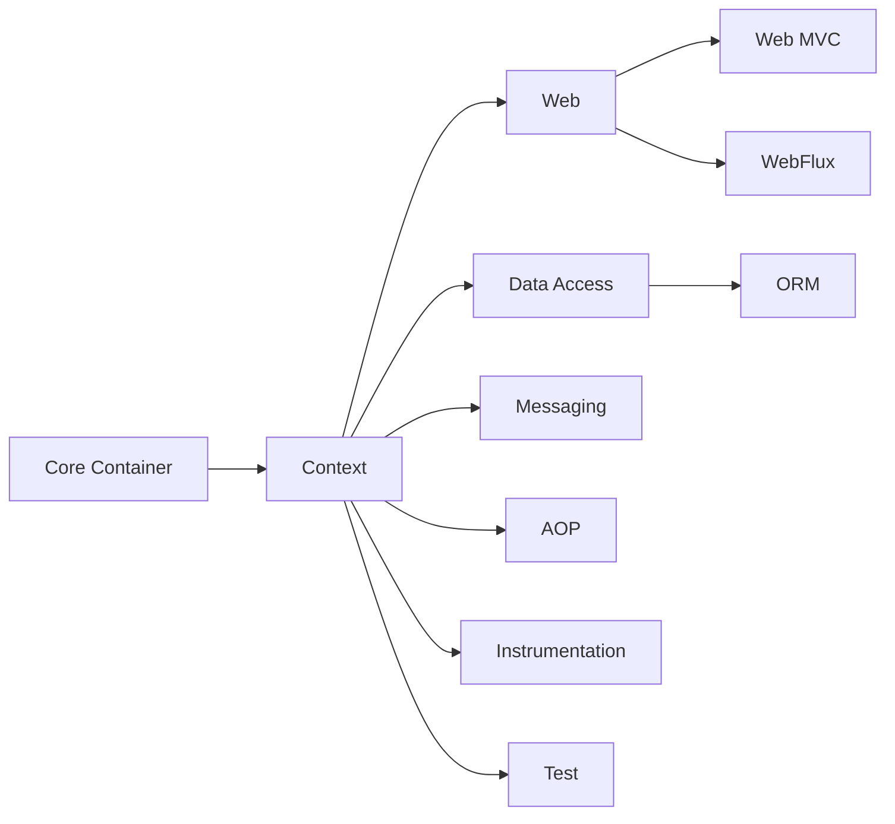

# Spring框架模块

<cite>
**本文引用的文件**
- [spring.md](file://docs/backend-base/spring/spring.md)
- [spring-mvc.md](file://docs/backend-base/spring/spring-mvc.md)
- [spring-boot.md](file://docs/backend-base/spring/spring-boot.md)
- [spring-boot-my.md](file://docs/backend-base/spring/spring-boot-my.md)
- [spring.js](file://.vuepress/series/backend-base/spring.js)
</cite>

## 目录
1. [引言](#引言)
2. [项目结构](#项目结构)
3. [核心模块总览](#核心模块总览)
4. [架构总览](#架构总览)
5. [详细模块分析](#详细模块分析)
6. [依赖关系分析](#依赖关系分析)
7. [性能与扩展性考量](#性能与扩展性考量)
8. [故障排查与最佳实践](#故障排查与最佳实践)
9. [结论](#结论)
10. [附录：模块选择与使用指南](#附录模块选择与使用指南)

## 引言
本技术文档围绕Spring框架的8大模块展开，结合仓库内的Spring相关文档，系统梳理各模块的功能定位、组成、依赖关系与协作方式，并提供模块选择指南与最佳实践。读者可据此在不同业务场景下选择合适的模块组合，实现从入门到进阶的渐进式掌握。

## 项目结构
本仓库与Spring相关的文档集中在docs/backend-base/spring目录，涵盖：
- Spring核心与IoC/AOP基础
- Spring MVC
- Spring Boot与外部化配置
- Spring Boot常用注解与参数校验
- VuePress侧边栏对Spring系列的组织

图表来源
- [spring.md:135-183](file://docs/backend-base/spring/spring.md#L135-L183)
- [spring-mvc.md:31-43](file://docs/backend-base/spring/spring-mvc.md#L31-L43)
- [spring-boot.md:1-20](file://docs/backend-base/spring/spring-boot.md#L1-L20)
- [spring-boot-my.md:1-20](file://docs/backend-base/spring/spring-boot-my.md#L1-L20)
- [spring.js:1-3](file://.vuepress/series/backend-base/spring.js#L1-L3)

章节来源
- [spring.md:1-100](file://docs/backend-base/spring/spring.md#L1-L100)
- [spring-mvc.md:1-100](file://docs/backend-base/spring/spring-mvc.md#L1-L100)
- [spring-boot.md:1-100](file://docs/backend-base/spring/spring-boot.md#L1-L100)
- [spring-boot-my.md:1-100](file://docs/backend-base/spring/spring-boot-my.md#L1-L100)
- [spring.js:1-3](file://.vuepress/series/backend-base/spring.js#L1-L3)

## 核心模块总览
Spring 5版本起包含8个核心模块，覆盖容器、Web、AOP、数据访问、消息、测试等关键领域。下表给出模块定位与职责概览（依据仓库文档整理）：

- Core Container（核心容器）
  - BeanFactory与IoC容器
  - 上下文扩展（国际化、事件、验证、企业服务）
- Web（Web上下文与MVC/WebFlux）
  - Web MVC与WebFlux
  - Web上下文与集成
- AOP（面向切面编程）
  - 事务管理、日志、拦截器等横切关注点
- Data Access/Integration（数据访问与集成）
  - JDBC抽象、ORM集成（Hibernate/JPA/iBATIS）、事务管理
- Messaging（消息）
  - Spring Messaging与WebSocket
- Instrumentation（仪表化）
  - JVM代理与监测
- Test（测试）
  - 集成测试与Mock支持

章节来源
- [spring.md:147-183](file://docs/backend-base/spring/spring.md#L147-L183)

## 架构总览
Spring框架以IoC为核心，通过容器管理Bean生命周期与依赖关系；AOP提供横切能力；Web模块提供MVC与响应式Web；Data Access模块简化持久层；Messaging与Instrumentation完善生态；Test模块支撑测试策略。

图表来源
- [spring.md:147-183](file://docs/backend-base/spring/spring.md#L147-L183)

## 详细模块分析

### Core Container（核心容器）
- 职责：提供IoC与Bean管理，承载应用配置与依赖注入。
- 关键点：BeanFactory作为工厂模式实现；ApplicationContext扩展BeanFactory，增加国际化、事件、验证、企业服务等。
- 与Web/AOP/Test的关系：为Web MVC/WebFlux提供容器基础；为AOP提供Bean生命周期管理；为Test提供上下文与Bean检索。

章节来源
- [spring.md:147-159](file://docs/backend-base/spring/spring.md#L147-L159)

### Context（应用上下文）
- 职责：扩展BeanFactory，提供国际化、事件传播、验证、企业服务（JNDI、EJB、远程、调度）与模板框架集成。
- 与Core Container关系：上下文模块建立在核心容器之上，提供更高层的能力。

章节来源
- [spring.md:155-159](file://docs/backend-base/spring/spring.md#L155-L159)

### AOP（面向切面编程）
- 职责：提供事务管理、日志、拦截器等横切关注点，支持基于Spring的应用对象的声明式事务管理。
- 与IoC关系：AOP依赖容器管理的Bean，通过IoC注入实现横切逻辑织入。

章节来源
- [spring.md:160-163](file://docs/backend-base/spring/spring.md#L160-L163)

### Data Access/Integration（数据访问与集成）
- JDBC抽象与异常层次：简化JDBC，消除厂商特定错误代码解析。
- ORM集成：支持Hibernate、JPA、iBATIS等，遵循统一事务与DAO异常层次。
- 事务管理：统一声明式与编程式事务管理。

章节来源
- [spring.md:164-171](file://docs/backend-base/spring/spring.md#L164-L171)

### Web（Web上下文与MVC/WebFlux）
- Web上下文：在应用上下文之上提供Web应用上下文，集成其他Web框架，支持文件上传multipart请求。
- Web MVC：MVC框架，控制逻辑与业务对象分离，与IoC结合。
- WebFlux：响应式Web框架，非阻塞、背压、支持Netty/Undertow/Servlet 3.1+。

章节来源
- [spring.md:172-183](file://docs/backend-base/spring/spring.md#L172-L183)
- [spring-mvc.md:31-43](file://docs/backend-base/spring/spring-mvc.md#L31-L43)

### Messaging（消息）
- 职责：提供消息API与协议支持，集成WebSocket等。
- 与Web关系：Web模块建立在应用上下文之上，提供Web上下文与消息集成。

章节来源
- [spring.md:172-183](file://docs/backend-base/spring/spring.md#L172-L183)

### Instrumentation（仪表化）
- 职责：JVM代理与监测支持，便于运行时诊断与性能分析。

章节来源
- [spring.md:172-183](file://docs/backend-base/spring/spring.md#L172-L183)

### Test（测试）
- 职责：提供集成测试支持，简化JUnit等测试框架使用，支持Mock与上下文加载。

章节来源
- [spring-boot-my.md:671-762](file://docs/backend-base/spring/spring-boot-my.md#L671-L762)

## 依赖关系分析
- 模块间依赖
  - Core Container是基础，Context在其之上扩展。
  - Web模块依赖Context，MVC/WebFlux均建立在Web上下文之上。
  - Data Access/Integration依赖Context与AOP（事务管理）。
  - Messaging与Instrumentation作为补充模块。
  - Test模块依赖Context与Web（集成测试）。
- Maven依赖与Starter
  - Spring Boot通过Starter聚合依赖，简化版本管理与自动配置。
  - Web开发引入spring-boot-starter-web，自动包含Spring MVC与嵌入式容器。

图表来源
- [spring.md:147-183](file://docs/backend-base/spring/spring.md#L147-L183)
- [spring-boot.md:503-536](file://docs/backend-base/spring/spring-boot.md#L503-L536)

章节来源
- [spring-boot.md:503-536](file://docs/backend-base/spring/spring-boot.md#L503-L536)

## 性能与扩展性考量
- 轻量与非侵入：Spring强调轻量与非侵入，降低框架对业务代码的耦合。
- 控制反转与AOP：通过IoC与AOP实现松耦合，便于扩展与测试。
- 响应式Web：WebFlux提供非阻塞、背压支持，适合高并发场景。
- 自动配置与Starter：减少样板配置，提升开发效率与一致性。

章节来源
- [spring.md:185-199](file://docs/backend-base/spring/spring.md#L185-L199)
- [spring-mvc.md:58-72](file://docs/backend-base/spring/spring-mvc.md#L58-L72)
- [spring-boot.md:7-15](file://docs/backend-base/spring/spring-boot.md#L7-L15)

## 故障排查与最佳实践
- 参数校验与统一异常处理
  - Spring Validation对Hibernate Validation二次封装，支持Spring MVC参数自动校验。
  - 使用@RestControllerAdvice统一处理参数校验异常，返回标准化错误信息。
- 注解使用要点
  - @SpringBootApplication组合@EnableAutoConfiguration与@ComponentScan，确保自动配置与组件扫描生效。
  - @Value、@ConfigurationProperties用于外部化配置注入。
- 测试策略
  - 使用@SpringBootTest加载完整上下文，@Autowired注入Bean进行集成测试。
  - 单元测试中可通过Starter引入测试依赖，减少配置成本。

章节来源
- [spring-boot-my.md:289-453](file://docs/backend-base/spring/spring-boot-my.md#L289-L453)
- [spring-boot-my.md:553-670](file://docs/backend-base/spring/spring-boot-my.md#L553-L670)
- [spring-boot-my.md:671-762](file://docs/backend-base/spring/spring-boot-my.md#L671-L762)

## 结论
Spring的8大模块围绕IoC/AOP构建，形成从容器、Web、数据访问到消息、测试的完整生态。通过Starter与自动配置，Spring Boot大幅降低了配置复杂度；结合响应式Web与统一异常处理等机制，能够满足从入门到企业级应用的多样化需求。建议在实际项目中根据业务场景选择合适模块组合，并遵循注解与外部化配置的最佳实践。

## 附录：模块选择与使用指南
- 初学者建议
  - 先掌握Core Container与IoC/AOP，再学习Web MVC与Spring Boot入门。
  - 通过脚手架快速生成项目骨架，理解Starter与自动配置。
- 进阶开发者建议
  - 深入理解WebFlux在高并发场景的应用。
  - 结合AOP与事务管理，实现横切关注点的统一治理。
  - 使用Spring Boot的外部化配置与参数校验，提升可维护性与安全性。
- 项目引入示例（路径参考）
  - Spring Boot Web起步：引入spring-boot-starter-web，见[依赖示例:520-536](file://docs/backend-base/spring/spring-boot.md#L520-L536)
  - Spring MVC入门：配置DispatcherServlet与视图解析器，见[配置示例:146-170](file://docs/backend-base/spring/spring-mvc.md#L146-L170)
  - 参数校验与统一异常处理：见[参数校验章节:289-453](file://docs/backend-base/spring/spring-boot-my.md#L289-L453)与[统一异常处理章节:585-647](file://docs/backend-base/spring/spring-boot-my.md#L585-L647)

章节来源
- [spring-boot.md:520-536](file://docs/backend-base/spring/spring-boot.md#L520-L536)
- [spring-mvc.md:146-170](file://docs/backend-base/spring/spring-mvc.md#L146-L170)
- [spring-boot-my.md:289-453](file://docs/backend-base/spring/spring-boot-my.md#L289-L453)
- [spring-boot-my.md:585-647](file://docs/backend-base/spring/spring-boot-my.md#L585-L647)