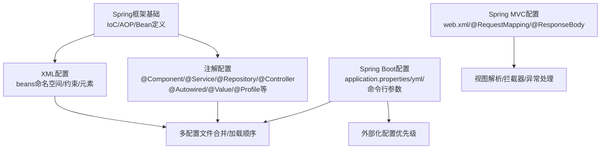
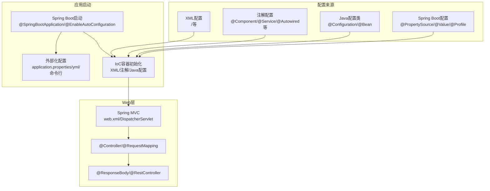
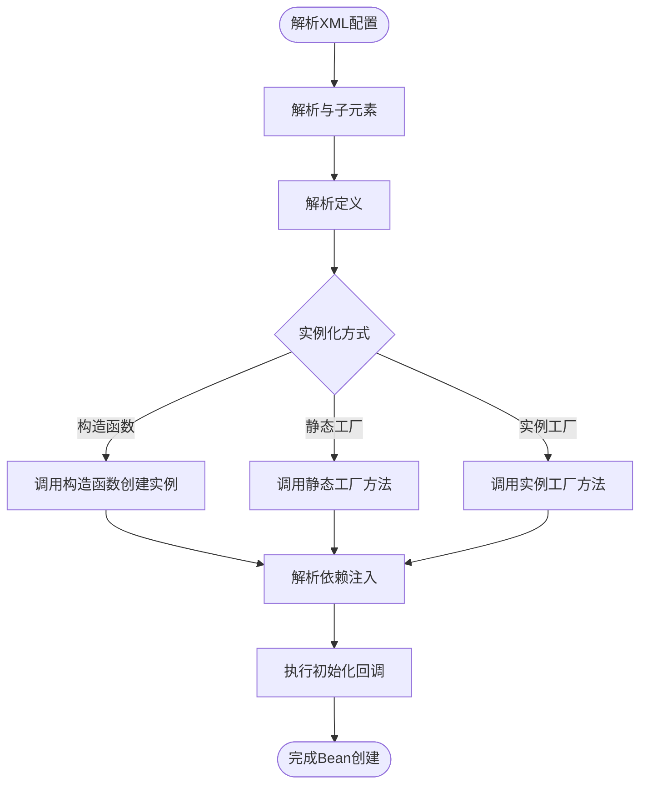
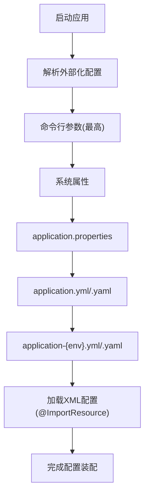
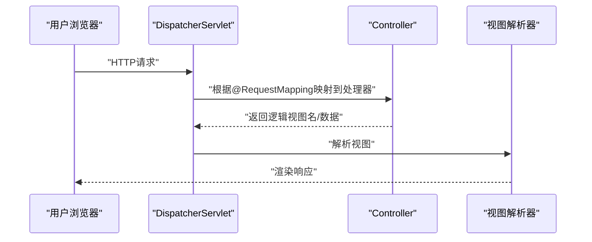
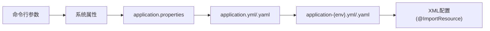

# Spring配置方式

<cite>
**本文档引用的文件**
- [spring.md](file://docs/backend-base/spring/spring.md)
- [spring-my.md](file://docs/backend-base/spring/spring-my.md)
- [spring-boot.md](file://docs/backend-base/spring/spring-boot.md)
- [spring-boot-my.md](file://docs/backend-base/spring/spring-boot-my.md)
- [spring-mvc.md](file://docs/backend-base/spring/spring-mvc.md)
- [spring-mvc-my.md](file://docs/backend-base/spring/spring-mvc-my.md)
</cite>

## 目录
1. [引言](#引言)
2. [项目结构](#项目结构)
3. [核心组件](#核心组件)
4. [架构总览](#架构总览)
5. [详细组件分析](#详细组件分析)
6. [依赖分析](#依赖分析)
7. [性能考量](#性能考量)
8. [故障排查指南](#故障排查指南)
9. [结论](#结论)
10. [附录](#附录)

## 引言
本文件围绕Spring配置方式展开，系统梳理XML配置与注解配置两大体系，涵盖原理、语法、使用场景、加载顺序与优先级、多配置文件合并策略、最佳实践与性能优化建议，并提供从入门到进阶的学习路径。内容来源于仓库中关于Spring、Spring Boot、Spring MVC的多篇文档，确保技术细节与示例路径可追溯。

## 项目结构
本仓库与Spring配置相关的内容集中在docs/backend-base/spring目录下，包含：
- Spring框架基础与IoC/AOP原理
- XML配置与注解配置详解
- Spring Boot配置与外部化配置
- Spring MVC配置与注解使用
- 事务、AOP、过滤器等扩展主题



图表来源
- [spring-my.md:126-186](file://docs/backend-base/spring/spring-my.md#L126-L186)
- [spring-boot-my.md:1-647](file://docs/backend-base/spring/spring-boot-my.md#L1-L647)
- [spring-mvc.md:146-236](file://docs/backend-base/spring/spring-mvc.md#L146-L236)

章节来源
- [spring.md:1-200](file://docs/backend-base/spring/spring.md#L1-L200)
- [spring-my.md:126-186](file://docs/backend-base/spring/spring-my.md#L126-L186)
- [spring-boot-my.md:1-647](file://docs/backend-base/spring/spring-boot-my.md#L1-L647)
- [spring-mvc.md:146-236](file://docs/backend-base/spring/spring-mvc.md#L146-L236)

## 核心组件
- IoC容器与Bean管理：容器负责创建、配置与装配Bean，支持XML与注解两种元数据来源。
- XML配置：通过<beans>根元素与<bean>等子元素声明Bean，支持构造器注入、Setter注入、工厂方法注入、默认初始化/销毁方法等。
- 注解配置：通过@Component、@Service、@Repository、@Controller等组件注解标识组件，结合@Autowired、@Value、@Profile等实现依赖注入与外部化配置。
- Spring Boot：提供约定优于配置，支持application.properties/yml、命令行参数、系统属性等外部化配置，以及自动配置与starter机制。
- Spring MVC：通过web.xml与DispatcherServlet接入，使用@RequestMapping、@ResponseBody等注解处理Web请求与响应。

章节来源
- [spring-my.md:1-120](file://docs/backend-base/spring/spring-my.md#L1-L120)
- [spring-my.md:188-400](file://docs/backend-base/spring/spring-my.md#L188-L400)
- [spring-boot-my.md:1-120](file://docs/backend-base/spring/spring-boot-my.md#L1-L120)
- [spring-mvc.md:146-236](file://docs/backend-base/spring/spring-mvc.md#L146-L236)

## 架构总览
下图展示了Spring配置方式在应用中的总体架构与交互关系，包括XML配置、注解配置、Spring Boot外部化配置与Spring MVC请求处理。



图表来源
- [spring-boot.md:554-670](file://docs/backend-base/spring/spring-boot.md#L554-L670)
- [spring-boot-my.md:1-120](file://docs/backend-base/spring/spring-boot-my.md#L1-L120)
- [spring-my.md:781-860](file://docs/backend-base/spring/spring-my.md#L781-L860)
- [spring-mvc.md:146-236](file://docs/backend-base/spring/spring-mvc.md#L146-L236)

## 详细组件分析

### XML配置详解
- 结构与命名空间
  - 根元素<beans>，声明XML Schema命名空间与XSD约束，确保配置合法性。
  - 常用子元素：<bean>、<import>、<context:property-placeholder>等。
- Bean定义与实例化
  - 构造函数实例化：通过class属性指定类，容器调用构造函数创建实例。
  - 静态工厂方法实例化：通过factory-method指向静态工厂方法。
  - 实例工厂方法实例化：通过factory-bean与factory-method指向实例工厂方法。
- 依赖注入
  - 构造器注入：constructor-arg按类型或索引解析。
  - Setter注入：property/ref引用其他Bean。
- 生命周期回调
  - init-method/destroy-method或默认初始化/销毁方法。
- 多配置文件与导入
  - 顶层<beans>可使用<import>从其他资源导入Bean定义，实现模块化与分层配置。



图表来源
- [spring-my.md:126-186](file://docs/backend-base/spring/spring-my.md#L126-L186)
- [spring-my.md:188-284](file://docs/backend-base/spring/spring-my.md#L188-L284)

章节来源
- [spring-my.md:126-186](file://docs/backend-base/spring/spring-my.md#L126-L186)
- [spring-my.md:188-284](file://docs/backend-base/spring/spring-my.md#L188-L284)

### 注解配置详解
- 组件注解
  - @Component：通用组件注解。
  - @Service：业务层组件。
  - @Repository：数据访问层组件。
  - @Controller：控制层组件。
- 依赖注入
  - @Autowired：按类型注入，可与@Qualifier按名称限定。
  - @Resource：JSR-250注解，按名称注入。
  - @Value：注入外部化配置值，支持SpEL表达式。
  - @Profile：按环境激活Bean。
- Java配置
  - @Configuration：声明配置类。
  - @Bean：在配置类中定义Bean。
  - @Import/@ImportResource：导入其他配置类或XML配置。
- 作用域与生命周期
  - @Scope：指定Bean作用域。
  - @PostConstruct/@PreDestroy：生命周期回调。

```mermaid
classDiagram
class Component注解族 {
"@Component"
"@Service"
"@Repository"
"@Controller"
}
class 注入注解族 {
"@Autowired"
"@Resource"
"@Value"
"@Qualifier"
"@Profile"
}
class 配置注解族 {
"@Configuration"
"@Bean"
"@Import"
"@ImportResource"
"@Scope"
}
Component注解族 --> 配置注解族 : "配合使用"
注入注解族 --> 配置注解族 : "在配置类中生效"
```

图表来源
- [spring-my.md:188-400](file://docs/backend-base/spring/spring-my.md#L188-L400)
- [spring-my.md:533-575](file://docs/backend-base/spring/spring-my.md#L533-L575)
- [spring-boot-my.md:174-242](file://docs/backend-base/spring/spring-boot-my.md#L174-L242)

章节来源
- [spring-my.md:188-400](file://docs/backend-base/spring/spring-my.md#L188-L400)
- [spring-boot-my.md:174-242](file://docs/backend-base/spring/spring-boot-my.md#L174-L242)

### Spring Boot外部化配置与加载顺序
- 配置文件类型与优先级
  - application.properties > application.yml > application.yaml > application-{env}.yml > application-{env}.yaml
- 系统属性与命令行参数
  - 命令行参数 > 系统属性 > properties > yml > yaml
- 常用注解
  - @Value：注入配置值。
  - @ConfigurationProperties/@EnableConfigurationProperties：批量绑定配置。
  - @ImportResource：在Spring Boot中加载XML配置。
- 与XML配置的结合
  - 以Java配置为中心时，可通过@ImportResource导入XML配置，实现“以Java为中心”的最小XML配置。



图表来源
- [spring-boot-my.md:1-647](file://docs/backend-base/spring/spring-boot-my.md#L1-L647)
- [spring-boot.md:768-800](file://docs/backend-base/spring/spring-boot.md#L768-L800)

章节来源
- [spring-boot-my.md:1-647](file://docs/backend-base/spring/spring-boot-my.md#L1-L647)
- [spring-boot.md:768-800](file://docs/backend-base/spring/spring-boot.md#L768-L800)

### Spring MVC配置与注解使用
- web.xml与DispatcherServlet
  - 在web.xml中配置DispatcherServlet与初始化参数，指定Spring MVC配置文件位置。
- 组件扫描与视图解析
  - 通过context:component-scan扫描控制器，配置视图解析器（如Thymeleaf）。
- 控制器与请求映射
  - @Controller标注控制器，@RequestMapping映射请求路径，支持Ant风格通配符。
- 数据返回与拦截器
  - @ResponseBody/@RestController返回JSON；@RestController组合@Controller与@ResponseBody。
  - 拦截器通过XML或Java配置注册。



图表来源
- [spring-mvc.md:146-236](file://docs/backend-base/spring/spring-mvc.md#L146-L236)
- [spring-mvc-my.md:24-90](file://docs/backend-base/spring/spring-mvc-my.md#L24-L90)

章节来源
- [spring-mvc.md:146-236](file://docs/backend-base/spring/spring-mvc.md#L146-L236)
- [spring-mvc-my.md:24-90](file://docs/backend-base/spring/spring-mvc-my.md#L24-L90)

## 依赖分析
- 组件耦合与职责
  - XML配置与注解配置在功能上互补：XML适合声明式、集中式配置；注解适合就近配置、减少XML样板。
  - Spring Boot通过自动配置与外部化配置降低XML依赖，但仍可通过@ImportResource保留XML配置。
- 外部化配置优先级
  - 命令行参数 > 系统属性 > properties > yml > yaml，确保运行时可覆盖默认配置。
- 多配置文件合并策略
  - 顶层<beans>使用<import>导入多个资源，实现模块化与分层配置；Spring Boot中可通过多个配置文件按优先级合并。



图表来源
- [spring-boot-my.md:24-42](file://docs/backend-base/spring/spring-boot-my.md#L24-L42)
- [spring-my.md:781-860](file://docs/backend-base/spring/spring-my.md#L781-L860)

章节来源
- [spring-boot-my.md:24-42](file://docs/backend-base/spring/spring-boot-my.md#L24-L42)
- [spring-my.md:781-860](file://docs/backend-base/spring/spring-my.md#L781-L860)

## 性能考量
- 组件扫描与作用域
  - 合理设置@ComponentScan的basePackages，避免扫描过多包导致启动缓慢。
  - 使用@Scope("prototype")按需创建Bean，避免不必要的单例实例。
- 外部化配置与缓存
  - 将频繁读取的配置放入内存缓存，减少IO开销。
- 视图解析与静态资源
  - Spring MVC中合理配置视图解析器与静态资源映射，避免不必要的视图解析开销。
- 自动配置与依赖精简
  - Spring Boot中按需引入starter，避免引入不必要的自动配置与依赖。

## 故障排查指南
- Bean未被扫描或注入失败
  - 检查@ComponentScan的basePackages是否包含目标包。
  - 确认@Qualifier与@Primary的使用是否正确，避免歧义。
- XML配置加载问题
  - 确认<import>资源路径正确，顶层<beans>的default-init-method/destroy-method是否按预期生效。
- 外部化配置未生效
  - 检查配置文件优先级与命令行参数覆盖关系，确认@PropertySource与@Value的使用。
- Spring MVC请求映射冲突
  - 确保@RequestMapping路径唯一，或通过类级@RequestMapping提供命名空间。

章节来源
- [spring-my.md:1016-1060](file://docs/backend-base/spring/spring-my.md#L1016-L1060)
- [spring-mvc.md:467-530](file://docs/backend-base/spring/spring-mvc.md#L467-L530)
- [spring-boot-my.md:1-647](file://docs/backend-base/spring/spring-boot-my.md#L1-L647)

## 结论
- XML配置与注解配置各有优势：XML适合集中式声明与跨模块共享，注解适合就近配置与快速开发。
- Spring Boot通过外部化配置与自动配置大幅简化配置，但仍可与XML配置协同工作。
- 在实际项目中，建议以注解与Spring Boot为主，XML为辅，结合多配置文件与优先级策略实现清晰、可维护的配置体系。

## 附录
- 入门建议
  - 先掌握XML配置与Bean生命周期，再过渡到注解配置与Spring Boot外部化配置。
  - 结合Spring MVC实践，理解请求映射、视图解析与拦截器的配置方式。
- 进阶建议
  - 深入理解AOP与事务配置，掌握@Aspect与@Transactional的使用。
  - 学习过滤器、监听器等Web扩展配置，完善应用架构。