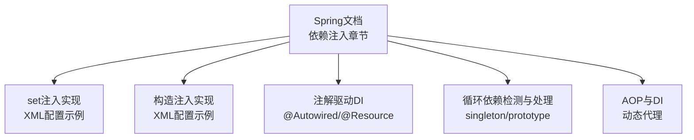
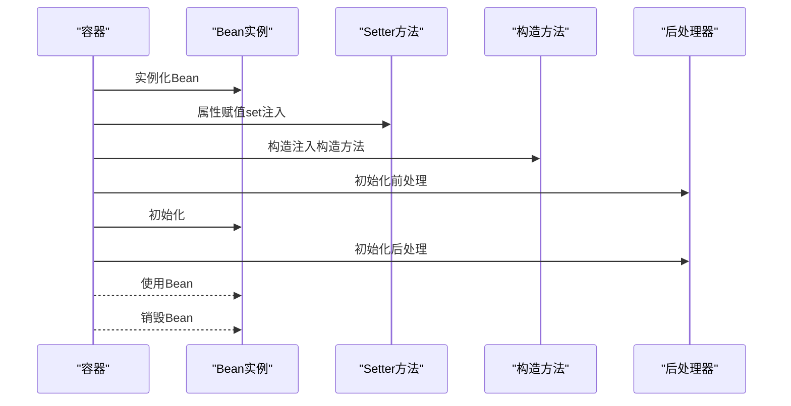
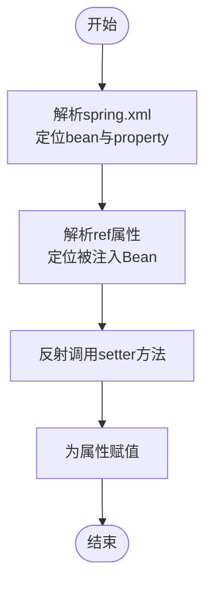
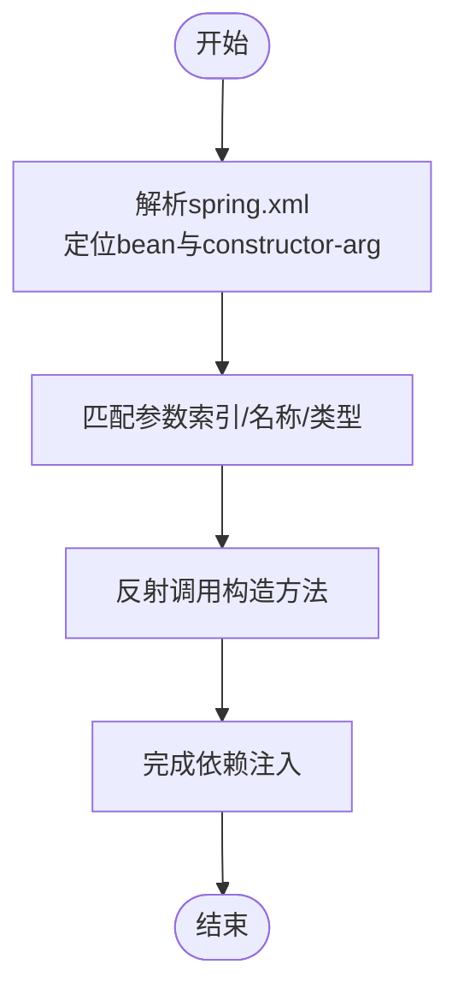
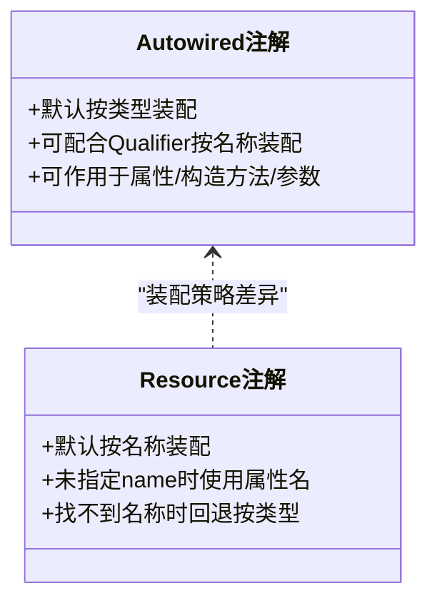
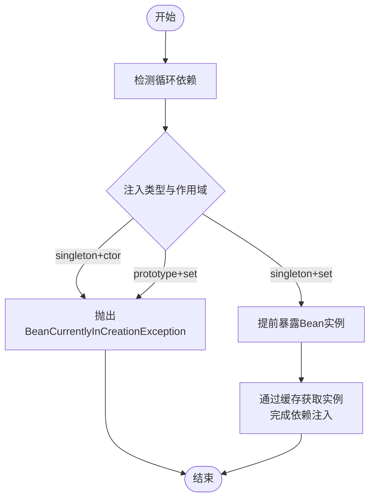
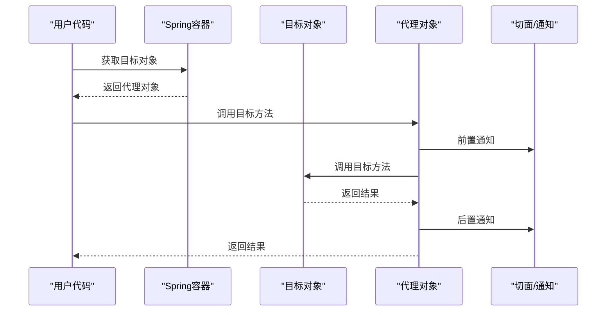
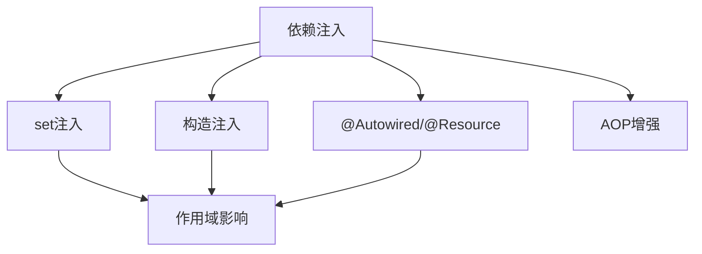

# 依赖注入实现

<cite>
**本文引用的文件**
- [spring.md](file://docs/backend-base/spring/spring.md)
- [spring-boot-my.md](file://docs/backend-base/spring/spring-boot-my.md)
</cite>

## 目录
1. [引言](#引言)
2. [项目结构](#项目结构)
3. [核心组件](#核心组件)
4. [架构概览](#架构概览)
5. [详细组件分析](#详细组件分析)
6. [依赖分析](#依赖分析)
7. [性能考虑](#性能考虑)
8. [故障排查指南](#故障排查指南)
9. [结论](#结论)
10. [附录](#附录)

## 引言
本技术文档围绕Spring框架中的依赖注入（DI）实现展开，系统讲解两种主流注入方式：基于setter方法的set注入与基于构造函数的构造注入。文档不仅覆盖实现原理、适用场景、优缺点对比，还包含在Spring配置文件中进行DI配置的示例路径、注解驱动的DI实践、循环依赖的检测与处理机制，以及依赖注入在Spring AOP中的应用。最后提供业务场景示例与最佳实践，帮助初学者快速理解，同时为高级开发者提供深入的实现细节与排障指引。

## 项目结构
本仓库包含丰富的Spring学习资料，其中与依赖注入直接相关的内容集中在Spring章节文档中，涵盖：
- 依赖注入的两种实现方式（set注入、构造注入）
- XML配置文件中的DI配置示例
- 注解驱动的DI（@Autowired、@Resource等）
- 循环依赖的检测与处理
- AOP与DI的关系及动态代理

**图表来源**
- [spring.md:769-1117](file://docs/backend-base/spring/spring.md#L769-L1117)
- [spring.md:6513-6538](file://docs/backend-base/spring/spring.md#L6513-L6538)
- [spring.md:4384-4663](file://docs/backend-base/spring/spring.md#L4384-L4663)
- [spring.md:7986-8178](file://docs/backend-base/spring/spring.md#L7986-L8178)

**章节来源**
- [spring.md:742-766](file://docs/backend-base/spring/spring.md#L742-L766)

## 核心组件
- set注入：通过反射调用属性对应的setter方法完成依赖注入，要求属性提供setter方法。
- 构造注入：通过调用构造方法完成依赖注入，适合不可变依赖或强制依赖。
- 注解驱动：@Autowired按类型注入，@Qualifier按名称注入；@Resource按名称装配，默认名称为属性名。
- 循环依赖：singleton + set注入可解决；singleton + 构造注入与prototype + set注入可能触发BeanCurrentlyInCreationException。
- AOP与DI：AOP底层使用动态代理（JDK/CGLIB），DI为AOP提供目标对象与依赖关系。

**章节来源**
- [spring.md:769-965](file://docs/backend-base/spring/spring.md#L769-L965)
- [spring.md:967-1117](file://docs/backend-base/spring/spring.md#L967-L1117)
- [spring.md:6513-6538](file://docs/backend-base/spring/spring.md#L6513-L6538)
- [spring.md:4384-4663](file://docs/backend-base/spring/spring.md#L4384-L4663)
- [spring.md:7986-8178](file://docs/backend-base/spring/spring.md#L7986-L8178)

## 架构概览
下图展示了Spring容器在实例化Bean、属性赋值、初始化与使用阶段的生命周期，以及DI在其中的关键作用。

**图表来源**
- [spring.md:4016-4026](file://docs/backend-base/spring/spring.md#L4016-L4026)
- [spring.md:4112-4151](file://docs/backend-base/spring/spring.md#L4112-L4151)
- [spring.md:4267-4295](file://docs/backend-base/spring/spring.md#L4267-L4295)

**章节来源**
- [spring.md:4000-4295](file://docs/backend-base/spring/spring.md#L4000-L4295)

## 详细组件分析

### set注入（基于setter方法的注入）
- 实现原理：通过反射调用属性对应的setter方法完成依赖注入，要求属性提供setter方法。
- XML配置要点：使用property标签，name为属性名，ref为被注入Bean的id；也可使用value为简单类型赋值。
- 适用场景：可选依赖、可变依赖、复杂对象的可选字段注入。
- 优点：灵活性高，便于后续替换与扩展；支持延迟初始化。
- 缺点：运行时可能出现空指针风险；依赖关系不够显式。
- 示例路径：
  - [set注入示例（XML）:855-895](file://docs/backend-base/spring/spring.md#L855-L895)
  - [set注入原理与注意事项:911-965](file://docs/backend-base/spring/spring.md#L911-L965)

**图表来源**
- [spring.md:911-965](file://docs/backend-base/spring/spring.md#L911-L965)

**章节来源**
- [spring.md:769-965](file://docs/backend-base/spring/spring.md#L769-L965)

### 构造注入（基于构造函数的注入）
- 实现原理：通过调用构造方法完成依赖注入，适合不可变依赖或强制依赖。
- XML配置要点：使用constructor-arg标签，支持index、name、ref三种方式；类型顺序可灵活调整。
- 适用场景：必填依赖、不可变对象、线程安全对象。
- 优点：依赖关系明确、运行时不可变、线程安全。
- 缺点：构造函数参数过多时可读性下降；与循环依赖冲突。
- 示例路径：
  - [构造注入示例（XML）:1008-1022](file://docs/backend-base/spring/spring.md#L1008-L1022)
  - [多参数构造注入示例:1055-1067](file://docs/backend-base/spring/spring.md#L1055-L1067)
  - [参数名与类型推断示例:1071-1094](file://docs/backend-base/spring/spring.md#L1071-L1094)

**图表来源**
- [spring.md:1008-1117](file://docs/backend-base/spring/spring.md#L1008-L1117)

**章节来源**
- [spring.md:967-1117](file://docs/backend-base/spring/spring.md#L967-L1117)

### 注解驱动的依赖注入
- @Autowired：默认按类型装配，可通过@Qualifier按名称装配；可作用于属性、setter、构造方法、构造方法参数。
- @Resource：默认按名称装配，未指定name时使用属性名；若仍找不到则回退按类型装配。
- 示例路径：
  - [@Autowired注解说明与示例:6513-6519](file://docs/backend-base/spring/spring.md#L6513-L6519)
  - [@Resource注解说明与差异:6521-6529](file://docs/backend-base/spring/spring.md#L6521-L6529)
  - [Spring Boot中常见注解示例:124-214](file://docs/backend-base/spring/spring-boot-my.md#L124-L214)

**图表来源**
- [spring.md:6513-6538](file://docs/backend-base/spring/spring.md#L6513-L6538)

**章节来源**
- [spring.md:6513-6538](file://docs/backend-base/spring/spring.md#L6513-L6538)
- [spring-boot-my.md:124-214](file://docs/backend-base/spring/spring-boot-my.md#L124-L214)

### 循环依赖的检测与处理
- singleton + set注入：可解决循环依赖。原理：先实例化Bean并提前暴露，再逐步调用setter完成属性赋值。
- singleton + 构造注入：无法解决循环依赖，会抛出BeanCurrentlyInCreationException。
- prototype + set注入：若所有Bean均为prototype，无法解决循环依赖，会抛出BeanCurrentlyInCreationException。
- 处理机制：Spring通过三级缓存（一级缓存、二级缓存、三级缓存）提前暴露早期Bean实例，避免重复创建。
- 示例路径：
  - [singleton + set注入循环依赖测试:4491-4504](file://docs/backend-base/spring/spring.md#L4491-L4504)
  - [prototype + set注入循环依赖测试:4524-4532](file://docs/backend-base/spring/spring.md#L4524-L4532)
  - [构造注入循环依赖测试:4631-4642](file://docs/backend-base/spring/spring.md#L4631-L4642)
  - [循环依赖解决机理与三级缓存:4643-4663](file://docs/backend-base/spring/spring.md#L4643-L4663)

**图表来源**
- [spring.md:4384-4663](file://docs/backend-base/spring/spring.md#L4384-L4663)

**章节来源**
- [spring.md:4384-4663](file://docs/backend-base/spring/spring.md#L4384-L4663)

### 依赖注入在Spring AOP中的应用
- AOP底层使用动态代理（JDK动态代理/CGLIB），DI为AOP提供目标对象与依赖关系。
- Spring AOP支持注解式与XML式配置，结合AspectJ实现横切关注点。
- 示例路径：
  - [AOP介绍与动态代理:7986-7991](file://docs/backend-base/spring/spring.md#L7986-L7991)
  - [基于AspectJ的AOP注解式开发:8165-8178](file://docs/backend-base/spring/spring.md#L8165-L8178)

**图表来源**
- [spring.md:7986-8178](file://docs/backend-base/spring/spring.md#L7986-L8178)

**章节来源**
- [spring.md:7986-8178](file://docs/backend-base/spring/spring.md#L7986-L8178)

## 依赖分析
- set注入与构造注入的耦合与内聚：set注入更灵活但依赖关系不够显式；构造注入更严格但灵活性受限。
- 注解与XML的权衡：注解驱动提升开发效率，XML配置便于集中管理与环境隔离。
- 循环依赖与作用域：singleton与prototype对循环依赖的影响显著，需谨慎设计依赖关系。
- AOP与DI的协作：DI为AOP提供目标对象，AOP通过代理增强目标对象的行为。

**图表来源**
- [spring.md:769-1117](file://docs/backend-base/spring/spring.md#L769-L1117)
- [spring.md:6513-6538](file://docs/backend-base/spring/spring.md#L6513-L6538)
- [spring.md:4384-4663](file://docs/backend-base/spring/spring.md#L4384-L4663)
- [spring.md:7986-8178](file://docs/backend-base/spring/spring.md#L7986-L8178)

**章节来源**
- [spring.md:769-1117](file://docs/backend-base/spring/spring.md#L769-L1117)
- [spring.md:6513-6538](file://docs/backend-base/spring/spring.md#L6513-L6538)
- [spring.md:4384-4663](file://docs/backend-base/spring/spring.md#L4384-L4663)
- [spring.md:7986-8178](file://docs/backend-base/spring/spring.md#L7986-L8178)

## 性能考虑
- set注入：实例化与属性赋值分离，有利于缓存与延迟初始化，适合大规模Bean管理。
- 构造注入：一次性完成实例化与赋值，适合不可变对象，减少运行时状态变更带来的开销。
- 注解装配：按类型装配默认更快，按名称装配需额外解析，@Qualifier可减少歧义。
- AOP代理：JDK动态代理适用于接口，CGLIB适用于类；选择合适代理策略可降低代理成本。

[本节为通用性能讨论，不直接分析具体文件]

## 故障排查指南
- BeanCurrentlyInCreationException：检查循环依赖类型与作用域，优先使用set注入或重构依赖关系。
- 注解装配失败：确认@Qualifier名称与Bean id一致；检查组件扫描路径与注解使用位置。
- XML装配错误：核对property/constructor-arg的name/ref/index/type顺序；确认Bean id唯一性。
- AOP失效：确认目标对象已被代理；检查切点表达式与通知类型。

**章节来源**
- [spring.md:4524-4532](file://docs/backend-base/spring/spring.md#L4524-L4532)
- [spring.md:6513-6519](file://docs/backend-base/spring/spring.md#L6513-L6519)
- [spring.md:4631-4642](file://docs/backend-base/spring/spring.md#L4631-L4642)

## 结论
Spring的依赖注入通过set注入与构造注入两种方式，为对象间关系管理提供了灵活而强大的机制。在实际项目中，应根据依赖的可变性、可见性与生命周期选择合适的注入方式；在面对循环依赖时，优先采用singleton + set注入策略，并通过重构依赖关系规避构造注入引发的循环依赖。注解驱动与XML配置各有优势，应结合团队习惯与项目规模进行取舍。AOP与DI相辅相成，DI为AOP提供目标对象，AOP通过代理增强目标对象的行为，共同提升系统的可维护性与可扩展性。

[本节为总结性内容，不直接分析具体文件]

## 附录
- 业务场景示例（路径参考）
  - [set注入外部Bean示例:1120-1136](file://docs/backend-base/spring/spring.md#L1120-L1136)
  - [构造注入多参数示例:1025-1067](file://docs/backend-base/spring/spring.md#L1025-L1067)
  - [注解装配示例（@Autowired/@Resource）:6513-6538](file://docs/backend-base/spring/spring.md#L6513-L6538)
  - [AOP注解式开发示例:8165-8178](file://docs/backend-base/spring/spring.md#L8165-L8178)

**章节来源**
- [spring.md:1120-1136](file://docs/backend-base/spring/spring.md#L1120-L1136)
- [spring.md:1025-1067](file://docs/backend-base/spring/spring.md#L1025-L1067)
- [spring.md:6513-6538](file://docs/backend-base/spring/spring.md#L6513-L6538)
- [spring.md:8165-8178](file://docs/backend-base/spring/spring.md#L8165-L8178)