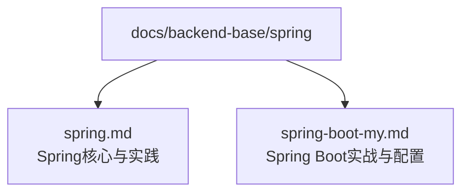
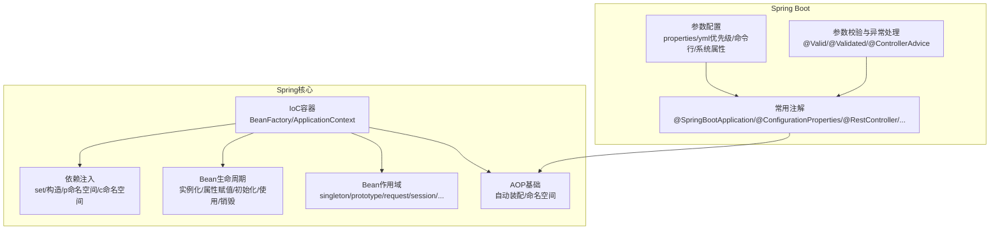
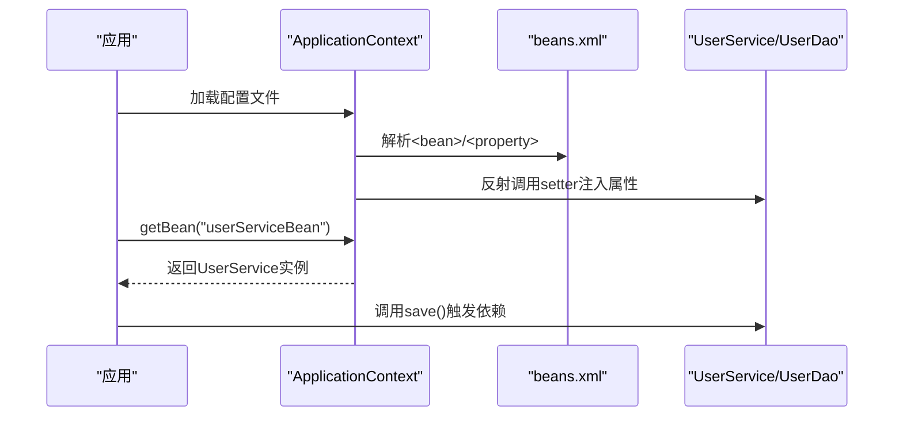
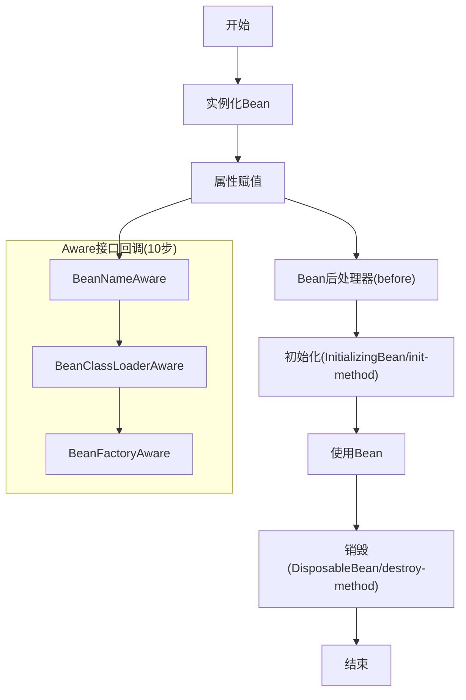
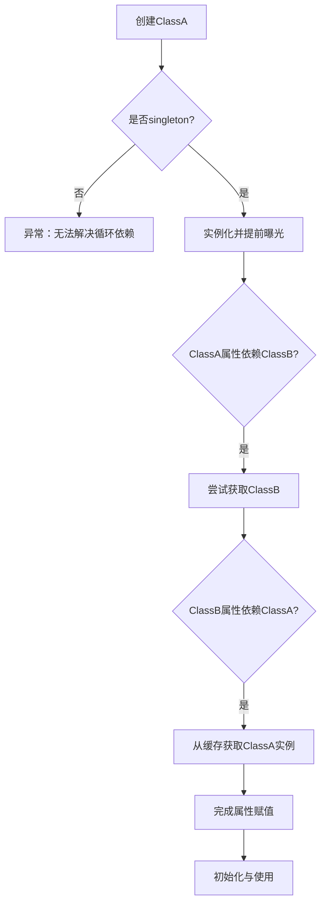
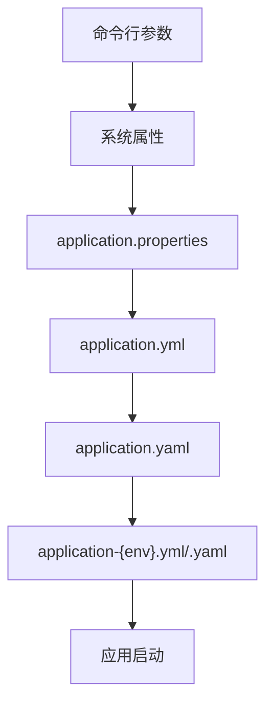
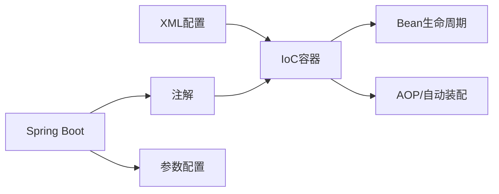

# Spring框架

<cite>
**本文引用的文件**
- [spring.md](file://docs/backend-base/spring/spring.md)
- [spring-boot-my.md](file://docs/backend-base/spring/spring-boot-my.md)
</cite>

## 目录
1. [引言](#引言)
2. [项目结构](#项目结构)
3. [核心组件](#核心组件)
4. [架构总览](#架构总览)
5. [详细组件分析](#详细组件分析)
6. [依赖分析](#依赖分析)
7. [性能考虑](#性能考虑)
8. [故障排查指南](#故障排查指南)
9. [结论](#结论)
10. [附录](#附录)

## 引言
本技术文档围绕Spring框架展开，系统梳理Spring核心容器、IoC控制反转、AOP面向切面编程、Spring Boot自动配置等核心主题，结合仓库中的Spring与Spring Boot资料，给出依赖注入机制、Bean生命周期、配置方式、快速开发实践与微服务架构指导。文档兼顾入门与进阶，适合不同层次的Spring开发者。

## 项目结构
本仓库与Spring相关的资料集中在 docs/backend-base/spring 目录，包含两份核心文档：
- spring.md：覆盖Spring核心、IoC/DI、Bean生命周期、循环依赖、AOP基础、Spring Boot配置等内容
- spring-boot-my.md：聚焦Spring Boot参数配置、常用注解、参数校验与统一异常处理等实战要点

**图表来源**
- [spring.md](file://docs/backend-base/spring/spring.md)
- [spring-boot-my.md](file://docs/backend-base/spring/spring-boot-my.md)

**章节来源**
- [spring.md](file://docs/backend-base/spring/spring.md)
- [spring-boot-my.md](file://docs/backend-base/spring/spring-boot-my.md)

## 核心组件
- Spring核心容器与IoC
  - 通过XML配置与依赖注入实现对象创建与关系维护，支持set注入、构造注入、p/c命名空间简化配置
  - Bean作用域：singleton/prototype及Web环境下的request/session等
  - Bean生命周期：实例化、属性赋值、初始化、使用、销毁；支持Bean后处理器与Aware接口回调
  - 循环依赖：singleton+setter场景可由三级缓存解决；构造注入与多prototype场景存在限制
- AOP基础
  - 通过自动装配与命名空间实现基于接口的横切能力（事务、日志等）
- Spring Boot
  - 参数配置：application.properties/yml/yaml优先级与命令行/系统属性覆盖
  - 常用注解：@SpringBootApplication/@EnableAutoConfiguration/@ComponentScan/@ConfigurationProperties/@ImportResource/@RestController/@RequestMapping/@Autowired/@Bean等
  - 参数校验与统一异常处理：基于Spring Validation与@ControllerAdvice

**章节来源**
- [spring.md](file://docs/backend-base/spring/spring.md)
- [spring-boot-my.md](file://docs/backend-base/spring/spring-boot-my.md)

## 架构总览
下图展示Spring核心容器与IoC、AOP、Bean生命周期的关系，以及Spring Boot在参数配置与注解驱动下的自动装配思路。

**图表来源**
- [spring.md](file://docs/backend-base/spring/spring.md)
- [spring-boot-my.md](file://docs/backend-base/spring/spring-boot-my.md)

## 详细组件分析

### 组件A：IoC与依赖注入（DI）
- 实现思想
  - 控制反转将对象创建与关系维护交给容器，降低耦合，符合开闭原则与依赖倒置原则
  - 依赖注入通过set方法注入或构造方法注入实现，XML中以property/constructor-arg标签描述
- 配置方式
  - XML：传统方式，支持ref/value、p命名空间、c命名空间简化配置
  - 注解：@Autowired/@Qualifier/@Value/@Configuration/@Bean等
- 典型流程（XML set注入）
  - 定义Bean与属性setter
  - 在XML中通过property ref注入外部Bean或value注入简单类型
  - 容器解析配置，反射调用setter完成属性赋值

**图表来源**
- [spring.md](file://docs/backend-base/spring/spring.md)

**章节来源**
- [spring.md](file://docs/backend-base/spring/spring.md)

### 组件B：Bean生命周期与作用域
- 生命周期（5步/7步/10步）
  - 5步：实例化→属性赋值→初始化→使用→销毁
  - 7步：在初始化前后插入Bean后处理器回调
  - 10步：Aware接口回调（BeanName/BeanClassLoader/BeanFactory）与InitializingBean/DisposableBean
- 作用域
  - singleton：默认，容器启动即创建；prototype：按需创建；Web环境下request/session/application/websocket等
- 重要细节
  - destroy-method仅在容器正常关闭时触发
  - Bean后处理器对当前配置文件内所有Bean生效

**图表来源**
- [spring.md](file://docs/backend-base/spring/spring.md)

**章节来源**
- [spring.md](file://docs/backend-base/spring/spring.md)

### 组件C：循环依赖与解决策略
- 场景
  - singleton+setter：可由三级缓存解决
  - singleton+构造注入：无法解决，抛出BeanCurrentlyInCreationException
  - 多prototype：无法解决
- 底层机理
  - 提前暴露早期Bean实例，避免重复实例化；三级缓存配合ObjectFactory

**图表来源**
- [spring.md](file://docs/backend-base/spring/spring.md)

**章节来源**
- [spring.md](file://docs/backend-base/spring/spring.md)

### 组件D：Spring Boot参数配置与注解实践
- 参数配置优先级
  - 命令行参数 > 系统属性 > properties > yml > yaml
- 常用注解
  - @SpringBootApplication/@EnableAutoConfiguration/@ComponentScan
  - @ConfigurationProperties/@EnableConfigurationProperties
  - @RestController/@RequestMapping/@Autowired/@Bean/@ImportResource
- 参数校验与统一异常处理
  - 基于JSR-349与Spring Validation，结合@Valid/@Validated与@ControllerAdvice

**图表来源**
- [spring-boot-my.md](file://docs/backend-base/spring/spring-boot-my.md)

**章节来源**
- [spring-boot-my.md](file://docs/backend-base/spring/spring-boot-my.md)

## 依赖分析
- 组件耦合
  - IoC容器与Bean生命周期紧密耦合，生命周期回调贯穿容器管理
  - AOP与自动装配在XML中通过命名空间实现，注解驱动下由Spring Boot自动装配
- 外部依赖
  - Spring Boot Starter与自动配置减少显式依赖声明
  - 日志框架（如Log4j2）通过Maven依赖引入并在容器中集成

**图表来源**
- [spring.md](file://docs/backend-base/spring/spring.md)
- [spring-boot-my.md](file://docs/backend-base/spring/spring-boot-my.md)

**章节来源**
- [spring.md](file://docs/backend-base/spring/spring.md)
- [spring-boot-my.md](file://docs/backend-base/spring/spring-boot-my.md)

## 性能考虑
- 单例Bean的延迟创建
  - 默认在容器启动时创建，可通过scope="prototype"改为按需创建，降低启动时内存占用
- 循环依赖的限制
  - 构造注入与多prototype场景会触发异常，应优先采用setter注入与单例Bean
- 自动装配与命名空间
  - p/c命名空间可减少XML冗余，提升配置可读性与维护效率

[本节为通用建议，不直接分析具体文件]

## 故障排查指南
- 常见异常与定位
  - BeanCurrentlyInCreationException：循环依赖（构造注入/多prototype）
  - BeanCreationException：找不到匹配Bean或类型不唯一（@Autowired未指定qualifier）
  - 命令行参数优先级问题：确认命令行参数是否覆盖了预期配置
- 排查步骤
  - 检查XML中id唯一性与ref引用正确性
  - 确认Bean后处理器与Aware接口回调是否按预期执行
  - 校验参数配置文件路径与优先级，必要时使用命令行参数强制覆盖

**章节来源**
- [spring.md](file://docs/backend-base/spring/spring.md)
- [spring-boot-my.md](file://docs/backend-base/spring/spring-boot-my.md)

## 结论
本文件基于仓库中的Spring与Spring Boot资料，系统阐述了IoC/DI、Bean生命周期、循环依赖、AOP基础与Spring Boot参数配置、注解与校验实践。建议在企业级应用中：
- 优先采用XML或注解的IoC配置，结合Bean后处理器与Aware接口实现横切关注点
- 在单例Bean间使用setter注入以支持循环依赖解决
- 利用Spring Boot自动配置与参数优先级体系，简化部署与运维
- 通过统一异常处理与参数校验保障接口稳定性与一致性

[本节为总结性内容，不直接分析具体文件]

## 附录
- 快速实践清单
  - 使用XML配置Bean与依赖注入，逐步迁移到注解驱动
  - 为关键Bean配置init-method/destroy-method与Bean后处理器
  - 在Spring Boot中使用@Value/@ConfigurationProperties读取配置，结合@Valid/@Validated进行参数校验
  - 通过@ControllerAdvice统一处理参数校验与业务异常

[本节为补充性内容，不直接分析具体文件]