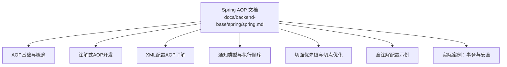
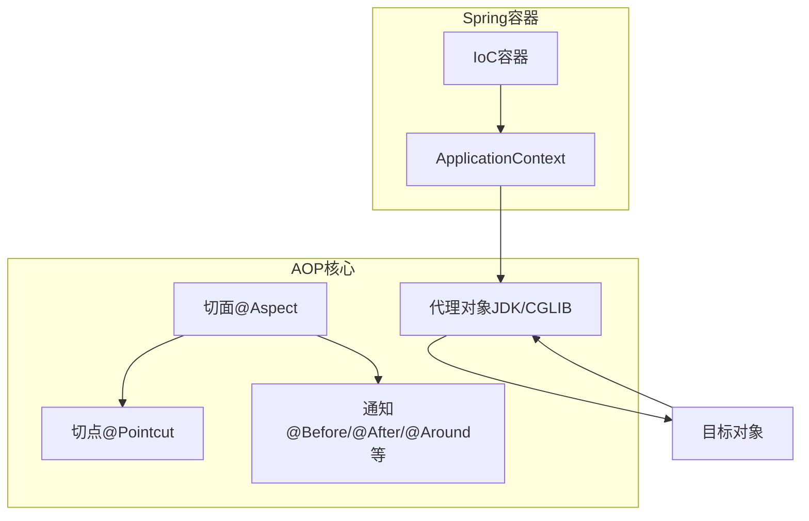
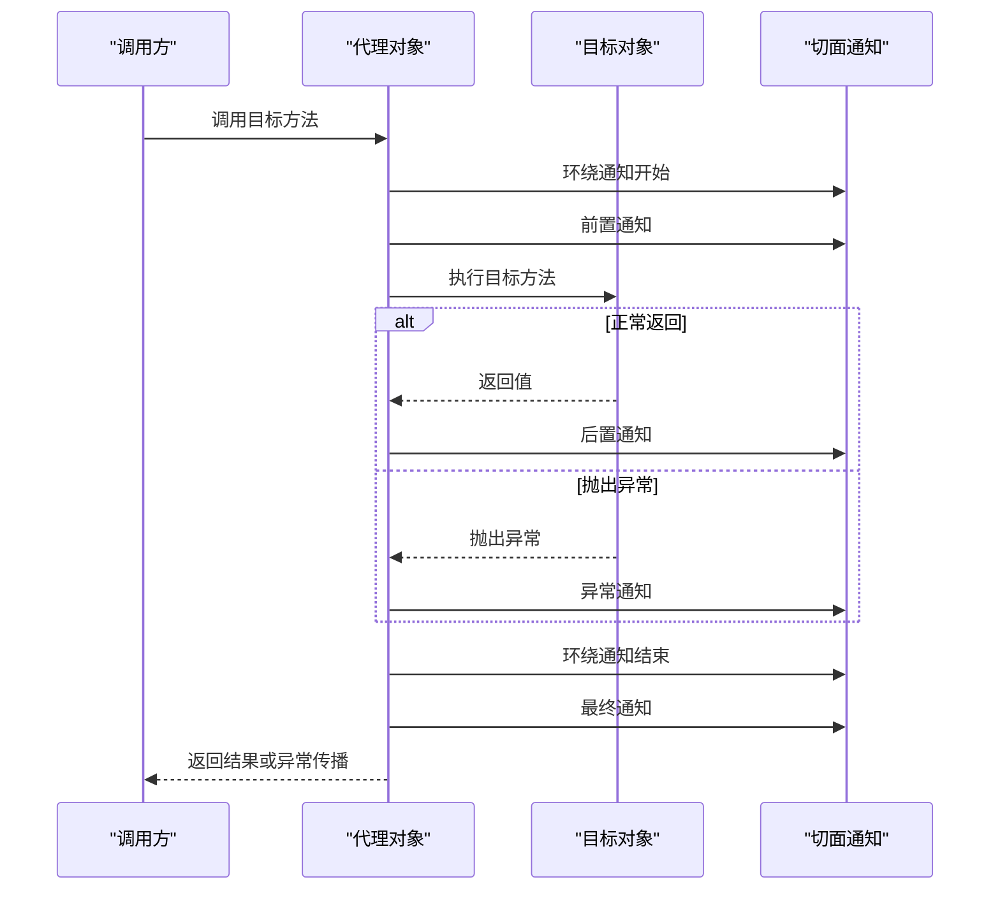
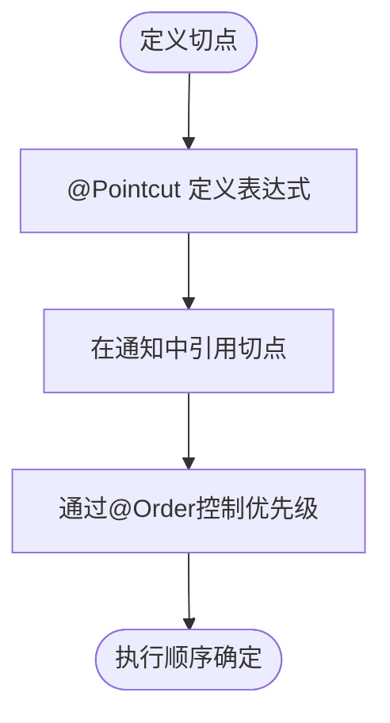
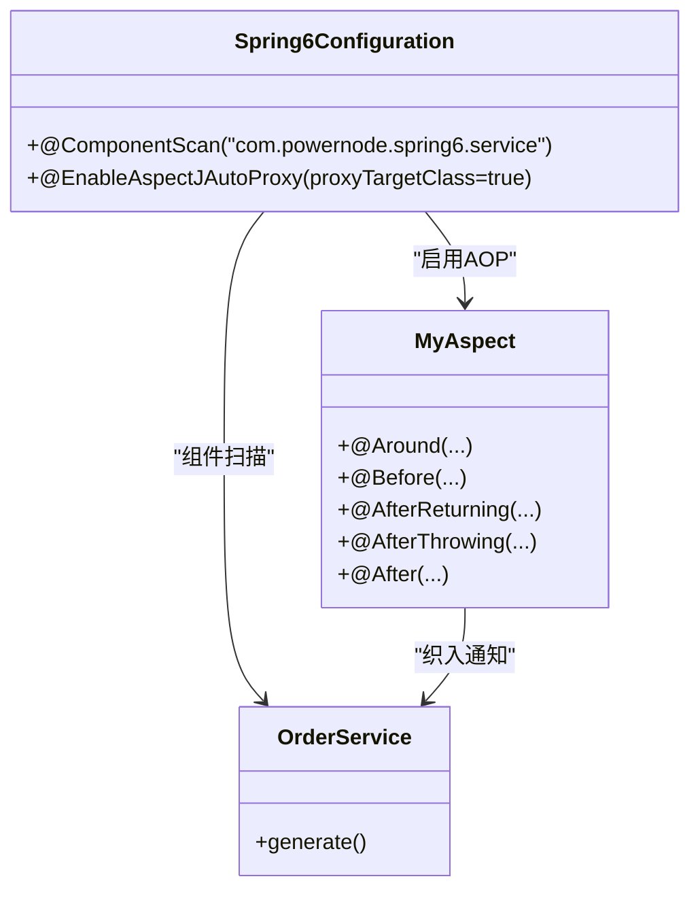
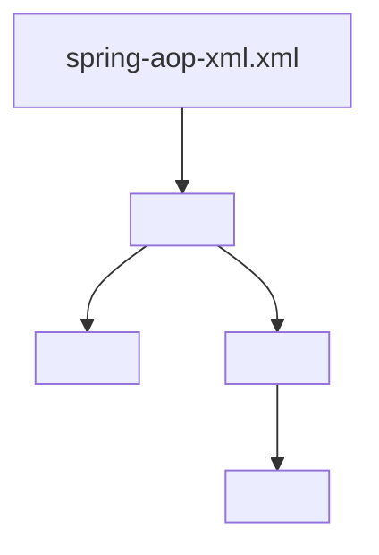
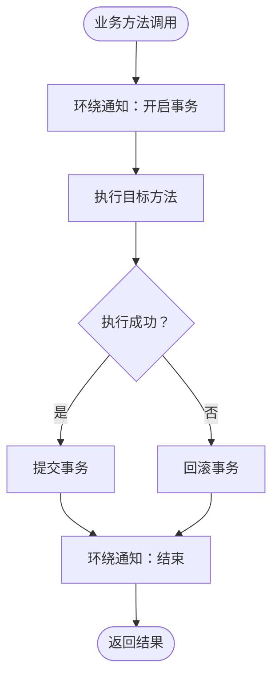
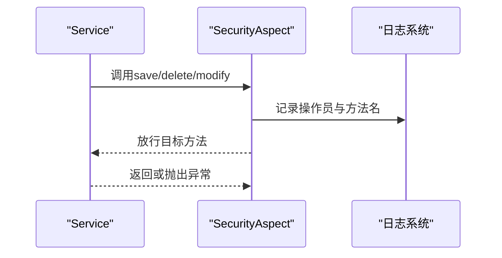
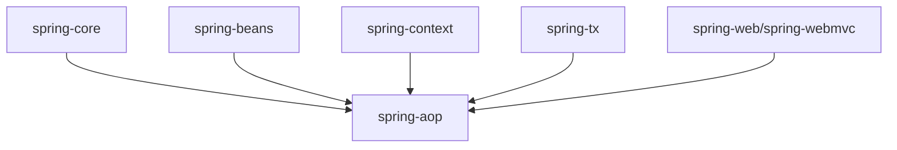

# AOP面向切面编程

<cite>
**本文引用的文件**
- [spring.md](file://docs/backend-base/spring/spring.md)
</cite>

## 目录
1. [引言](#引言)
2. [项目结构](#项目结构)
3. [核心组件](#核心组件)
4. [架构总览](#架构总览)
5. [详细组件分析](#详细组件分析)
6. [依赖分析](#依赖分析)
7. [性能考量](#性能考量)
8. [故障排查指南](#故障排查指南)
9. [结论](#结论)
10. [附录](#附录)

## 引言
本篇文档围绕Spring Framework的AOP模块展开，系统阐述面向切面编程的核心概念与实现机制，覆盖切面、通知、切入点、织入等关键术语；详解JDK动态代理与CGLIB代理的差异及适用场景；给出前置、后置、异常、最终、环绕通知的使用要点与执行顺序；解释@Aspect、@Before、@After、@Around等注解的配置方式；并通过日志记录、事务管理、安全控制等企业级案例展示AOP的实际价值。同时说明AOP在Spring生态中的地位及其与IoC、事务管理、Web等模块的集成关系，并提供最佳实践与性能优化建议。

## 项目结构
本仓库中与Spring AOP相关内容集中在“docs/backend-base/spring/spring.md”文档中，涵盖AOP基础、注解式开发、XML配置方式、通知执行顺序、切面优先级、切点表达式优化、全注解配置、以及事务与安全等实际案例。

图表来源
- [spring.md:7986-8295](file://docs/backend-base/spring/spring.md#L7986-L8295)

章节来源
- [spring.md:7986-8295](file://docs/backend-base/spring/spring.md#L7986-L8295)

## 核心组件
- 切面（Aspect）：横切关注点的模块化封装，包含通知与切点。
- 通知（Advice）：在特定连接点执行的代码，包括前置、后置、异常、最终、环绕通知。
- 切入点（Pointcut）：匹配连接点的表达式，决定通知在何处生效。
- 织入（Weaving）：将切面应用到目标对象并创建代理对象的过程。
- 代理（Proxy）：Spring AOP通过JDK动态代理或CGLIB生成代理对象，实现对目标方法的拦截与增强。

章节来源
- [spring.md:7986-8295](file://docs/backend-base/spring/spring.md#L7986-L8295)

## 架构总览
Spring AOP的实现基于动态代理技术，底层由JDK动态代理与CGLIB共同提供支持。当目标对象实现接口时，默认使用JDK动态代理；当目标对象未实现接口时，Spring会自动切换至CGLIB代理。开发者可通过@EnableAspectJAutoProxy与XML配置控制代理策略。

图表来源
- [spring.md:7986-8295](file://docs/backend-base/spring/spring.md#L7986-L8295)

章节来源
- [spring.md:7986-8295](file://docs/backend-base/spring/spring.md#L7986-L8295)

## 详细组件分析

### 通知类型与执行顺序
- 前置通知（@Before）：目标方法执行前触发。
- 后置通知（@AfterReturning）：目标方法成功返回后触发。
- 环绕通知（@Around）：目标方法前后均可插入逻辑，可控制是否继续执行目标方法。
- 异常通知（@AfterThrowing）：目标方法抛出异常后触发。
- 最终通知（@After）：无论目标方法是否异常，均在finally块中执行。

执行顺序（以注解式AOP为例）：
- 环绕通知开始
- 前置通知
- 目标方法
- 后置通知（若无异常）
- 环绕通知结束
- 最终通知（始终执行）

图表来源
- [spring.md:8288-8396](file://docs/backend-base/spring/spring.md#L8288-L8396)

章节来源
- [spring.md:8288-8396](file://docs/backend-base/spring/spring.md#L8288-L8396)

### 切面优先级与切点优化
- 切面优先级：通过@Order注解控制多个切面的执行顺序，数值越小优先级越高。
- 切点优化：使用@Pointcut抽取公共切点表达式，避免重复定义，提升可维护性。

图表来源
- [spring.md:8493-8598](file://docs/backend-base/spring/spring.md#L8493-L8598)

章节来源
- [spring.md:8493-8598](file://docs/backend-base/spring/spring.md#L8493-L8598)

### 全注解式AOP配置
- 使用@Configuration、@ComponentScan、@EnableAspectJAutoProxy实现零XML配置的AOP开发。
- 可通过proxyTargetClass属性选择CGLIB代理（true）或JDK代理（false，默认）。

图表来源
- [spring.md:8600-8625](file://docs/backend-base/spring/spring.md#L8600-L8625)

章节来源
- [spring.md:8600-8625](file://docs/backend-base/spring/spring.md#L8600-L8625)

### XML配置方式（了解）
- 通过<aop:config>、<aop:pointcut>、<aop:aspect>、<aop:around>等标签声明切点与通知。
- 适用于传统项目或需要细粒度控制XML配置的场景。

图表来源
- [spring.md:8626-8706](file://docs/backend-base/spring/spring.md#L8626-L8706)

章节来源
- [spring.md:8626-8706](file://docs/backend-base/spring/spring.md#L8626-L8706)

### 实际案例：事务管理
- 将事务控制封装为环绕通知，统一处理开启、提交、回滚与异常分支。
- 通过切点表达式匹配业务方法，避免重复代码与分散的事务处理逻辑。

图表来源
- [spring.md:8707-8938](file://docs/backend-base/spring/spring.md#L8707-L8938)

章节来源
- [spring.md:8707-8938](file://docs/backend-base/spring/spring.md#L8707-L8938)

### 实际案例：安全日志
- 使用@Before在关键操作（新增、删除、修改）前记录操作员与方法信息。
- 通过组合多个切点表达式实现跨域匹配，减少重复定义。

图表来源
- [spring.md:8940-9038](file://docs/backend-base/spring/spring.md#L8940-L9038)

章节来源
- [spring.md:8940-9038](file://docs/backend-base/spring/spring.md#L8940-L9038)

## 依赖分析
- AOP模块依赖于Spring Core与Spring Context，提供IoC与容器能力。
- AOP与事务管理（spring-tx）紧密协作，事务注解驱动与AOP环绕通知结合实现声明式事务。
- AOP与Web模块（spring-web/spring-webmvc）配合，可在控制器层实现统一的拦截与增强。

图表来源
- [spring.md:263-286](file://docs/backend-base/spring/spring.md#L263-L286)

章节来源
- [spring.md:263-286](file://docs/backend-base/spring/spring.md#L263-L286)

## 性能考量
- 代理选择：接口实现优先使用JDK动态代理，无接口时使用CGLIB。两者在性能上各有侧重，应结合目标对象特征选择。
- 切点表达式：尽量精确匹配，避免过宽泛的表达式导致不必要的通知执行。
- 通知数量：合理组织通知数量与顺序，减少不必要的拦截链长度。
- 编译期索引：在大型应用中可考虑使用类路径索引以提升启动性能（参考spring-context-indexer）。

## 故障排查指南
- 通知未生效
  - 检查是否启用@EnableAspectJAutoProxy或XML中是否开启<aop:aspectj-autoproxy>。
  - 确认切面类被组件扫描或XML正确注册。
- 代理类型不符预期
  - 接口实现类默认走JDK代理；无接口时走CGLIB。可通过proxyTargetClass属性强制CGLIB。
- 执行顺序异常
  - 检查@Order数值与通知组合，确保优先级符合预期。
- 切点表达式不匹配
  - 使用@Pointcut抽取并集中管理表达式，避免重复与遗漏。

章节来源
- [spring.md:8263-8266](file://docs/backend-base/spring/spring.md#L8263-L8266)

## 结论
Spring AOP通过动态代理技术将横切关注点模块化，显著提升了系统的可维护性与可扩展性。结合注解与XML配置，开发者可以灵活地定义切面、通知与切点，并在事务管理、安全控制、日志记录等场景中发挥巨大价值。通过合理的代理策略、切点优化与通知顺序控制，可进一步提升性能与稳定性。

## 附录
- 关键注解速览
  - @Aspect：声明切面
  - @Before：前置通知
  - @After：最终通知
  - @AfterReturning：后置通知
  - @AfterThrowing：异常通知
  - @Around：环绕通知
  - @EnableAspectJAutoProxy：启用注解式AOP
  - @Order：控制切面优先级
  - @Pointcut：定义切点表达式

章节来源
- [spring.md:8288-8598](file://docs/backend-base/spring/spring.md#L8288-L8598)