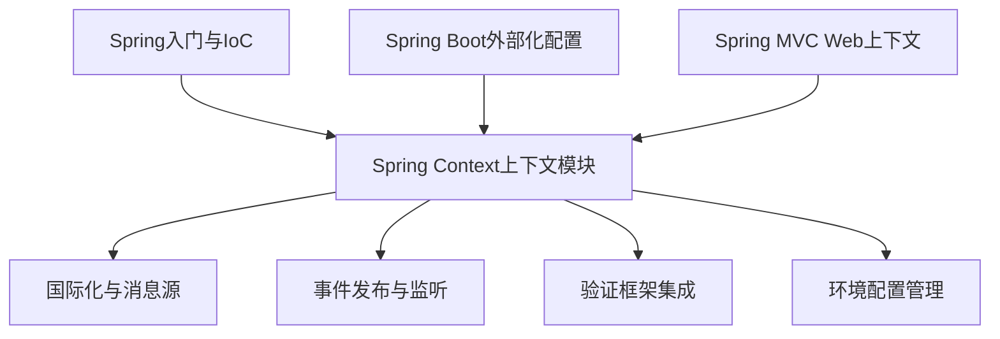
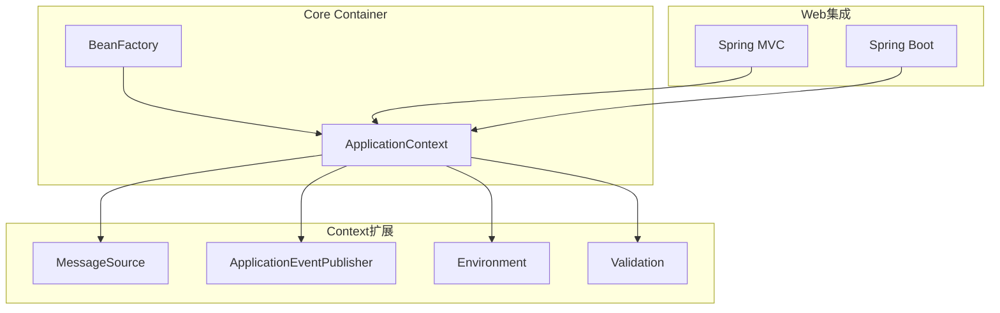
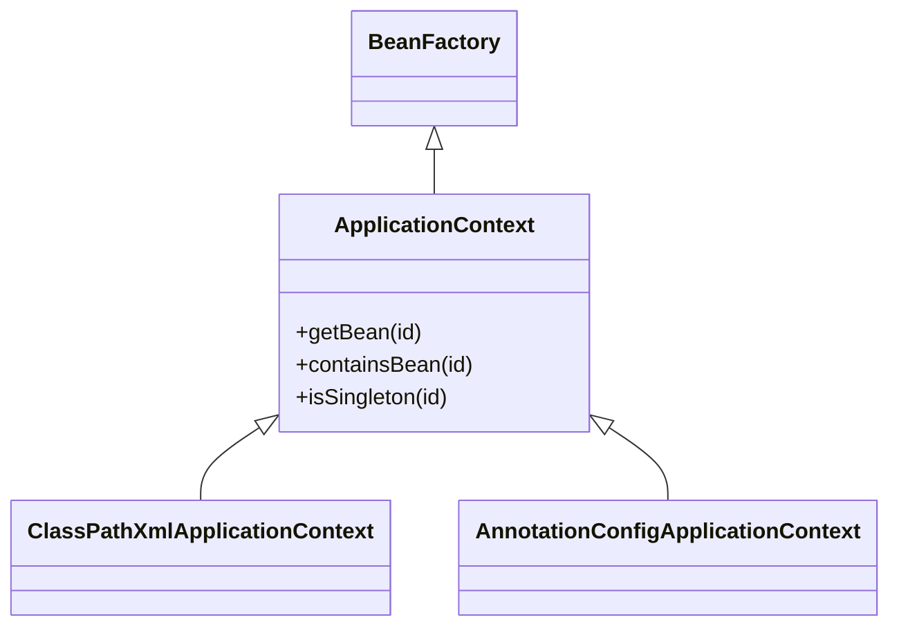
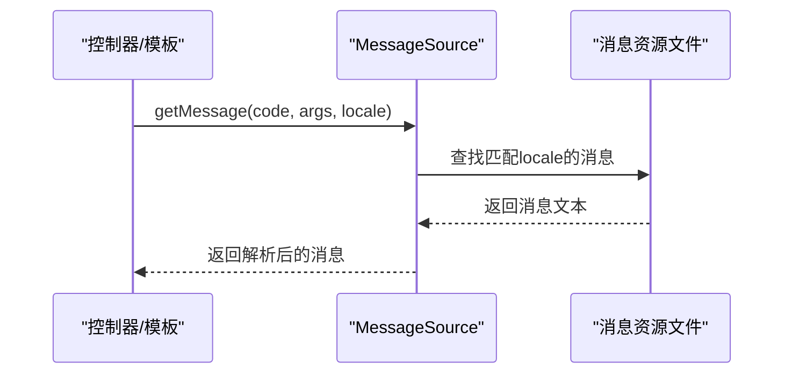
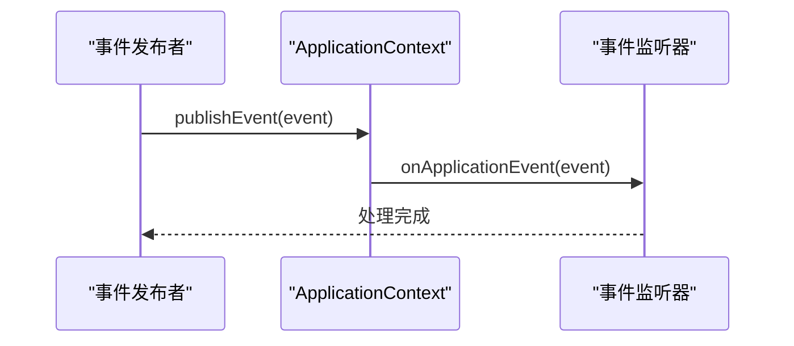
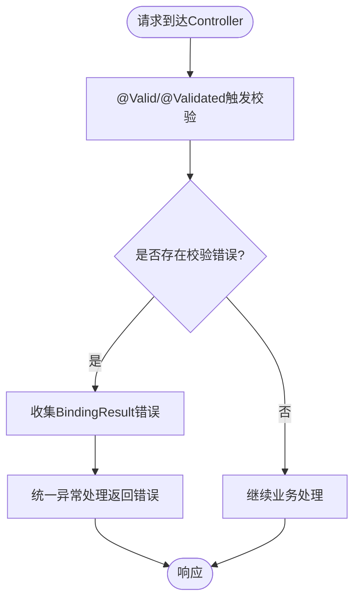
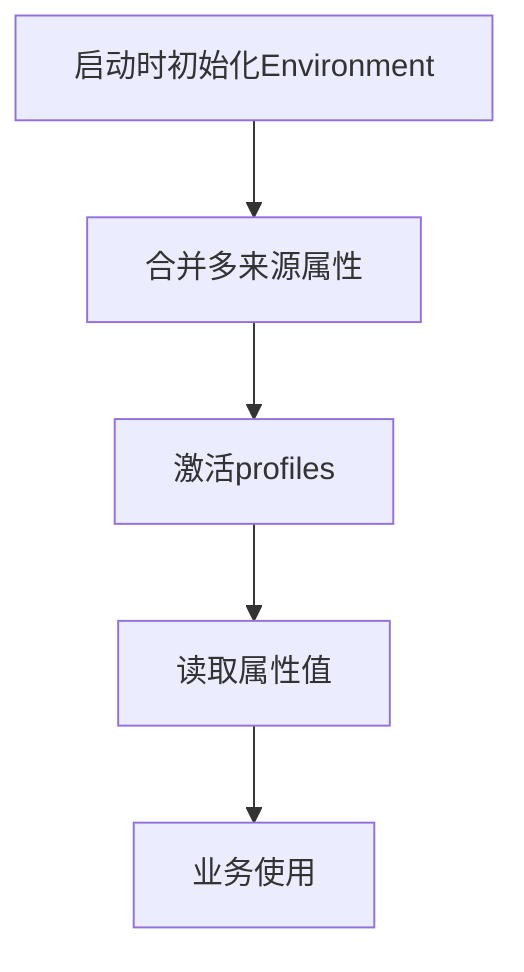
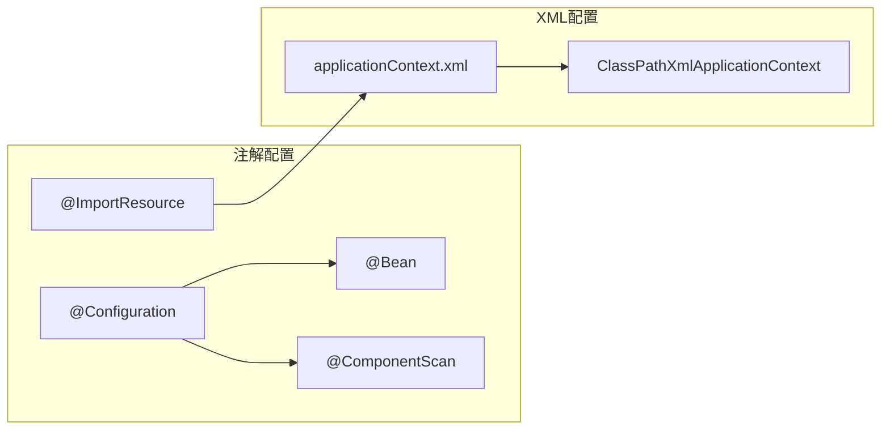
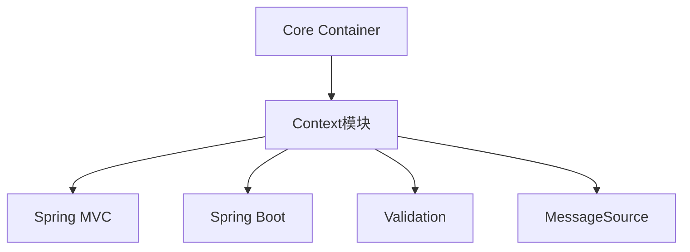

# Context上下文模块

<cite>
**本文档引用的文件**
- [spring.md](file://docs/backend-base/spring/spring.md)
- [spring-boot.md](file://docs/backend-base/spring/spring-boot.md)
- [spring-boot-my.md](file://docs/backend-base/spring/spring-boot-my.md)
- [spring-mvc.md](file://docs/backend-base/spring/spring-mvc.md)
</cite>

## 目录
1. [简介](#简介)
2. [项目结构](#项目结构)
3. [核心组件](#核心组件)
4. [架构总览](#架构总览)
5. [详细组件分析](#详细组件分析)
6. [依赖分析](#依赖分析)
7. [性能考量](#性能考量)
8. [故障排查指南](#故障排查指南)
9. [结论](#结论)
10. [附录](#附录)

## 简介
本文件围绕Spring Framework的Context上下文模块，系统阐述ApplicationContext接口的设计理念、扩展能力与企业级应用价值。重点覆盖国际化支持、事件传播机制、验证框架集成、注解与XML配置方式对比、环境配置管理等主题。文档旨在帮助开发者在企业级应用中正确使用与扩展Context模块，实现松耦合、可测试与可维护的系统架构。

## 项目结构
本仓库中与Spring Context上下文模块相关的内容主要集中在docs/backend-base/spring目录下的多篇文档，涵盖：
- Spring入门与IoC/AOP基础
- Spring Boot外部化配置与自动装配
- Spring Boot参数校验与统一异常处理
- Spring MVC与Web上下文集成

**章节来源**
- [spring.md:135-200](file://docs/backend-base/spring/spring.md#L135-L200)
- [spring-boot.md:1766-1823](file://docs/backend-base/spring/spring-boot.md#L1766-L1823)
- [spring-boot-my.md:289-647](file://docs/backend-base/spring/spring-boot-my.md#L289-L647)
- [spring-mvc.md:1-120](file://docs/backend-base/spring/spring-mvc.md#L1-L120)

## 核心组件
- ApplicationContext接口：IoC容器的高级形态，扩展BeanFactory，提供国际化、事件传播、验证支持与企业服务集成。
- ApplicationEventPublisher：事件发布接口，支持自定义事件与监听器。
- MessageSource：国际化消息解析接口，支持多语言消息与占位符。
- Environment：环境抽象，统一管理配置文件、系统属性、环境变量与命令行参数。
- Validation（Spring Validation）：基于JSR-349的参数校验框架，与Spring MVC无缝集成。

**章节来源**
- [spring.md:155-159](file://docs/backend-base/spring/spring.md#L155-L159)
- [spring-boot.md:1857-1893](file://docs/backend-base/spring/spring-boot.md#L1857-L1893)
- [spring-boot-my.md:289-385](file://docs/backend-base/spring/spring-boot-my.md#L289-L385)

## 架构总览
Spring Context模块在Core Container之上提供丰富的运行时能力，贯穿Web、事务、消息、模板等场景。其核心在于：
- 以ApplicationContext为中心的容器管理
- 事件驱动的解耦扩展点
- 国际化与验证的基础设施
- 与Web层（Spring MVC）和Boot自动装配的协同

**图表来源**
- [spring.md:155-159](file://docs/backend-base/spring/spring.md#L155-L159)
- [spring-mvc.md:31-82](file://docs/backend-base/spring/spring-mvc.md#L31-L82)
- [spring-boot.md:1766-1823](file://docs/backend-base/spring/spring-boot.md#L1766-L1823)

**章节来源**
- [spring.md:147-184](file://docs/backend-base/spring/spring.md#L147-L184)
- [spring-mvc.md:31-82](file://docs/backend-base/spring/spring-mvc.md#L31-L82)

## 详细组件分析

### ApplicationContext接口与扩展
- 设计理念：将对象创建与关系维护从应用代码中剥离，实现控制反转与依赖注入。
- 扩展能力：国际化、事件传播、验证、JNDI访问、EJB集成、远程与时序调度、模板框架集成等。
- 典型实现：ClassPathXmlApplicationContext（基于XML）、AnnotationConfigApplicationContext（基于注解）。

**图表来源**
- [spring.md:584-612](file://docs/backend-base/spring/spring.md#L584-L612)
- [spring.md:5189-5246](file://docs/backend-base/spring/spring.md#L5189-L5246)

**章节来源**
- [spring.md:155-159](file://docs/backend-base/spring/spring.md#L155-L159)
- [spring.md:584-612](file://docs/backend-base/spring/spring.md#L584-L612)

### 国际化支持（MessageSource）
- 作用：提供多语言消息解析与占位符处理，支持基于basename的消息文件与区域化资源。
- 配置方式：XML（applicationContext.xml）与注解（@ImportResource）混合使用；Spring Boot通过application.properties/yml配置。
- 使用场景：Web模板（Thymeleaf）中使用#{message.code}解析消息。

**图表来源**
- [spring-boot.md:6018-6079](file://docs/backend-base/spring/spring-boot.md#L6018-L6079)

**章节来源**
- [spring-boot.md:6018-6079](file://docs/backend-base/spring/spring-boot.md#L6018-L6079)
- [spring-boot-my.md:1766-1823](file://docs/backend-base/spring/spring-boot-my.md#L1766-L1823)

### 事件传播机制（ApplicationEventPublisher）
- 作用：在应用内传播自定义事件，实现组件间解耦。
- 典型流程：事件发布者发布事件 -> 容器收集监听器 -> 逐个回调监听器方法。
- 配置方式：XML中定义监听器bean；注解方式通过@Component/@EventListener（Spring Boot）。

**图表来源**
- [spring-boot-my.md:1766-1823](file://docs/backend-base/spring/spring-boot-my.md#L1766-L1823)

**章节来源**
- [spring-boot-my.md:1766-1823](file://docs/backend-base/spring/spring-boot-my.md#L1766-L1823)

### 验证框架集成（Spring Validation）
- 作用：对请求参数进行声明式校验，支持分组校验与自定义校验注解。
- 集成方式：Spring MVC中通过@Valid/@Validated自动触发校验，统一异常处理返回错误信息。
- 配置要点：引入spring-boot-starter-validation依赖，Controller中使用BindingResult收集错误。

**图表来源**
- [spring-boot-my.md:289-385](file://docs/backend-base/spring/spring-boot-my.md#L289-L385)

**章节来源**
- [spring-boot-my.md:289-385](file://docs/backend-base/spring/spring-boot-my.md#L289-L385)

### 环境配置管理（Environment）
- 作用：统一管理配置来源（系统属性、环境变量、命令行参数、配置文件），提供属性读取与激活profiles。
- 使用方式：注入Environment对象读取属性；Spring Boot通过application.properties/yml集中管理。
- 典型场景：根据环境切换配置、动态读取外部化配置。

**图表来源**
- [spring-boot.md:1857-1893](file://docs/backend-base/spring/spring-boot.md#L1857-L1893)

**章节来源**
- [spring-boot.md:1857-1893](file://docs/backend-base/spring/spring-boot.md#L1857-L1893)

### 注解配置 vs XML配置
- 注解配置（Spring Boot）：基于@ImportResource加载XML；通过@Configuration/@Bean定义Bean；组件扫描自动注册。
- XML配置：通过applicationContext.xml声明Bean、视图解析器、拦截器等；ClassPathXmlApplicationContext加载。
- 对比要点：注解配置更简洁、可读性强；XML配置适合遗留系统与复杂场景的集中管理。

**图表来源**
- [spring-boot-my.md:1766-1823](file://docs/backend-base/spring/spring-boot-my.md#L1766-L1823)
- [spring.md:584-612](file://docs/backend-base/spring/spring.md#L584-L612)

**章节来源**
- [spring-boot-my.md:1766-1823](file://docs/backend-base/spring/spring-boot-my.md#L1766-L1823)
- [spring.md:584-612](file://docs/backend-base/spring/spring.md#L584-L612)

## 依赖分析
- Context模块依赖Core Container（BeanFactory/ApplicationContext）提供Bean管理。
- 与Web模块（Spring MVC）集成，通过DispatcherServlet接入请求处理。
- 与Boot自动装配协同，通过@EnableAutoConfiguration与条件注解实现按需装配。
- 与Validation模块集成，提供参数校验能力；与MessageSource集成，提供国际化能力。

**图表来源**
- [spring-mvc.md:31-82](file://docs/backend-base/spring/spring-mvc.md#L31-L82)
- [spring-boot.md:1766-1823](file://docs/backend-base/spring/spring-boot.md#L1766-L1823)

**章节来源**
- [spring-mvc.md:31-82](file://docs/backend-base/spring/spring-mvc.md#L31-L82)
- [spring-boot.md:1766-1823](file://docs/backend-base/spring/spring-boot.md#L1766-L1823)

## 性能考量
- 启动性能：Spring Boot通过自动配置减少XML配置与样板代码，提升启动速度。
- 运行时性能：合理使用@Lazy、@Scope("prototype")等注解控制Bean生命周期；避免过度依赖反射与动态代理。
- 国际化性能：消息资源文件应集中管理，避免频繁I/O；在高频场景下可考虑缓存解析结果。
- 事件处理：监听器数量过多会影响事件发布性能，建议按需注册与异步化处理。

## 故障排查指南
- 国际化消息未生效
  - 检查消息文件命名与basename配置是否一致
  - 确认locale解析与资源文件命名匹配（如messages_zh_CN.properties）
  - 参考：[spring-boot.md:6018-6079](file://docs/backend-base/spring/spring-boot.md#L6018-L6079)
- 事件监听未触发
  - 确认监听器Bean已注册且可被容器管理
  - 检查事件发布时机与监听器方法签名
  - 参考：[spring-boot-my.md:1766-1823](file://docs/backend-base/spring/spring-boot-my.md#L1766-L1823)
- 参数校验异常未被捕获
  - 确认Controller方法使用@Valid/@Validated
  - 检查统一异常处理是否正确映射校验异常
  - 参考：[spring-boot-my.md:289-385](file://docs/backend-base/spring/spring-boot-my.md#L289-L385)
- 环境属性读取失败
  - 检查Environment中属性来源顺序与覆盖关系
  - 确认命令行参数、系统属性、配置文件优先级
  - 参考：[spring-boot.md:1857-1893](file://docs/backend-base/spring/spring-boot.md#L1857-L1893)

**章节来源**
- [spring-boot.md:6018-6079](file://docs/backend-base/spring/spring-boot.md#L6018-L6079)
- [spring-boot-my.md:1766-1823](file://docs/backend-base/spring/spring-boot-my.md#L1766-L1823)
- [spring-boot-my.md:289-385](file://docs/backend-base/spring/spring-boot-my.md#L289-L385)
- [spring-boot.md:1857-1893](file://docs/backend-base/spring/spring-boot.md#L1857-L1893)

## 结论
Spring Context模块通过ApplicationContext为核心，向上提供国际化、事件、验证与环境配置等企业级能力，向下与Core Container、Web与Boot紧密协作。注解配置与XML配置各有优势，应结合项目演进阶段与团队偏好选择。遵循本文的最佳实践与故障排查建议，可在企业级应用中高效、稳定地使用Context模块。

## 附录
- 代码示例路径（不直接展示代码内容）
  - 国际化消息文件与模板使用：[spring-boot.md:6018-6079](file://docs/backend-base/spring/spring-boot.md#L6018-L6079)
  - 事件发布与监听配置：[spring-boot-my.md:1766-1823](file://docs/backend-base/spring/spring-boot-my.md#L1766-L1823)
  - 参数校验与统一异常处理：[spring-boot-my.md:289-385](file://docs/backend-base/spring/spring-boot-my.md#L289-L385)
  - 环境属性读取与profiles激活：[spring-boot.md:1857-1893](file://docs/backend-base/spring/spring-boot.md#L1857-L1893)
  - XML配置与ClassPathXmlApplicationContext：[spring.md:584-612](file://docs/backend-base/spring/spring.md#L584-L612)