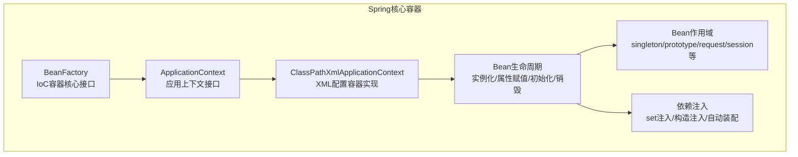
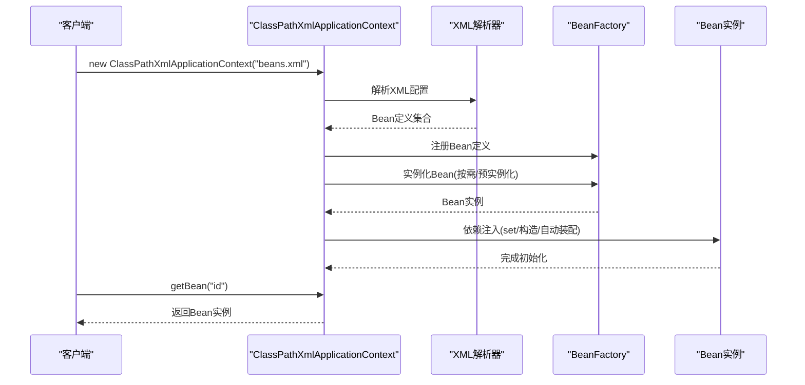
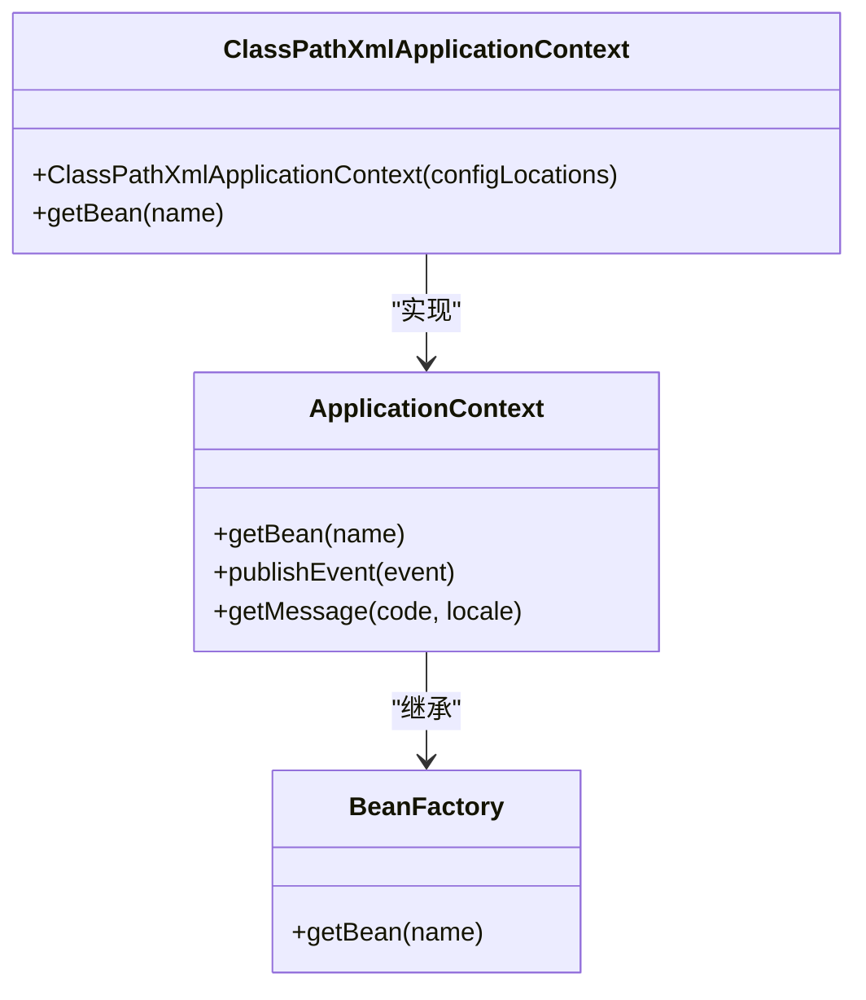
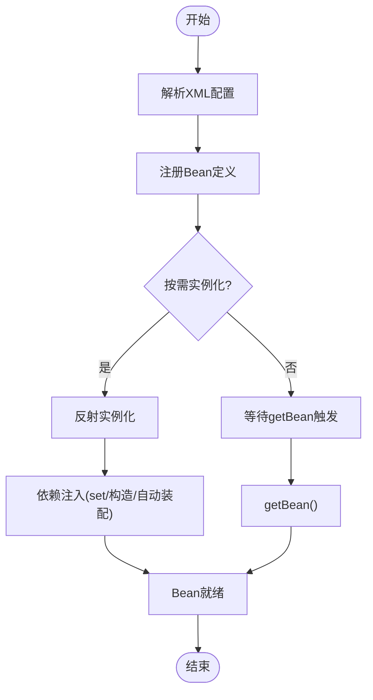
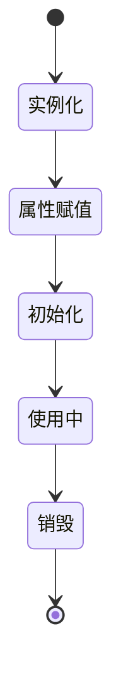
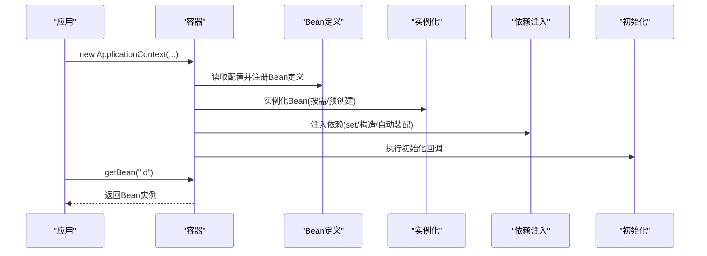
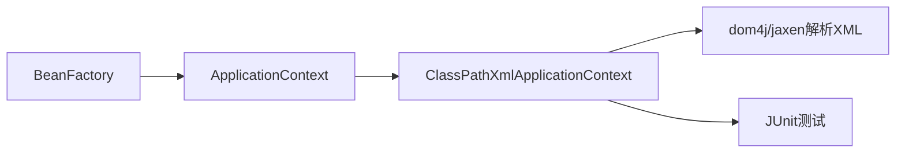

# Core Container核心容器

<cite>
**本文档引用的文件**
- [spring.md](file://docs/backend-base/spring/spring.md)
</cite>

## 目录
1. [引言](#引言)
2. [项目结构](#项目结构)
3. [核心组件](#核心组件)
4. [架构概览](#架构概览)
5. [详细组件分析](#详细组件分析)
6. [依赖分析](#依赖分析)
7. [性能考虑](#性能考虑)
8. [故障排查指南](#故障排查指南)
9. [结论](#结论)
10. [附录](#附录)

## 引言
本章节围绕Spring Framework的核心容器模块，系统阐述BeanFactory与ApplicationContext两大核心组件的设计理念、功能差异与适用场景，深入解析IoC容器的工作原理（Bean生命周期管理、作用域控制、依赖注入机制），并结合文档中的示例讲解容器初始化、Bean创建时机与依赖解析机制。最后给出最佳实践与性能优化建议，帮助开发者在企业级应用中正确选择与使用容器。

## 项目结构
本项目为Spring学习资料集合，核心容器相关内容集中在Spring模块文档中，涵盖从入门示例到高级特性（事务、AOP、注解开发等）的完整知识体系。核心容器相关章节主要分布在以下区域：
- 核心容器与IoC基础：Bean的作用域、实例化方式、依赖注入（set/构造注入）、自动装配、属性文件引入等
- BeanFactory与ApplicationContext：接口对比、实现差异、使用场景
- 容器初始化与Bean生命周期：XML配置、注解配置、容器启动流程
- 实战示例：ClassPathXmlApplicationContext、Bean装配、作用域与生命周期演示

**图表来源**
- [spring.md:2801-2943](file://docs/backend-base/spring/spring.md#L2801-L2943)
- [spring.md:3657-3887](file://docs/backend-base/spring/spring.md#L3657-L3887)
- [spring.md:474-479](file://docs/backend-base/spring/spring.md#L474-L479)

**章节来源**
- [spring.md:2801-2943](file://docs/backend-base/spring/spring.md#L2801-L2943)
- [spring.md:3657-3887](file://docs/backend-base/spring/spring.md#L3657-L3887)
- [spring.md:474-479](file://docs/backend-base/spring/spring.md#L474-L479)

## 核心组件
本节聚焦核心容器的两大组件：BeanFactory与ApplicationContext，结合文档中的概念与示例，说明其职责边界与使用差异。

- BeanFactory
  - 定位：IoC容器的顶级接口，负责Bean的创建与管理，体现“Bean工厂”的职责
  - 特点：最小可用能力，适合轻量级或自定义容器实现
  - 文档依据：BeanFactory被描述为“Bean工厂”，负责创建Bean对象

- ApplicationContext
  - 定位：在BeanFactory基础上扩展的高级容器，提供国际化、事件传播、资源访问、AOP等企业级特性
  - 特点：更易用、功能更全，适合企业级应用
  - 文档依据：ApplicationContext扩展了BeanFactory，增加国际化、事件、验证、企业服务等能力

- 关系与对比
  - ApplicationContext继承BeanFactory，二者在获取Bean的能力上一致
  - ApplicationContext在BeanFactory之上提供更高层的基础设施与扩展能力
  - 文档中明确指出ApplicationContext是BeanFactory的子接口

**章节来源**
- [spring.md:3889-3898](file://docs/backend-base/spring/spring.md#L3889-L3898)
- [spring.md:687-693](file://docs/backend-base/spring/spring.md#L687-L693)

## 架构概览
下图展示了核心容器的高层架构与关键流程：容器初始化、Bean解析与实例化、依赖注入、作用域与生命周期管理。

**图表来源**
- [spring.md:5166-5282](file://docs/backend-base/spring/spring.md#L5166-L5282)
- [spring.md:5248-5455](file://docs/backend-base/spring/spring.md#L5248-L5455)

**章节来源**
- [spring.md:5166-5282](file://docs/backend-base/spring/spring.md#L5166-L5282)
- [spring.md:5248-5455](file://docs/backend-base/spring/spring.md#L5248-L5455)

## 详细组件分析

### BeanFactory与ApplicationContext对比分析
- 设计理念
  - BeanFactory：强调“工厂”职责，提供最小IoC容器能力
  - ApplicationContext：在BeanFactory基础上扩展，提供更丰富的企业级特性
- 功能差异
  - BeanFactory：核心Bean管理、按需实例化
  - ApplicationContext：国际化、事件传播、资源访问、AOP、事务等
- 使用场景
  - BeanFactory：轻量级、自定义容器、对性能敏感的场景
  - ApplicationContext：标准企业级应用、快速开发与集成

**图表来源**
- [spring.md:3889-3898](file://docs/backend-base/spring/spring.md#L3889-L3898)
- [spring.md:5166-5205](file://docs/backend-base/spring/spring.md#L5166-L5205)

**章节来源**
- [spring.md:3889-3898](file://docs/backend-base/spring/spring.md#L3889-L3898)
- [spring.md:5166-5205](file://docs/backend-base/spring/spring.md#L5166-L5205)

### IoC容器工作原理与依赖注入
- 控制反转（IoC）
  - 将对象创建与关系维护的权利交给容器，降低耦合度
  - 文档明确指出IoC通过依赖注入（DI）实现
- 依赖注入方式
  - set注入：通过反射调用setter方法完成属性赋值
  - 构造注入：通过调用构造方法完成属性赋值
  - 自动装配：byName/byType根据名称或类型自动装配
- XML配置要点
  - bean标签定义id/class
  - property/ref/value等标签完成注入与赋值
  - 文档提供了大量set/构造注入与自动装配的示例

**图表来源**
- [spring.md:5248-5455](file://docs/backend-base/spring/spring.md#L5248-L5455)
- [spring.md:855-965](file://docs/backend-base/spring/spring.md#L855-L965)
- [spring.md:1008-1117](file://docs/backend-base/spring/spring.md#L1008-L1117)

**章节来源**
- [spring.md:5248-5455](file://docs/backend-base/spring/spring.md#L5248-L5455)
- [spring.md:855-965](file://docs/backend-base/spring/spring.md#L855-L965)
- [spring.md:1008-1117](file://docs/backend-base/spring/spring.md#L1008-L1117)

### Bean的作用域与生命周期
- 作用域
  - singleton：默认单例，容器启动时创建
  - prototype：多例，每次getBean创建新实例
  - request/session/application/websocket等（Web环境）
- 生命周期
  - 实例化 → 属性赋值 → 初始化 → 销毁
  - 文档通过示例验证默认单例与按需实例化的差异

**图表来源**
- [spring.md:2801-2943](file://docs/backend-base/spring/spring.md#L2801-L2943)
- [spring.md:2945-2990](file://docs/backend-base/spring/spring.md#L2945-L2990)

**章节来源**
- [spring.md:2801-2943](file://docs/backend-base/spring/spring.md#L2801-L2943)
- [spring.md:2945-2990](file://docs/backend-base/spring/spring.md#L2945-L2990)

### 容器初始化与Bean创建时机
- 初始化流程
  - 加载XML配置 → 解析Bean定义 → 实例化Bean → 依赖注入 → 初始化完成
  - 文档通过自研ClassPathXmlApplicationContext逐步实现解析、实例化、注入与获取Bean的完整流程
- 创建时机
  - 默认单例：容器启动时创建
  - 多例：调用getBean时创建
  - 自定义实例化方式：构造方法、简单工厂、factory-bean、FactoryBean接口

**图表来源**
- [spring.md:5248-5455](file://docs/backend-base/spring/spring.md#L5248-L5455)
- [spring.md:3657-3887](file://docs/backend-base/spring/spring.md#L3657-L3887)

**章节来源**
- [spring.md:5248-5455](file://docs/backend-base/spring/spring.md#L5248-L5455)
- [spring.md:3657-3887](file://docs/backend-base/spring/spring.md#L3657-L3887)

### 配置与使用示例（路径指引）
以下为文档中涉及的配置与使用示例的路径指引，便于开发者对照学习：

- 基础Bean与XML配置
  - 示例路径：[spring.md:436-470](file://docs/backend-base/spring/spring.md#L436-L470)
- set注入示例
  - 示例路径：[spring.md:855-965](file://docs/backend-base/spring/spring.md#L855-L965)
- 构造注入示例
  - 示例路径：[spring.md:1008-1117](file://docs/backend-base/spring/spring.md#L1008-L1117)
- 自动装配（byName/byType）
  - 示例路径：[spring.md:2534-2696](file://docs/backend-base/spring/spring.md#L2534-L2696)
- 引入外部属性文件
  - 示例路径：[spring.md:2771-2799](file://docs/backend-base/spring/spring.md#L2771-L2799)
- Bean作用域（singleton/prototype）
  - 示例路径：[spring.md:2817-2931](file://docs/backend-base/spring/spring.md#L2817-L2931)
- 自定义实例化方式（构造/简单工厂/factory-bean/FactoryBean）
  - 示例路径：[spring.md:3664-3887](file://docs/backend-base/spring/spring.md#L3664-L3887)
- 自研容器实现（ClassPathXmlApplicationContext）
  - 示例路径：[spring.md:5166-5455](file://docs/backend-base/spring/spring.md#L5166-L5455)

**章节来源**
- [spring.md:436-470](file://docs/backend-base/spring/spring.md#L436-L470)
- [spring.md:855-965](file://docs/backend-base/spring/spring.md#L855-L965)
- [spring.md:1008-1117](file://docs/backend-base/spring/spring.md#L1008-L1117)
- [spring.md:2534-2696](file://docs/backend-base/spring/spring.md#L2534-L2696)
- [spring.md:2771-2799](file://docs/backend-base/spring/spring.md#L2771-L2799)
- [spring.md:2817-2931](file://docs/backend-base/spring/spring.md#L2817-L2931)
- [spring.md:3664-3887](file://docs/backend-base/spring/spring.md#L3664-L3887)
- [spring.md:5166-5455](file://docs/backend-base/spring/spring.md#L5166-L5455)

## 依赖分析
- 组件耦合
  - ApplicationContext依赖BeanFactory实现核心Bean管理
  - ClassPathXmlApplicationContext实现ApplicationContext，负责XML配置解析与Bean注册
- 外部依赖
  - 文档示例中使用dom4j/jaxen解析XML，JUnit进行测试
- 循环依赖处理
  - 文档自研实现中体现了“实例化与属性赋值分离”的思路，有助于缓解循环依赖问题

**图表来源**
- [spring.md:5166-5282](file://docs/backend-base/spring/spring.md#L5166-L5282)

**章节来源**
- [spring.md:5166-5282](file://docs/backend-base/spring/spring.md#L5166-L5282)

## 性能考虑
- 单例与多例的选择
  - 默认单例可减少对象创建开销，适合无状态Bean
  - 多例适合有状态或昂贵资源占用的Bean
- 按需实例化
  - 容器启动时仅创建单例Bean，按需实例化多例Bean，降低启动时间
- 自定义实例化方式
  - 通过FactoryBean等机制可灵活控制Bean创建成本与时机
- 最佳实践
  - 优先使用构造注入以保证不可变性与线程安全
  - 合理设置作用域，避免不必要的多例Bean
  - 使用自动装配时明确byType的唯一性，避免歧义

[本节为通用指导，无需特定文件引用]

## 故障排查指南
- 常见问题与定位
  - Bean未找到：检查id是否正确、配置文件路径是否正确
  - 注入失败：确认setter方法是否存在、自动装配byType是否唯一
  - 循环依赖：检查Bean间依赖关系，必要时调整设计或使用FactoryBean
  - 作用域混淆：确认singleton与prototype的使用场景
- 日志与诊断
  - 文档中建议启用日志框架（如Log4j2）以辅助诊断容器初始化与Bean生命周期问题

**章节来源**
- [spring.md:689-693](file://docs/backend-base/spring/spring.md#L689-L693)
- [spring.md:2680-2696](file://docs/backend-base/spring/spring.md#L2680-L2696)

## 结论
Spring核心容器通过BeanFactory与ApplicationContext两级抽象，实现了从基础IoC到企业级应用的完整覆盖。开发者应根据场景选择合适的容器与实例化方式，合理运用依赖注入、作用域与生命周期管理，结合文档示例与最佳实践，构建高性能、可维护的企业级应用。

[本节为总结性内容，无需特定文件引用]

## 附录
- 相关示例路径（供进一步学习）
  - [spring.md:5166-5455](file://docs/backend-base/spring/spring.md#L5166-L5455)
  - [spring.md:855-1117](file://docs/backend-base/spring/spring.md#L855-L1117)
  - [spring.md:2534-2696](file://docs/backend-base/spring/spring.md#L2534-L2696)
  - [spring.md:2771-2799](file://docs/backend-base/spring/spring.md#L2771-L2799)
  - [spring.md:3664-3887](file://docs/backend-base/spring/spring.md#L3664-L3887)

[本节为补充材料，无需特定文件引用]