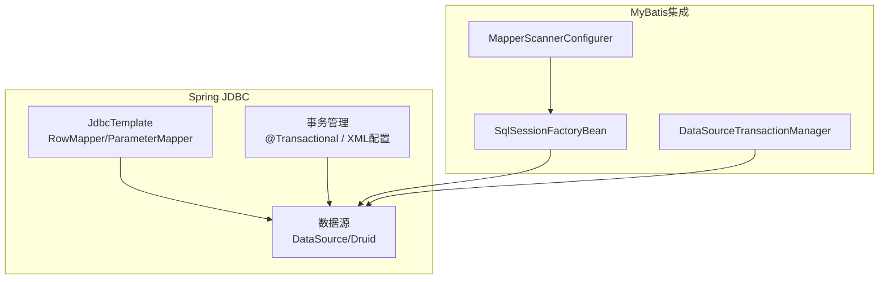
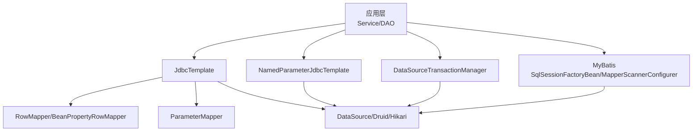
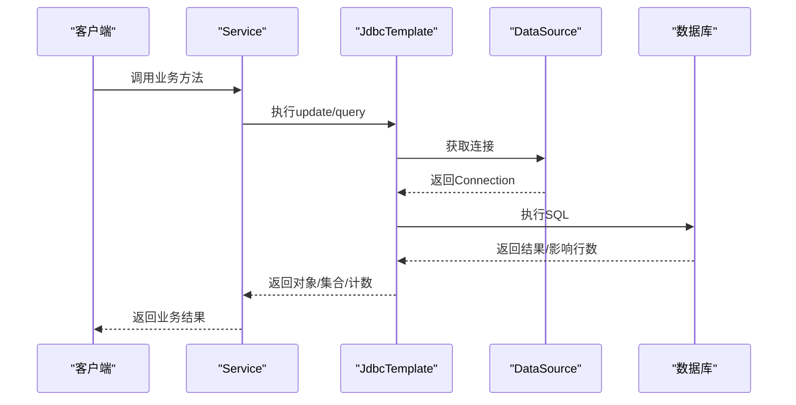
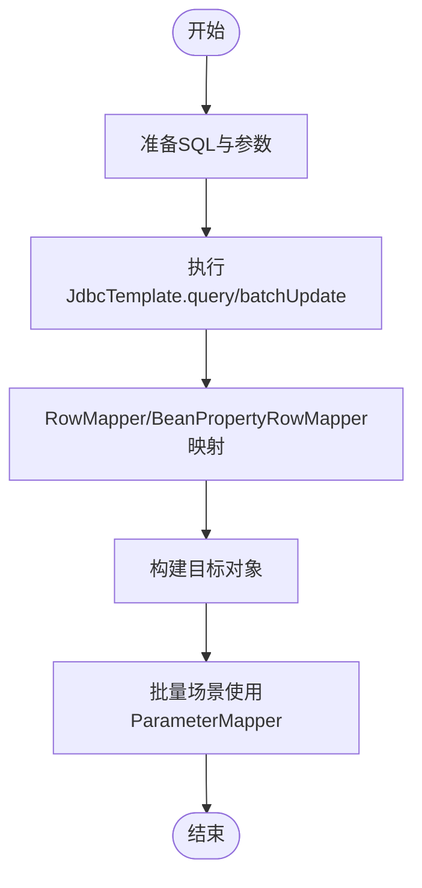
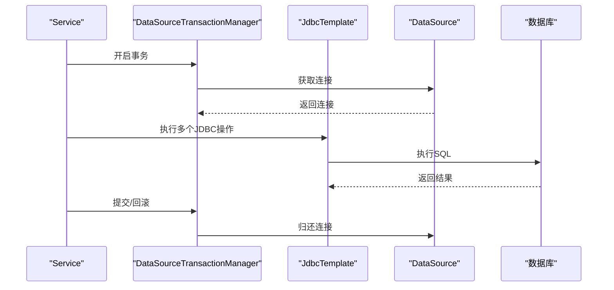
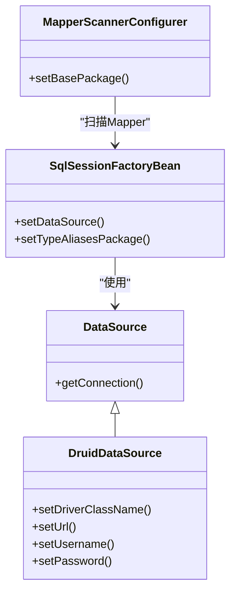
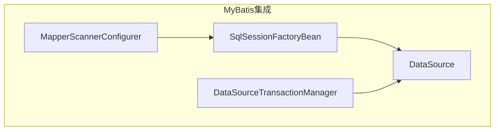
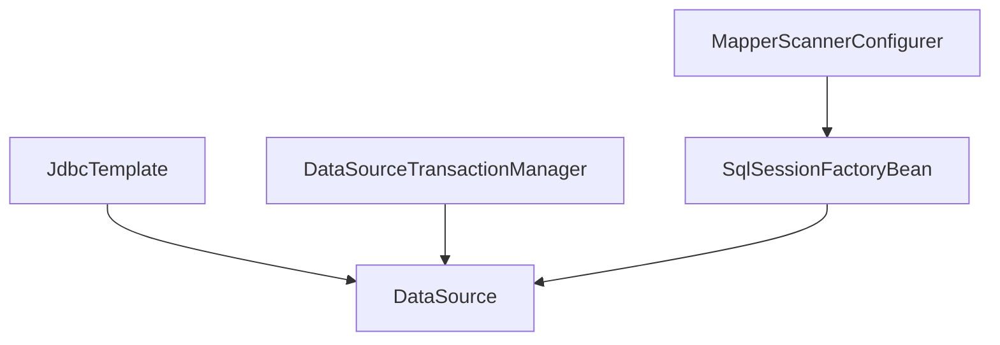

# DAO数据访问对象

<cite>
**本文引用的文件**
- [spring.md](file://docs/backend-base/spring/spring.md)
- [spring-mvc.md](file://docs/backend-base/spring/spring-mvc.md)
- [mybatis-mapper.md](file://docs/backend-base/mybatis/mybatis-mapper.md)
- [mapper.md](file://docs/backend-base/mybatis/mapper.md)
- [config.md](file://docs/backend-base/mybatis/config.md)
</cite>

## 目录
1. [引言](#引言)
2. [项目结构](#项目结构)
3. [核心组件](#核心组件)
4. [架构总览](#架构总览)
5. [详细组件分析](#详细组件分析)
6. [依赖分析](#依赖分析)
7. [性能考虑](#性能考虑)
8. [故障排查指南](#故障排查指南)
9. [结论](#结论)
10. [附录](#附录)

## 引言
本篇文档围绕Spring Framework的DAO模块展开，系统阐述Spring对JDBC的抽象与简化，涵盖JdbcTemplate、NamedParameterJdbcTemplate等核心类的使用方法；详解Spring的异常层次结构与数据库异常到统一异常类型的转换策略；给出数据源配置最佳实践（含连接池与事务管理）；并通过示例路径说明增删改查、批量操作、回调接口RowMapper/ParameterMapper的使用；最后提供与MyBatis、Hibernate的集成方案及性能优化与常见问题解决方案。

## 项目结构
本仓库与Spring DAO相关的知识主要集中在后端基础文档中的Spring章节与MyBatis章节，涉及：
- Spring JDBC与事务管理：JdbcTemplate使用、事务注解、XML与注解配置
- MyBatis集成：SqlSessionFactoryBean、Mapper扫描、事务管理器
- MyBatis配置：数据源、连接池、事务管理器类型
- Spring MVC与MyBatis整合示例

**图表来源**
- [spring.md:6724-7200](file://docs/backend-base/spring/spring.md#L6724-L7200)
- [spring.md:9800-10599](file://docs/backend-base/spring/spring.md#L9800-L10599)
- [config.md:126-178](file://docs/backend-base/mybatis/config.md#L126-L178)

**章节来源**
- [spring.md:6724-7200](file://docs/backend-base/spring/spring.md#L6724-L7200)
- [spring.md:9800-10599](file://docs/backend-base/spring/spring.md#L9800-L10599)
- [config.md:126-178](file://docs/backend-base/mybatis/config.md#L126-L178)

## 核心组件
- JdbcTemplate：Spring对JDBC的模板封装，提供update、queryForObject、query、batchUpdate等便捷方法，配合RowMapper/BeanPropertyRowMapper实现结果映射。
- NamedParameterJdbcTemplate：支持命名参数的JDBC模板，便于复杂SQL参数绑定。
- RowMapper/BeanPropertyRowMapper：将ResultSet行映射为对象的回调接口。
- ParameterMapper：用于批量操作时为每条记录提供参数映射。
- DataSource：数据源抽象，可接入Druid、HikariCP等连接池。
- DataSourceTransactionManager：基于DataSource的声明式事务管理器。
- SqlSessionFactoryBean + MapperScannerConfigurer：MyBatis与Spring集成的关键组件。
- MyBatis配置：数据源类型（UNPOOLED/POOLED/JNDI）、事务管理器类型（JDBC/MANAGED）等。

**章节来源**
- [spring.md:6724-7200](file://docs/backend-base/spring/spring.md#L6724-L7200)
- [spring.md:9800-10599](file://docs/backend-base/spring/spring.md#L9800-L10599)
- [config.md:126-178](file://docs/backend-base/mybatis/config.md#L126-L178)

## 架构总览
Spring DAO模块通过JdbcTemplate简化JDBC操作，结合RowMapper/BeanPropertyRowMapper实现结果映射；通过DataSource与连接池（如Druid）提供稳定的数据库连接；通过DataSourceTransactionManager实现声明式事务管理。MyBatis通过SqlSessionFactoryBean与Mapper扫描器与Spring整合，同样使用DataSourceTransactionManager进行事务管理。

**图表来源**
- [spring.md:6724-7200](file://docs/backend-base/spring/spring.md#L6724-L7200)
- [spring.md:9800-10599](file://docs/backend-base/spring/spring.md#L9800-L10599)
- [config.md:126-178](file://docs/backend-base/mybatis/config.md#L126-L178)

## 详细组件分析

### JdbcTemplate与NamedParameterJdbcTemplate
- JdbcTemplate使用要点
  - 注入DataSource并创建JdbcTemplate Bean
  - 常用方法：update（INSERT/UPDATE/DELETE）、queryForObject（单对象）、query（多对象）、batchUpdate（批量）
  - 结果映射：BeanPropertyRowMapper、自定义RowMapper
- NamedParameterJdbcTemplate使用要点
  - 支持命名参数，便于复杂SQL参数绑定
  - 与JdbcTemplate在数据源层面共享DataSource

**图表来源**
- [spring.md:6724-7200](file://docs/backend-base/spring/spring.md#L6724-L7200)

**章节来源**
- [spring.md:6724-7200](file://docs/backend-base/spring/spring.md#L6724-L7200)

### RowMapper与ParameterMapper
- RowMapper：将ResultSet的每一行映射为一个对象，适用于query方法。
- BeanPropertyRowMapper：基于Bean属性名与列名映射的RowMapper实现。
- ParameterMapper：在批量操作中为每条记录提供参数映射，提升批量性能与灵活性。

**图表来源**
- [spring.md:6724-7200](file://docs/backend-base/spring/spring.md#L6724-L7200)

**章节来源**
- [spring.md:6724-7200](file://docs/backend-base/spring/spring.md#L6724-L7200)

### 事务管理（DataSourceTransactionManager）
- 声明式事务：@Transactional注解或XML配置（tx:advice + aop:advisor）
- 事务属性：传播行为、隔离级别、超时、只读、异常回滚策略
- 与JdbcTemplate协同：事务边界内执行多个JDBC操作，确保一致性

**图表来源**
- [spring.md:9500-9800](file://docs/backend-base/spring/spring.md#L9500-L9800)
- [spring.md:9800-10599](file://docs/backend-base/spring/spring.md#L9800-L10599)

**章节来源**
- [spring.md:9500-9800](file://docs/backend-base/spring/spring.md#L9500-L9800)
- [spring.md:9800-10599](file://docs/backend-base/spring/spring.md#L9800-L10599)

### 数据源配置与连接池
- 数据源实现：DataSource接口，可使用Druid、HikariCP等
- Spring配置：XML或Java配置类注入DataSource Bean
- MyBatis配置：支持UNPOOLED/POOLED/JNDI三种数据源类型，POOLED适合高并发场景

**图表来源**
- [spring.md:9800-10599](file://docs/backend-base/spring/spring.md#L9800-L10599)
- [config.md:126-178](file://docs/backend-base/mybatis/config.md#L126-L178)

**章节来源**
- [spring.md:9800-10599](file://docs/backend-base/spring/spring.md#L9800-L10599)
- [config.md:126-178](file://docs/backend-base/mybatis/config.md#L126-L178)

### 与MyBatis、Hibernate的集成
- MyBatis集成步骤
  - 引入mybatis与mybatis-spring依赖
  - 配置SqlSessionFactoryBean（注入数据源、别名包、核心配置）
  - Mapper扫描：MapperScannerConfigurer或注解扫描
  - 事务管理：DataSourceTransactionManager + @Transactional
- Hibernate集成要点
  - 使用HibernateTemplate或HibernateDaoSupport（Spring对Hibernate的适配）
  - 事务管理：HibernateTransactionManager（基于Hibernate Session）

**图表来源**
- [spring.md:10179-10642](file://docs/backend-base/spring/spring.md#L10179-L10642)
- [spring-mvc.md:7303-7348](file://docs/backend-base/spring/spring-mvc.md#L7303-L7348)

**章节来源**
- [spring.md:10179-10642](file://docs/backend-base/spring/spring.md#L10179-L10642)
- [spring-mvc.md:7303-7348](file://docs/backend-base/spring/spring-mvc.md#L7303-L7348)

### 示例路径（代码片段定位）
- JdbcTemplate增删改查与批量操作示例路径
  - 新增：[spring.md:6978-7007](file://docs/backend-base/spring/spring.md#L6978-L7007)
  - 修改：[spring.md:7014-7026](file://docs/backend-base/spring/spring.md#L7014-L7026)
  - 删除：[spring.md:7030-7042](file://docs/backend-base/spring/spring.md#L7030-L7042)
  - 查询单对象：[spring.md:7046-7058](file://docs/backend-base/spring/spring.md#L7046-L7058)
  - 查询多对象：[spring.md:7067-7079](file://docs/backend-base/spring/spring.md#L7067-L7079)
  - 查询单值：[spring.md:7083-7097](file://docs/backend-base/spring/spring.md#L7083-L7097)
  - 批量新增：[spring.md:7099-7120](file://docs/backend-base/spring/spring.md#L7099-L7120)
  - 批量修改：[spring.md:7124-7144](file://docs/backend-base/spring/spring.md#L7124-L7144)
  - 批量删除：[spring.md:7148-7167](file://docs/backend-base/spring/spring.md#L7148-L7167)
  - 回调函数示例：[spring.md:7171-7198](file://docs/backend-base/spring/spring.md#L7171-L7198)
- 事务注解与XML配置示例路径
  - 注解式事务：[spring.md:9500-9534](file://docs/backend-base/spring/spring.md#L9500-L9534)
  - XML式事务：[spring.md:9866-9952](file://docs/backend-base/spring/spring.md#L9866-L9952)
- MyBatis集成示例路径
  - 集成步骤与配置：[spring.md:10179-10642](file://docs/backend-base/spring/spring.md#L10179-L10642)
  - Spring MVC整合示例：[spring-mvc.md:7303-7348](file://docs/backend-base/spring/spring-mvc.md#L7303-L7348)

**章节来源**
- [spring.md:6978-7198](file://docs/backend-base/spring/spring.md#L6978-L7198)
- [spring.md:9500-9952](file://docs/backend-base/spring/spring.md#L9500-L9952)
- [spring.md:10179-10642](file://docs/backend-base/spring/spring.md#L10179-L10642)
- [spring-mvc.md:7303-7348](file://docs/backend-base/spring/spring-mvc.md#L7303-L7348)

## 依赖分析
- 组件耦合
  - JdbcTemplate依赖DataSource；事务管理器依赖DataSource；MyBatis通过SqlSessionFactoryBean间接依赖DataSource
  - MapperScannerConfigurer依赖SqlSessionFactoryBean，二者共同构成MyBatis的Spring集成
- 外部依赖
  - MySQL驱动、Druid/HikariCP连接池、MyBatis与mybatis-spring、Spring JDBC与事务模块

**图表来源**
- [spring.md:9800-10599](file://docs/backend-base/spring/spring.md#L9800-L10599)
- [config.md:126-178](file://docs/backend-base/mybatis/config.md#L126-L178)

**章节来源**
- [spring.md:9800-10599](file://docs/backend-base/spring/spring.md#L9800-L10599)
- [config.md:126-178](file://docs/backend-base/mybatis/config.md#L126-L178)

## 性能考虑
- 连接池配置
  - 选择合适的连接池（如Druid），合理设置最大活跃连接、空闲连接、连接超时与Ping检测
  - MyBatis配置中POOLED类型适合高并发场景，UNPOOLED适合简单应用
- SQL与映射
  - 使用命名参数（NamedParameterJdbcTemplate）提升可读性与可维护性
  - RowMapper/BeanPropertyRowMapper减少手工映射开销
- 批量操作
  - 使用batchUpdate进行批量插入/更新/删除，减少往返次数
- 事务策略
  - 合理设置事务隔离级别与超时，避免长时间持有锁
  - 对只读查询设置只读事务，提升查询性能

**章节来源**
- [config.md:126-178](file://docs/backend-base/mybatis/config.md#L126-L178)
- [spring.md:6724-7200](file://docs/backend-base/spring/spring.md#L6724-L7200)
- [spring.md:9500-9800](file://docs/backend-base/spring/spring.md#L9500-L9800)

## 故障排查指南
- 数据库异常转换
  - Spring JDBC将底层SQLException转换为DataAccessException体系，便于统一处理
- 常见问题
  - 连接池耗尽：检查最大连接数、连接泄漏、超时设置
  - 事务未生效：确认事务管理器已注入、注解或XML配置正确、异常类型与回滚策略
  - MyBatis映射异常：核对命名空间、resultType/resultMap、列名与属性名映射
- 日志与监控
  - 启用MyBatis日志（STDOUT_LOGGING）与Spring日志，定位问题
  - 使用Druid监控面板观察连接池状态

**章节来源**
- [spring.md:9500-9800](file://docs/backend-base/spring/spring.md#L9500-L9800)
- [config.md:126-178](file://docs/backend-base/mybatis/config.md#L126-L178)

## 结论
Spring DAO模块通过JdbcTemplate、RowMapper/BeanPropertyRowMapper、NamedParameterJdbcTemplate等组件显著简化了JDBC开发；结合DataSource与连接池、DataSourceTransactionManager实现稳定高效的数据库访问与事务管理。MyBatis通过SqlSessionFactoryBean与Mapper扫描器与Spring无缝集成，提供灵活的SQL映射能力。合理配置连接池、批处理与事务策略，可有效提升性能与稳定性。

## 附录
- MyBatis映射与结果映射要点
  - 简单字段映射与自动映射、resultMap与constructor映射、association/collection复杂映射
  - 参考：[mybatis-mapper.md:1-135](file://docs/backend-base/mybatis/mybatis-mapper.md#L1-L135)、[mapper.md:1-242](file://docs/backend-base/mybatis/mapper.md#L1-L242)

**章节来源**
- [mybatis-mapper.md:1-135](file://docs/backend-base/mybatis/mybatis-mapper.md#L1-L135)
- [mapper.md:1-242](file://docs/backend-base/mybatis/mapper.md#L1-L242)