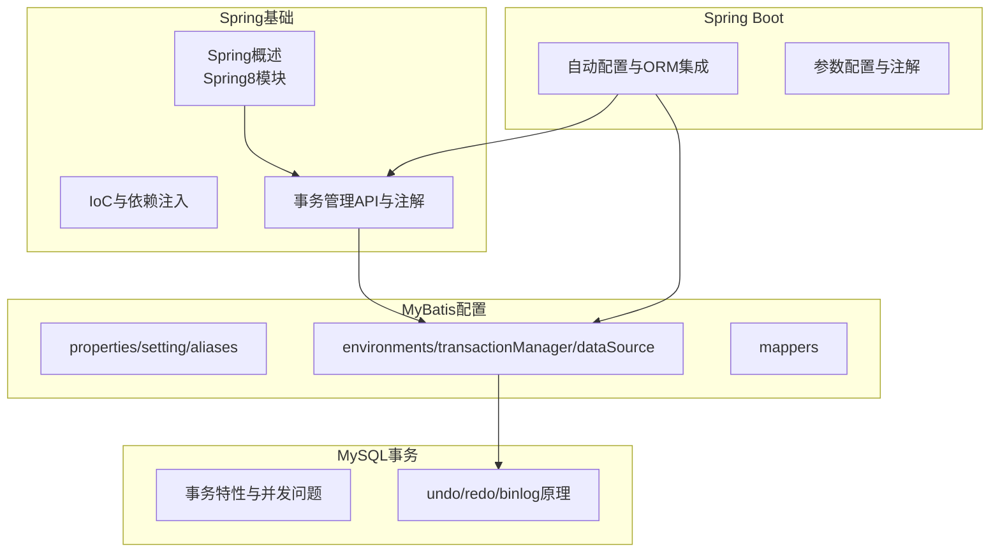
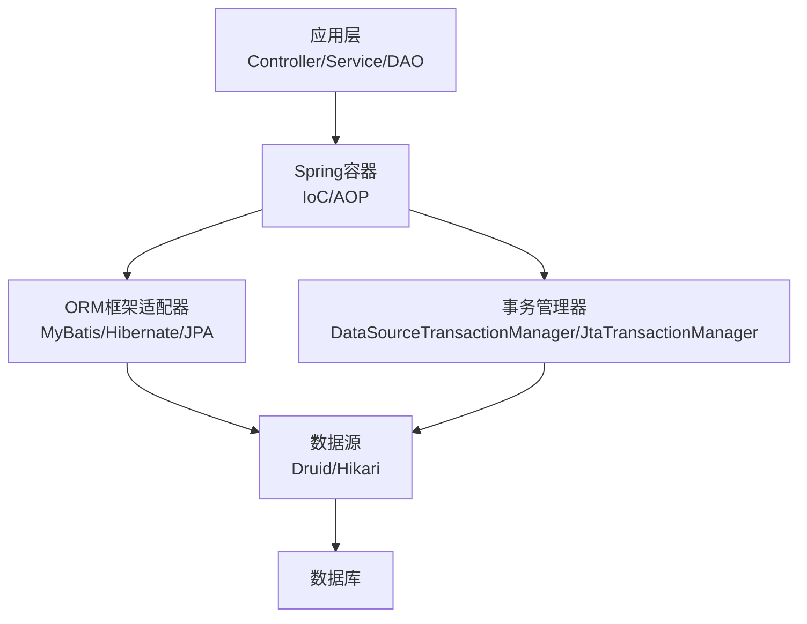
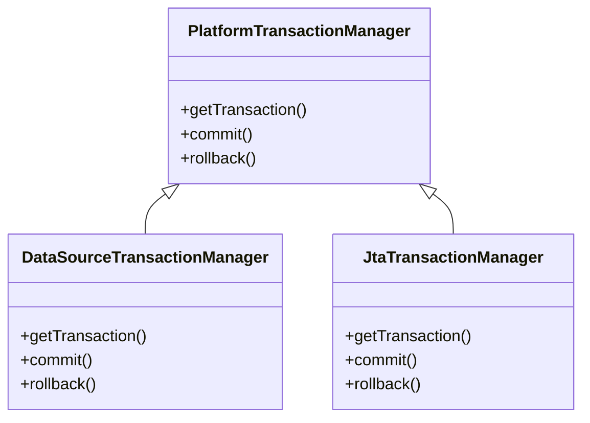
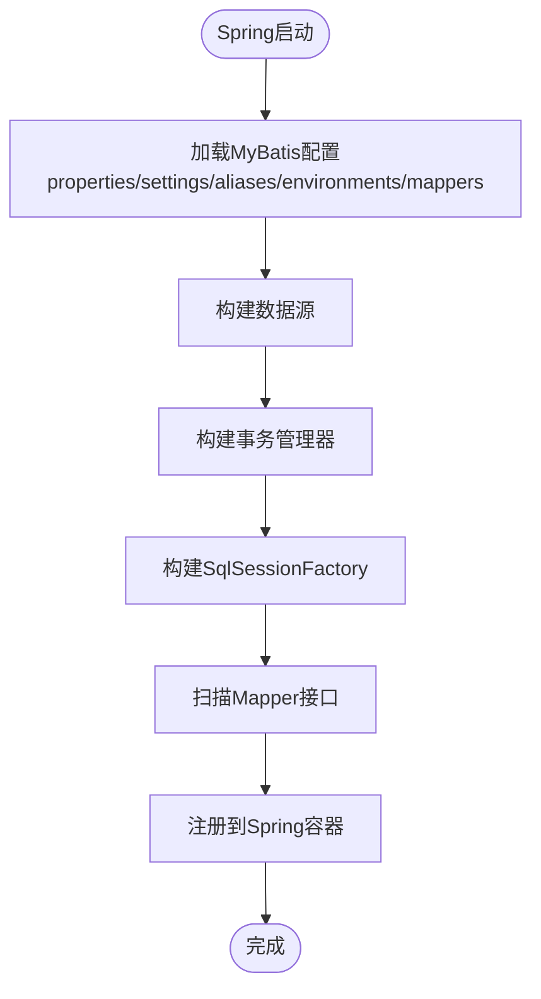
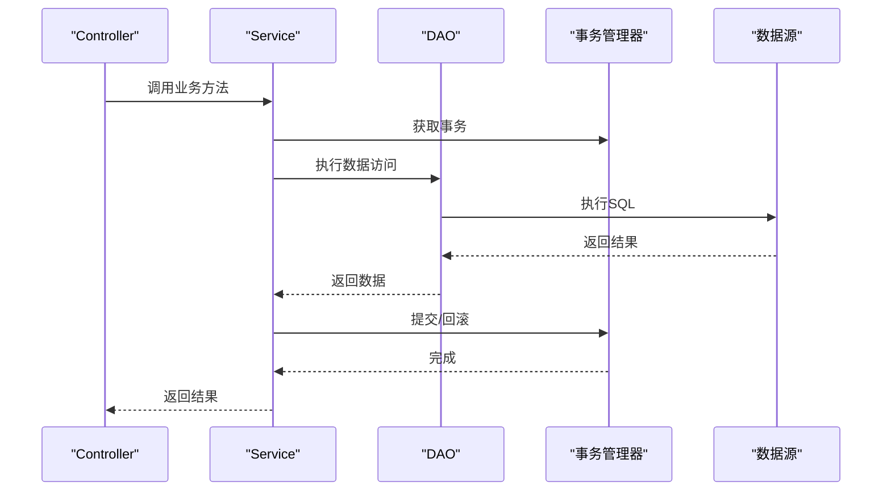
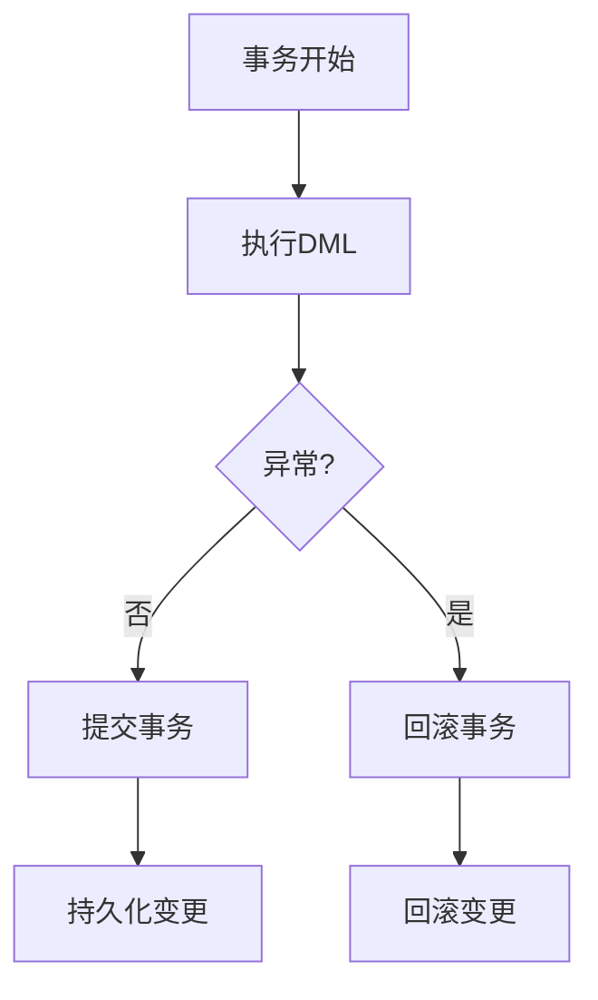
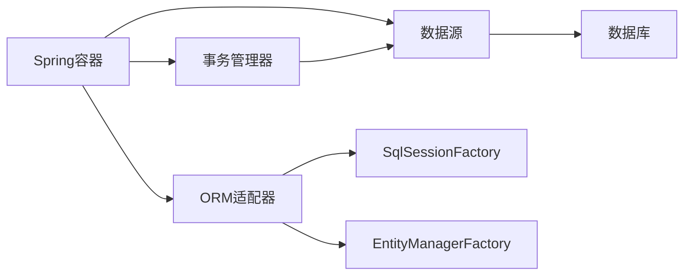

# ORM集成模块

<cite>
**本文引用的文件**
- [spring.md](file://docs/backend-base/spring/spring.md)
- [config.md](file://docs/backend-base/mybatis/config.md)
- [transaction.md](file://docs/backend-base/mysql/transaction.md)
- [spring-boot-my.md](file://docs/backend-base/spring/spring-boot-my.md)
- [spring-mvc.md](file://docs/backend-base/spring/spring-mvc.md)
</cite>

## 目录
1. [引言](#引言)
2. [项目结构](#项目结构)
3. [核心组件](#核心组件)
4. [架构总览](#架构总览)
5. [详细组件分析](#详细组件分析)
6. [依赖分析](#依赖分析)
7. [性能考虑](#性能考虑)
8. [故障排查指南](#故障排查指南)
9. [结论](#结论)
10. [附录](#附录)

## 引言
本文件围绕Spring Framework的ORM集成模块展开，系统阐述Spring对主流ORM框架（Hibernate、MyBatis、JPA）的支持方式，事务管理与ORM框架的结合（声明式与编程式），以及在Spring中配置SessionFactory、SqlSessionFactory、EntityManagerFactory等核心组件的方法。同时给出模板类使用与异常转换机制、企业级应用案例、性能优化建议与最佳实践，帮助开发者在Spring生态中做出ORM框架选择与集成的决策。

## 项目结构
该项目文档以知识库形式组织，涵盖Spring基础、Spring MVC、MyBatis配置、MySQL事务原理、Spring Boot自动配置等内容。与ORM集成相关的关键章节包括：
- Spring对ORM模块的支持与事务管理
- MyBatis配置（数据源、事务管理器、映射器）
- MySQL事务特性与原理
- Spring Boot自动配置与ORM集成

图表来源
- [spring.md](file://docs/backend-base/spring/spring.md)
- [config.md](file://docs/backend-base/mybatis/config.md)
- [transaction.md](file://docs/backend-base/mysql/transaction.md)
- [spring-boot-my.md](file://docs/backend-base/spring/spring-boot-my.md)

章节来源
- [spring.md](file://docs/backend-base/spring/spring.md)
- [config.md](file://docs/backend-base/mybatis/config.md)
- [transaction.md](file://docs/backend-base/mysql/transaction.md)
- [spring-boot-my.md](file://docs/backend-base/spring/spring-boot-my.md)

## 核心组件
- ORM模块与集成支持
  - Spring提供ORM模块，集成Hibernate、JDO、iBATIS SQL映射，遵循Spring通用事务与DAO异常层次结构。
- 事务管理器
  - PlatformTransactionManager为核心接口，Spring6中包含DataSourceTransactionManager与JtaTransactionManager。
- MyBatis核心组件
  - SqlSessionFactoryBean、MapperScannerConfigurer、数据源与事务管理器。
- Spring MVC与DAO模式
  - 控制器-服务-数据访问层的分层架构，配合Spring容器管理Bean与事务。

章节来源
- [spring.md](file://docs/backend-base/spring/spring.md)
- [config.md](file://docs/backend-base/mybatis/config.md)

## 架构总览
Spring ORM集成的整体架构围绕“容器管理Bean、事务切面化、ORM框架适配器”展开。Spring通过AOP实现声明式事务，ORM框架通过适配器（如MyBatis的SqlSessionFactoryBean）接入Spring容器，数据源与事务管理器统一由Spring管理。

图表来源
- [spring.md](file://docs/backend-base/spring/spring.md)
- [config.md](file://docs/backend-base/mybatis/config.md)

## 详细组件分析

### Spring对ORM的支持与事务管理
- ORM模块定位
  - Spring提供ORM模块，集成主流ORM框架，统一事务与DAO异常层次。
- 事务管理API
  - PlatformTransactionManager为核心，Spring6提供DataSourceTransactionManager与JtaTransactionManager。
- 声明式事务
  - 基于注解（@Transactional）与XML配置，结合AOP实现事务切面。
- 编程式事务
  - 通过PlatformTransactionManager编程控制事务生命周期。

图表来源
- [spring.md](file://docs/backend-base/spring/spring.md)

章节来源
- [spring.md](file://docs/backend-base/spring/spring.md)

### MyBatis配置与Spring集成
- 配置文件关键节点
  - properties：外部属性与动态替换
  - settings：全局行为配置
  - typeAliases：类型别名
  - environments：环境配置（transactionManager与dataSource）
  - mappers：映射器注册
- 数据源与事务管理器
  - MyBatis自身可配置JDBC/MANAGED事务管理器；在Spring+MyBatis场景下，Spring事务管理器覆盖MyBatis配置。
- Spring集成要点
  - SqlSessionFactoryBean：创建SqlSessionFactory
  - MapperScannerConfigurer：扫描Mapper接口
  - DataSourceTransactionManager：统一事务管理

图表来源
- [config.md](file://docs/backend-base/mybatis/config.md)
- [spring.md](file://docs/backend-base/spring/spring.md)

章节来源
- [config.md](file://docs/backend-base/mybatis/config.md)
- [spring.md](file://docs/backend-base/spring/spring.md)

### Spring MVC与DAO模式
- 分层架构
  - Controller（Spring MVC）、Service、DAO三层结构，配合Spring容器管理Bean与事务。
- 控制器与服务
  - 控制器负责请求处理，服务层承载业务逻辑，DAO层负责数据访问。
- 事务边界
  - 业务方法通常位于Service层，结合@Transaction注解实现声明式事务。

图表来源
- [spring-mvc.md](file://docs/backend-base/spring/spring-mvc.md)
- [spring.md](file://docs/backend-base/spring/spring.md)

章节来源
- [spring-mvc.md](file://docs/backend-base/spring/spring-mvc.md)
- [spring.md](file://docs/backend-base/spring/spring.md)

### 事务特性与原理（MySQL）
- 事务特性
  - 原子性、一致性、隔离性、持久性
- 并发问题
  - 脏读、不可重复读、幻读
- 原理
  - undo log用于回滚与MVCC
  - redo log保障持久性
  - binlog用于复制与恢复
- 连接池与性能
  - 连接池减少连接创建/销毁开销，提升并发能力

图表来源
- [transaction.md](file://docs/backend-base/mysql/transaction.md)

章节来源
- [transaction.md](file://docs/backend-base/mysql/transaction.md)

### Spring Boot自动配置与ORM集成
- 自动配置机制
  - 按需加载，导入启动器后自动装配相关组件
- 默认配置
  - 服务器端口、模板引擎前缀/后缀等可通过属性类绑定
- ORM集成
  - Spring Boot可自动配置数据源、SqlSessionFactory、MapperScannerConfigurer、事务管理器等，减少手工配置

章节来源
- [spring-boot-my.md](file://docs/backend-base/spring/spring-boot-my.md)

## 依赖分析
- Spring与ORM框架的耦合
  - Spring通过适配器（如SqlSessionFactoryBean）与ORM框架解耦，核心依赖于数据源与事务管理器。
- 事务管理器依赖
  - DataSourceTransactionManager依赖数据源；JtaTransactionManager用于分布式事务。
- MyBatis与Spring的集成点
  - SqlSessionFactoryBean与MapperScannerConfigurer作为桥梁，将MyBatis与Spring容器对接。

图表来源
- [spring.md](file://docs/backend-base/spring/spring.md)
- [config.md](file://docs/backend-base/mybatis/config.md)

章节来源
- [spring.md](file://docs/backend-base/spring/spring.md)
- [config.md](file://docs/backend-base/mybatis/config.md)

## 性能考虑
- 连接池与缓存
  - 使用连接池（如Hikari）减少连接开销；MyBatis本地缓存与二级缓存策略需结合业务场景评估。
- 事务策略
  - 合理设置事务传播行为与隔离级别，避免过度串行化；只读事务可提升查询性能。
- 日志与监控
  - 启用日志框架（如Log4j2）便于定位性能瓶颈与异常。
- Spring Boot自动配置
  - 通过自动配置减少手工配置成本，按需加载组件，避免不必要的开销。

章节来源
- [spring.md](file://docs/backend-base/spring/spring.md)
- [config.md](file://docs/backend-base/mybatis/config.md)
- [transaction.md](file://docs/backend-base/mysql/transaction.md)
- [spring-boot-my.md](file://docs/backend-base/spring/spring-boot-my.md)

## 故障排查指南
- 事务未生效
  - 检查是否正确配置事务管理器与@EnableTransactionManagement；确认@Transaction注解作用范围与传播行为。
- MyBatis映射器未注册
  - 确认MapperScannerConfigurer的包扫描路径与SqlSessionFactoryBean配置。
- 数据源连接异常
  - 校验数据源配置、驱动与URL；检查连接池参数与超时设置。
- Spring Boot自动配置未生效
  - 确认启动器依赖与application.yml配置；检查条件注解与自动配置类加载顺序。

章节来源
- [spring.md](file://docs/backend-base/spring/spring.md)
- [config.md](file://docs/backend-base/mybatis/config.md)
- [spring-boot-my.md](file://docs/backend-base/spring/spring-boot-my.md)

## 结论
Spring通过ORM模块与事务管理器，为Hibernate、MyBatis、JPA等ORM框架提供了统一的集成入口。结合Spring Boot自动配置，开发者可以快速完成数据源、事务与ORM适配器的装配。在企业级应用中，应根据业务复杂度与性能需求选择合适的ORM框架与事务策略，并通过连接池、缓存与日志监控持续优化系统表现。

## 附录
- 企业级应用案例建议
  - 业务层Service作为事务边界，DAO层专注于数据访问；MyBatis通过SqlSessionFactoryBean与MapperScannerConfigurer接入Spring；事务管理器统一由DataSourceTransactionManager管理。
- 决策依据
  - 选择ORM框架时综合考虑：学习曲线、生态与社区、性能与可扩展性、团队技能与项目规模；Spring事务与模板类可显著降低开发与维护成本。

章节来源
- [spring.md](file://docs/backend-base/spring/spring.md)
- [config.md](file://docs/backend-base/mybatis/config.md)
- [spring-boot-my.md](file://docs/backend-base/spring/spring-boot-my.md)