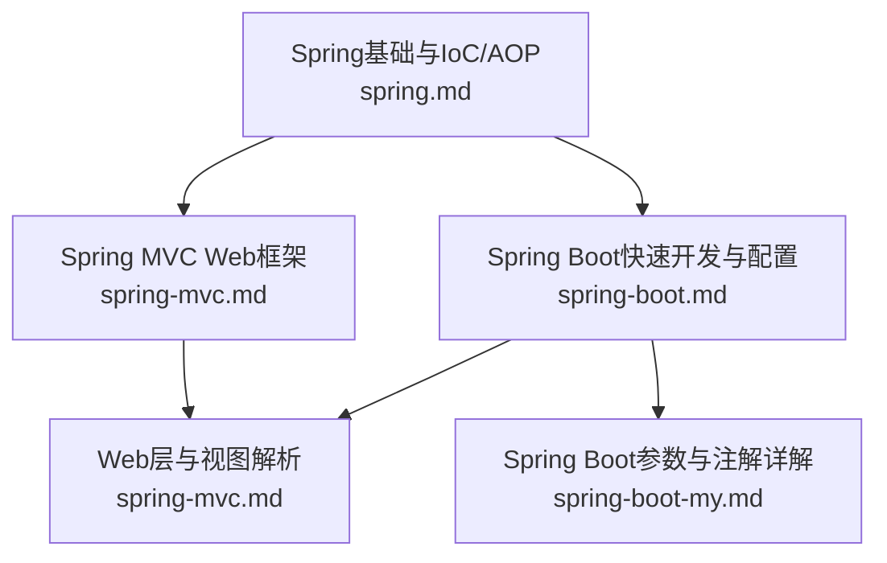
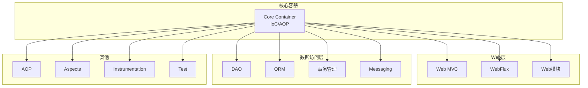
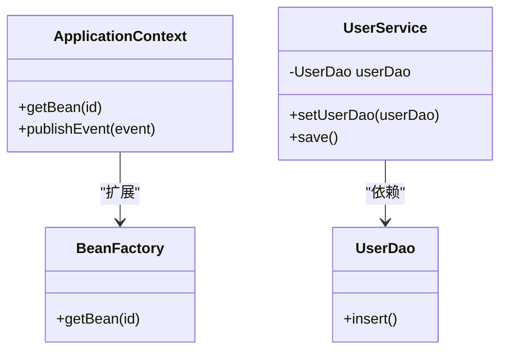
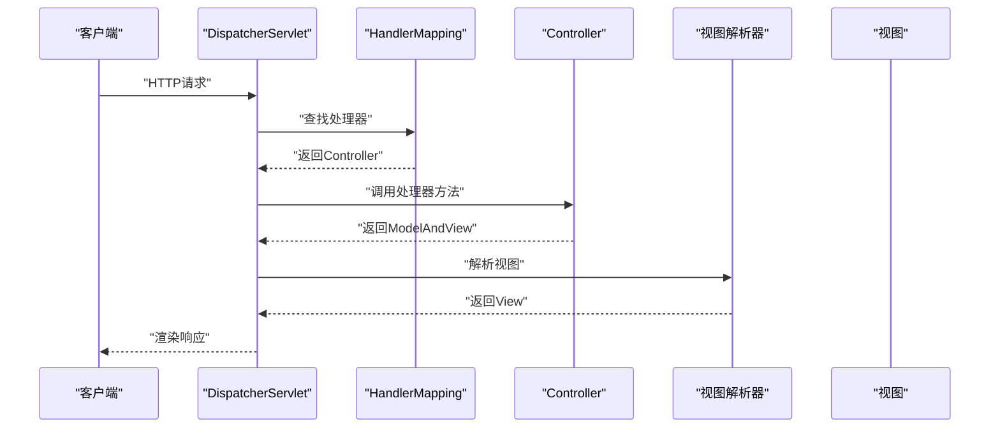
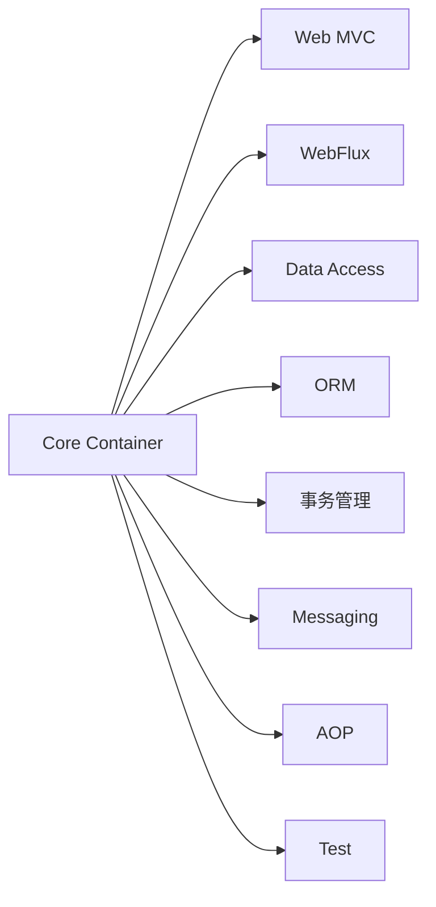

# Spring框架模块

<cite>
**本文档引用的文件**
- [spring.md](file://docs/backend-base/spring/spring.md)
- [spring-mvc.md](file://docs/backend-base/spring/spring-mvc.md)
- [spring-boot.md](file://docs/backend-base/spring/spring-boot.md)
- [spring-boot-my.md](file://docs/backend-base/spring/spring-boot-my.md)
</cite>

## 目录
1. [引言](#引言)
2. [项目结构](#项目结构)
3. [核心组件](#核心组件)
4. [架构总览](#架构总览)
5. [详细组件分析](#详细组件分析)
6. [依赖分析](#依赖分析)
7. [性能考虑](#性能考虑)
8. [故障排查指南](#故障排查指南)
9. [结论](#结论)
10. [附录](#附录)

## 引言
本文件围绕Spring框架的8个核心模块，结合仓库中的Spring、Spring MVC与Spring Boot相关文档，系统阐述模块功能定位、核心组件、使用场景、模块间依赖与集成方式，并提供配置方法与实践案例。同时梳理Spring框架的发展脉络与版本演进，帮助架构师与高级开发者建立整体理解与模块化应用指导。

## 项目结构
本仓库中与Spring相关的知识主要分布在以下文档：
- Spring基础与IoC/AOP入门：spring.md
- Spring MVC Web框架：spring-mvc.md
- Spring Boot快速开发与配置：spring-boot.md、spring-boot-my.md

图表来源
- [spring.md:147-198](file://docs/backend-base/spring/spring.md#L147-L198)
- [spring-mvc.md:32-44](file://docs/backend-base/spring/spring-mvc.md#L32-L44)
- [spring-boot.md:1-20](file://docs/backend-base/spring/spring-boot.md#L1-L20)
- [spring-boot-my.md:1-40](file://docs/backend-base/spring/spring-boot-my.md#L1-L40)

章节来源
- [spring.md:147-198](file://docs/backend-base/spring/spring.md#L147-L198)
- [spring-mvc.md:32-44](file://docs/backend-base/spring/spring-mvc.md#L32-L44)
- [spring-boot.md:1-20](file://docs/backend-base/spring/spring-boot.md#L1-L20)
- [spring-boot-my.md:1-40](file://docs/backend-base/spring/spring-boot-my.md#L1-L40)

## 核心组件
- 控制反转与依赖注入：Spring通过IoC容器管理Bean生命周期与依赖关系，降低耦合度，提升可测试性与可维护性。
- 面向切面编程：通过AOP实现声明式事务、日志、安全等横切关注点的统一管理。
- Web与WebFlux：提供MVC与响应式Web开发能力，适配传统Servlet与现代异步非阻塞场景。
- 数据访问与集成：提供JDBC抽象、ORM集成、事务管理与消息通信支持。
- 测试：提供轻量级测试支持，便于单元测试与集成测试。

章节来源
- [spring.md:135-198](file://docs/backend-base/spring/spring.md#L135-L198)

## 架构总览
Spring框架采用模块化设计，核心容器（Core Container）提供IoC与AOP基础设施，其他模块在其之上扩展功能。Web层（Web、WebFlux）与数据访问层（Data Access/Integration）分别服务于表现层与持久层需求，Test模块贯穿全链路测试。

图表来源
- [spring.md:147-198](file://docs/backend-base/spring/spring.md#L147-L198)

## 详细组件分析

### 1) Core Container（核心容器）
- 功能定位：提供IoC容器与Bean生命周期管理，是Spring应用的核心。
- 核心组件：BeanFactory、ApplicationContext、依赖注入（构造注入、Setter注入）、命名空间（p、c、util）。
- 使用场景：任何需要解耦与集中管理对象关系的Java应用。
- 关键概念：IoC控制反转、DI依赖注入、Bean作用域与生命周期。

图表来源
- [spring.md:800-920](file://docs/backend-base/spring/spring.md#L800-L920)
- [spring.md:967-1022](file://docs/backend-base/spring/spring.md#L967-L1022)
- [spring.md:1119-1163](file://docs/backend-base/spring/spring.md#L1119-L1163)

章节来源
- [spring.md:800-920](file://docs/backend-base/spring/spring.md#L800-L920)
- [spring.md:967-1022](file://docs/backend-base/spring/spring.md#L967-L1022)
- [spring.md:1119-1163](file://docs/backend-base/spring/spring.md#L1119-L1163)

### 2) AOP（面向切面编程）
- 功能定位：通过横切关注点（事务、日志、安全）统一管理，提升模块内聚性。
- 核心组件：切点（Pointcut）、通知（Advice）、切面（Aspect）、织入（Weaving）。
- 使用场景：声明式事务、统一异常处理、性能监控、审计日志。

章节来源
- [spring.md:160-162](file://docs/backend-base/spring/spring.md#L160-L162)

### 3) Data Access/Integration（数据访问与集成）
- 功能定位：简化JDBC、ORM集成、事务管理与消息通信。
- 核心组件：JDBC抽象、事务抽象与声明式事务、ORM框架集成（Hibernate、MyBatis等）、消息（Messaging）。
- 使用场景：数据库访问、缓存、消息队列、远程调用。

章节来源
- [spring.md:164-171](file://docs/backend-base/spring/spring.md#L164-L171)
- [spring.md:172-175](file://docs/backend-base/spring/spring.md#L172-L175)
- [spring.md:176-180](file://docs/backend-base/spring/spring.md#L176-L180)
- [spring.md:181-184](file://docs/backend-base/spring/spring.md#L181-L184)

### 4) Web MVC（Web模型视图控制器）
- 功能定位：基于Servlet的MVC框架，提供请求分发、参数绑定、视图解析与统一处理。
- 核心组件：DispatcherServlet、HandlerMapping、Controller、ViewResolver、HandlerAdapter。
- 使用场景：传统Web应用、REST API、模板渲染（Thymeleaf等）。

图表来源
- [spring-mvc.md:168-175](file://docs/backend-base/spring/spring-mvc.md#L168-L175)
- [spring-mvc.md:196-232](file://docs/backend-base/spring/spring-mvc.md#L196-L232)

章节来源
- [spring-mvc.md:168-175](file://docs/backend-base/spring/spring-mvc.md#L168-L175)
- [spring-mvc.md:196-232](file://docs/backend-base/spring/spring-mvc.md#L196-L232)

### 5) Web（Web模块）
- 功能定位：为Web应用提供上下文与集成能力，支持文件上传、多视图解析等。
- 使用场景：与Web MVC协同，提供Web应用上下文与视图集成。

章节来源
- [spring.md:181-184](file://docs/backend-base/spring/spring.md#L181-L184)

### 6) WebFlux（响应式Web）
- 功能定位：非阻塞响应式Web框架，支持背压与高并发场景。
- 使用场景：高吞吐、低延迟的异步服务、事件驱动应用。

章节来源
- [spring.md:176-180](file://docs/backend-base/spring/spring.md#L176-L180)

### 7) Aspects（Aspects）
- 功能定位：提供对AspectJ的支持，便于在IDE中集成面向切面功能。
- 使用场景：需要与AspectJ协作的复杂切面场景。

章节来源
- [spring.md:160-162](file://docs/backend-base/spring/spring.md#L160-L162)

### 8) Instrumentation（Instrumentation）
- 功能定位：提供JVM探针与类加载器支持，便于服务器代理与监控。
- 使用场景：应用监控、性能分析、类加载器调试。

章节来源
- [spring.md:160-162](file://docs/backend-base/spring/spring.md#L160-L162)

### 9) Messaging（消息）
- 功能定位：提供消息API与协议支持，便于集成消息中间件与响应式消息。
- 使用场景：异步消息、事件驱动、微服务通信。

章节来源
- [spring.md:164-171](file://docs/backend-base/spring/spring.md#L164-L171)

### 10) Test（测试）
- 功能定位：提供测试支持，便于单元测试与集成测试。
- 使用场景：Spring应用的测试策略与Mock。

章节来源
- [spring.md:164-171](file://docs/backend-base/spring/spring.md#L164-L171)

## 依赖分析
- 模块间依赖：Web（Web MVC/WebFlux）依赖Core Container；Data Access/Integration与Messaging在Core Container之上提供数据与通信能力；AOP/Aspects为其他模块提供横切能力；Test贯穿全链路。
- 版本演进：Spring 5引入WebFlux；Spring 6要求JDK 17+；Spring Boot提供约定优于配置与自动装配。

图表来源
- [spring.md:147-198](file://docs/backend-base/spring/spring.md#L147-L198)

章节来源
- [spring.md:147-198](file://docs/backend-base/spring/spring.md#L147-L198)

## 性能考虑
- 轻量与非侵入：Spring通过IoC与AOP降低耦合，提升可测试性与可维护性。
- 响应式Web：WebFlux支持非阻塞与背压，适用于高并发与低延迟场景。
- 自动配置与启动器：Spring Boot通过自动装配减少样板配置，提升开发效率与部署便利性。

章节来源
- [spring.md:185-199](file://docs/backend-base/spring/spring.md#L185-L199)
- [spring-boot.md:7-19](file://docs/backend-base/spring/spring-boot.md#L7-L19)

## 故障排查指南
- Bean创建与装配：确认Bean定义、构造注入与Setter注入的正确性；检查XML配置与注解扫描路径。
- Web请求映射：RequestMapping路径唯一性与Ant风格通配符使用；DispatcherServlet映射规则。
- 外部化配置：application.properties/yml加载顺序与优先级；@Value与@ConfigurationProperties绑定规则。
- 多环境配置：profiles激活方式与配置文件命名规范。

章节来源
- [spring.md:518-526](file://docs/backend-base/spring/spring.md#L518-L526)
- [spring-boot.md:804-821](file://docs/backend-base/spring/spring-boot.md#L804-L821)
- [spring-boot-my.md:24-42](file://docs/backend-base/spring/spring-boot-my.md#L24-L42)

## 结论
Spring框架通过模块化设计与强大的生态，覆盖从核心容器、Web层、数据访问到测试与消息通信的完整企业级开发需求。结合Spring Boot的约定优于配置理念，开发者可快速构建高性能、可维护的企业应用。建议在架构设计中遵循模块边界与职责分离，合理选择Web MVC与WebFlux，充分利用AOP与事务管理，结合外部化配置与Profiles实现多环境管理。

## 附录
- 版本与工具：Spring 6要求JDK 17+；Spring Boot 3要求JDK 17+；Spring MVC 6.1.4；Thymeleaf 3.1.2。
- 配置与注解：@SpringBootApplication、@EnableAutoConfiguration、@ComponentScan、@Value、@ConfigurationProperties等。

章节来源
- [spring-mvc.md:74-82](file://docs/backend-base/spring/spring-mvc.md#L74-L82)
- [spring-boot.md:386-451](file://docs/backend-base/spring/spring-boot.md#L386-L451)
- [spring-boot-my.md:45-66](file://docs/backend-base/spring/spring-boot-my.md#L45-L66)