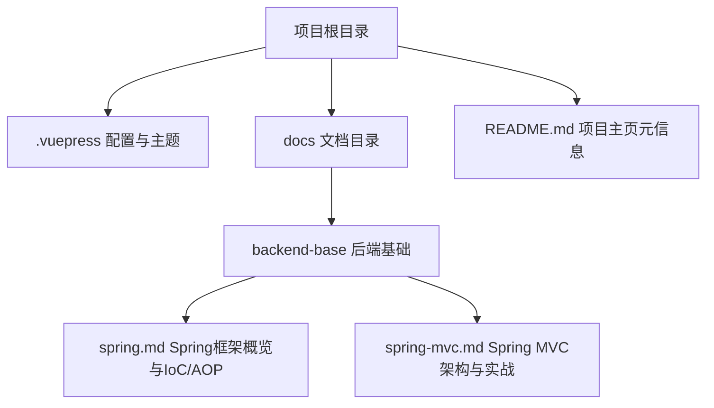
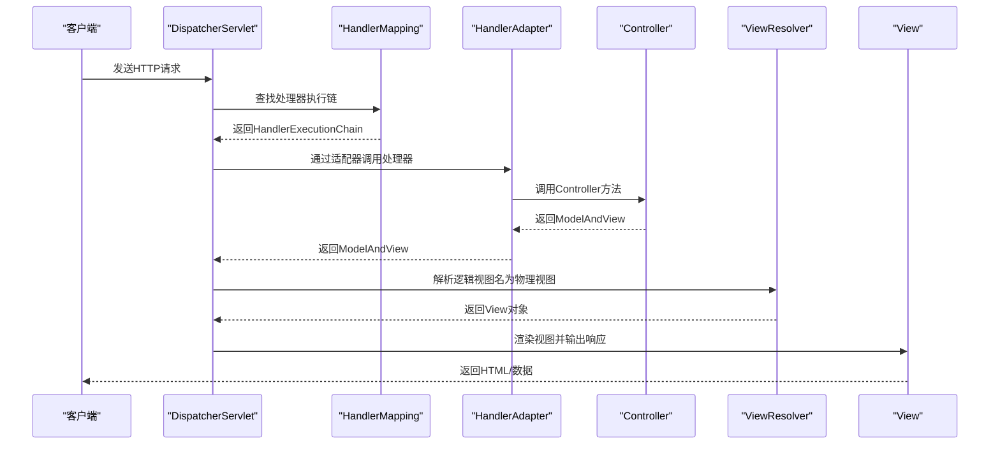
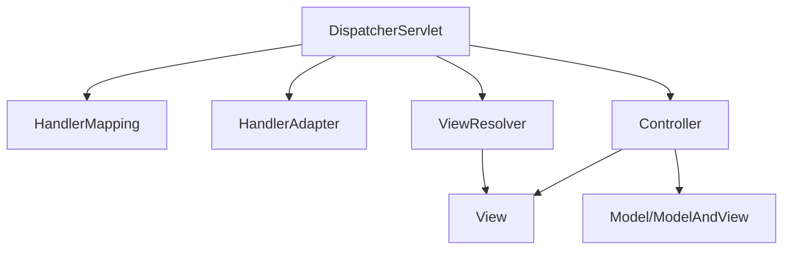

# Web MVC模块

<cite>
**本文引用的文件**
- [README.md](file://README.md)
- [spring.md](file://docs/backend-base/spring/spring.md)
- [spring-mvc.md](file://docs/backend-base/spring/spring-mvc.md)
</cite>

## 目录
1. [引言](#引言)
2. [项目结构](#项目结构)
3. [核心组件](#核心组件)
4. [架构总览](#架构总览)
5. [详细组件分析](#详细组件分析)
6. [依赖分析](#依赖分析)
7. [性能考虑](#性能考虑)
8. [故障排查指南](#故障排查指南)
9. [结论](#结论)
10. [附录](#附录)

## 引言
本文件面向希望系统掌握Spring Framework Web MVC模块的开发者，围绕MVC架构设计、核心组件（DispatcherServlet、HandlerMapping、HandlerAdapter、ViewResolver、View）、请求处理流程、控制器注解（@RequestMapping、@GetMapping、@PostMapping等）、数据绑定与类型转换、验证机制、RESTful API开发、视图解析与模板引擎集成、性能优化与安全配置等方面进行全面阐述。文档以仓库中现有的Spring与Spring MVC相关资料为基础，辅以可视化图示帮助理解。

## 项目结构
该项目为知识型文档站点，Web MVC相关内容主要分布在后端基础章节的Spring与Spring MVC文档中。整体结构如下：

图表来源
- [README.md:1-12](file://README.md#L1-L12)
- [spring.md:1-120](file://docs/backend-base/spring/spring.md#L1-L120)
- [spring-mvc.md:1-120](file://docs/backend-base/spring/spring-mvc.md#L1-L120)

章节来源
- [README.md:1-12](file://README.md#L1-L12)
- [spring.md:1-120](file://docs/backend-base/spring/spring.md#L1-L120)
- [spring-mvc.md:1-120](file://docs/backend-base/spring/spring-mvc.md#L1-L120)

## 核心组件
- 前端控制器 DispatcherServlet：负责接收请求、分发、协调处理器与视图渲染。
- 处理器映射 HandlerMapping：将请求路径映射到具体处理器（Controller方法）。
- 处理器适配器 HandlerAdapter：统一调用处理器方法，支持多种处理器类型。
- 视图解析器 ViewResolver：将逻辑视图名解析为物理视图。
- 视图 View：渲染模型数据为HTML或其他响应格式。
- 控制器 Controller：业务入口，处理请求并返回模型与视图或数据。

章节来源
- [spring-mvc.md:2665-2710](file://docs/backend-base/spring/spring-mvc.md#L2665-L2710)

## 架构总览
下图展示了从请求到达至响应输出的完整流程，涵盖核心组件交互与关键步骤。

图表来源
- [spring-mvc.md:5379-5420](file://docs/backend-base/spring/spring-mvc.md#L5379-L5420)
- [spring-mvc.md:2665-2710](file://docs/backend-base/spring/spring-mvc.md#L2665-L2710)

章节来源
- [spring-mvc.md:5379-5420](file://docs/backend-base/spring/spring-mvc.md#L5379-L5420)
- [spring-mvc.md:2665-2710](file://docs/backend-base/spring/spring-mvc.md#L2665-L2710)

## 详细组件分析

### DispatcherServlet（前端控制器）
- 职责：接收请求、分发、协调处理器与视图渲染。
- 关键方法：doDispatch为核心调度方法；processDispatchResult处理分发结果与视图渲染。
- 生命周期：在web.xml中配置Servlet与url-pattern，可设置load-on-startup提升首次访问性能。

章节来源
- [spring-mvc.md:5886-5926](file://docs/backend-base/spring/spring-mvc.md#L5886-L5926)
- [spring-mvc.md:5420-5420](file://docs/backend-base/spring/spring-mvc.md#L5420-L5420)

### HandlerMapping（处理器映射）
- 职责：根据请求路径匹配到具体处理器方法（HandlerMethod）。
- 常见实现：RequestMappingHandlerMapping（基于注解映射）、SimpleUrlHandlerMapping（基于URL模式）。
- 服务器启动阶段初始化，持有多个HandlerMethod。

章节来源
- [spring-mvc.md:5400-5418](file://docs/backend-base/spring/spring-mvc.md#L5400-L5418)

### HandlerAdapter（处理器适配器）
- 职责：统一调用处理器方法，支持多种处理器类型（如Controller方法）。
- RequestMappingHandlerAdapter：处理基于注解的控制器方法。

章节来源
- [spring-mvc.md:5745-5768](file://docs/backend-base/spring/spring-mvc.md#L5745-L5768)

### ViewResolver（视图解析器）
- 职责：将逻辑视图名解析为物理视图（View）。
- 常见实现：ThymeleafViewResolver、InternalResourceViewResolver（JSP）、RedirectViewResolver等。
- 支持多解析器按order排序，优先级由order值决定。

章节来源
- [spring-mvc.md:2672-2695](file://docs/backend-base/spring/spring-mvc.md#L2672-L2695)

### View（视图）
- 职责：将模型数据渲染为HTML或其他响应格式。
- 常见实现：ThymeleafView、InternalResourceView（JSP）、RedirectView等。

章节来源
- [spring-mvc.md:2679-2683](file://docs/backend-base/spring/spring-mvc.md#L2679-L2683)

### 控制器与注解
- @Controller：标记控制器类。
- @RequestMapping：映射请求路径、方法、参数、请求头等。
- 衍生注解：@GetMapping、@PostMapping、@PutMapping、@DeleteMapping、@PatchMapping。
- 参数绑定：@RequestParam、@RequestHeader、@CookieValue、@PathVariable、POJO绑定。
- 数据绑定与类型转换：WebDataBinder与HttpMessageConverter在适配器阶段参与。
- 验证：可结合JSR-303注解（如@Valid）与@ModelAttribute使用。

章节来源
- [spring-mvc.md:467-958](file://docs/backend-base/spring/spring-mvc.md#L467-L958)
- [spring-mvc.md:1455-1835](file://docs/backend-base/spring/spring-mvc.md#L1455-L1835)

### 视图解析与模板引擎
- Thymeleaf集成：ThymeleafViewResolver + SpringTemplateEngine + SpringResourceTemplateResolver。
- JSP集成：InternalResourceViewResolver + InternalResourceView。
- 逻辑视图名到物理视图名的转换由视图解析器配置决定。

章节来源
- [spring-mvc.md:2622-2758](file://docs/backend-base/spring/spring-mvc.md#L2622-L2758)

### RESTful API开发
- 设计风格：以资源为中心，通过不同HTTP方法表达操作。
- 示例：GET /api/users/{id}、POST /api/users、PUT /api/users/{id}、DELETE /api/users/{id}。
- 占位符与路径变量：@PathVariable接收REST风格路径参数。

章节来源
- [spring-mvc.md:812-860](file://docs/backend-base/spring/spring-mvc.md#L812-L860)
- [spring-mvc.md:3108-3147](file://docs/backend-base/spring/spring-mvc.md#L3108-L3147)

### 转发与重定向
- 转发：forward:前缀，内部资源跳转，一次请求，地址栏不变。
- 重定向：redirect:前缀，两次请求，地址栏变化，可跨域。

章节来源
- [spring-mvc.md:2894-3028](file://docs/backend-base/spring/spring-mvc.md#L2894-L3028)

## 依赖分析
- 组件耦合：DispatcherServlet依赖HandlerMapping、HandlerAdapter、ViewResolver；Controller依赖数据绑定与验证机制；视图解析器与模板引擎解耦。
- 外部依赖：Spring Web MVC、Thymeleaf、Servlet API、Tomcat（容器）。
- 配置依赖：web.xml中Servlet与初始化参数、springmvc.xml中组件扫描、视图解析器、静态资源处理等。

图表来源
- [spring-mvc.md:2665-2710](file://docs/backend-base/spring/spring-mvc.md#L2665-L2710)

章节来源
- [spring-mvc.md:2665-2710](file://docs/backend-base/spring/spring-mvc.md#L2665-L2710)

## 性能考虑
- 首次访问优化：在web.xml中配置DispatcherServlet的load-on-startup，提升启动阶段性能。
- 视图解析器优先级：通过order控制多个解析器的优先级，避免不必要的解析尝试。
- 静态资源处理：使用<mvc:default-servlet-handler>或<mvc:resources>，减少DispatcherServlet对静态资源的负担。
- 字符编码过滤：CharacterEncodingFilter在请求进入Controller前统一编码，避免乱码与二次处理成本。

章节来源
- [spring-mvc.md:417-419](file://docs/backend-base/spring/spring-mvc.md#L417-L419)
- [spring-mvc.md:3052-3107](file://docs/backend-base/spring/spring-mvc.md#L3052-L3107)
- [spring-mvc.md:2263-2301](file://docs/backend-base/spring/spring-mvc.md#L2263-L2301)

## 故障排查指南
- 404错误：确认Controller类已纳入组件扫描、注解驱动已启用、url-pattern配置正确。
- 405错误：请求方法与@RequestMapping(method=...)不匹配。
- 400错误：请求参数缺失或格式不正确（params、headers不满足）。
- 乱码问题：GET请求需在Tomcat中配置URIEncoding；POST请求需配置CharacterEncodingFilter并强制编码。
- 视图解析失败：检查逻辑视图名与视图解析器配置（prefix/suffix/order）。

章节来源
- [spring-mvc.md:521-530](file://docs/backend-base/spring/spring-mvc.md#L521-L530)
- [spring-mvc.md:1096-1147](file://docs/backend-base/spring/spring-mvc.md#L1096-L1147)
- [spring-mvc.md:1890-1951](file://docs/backend-base/spring/spring-mvc.md#L1890-L1951)
- [spring-mvc.md:2263-2301](file://docs/backend-base/spring/spring-mvc.md#L2263-L2301)

## 结论
Spring MVC通过清晰的MVC分层与可插拔的组件体系，为Web应用开发提供了高内聚、低耦合、易扩展的架构基础。开发者可通过注解快速定义控制器与映射规则，借助数据绑定与视图解析实现高效的前后端交互。结合性能优化与安全配置，可在保证开发效率的同时获得稳定的运行表现。

## 附录
- 版本信息：JDK 21、Tomcat 10、Spring 6.1.4、Spring MVC 6.1.4、Thymeleaf 3.1.2。
- 建议：在生产环境中启用CharacterEncodingFilter并强制编码；合理配置视图解析器与静态资源处理；使用注解驱动与组件扫描简化配置。

章节来源
- [spring-mvc.md:73-82](file://docs/backend-base/spring/spring-mvc.md#L73-L82)