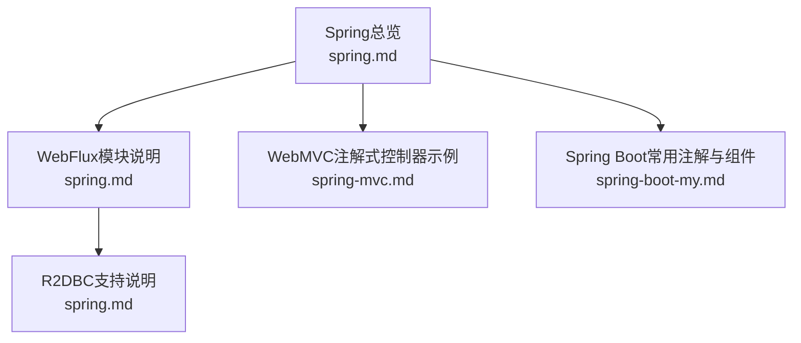
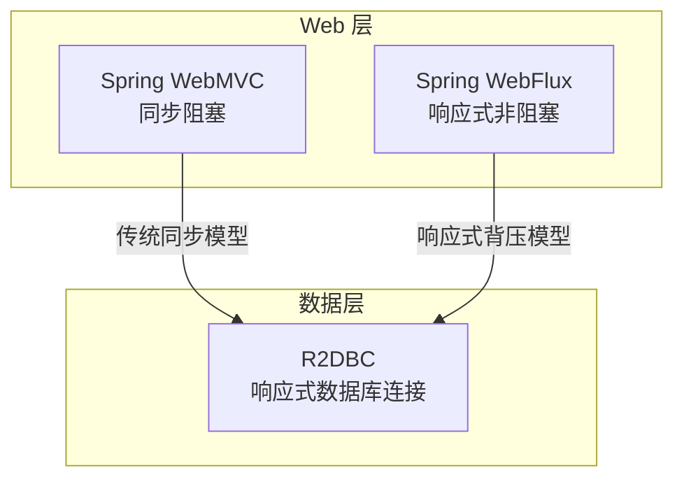
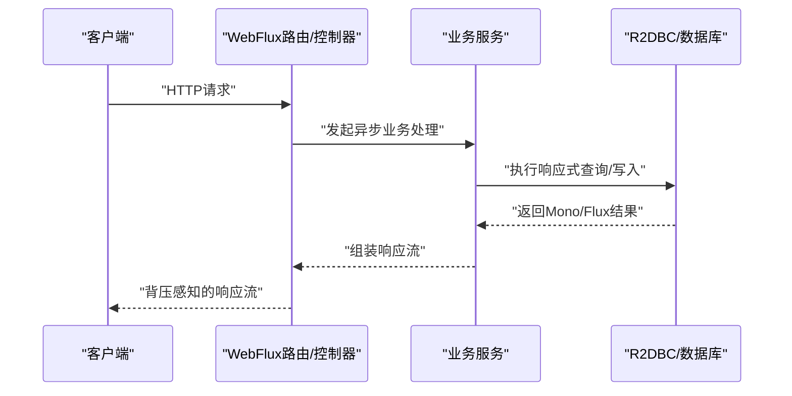
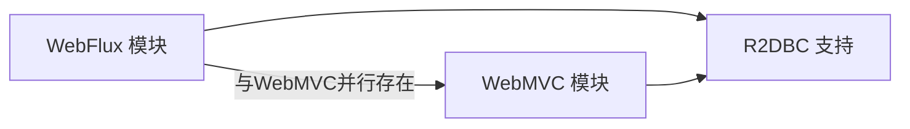

# WebFlux响应式模块

<cite>
**本文引用的文件**   
- [spring.md](file://docs/backend-base/spring/spring.md)
- [spring-mvc.md](file://docs/backend-base/spring/spring-mvc.md)
- [spring-boot-my.md](file://docs/backend-base/spring/spring-boot-my.md)
</cite>

## 目录
1. [引言](#引言)
2. [项目结构](#项目结构)
3. [核心组件](#核心组件)
4. [架构总览](#架构总览)
5. [详细组件分析](#详细组件分析)
6. [依赖分析](#依赖分析)
7. [性能考量](#性能考量)
8. [故障排查指南](#故障排查指南)
9. [结论](#结论)
10. [附录](#附录)

## 引言
本文件围绕Spring Framework的WebFlux模块，系统阐述响应式编程理念、非阻塞I/O与背压机制、与传统Spring MVC的差异、函数式路由与注解式控制器的对比、Reactive Streams API与Mono/Flux的使用、高并发异步编程实践、WebFlux与响应式数据库（R2DBC）的集成、性能监控与调试最佳实践，以及响应式应用开发与迁移策略。内容基于仓库中现有Spring相关文档进行归纳与提炼，帮助读者建立从概念到落地的完整认知。

## 项目结构
本仓库以知识文档为主，Spring WebFlux相关内容主要分布在“backend-base/spring”系列文档中，涵盖WebFlux模块定位、与WebMVC的差异、注解式控制器示例、以及R2DBC支持等要点。下图给出与WebFlux主题相关的文档组织概览：

图表来源
- [spring.md:175-185](file://docs/backend-base/spring/spring.md#L175-L185)
- [spring.md:254-286](file://docs/backend-base/spring/spring.md#L254-L286)
- [spring-mvc.md:477-647](file://docs/backend-base/spring/spring-mvc.md#L477-L647)
- [spring-boot-my.md:124-182](file://docs/backend-base/spring/spring-boot-my.md#L124-L182)

章节来源
- [spring.md:175-185](file://docs/backend-base/spring/spring.md#L175-L185)
- [spring.md:254-286](file://docs/backend-base/spring/spring.md#L254-L286)
- [spring-mvc.md:477-647](file://docs/backend-base/spring/spring-mvc.md#L477-L647)
- [spring-boot-my.md:124-182](file://docs/backend-base/spring/spring-boot-my.md#L124-L182)

## 核心组件
- WebFlux模块定位与特性
  - 完全非阻塞、支持Reactive Streams背压、可在Netty、Undertow及Servlet 3.1+容器运行。
  - 与WebMVC并行存在，提供相似功能但编程模型不同。
- Reactive Streams与响应式类型
  - 文档明确指出WebFlux支持Reactive Streams背压；R2DBC作为响应式数据库连接的Spring支持。
- 注解式控制器与函数式路由
  - WebMVC提供注解式控制器示例；WebFlux提供函数式路由能力（概念性说明见WebFlux定位）。
- 数据库集成
  - R2DBC jar包与相关支持在Spring模块清单中明确列出。

章节来源
- [spring.md:175-185](file://docs/backend-base/spring/spring.md#L175-L185)
- [spring.md:254-286](file://docs/backend-base/spring/spring.md#L254-L286)

## 架构总览
WebFlux在Spring生态中的定位与分工如下：
- WebMVC：基于Servlet API的传统同步阻塞模型，适合大多数Web场景。
- WebFlux：基于Reactor的响应式非阻塞模型，强调背压与高并发下的资源高效利用。
- 数据层：R2DBC提供关系型数据库的响应式连接能力，与WebFlux形成端到端响应式链路。

图表来源
- [spring.md:175-185](file://docs/backend-base/spring/spring.md#L175-L185)
- [spring.md:254-286](file://docs/backend-base/spring/spring.md#L254-L286)

## 详细组件分析

### 响应式编程与背压机制
- 非阻塞I/O与背压
  - WebFlux强调完全非阻塞与Reactive Streams背压，能够在高并发场景下以更少线程处理更多请求，避免阻塞带来的资源浪费。
- Mono与Flux
  - 作为Reactive Streams的实现，Mono代表零或一个元素的异步序列，Flux代表零个或多个元素的异步序列。二者是WebFlux中数据流建模的核心抽象。
- 实践建议
  - 在WebFlux中优先使用Mono/Flux承载异步结果，避免阻塞式I/O与线程池切换。
  - 合理使用背压策略（如drop、buffer、latest等）以平衡吞吐与延迟。

章节来源
- [spring.md:175-185](file://docs/backend-base/spring/spring.md#L175-L185)

### WebFlux与Spring MVC的差异
- 编程模型
  - WebMVC：注解式控制器（如@RequestMapping），同步阻塞风格，易理解、易调试。
  - WebFlux：函数式路由与响应式链路，异步非阻塞风格，强调背压与高并发。
- 性能特性
  - WebMVC在中低并发下表现稳定；WebFlux在高并发、I/O密集场景下具备更低的线程占用与更好的吞吐。
- 适用场景
  - WebMVC：传统Web应用、对响应式特性需求不高、团队对同步模型更熟悉。
  - WebFlux：高并发网关、实时推送、事件驱动、与响应式数据库/中间件集成。

章节来源
- [spring-mvc.md:477-647](file://docs/backend-base/spring/spring-mvc.md#L477-L647)
- [spring.md:175-185](file://docs/backend-base/spring/spring.md#L175-L185)

### 函数式路由与注解式控制器对比
- 注解式控制器（WebMVC）
  - 示例：在控制器类上使用@RequestMapping，方法返回视图或数据。
  - 映射唯一性：同一Web应用中RequestMapping需唯一，否则抛出歧义映射异常。
- 函数式路由（WebFlux）
  - 通过RouterFunction与HandlerFunction构建声明式路由，与WebMVC的注解风格互补。
  - 更贴近Reactive Streams的数据流式处理，便于组合与背压控制。

章节来源
- [spring-mvc.md:477-647](file://docs/backend-base/spring/spring-mvc.md#L477-L647)
- [spring.md:175-185](file://docs/backend-base/spring/spring.md#L175-L185)

### Reactive Streams API与Mono/Flux使用
- 使用场景
  - 在WebFlux中，将HTTP请求映射到Mono/Flux，结合flatMap、merge、zip等操作符构建复杂异步流水线。
- 背压策略
  - 在订阅端合理设置缓冲区与丢弃策略，避免内存压力过大。
- 错误处理
  - 使用onErrorResume/onErrorMap等操作符统一处理异常，结合WebExceptionHandler进行全局异常映射。

章节来源
- [spring.md:175-185](file://docs/backend-base/spring/spring.md#L175-L185)

### 高并发异步编程案例（概念性流程）
以下流程图展示WebFlux在高并发下的典型处理路径：客户端请求进入，经由响应式路由器/控制器，异步调用下游服务（数据库或外部API），最终以Mono/Flux回传，利用背压保障系统稳定性。

图表来源
- [spring.md:175-185](file://docs/backend-base/spring/spring.md#L175-L185)
- [spring.md:254-286](file://docs/backend-base/spring/spring.md#L254-L286)

### WebFlux与响应式数据库（R2DBC）集成
- R2DBC支持
  - 文档明确列出spring-r2dbc-5.3.9.jar，表明Spring对R2DBC提供支持。
- 集成要点
  - 使用响应式连接（如Connection、Statement）执行SQL，返回Mono/Flux。
  - 在WebFlux中直接消费数据库响应流，避免阻塞式等待。
- 优势
  - 与WebFlux的非阻塞模型天然契合，降低线程切换与阻塞等待。

章节来源
- [spring.md:254-286](file://docs/backend-base/spring/spring.md#L254-L286)

### 注解式控制器示例与映射唯一性
- 示例：在控制器类上使用@RequestMapping，方法返回视图或数据。
- 映射唯一性：同一Web应用中RequestMapping需唯一，否则抛出歧义映射异常。
- 解决方案：在类级别添加@RequestMapping作为命名空间，或在方法级别调整映射路径。

章节来源
- [spring-mvc.md:477-647](file://docs/backend-base/spring/spring-mvc.md#L477-L647)

### Spring Boot常用注解与组件（辅助WebFlux开发）
- 常用注解：@RequestParam、@PathVariable、@ResponseBody、@Controller、@Service、@Repository、@Component等。
- 组件装配：通过注解定义业务层、控制层、数据访问层组件，配合WebFlux进行响应式处理。

章节来源
- [spring-boot-my.md:124-182](file://docs/backend-base/spring/spring-boot-my.md#L124-L182)

## 依赖分析
WebFlux在Spring模块中的角色与其依赖关系如下：
- WebFlux模块：提供响应式Web开发能力，与WebMVC并行。
- R2DBC：提供关系型数据库的响应式连接支持。
- WebMVC：提供注解式控制器与传统同步模型。

图表来源
- [spring.md:175-185](file://docs/backend-base/spring/spring.md#L175-L185)
- [spring.md:254-286](file://docs/backend-base/spring/spring.md#L254-L286)

章节来源
- [spring.md:175-185](file://docs/backend-base/spring/spring.md#L175-L185)
- [spring.md:254-286](file://docs/backend-base/spring/spring.md#L254-L286)

## 性能考量
- 非阻塞与背压
  - WebFlux通过非阻塞I/O与背压机制在高并发下保持较低线程占用与良好吞吐。
- Mono/Flux的选择
  - 单值或空值使用Mono，多值流使用Flux；避免在响应式链路中插入阻塞式操作。
- 数据库与网络I/O
  - 结合R2DBC与响应式HTTP客户端，减少阻塞等待与线程切换。
- 监控与调试
  - 利用响应式链路的可观测性指标（如延迟、背压水位、错误率）进行性能评估与优化。

[本节为通用性能讨论，不直接分析具体文件]

## 故障排查指南
- 映射冲突（WebMVC）
  - 现象：同一Web应用中RequestMapping重复导致歧义映射异常。
  - 处理：在类级别添加@RequestMapping作为命名空间，或调整方法级映射路径。
- 响应式链路异常
  - 现象：异步流中未正确处理错误导致上游背压堆积。
  - 处理：在响应式链路中使用错误处理操作符，确保异常被消费并回退到安全状态。
- 背压问题
  - 现象：下游处理慢导致上游缓冲区增长，内存压力增大。
  - 处理：调整缓冲区大小、采用drop/largest/latest等策略，或重构下游处理逻辑。

章节来源
- [spring-mvc.md:477-647](file://docs/backend-base/spring/spring-mvc.md#L477-L647)

## 结论
WebFlux以响应式非阻塞为核心，与WebMVC形成互补：前者适用于高并发、I/O密集与事件驱动场景，后者适用于传统Web应用与同步模型偏好者。结合R2DBC，WebFlux可实现从Web层到数据库层的端到端响应式链路。实践中应重视背压策略、Mono/Flux的正确使用、以及可观测性与错误处理，以获得稳定与高性能的系统表现。

[本节为总结性内容，不直接分析具体文件]

## 附录
- 开发与迁移建议
  - 从WebMVC迁移至WebFlux时，优先将I/O密集环节改为响应式，逐步替换控制器与服务层。
  - 在引入R2DBC时，确保数据库访问层完全响应式化，避免阻塞式调用。
  - 使用统一的错误处理与日志策略，结合监控指标进行持续优化。

[本节为通用建议，不直接分析具体文件]