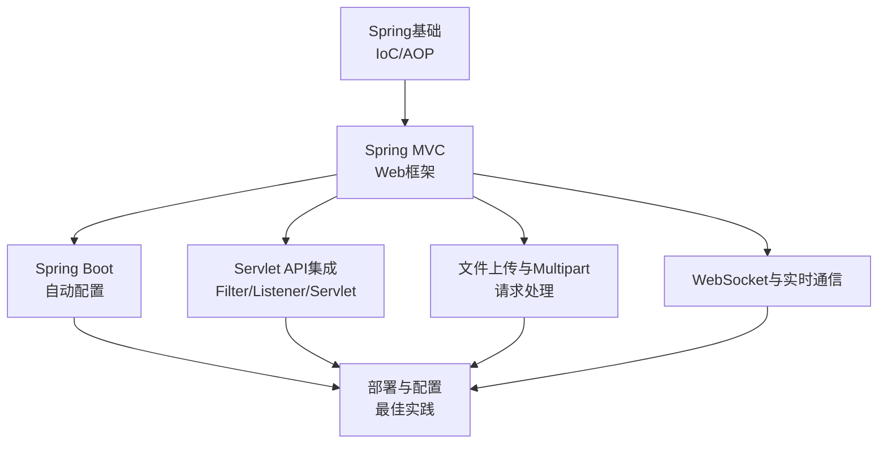
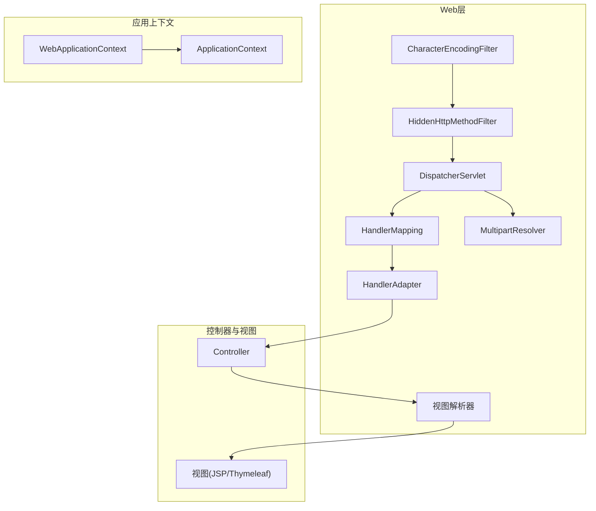
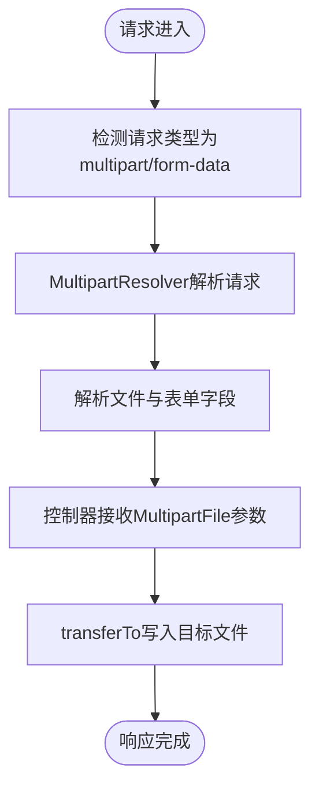
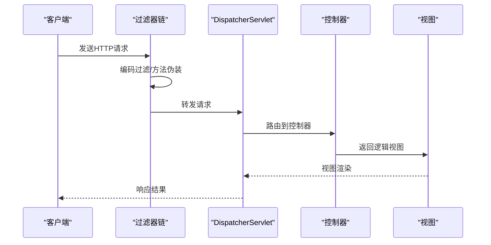
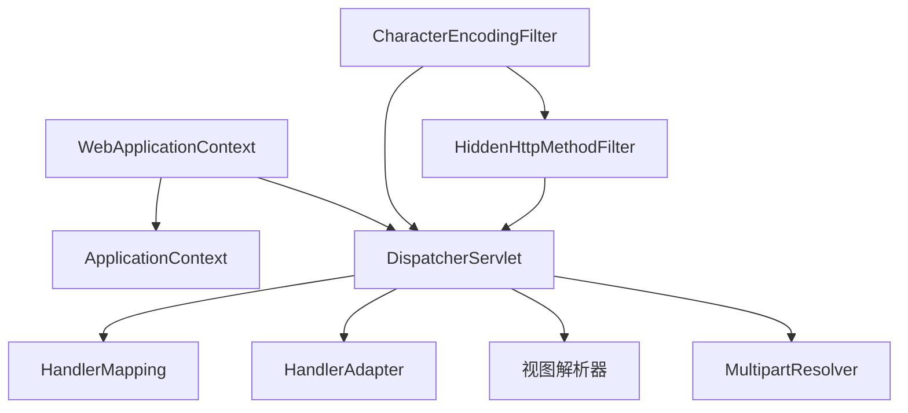

# Web集成模块

<cite>
**本文档引用的文件**
- [spring.md](file://docs/backend-base/spring/spring.md)
- [spring-mvc.md](file://docs/backend-base/spring/spring-mvc.md)
- [spring-boot.md](file://docs/backend-base/spring/spring-boot.md)
- [spring-mvc-my.md](file://docs/backend-base/spring/spring-mvc-my.md)
- [test1.html](file://test1.html)
</cite>

## 目录
1. [引言](#引言)
2. [项目结构](#项目结构)
3. [核心组件](#核心组件)
4. [架构概览](#架构概览)
5. [详细组件分析](#详细组件分析)
6. [依赖分析](#依赖分析)
7. [性能考虑](#性能考虑)
8. [故障排查指南](#故障排查指南)
9. [结论](#结论)
10. [附录](#附录)

## 引言
本文件面向Spring Framework的Web集成模块，系统阐述Spring对Web框架的支持，涵盖与传统MVC框架（如Struts、WebWork）的兼容性理念、WebApplicationContext的设计与作用、文件上传与multipart请求处理、WebSocket支持与实时通信、Servlet API集成（Filter、Listener、Servlet）、Spring Security在Web层的集成与配置，以及Web应用的部署与配置最佳实践。文档力求以循序渐进的方式，既适合初学者理解整体架构，也能为有经验的开发者提供深入的技术参考。

## 项目结构
该项目文档主要来源于后端基础Spring系列文档，围绕Spring Framework在Web领域的应用展开，包含：
- Spring基础与IoC/AOP
- Spring MVC与Web应用开发
- Spring Boot与自动配置
- Web应用的Servlet API集成与过滤器链
- 文件上传与multipart处理
- WebSocket与实时通信
- Spring Security在Web层的集成

章节来源
- [spring.md:147-184](file://docs/backend-base/spring/spring.md#L147-L184)
- [spring-mvc.md:31-72](file://docs/backend-base/spring/spring-mvc.md#L31-L72)
- [spring-boot.md:1-15](file://docs/backend-base/spring/spring-boot.md#L1-L15)

## 核心组件
- WebApplicationContext：建立在应用上下文之上的Web上下文，提供Web应用所需的上下文能力，支持与传统MVC框架（如Struts、WebWork）的集成。
- DispatcherServlet：前端控制器，负责接收请求、路由到处理器、渲染视图并响应。
- 视图解析器：将逻辑视图名解析为具体视图（如JSP、Thymeleaf等）。
- HandlerMapping/HandlerAdapter：处理器映射与适配，负责将请求映射到控制器方法。
- MultipartResolver：处理multipart请求（文件上传）。
- 过滤器链：CharacterEncodingFilter、HiddenHttpMethodFilter等，处理编码、HTTP方法伪装等。
- WebSocket支持：通过WebSocket配置与消息通道实现实时通信。

章节来源
- [spring.md:181-184](file://docs/backend-base/spring/spring.md#L181-L184)
- [spring-mvc.md:172-179](file://docs/backend-base/spring/spring-mvc.md#L172-L179)
- [spring-mvc.md:3691-3754](file://docs/backend-base/spring/spring-mvc.md#L3691-L3754)
- [spring-mvc.md:438-558](file://docs/backend-base/spring/spring-mvc.md#L438-L558)
- [spring-boot.md:3406-3569](file://docs/backend-base/spring/spring-boot.md#L3406-L3569)

## 架构概览
Spring Web集成的整体架构围绕WebApplicationContext展开，DispatcherServlet作为入口，通过HandlerMapping定位处理器，HandlerAdapter调用控制器方法，视图解析器渲染视图，过滤器链贯穿请求生命周期，实现编码、方法伪装、安全等横切关注点。

图表来源
- [spring-mvc.md:5459-5479](file://docs/backend-base/spring/spring-mvc.md#L5459-L5479)
- [spring-mvc.md:3691-3754](file://docs/backend-base/spring/spring-mvc.md#L3691-L3754)
- [spring.md:181-184](file://docs/backend-base/spring/spring.md#L181-L184)

## 详细组件分析

### WebApplicationContext设计与作用
- 设计理念：WebApplicationContext建立在应用上下文之上，提供Web应用所需的上下文能力，支持与传统MVC框架（如Struts、WebWork）的集成。
- 与普通ApplicationContext的区别：WebApplicationContext扩展了Web环境所需的上下文能力，如ServletContext访问、Web专用的Bean定义与生命周期管理。
- 在Spring Boot中，WebApplicationContext通过自动配置与Servlet容器集成，简化了Web应用的上下文初始化。

章节来源
- [spring.md:181-184](file://docs/backend-base/spring/spring.md#L181-L184)
- [spring-boot.md:3406-3569](file://docs/backend-base/spring/spring-boot.md#L3406-L3569)

### 与传统MVC框架的兼容性
- Spring MVC与传统MVC框架（如Struts、WebWork）的兼容性体现在：Spring MVC通过DispatcherServlet统一入口，提供与传统框架类似的MVC分层思想，但借助IoC/AOP实现松耦合与更好的可测试性。
- 传统框架的控制器与视图在Spring MVC中可被替代或桥接，通过注解与配置实现类似的功能。

章节来源
- [spring.md:172-184](file://docs/backend-base/spring/spring.md#L172-L184)

### 文件上传与Multipart请求处理
- multipart请求类型：multipart/form-data，Spring MVC通过MultipartResolver解析请求。
- 配置要点：设置单个文件大小限制与请求总大小限制；在控制器中使用@RequestParam接收MultipartFile类型文件。
- 常用方法：getName、getOriginalFilename、getContentType、getSize、getBytes、getInputStream、transferTo等。

图表来源
- [spring-mvc.md:438-558](file://docs/backend-base/spring/spring-mvc.md#L438-L558)

章节来源
- [spring-mvc.md:438-558](file://docs/backend-base/spring/spring-mvc.md#L438-L558)

### WebSocket支持与实时通信
- WebSocket自动配置：Spring Boot在检测到WebSocket依赖时，自动配置WebSocket支持与Tomcat WebSocket集成。
- 实时通信：通过WebSocket端点与消息通道实现客户端与服务器的双向通信，适用于聊天、推送等场景。

章节来源
- [spring-boot.md:3406-3569](file://docs/backend-base/spring/spring-boot.md#L3406-L3569)

### 与Servlet API的集成
- Filter集成：CharacterEncodingFilter统一设置请求/响应编码；HiddenHttpMethodFilter支持REST风格的HTTP方法伪装。
- Listener集成：通过WebApplicationInitializer实现Servlet容器启动时的上下文初始化。
- Servlet集成：DispatcherServlet作为前端控制器，处理所有Web请求。

图表来源
- [spring-mvc.md:3691-3754](file://docs/backend-base/spring/spring-mvc.md#L3691-L3754)
- [spring-mvc.md:6901-6920](file://docs/backend-base/spring/spring-mvc.md#L6901-L6920)

章节来源
- [spring-mvc.md:3691-3754](file://docs/backend-base/spring/spring-mvc.md#L3691-L3754)
- [spring-mvc.md:6901-6920](file://docs/backend-base/spring/spring-mvc.md#L6901-L6920)

### Spring Security在Web层的集成
- Web层集成：通过WebApplicationInitializer与过滤器链集成Spring Security，实现认证、授权与安全防护。
- 配置方式：基于注解或XML配置，结合过滤器链实现Web安全策略。

章节来源
- [spring-mvc.md:6901-6920](file://docs/backend-base/spring/spring-mvc.md#L6901-L6920)

### Web应用的部署与配置最佳实践
- Spring Boot自动配置：通过自动配置简化Web应用的上下文与组件初始化，减少XML配置。
- 过滤器链顺序：CharacterEncodingFilter应在HiddenHttpMethodFilter之前配置，确保编码设置在方法伪装之前生效。
- 静态资源处理：开启默认Servlet处理，确保静态资源正确访问。
- 视图解析：合理配置视图解析器（如Thymeleaf），提升开发效率与可维护性。

章节来源
- [spring-boot.md:1-15](file://docs/backend-base/spring/spring-boot.md#L1-L15)
- [spring-mvc.md:7467-7483](file://docs/backend-base/spring/spring-mvc.md#L7467-L7483)

## 依赖分析
Spring Web集成模块的依赖关系围绕WebApplicationContext与DispatcherServlet展开，过滤器链贯穿请求生命周期，视图解析器与处理器映射共同完成请求到响应的闭环。

图表来源
- [spring.md:181-184](file://docs/backend-base/spring/spring.md#L181-L184)
- [spring-mvc.md:5459-5479](file://docs/backend-base/spring/spring-mvc.md#L5459-L5479)
- [spring-mvc.md:3691-3754](file://docs/backend-base/spring/spring-mvc.md#L3691-L3754)

章节来源
- [spring.md:181-184](file://docs/backend-base/spring/spring.md#L181-L184)
- [spring-mvc.md:5459-5479](file://docs/backend-base/spring/spring-mvc.md#L5459-L5479)
- [spring-mvc.md:3691-3754](file://docs/backend-base/spring/spring-mvc.md#L3691-L3754)

## 性能考虑
- 过滤器链顺序：确保编码过滤器在方法伪装过滤器之前，避免不必要的字符集重设与性能损耗。
- 视图解析：合理配置视图解析器，避免过多的视图解析器导致解析开销增加。
- 文件上传：设置合理的文件大小与请求大小限制，防止内存溢出与拒绝服务攻击。
- 自动配置：Spring Boot的自动配置在开发阶段提供便利，但在生产环境可根据需要精简配置，减少启动时间与运行时开销。

## 故障排查指南
- POST乱码问题：通过CharacterEncodingFilter统一设置请求/响应编码，确保在请求到达控制器之前完成编码设置。
- HTTP方法伪装：HiddenHttpMethodFilter支持将PUT、DELETE等方法伪装为POST，需确保过滤器链顺序正确。
- 文件上传异常：检查MultipartResolver配置与文件大小限制，确认控制器参数类型为MultipartFile。
- WebSocket连接问题：确认WebSocket自动配置与端点配置正确，检查浏览器与服务器的WebSocket支持。

章节来源
- [spring-mvc.md:2026-2261](file://docs/backend-base/spring/spring-mvc.md#L2026-L2261)
- [spring-mvc.md:3691-3754](file://docs/backend-base/spring/spring-mvc.md#L3691-L3754)
- [spring-mvc.md:438-558](file://docs/backend-base/spring/spring-mvc.md#L438-L558)
- [spring-boot.md:3406-3569](file://docs/backend-base/spring/spring-boot.md#L3406-L3569)

## 结论
Spring Framework的Web集成模块通过WebApplicationContext与DispatcherServlet为核心，结合过滤器链、视图解析器与自动配置，提供了与传统MVC框架兼容且更现代化的Web开发体验。开发者可通过Spring Boot进一步简化配置，结合文件上传、WebSocket与Spring Security实现企业级Web应用的开发与部署。

## 附录
- 示例页面：BroadcastChannel用于演示前端实时通信（与Spring WebSocket形成对照）。
  
章节来源
- [test1.html:1-20](file://test1.html#L1-L20)