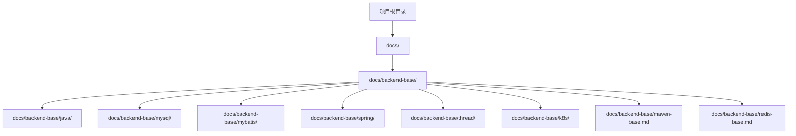
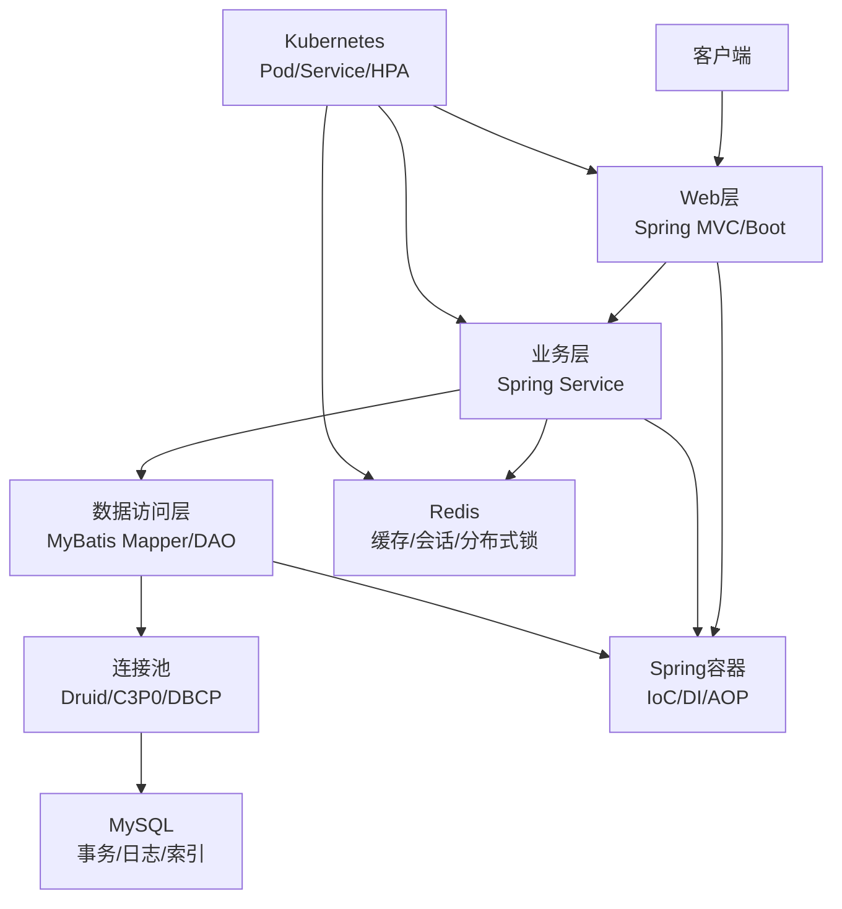
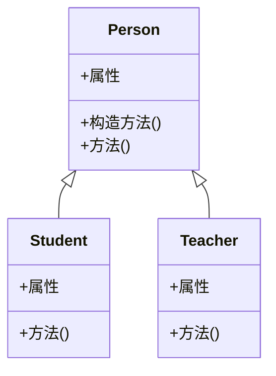
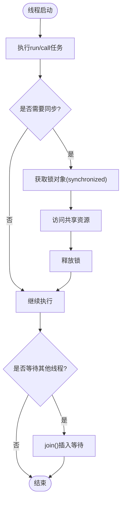
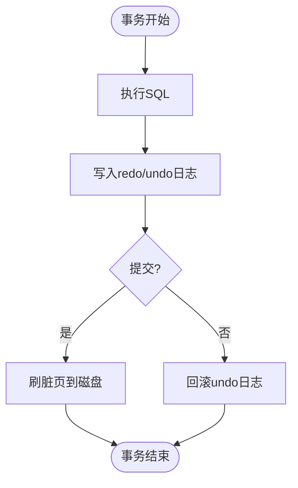
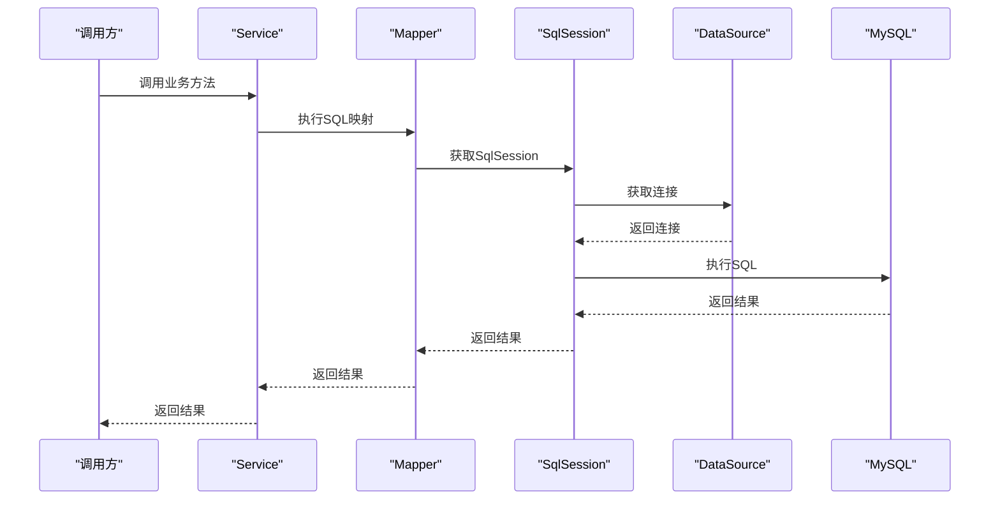
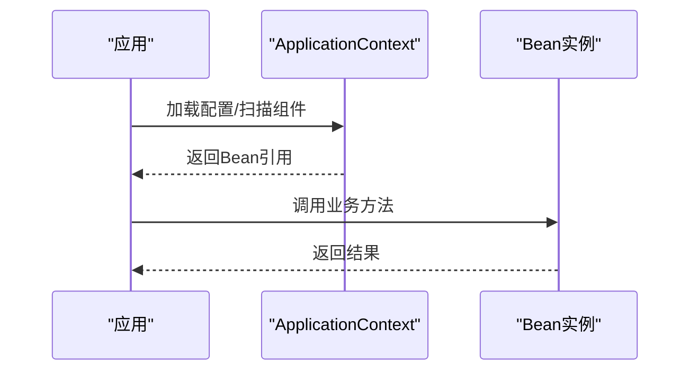
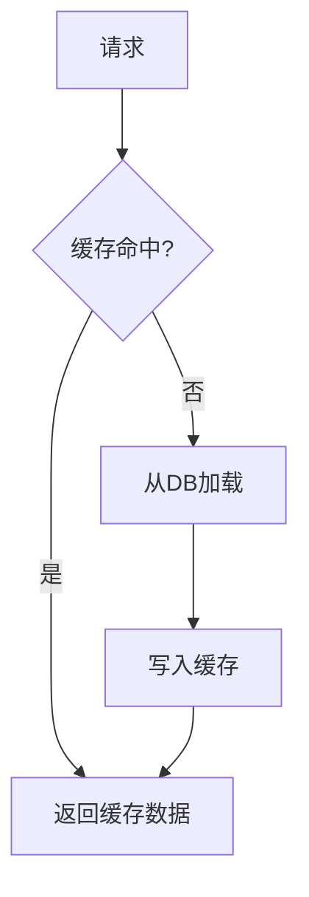
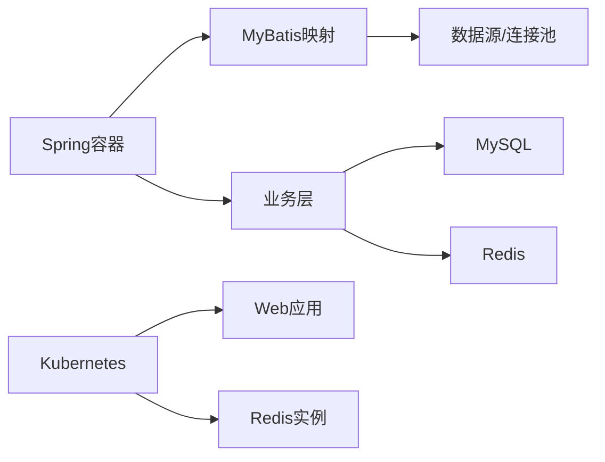

# 后端开发

<cite>
**本文引用的文件**
- [README.md](file://README.md)
- [package.json](file://package.json)
- [docs/backend-base/java/oop.md](file://docs/backend-base/java/oop.md)
- [docs/backend-base/mysql/base.md](file://docs/backend-base/mysql/base.md)
- [docs/backend-base/mysql/transaction.md](file://docs/backend-base/mysql/transaction.md)
- [docs/backend-base/mybatis/config.md](file://docs/backend-base/mybatis/config.md)
- [docs/backend-base/mybatis/mapper.md](file://docs/backend-base/mybatis/mapper.md)
- [docs/backend-base/spring/spring.md](file://docs/backend-base/spring/spring.md)
- [docs/backend-base/thread/base.md](file://docs/backend-base/thread/base.md)
- [docs/backend-base/k8s/pod.md](file://docs/backend-base/k8s/pod.md)
- [docs/backend-base/maven-base.md](file://docs/backend-base/maven-base.md)
- [docs/backend-base/redis-base.md](file://docs/backend-base/redis-base.md)
</cite>

## 目录
1. [引言](#引言)
2. [项目结构](#项目结构)
3. [核心组件](#核心组件)
4. [架构总览](#架构总览)
5. [详细组件分析](#详细组件分析)
6. [依赖分析](#依赖分析)
7. [性能考虑](#性能考虑)
8. [故障排查指南](#故障排查指南)
9. [结论](#结论)
10. [附录](#附录)

## 引言
本技术文档面向后端开发者，系统梳理Java语言基础、并发编程、MySQL数据库、MyBatis框架、Spring框架、Redis缓存、Maven构建、Kubernetes编排等核心技术。文档以“概念—原理—实践—最佳实践”的方式组织，结合仓库中的Markdown资料，给出架构设计原则、性能优化策略与落地建议，帮助读者建立完整的后端知识体系与工程实践能力。

## 项目结构
该项目为文档型知识库，采用VuePress主题进行组织，后端技术文档集中在docs/backend-base目录下，涵盖Java、MySQL、MyBatis、Spring、线程、Redis、Maven、K8s等专题。根目录包含项目元信息与构建脚本，便于本地开发与文档构建。

**图表来源**
- [README.md:1-12](file://README.md#L1-L12)
- [package.json:1-17](file://package.json#L1-L17)

**章节来源**
- [README.md:1-12](file://README.md#L1-L12)
- [package.json:1-17](file://package.json#L1-L17)

## 核心组件
- Java语言基础：类与对象、封装、继承、多态、接口、抽象类、访问修饰符、static/final等，奠定面向对象编程基础。
- 并发编程：线程创建方式、线程池、常用方法、线程安全与同步机制（synchronized、锁对象）、线程状态与转换。
- MySQL数据库：基础语法、启动停止、客户端连接、事务特性与原理（原子性、一致性、隔离性、持久性）、缓冲池、undo/redo/binlog日志。
- MyBatis框架：配置文件、settings/typeAliases/environments、数据源类型、mapper映射、参数映射、主键生成策略。
- Spring框架：IoC与DI、依赖倒置原则、控制反转思想、Bean管理、XML配置与生命周期。
- Redis缓存：常用命令（字符串、Hash、List、Set、ZSet、通用命令）。
- Maven构建：生命周期、插件、聚合与继承、依赖管理与可见性、多环境配置。
- Kubernetes编排：Pod结构、生命周期、资源配额、钩子函数、容器探测、初始化容器。

**章节来源**
- [docs/backend-base/java/oop.md:1-223](file://docs/backend-base/java/oop.md#L1-L223)
- [docs/backend-base/thread/base.md:1-186](file://docs/backend-base/thread/base.md#L1-L186)
- [docs/backend-base/mysql/base.md:1-30](file://docs/backend-base/mysql/base.md#L1-L30)
- [docs/backend-base/mysql/transaction.md:1-128](file://docs/backend-base/mysql/transaction.md#L1-L128)
- [docs/backend-base/mybatis/config.md:1-240](file://docs/backend-base/mybatis/config.md#L1-L240)
- [docs/backend-base/mybatis/mapper.md:1-242](file://docs/backend-base/mybatis/mapper.md#L1-L242)
- [docs/backend-base/spring/spring.md:1-800](file://docs/backend-base/spring/spring.md#L1-L800)
- [docs/backend-base/redis-base.md:1-89](file://docs/backend-base/redis-base.md#L1-L89)
- [docs/backend-base/maven-base.md:1-669](file://docs/backend-base/maven-base.md#L1-L669)
- [docs/backend-base/k8s/pod.md:1-800](file://docs/backend-base/k8s/pod.md#L1-L800)

## 架构总览
后端服务的典型分层架构包括：表现层（Web层）、业务层（Service）、数据访问层（DAO/Repository）、持久化层（MySQL/Redis）、基础设施（Spring容器、MyBatis、连接池、K8s编排）。下图展示从请求到数据持久化的整体流程与关键组件交互。

**图表来源**
- [docs/backend-base/spring/spring.md:135-200](file://docs/backend-base/spring/spring.md#L135-L200)
- [docs/backend-base/mybatis/config.md:106-146](file://docs/backend-base/mybatis/config.md#L106-L146)
- [docs/backend-base/mysql/transaction.md:40-128](file://docs/backend-base/mysql/transaction.md#L40-L128)
- [docs/backend-base/k8s/pod.md:1-160](file://docs/backend-base/k8s/pod.md#L1-L160)

## 详细组件分析

### Java语言基础
- 面向对象：类与对象、封装（private/Getter/Setter）、继承（extends）、多态（方法重写）、抽象类与接口、访问修饰符、static/final。
- 设计原则：依赖倒置（面向接口编程）、开闭原则（对扩展开放，对修改关闭）。
- 实践要点：javabean规范、this/super关键字、构造方法与初始化顺序。

**图表来源**
- [docs/backend-base/java/oop.md:1-223](file://docs/backend-base/java/oop.md#L1-L223)

**章节来源**
- [docs/backend-base/java/oop.md:1-223](file://docs/backend-base/java/oop.md#L1-L223)

### 并发编程
- 线程创建：继承Thread、实现Runnable、实现Callable、线程池（Executors）。
- 线程方法：start/run/sleep/setName/getName/currentThread/setPriority/yield/join。
- 线程安全：synchronized（同步代码块/同步方法/静态同步方法）、锁对象选择。
- 线程状态：new、runnable、blocked、waiting、timed waiting、terminated。

**图表来源**
- [docs/backend-base/thread/base.md:105-186](file://docs/backend-base/thread/base.md#L105-L186)

**章节来源**
- [docs/backend-base/thread/base.md:1-186](file://docs/backend-base/thread/base.md#L1-L186)

### MySQL数据库
- 基础：SQL语法、启动停止、客户端连接。
- 事务：ACID特性、开启/提交/回滚、并发问题（脏读、不可重复读、幻读）。
- 原理：缓冲池（减少磁盘IO）、undo/redo日志（原子性/一致性/持久性）、binlog（逻辑日志，ROW/STATEMENT/MIXED）。

**图表来源**
- [docs/backend-base/mysql/transaction.md:40-128](file://docs/backend-base/mysql/transaction.md#L40-L128)
- [docs/backend-base/mysql/base.md:14-30](file://docs/backend-base/mysql/base.md#L14-L30)

**章节来源**
- [docs/backend-base/mysql/base.md:1-30](file://docs/backend-base/mysql/base.md#L1-L30)
- [docs/backend-base/mysql/transaction.md:1-128](file://docs/backend-base/mysql/transaction.md#L1-L128)

### MyBatis框架
- 配置：properties/settings/typeAliases/environments（JDBC/POOLED/JNDI）、databaseIdProvider、mappers（resource/url/class/package）。
- 映射：select/update/delete/insert、sql标签复用、参数映射（简单/复杂）、主键生成（useGeneratedKeys/selectKey/@SelectKey/@Options）。

**图表来源**
- [docs/backend-base/mybatis/config.md:106-240](file://docs/backend-base/mybatis/config.md#L106-L240)
- [docs/backend-base/mybatis/mapper.md:1-242](file://docs/backend-base/mybatis/mapper.md#L1-L242)

**章节来源**
- [docs/backend-base/mybatis/config.md:1-240](file://docs/backend-base/mybatis/config.md#L1-L240)
- [docs/backend-base/mybatis/mapper.md:1-242](file://docs/backend-base/mybatis/mapper.md#L1-L242)

### Spring框架
- IoC与DI：控制反转思想、依赖注入（set/构造）、Bean管理、ApplicationContext与BeanFactory。
- 应用场景：解耦合、提升扩展性、降低测试成本、简化事务与AOP集成。

**图表来源**
- [docs/backend-base/spring/spring.md:742-766](file://docs/backend-base/spring/spring.md#L742-L766)

**章节来源**
- [docs/backend-base/spring/spring.md:1-800](file://docs/backend-base/spring/spring.md#L1-L800)

### Redis缓存
- 数据类型：字符串、Hash、List、Set、有序集合。
- 常用命令：增删查改、通用命令（KEYS/EVAL EXISTS TYPE DEL）。
- 应用场景：热点数据缓存、会话存储、分布式锁、消息队列（基于List/Stream）。

**图表来源**
- [docs/backend-base/redis-base.md:1-89](file://docs/backend-base/redis-base.md#L1-L89)

**章节来源**
- [docs/backend-base/redis-base.md:1-89](file://docs/backend-base/redis-base.md#L1-L89)

### Maven构建
- 生命周期：clean/default/site、阶段顺序与依赖关系。
- 插件与目标：编译/测试/打包/安装/部署，目标参数与help。
- 聚合与继承：多模块管理、dependencyManagement约束版本、可选依赖与可见性。
- 多环境：profiles与资源过滤，动态替换配置。

**章节来源**
- [docs/backend-base/maven-base.md:1-669](file://docs/backend-base/maven-base.md#L1-L669)

### Kubernetes编排
- Pod：容器列表、镜像拉取策略、启动命令、环境变量、端口、资源配额、生命周期钩子、健康探测、初始化容器。
- 生命周期：创建/终止过程、Phase（Pending/Running/Succeeded/Failed/Unknown）。
- 调度与网络：NodeSelector/NodeName、HostNetwork、Service暴露。

**章节来源**
- [docs/backend-base/k8s/pod.md:1-800](file://docs/backend-base/k8s/pod.md#L1-L800)

## 依赖分析
- 组件耦合：Spring通过IoC解耦业务与数据访问；MyBatis通过Mapper接口与XML/注解解耦SQL与Java代码；线程通过synchronized/锁对象降低共享资源竞争。
- 外部依赖：MySQL驱动、连接池、日志框架（Log4j2）、Kubernetes API、Redis客户端。
- 循环依赖风险：Spring中避免构造器循环依赖；MyBatis中避免mapper间互相依赖；K8s中避免Pod间资源抢占。

**图表来源**
- [docs/backend-base/spring/spring.md:135-200](file://docs/backend-base/spring/spring.md#L135-L200)
- [docs/backend-base/mybatis/config.md:106-146](file://docs/backend-base/mybatis/config.md#L106-L146)
- [docs/backend-base/k8s/pod.md:1-160](file://docs/backend-base/k8s/pod.md#L1-L160)

**章节来源**
- [docs/backend-base/spring/spring.md:1-800](file://docs/backend-base/spring/spring.md#L1-L800)
- [docs/backend-base/mybatis/config.md:1-240](file://docs/backend-base/mybatis/config.md#L1-L240)
- [docs/backend-base/k8s/pod.md:1-800](file://docs/backend-base/k8s/pod.md#L1-L800)

## 性能考虑
- 数据库层面
  - 使用连接池（Druid/C3P0/DBCP）减少连接开销。
  - 合理设置缓冲池（Buffer Pool）与日志（redo/undo/binlog）参数，平衡吞吐与持久性。
  - 事务粒度控制，避免长事务与热点行锁。
- 缓存层面
  - 热点数据放入Redis，设置合理TTL与淘汰策略。
  - 使用Pipeline/事务批处理降低RTT。
- 并发层面
  - 优先使用无锁数据结构与原子类；synchronized尽量缩小作用域。
  - 线程池参数（核心/最大/队列/拒绝策略）按QPS与RTT调优。
- 框架层面
  - Spring按需装配，避免过度扫描；MyBatis使用缓存与延迟加载。
  - Kubernetes中为Pod设置requests/limits，启用HPA与Pod亲和性。

[本节为通用指导，无需具体文件引用]

## 故障排查指南
- Spring容器
  - Bean未创建/注入失败：检查XML配置或注解扫描路径、构造器依赖、循环依赖。
  - 日志：集成Log4j2，配置root级别与PatternLayout。
- MyBatis
  - SQL执行异常：核对parameterType/resultType、mapper路径、数据库方言（databaseId）。
  - 主键生成：useGeneratedKeys与selectKey配置是否正确。
- MySQL
  - 事务回滚/死锁：检查锁等待与隔离级别；必要时调整SQL与索引。
  - 性能瓶颈：分析缓冲池命中率、redo/undo写放大、binlog格式。
- Redis
  - 命令错误/类型不匹配：确认键值类型与命令组合；使用EXISTS/TYPE诊断。
- Kubernetes
  - Pod Pending/Crash：查看Events与describe；检查资源配额、镜像拉取策略、健康探测。
  - 网络/存储：确认Service/Ingress、Volume挂载与权限。

**章节来源**
- [docs/backend-base/spring/spring.md:695-742](file://docs/backend-base/spring/spring.md#L695-L742)
- [docs/backend-base/mybatis/config.md:106-240](file://docs/backend-base/mybatis/config.md#L106-L240)
- [docs/backend-base/mysql/transaction.md:40-128](file://docs/backend-base/mysql/transaction.md#L40-L128)
- [docs/backend-base/redis-base.md:1-89](file://docs/backend-base/redis-base.md#L1-L89)
- [docs/backend-base/k8s/pod.md:1-800](file://docs/backend-base/k8s/pod.md#L1-L800)

## 结论
本技术文档围绕Java、并发、MySQL、MyBatis、Spring、Redis、Maven、K8s构建了系统化的知识体系。通过架构总览与组件分析，读者可掌握从单体到容器化部署的后端工程实践路径。建议在实际项目中遵循“解耦合、可测试、可观测、可扩展”的设计原则，结合性能优化与故障排查清单，持续迭代完善。

[本节为总结性内容，无需具体文件引用]

## 附录
- 快速参考
  - Java：面向对象、访问修饰符、static/final、this/super。
  - 并发：synchronized、线程池、join/yield。
  - MySQL：事务ACID、缓冲池、undo/redo/binlog。
  - MyBatis：配置文件、mapper、参数映射、主键生成。
  - Spring：IoC/DI、Bean管理、ApplicationContext。
  - Redis：常用命令与数据类型。
  - Maven：生命周期、插件、聚合/继承、多环境。
  - K8s：Pod配置、生命周期、钩子与探测。

[本节为概览性内容，无需具体文件引用]