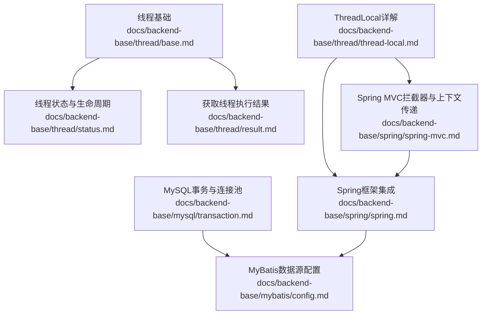
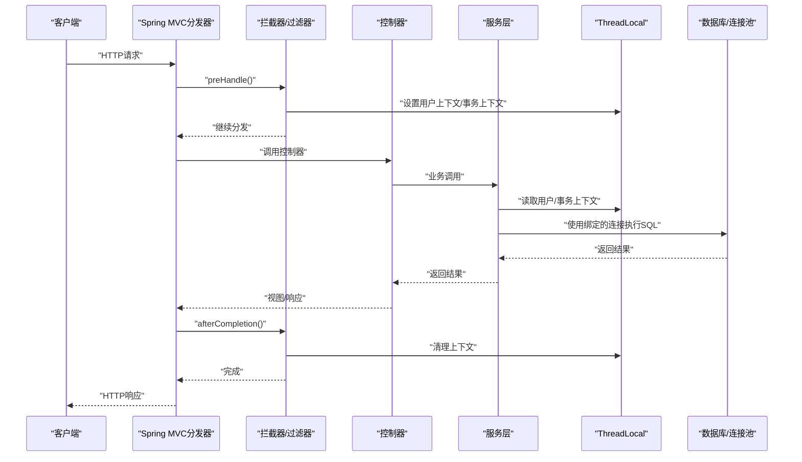
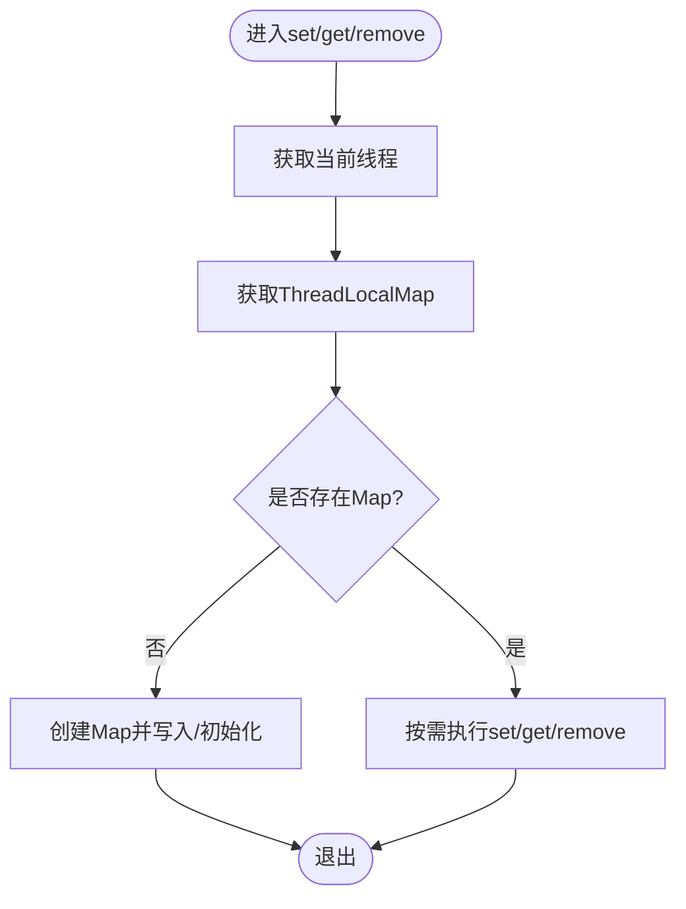
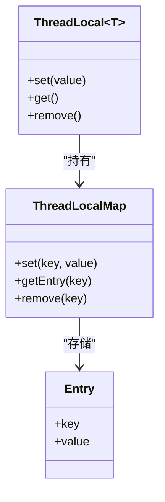
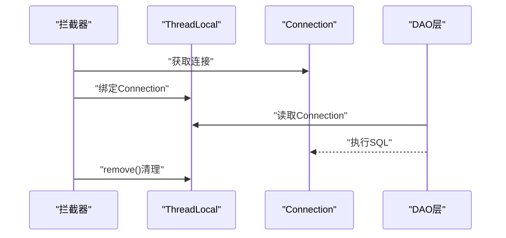
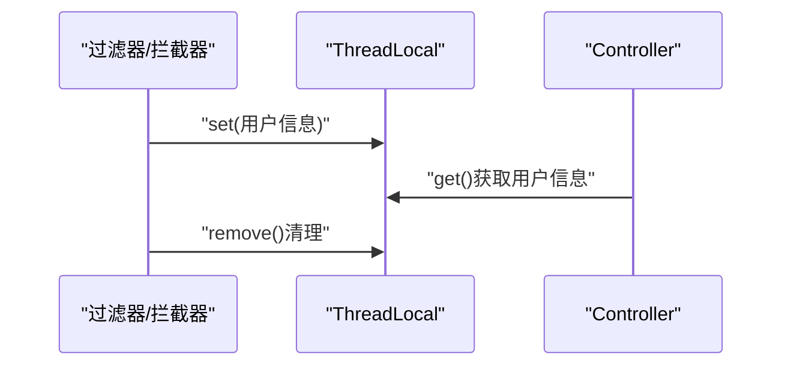
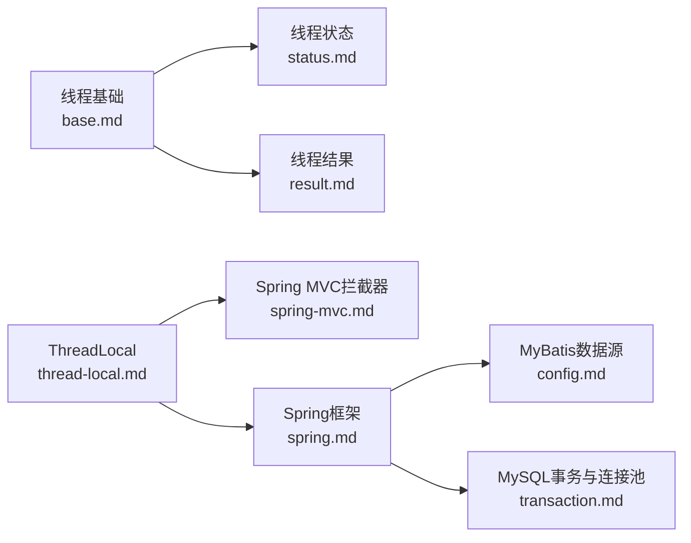

# ThreadLocal应用

<cite>
**本文引用的文件列表**
- [thread-local.md](file://docs/backend-base/thread/thread-local.md)
- [base.md](file://docs/backend-base/thread/base.md)
- [result.md](file://docs/backend-base/thread/result.md)
- [status.md](file://docs/backend-base/thread/status.md)
- [spring.md](file://docs/backend-base/spring/spring.md)
- [spring-mvc.md](file://docs/backend-base/spring/spring-mvc.md)
- [transaction.md](file://docs/backend-base/mysql/transaction.md)
- [config.md](file://docs/backend-base/mybatis/config.md)
</cite>

## 目录
1. [简介](#简介)
2. [项目结构](#项目结构)
3. [核心组件](#核心组件)
4. [架构总览](#架构总览)
5. [详细组件分析](#详细组件分析)
6. [依赖关系分析](#依赖关系分析)
7. [性能考量](#性能考量)
8. [故障排查指南](#故障排查指南)
9. [结论](#结论)
10. [附录](#附录)

## 简介
本技术文档围绕ThreadLocal在并发编程中的应用展开，系统阐述其工作原理、内存模型、内部结构（ThreadLocalMap）以及典型使用场景（数据库连接管理、用户身份信息传递、线程安全的简单实现）。文档还提供完整代码示例的路径指引，帮助读者在不直接阅读源码的前提下掌握ThreadLocal的声明、使用与清理方法；并深入讨论内存泄漏风险及解决方案，最后给出并发编程中线程隔离与数据共享的实用建议。

## 项目结构
本仓库与ThreadLocal相关的知识主要分布在“后端基础—线程”专题文档中，辅以Spring与MySQL/MyBatis相关内容，形成从基础到实战的完整知识链路。

图表来源
- [base.md:1-186](file://docs/backend-base/thread/base.md#L1-L186)
- [status.md:1-65](file://docs/backend-base/thread/status.md#L1-L65)
- [result.md:1-136](file://docs/backend-base/thread/result.md#L1-L136)
- [thread-local.md:1-75](file://docs/backend-base/thread/thread-local.md#L1-L75)
- [spring.md:62-6957](file://docs/backend-base/spring/spring.md#L62-L6957)
- [spring-mvc.md:5146-6912](file://docs/backend-base/spring/spring-mvc.md#L5146-L6912)
- [transaction.md:46-70](file://docs/backend-base/mysql/transaction.md#L46-L70)
- [config.md:154-178](file://docs/backend-base/mybatis/config.md#L154-L178)

章节来源
- [thread-local.md:1-75](file://docs/backend-base/thread/thread-local.md#L1-L75)
- [base.md:1-186](file://docs/backend-base/thread/base.md#L1-L186)
- [result.md:1-136](file://docs/backend-base/thread/result.md#L1-L136)
- [status.md:1-65](file://docs/backend-base/thread/status.md#L1-L65)
- [spring.md:62-6957](file://docs/backend-base/spring/spring.md#L62-L6957)
- [spring-mvc.md:5146-6912](file://docs/backend-base/spring/spring-mvc.md#L5146-L6912)
- [transaction.md:46-70](file://docs/backend-base/mysql/transaction.md#L46-L70)
- [config.md:154-178](file://docs/backend-base/mybatis/config.md#L154-L178)

## 核心组件
- ThreadLocal：线程本地存储，每个线程持有独立副本，避免共享资源竞争。
- ThreadLocalMap：ThreadLocal内部的哈希表，键为ThreadLocal实例，值为线程本地值。
- get/set/remove：对外暴露的读取、写入与清理接口。
- Spring与Spring MVC：在Web请求链路中通过拦截器/过滤器设置用户上下文，结合ThreadLocal实现跨层传递。
- 数据库连接与事务：在请求开始绑定连接/事务上下文，请求结束清理，避免连接泄漏。

章节来源
- [thread-local.md:5-75](file://docs/backend-base/thread/thread-local.md#L5-L75)
- [spring-mvc.md:5152-5162](file://docs/backend-base/spring/spring-mvc.md#L5152-L5162)

## 架构总览
下图展示了请求在Web层与业务层之间如何通过拦截器/过滤器设置ThreadLocal上下文，并在业务层各处读取；同时在事务与数据库连接管理中，ThreadLocal用于绑定当前线程的连接与事务上下文，确保线程内一致性。

图表来源
- [spring-mvc.md:5152-5162](file://docs/backend-base/spring/spring-mvc.md#L5152-L5162)
- [thread-local.md:26-65](file://docs/backend-base/thread/thread-local.md#L26-L65)
- [transaction.md:46-70](file://docs/backend-base/mysql/transaction.md#L46-L70)

## 详细组件分析

### ThreadLocal工作原理与内存模型
- 线程隔离：每个Thread对象持有一个ThreadLocalMap，键为ThreadLocal实例，值为线程本地值。
- 写入流程：set(T value)获取当前线程的ThreadLocalMap，若为空则创建，否则以当前ThreadLocal为键写入。
- 读取流程：get()获取当前线程的ThreadLocalMap，若存在对应Entry则返回值，否则通过初始化方法设置初始值。
- 清理流程：remove()从当前线程的ThreadLocalMap中移除当前ThreadLocal对应的Entry。

图表来源
- [thread-local.md:5-65](file://docs/backend-base/thread/thread-local.md#L5-L65)

章节来源
- [thread-local.md:5-65](file://docs/backend-base/thread/thread-local.md#L5-L65)

### ThreadLocalMap结构与键值对存储机制
- 键：ThreadLocal实例（弱引用键，避免ThreadLocal本身泄漏）
- 值：线程本地值
- 冲突解决：开放定址法（探测下一个槽位）
- 命中策略：getEntry以ThreadLocal为键进行查找，命中则返回Entry，否则返回null

图表来源
- [thread-local.md:5-65](file://docs/backend-base/thread/thread-local.md#L5-L65)

章节来源
- [thread-local.md:5-65](file://docs/backend-base/thread/thread-local.md#L5-L65)

### 典型应用场景

#### 数据库连接管理
- 请求开始：在拦截器/过滤器中创建或从连接池获取Connection，并通过ThreadLocal绑定到当前线程。
- 业务层：各DAO/Service通过ThreadLocal获取当前线程绑定的Connection，保证同一事务内的多次操作使用同一连接。
- 请求结束：在afterCompletion或finally中调用remove()清理，释放连接或归还至连接池。

图表来源
- [spring-mvc.md:5152-5162](file://docs/backend-base/spring/spring-mvc.md#L5152-L5162)
- [transaction.md:46-70](file://docs/backend-base/mysql/transaction.md#L46-L70)
- [config.md:154-178](file://docs/backend-base/mybatis/config.md#L154-L178)

章节来源
- [spring-mvc.md:5152-5162](file://docs/backend-base/spring/spring-mvc.md#L5152-L5162)
- [transaction.md:46-70](file://docs/backend-base/mysql/transaction.md#L46-L70)
- [config.md:154-178](file://docs/backend-base/mybatis/config.md#L154-L178)

#### 用户身份信息传递
- 登录成功后：在拦截器preHandle阶段将用户信息写入ThreadLocal。
- 业务处理：Controller/Service/DAO层均可读取用户信息，无需层层传递参数。
- 请求结束：afterCompletion阶段remove()清理，避免线程复用导致的脏读。

图表来源
- [spring-mvc.md:5152-5162](file://docs/backend-base/spring/spring-mvc.md#L5152-L5162)
- [thread-local.md:67-75](file://docs/backend-base/thread/thread-local.md#L67-L75)

章节来源
- [spring-mvc.md:5152-5162](file://docs/backend-base/spring/spring-mvc.md#L5152-L5162)
- [thread-local.md:67-75](file://docs/backend-base/thread/thread-local.md#L67-L75)

#### 线程安全的简单实现
- 使用ThreadLocal封装线程私有的计数器/缓存，避免synchronized锁带来的性能损耗。
- 注意：线程池复用线程时务必在任务结束时remove()，否则可能污染后续任务。

章节来源
- [thread-local.md:5-65](file://docs/backend-base/thread/thread-local.md#L5-L65)

### 完整代码示例路径指引
- 声明与使用
  - [ThreadLocal声明与get/set示例:9-50](file://docs/backend-base/thread/thread-local.md#L9-L50)
- 清理方法
  - [ThreadLocal.remove()示例:57-65](file://docs/backend-base/thread/thread-local.md#L57-L65)
- Web请求上下文传递（拦截器）
  - [拦截器说明与执行顺序:5152-5162](file://docs/backend-base/spring/spring-mvc.md#L5152-L5162)
- 数据库连接绑定与清理
  - [连接池配置与使用:154-178](file://docs/backend-base/mybatis/config.md#L154-L178)
  - [事务与连接池说明:46-70](file://docs/backend-base/mysql/transaction.md#L46-L70)

章节来源
- [thread-local.md:9-65](file://docs/backend-base/thread/thread-local.md#L9-L65)
- [spring-mvc.md:5152-5162](file://docs/backend-base/spring/spring-mvc.md#L5152-L5162)
- [config.md:154-178](file://docs/backend-base/mybatis/config.md#L154-L178)
- [transaction.md:46-70](file://docs/backend-base/mysql/transaction.md#L46-L70)

## 依赖关系分析
- 线程基础能力：线程创建、状态与生命周期、结果获取为ThreadLocal提供运行环境。
- Web层集成：Spring MVC拦截器/过滤器负责在请求生命周期内设置与清理ThreadLocal。
- 数据层支撑：连接池与事务管理为ThreadLocal绑定的连接提供稳定来源与一致性保障。

图表来源
- [base.md:1-186](file://docs/backend-base/thread/base.md#L1-L186)
- [status.md:1-65](file://docs/backend-base/thread/status.md#L1-L65)
- [result.md:1-136](file://docs/backend-base/thread/result.md#L1-L136)
- [thread-local.md:1-75](file://docs/backend-base/thread/thread-local.md#L1-L75)
- [spring-mvc.md:5152-5162](file://docs/backend-base/spring/spring-mvc.md#L5152-L5162)
- [spring.md:62-6957](file://docs/backend-base/spring/spring.md#L62-L6957)
- [config.md:154-178](file://docs/backend-base/mybatis/config.md#L154-L178)
- [transaction.md:46-70](file://docs/backend-base/mysql/transaction.md#L46-L70)

章节来源
- [base.md:1-186](file://docs/backend-base/thread/base.md#L1-L186)
- [status.md:1-65](file://docs/backend-base/thread/status.md#L1-L65)
- [result.md:1-136](file://docs/backend-base/thread/result.md#L1-L136)
- [thread-local.md:1-75](file://docs/backend-base/thread/thread-local.md#L1-L75)
- [spring-mvc.md:5152-5162](file://docs/backend-base/spring/spring-mvc.md#L5152-L5162)
- [spring.md:62-6957](file://docs/backend-base/spring/spring.md#L62-L6957)
- [config.md:154-178](file://docs/backend-base/mybatis/config.md#L154-L178)
- [transaction.md:46-70](file://docs/backend-base/mysql/transaction.md#L46-L70)

## 性能考量
- 线程隔离优势：避免全局共享状态带来的锁竞争，提升吞吐。
- 内存占用：每个线程持有独立副本，大量ThreadLocal实例或大对象值会增加内存压力。
- 线程池复用风险：线程复用可能导致ThreadLocal值残留，引发脏读或内存泄漏，务必在任务结束时显式remove()。
- 连接池与事务：结合连接池与事务管理，减少频繁创建/销毁连接的开销，提高整体性能。

章节来源
- [thread-local.md:5-65](file://docs/backend-base/thread/thread-local.md#L5-L65)
- [config.md:154-178](file://docs/backend-base/mybatis/config.md#L154-L178)
- [transaction.md:46-70](file://docs/backend-base/mysql/transaction.md#L46-L70)

## 故障排查指南
- 现象：线程复用导致的脏读或内存泄漏
  - 排查：确认是否在任务结束时调用remove()；检查线程池是否正确回收线程。
  - 解决：在finally块或请求结束回调中统一remove()。
- 现象：业务层读取不到预期的用户/事务上下文
  - 排查：确认拦截器/过滤器是否在preHandle阶段设置，是否在afterCompletion阶段清理。
  - 解决：完善拦截器逻辑，确保上下文在请求生命周期内有效。
- 现象：连接泄漏或连接池耗尽
  - 排查：确认业务层是否正确使用绑定的Connection；请求结束是否归还连接。
  - 解决：在afterCompletion或finally中remove()并归还连接。

章节来源
- [spring-mvc.md:5152-5162](file://docs/backend-base/spring/spring-mvc.md#L5152-L5162)
- [thread-local.md:53-65](file://docs/backend-base/thread/thread-local.md#L53-L65)
- [transaction.md:46-70](file://docs/backend-base/mysql/transaction.md#L46-L70)

## 结论
ThreadLocal通过线程隔离实现高效的数据传递与状态管理，广泛应用于Web请求上下文、数据库连接与事务管理等场景。其核心在于get/set/remove的正确使用与生命周期管理。结合Spring MVC拦截器与连接池/事务管理，可在保证线程安全的同时获得良好的性能表现。务必重视线程池复用带来的潜在风险，养成在任务结束时清理ThreadLocal的习惯，避免内存泄漏与脏读问题。

## 附录
- 相关主题阅读
  - [线程基础与状态:1-186](file://docs/backend-base/thread/base.md#L1-L186)
  - [线程状态转换:1-65](file://docs/backend-base/thread/status.md#L1-L65)
  - [获取线程执行结果:1-136](file://docs/backend-base/thread/result.md#L1-L136)
  - [Spring MVC拦截器与执行顺序:5152-6912](file://docs/backend-base/spring/spring-mvc.md#L5152-L6912)
  - [MySQL事务与连接池:46-70](file://docs/backend-base/mysql/transaction.md#L46-L70)
  - [MyBatis数据源配置:154-178](file://docs/backend-base/mybatis/config.md#L154-L178)