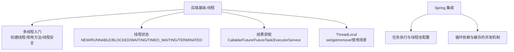
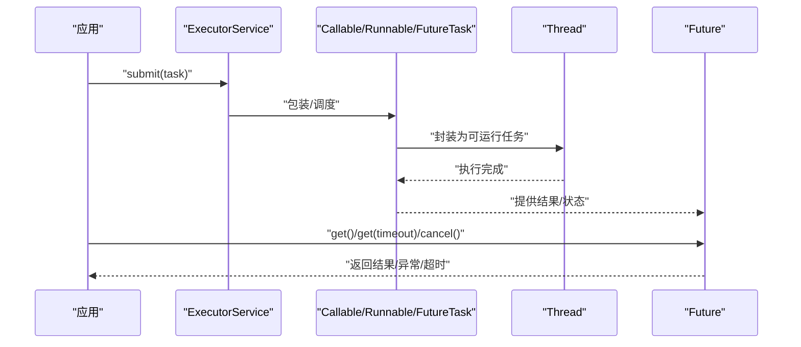
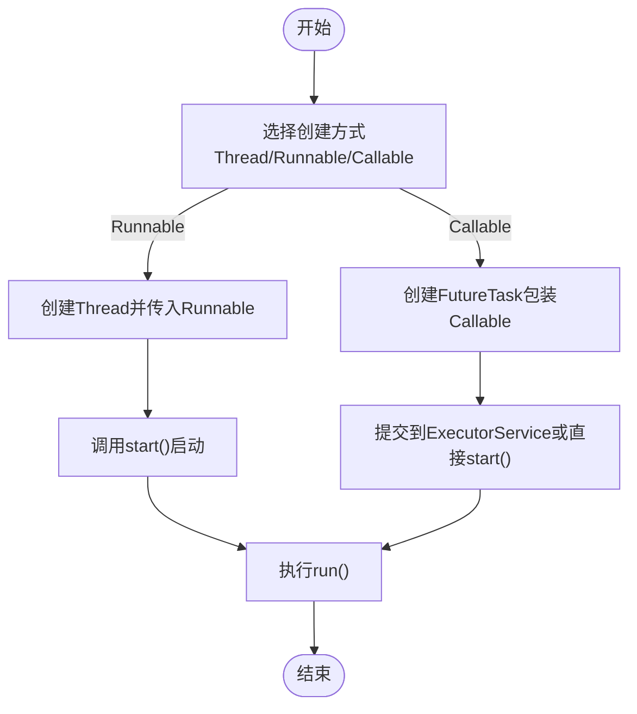
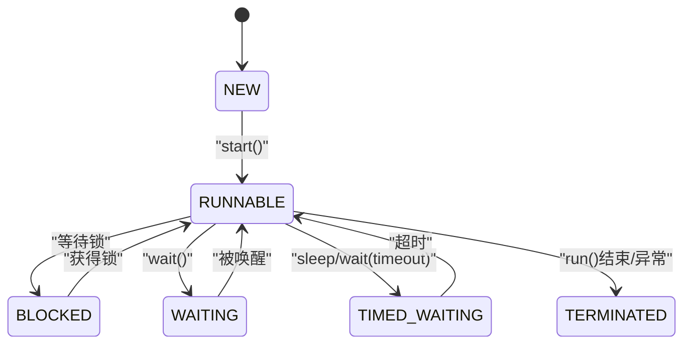
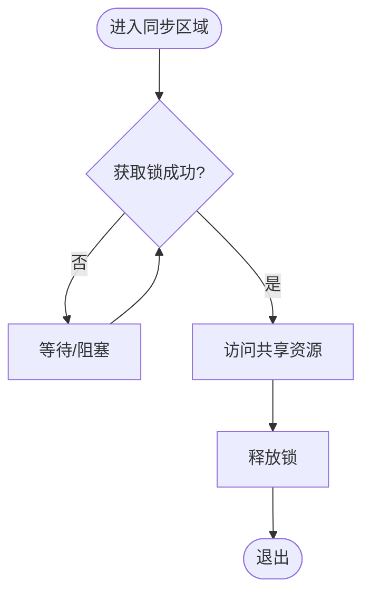
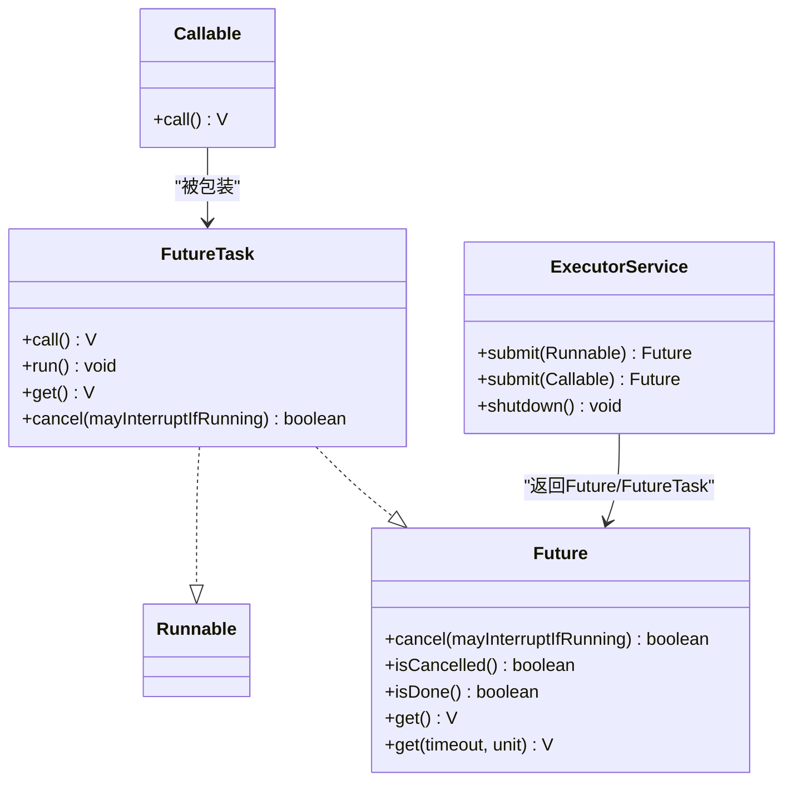
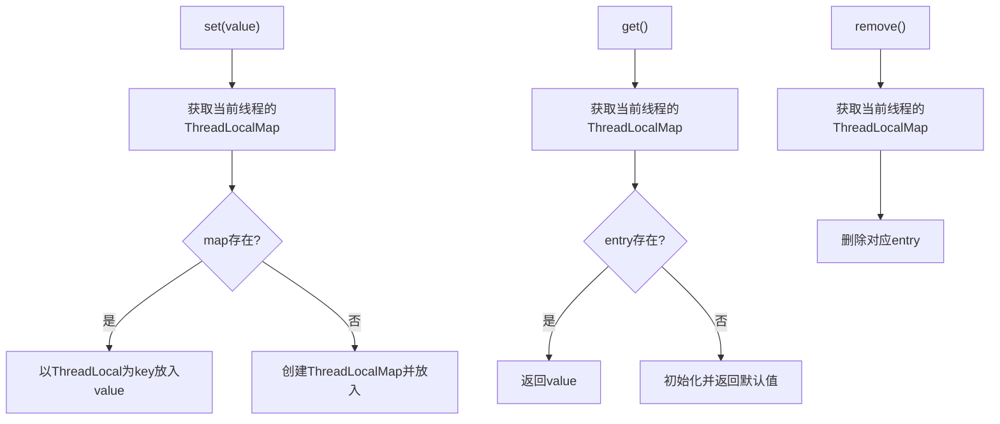
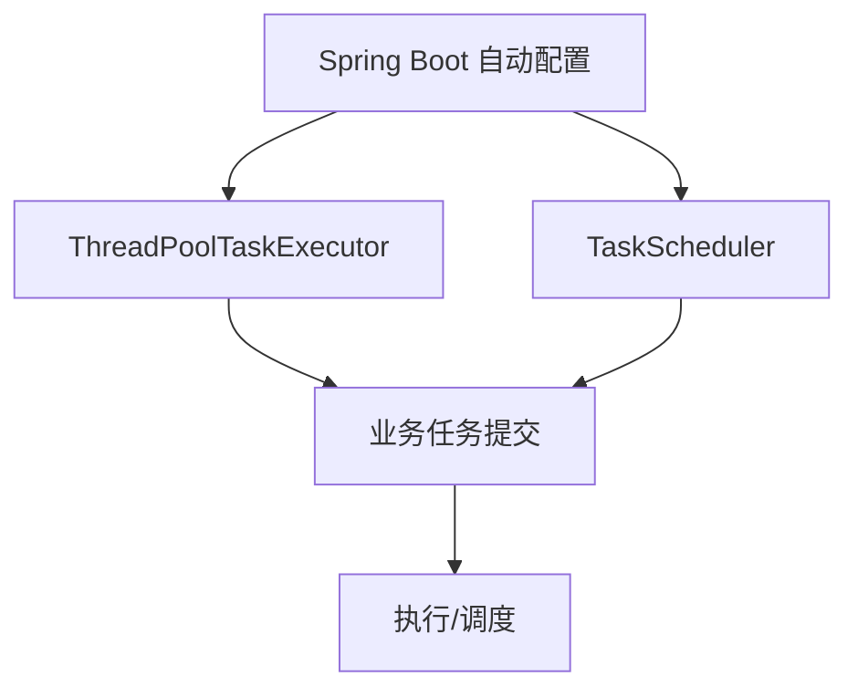
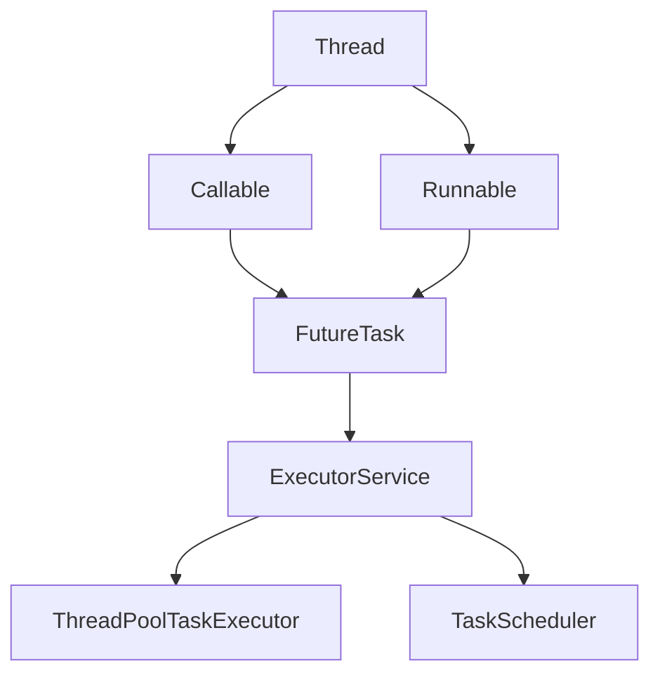

# 并发编程

<cite>
**本文引用的文件**
- [docs\backend-base\thread\base.md](file://docs\backend-base\thread\base.md)
- [docs\backend-base\thread\status.md](file://docs\backend-base\thread\status.md)
- [docs\backend-base\thread\result.md](file://docs\backend-base\thread\result.md)
- [docs\backend-base\thread\thread-local.md](file://docs\backend-base\thread\thread-local.md)
- [docs\backend-base\spring\spring-boot.md](file://docs\backend-base\spring\spring-boot.md)
- [docs\backend-base\spring\spring.md](file://docs\backend-base\spring\spring.md)
</cite>

## 目录
1. [简介](#简介)
2. [项目结构](#项目结构)
3. [核心组件](#核心组件)
4. [架构总览](#架构总览)
5. [详细组件分析](#详细组件分析)
6. [依赖关系分析](#依赖关系分析)
7. [性能考量](#性能考量)
8. [故障排查指南](#故障排查指南)
9. [结论](#结论)
10. [附录](#附录)

## 简介
本技术文档围绕并发编程主题，系统梳理多线程基础、线程状态管理、线程间通信、ThreadLocal 使用、结果获取与线程池等核心知识。文档结合仓库中的并发相关笔记，给出从入门到进阶的实践路径，并补充 Spring 在任务执行与并发基础设施方面的集成要点，帮助开发者建立完整的并发知识体系与工程实践能力。

## 项目结构
本仓库中与并发相关的内容主要分布在后端基础模块下的 thread 子目录，以及 Spring 框架相关章节。整体组织如下：
- 后端基础·线程：包含多线程入门、线程状态、结果获取、ThreadLocal 等主题
- Spring：包含线程池与任务执行配置、事务与并发的关系、循环依赖与缓存的并发视角

**章节来源**
- [docs\backend-base\thread\base.md:1-186](file://docs/backend-base/thread/base.md#L1-L186)
- [docs\backend-base\thread\status.md:1-65](file://docs/backend-base/thread/status.md#L1-L65)
- [docs\backend-base\thread\result.md:1-136](file://docs/backend-base/thread/result.md#L1-L136)
- [docs\backend-base\thread\thread-local.md:1-75](file://docs/backend-base/thread/thread-local.md#L1-L75)
- [docs\backend-base\spring\spring-boot.md:3376-3395](file://docs/backend-base/spring/spring-boot.md#L3376-L3395)
- [docs\backend-base\spring\spring.md:4643-4663](file://docs/backend-base/spring/spring.md#L4643-L4663)

## 核心组件
- 线程生命周期与状态转换：涵盖 NEW、RUNNABLE、BLOCKED、WAITING、TIMED_WAITING、TERMINATED 等状态及转换条件
- 线程创建与启动：Thread、Runnable、Callable、Future/FutureTask、线程池
- 线程安全与同步：synchronized 锁对象选择（实例、类、静态方法）
- 结果获取与任务控制：Future 接口能力、取消与超时、FutureTask 的双重角色
- 线程隔离工具：ThreadLocal 的 set/get/remove 语义与典型使用场景
- Spring 并发基础设施：任务执行器与调度器的自动装配与配置

**章节来源**
- [docs\backend-base\thread\base.md:110-186](file://docs/backend-base/thread/base.md#L110-L186)
- [docs\backend-base\thread\status.md:9-65](file://docs/backend-base/thread/status.md#L9-L65)
- [docs\backend-base\thread\result.md:7-136](file://docs/backend-base/thread/result.md#L7-L136)
- [docs\backend-base\thread\thread-local.md:1-75](file://docs/backend-base/thread/thread-local.md#L1-L75)
- [docs\backend-base\spring\spring-boot.md:3376-3395](file://docs/backend-base/spring/spring-boot.md#L3376-L3395)

## 架构总览
下图展示从“线程创建与启动”到“结果获取与线程池”的整体流程，以及 Spring 在任务执行层面的支撑作用。

**图表来源**
- [docs\backend-base\thread\result.md:23-71](file://docs/backend-base/thread/result.md#L23-L71)
- [docs\backend-base\thread\result.md:104-135](file://docs/backend-base/thread/result.md#L104-L135)
- [docs\backend-base\spring\spring-boot.md:3376-3395](file://docs/backend-base/spring/spring-boot.md#L3376-L3395)

## 详细组件分析

### 线程创建与启动
- Thread 类与 Runnable 接口：通过继承 Thread 或实现 Runnable 来定义任务；通过 Thread.start 触发执行
- Callable 与 Future/FutureTask：提供带返回值的任务模型，Future 提供结果获取、取消、超时等能力
- 线程池：通过 ExecutorService 提交任务，统一管理线程生命周期与资源

**章节来源**
- [docs\backend-base\thread\base.md:11-103](file://docs/backend-base/thread/base.md#L11-L103)
- [docs\backend-base\thread\result.md:7-49](file://docs/backend-base/thread/result.md#L7-L49)

### 线程状态管理
- 状态枚举：NEW、RUNNABLE、BLOCKED、WAITING、TIMED_WAITING、TERMINATED
- 状态转换：由 start、阻塞等待、等待/限时等待、执行结束等触发
- 中断机制：interrupt/isInterrupted/interrupted 的协作式中断语义

**章节来源**
- [docs\backend-base\thread\status.md:9-65](file://docs/backend-base/thread/status.md#L9-L65)
- [docs\backend-base\thread\base.md:172-184](file://docs/backend-base/thread/base.md#L172-L184)

### 线程安全与同步
- synchronized 同步块：通过显式锁对象保护临界区
- 同步方法：非静态方法默认以 this 为锁，静态方法默认以类对象为锁
- 注意事项：避免锁粒度过大、死锁风险、过度同步导致性能下降

**章节来源**
- [docs\backend-base\thread\base.md:124-170](file://docs/backend-base/thread/base.md#L124-L170)

### 结果获取与任务控制
- Future 接口能力：cancel、isCancelled、isDone、get()、get(timeout, unit)
- FutureTask：既是 Runnable 又是 Future，既可直接交给 Thread，也可提交给线程池
- ExecutorService：统一提交 Runnable/Callable，管理线程池生命周期

**图表来源**
- [docs\backend-base\thread\result.md:77-86](file://docs/backend-base/thread/result.md#L77-L86)
- [docs\backend-base\thread\result.md:100-103](file://docs/backend-base/thread/result.md#L100-L103)
- [docs\backend-base\thread\result.md:23-49](file://docs/backend-base/thread/result.md#L23-L49)

**章节来源**
- [docs\backend-base\thread\result.md:73-136](file://docs/backend-base/thread/result.md#L73-L136)

### ThreadLocal 使用
- set/get/remove 语义：以当前线程为键，维护线程本地副本
- 典型场景：用户会话、数据库连接、事务上下文、线程内临时变量
- 注意事项：避免内存泄漏，及时 remove；谨慎在线程池中使用

**章节来源**
- [docs\backend-base\thread\thread-local.md:1-75](file://docs/backend-base/thread/thread-local.md#L1-L75)

### Spring 并发与任务执行
- 自动装配的任务执行器与调度器：Spring Boot 默认提供 ThreadPoolTaskExecutor、TaskScheduler 等 Bean
- 循环依赖与缓存的并发视角：三级缓存提前暴露早期 Bean，缓解构造注入导致的循环依赖问题

**章节来源**
- [docs\backend-base\spring\spring-boot.md:3376-3395](file://docs/backend-base/spring/spring-boot.md#L3376-L3395)
- [docs\backend-base\spring\spring.md:4643-4663](file://docs/backend-base/spring/spring.md#L4643-L4663)

## 依赖关系分析
- 线程与任务：Thread 与 Runnable/Callable/FutureTask 形成任务执行链路
- 线程池：ExecutorService 作为任务提交与生命周期管理的中枢
- Spring 集成：自动装配的执行器与调度器为并发任务提供基础设施
- 缓存与并发：Spring 三级缓存机制在单例 Bean 创建过程中体现并发控制思想

**图表来源**
- [docs\backend-base\thread\result.md:100-103](file://docs/backend-base/thread/result.md#L100-L103)
- [docs\backend-base\spring\spring-boot.md:3376-3395](file://docs/backend-base/spring/spring-boot.md#L3376-L3395)

**章节来源**
- [docs\backend-base\thread\result.md:104-135](file://docs/backend-base/thread/result.md#L104-L135)
- [docs\backend-base\spring\spring-boot.md:3376-3395](file://docs/backend-base/spring/spring-boot.md#L3376-L3395)

## 性能考量
- 选择合适的并发模型：短任务优先线程池复用，长任务避免阻塞 IO 导致线程饥饿
- 控制锁粒度：缩小同步范围，减少竞争；必要时采用读写锁或无锁结构
- 合理使用 ThreadLocal：避免在池化线程中遗留对象；及时清理
- 结果获取策略：尽量使用非阻塞或带超时的 Future 获取，避免长时间阻塞
- Spring 线程池参数：核心/最大线程数、队列容量、拒绝策略需结合业务峰值评估

## 故障排查指南
- 线程阻塞与死锁
  - 现象：线程长期处于 BLOCKED/WAITING
  - 排查：检查锁持有者、同步范围、是否存在相互等待
  - 预防：统一加锁顺序、避免嵌套锁、使用超时获取锁
- 结果获取异常
  - 现象：Future.get() 阻塞或抛出异常
  - 排查：确认任务是否被取消、是否发生异常、是否超时
  - 处理：使用带超时的 get，或在提交时捕获异常
- 线程池耗尽
  - 现象：任务排队堆积、拒绝异常
  - 排查：核对线程池参数与任务特征
  - 处理：扩容线程池、优化任务执行时长、引入限流或降级
- ThreadLocal 内存泄漏
  - 现象：堆内存持续上涨
  - 排查：确认是否在每次任务后调用 remove
  - 处理：在合适时机 remove，或避免在线程池中使用

**章节来源**
- [docs\backend-base\thread\result.md:73-95](file://docs/backend-base/thread/result.md#L73-L95)
- [docs\backend-base\thread\thread-local.md:53-75](file://docs/backend-base/thread/thread-local.md#L53-L75)

## 结论
并发编程的关键在于理解线程生命周期、正确选择同步与隔离手段、合理使用线程池与结果获取机制，并在工程实践中遵循最佳实践与故障排查方法。Spring 在任务执行与缓存并发控制方面提供了良好的基础设施，结合本文的知识体系，可有效提升系统的并发性能与稳定性。

## 附录
- 常用术语
  - 线程：系统执行任务的最小单元
  - 任务：线程执行的工作单元（Runnable/Callable）
  - 线程池：管理线程生命周期与复用的容器
  - Future：对异步任务结果的引用与控制
  - ThreadLocal：线程本地存储，避免共享资源竞争