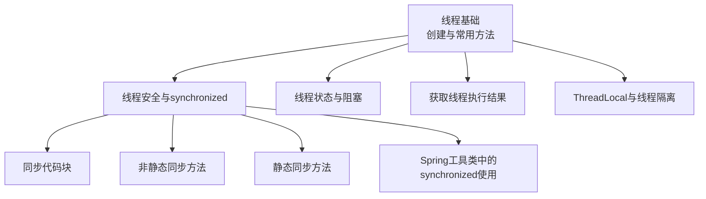
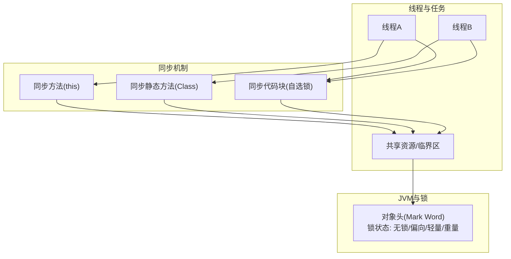
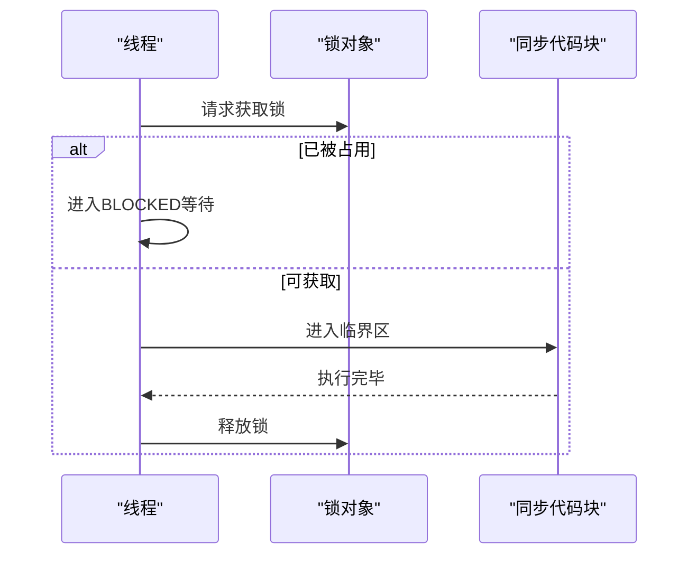
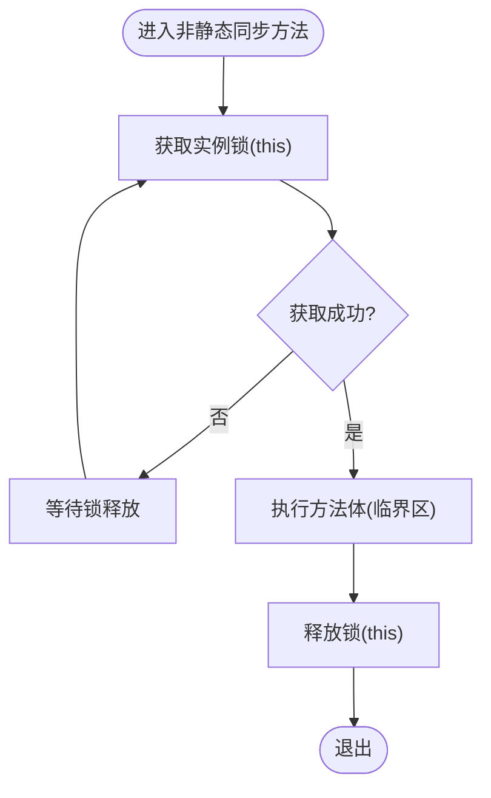
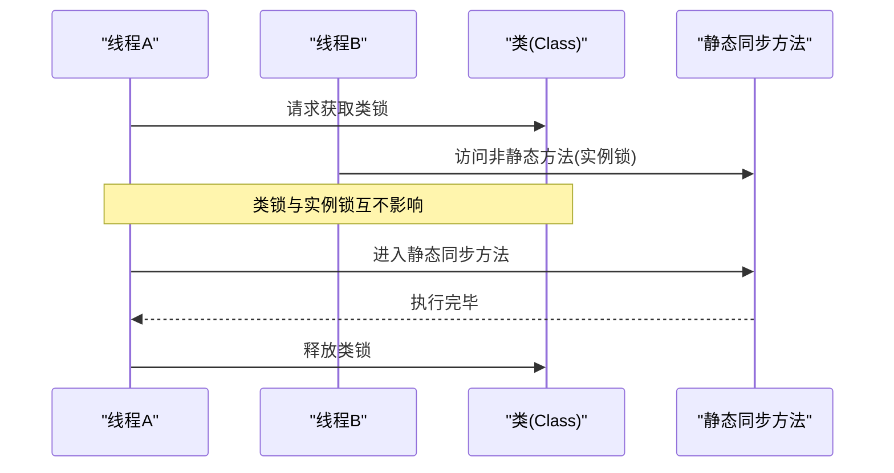
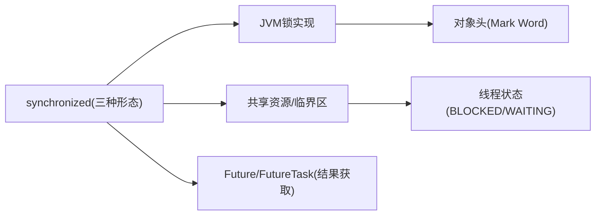

# 线程同步

<cite>
**本文引用的文件**
- [synchronized.md](file://docs/backend-base/thread/synchronized.md)
- [base.md](file://docs/backend-base/thread/base.md)
- [result.md](file://docs/backend-base/thread/result.md)
- [status.md](file://docs/backend-base/thread/status.md)
- [thread-local.md](file://docs/backend-base/thread/thread-local.md)
- [spring-util.md](file://docs/backend-base/spring/spring-util.md)
</cite>

## 目录
1. [引言](#引言)
2. [项目结构](#项目结构)
3. [核心组件](#核心组件)
4. [架构总览](#架构总览)
5. [详细组件分析](#详细组件分析)
6. [依赖关系分析](#依赖关系分析)
7. [性能考量](#性能考量)
8. [故障排查指南](#故障排查指南)
9. [结论](#结论)
10. [附录](#附录)

## 引言
本技术文档围绕线程同步机制展开，系统阐述线程安全的概念与重要性，深入解析 Java 中 synchronized 关键字的三种使用形态：同步代码块、非静态同步方法、静态同步方法；并结合仓库中的资料，给出锁对象选择原则、工作原理与性能影响分析，以及常见问题与解决方案，帮助读者在并发编程中做出正确、高效的决策。

## 项目结构
本仓库与线程同步相关的内容集中在 backend-base/thread 目录，辅以 Spring 工具类中的 synchronized 使用示例，以及线程状态、线程结果获取、ThreadLocal 等辅助知识，形成完整的并发学习体系。

**章节来源**
- [base.md:110-186](file://docs/backend-base/thread/base.md#L110-L186)
- [synchronized.md:1-194](file://docs/backend-base/thread/synchronized.md#L1-L194)
- [result.md:1-136](file://docs/backend-base/thread/result.md#L1-L136)
- [status.md:1-65](file://docs/backend-base/thread/status.md#L1-L65)
- [thread-local.md:1-75](file://docs/backend-base/thread/thread-local.md#L1-L75)
- [spring-util.md:960-1022](file://docs/backend-base/spring/spring-util.md#L960-L1022)

## 核心组件
- 线程安全与synchronized
  - synchronized 保证同一时刻仅一个线程可执行被保护的代码段，同时具备可见性保障（可替代 volatile 的部分场景）。
  - 三种应用方式：
    - 同步方法（默认锁 this）
    - 同步静态方法（默认锁当前类的 Class 对象）
    - 同步代码块（显式指定锁对象）

- 锁对象选择原则
  - 选择粒度尽可能小的锁对象，避免扩大同步范围导致性能退化。
  - 避免锁升级与跨对象互斥引发的死锁风险。
  - 对实例方法与类级别静态方法采用不同锁对象，确保互不干扰。

- 临界区与可见性
  - 临界区为被 synchronized 保护的代码区域；synchronized 保证原子性与可见性。

- 线程状态与阻塞
  - synchronized 争用导致 BLOCKED 状态；wait/sleep 行为不同（wait 释放锁，sleep 不释放锁）。

**章节来源**
- [synchronized.md:3-10](file://docs/backend-base/thread/synchronized.md#L3-L10)
- [synchronized.md:11-42](file://docs/backend-base/thread/synchronized.md#L11-L42)
- [synchronized.md:46-87](file://docs/backend-base/thread/synchronized.md#L46-L87)
- [synchronized.md:89-137](file://docs/backend-base/thread/synchronized.md#L89-L137)
- [synchronized.md:139-173](file://docs/backend-base/thread/synchronized.md#L139-L173)
- [base.md:124-186](file://docs/backend-base/thread/base.md#L124-L186)

## 架构总览
下图展示了线程同步在并发模型中的位置与交互关系：线程通过同步机制访问共享资源，受 JVM 锁机制与对象头管理，遵循可见性与原子性约束。

**图表来源**
- [synchronized.md:175-194](file://docs/backend-base/thread/synchronized.md#L175-L194)
- [synchronized.md:11-42](file://docs/backend-base/thread/synchronized.md#L11-L42)
- [synchronized.md:46-87](file://docs/backend-base/thread/synchronized.md#L46-L87)
- [synchronized.md:89-137](file://docs/backend-base/thread/synchronized.md#L89-L137)

## 详细组件分析

### 同步代码块
- 定义与作用
  - 使用 synchronized 关键字包裹一段代码，指定锁对象，仅允许一个线程进入该代码块。
  - 适用于仅需保护少量临界代码的场景，避免扩大同步范围带来的性能损耗。
- 锁对象选择
  - 可使用 this、类的 Class 对象或自定义私有对象，推荐使用最小化、稳定的锁对象。
- 示例路径
  - [同步代码块示例与锁对象选择:95-137](file://docs/backend-base/thread/synchronized.md#L95-L137)

**图表来源**
- [synchronized.md:89-137](file://docs/backend-base/thread/synchronized.md#L89-L137)
- [base.md:172-186](file://docs/backend-base/thread/base.md#L172-L186)

**章节来源**
- [synchronized.md:89-137](file://docs/backend-base/thread/synchronized.md#L89-L137)

### 非静态同步方法
- 定义与作用
  - 在方法签名上使用 synchronized，锁对象为当前实例 this。
  - 适合保护实例级别的共享状态。
- 注意事项
  - 同一实例的其他非同步方法仍可被其他线程并发访问，避免不必要的串行化。
- 示例路径
  - [非静态同步方法示例:17-42](file://docs/backend-base/thread/synchronized.md#L17-L42)

**图表来源**
- [synchronized.md:11-42](file://docs/backend-base/thread/synchronized.md#L11-L42)

**章节来源**
- [synchronized.md:11-42](file://docs/backend-base/thread/synchronized.md#L11-L42)

### 静态同步方法
- 定义与作用
  - 在静态方法上使用 synchronized，锁对象为当前类的 Class 对象。
  - 适合保护类级别的共享状态或全局资源。
- 与实例方法的互不影响
  - 实例锁与类锁不同，二者互不阻塞，避免误以为静态同步会阻塞所有实例方法。
- 示例路径
  - [静态同步方法示例:52-87](file://docs/backend-base/thread/synchronized.md#L52-L87)

**图表来源**
- [synchronized.md:46-87](file://docs/backend-base/thread/synchronized.md#L46-L87)

**章节来源**
- [synchronized.md:46-87](file://docs/backend-base/thread/synchronized.md#L46-L87)

### 锁对象与可见性
- 锁对象选择
  - 优先使用最小化、稳定的对象作为锁，避免过度串行化。
  - 使用 this 与 this.getClass() 的等价写法示例可参考：
    - [实例方法与同步代码块等价写法:145-157](file://docs/backend-base/thread/synchronized.md#L145-L157)
    - [静态方法与同步代码块等价写法:159-173](file://docs/backend-base/thread/synchronized.md#L159-L173)
- 对象头与锁状态
  - 对象头包含 Mark Word，记录锁状态（无锁/偏向/轻量/重量），JVM据此进行锁升级与降级。
- 示例路径
  - [对象锁存放与锁状态说明:175-194](file://docs/backend-base/thread/synchronized.md#L175-L194)

**章节来源**
- [synchronized.md:175-194](file://docs/backend-base/thread/synchronized.md#L175-L194)

### 线程状态与阻塞
- 线程状态
  - NEW、RUNNABLE、BLOCKED、WAITING、TIMED_WAITING、TERMINATED。
- synchronized 导致的阻塞
  - 等待锁释放时进入 BLOCKED；wait/sleep 行为不同（wait 释放锁，sleep 不释放锁）。
- 示例路径
  - [线程状态与阻塞说明:172-186](file://docs/backend-base/thread/base.md#L172-186)
  - [线程状态图与方法说明:1-65](file://docs/backend-base/thread/status.md#L1-L65)

**章节来源**
- [base.md:172-186](file://docs/backend-base/thread/base.md#L172-L186)
- [status.md:1-65](file://docs/backend-base/thread/status.md#L1-L65)

### 获取线程执行结果与并发协作
- 适用场景
  - 需要获取线程执行结果时，使用 Callable/Future/FutureTask 或线程池。
- 示例路径
  - [获取线程执行结果:1-136](file://docs/backend-base/thread/result.md#L1-L136)

**章节来源**
- [result.md:1-136](file://docs/backend-base/thread/result.md#L1-L136)

### ThreadLocal 与线程隔离
- 作用
  - 为每个线程提供独立的变量副本，避免共享资源竞争。
- 示例路径
  - [ThreadLocal 使用与源码要点:1-75](file://docs/backend-base/thread/thread-local.md#L1-L75)

**章节来源**
- [thread-local.md:1-75](file://docs/backend-base/thread/thread-local.md#L1-L75)

### Spring 工具类中的 synchronized 使用
- 示例路径
  - [Spring 工具类中的 synchronized 使用:960-1022](file://docs/backend-base/spring/spring-util.md#L960-L1022)

**章节来源**
- [spring-util.md:960-1022](file://docs/backend-base/spring/spring-util.md#L960-L1022)

## 依赖关系分析
- 组件耦合
  - synchronized 的三种形态在逻辑上相互独立，但在 JVM 层面共享同一把锁对象（实例锁 vs 类锁）。
- 外部依赖
  - 线程状态与阻塞依赖 JVM 的锁实现与对象头管理。
  - 获取线程执行结果依赖 java.util.concurrent 包的接口与实现。

**图表来源**
- [synchronized.md:11-173](file://docs/backend-base/thread/synchronized.md#L11-L173)
- [base.md:172-186](file://docs/backend-base/thread/base.md#L172-L186)
- [result.md:1-136](file://docs/backend-base/thread/result.md#L1-L136)

**章节来源**
- [synchronized.md:11-173](file://docs/backend-base/thread/synchronized.md#L11-L173)
- [base.md:172-186](file://docs/backend-base/thread/base.md#L172-L186)
- [result.md:1-136](file://docs/backend-base/thread/result.md#L1-L136)

## 性能考量
- 锁粒度与同步范围
  - 同步代码块优于同步整个方法，避免扩大同步范围导致性能退化。
- 锁类型与升级
  - JVM 对锁进行偏向、轻量、重量级升级，尽量减少重量级锁的使用。
- 等价写法与一致性
  - 实例方法与同步代码块、静态方法与同步代码块的等价写法有助于统一风格与降低维护成本。
- 示例路径
  - [等价写法与锁对象选择:145-173](file://docs/backend-base/thread/synchronized.md#L145-L173)

**章节来源**
- [synchronized.md:145-173](file://docs/backend-base/thread/synchronized.md#L145-L173)

## 故障排查指南
- 常见问题
  - 死锁：跨对象获取多个锁时顺序不一致导致。
  - 锁粒度过大：同步范围过大导致性能瓶颈。
  - wait/sleep 混淆：wait 释放锁，sleep 不释放锁，影响并发。
- 解决方案
  - 统一锁顺序，避免交叉依赖。
  - 缩小同步范围，使用同步代码块。
  - 明确 wait/sleep 的使用场景与行为差异。
- 示例路径
  - [线程状态与阻塞说明:172-186](file://docs/backend-base/thread/base.md#L172-186)
  - [线程状态图与方法说明:1-65](file://docs/backend-base/thread/status.md#L1-L65)

**章节来源**
- [base.md:172-186](file://docs/backend-base/thread/base.md#L172-L186)
- [status.md:1-65](file://docs/backend-base/thread/status.md#L1-L65)

## 结论
synchronized 是 Java 并发编程的基础工具，掌握同步代码块、非静态同步方法、静态同步方法的使用与锁对象选择原则，是实现线程安全的关键。结合对象头与 JVM 锁机制，合理缩小同步范围、避免死锁与锁粒度过大，可在保证正确性的前提下获得更好的性能表现。配合 Future/FutureTask 与 ThreadLocal，可进一步完善并发任务的执行与隔离需求。

## 附录
- 示例路径索引
  - [同步代码块与锁对象选择:95-137](file://docs/backend-base/thread/synchronized.md#L95-L137)
  - [非静态同步方法示例:17-42](file://docs/backend-base/thread/synchronized.md#L17-L42)
  - [静态同步方法示例:52-87](file://docs/backend-base/thread/synchronized.md#L52-L87)
  - [等价写法与锁对象选择:145-173](file://docs/backend-base/thread/synchronized.md#L145-L173)
  - [线程状态与阻塞说明:172-186](file://docs/backend-base/thread/base.md#L172-186)
  - [获取线程执行结果:1-136](file://docs/backend-base/thread/result.md#L1-L136)
  - [ThreadLocal 使用与源码要点:1-75](file://docs/backend-base/thread/thread-local.md#L1-L75)
  - [Spring 工具类中的 synchronized 使用:960-1022](file://docs/backend-base/spring/spring-util.md#L960-L1022)