# 线程基础

<cite>
**本文引用的文件**
- [docs/backend-base/thread/base.md](file://docs/backend-base/thread/base.md)
- [docs/backend-base/thread/result.md](file://docs/backend-base/thread/result.md)
- [docs/backend-base/thread/status.md](file://docs/backend-base/thread/status.md)
- [docs/backend-base/thread/thread-local.md](file://docs/backend-base/thread/thread-local.md)
</cite>

## 目录
1. [引言](#引言)
2. [项目结构](#项目结构)
3. [核心组件](#核心组件)
4. [架构总览](#架构总览)
5. [详细组件分析](#详细组件分析)
6. [依赖关系分析](#依赖关系分析)
7. [性能考量](#性能考量)
8. [故障排查指南](#故障排查指南)
9. [结论](#结论)
10. [附录](#附录)

## 引言
本入门文档围绕线程基础展开，面向初学者系统讲解进程与线程的区别、并行与并发的概念差异；详解三种创建线程的方式：继承 Thread 类、实现 Runnable 接口、实现 Callable 接口，并给出每种方式的使用场景与注意事项；介绍线程池的创建与使用，重点覆盖 FixedThreadPool 的使用；梳理线程常用方法（如 start、run、sleep、join 等）；最后补充线程安全、线程状态与 ThreadLocal 的基本知识，帮助读者建立完整的线程知识体系。

## 项目结构
本仓库中与线程相关的内容集中在 docs/backend-base/thread 目录下，包含四篇核心文档：
- 基础入门：多线程入门、线程状态、线程安全与常用方法
- 结果获取：Callable/Future/FutureTask 与线程池结合获取执行结果
- 线程状态：JVM 线程状态与转换、中断机制
- ThreadLocal：线程本地变量的原理与使用场景

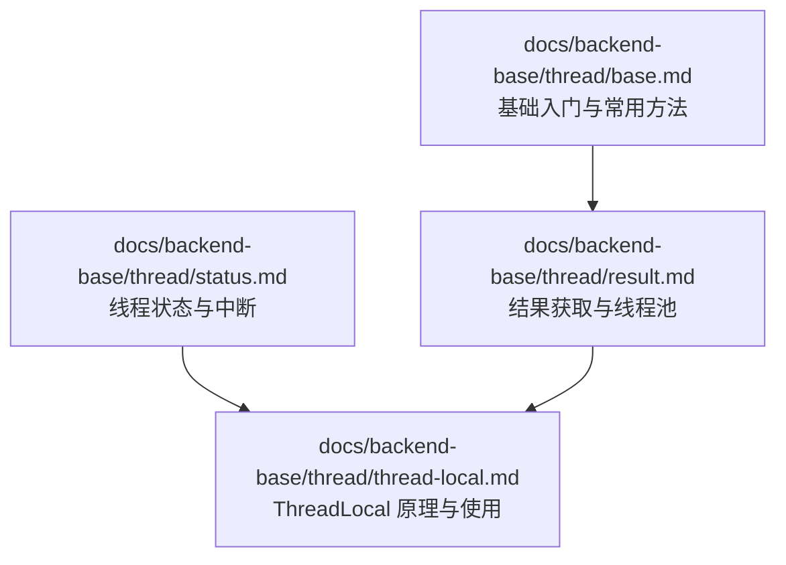

**图表来源**
- [docs/backend-base/thread/base.md](file://docs/backend-base/thread/base.md)
- [docs/backend-base/thread/result.md](file://docs/backend-base/thread/result.md)
- [docs/backend-base/thread/status.md](file://docs/backend-base/thread/status.md)
- [docs/backend-base/thread/thread-local.md](file://docs/backend-base/thread/thread-local.md)

**章节来源**
- [docs/backend-base/thread/base.md](file://docs/backend-base/thread/base.md)
- [docs/backend-base/thread/result.md](file://docs/backend-base/thread/result.md)
- [docs/backend-base/thread/status.md](file://docs/backend-base/thread/status.md)
- [docs/backend-base/thread/thread-local.md](file://docs/backend-base/thread/thread-local.md)

## 核心组件
- 进程与线程：进程是系统分配资源的最小单位，线程是系统执行任务的最小单元
- 并行与并发：并行指多个任务在多个 CPU 上同时进行；并发指多个任务在单个 CPU 上交替执行
- 三种创建线程方式：
  - 继承 Thread 类：重写 run()，通过 start() 启动
  - 实现 Runnable 接口：重写 run()，通过 Thread(Runnable) 构造并启动
  - 实现 Callable 接口：重写 call()，通过 FutureTask 包装后提交到线程池或直接启动，使用 Future/FutureTask 获取结果
- 线程池：使用 Executors.newFixedThreadPool(n) 创建固定大小线程池，通过 submit 提交任务
- 常用方法：start、run、sleep、setName、getName、currentThread、setPriority、getPriority、setDaemon、yield、join
- 线程安全：synchronized 同步代码块、非静态同步方法、静态同步方法
- 线程状态：NEW、RUNNABLE、BLOCKED、WAITING、TIMED_WAITING、TERMINATED
- ThreadLocal：线程本地变量，避免共享资源竞争

**章节来源**
- [docs/backend-base/thread/base.md](file://docs/backend-base/thread/base.md)
- [docs/backend-base/thread/result.md](file://docs/backend-base/thread/result.md)
- [docs/backend-base/thread/status.md](file://docs/backend-base/thread/status.md)
- [docs/backend-base/thread/thread-local.md](file://docs/backend-base/thread/thread-local.md)

## 架构总览
下图展示了线程创建与执行的整体流程，以及线程池与结果获取的关系：

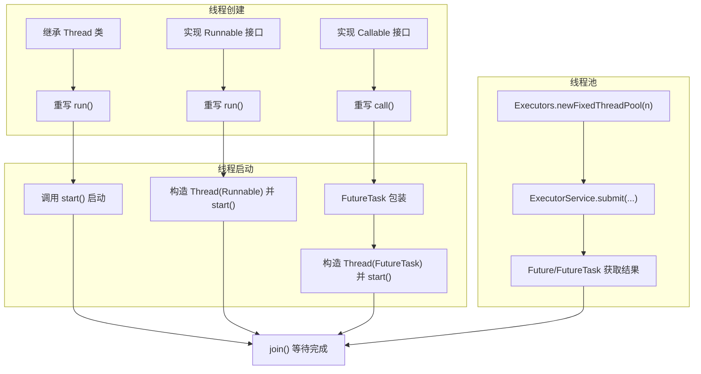

**图表来源**
- [docs/backend-base/thread/base.md](file://docs/backend-base/thread/base.md)
- [docs/backend-base/thread/result.md](file://docs/backend-base/thread/result.md)

## 详细组件分析

### 概念区分：进程、线程、并行、并发
- 进程：系统分配资源的最小单位
- 线程：系统执行任务的最小单元
- 并行：多个任务在多个 CPU 上同时进行
- 并发：多个任务在单个 CPU 上交替执行

这些概念是理解线程与线程池设计动机的基础，有助于选择合适的并发策略与资源管理方式。

**章节来源**
- [docs/backend-base/thread/base.md](file://docs/backend-base/thread/base.md)

### 创建线程的三种方式

#### 1) 继承 Thread 类
- 步骤：继承 Thread 并重写 run()；创建子类对象；调用 start() 启动
- 特点：简单直观，但 Java 不支持多继承，扩展性受限
- 适用场景：学习演示、轻量级任务

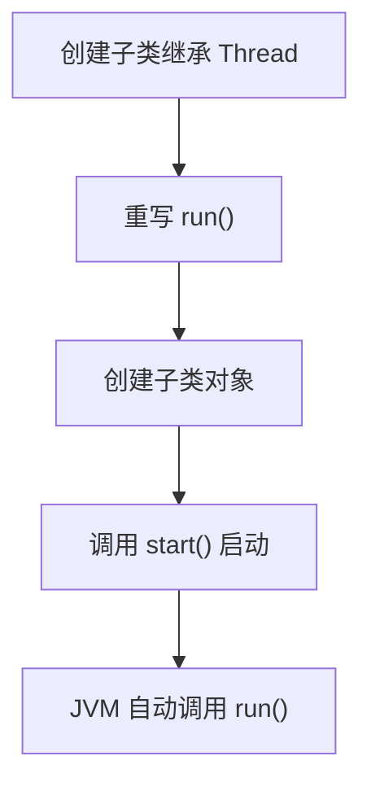

**图表来源**
- [docs/backend-base/thread/base.md](file://docs/backend-base/thread/base.md)

**章节来源**
- [docs/backend-base/thread/base.md](file://docs/backend-base/thread/base.md)

#### 2) 实现 Runnable 接口
- 步骤：实现 Runnable 并重写 run()；将实现类传入 Thread 构造；调用 start() 启动
- 特点：避免单继承限制，便于资源共享与复用
- 适用场景：大多数业务任务、线程池任务提交

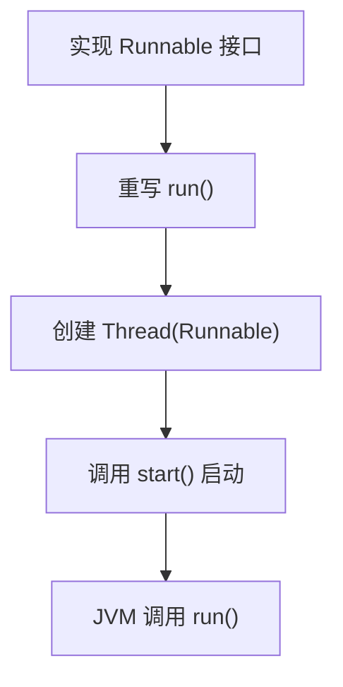

**图表来源**
- [docs/backend-base/thread/base.md](file://docs/backend-base/thread/base.md)

**章节来源**
- [docs/backend-base/thread/base.md](file://docs/backend-base/thread/base.md)

#### 3) 实现 Callable 接口
- 步骤：实现 Callable 并重写 call()；用 FutureTask 包装；构造 Thread 或提交到线程池；通过 Future/FutureTask 获取结果
- 特点：支持返回值、可抛出受检异常；与线程池结合使用更灵活
- 适用场景：需要获取执行结果的任务、批量异步任务

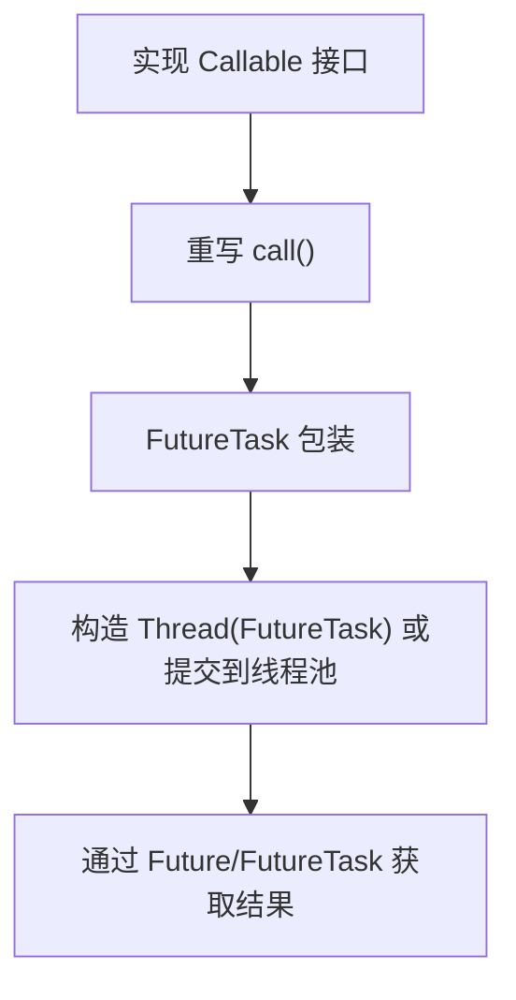

**图表来源**
- [docs/backend-base/thread/base.md](file://docs/backend-base/thread/base.md)
- [docs/backend-base/thread/result.md](file://docs/backend-base/thread/result.md)

**章节来源**
- [docs/backend-base/thread/base.md](file://docs/backend-base/thread/base.md)
- [docs/backend-base/thread/result.md](file://docs/backend-base/thread/result.md)

### 线程池与 FixedThreadPool
- 创建：使用 Executors.newFixedThreadPool(n) 创建固定大小线程池
- 提交：通过 ExecutorService.submit(...) 提交 Runnable 或 Callable 任务
- 结果：使用 Future/FutureTask 获取执行结果
- 生命周期：任务完成后线程复用；通过 shutdown() 关闭线程池

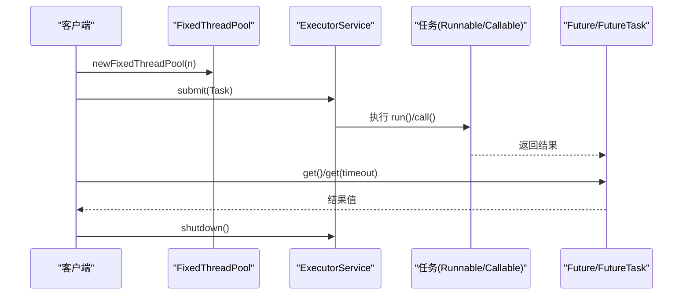

**图表来源**
- [docs/backend-base/thread/result.md](file://docs/backend-base/thread/result.md)

**章节来源**
- [docs/backend-base/thread/result.md](file://docs/backend-base/thread/result.md)

### 线程常用方法
- start()：启动线程，JVM 自动调用 run()
- run()：线程要执行的任务，不应手动调用
- sleep(long millis)：当前线程休眠指定时间
- setName(String)/getName()：设置/获取线程名称
- currentThread()：返回当前线程对象
- setPriority(int)/getPriority()：设置/获取线程优先级
- setDaemon(boolean)：设置守护线程
- yield()：让当前线程暂停，不释放锁
- join()：将线程插入到当前线程之前，等待其结束

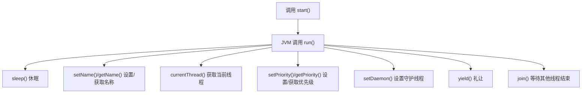

**图表来源**
- [docs/backend-base/thread/base.md](file://docs/backend-base/thread/base.md)

**章节来源**
- [docs/backend-base/thread/base.md](file://docs/backend-base/thread/base.md)

### 线程安全与同步
- synchronized 同步代码块：保证同一时刻只有一个线程进入临界区
- 非静态同步方法：默认锁对象为 this
- 静态同步方法：默认锁对象为类的 Class 对象

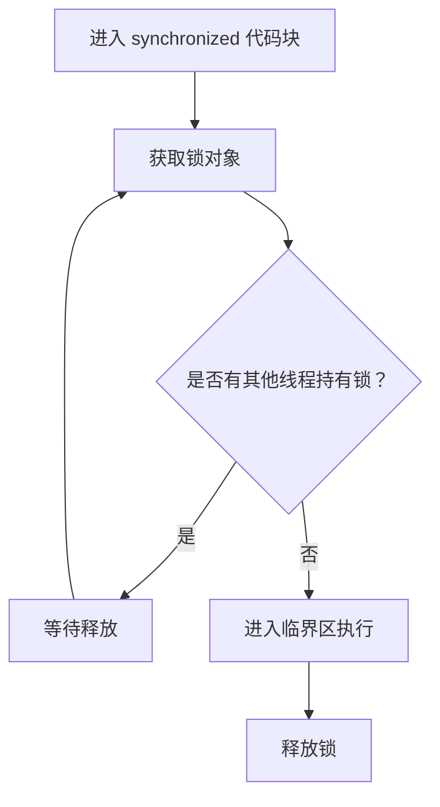

**图表来源**
- [docs/backend-base/thread/base.md](file://docs/backend-base/thread/base.md)

**章节来源**
- [docs/backend-base/thread/base.md](file://docs/backend-base/thread/base.md)

### 线程状态与转换
- NEW：线程对象创建后尚未调用 start()
- RUNNABLE：可运行/运行中（包含操作系统 ready 和 running）
- BLOCKED：等待锁释放
- WAITING：无限等待，需被其他线程唤醒
- TIMED_WAITING：限时等待，到达时间后自动唤醒
- TERMINATED：执行完毕或异常终止

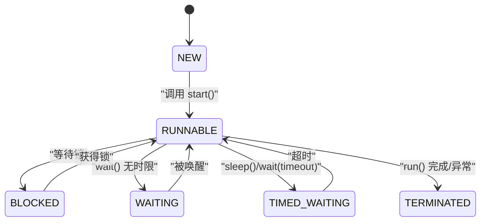

**图表来源**
- [docs/backend-base/thread/status.md](file://docs/backend-base/thread/status.md)

**章节来源**
- [docs/backend-base/thread/status.md](file://docs/backend-base/thread/status.md)

### 线程中断
- interrupt()：设置中断标志位
- isInterrupted()：测试当前线程是否被中断
- interrupted()：检测并清除中断状态
- 注意：中断不是强制停止，而是协作式通知

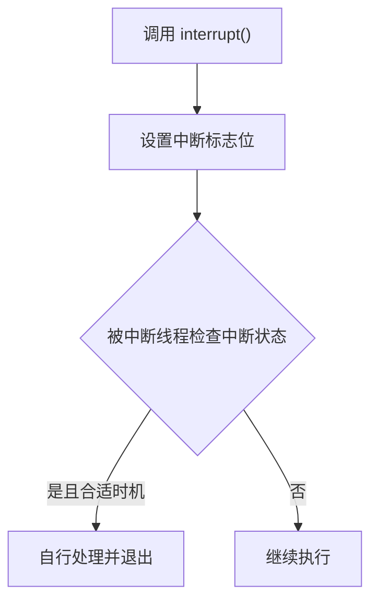

**图表来源**
- [docs/backend-base/thread/status.md](file://docs/backend-base/thread/status.md)

**章节来源**
- [docs/backend-base/thread/status.md](file://docs/backend-base/thread/status.md)

### ThreadLocal
- 作用：每个线程拥有独立副本，避免共享资源竞争
- 常见用途：保存用户登录信息、数据库连接、Session、事务上下文等
- 核心方法：set/get/remove

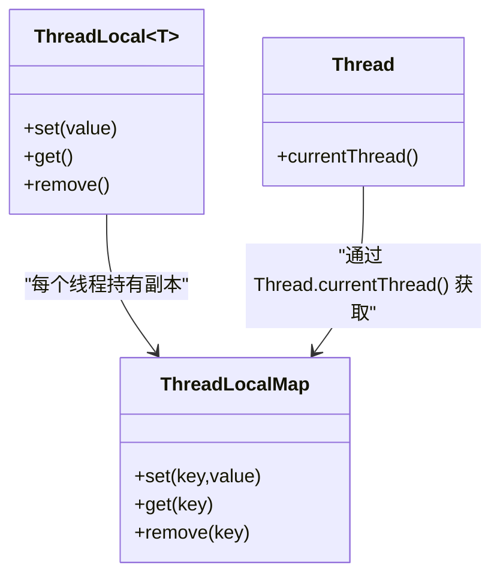

**图表来源**
- [docs/backend-base/thread/thread-local.md](file://docs/backend-base/thread/thread-local.md)

**章节来源**
- [docs/backend-base/thread/thread-local.md](file://docs/backend-base/thread/thread-local.md)

## 依赖关系分析
- 线程创建与启动依赖于 JVM 的线程调度与内存模型
- Callable 与 Future/FutureTask 的组合依赖于 java.util.concurrent 包
- 线程池依赖于 ExecutorService 接口及其实现类（如 ThreadPoolExecutor）
- 线程安全依赖于 synchronized 语义与锁对象的选择

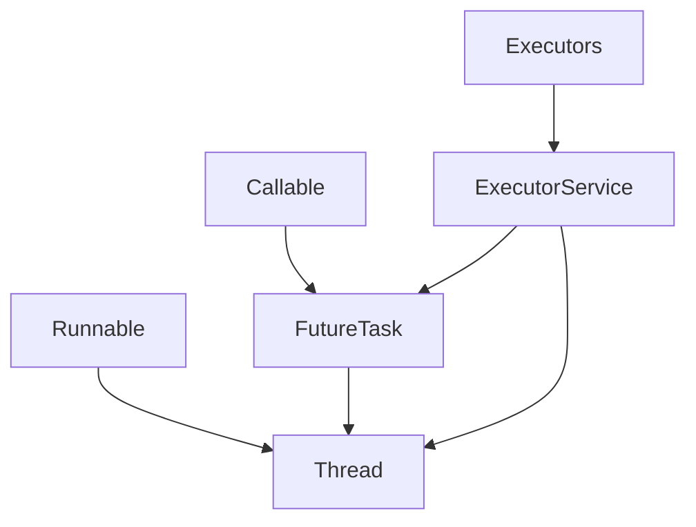

**图表来源**
- [docs/backend-base/thread/base.md](file://docs/backend-base/thread/base.md)
- [docs/backend-base/thread/result.md](file://docs/backend-base/thread/result.md)

**章节来源**
- [docs/backend-base/thread/base.md](file://docs/backend-base/thread/base.md)
- [docs/backend-base/thread/result.md](file://docs/backend-base/thread/result.md)

## 性能考量
- 优先使用实现 Runnable 或 Callable 的方式，避免继承 Thread 导致的扩展性问题
- 使用线程池统一管理线程数量，减少频繁创建销毁开销
- 合理设置线程池大小，避免过多线程导致上下文切换开销过大
- 在需要获取结果的场景使用 Future/FutureTask，避免共享变量带来的复杂度
- 控制同步范围，尽量缩小临界区，减少锁竞争

## 故障排查指南
- 线程重复启动：调用 start() 后再次调用会抛出非法状态异常
- 未正确获取结果：使用 Future/FutureTask 的 get() 会阻塞直到任务完成，注意超时与异常处理
- 死锁风险：synchronized 使用不当可能导致死锁，应确保锁顺序一致
- 守护线程影响：守护线程在非守护线程结束后会退出，注意清理逻辑
- 中断无效：线程需在合适位置检查中断状态并自行处理

**章节来源**
- [docs/backend-base/thread/base.md](file://docs/backend-base/thread/base.md)
- [docs/backend-base/thread/status.md](file://docs/backend-base/thread/status.md)

## 结论
通过本入门文档，读者应掌握进程与线程、并行与并发的基本概念，理解三种线程创建方式的差异与适用场景，学会使用线程池与结果获取机制，了解线程常用方法与线程安全、状态与中断等重要主题。建议在实践中优先采用实现接口的方式与线程池，结合 ThreadLocal 解决线程隔离需求，逐步提升并发编程能力。

## 附录
- 示例代码路径参考：
  - 继承 Thread 类示例：[docs/backend-base/thread/base.md](file://docs/backend-base/thread/base.md)
  - 实现 Runnable 接口示例：[docs/backend-base/thread/base.md](file://docs/backend-base/thread/base.md)
  - 实现 Callable 接口示例：[docs/backend-base/thread/base.md](file://docs/backend-base/thread/base.md)
  - 线程池与结果获取示例：[docs/backend-base/thread/result.md](file://docs/backend-base/thread/result.md)
  - 线程状态与转换示例：[docs/backend-base/thread/status.md](file://docs/backend-base/thread/status.md)
  - ThreadLocal 使用示例：[docs/backend-base/thread/thread-local.md](file://docs/backend-base/thread/thread-local.md)