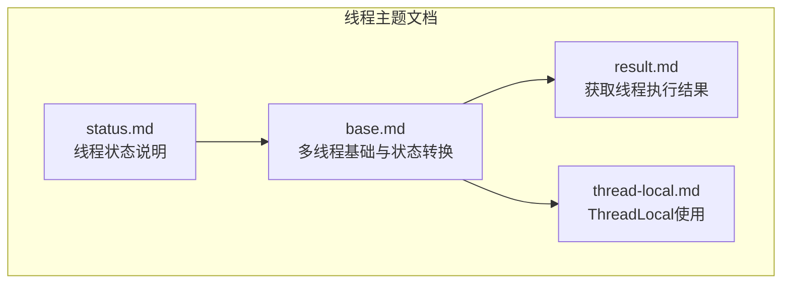
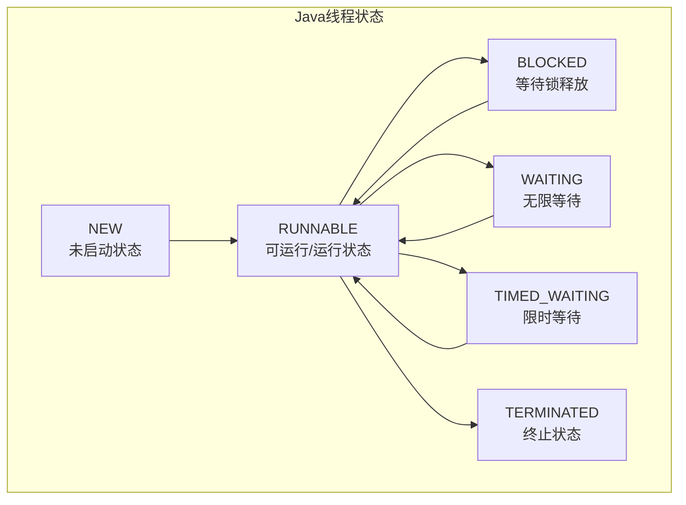
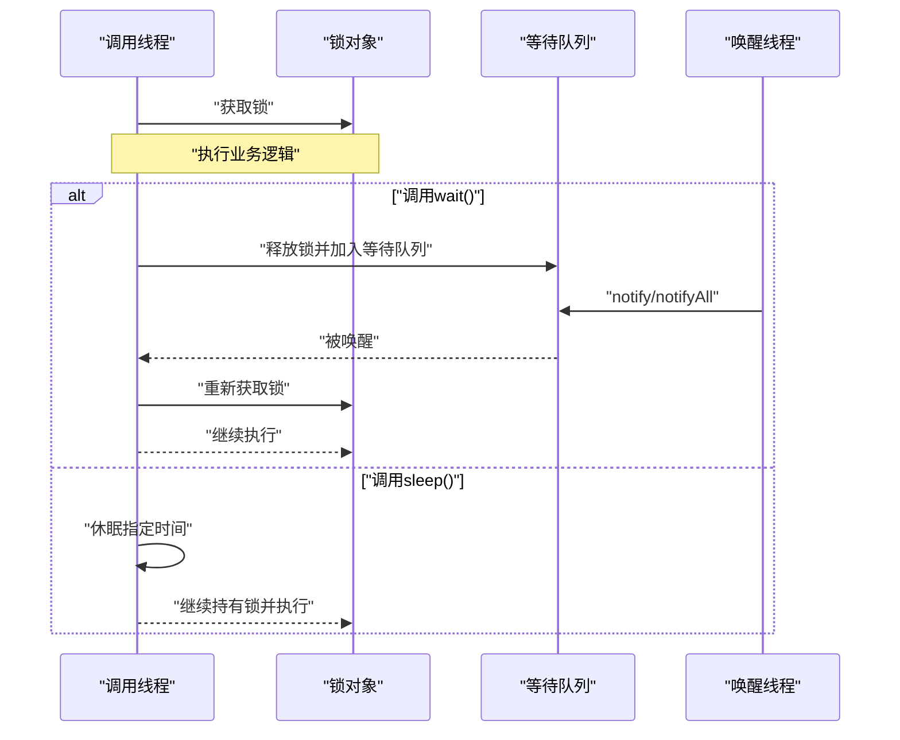
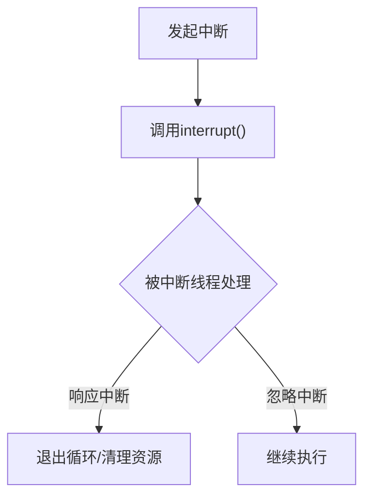
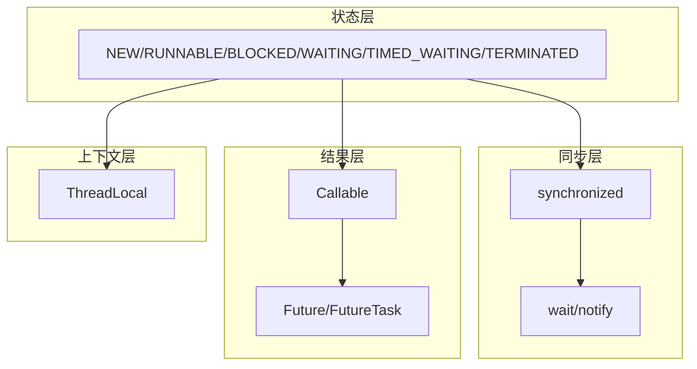

# 线程状态管理

<cite>
**本文档引用的文件**
- [status.md](file://docs/backend-base/thread/status.md)
- [base.md](file://docs/backend-base/thread/base.md)
- [result.md](file://docs/backend-base/thread/result.md)
- [thread-local.md](file://docs/backend-base/thread/thread-local.md)
</cite>

## 目录
1. [引言](#引言)
2. [项目结构](#项目结构)
3. [核心组件](#核心组件)
4. [架构概览](#架构概览)
5. [详细组件分析](#详细组件分析)
6. [依赖关系分析](#依赖关系分析)
7. [性能考虑](#性能考虑)
8. [故障排查指南](#故障排查指南)
9. [结论](#结论)
10. [附录](#附录)

## 引言
本技术文档围绕Java线程的六种状态管理展开，系统阐述new、runnable、blocked、waiting、timed_waiting、terminated的含义、触发条件与状态转换过程。文档结合仓库中的线程基础与状态说明内容，提供状态转换图与实际代码示例路径，并深入解析wait()与sleep()方法在锁释放行为上的差异。最后总结线程生命周期管理与状态监控的最佳实践，以及面向开发者的调试与问题诊断技巧。

## 项目结构
本仓库中与线程状态管理直接相关的文档位于docs/backend-base/thread目录，包含线程状态说明、多线程基础、结果获取与ThreadLocal等主题。这些文档共同构成了线程状态管理的知识体系。



**图表来源**
- [status.md:1-65](file://docs/backend-base/thread/status.md#L1-L65)
- [base.md:1-186](file://docs/backend-base/thread/base.md#L1-L186)
- [result.md:1-136](file://docs/backend-base/thread/result.md#L1-L136)
- [thread-local.md:1-75](file://docs/backend-base/thread/thread-local.md#L1-L75)

**章节来源**
- [status.md:1-65](file://docs/backend-base/thread/status.md#L1-L65)
- [base.md:1-186](file://docs/backend-base/thread/base.md#L1-L186)

## 核心组件
- 线程状态定义与转换：涵盖NEW、RUNNABLE、BLOCKED、WAITING、TIMED_WAITING、TERMINATED六种状态及其相互转换关系。
- 线程生命周期管理：从创建、启动、运行、阻塞、等待到终止的完整生命周期。
- 线程同步与锁：synchronized、wait/notify机制与锁对象的关系。
- 结果获取与任务管理：Callable/Future/FutureTask在多线程中的应用。
- 线程隔离与上下文：ThreadLocal在多线程环境下的使用场景与实现原理。

**章节来源**
- [status.md:9-44](file://docs/backend-base/thread/status.md#L9-L44)
- [base.md:172-186](file://docs/backend-base/thread/base.md#L172-L186)

## 架构概览
下图展示了线程状态管理在Java线程模型中的位置与关系，映射到仓库文档中的状态说明与基础概念。



**图表来源**
- [status.md:9-44](file://docs/backend-base/thread/status.md#L9-L44)
- [base.md:172-186](file://docs/backend-base/thread/base.md#L172-L186)

## 详细组件分析

### 线程状态详解与转换
- NEW：线程对象已创建但尚未调用start()方法。再次调用start会抛出非法状态异常；执行完毕后状态变为TERMINATED。
- RUNNABLE：线程在JVM中运行或等待CPU时间片。对应操作系统ready与running状态。
- BLOCKED：等待锁释放以进入同步区。
- WAITING：等待其他线程唤醒；需显式被唤醒才能回到RUNNABLE。
- TIMED_WAITING：等待指定时间后自动唤醒；常由sleep或带参wait触发。
- TERMINATED：run()执行完毕、异常终止或调用stop()后的最终状态。

```mermaid
flowchart TD
Start(["线程创建"]) --> NEW["NEW<br/>未启动"]
NEW --> |调用start()| RUNNABLE["RUNNABLE<br/>可运行/运行"]
RUNNABLE --> |竞争锁失败| BLOCKED["BLOCKED<br/>等待锁"]
RUNNABLE --> |调用wait()无参| WAITING["WAITING<br/>无限等待"]
RUNNABLE --> |调用sleep()/wait(timeout)| TIMED_WAITING["TIMED_WAITING<br/>限时等待"]
BLOCKED --> |获得锁| RUNNABLE
WAITING --> |被notify/notifyAll| RUNNABLE
TIMED_WAITING --> |时间到| RUNNABLE
RUNNABLE --> |run()结束/异常| TERMINATED["TERMINATED<br/>终止"]
```

**图表来源**
- [status.md:9-44](file://docs/backend-base/thread/status.md#L9-L44)
- [base.md:172-186](file://docs/backend-base/thread/base.md#L172-L186)

**章节来源**
- [status.md:9-44](file://docs/backend-base/thread/status.md#L9-L44)
- [base.md:172-186](file://docs/backend-base/thread/base.md#L172-L186)

### wait()与sleep()方法对比
- wait()：释放锁，进入等待队列，需被其他线程notify/notifyAll唤醒后重新获取锁再继续执行。
- sleep()：不释放锁，仅让当前线程休眠指定时间，时间到后继续持有锁执行。
- 二者区别：wait()用于线程间协作与同步，sleep()用于线程自身延时。



**图表来源**
- [base.md:181-183](file://docs/backend-base/thread/base.md#L181-L183)

**章节来源**
- [base.md:181-183](file://docs/backend-base/thread/base.md#L181-L183)

### 线程中断机制
- interrupt()：设置目标线程的中断标志位，不强制停止线程。
- isInterrupted()：测试当前线程是否被中断。
- interrupted()：检测并清除当前线程的中断标志位。
- 中断是协作式机制，具体如何处理由被中断线程决定。



**图表来源**
- [status.md:52-65](file://docs/backend-base/thread/status.md#L52-L65)

**章节来源**
- [status.md:52-65](file://docs/backend-base/thread/status.md#L52-L65)

### 线程生命周期管理与最佳实践
- 生命周期阶段：创建(new) → 启动(start) → 运行(runnable) → 阻塞(blocked/waiting/timed_waiting) → 终止(terminated)。
- 最佳实践：
  - 明确区分sleep与wait：sleep用于延时，wait用于协作等待。
  - 正确使用synchronized与wait/notify：确保锁对象一致且在同步块内调用。
  - 避免使用过时的stop()，采用中断与优雅关闭策略。
  - 在finally中释放资源，防止死锁与资源泄漏。
  - 使用线程池管理线程，控制并发度与资源消耗。

**章节来源**
- [base.md:124-186](file://docs/backend-base/thread/base.md#L124-L186)
- [status.md:52-65](file://docs/backend-base/thread/status.md#L52-L65)

### 状态监控与调试技巧
- 使用Thread.getState()观察线程状态变化，结合日志定位阻塞点。
- 识别BLOCKED与WAITING/TIMED_WAITING：BLOCKED通常由锁竞争引起，WAITING/TIMED_WAITING由wait/sleep引起。
- 检查中断标志位：isInterrupted()与interrupted()的使用差异，避免误判。
- 使用ThreadLocal隔离上下文：在多线程环境中避免共享状态冲突。
- 通过Future/FutureTask获取任务结果与异常，便于问题定位。

**章节来源**
- [base.md:110-123](file://docs/backend-base/thread/base.md#L110-L123)
- [result.md:73-95](file://docs/backend-base/thread/result.md#L73-L95)
- [thread-local.md:1-75](file://docs/backend-base/thread/thread-local.md#L1-L75)

## 依赖关系分析
线程状态管理涉及多个层面的依赖关系：
- 状态定义依赖于Java线程模型与JVM调度。
- 同步机制依赖于synchronized与wait/notify语义。
- 结果获取依赖于Future/FutureTask与线程池。
- 上下文隔离依赖于ThreadLocal的线程本地存储。



**图表来源**
- [base.md:124-186](file://docs/backend-base/thread/base.md#L124-L186)
- [result.md:7-95](file://docs/backend-base/thread/result.md#L7-L95)
- [thread-local.md:1-75](file://docs/backend-base/thread/thread-local.md#L1-L75)

**章节来源**
- [base.md:124-186](file://docs/backend-base/thread/base.md#L124-L186)
- [result.md:7-95](file://docs/backend-base/thread/result.md#L7-L95)
- [thread-local.md:1-75](file://docs/backend-base/thread/thread-local.md#L1-L75)

## 性能考虑
- 减少不必要的阻塞：合理设计锁粒度，避免长临界区。
- 控制等待时间：使用timed_wait减少无限等待风险。
- 线程池优化：根据任务类型选择合适线程池与队列策略。
- 避免频繁创建销毁线程：复用线程池中的线程。
- 监控与采样：定期检查线程状态与堆栈，及时发现热点与瓶颈。

## 故障排查指南
- BLOCKED高发：检查锁竞争与死锁，使用工具采集线程堆栈。
- WAITING/TIMED_WAITING异常：确认wait/notify配对与超时设置是否正确。
- 中断无效：核对isInterrupted/interrupted使用，确保在可中断点处理中断。
- 结果获取阻塞：检查Future.get()超时与异常传播。
- ThreadLocal内存泄漏：在任务完成后调用remove()清理。

**章节来源**
- [base.md:110-123](file://docs/backend-base/thread/base.md#L110-L123)
- [result.md:73-95](file://docs/backend-base/thread/result.md#L73-L95)
- [thread-local.md:53-65](file://docs/backend-base/thread/thread-local.md#L53-L65)

## 结论
线程状态管理是Java并发编程的核心基础。通过明确六种状态的含义与转换条件，正确区分wait与sleep的行为差异，配合synchronized与Future等机制，可以有效提升线程安全性与可维护性。遵循最佳实践与调试技巧，能够快速定位并解决线程相关问题，保障系统的稳定运行。

## 附录
- 状态转换图参考：见仓库文档中的线程状态转换图与方法关系图。
- 示例代码路径参考：见各主题文档中的代码片段路径标注。

**章节来源**
- [status.md:46-50](file://docs/backend-base/thread/status.md#L46-L50)
- [base.md:185-186](file://docs/backend-base/thread/base.md#L185-L186)