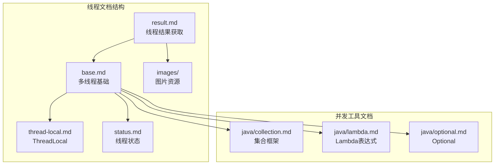
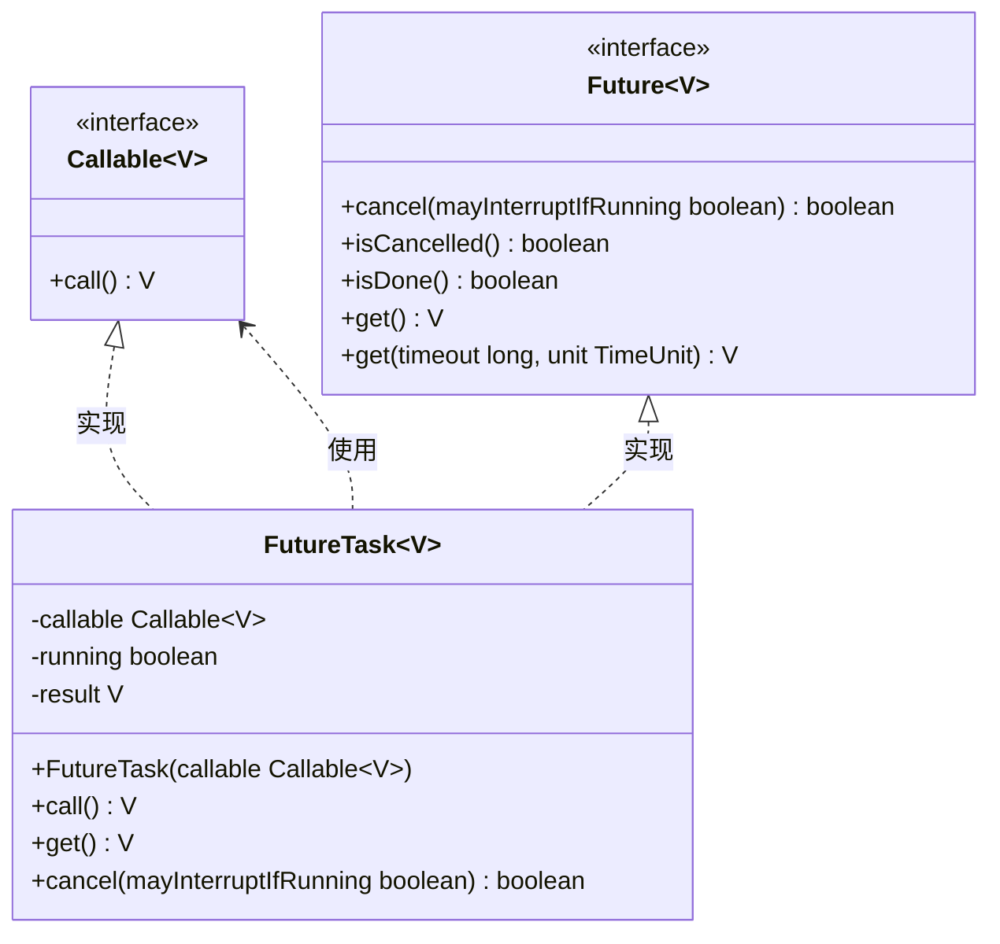
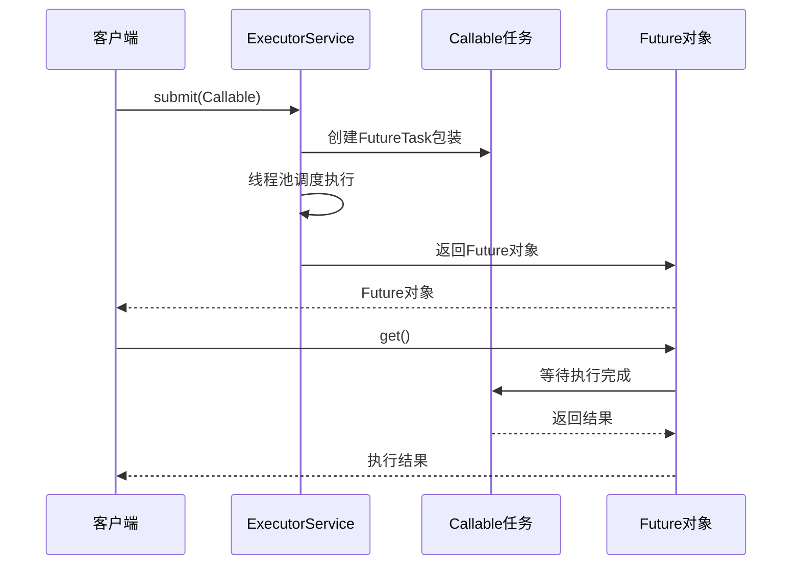
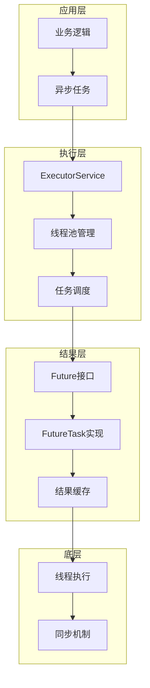
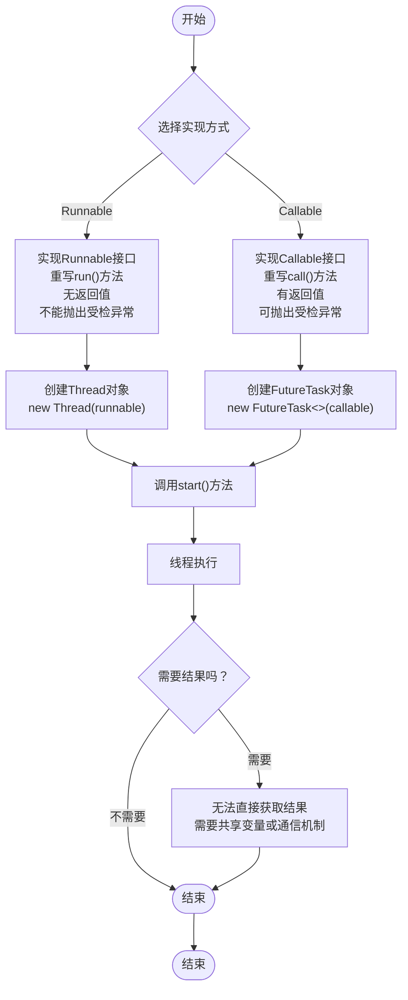
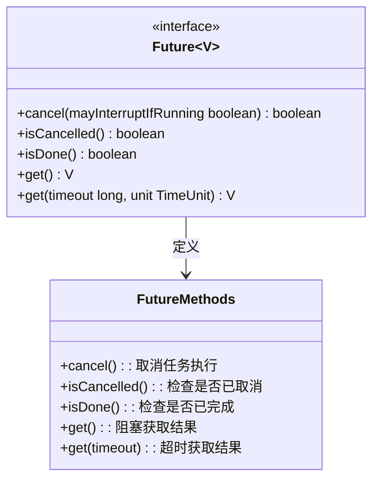
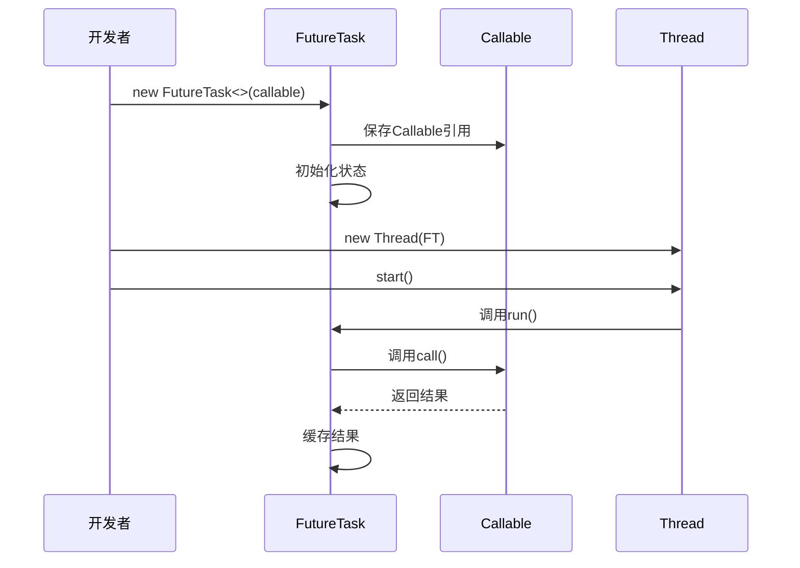
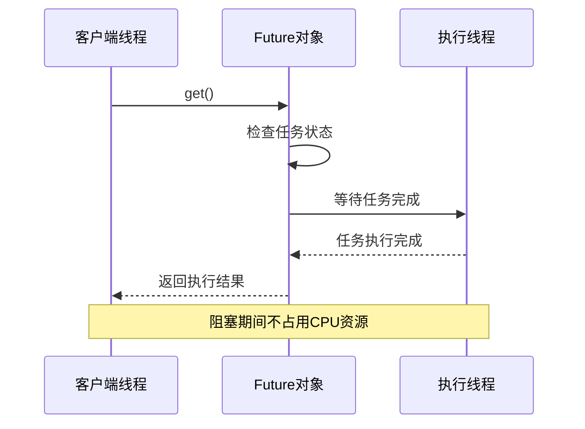
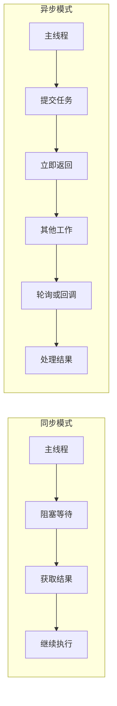
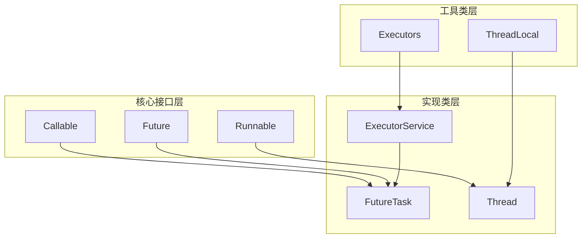

# 线程结果获取

<cite>
**本文档引用的文件**
- [result.md](file://docs/backend-base/thread/result.md)
- [base.md](file://docs/backend-base/thread/base.md)
- [thread-local.md](file://docs/backend-base/thread/thread-local.md)
</cite>

## 目录
1. [简介](#简介)
2. [项目结构](#项目结构)
3. [核心组件](#核心组件)
4. [架构概览](#架构概览)
5. [详细组件分析](#详细组件分析)
6. [依赖关系分析](#依赖关系分析)
7. [性能考虑](#性能考虑)
8. [故障排除指南](#故障排除指南)
9. [结论](#结论)

## 简介

本技术文档深入探讨Java多线程环境中获取线程执行结果的机制，重点讲解Future和FutureTask的作用与使用方法，详细对比Callable接口与Runnable接口的区别，并提供FutureTask的完整使用流程。文档涵盖了get()方法的阻塞特性与异常处理、超时获取结果的场景与实现方法，以及异步编程模式和回调机制的实现策略。

## 项目结构

该项目采用分层文档组织方式，线程相关的内容主要集中在`docs/backend-base/thread/`目录下：



**图表来源**
- [result.md:1-136](file://docs/backend-base/thread/result.md#L1-L136)
- [base.md:1-186](file://docs/backend-base/thread/base.md#L1-L186)

**章节来源**
- [result.md:1-136](file://docs/backend-base/thread/result.md#L1-L136)
- [base.md:1-186](file://docs/backend-base/thread/base.md#L1-L186)

## 核心组件

### Callable接口
Callable是Java 1.5引入的函数式接口，专门用于需要返回值的异步任务：



**图表来源**
- [result.md:7-15](file://docs/backend-base/thread/result.md#L7-L15)
- [result.md:73-86](file://docs/backend-base/thread/result.md#L73-L86)
- [result.md:98-103](file://docs/backend-base/thread/result.md#L98-L103)

### ExecutorService线程池
ExecutorService提供了统一的线程池管理接口，支持异步任务执行：



**图表来源**
- [result.md:23-49](file://docs/backend-base/thread/result.md#L23-L49)
- [result.md:104-135](file://docs/backend-base/thread/result.md#L104-L135)

**章节来源**
- [result.md:7-15](file://docs/backend-base/thread/result.md#L7-L15)
- [result.md:73-86](file://docs/backend-base/thread/result.md#L73-L86)
- [result.md:98-103](file://docs/backend-base/thread/result.md#L98-L103)

## 架构概览

Java线程结果获取机制的整体架构由三个核心层次组成：



**图表来源**
- [result.md:17-21](file://docs/backend-base/thread/result.md#L17-L21)
- [result.md:73-86](file://docs/backend-base/thread/result.md#L73-L86)
- [result.md:98-103](file://docs/backend-base/thread/result.md#L98-L103)

## 详细组件分析

### Callable与Runnable的区别

#### 基础差异对比

| 特性 | Runnable | Callable |
|------|----------|----------|
| 返回值 | void | V（泛型） |
| 异常处理 | 不能抛出受检异常 | 可以抛出Exception |
| 线程池集成 | submit(Runnable) | submit(Callable) |
| 结果获取 | 无法直接获取 | 通过Future.get() |

#### 代码实现差异



**图表来源**
- [base.md:69-103](file://docs/backend-base/thread/base.md#L69-L103)

#### call()方法的优势

1. **返回值支持**：call()方法可以返回任意类型的值，解决了Thread和Runnable无法获取执行结果的问题
2. **异常处理能力**：call()方法可以声明抛出Exception，便于处理各种异常情况
3. **与线程池完美集成**：与ExecutorService配合使用，提供更好的异步编程体验

**章节来源**
- [base.md:77-79](file://docs/backend-base/thread/base.md#L77-L79)
- [base.md:81-103](file://docs/backend-base/thread/base.md#L81-L103)

### Future接口详解

#### 核心方法分析

Future接口提供了以下五个关键方法：



**图表来源**
- [result.md:77-86](file://docs/backend-base/thread/result.md#L77-L86)

#### 方法行为详解

1. **cancel()方法**：用于取消尚未执行或正在执行的任务
2. **isCancelled()方法**：检查任务是否成功取消
3. **isDone()方法**：判断任务是否已完成
4. **get()方法**：阻塞式获取执行结果
5. **get(timeout, unit)方法**：带超时的获取结果

**章节来源**
- [result.md:88-96](file://docs/backend-base/thread/result.md#L88-L96)

### FutureTask完整使用流程

#### 创建阶段



**图表来源**
- [result.md:104-135](file://docs/backend-base/thread/result.md#L104-L135)
- [base.md:69-75](file://docs/backend-base/thread/base.md#L69-L75)

#### 启动阶段

FutureTask实现了Runnable和Future接口，具有双重身份：

1. **作为Runnable**：可以被Thread直接执行
2. **作为Future**：可以获取执行结果和状态信息

#### 获取结果阶段

```mermaid
flowchart TD
A[调用get()] --> B{任务是否完成}
B --> |已完成| C[直接返回结果]
B --> |未完成| D[当前线程阻塞等待]
D --> E{任务完成或超时}
E --> |完成| F[返回结果]
E --> |超时| G[抛出TimeoutException]
C --> H[返回结果]
F --> H
G --> I[异常处理]
H --> J[结束]
I --> J
```

**图表来源**
- [result.md:93-94](file://docs/backend-base/thread/result.md#L93-L94)

**章节来源**
- [result.md:104-135](file://docs/backend-base/thread/result.md#L104-L135)
- [base.md:69-75](file://docs/backend-base/thread/base.md#L69-L75)

### get()方法的阻塞特性与异常处理

#### 阻塞机制

get()方法采用阻塞式设计，确保调用线程在任务完成前不会继续执行：



**图表来源**
- [result.md:93](file://docs/backend-base/thread/result.md#L93)

#### 异常处理策略

get()方法可能抛出以下异常：

1. **InterruptedException**：线程在等待过程中被中断
2. **ExecutionException**：任务执行过程中抛出异常
3. **TimeoutException**：超时获取结果时抛出

**章节来源**
- [result.md:93-94](file://docs/backend-base/thread/result.md#L93-L94)

### 超时获取结果的实现

#### 超时机制设计

```mermaid
flowchart TD
A[调用get(timeout, unit)] --> B{任务是否完成}
B --> |已完成| C[立即返回结果]
B --> |未完成| D[设置超时计时器]
D --> E{等待任务完成}
E --> |任务完成| F[返回结果]
E --> |超时| G[抛出TimeoutException]
C --> H[正常结束]
F --> H
G --> I[异常结束]
H --> J[结束]
I --> J
```

**图表来源**
- [result.md:83-84](file://docs/backend-base/thread/result.md#L83-L84)

#### 实际应用场景

超时获取适用于以下场景：

1. **响应时间限制**：防止长时间等待
2. **资源保护**：避免线程长期阻塞
3. **用户体验**：提供及时的反馈信息

**章节来源**
- [result.md:83-84](file://docs/backend-base/thread/result.md#L83-L84)

### 异步编程模式与回调机制

#### 传统异步模式



#### 回调机制实现

虽然原始文档主要介绍了Future模式，但现代Java还支持其他异步编程方式：

1. **CompletableFuture**：Java 8引入的高级异步编程工具
2. **回调函数**：通过接口或Lambda表达式实现
3. **事件驱动**：基于事件监听器的异步处理

**章节来源**
- [result.md:23-49](file://docs/backend-base/thread/result.md#L23-L49)

## 依赖关系分析

### 组件间依赖关系



**图表来源**
- [result.md:7-15](file://docs/backend-base/thread/result.md#L7-L15)
- [result.md:73-86](file://docs/backend-base/thread/result.md#L73-L86)
- [result.md:98-103](file://docs/backend-base/thread/result.md#L98-L103)

### 复杂度分析

| 操作 | 时间复杂度 | 空间复杂度 | 说明 |
|------|------------|------------|------|
| 创建FutureTask | O(1) | O(1) | 初始化对象引用 |
| 提交任务到线程池 | O(1) | O(1) | 线程池调度开销 |
| 获取结果 | O(1) | O(1) | 阻塞等待直到完成 |
| 取消任务 | O(1) | O(1) | 状态检查和中断 |

**章节来源**
- [result.md:77-86](file://docs/backend-base/thread/result.md#L77-L86)
- [result.md:98-103](file://docs/backend-base/thread/result.md#L98-L103)

## 性能考虑

### 线程池优化策略

1. **合理配置线程数量**：根据CPU核心数和任务类型确定最佳线程数
2. **任务队列管理**：控制任务队列长度，避免内存溢出
3. **超时机制**：设置合理的超时时间，防止长时间阻塞

### 内存管理

FutureTask会缓存执行结果，在任务完成后仍占用内存空间。对于大量短期任务，需要考虑内存回收策略。

### 并发安全性

- FutureTask内部使用原子操作保证线程安全
- 结果缓存机制避免重复计算
- 取消操作需要考虑中断状态的传播

## 故障排除指南

### 常见问题及解决方案

#### 1. 线程死锁问题

**症状**：程序长时间无响应
**原因**：多个线程相互等待对方释放锁
**解决**：使用超时机制和合理的锁粒度

#### 2. 内存泄漏

**症状**：内存使用持续增长
**原因**：FutureTask对象未正确清理
**解决**：及时调用cancel()方法或使用弱引用

#### 3. 异常处理不当

**症状**：异常信息丢失
**原因**：未正确捕获ExecutionException
**解决**：完善异常处理逻辑

**章节来源**
- [result.md:93-94](file://docs/backend-base/thread/result.md#L93-L94)

### 调试技巧

1. **监控线程状态**：使用ThreadMXBean监控线程执行状态
2. **日志记录**：在关键节点添加详细日志
3. **性能分析**：使用JProfiler等工具分析性能瓶颈

## 结论

Java线程结果获取机制通过Future和FutureTask提供了强大而灵活的异步编程能力。相比传统的Thread和Runnable，Callable+Future的组合解决了无法获取执行结果的根本问题，为复杂的异步任务处理提供了标准化的解决方案。

### 主要优势

1. **结果获取**：通过Future.get()方法直接获取执行结果
2. **异常处理**：完善的异常处理机制，包括超时和中断
3. **线程池集成**：与ExecutorService无缝集成，提供更好的资源管理
4. **类型安全**：泛型支持确保类型安全

### 最佳实践建议

1. **优先使用Callable**：对于需要返回值的任务，优先选择Callable而非Runnable
2. **合理设置超时**：为重要的异步操作设置合理的超时时间
3. **完善异常处理**：确保异常情况下的优雅降级
4. **及时清理资源**：合理管理FutureTask对象的生命周期

通过深入理解这些机制，开发者可以构建更加健壮和高效的异步应用程序，满足现代软件开发对高性能和高可用性的要求。