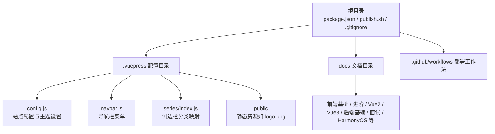
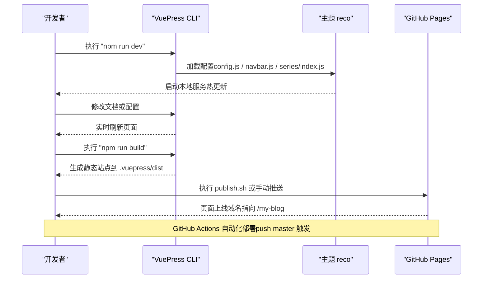
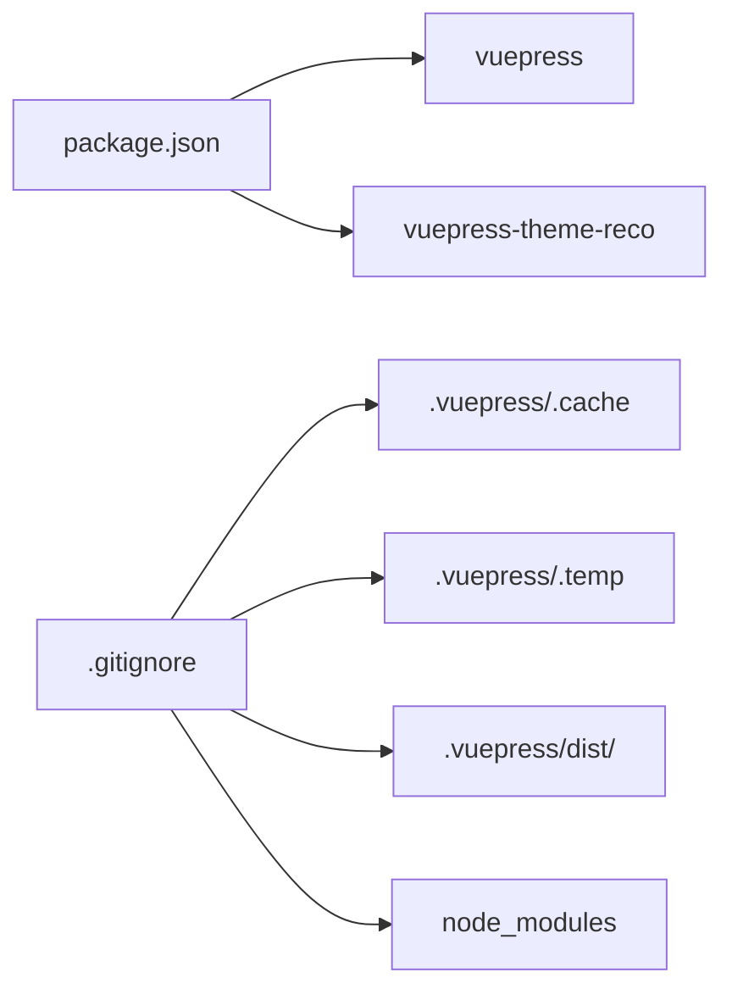

# 快速开始

<cite>
**本文引用的文件**
- [package.json](file://package.json)
- [.vuepress\config.js](file://.vuepress/config.js)
- [.vuepress\navbar.js](file://.vuepress/navbar.js)
- [.vuepress\series\index.js](file://.vuepress/series/index.js)
- [.github\workflows\deploy.yml](file://.github/workflows/deploy.yml)
- [publish.sh](file://publish.sh)
- [.gitignore](file://.gitignore)
- [README.md](file://README.md)
- [docs\frontend-base\javascript\grammar.md](file://docs/frontend-base/javascript/grammar.md)
- [docs\backend-base\java\DOS.md](file://docs/backend-base/java/DOS.md)
</cite>

## 目录
1. [简介](#简介)
2. [项目结构](#项目结构)
3. [核心组件](#核心组件)
4. [架构总览](#架构总览)
5. [详细组件分析](#详细组件分析)
6. [依赖分析](#依赖分析)
7. [性能考虑](#性能考虑)
8. [故障排除指南](#故障排除指南)
9. [结论](#结论)
10. [附录](#附录)

## 简介
本指南面向初学者，帮助你在本地快速搭建并运行这个基于 VuePress 的技术博客项目。你将学到：
- 环境要求（Node.js 版本、包管理器）
- 依赖安装与本地开发服务器启动
- 项目目录结构与关键配置文件的作用
- 常用命令（开发、构建、部署）
- 启动流程与基本操作
- 常见环境问题排查与解决方案

## 项目结构
该项目采用 VuePress 2 + 主题 reco 的结构，核心目录与职责如下：
- 根目录：项目入口与脚本
  - package.json：项目元信息、脚本命令、依赖
  - publish.sh：一键构建并推送至 GitHub Pages 的自动化脚本
  - .gitignore：忽略缓存、dist、node_modules 等
  - README.md：首页占位与模块配置（可选）
- .vuepress 目录：VuePress 配置与主题资源
  - config.js：站点标题、描述、基础路径、主题配置
  - navbar.js：导航栏菜单结构
  - series/index.js：侧边栏分类映射
  - public：静态资源（如 logo.png）
- docs 目录：所有文档内容，按主题分类组织
- .github/workflows/deploy.yml：GitHub Actions 自动化部署到 GitHub Pages

图表来源
- [.vuepress\config.js:1-18](file://.vuepress/config.js#L1-L18)
- [.vuepress\navbar.js:1-142](file://.vuepress/navbar.js#L1-L142)
- [.vuepress\series\index.js:1-58](file://.vuepress/series/index.js#L1-L58)

章节来源
- [.vuepress\config.js:1-18](file://.vuepress/config.js#L1-L18)
- [.vuepress\navbar.js:1-142](file://.vuepress/navbar.js#L1-L142)
- [.vuepress\series\index.js:1-58](file://.vuepress/series/index.js#L1-L58)
- [package.json:1-17](file://package.json#L1-L17)
- [.gitignore:1-8](file://.gitignore#L1-L8)

## 核心组件
- 站点配置（.vuepress/config.js）
  - 设置站点标题、描述、图标、基础路径（base）
  - 加载主题 reco 并传入样式、颜色模式、侧边栏与导航栏配置
- 导航栏（.vuepress/navbar.js）
  - 定义顶部导航菜单项与子菜单，覆盖软件基础、前端基础/进阶、Vue2/Vue3、React18、后端基础、面试、工具等
- 侧边栏映射（.vuepress/series/index.js）
  - 将 docs 下的路径与对应侧边栏配置关联，便于主题自动渲染
- 构建与脚本（package.json）
  - 提供 dev/start/build 三个常用命令，分别用于开发、启动与构建
- 自动化部署（.github/workflows/deploy.yml）
  - 在推送到 master 时自动安装依赖、构建并发布到 GitHub Pages 的 page 分支
- 本地一键发布（publish.sh）
  - 本地构建后，将 dist 推送至 GitHub Pages 对应分支，并提交主仓库更新

章节来源
- [.vuepress\config.js:1-18](file://.vuepress/config.js#L1-L18)
- [.vuepress\navbar.js:1-142](file://.vuepress/navbar.js#L1-L142)
- [.vuepress\series\index.js:1-58](file://.vuepress/series/index.js#L1-L58)
- [package.json:8-12](file://package.json#L8-L12)
- [.github\workflows\deploy.yml:1-36](file://.github/workflows/deploy.yml#L1-L36)
- [publish.sh:1-20](file://publish.sh#L1-L20)

## 架构总览
从本地开发到线上发布的整体流程如下：

图表来源
- [package.json:8-12](file://package.json#L8-L12)
- [.vuepress\config.js:1-18](file://.vuepress/config.js#L1-L18)
- [.github\workflows\deploy.yml:1-36](file://.github/workflows/deploy.yml#L1-L36)
- [publish.sh:1-20](file://publish.sh#L1-L20)

## 详细组件分析

### 环境要求与安装
- Node.js 版本
  - GitHub Actions 工作流中使用 Node.js 16.x，建议本地也使用相同或兼容版本（如 16.x/18.x/20.x）以避免依赖差异
- 包管理器选择
  - 支持 npm、yarn、pnpm。推荐使用与团队一致的包管理器，避免 lock 文件冲突
- 依赖安装
  - 安装命令：npm install（或 yarn / pnpm）
  - 依赖包含 VuePress 2 与主题 reco

章节来源
- [.github\workflows\deploy.yml:20-24](file://.github/workflows/deploy.yml#L20-L24)
- [package.json:13-16](file://package.json#L13-L16)

### 本地开发与启动
- 启动开发服务器
  - 命令：npm run dev 或 npm start
  - 功能：启动本地服务，自动监听文件变化并热更新
- 构建静态站点
  - 命令：npm run build
  - 输出：.vuepress/dist 目录
- 本地预览构建产物
  - 可使用任意静态服务器预览 .vuepress/dist 内容

章节来源
- [package.json:8-12](file://package.json#L8-L12)
- [.gitignore:1-8](file://.gitignore#L1-L8)

### 关键配置文件详解
- 站点配置（.vuepress/config.js）
  - title/description：站点标题与描述
  - logo：站点图标（需位于 .vuepress/public）
  - base：部署基础路径（如 /my-blog/）
  - theme：加载主题 reco，传入样式、颜色模式、侧边栏与导航栏配置
- 导航栏（.vuepress/navbar.js）
  - 定义多级菜单，覆盖前端、后端、面试、工具等板块
  - 子菜单 link 指向 docs 下的具体路径
- 侧边栏映射（.vuepress/series/index.js）
  - 将 docs 下的路径前缀映射到对应的侧边栏配置对象
  - 便于主题按分类自动渲染侧边栏
- 首页占位（README.md）
  - 作为首页模块占位，可配置 BannerBrand、MdContent 等模块

章节来源
- [.vuepress\config.js:1-18](file://.vuepress/config.js#L1-L18)
- [.vuepress\navbar.js:1-142](file://.vuepress/navbar.js#L1-L142)
- [.vuepress\series\index.js:1-58](file://.vuepress/series/index.js#L1-L58)
- [README.md:1-12](file://README.md#L1-L12)

### 目录结构与文档组织
- docs 目录按主题划分，如前端基础、前端进阶、Vue2/Vue3、后端基础、面试、HarmonyOS 等
- 文档采用 Markdown 格式，支持标题、列表、代码块、图片等
- 示例文档：
  - docs/frontend-base/javascript/grammar.md：前端基础语法
  - docs/backend-base/java/DOS.md：常用 DOS 命令

章节来源
- [docs\frontend-base\javascript\grammar.md:1-10](file://docs/frontend-base/javascript/grammar.md#L1-L10)
- [docs\backend-base\java\DOS.md:1-10](file://docs/backend-base/java/DOS.md#L1-L10)

### 常用命令与使用说明
- 开发模式
  - npm run dev 或 npm start：启动本地开发服务器
- 构建模式
  - npm run build：生成静态站点到 .vuepress/dist
- 部署流程
  - 本地一键发布：bash publish.sh（会自动构建并推送）
  - GitHub Actions：推送到 master 分支自动触发构建与部署（page 分支）
  - 手动部署：将 .vuepress/dist 内容部署到 GitHub Pages

章节来源
- [package.json:8-12](file://package.json#L8-L12)
- [publish.sh:1-20](file://publish.sh#L1-L20)
- [.github\workflows\deploy.yml:1-36](file://.github/workflows/deploy.yml#L1-L36)

### 启动流程与基本操作
- 启动流程
  - 安装依赖 → 启动开发服务器 → 编辑 docs 中的 Markdown → 实时预览 → 构建 → 部署
- 基本操作
  - 新增文档：在 docs 下新建 Markdown 文件，按主题分类放置
  - 更新导航：修改 .vuepress/navbar.js，添加或调整菜单项
  - 更新侧边栏：在 .vuepress/series/index.js 中新增路径映射
  - 部署：执行 npm run build 或 publish.sh，或等待 GitHub Actions 自动部署

章节来源
- [.vuepress\navbar.js:1-142](file://.vuepress/navbar.js#L1-L142)
- [.vuepress\series\index.js:1-58](file://.vuepress/series/index.js#L1-L58)
- [publish.sh:1-20](file://publish.sh#L1-L20)
- [.github\workflows\deploy.yml:1-36](file://.github/workflows/deploy.yml#L1-L36)

## 依赖分析
- 运行时依赖
  - vuepress：2.0.0-beta.60
  - vuepress-theme-reco：2.0.0-beta.53
- 开发与脚本
  - 通过 package.json 的 scripts 统一管理命令
- 忽略项
  - .gitignore 忽略 .vuepress/.cache、.vuepress/.temp、.vuepress/dist、node_modules 等

图表来源
- [package.json:13-16](file://package.json#L13-L16)
- [.gitignore:1-8](file://.gitignore#L1-L8)

章节来源
- [package.json:1-17](file://package.json#L1-L17)
- [.gitignore:1-8](file://.gitignore#L1-L8)

## 性能考虑
- 构建优化
  - 使用 VuePress 2 的默认优化策略；如需进一步优化，可在主题配置中启用压缩与懒加载（具体以主题文档为准）
- 资源管理
  - 将图片等静态资源放入 .vuepress/public，避免过大资源影响构建时间
- 目录规模
  - docs 下文档较多时，合理拆分主题分类，减少单次构建压力

## 故障排除指南
- Node.js 版本不匹配
  - 现象：安装依赖时报错或构建失败
  - 解决：切换到 Node.js 16.x/18.x/20.x，确保与 CI 一致
- 依赖安装失败
  - 现象：npm install 报错
  - 解决：清理缓存（npm cache clean --force）、删除 node_modules 与 lock 文件后重装；或更换镜像源
- 构建产物为空或缺失
  - 现象：.vuepress/dist 未生成或内容不完整
  - 解决：检查 docs 下文档路径与链接；确认 config.js 的 base 与 navbar/series 配置正确
- 本地无法访问
  - 现象：浏览器无法打开本地服务
  - 解决：确认端口未被占用；关闭防火墙/杀软临时测试；检查 hosts 与代理
- 部署失败
  - 现象：publish.sh 推送失败或 GitHub Actions 部署报错
  - 解决：检查 SSH Key/Token 配置；确认远程仓库地址与分支；查看 Actions 日志定位错误
- 资源 404
  - 现象：logo 或图片显示为 404
  - 解决：确认资源位于 .vuepress/public，并使用绝对路径（如 /logo.png）

章节来源
- [.github\workflows\deploy.yml:1-36](file://.github/workflows/deploy.yml#L1-L36)
- [publish.sh:1-20](file://publish.sh#L1-L20)
- [.gitignore:1-8](file://.gitignore#L1-L8)

## 结论
通过本指南，你可以：
- 明确环境要求与依赖安装步骤
- 成功启动本地开发服务器并实时预览
- 理解项目目录结构与关键配置文件的作用
- 掌握开发、构建与部署的常用命令与流程
- 快速定位并解决常见环境问题

## 附录
- 常用命令速查
  - 开发：npm run dev / npm start
  - 构建：npm run build
  - 一键发布：bash publish.sh
  - 自动部署：推送到 master 分支触发 GitHub Actions
- 参考路径
  - 站点配置：.vuepress/config.js
  - 导航栏：.vuepress/navbar.js
  - 侧边栏映射：.vuepress/series/index.js
  - 部署工作流：.github/workflows/deploy.yml
  - 本地发布脚本：publish.sh
  - 忽略清单：.gitignore
  - 首页占位：README.md
  - 示例文档：docs/frontend-base/javascript/grammar.md、docs/backend-base/java/DOS.md