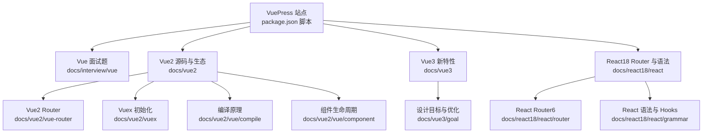
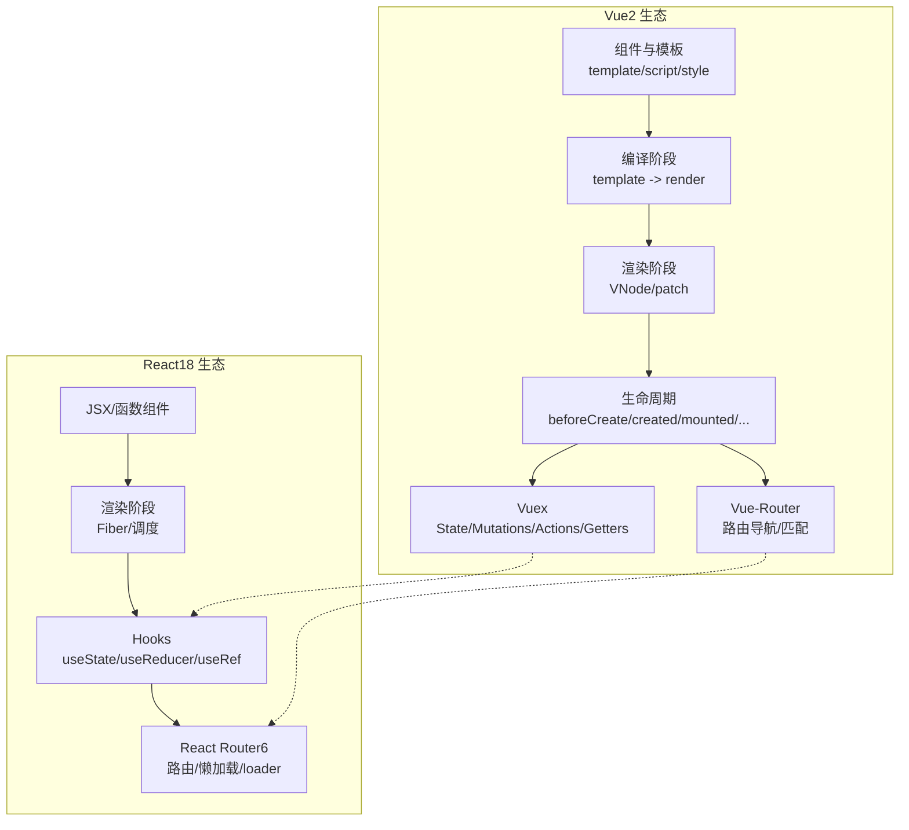
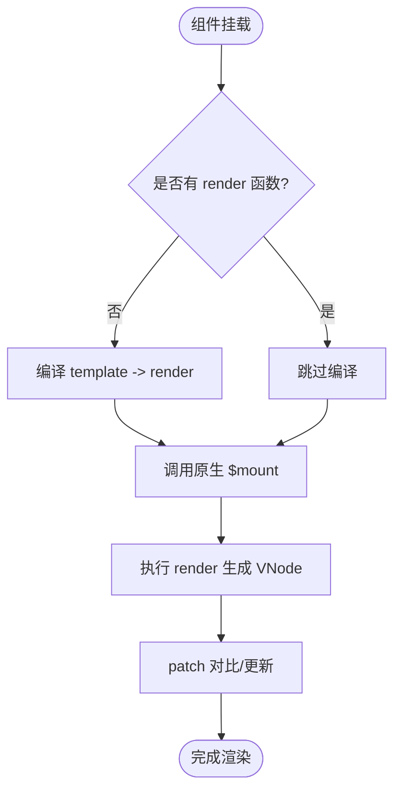
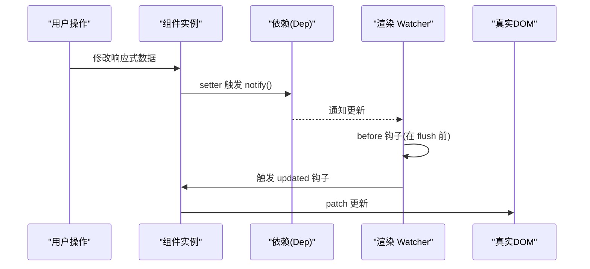
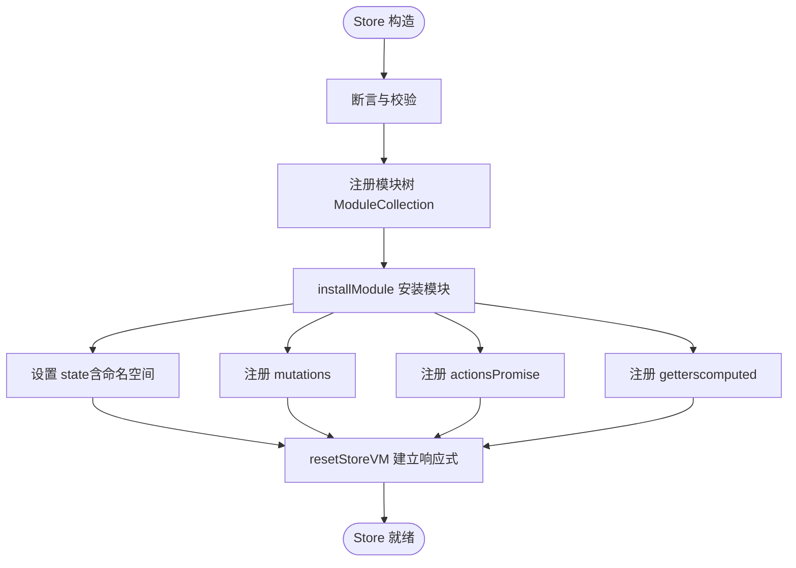
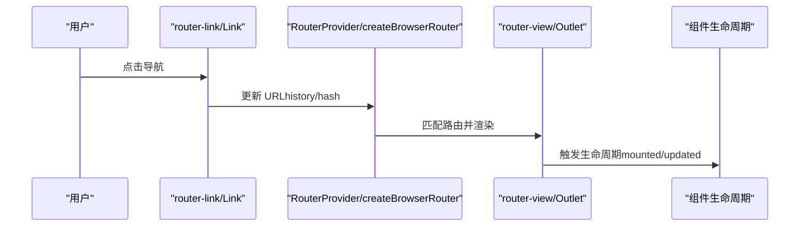
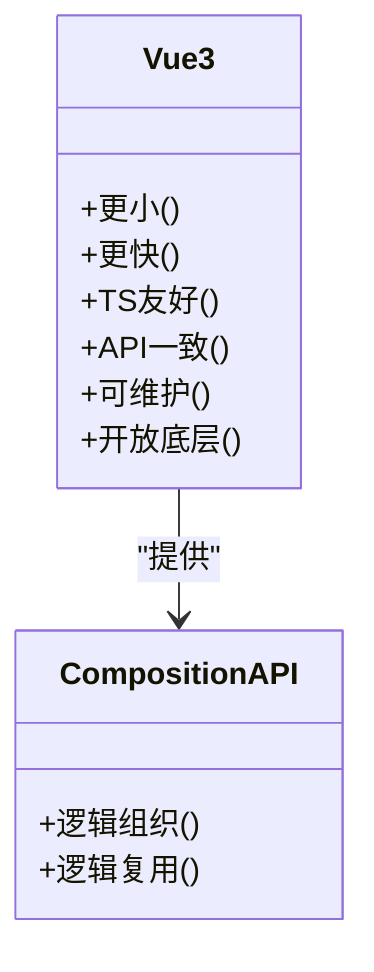
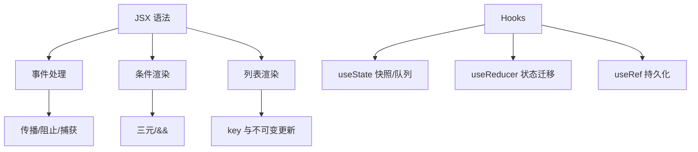
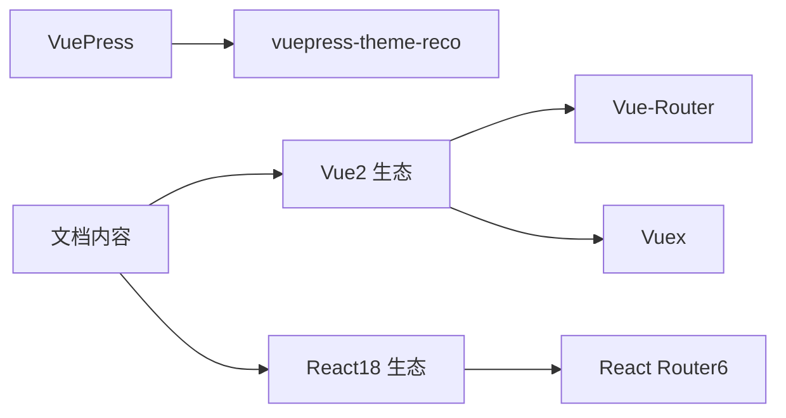

# 框架开发

<cite>
**本文引用的文件**
- [README.md](file://README.md)
- [package.json](file://package.json)
- [docs/react18/react/router.md](file://docs/react18/react/router.md)
- [docs/interview/vue/vue.md](file://docs/interview/vue/vue.md)
- [docs/vue2/vue-router/introduction.md](file://docs/vue2/vue-router/introduction.md)
- [docs/vue2/vuex/init.md](file://docs/vue2/vuex/init.md)
- [docs/interview/vue3/goal.md](file://docs/interview/vue3/goal.md)
- [docs/vue2/vue/compile/introduction.md](file://docs/vue2/vue/compile/introduction.md)
- [docs/vue2/vue/component/lifecycle.md](file://docs/vue2/vue/component/lifecycle.md)
- [docs/react18/react/grammar.md](file://docs/react18/react/grammar.md)
</cite>

## 目录
1. [简介](#简介)
2. [项目结构](#项目结构)
3. [核心组件](#核心组件)
4. [架构总览](#架构总览)
5. [详细组件分析](#详细组件分析)
6. [依赖分析](#依赖分析)
7. [性能考量](#性能考量)
8. [故障排查指南](#故障排查指南)
9. [结论](#结论)
10. [附录](#附录)

## 简介
本技术文档面向现代前端框架开发者，系统梳理 Vue.js 与 React.js 的使用与原理，覆盖 Vue2 源码分析、Vue2 Router 与 Vuex 状态管理、Vue3 新特性与 Composition API、React Hooks 与函数式组件等核心主题。文档同时提供性能优化建议、最佳实践与常见问题解决方案，并给出从入门到精通的学习路径与生态工具使用方法，帮助读者在实际项目中高效落地。

## 项目结构
本仓库为 VuePress 文档站点，包含大量前端知识与面试题资源，其中与框架开发密切相关的资料集中在以下目录：
- docs/interview/vue：Vue 基础与对比
- docs/vue2：Vue2 源码与生态（Router、Vuex）
- docs/vue3：Vue3 设计目标与 Composition API
- docs/react18/react：React Router 与语法基础
- docs/frontend-advanced：高级前端主题（算法、Webpack 等）

图表来源
- [package.json:1-17](file://package.json#L1-L17)
- [docs/interview/vue/vue.md:1-119](file://docs/interview/vue/vue.md#L1-L119)
- [docs/vue2/vue-router/introduction.md:1-68](file://docs/vue2/vue-router/introduction.md#L1-L68)
- [docs/vue2/vuex/init.md:1-744](file://docs/vue2/vuex/init.md#L1-L744)
- [docs/interview/vue3/goal.md:1-238](file://docs/interview/vue3/goal.md#L1-L238)
- [docs/vue2/vue/compile/introduction.md:1-77](file://docs/vue2/vue/compile/introduction.md#L1-L77)
- [docs/vue2/vue/component/lifecycle.md:1-428](file://docs/vue2/vue/component/lifecycle.md#L1-L428)
- [docs/react18/react/router.md:1-540](file://docs/react18/react/router.md#L1-L540)
- [docs/react18/react/grammar.md:1-800](file://docs/react18/react/grammar.md#L1-L800)

章节来源
- [README.md:1-12](file://README.md#L1-L12)
- [package.json:1-17](file://package.json#L1-L17)

## 核心组件
本节聚焦两大框架的关键构件与其协作方式，帮助建立“从模板到渲染、从状态到路由”的整体认知。

- Vue2 核心
  - 模板编译：runtime + compiler 版本在运行时将 template 编译为 render 函数；runtime + only 通过 vue-loader 在构建期完成编译。
  - 组件生命周期：从 beforeCreate、created、beforeMount、mounted、beforeUpdate、updated、beforeDestroy、destroyed 到 activated/deactivated（配合 keep-alive）。
  - 状态管理：Vuex Store 初始化，包含 state、mutations、actions、getters 与 modules 的安装与命名空间处理。
  - 路由：Vue-Router 支持 hash/history/abstract 三种模式，提供 <router-link>/<router-view> 与路由配置 API。

- React18 核心
  - 路由：React Router6 支持嵌套路由、动态路由、索引路由、loader/action、errorElement 与懒加载。
  - 语法与 Hooks：JSX 语法、事件处理、条件/列表渲染；useState/useReducer/useRef 等 Hooks 的状态更新与调度。
  - 组件化：函数式组件与类组件的差异、Props 传递与默认值、事件冒泡与阻止传播。

章节来源
- [docs/vue2/vue/compile/introduction.md:1-77](file://docs/vue2/vue/compile/introduction.md#L1-L77)
- [docs/vue2/vue/component/lifecycle.md:1-428](file://docs/vue2/vue/component/lifecycle.md#L1-L428)
- [docs/vue2/vuex/init.md:1-744](file://docs/vue2/vuex/init.md#L1-L744)
- [docs/vue2/vue-router/introduction.md:1-68](file://docs/vue2/vue-router/introduction.md#L1-L68)
- [docs/react18/react/router.md:1-540](file://docs/react18/react/router.md#L1-L540)
- [docs/react18/react/grammar.md:1-800](file://docs/react18/react/grammar.md#L1-L800)

## 架构总览
下图展示了 Vue2 与 React18 在“模板/JSX -> 渲染 -> 状态/路由”的典型流程，以及两者在生态上的分工与协同。

图表来源
- [docs/vue2/vue/compile/introduction.md:1-77](file://docs/vue2/vue/compile/introduction.md#L1-L77)
- [docs/vue2/vue/component/lifecycle.md:1-428](file://docs/vue2/vue/component/lifecycle.md#L1-L428)
- [docs/vue2/vue-router/introduction.md:1-68](file://docs/vue2/vue-router/introduction.md#L1-L68)
- [docs/vue2/vuex/init.md:1-744](file://docs/vue2/vuex/init.md#L1-L744)
- [docs/react18/react/router.md:1-540](file://docs/react18/react/router.md#L1-L540)
- [docs/react18/react/grammar.md:1-800](file://docs/react18/react/grammar.md#L1-L800)

## 详细组件分析

### Vue2 源码与编译流程
- 模板编译入口与 mount 重写：runtime + compiler 版本在入口处重写 $mount 并挂载 compile API，将 template 解析为 render 与 staticRenderFns。
- 编译三阶段：parse（模板解析）、optimize（静态标记）、codegen（代码生成）。
- 运行时渲染：通过 render 生成 VNode，patch 过程对比新旧 VNode，最小化更新真实 DOM。

图表来源
- [docs/vue2/vue/compile/introduction.md:1-77](file://docs/vue2/vue/compile/introduction.md#L1-L77)

章节来源
- [docs/vue2/vue/compile/introduction.md:1-77](file://docs/vue2/vue/compile/introduction.md#L1-L77)

### Vue2 组件生命周期与更新
- 生命周期钩子：beforeCreate/created、beforeMount/mounted、beforeUpdate/updated、beforeDestroy/destroyed。
- 更新流程：响应式数据变更触发依赖收集，Dep.notify 通知 Watcher，调度队列 flushSchedulerQueue，先执行 render watcher 的 before，再统一触发 updated 钩子。
- 销毁流程：$destroy 触发 beforeDestroy，清理 watchers、事件监听，递归销毁子组件，最后触发 destroyed。

图表来源
- [docs/vue2/vue/component/lifecycle.md:122-263](file://docs/vue2/vue/component/lifecycle.md#L122-L263)

章节来源
- [docs/vue2/vue/component/lifecycle.md:1-428](file://docs/vue2/vue/component/lifecycle.md#L1-L428)

### Vuex 状态管理初始化
- Store 构造断言：必须先 Vue.use(Vuex)、需 Promise 支持、必须 new 调用。
- 模块安装：ModuleCollection 注册父子模块，installModule 递归安装 state/mutations/actions/getters。
- 响应式实现：resetStoreVM 将 state 包装为 Vue 实例的 $$state，getters 转换为 computed 并通过访问器拦截。

图表来源
- [docs/vue2/vuex/init.md:15-35](file://docs/vue2/vuex/init.md#L15-L35)
- [docs/vue2/vuex/init.md:78-130](file://docs/vue2/vuex/init.md#L78-L130)
- [docs/vue2/vuex/init.md:215-224](file://docs/vue2/vuex/init.md#L215-L224)

章节来源
- [docs/vue2/vuex/init.md:1-744](file://docs/vue2/vuex/init.md#L1-L744)

### Vue-Router 路由体系
- 路由模式：hash/history/abstract；提供 <router-link> 与 <router-view>。
- 路由配置：path、动态段(:id)、可选段、通配符(*)、布局组件与 Outlet、索引路由(index)。
- 导航与 API：Link 与 useNavigate；useParams/useSearchParams/useLocation/useMatches/useBeforeUnload 等 Hooks。
- 数据加载：loader/action 与 useLoaderData/useRouteError；errorElement 与错误边界。

图表来源
- [docs/vue2/vue-router/introduction.md:1-68](file://docs/vue2/vue-router/introduction.md#L1-L68)
- [docs/react18/react/router.md:340-482](file://docs/react18/react/router.md#L340-L482)

章节来源
- [docs/vue2/vue-router/introduction.md:1-68](file://docs/vue2/vue-router/introduction.md#L1-L68)
- [docs/react18/react/router.md:1-540](file://docs/react18/react/router.md#L1-L540)

### Vue3 设计目标与 Composition API
- 设计目标：更小、更快、TypeScript 友好、API 一致性、可维护性、开放底层能力。
- 性能优化：编译优化（静态提升、事件缓存、SSR）、响应式优化（Proxy 递归响应）。
- 语法 API：Composition API 优化逻辑组织与复用，消除 mixin 命名冲突与来源不清问题。

图表来源
- [docs/interview/vue3/goal.md:1-238](file://docs/interview/vue3/goal.md#L1-L238)

章节来源
- [docs/interview/vue3/goal.md:1-238](file://docs/interview/vue3/goal.md#L1-L238)

### React Hooks 与函数式组件
- JSX 语法：标签命名、属性命名（小驼峰）、子元素与默认值、布尔/undefined/null 忽略。
- 事件处理：小驼峰命名、事件传播与阻止、捕获阶段 onClickCapture。
- 条件/列表渲染：if/&&/? :、map 与 key。
- Hooks：useState（状态快照与批量更新）、useReducer（状态迁移）、useRef（持久化引用）。

图表来源
- [docs/react18/react/grammar.md:1-800](file://docs/react18/react/grammar.md#L1-L800)

章节来源
- [docs/react18/react/grammar.md:1-800](file://docs/react18/react/grammar.md#L1-L800)

## 依赖分析
- VuePress 与主题：站点基于 vuepress 与 vuepress-theme-reco，提供文档与主题能力。
- 生态工具：Vue2 Router/Vuex、React Router6、JSX/函数式组件与 Hooks。

图表来源
- [package.json:8-16](file://package.json#L8-L16)

章节来源
- [package.json:1-17](file://package.json#L1-L17)

## 性能考量
- Vue2
  - 编译期优化：静态提升、事件监听缓存、静态节点预生成。
  - 运行时优化：patch 边对比边更新、keep-alive 缓存组件。
  - 响应式优化：深层对象惰性响应，避免全量递归。
- React18
  - 调度优化：并发调度、批处理更新、优先级任务。
  - 渲染优化：useMemo/useCallback、懒加载与 Suspense。
  - 路由优化：路由懒加载、loader 并行数据获取、错误边界隔离。

## 故障排查指南
- Vue2
  - 模板编译失败：确认是否使用 runtime + compiler 版本或构建期已编译。
  - 生命周期泄漏：在 beforeDestroy/destroyed 中移除事件监听与定时器。
  - Vuex 命名冲突：检查命名空间与重复 getter/mutation。
- React18
  - 路由导航异常：检查动态路由优先级与路径拼写；确认 useNavigate 参数。
  - 状态不更新：确保使用更新函数（如 setX(x => ...)）或不可变更新策略。
  - 错误边界：合理放置 errorElement 并区分 isRouteErrorResponse。

章节来源
- [docs/vue2/vue/compile/introduction.md:1-77](file://docs/vue2/vue/compile/introduction.md#L1-L77)
- [docs/vue2/vue/component/lifecycle.md:265-428](file://docs/vue2/vue/component/lifecycle.md#L265-L428)
- [docs/vue2/vuex/init.md:574-643](file://docs/vue2/vuex/init.md#L574-L643)
- [docs/react18/react/router.md:231-296](file://docs/react18/react/router.md#L231-L296)
- [docs/react18/react/grammar.md:360-430](file://docs/react18/react/grammar.md#L360-L430)

## 结论
本文件从源码与原理出发，系统串联 Vue2 与 React18 的关键构件与流程，辅以性能优化与故障排查建议，形成从入门到进阶的完整学习路径。建议读者结合仓库中的面试题与源码解析文档，逐步掌握模板/JSX 编译、组件生命周期、状态管理与路由体系，并在实际项目中实践 Hooks 与 Composition API 的最佳实践。

## 附录
- 学习路径建议
  - Vue2：从模板编译与生命周期入手，逐步掌握 Router 与 Vuex；再过渡到 Vue3 的 Composition API。
  - React18：从 JSX 语法与 Hooks 入门，掌握 React Router6 的路由与数据加载；深入理解并发调度与性能优化。
- 生态工具
  - Vue：CLI、Devtools、VueUse、Pinia（替代 Vuex）、Vite。
  - React：Create React App、React Devtools、React Router、Redux Toolkit、Zustand。