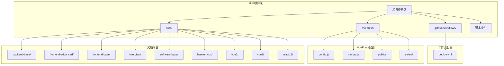
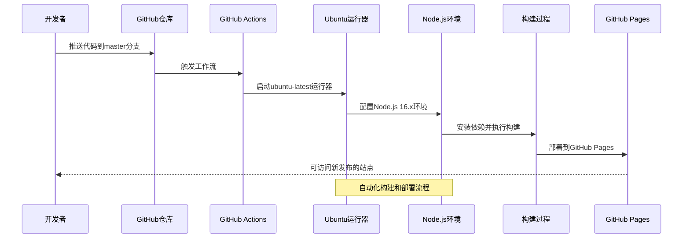
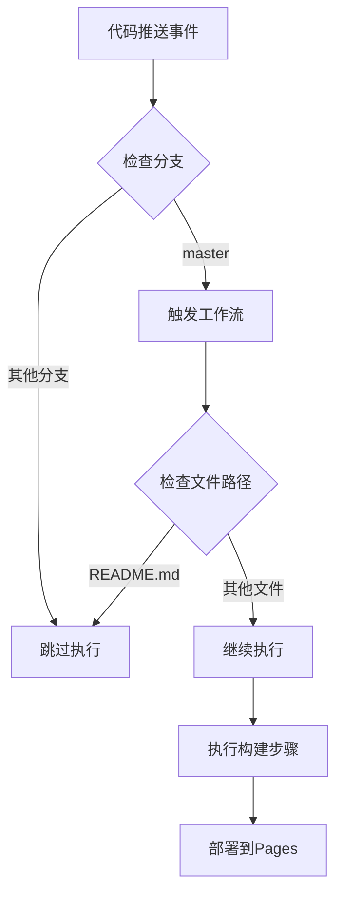
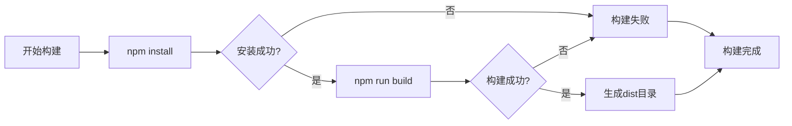
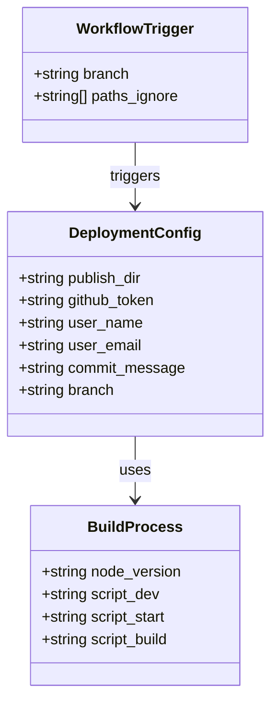
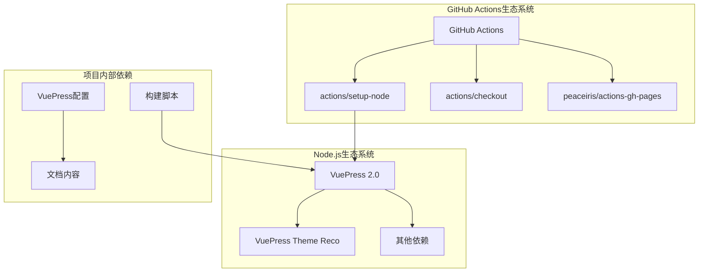
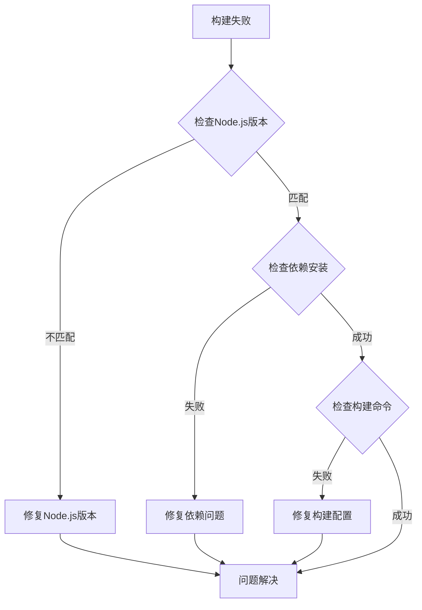

# GitHub Actions工作流

<cite>
**本文档引用的文件**
- [.github/workflows/deploy.yml](file://.github/workflows/deploy.yml)
- [package.json](file://package.json)
- [.vuepress/config.js](file://.vuepress/config.js)
- [.vuepress/navbar.js](file://.vuepress/navbar.js)
- [publish.sh](file://publish.sh)
- [README.md](file://README.md)
</cite>

## 目录
1. [简介](#简介)
2. [项目结构](#项目结构)
3. [核心组件](#核心组件)
4. [架构概览](#架构概览)
5. [详细组件分析](#详细组件分析)
6. [依赖关系分析](#依赖关系分析)
7. [性能考虑](#性能考虑)
8. [故障排除指南](#故障排除指南)
9. [结论](#结论)
10. [附录](#附录)

## 简介

本指南为基于VuePress的个人博客项目提供完整的GitHub Actions自动化部署工作流配置。该工作流实现了从代码提交到GitHub Pages自动部署的完整CI/CD流程，支持多分支保护、权限管理和错误处理。

该项目采用VuePress 2.0作为静态站点生成器，通过GitHub Actions实现自动化构建和部署，确保内容更新的及时性和可靠性。

## 项目结构

项目采用标准的VuePress项目结构，包含以下关键目录和文件：

**图表来源**
- [.github/workflows/deploy.yml:1-36](file://.github/workflows/deploy.yml#L1-L36)
- [.vuepress/config.js:1-18](file://.vuepress/config.js#L1-L18)
- [package.json:1-17](file://package.json#L1-L17)

**章节来源**
- [.github/workflows/deploy.yml:1-36](file://.github/workflows/deploy.yml#L1-L36)
- [.vuepress/config.js:1-18](file://.vuepress/config.js#L1-L18)
- [package.json:1-17](file://package.json#L1-L17)

## 核心组件

### 工作流配置组件

工作流配置位于`.github/workflows/deploy.yml`，定义了完整的CI/CD流程：

- **触发机制**: 监控master分支的push事件
- **执行环境**: Ubuntu Linux运行器
- **构建步骤**: Node.js 16.x环境下的依赖安装和构建
- **部署策略**: 使用peaceiris/actions-gh-pages Action部署到GitHub Pages

### 构建环境组件

项目使用VuePress 2.0作为静态站点生成器，配置文件位于`.vuepress/config.js`：

- **主题系统**: 基于vuepress-theme-reco的主题
- **导航配置**: 复杂的多级导航结构
- **基础路径**: 设置`/my-blog/`作为基础路径
- **页面配置**: 包含标题、描述、图标等元数据

### 内容管理系统

文档内容分布在多个专业领域：

- **后端技术**: Java、MySQL、Spring、Redis等
- **前端技术**: Vue.js、React、JavaScript、TypeScript等
- **面试准备**: 各种技术面试题库
- **操作系统**: Linux、网络等基础知识

**章节来源**
- [.github/workflows/deploy.yml:1-36](file://.github/workflows/deploy.yml#L1-L36)
- [.vuepress/config.js:1-18](file://.vuepress/config.js#L1-L18)
- [.vuepress/navbar.js:1-142](file://.vuepress/navbar.js#L1-L142)

## 架构概览

整个部署架构采用流水线式设计，从代码提交到最终发布形成完整的自动化流程：

**图表来源**
- [.github/workflows/deploy.yml:3-36](file://.github/workflows/deploy.yml#L3-L36)
- [package.json:8-12](file://package.json#L8-L12)

## 详细组件分析

### 工作流触发机制

工作流配置采用精确的触发策略：

**图表来源**
- [.github/workflows/deploy.yml:3-8](file://.github/workflows/deploy.yml#L3-L8)

#### 触发条件配置

- **分支监控**: 仅监控master分支的push事件
- **文件过滤**: 忽略README.md文件的变更，避免不必要的触发
- **时间效率**: 通过路径过滤减少不必要的工作流执行

**章节来源**
- [.github/workflows/deploy.yml:3-8](file://.github/workflows/deploy.yml#L3-L8)

### 构建环境配置

#### Node.js版本管理

工作流使用actions/setup-node@master配置Node.js环境：

- **版本选择**: Node.js 16.x系列
- **兼容性**: 支持VuePress 2.0的最新特性
- **稳定性**: LTS版本确保构建稳定性

#### 依赖管理流程

**图表来源**
- [.github/workflows/deploy.yml:18-24](file://.github/workflows/deploy.yml#L18-L24)

**章节来源**
- [.github/workflows/deploy.yml:18-24](file://.github/workflows/deploy.yml#L18-L24)

### 部署配置详解

#### GitHub Pages集成

工作流使用peaceiris/actions-gh-pages@v3进行部署：

- **目标分支**: 将构建产物部署到page分支
- **发布目录**: 指向.vuepress/dist目录
- **身份验证**: 使用GitHub Token进行安全部署
- **提交信息**: 自动化的部署提交消息

#### 部署参数配置

**图表来源**
- [.github/workflows/deploy.yml:26-36](file://.github/workflows/deploy.yml#L26-L36)
- [.github/workflows/deploy.yml:18-24](file://.github/workflows/deploy.yml#L18-L24)

**章节来源**
- [.github/workflows/deploy.yml:26-36](file://.github/workflows/deploy.yml#L26-L36)

### VuePress配置分析

#### 主题和样式配置

VuePress配置文件定义了完整的主题系统：

- **主题引擎**: vuepress-theme-reco@2.0.0-beta.53
- **样式系统**: @vuepress-reco/style-default
- **颜色模式**: light模式
- **目录功能**: 启用目录标题显示

#### 导航系统

导航配置采用复杂的多级结构：

- **一级分类**: 软件基础、前端基础、前端进阶等
- **二级分类**: 每个大类下的具体技术领域
- **外部链接**: 支持外部网站的导航链接
- **图标系统**: 为每个导航项配置相应的图标

**章节来源**
- [.vuepress/config.js:1-18](file://.vuepress/config.js#L1-L18)
- [.vuepress/navbar.js:1-142](file://.vuepress/navbar.js#L1-L142)

## 依赖关系分析

### 外部依赖关系

**图表来源**
- [.github/workflows/deploy.yml:1-36](file://.github/workflows/deploy.yml#L1-L36)
- [package.json:13-16](file://package.json#L13-L16)

### 内部模块依赖

项目内部模块之间存在清晰的依赖关系：

- **配置依赖**: .vuepress/config.js依赖navbar.js和series配置
- **主题依赖**: VuePress主题依赖于各种插件和样式库
- **构建依赖**: 构建过程依赖于package.json中的脚本定义

**章节来源**
- [package.json:1-17](file://package.json#L1-L17)
- [.vuepress/config.js:1-18](file://.vuepress/config.js#L1-L18)

## 性能考虑

### 构建性能优化

1. **缓存策略**: 利用GitHub Actions的缓存功能减少重复安装时间
2. **并行执行**: 在可能的情况下并行执行独立的任务
3. **增量构建**: 避免不必要的全量构建，利用路径过滤机制

### 部署性能优化

1. **最小化部署范围**: 仅部署必要的构建产物
2. **压缩优化**: 确保构建输出经过适当的压缩和优化
3. **CDN加速**: 利用GitHub Pages的全球分发网络

### 成本效益分析

- **计算资源**: Ubuntu运行器提供充足的计算资源
- **存储空间**: 合理管理构建缓存和日志文件
- **执行时间**: 优化工作流以减少不必要的执行时间

## 故障排除指南

### 常见问题诊断

#### 构建失败问题

**图表来源**
- [.github/workflows/deploy.yml:18-24](file://.github/workflows/deploy.yml#L18-L24)

#### 部署失败问题

1. **Token权限问题**: 检查ACCESS_TOKEN的权限设置
2. **分支冲突**: 确认page分支的存在和权限
3. **网络连接**: 验证GitHub Pages服务的可用性

#### 日志分析技巧

- **查看详细日志**: 在GitHub Actions界面查看完整的构建日志
- **定位错误**: 关注错误信息中的具体文件和行号
- **依赖检查**: 检查npm install阶段的依赖解析问题

**章节来源**
- [.github/workflows/deploy.yml:26-36](file://.github/workflows/deploy.yml#L26-L36)

### 调试方法

1. **本地测试**: 在本地环境中先测试构建流程
2. **逐步调试**: 将复杂的工作流分解为简单的步骤进行测试
3. **日志分析**: 仔细分析GitHub Actions的日志输出
4. **版本兼容性**: 确保所有工具版本的兼容性

## 结论

本GitHub Actions工作流为VuePress博客项目提供了完整的自动化部署解决方案。通过精确的触发机制、可靠的构建流程和安全的部署策略，确保了内容更新的及时性和可靠性。

### 主要优势

- **自动化程度高**: 从代码提交到页面发布的全流程自动化
- **安全性强**: 使用GitHub Token进行安全的身份验证
- **可扩展性好**: 易于添加新的构建步骤和部署选项
- **维护成本低**: 减少手动部署的工作量

### 改进建议

1. **增加测试环节**: 在部署前添加自动化测试步骤
2. **增强错误处理**: 添加更详细的错误处理和通知机制
3. **性能监控**: 添加构建时间和部署成功率的监控
4. **回滚机制**: 实现一键回滚到之前的稳定版本

## 附录

### 最佳实践清单

#### CI/CD最佳实践

- **版本锁定**: 固定关键依赖的版本
- **环境隔离**: 使用独立的构建和部署环境
- **安全优先**: 最小权限原则和安全令牌管理
- **可观测性**: 完整的日志记录和监控

#### 性能优化建议

- **缓存策略**: 合理使用GitHub Actions缓存功能
- **并行执行**: 并行化独立的构建任务
- **增量构建**: 利用Git差异进行增量构建
- **资源管理**: 合理分配和使用计算资源

#### 维护指南

- **定期审查**: 定期审查和更新工作流配置
- **文档维护**: 保持配置文档的最新状态
- **团队培训**: 确保团队成员了解工作流的配置和使用
- **应急响应**: 建立工作流故障的应急响应机制