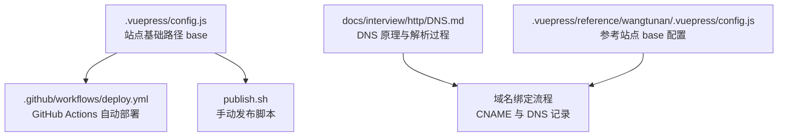
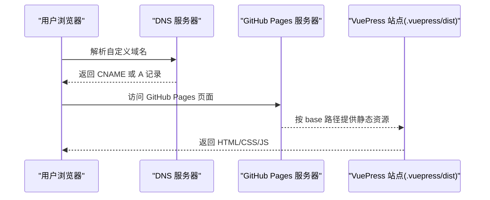
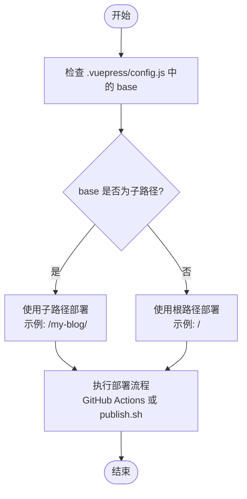
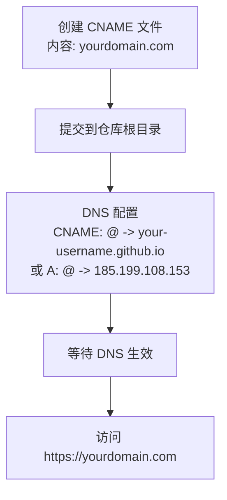
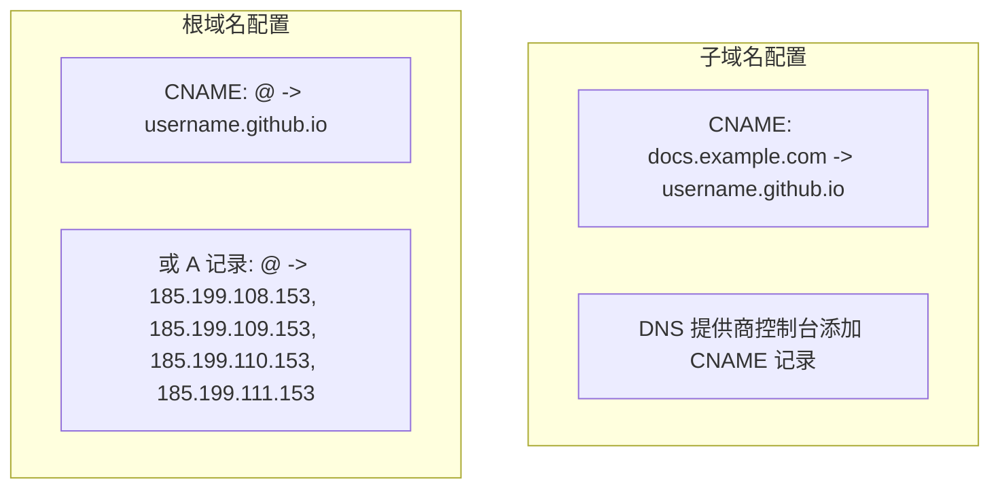
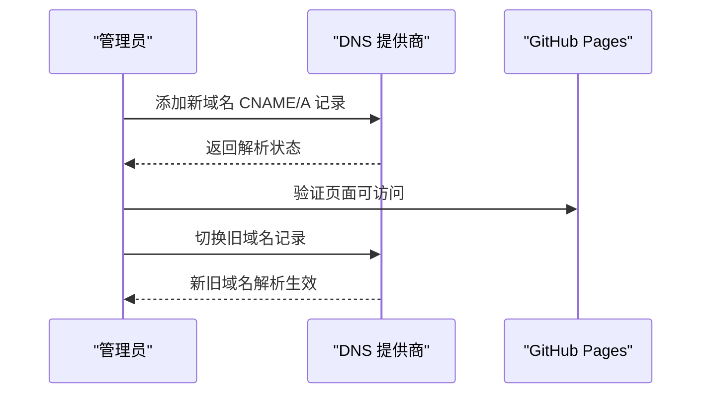
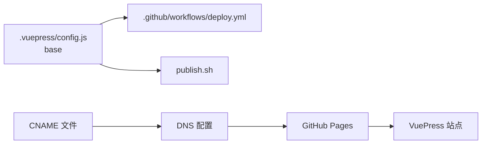

# 域名和CNAME配置

<cite>
**本文档引用的文件**
- [README.md](file://README.md)
- [package.json](file://package.json)
- [.vuepress/config.js](file://.vuepress/config.js)
- [.github/workflows/deploy.yml](file://.github/workflows/deploy.yml)
- [publish.sh](file://publish.sh)
- [docs/interview/http/DNS.md](file://docs/interview/http/DNS.md)
- [.vuepress/reference/wangtunan/.vuepress/config.js](file://.vuepress/reference/wangtunan/.vuepress/config.js)
- [.vuepress/reference/wangtunan/.vuepress/ua.js](file://.vuepress/reference/wangtunan/.vuepress/ua.js)
</cite>

## 目录
1. [简介](#简介)
2. [项目结构](#项目结构)
3. [核心组件](#核心组件)
4. [架构总览](#架构总览)
5. [详细组件分析](#详细组件分析)
6. [依赖关系分析](#依赖关系分析)
7. [性能考量](#性能考量)
8. [故障排除指南](#故障排除指南)
9. [结论](#结论)
10. [附录](#附录)

## 简介
本指南面向网站管理员与运维人员，围绕 GitHub Pages 域名绑定与 CNAME 配置提供完整实操指引。内容涵盖：
- 自定义域名设置流程与 DNS 配置要求
- CNAME 文件格式、域名解析验证与 HTTPS 证书配置
- 根域名与子域名的不同配置方法
- 域名迁移、SSL 证书申请与安全配置最佳实践
- 常见问题诊断：解析延迟、访问异常、证书错误等

本项目基于 VuePress 构建，使用 GitHub Actions 自动化部署至 GitHub Pages，结合 CNAME 与 DNS 记录完成域名绑定。

## 项目结构
本仓库包含 VuePress 文档站点与自动化部署脚本，关键与域名绑定相关的文件如下：
- 配置文件：.vuepress/config.js（站点基础路径 base）
- 部署工作流：.github/workflows/deploy.yml（自动部署到 GitHub Pages）
- 手动发布脚本：publish.sh（本地构建后推送到 GitHub Pages 分支）
- DNS 基础知识：docs/interview/http/DNS.md（域名与解析原理）
- 参考站点配置：.vuepress/reference/wangtunan/.vuepress/config.js（演示 base 路径与 CNAME 的配合）

**图表来源**
- [.vuepress/config.js](file://.vuepress/config.js)
- [.github/workflows/deploy.yml](file://.github/workflows/deploy.yml)
- [publish.sh](file://publish.sh)
- [docs/interview/http/DNS.md](file://docs/interview/http/DNS.md)
- [.vuepress/reference/wangtunan/.vuepress/config.js](file://.vuepress/reference/wangtunan/.vuepress/config.js)

**章节来源**
- [.vuepress/config.js](file://.vuepress/config.js)
- [.github/workflows/deploy.yml](file://.github/workflows/deploy.yml)
- [publish.sh](file://publish.sh)
- [docs/interview/http/DNS.md](file://docs/interview/http/DNS.md)
- [.vuepress/reference/wangtunan/.vuepress/config.js](file://.vuepress/reference/wangtunan/.vuepress/config.js)

## 核心组件
- 站点基础路径 base：控制资源相对路径与 GitHub Pages 子路径部署（如 /my-blog/）
- GitHub Actions 工作流：自动构建并发布到 GitHub Pages 的 page 分支
- 手动发布脚本：本地构建后推送至 GitHub Pages 分支
- DNS 文档：解释域名层级、查询方式与解析缓存机制
- 参考站点配置：演示 base 与 CNAME 的协同工作方式

**章节来源**
- [.vuepress/config.js](file://.vuepress/config.js)
- [.github/workflows/deploy.yml](file://.github/workflows/deploy.yml)
- [publish.sh](file://publish.sh)
- [docs/interview/http/DNS.md](file://docs/interview/http/DNS.md)
- [.vuepress/reference/wangtunan/.vuepress/config.js](file://.vuepress/reference/wangtunan/.vuepress/config.js)

## 架构总览
下图展示从域名配置到页面访问的端到端流程，包括 CNAME、DNS 解析、GitHub Pages 与站点基础路径的关系。

**图表来源**
- [.vuepress/config.js](file://.vuepress/config.js)
- [.github/workflows/deploy.yml](file://.github/workflows/deploy.yml)
- [publish.sh](file://publish.sh)

## 详细组件分析

### 组件A：站点基础路径与部署分支
- base：决定静态资源的相对路径前缀，影响子路径部署（如 /my-blog/）
- GitHub Actions：在 page 分支托管静态资源，自动部署由工作流触发
- 手动脚本：本地构建后推送到 page 分支，便于离线或快速验证

**图表来源**
- [.vuepress/config.js](file://.vuepress/config.js)
- [.github/workflows/deploy.yml](file://.github/workflows/deploy.yml)
- [publish.sh](file://publish.sh)

**章节来源**
- [.vuepress/config.js](file://.vuepress/config.js)
- [.github/workflows/deploy.yml](file://.github/workflows/deploy.yml)
- [publish.sh](file://publish.sh)

### 组件B：CNAME 文件与 DNS 配置
- CNAME 文件：放置于仓库根目录，内容为自定义域名一行
- DNS 记录：可选 A 记录直连或 CNAME 记录指向 github.io
- HTTPS：GitHub Pages 默认为绑定域名提供免费证书；如需根域名，建议使用 CNAME 并在 DNS 提供者处开启 HTTPS

**图表来源**
- [README.md](file://README.md)
- [docs/interview/http/DNS.md](file://docs/interview/http/DNS.md)

**章节来源**
- [README.md](file://README.md)
- [docs/interview/http/DNS.md](file://docs/interview/http/DNS.md)

### 组件C：根域名与子域名的不同配置
- 子域名（如 docs.example.com）：推荐使用 CNAME 指向 username.github.io
- 根域名（example.com）：推荐使用 CNAME 指向 username.github.io；部分 DNS 提供商可能要求使用 A 记录并配置 IPv4 地址，但 GitHub Pages 更推荐 CNAME

**图表来源**
- [docs/interview/http/DNS.md](file://docs/interview/http/DNS.md)

**章节来源**
- [docs/interview/http/DNS.md](file://docs/interview/http/DNS.md)

### 组件D：域名迁移与 SSL 证书
- 迁移步骤：先在新域名添加 CNAME/A 记录，确认解析成功后再切换旧域名
- 证书：GitHub Pages 对绑定域名提供免费证书；如使用根域名，确保 DNS 提供商支持 HTTPS

**图表来源**
- [docs/interview/http/DNS.md](file://docs/interview/http/DNS.md)

**章节来源**
- [docs/interview/http/DNS.md](file://docs/interview/http/DNS.md)

## 依赖关系分析
- 站点基础路径 base 决定资源路径前缀，影响 GitHub Pages 子路径部署
- GitHub Actions 工作流与手动脚本共同支撑部署链路
- DNS 配置与 CNAME 文件共同决定域名解析与访问路径

**图表来源**
- [.vuepress/config.js](file://.vuepress/config.js)
- [.github/workflows/deploy.yml](file://.github/workflows/deploy.yml)
- [publish.sh](file://publish.sh)
- [README.md](file://README.md)

**章节来源**
- [.vuepress/config.js](file://.vuepress/config.js)
- [.github/workflows/deploy.yml](file://.github/workflows/deploy.yml)
- [publish.sh](file://publish.sh)
- [README.md](file://README.md)

## 性能考量
- DNS 缓存：浏览器与系统缓存可降低解析延迟，合理利用缓存提升访问速度
- 资源路径：base 设置为子路径时，确保所有静态资源按相对路径正确加载
- CDN：若需加速，可在 DNS 层引入 CNAME 指向 CDN，但需注意与 GitHub Pages 的兼容性

## 故障排除指南
- 域名无法访问
  - 检查 CNAME 文件是否位于仓库根目录且内容正确
  - 检查 DNS 记录是否已生效（可使用 nslookup/dig 验证）
  - 确认 GitHub Pages 分支 page 已启用
- 解析延迟
  - 清除浏览器与系统 DNS 缓存，或更换 DNS 提供商
  - 检查是否存在多级 CNAME 或 A 记录冲突
- HTTPS 证书问题
  - 确保使用 CNAME 指向 github.io，避免 A 记录导致证书不匹配
  - 根域名证书需在 DNS 提供商处启用 HTTPS 支持
- 访问路径异常
  - 检查 .vuepress/config.js 中的 base 设置是否与部署路径一致

**章节来源**
- [docs/interview/http/DNS.md](file://docs/interview/http/DNS.md)
- [.vuepress/config.js](file://.vuepress/config.js)
- [.github/workflows/deploy.yml](file://.github/workflows/deploy.yml)
- [publish.sh](file://publish.sh)

## 结论
通过规范的 CNAME 配置、合理的 DNS 记录与正确的站点基础路径设置，可稳定地将 VuePress 站点部署到 GitHub Pages 并绑定自定义域名。遵循本文提供的流程与最佳实践，可有效规避解析延迟、证书与路径问题，保障站点的可用性与安全性。

## 附录
- 参考站点配置演示：参考 wangtunan 博客的 .vuepress/config.js 中的 base 与部署方式，理解子路径部署与 CNAME 的协同作用。

**章节来源**
- [.vuepress/reference/wangtunan/.vuepress/config.js](file://.vuepress/reference/wangtunan/.vuepress/config.js)
- [.vuepress/reference/wangtunan/.vuepress/ua.js](file://.vuepress/reference/wangtunan/.vuepress/ua.js)