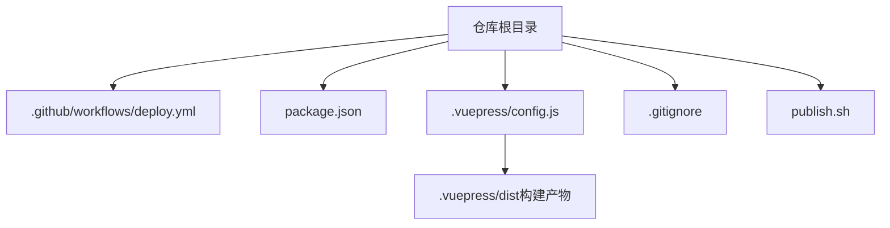
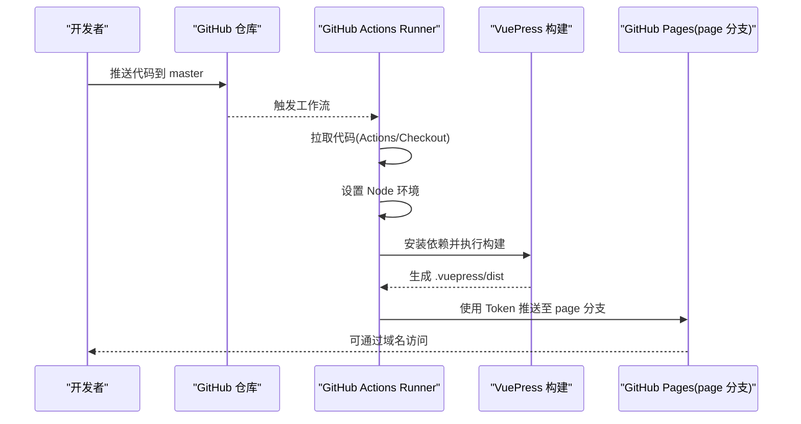
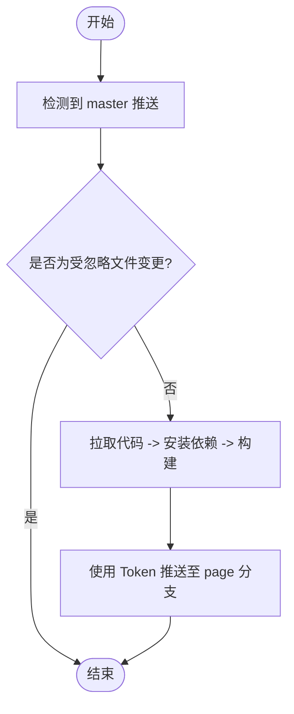
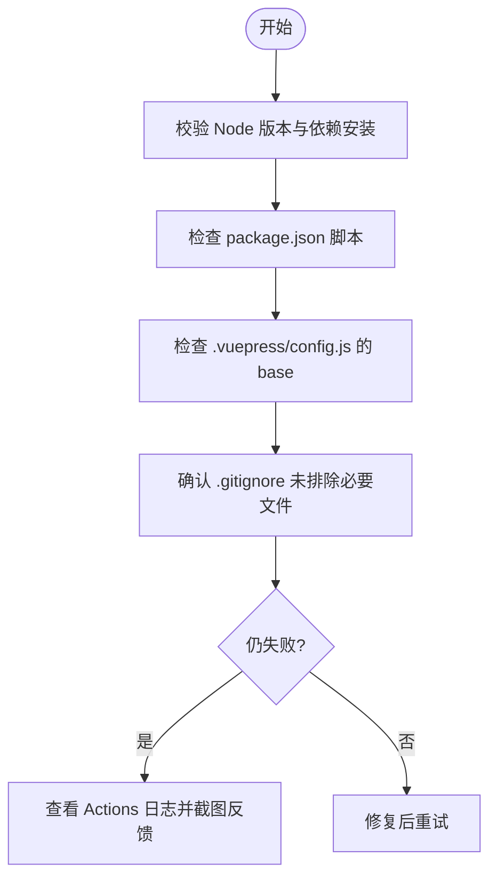
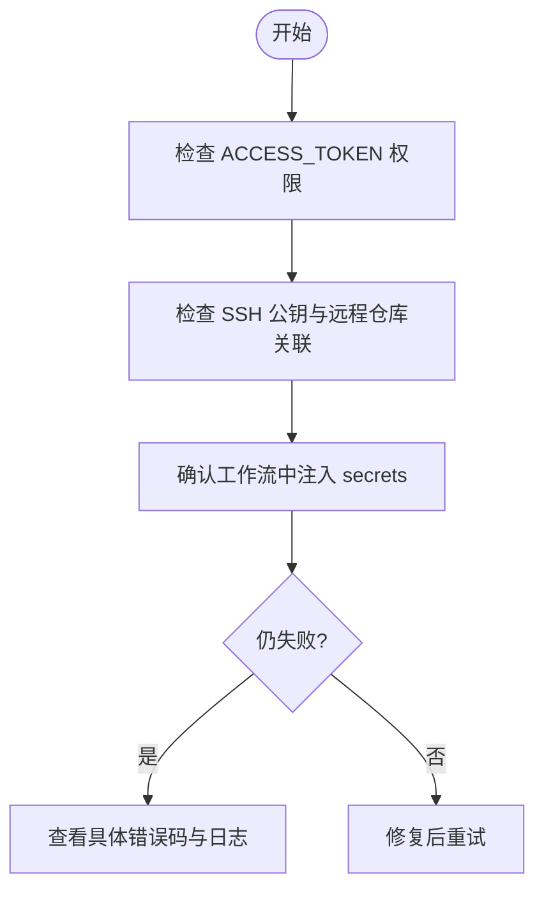
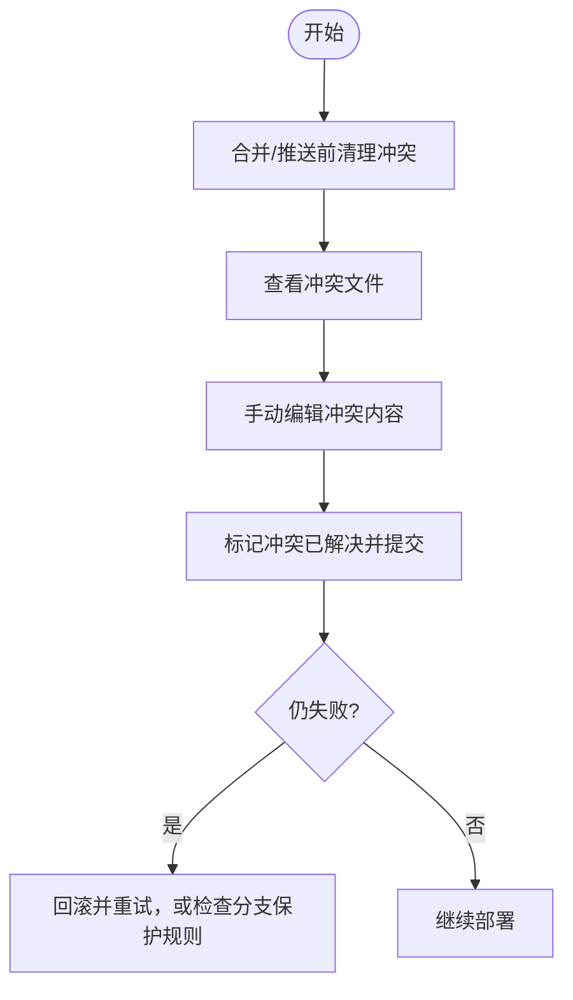

# 部署故障排除

<cite>
**本文引用的文件**
- [deploy.yml](file://.github/workflows/deploy.yml)
- [package.json](file://package.json)
- [publish.sh](file://publish.sh)
- [config.js](file://.vuepress/config.js)
- [.gitignore](file://.gitignore)
- [conflict.md](file://docs/interview/git/conflict.md)
- [404.md](file://docs/interview/vue/404.md)
</cite>

## 目录
1. [简介](#简介)
2. [项目结构](#项目结构)
3. [核心组件](#核心组件)
4. [架构总览](#架构总览)
5. [详细组件分析](#详细组件分析)
6. [依赖关系分析](#依赖关系分析)
7. [性能考虑](#性能考虑)
8. [故障排除指南](#故障排除指南)
9. [结论](#结论)
10. [附录](#附录)

## 简介
本指南面向使用 GitHub Pages 部署静态站点（基于 VuePress）的开发者，聚焦常见部署问题的诊断与修复，涵盖构建失败、权限错误、网络超时、Git 冲突与 SSH 配置、分支与路径差异、日志分析与调试工具使用等。文档结合仓库现有配置文件，提供可操作的检查清单与流程图，帮助快速定位并解决问题。

## 项目结构
本项目采用 VuePress 2.x 主题进行文档站点构建，部署通过 GitHub Actions 自动化，目标分支为 page。构建产物位于 .vuepress/dist，部署脚本亦可直接使用 Git 推送至 page 分支。

图表来源
- [deploy.yml](file://.github/workflows/deploy.yml)
- [package.json](file://package.json)
- [config.js](file://.vuepress/config.js)
- [.gitignore](file://.gitignore)
- [publish.sh](file://publish.sh)

章节来源
- [deploy.yml:1-36](file://.github/workflows/deploy.yml#L1-L36)
- [package.json:1-17](file://package.json#L1-L17)
- [config.js:1-18](file://.vuepress/config.js#L1-L18)
- [.gitignore:1-8](file://.gitignore#L1-L8)
- [publish.sh:1-20](file://publish.sh#L1-L20)

## 核心组件
- GitHub Actions 工作流：定义触发条件、运行环境、构建与部署步骤，目标分支为 page。
- VuePress 构建脚本：通过 package.json 中的 build 脚本生成静态站点。
- 部署脚本：publish.sh 用于本地或 CI 中将构建产物推送到 page 分支。
- VuePress 配置：base 路径配置影响页面资源路径与 GitHub Pages 子路径部署。
- 忽略规则：.gitignore 控制哪些目录/文件不纳入版本控制，避免污染构建产物。

章节来源
- [deploy.yml:9-36](file://.github/workflows/deploy.yml#L9-L36)
- [package.json:8-12](file://package.json#L8-L12)
- [publish.sh:4-14](file://publish.sh#L4-L14)
- [config.js:9](file://.vuepress/config.js#L9)
- [.gitignore:1-8](file://.gitignore#L1-L8)

## 架构总览
下图展示 GitHub Pages 部署的关键流程：推送触发 → 拉取代码 → 安装依赖 → 构建 → 使用 GitHub Token 推送至 page 分支。

图表来源
- [deploy.yml:15-35](file://.github/workflows/deploy.yml#L15-L35)
- [package.json:8-12](file://package.json#L8-L12)
- [config.js:9](file://.vuepress/config.js#L9)

## 详细组件分析

### GitHub Actions 工作流
- 触发条件：master 分支推送，忽略 README.md 变更。
- 步骤：
  - 拉取代码
  - 设置 Node 环境并安装依赖
  - 执行构建脚本
  - 使用第三方 Action 将构建目录发布到 page 分支

图表来源
- [deploy.yml:3-35](file://.github/workflows/deploy.yml#L3-L35)

章节来源
- [deploy.yml:3-35](file://.github/workflows/deploy.yml#L3-L35)

### VuePress 构建与配置
- 构建脚本：通过 package.json 的 build 脚本调用 VuePress CLI。
- 资源路径：config.js 中的 base 影响静态资源前缀，适用于子路径部署场景。
- 忽略规则：dist 目录被忽略，避免构建产物进入主分支。

章节来源
- [package.json:8-12](file://package.json#L8-L12)
- [config.js:9](file://.vuepress/config.js#L9)
- [.gitignore:3-4](file://.gitignore#L3-L4)

### 本地部署脚本
- 功能：本地构建后初始化 Git 仓库，提交并强制推送到 page 分支；随后回到主分支提交更新。
- 注意：该脚本直接使用 SSH URL 推送 page 分支，需确保 SSH 密钥与远程仓库权限配置正确。

章节来源
- [publish.sh:4-14](file://publish.sh#L4-L14)

## 依赖关系分析
- 工作流依赖 Node 环境与 VuePress CLI。
- 构建产物依赖 .vuepress/dist。
- 部署依赖 GitHub Token 与 page 分支存在性。

图表来源
- [deploy.yml:15-35](file://.github/workflows/deploy.yml#L15-L35)
- [package.json:8-12](file://package.json#L8-L12)
- [config.js:9](file://.vuepress/config.js#L9)

章节来源
- [deploy.yml:15-35](file://.github/workflows/deploy.yml#L15-L35)
- [package.json:8-12](file://package.json#L8-L12)
- [config.js:9](file://.vuepress/config.js#L9)

## 性能考虑
- 构建阶段：优先使用缓存策略（如 Actions 缓存 npm/yarn 缓存）、并行安装与按需安装依赖。
- 资源路径：合理设置 base，避免多级嵌套导致的资源加载开销。
- 部署阶段：减少不必要的文件推送，确保仅推送构建产物目录。

## 故障排除指南

### 一、构建失败
常见症状
- Actions 日志显示安装依赖失败或构建命令报错。
- 本地构建成功但 Actions 失败。

排查步骤
- 确认 Node 版本与依赖安装步骤一致。
- 检查 package.json 中的脚本是否正确。
- 校验 .vuepress/config.js 的 base 设置是否与实际部署路径匹配。
- 确保 .gitignore 中未错误排除构建所需文件。

章节来源
- [deploy.yml:20-24](file://.github/workflows/deploy.yml#L20-L24)
- [package.json:8-12](file://package.json#L8-L12)
- [config.js:9](file://.vuepress/config.js#L9)
- [.gitignore:1-8](file://.gitignore#L1-L8)

### 二、权限错误（Token/SSH）
常见症状
- Actions 推送失败，提示无权限或 Token 无效。
- 本地 SSH 推送 page 分支失败。

排查步骤
- 确认 GitHub Secrets 中的 ACCESS_TOKEN 权限范围包含 repo/page 分支写入。
- 确认 publish.sh 中使用的 SSH URL 与已配置公钥匹配。
- 若使用 Token，请确保在工作流中正确注入 secrets。

章节来源
- [deploy.yml:31-31](file://.github/workflows/deploy.yml#L31-L31)
- [publish.sh:14-14](file://publish.sh#L14-L14)

### 三、网络超时与不稳定
常见症状
- Actions 安装依赖超时或构建卡住。
- 本地网络不佳导致依赖下载缓慢。

排查步骤
- 使用 Actions 缓存加速依赖安装。
- 更换 npm/yarn 源或使用离线缓存。
- 在本地预构建并仅推送构建产物。

章节来源
- [deploy.yml:23-24](file://.github/workflows/deploy.yml#L23-L24)

### 四、Git 相关错误与分支冲突
常见症状
- 合并/推送冲突。
- page 分支不存在或被意外删除。

排查步骤
- 使用冲突解决流程：查看冲突文件、选择保留内容、标记冲突已解决并提交。
- 确保 page 分支存在且与主分支同步。
- 对于 Actions，确保目标分支 page 存在或允许 Action 自动创建。

章节来源
- [conflict.md:20-83](file://docs/interview/git/conflict.md#L20-L83)

### 五、SSH 密钥问题
常见症状
- 本地或 CI 推送 page 分支失败，提示认证失败。

排查步骤
- 确认本地已添加并加载对应私钥。
- 确认公钥已添加到 GitHub 账户。
- 使用 ssh -T 验证连接。

章节来源
- [publish.sh:14-14](file://publish.sh#L14-L14)

### 六、分支冲突与推送失败
常见症状
- page 分支被保护或被他人修改导致推送失败。

排查步骤
- 同步 page 分支并解决冲突后再推送。
- 在 CI 中使用 force 推送前评估风险（publish.sh 中已使用强制推送，需谨慎）。

章节来源
- [publish.sh:14-14](file://publish.sh#L14-L14)

### 七、日志分析与调试工具
常用手段
- Actions：查看工作流运行日志，定位安装/构建/推送阶段的具体错误。
- 本地：在 publish.sh 中增加 -x 或 set -x 追踪命令执行。
- 浏览器：检查 Network 面板与 Console，确认资源路径与 404 情况。

章节来源
- [deploy.yml:15-35](file://.github/workflows/deploy.yml#L15-L35)
- [publish.sh:1-20](file://publish.sh#L1-L20)

### 八、不同环境下的部署差异与兼容性
- Node 版本：工作流中固定使用 16.x，确保本地与 CI 一致。
- 资源路径：config.js 的 base 会影响静态资源前缀，需与 GitHub Pages 子路径一致。
- 依赖缓存：Actions 中可引入缓存以提升稳定性。

章节来源
- [deploy.yml:22](file://.github/workflows/deploy.yml#L22)
- [config.js:9](file://.vuepress/config.js#L9)

### 九、404 与路由问题（GitHub Pages 子路径部署）
常见症状
- 刷新页面或直接访问子路径出现 404。

排查步骤
- 确认 base 设置与实际访问路径一致。
- 若使用 history 模式，需在服务器层将所有路径重定向到 index.html（GitHub Pages 通过自定义域名与重写规则实现思路类似）。

章节来源
- [config.js:9](file://.vuepress/config.js#L9)
- [404.md:105-123](file://docs/interview/vue/404.md#L105-L123)

## 结论
通过规范的构建与部署流程、完善的日志分析与调试手段、以及对分支与权限的严格管理，大多数 GitHub Pages 部署问题均可快速定位并修复。建议在 CI 中加入缓存与日志输出，在本地与 CI 环境保持一致的 Node 版本与依赖，确保 base 配置与实际访问路径一致。

## 附录

### 快速检查清单
- [ ] Node 版本与依赖安装步骤一致
- [ ] package.json 构建脚本正确
- [ ] .vuepress/config.js 的 base 与部署路径一致
- [ ] .gitignore 未排除构建产物
- [ ] GitHub Secrets 中 ACCESS_TOKEN 权限正确
- [ ] page 分支存在且可写
- [ ] SSH 公钥已添加到账户，本地可免密推送
- [ ] Actions 工作流日志中无安装/构建/推送错误
- [ ] 如使用 history 模式，确认资源路径与 404 处理