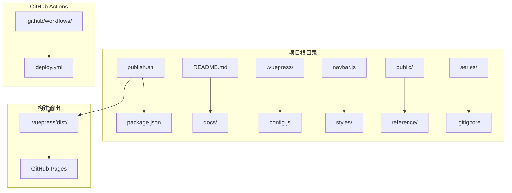
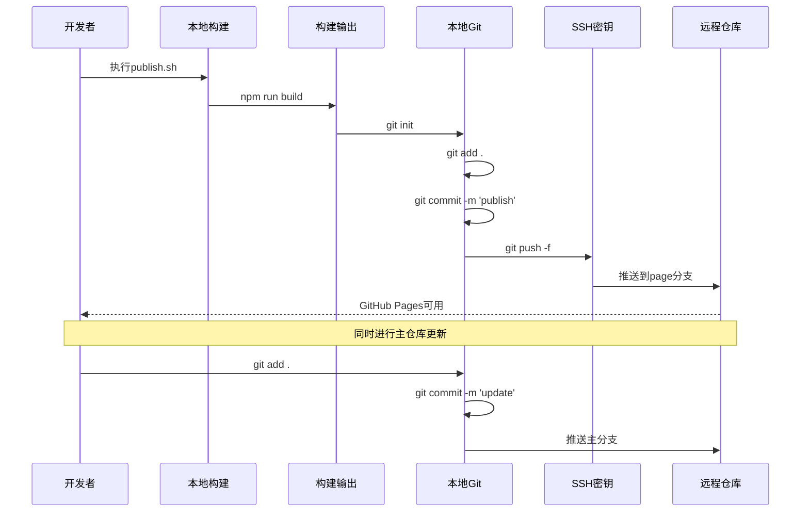
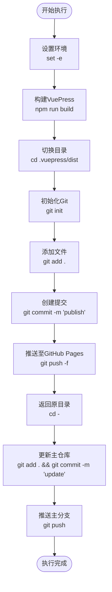
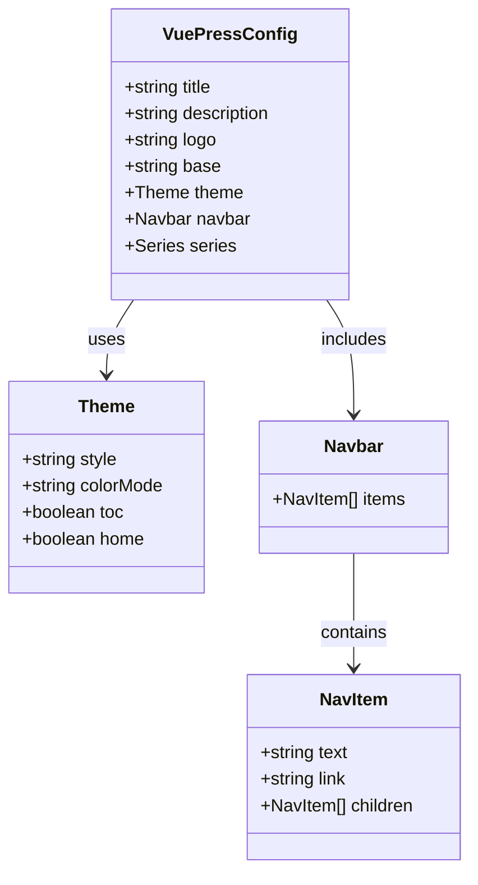
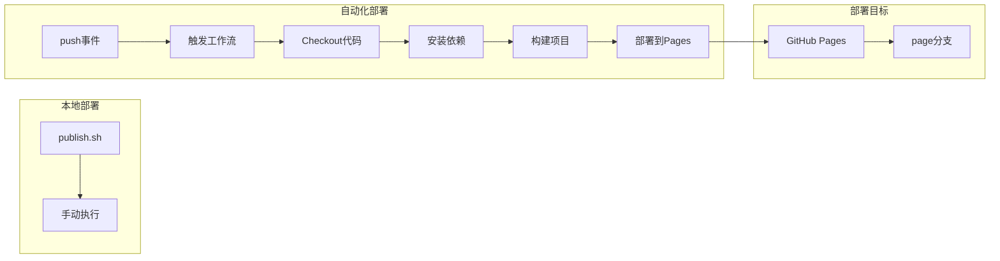

# 部署脚本配置

<cite>
**本文档引用的文件**
- [publish.sh](file://publish.sh)
- [.vuepress/config.js](file://.vuepress/config.js)
- [package.json](file://package.json)
- [.github/workflows/deploy.yml](file://.github/workflows/deploy.yml)
- [.gitignore](file://.gitignore)
- [.vuepress/navbar.js](file://.vuepress/navbar.js)
- [README.md](file://README.md)
- [docs/vue2/vue/introduction/introduction.md](file://docs/vue2/vue/introduction/introduction.md)
</cite>

## 目录
1. [简介](#简介)
2. [项目结构](#项目结构)
3. [核心组件](#核心组件)
4. [架构概览](#架构概览)
5. [详细组件分析](#详细组件分析)
6. [依赖关系分析](#依赖关系分析)
7. [性能考虑](#性能考虑)
8. [故障排除指南](#故障排除指南)
9. [结论](#结论)
10. [附录](#附录)

## 简介

本文档为VuePress博客项目的部署脚本提供详细的配置说明。该脚本实现了从本地构建到GitHub Pages的完整部署流程，包括VuePress构建、Git初始化和提交、SSH密钥认证配置以及远程仓库推送策略。文档将详细解释脚本中每个命令的作用和执行顺序，提供参数自定义、错误处理和日志记录的最佳实践，并包含执行权限设置、环境变量配置和多环境部署方案。

## 项目结构

该项目采用标准的VuePress项目结构，主要包含以下关键目录和文件：



**图表来源**
- [publish.sh:1-20](file://publish.sh#L1-L20)
- [package.json:1-17](file://package.json#L1-L17)
- [.vuepress/config.js:1-18](file://.vuepress/config.js#L1-L18)

**章节来源**
- [publish.sh:1-20](file://publish.sh#L1-L20)
- [.vuepress/config.js:1-18](file://.vuepress/config.js#L1-L18)
- [package.json:1-17](file://package.json#L1-L17)

## 核心组件

### 发布脚本 (publish.sh)

发布脚本是整个部署流程的核心，包含20行简洁而高效的命令。该脚本采用bash编写，使用`set -e`确保任何命令失败都会导致脚本终止。

**主要功能模块：**
1. **构建阶段** - 调用npm脚本进行VuePress构建
2. **Git初始化** - 在构建输出目录创建新的Git仓库
3. **提交阶段** - 添加所有文件并创建初始提交
4. **推送阶段** - 通过SSH推送至GitHub Pages分支
5. **回退提交** - 在主仓库中添加更新并推送

**章节来源**
- [publish.sh:1-20](file://publish.sh#L1-L20)

### VuePress配置系统

项目使用VuePress 2.0和reco主题，配置文件定义了站点的基本信息、主题设置和导航结构。

**核心配置项：**
- 站点标题和描述
- 主题配置（reco主题）
- 导航栏和系列配置
- 基础路径设置（用于GitHub Pages）

**章节来源**
- [.vuepress/config.js:1-18](file://.vuepress/config.js#L1-L18)
- [.vuepress/navbar.js:1-142](file://.vuepress/navbar.js#L1-L142)

### 构建脚本管理

package.json文件定义了项目的构建脚本，包括开发服务器启动和生产构建。

**构建脚本：**
- `dev` 和 `start` - 启动开发服务器
- `build` - 生产环境构建

**章节来源**
- [package.json:1-17](file://package.json#L1-L17)

## 架构概览

整个部署架构采用双路径策略，既支持本地手动部署，也支持GitHub Actions自动化部署：



**图表来源**
- [publish.sh:4-20](file://publish.sh#L4-L20)
- [.github/workflows/deploy.yml:18-36](file://.github/workflows/deploy.yml#L18-L36)

## 详细组件分析

### 发布脚本执行流程

发布脚本采用线性执行模式，每个步骤都有明确的目的和作用：



**图表来源**
- [publish.sh:1-20](file://publish.sh#L1-L20)

#### 命令详解

**第1行：`#!/usr/bin/env bash`**
- 指定脚本解释器为bash
- 确保跨平台兼容性

**第2行：`set -e`**
- 启用错误中断模式
- 任一命令失败立即终止脚本

**第4行：`npm run build`**
- 执行VuePress生产构建
- 生成静态网站文件

**第6行：`cd .vuepress/dist`**
- 切换到构建输出目录
- 准备Git初始化

**第8-10行：Git初始化和提交**
- 创建新的Git仓库
- 添加所有构建文件
- 创建初始提交

**第14行：`git push -f git@github.com:AMSC30/my-blog.git main:page`**
- 强制推送至GitHub Pages分支
- 使用SSH密钥认证

**第16行：`cd -`**
- 返回之前的目录

**第18-20行：主仓库更新**
- 在主仓库中添加更新
- 推送至远程主分支

**章节来源**
- [publish.sh:1-20](file://publish.sh#L1-L20)

### VuePress构建配置

VuePress配置系统采用现代化的ES模块语法，提供了丰富的定制选项：



**图表来源**
- [.vuepress/config.js:5-17](file://.vuepress/config.js#L5-L17)
- [.vuepress/navbar.js:1-142](file://.vuepress/navbar.js#L1-L142)

#### 关键配置项

**基础配置：**
- `title`: 站点标题
- `description`: 站点描述
- `logo`: 站点图标
- `base`: 基础路径，用于GitHub Pages部署

**主题配置：**
- `theme`: 使用reco主题
- `colorMode`: 明亮模式
- `catalogTitle`: 目录标题

**导航配置：**
- 包含多个分类的导航项
- 支持嵌套子菜单
- 集成外部链接

**章节来源**
- [.vuepress/config.js:1-18](file://.vuepress/config.js#L1-L18)
- [.vuepress/navbar.js:1-142](file://.vuepress/navbar.js#L1-L142)

### GitHub Actions自动化部署

项目同时支持本地手动部署和GitHub Actions自动化部署：



**图表来源**
- [.github/workflows/deploy.yml:1-36](file://.github/workflows/deploy.yml#L1-L36)

#### 工作流配置详解

**触发条件：**
- 监听master分支的push事件
- 忽略README.md的变更以避免不必要的部署

**执行步骤：**
1. **代码检出** - 获取最新代码
2. **环境准备** - 设置Node.js 16.x环境
3. **依赖安装** - 安装项目依赖
4. **构建执行** - 运行构建脚本
5. **部署推送** - 使用gh-pages action部署

**部署参数：**
- `publish_dir`: 指定构建输出目录
- `github_token`: 使用GitHub Secrets中的访问令牌
- `branch`: 目标分支为page分支

**章节来源**
- [.github/workflows/deploy.yml:1-36](file://.github/workflows/deploy.yml#L1-L36)

## 依赖关系分析

项目依赖关系清晰，主要涉及以下几个层面：

```mermaid
graph TB
subgraph "运行时依赖"
A[vuepress 2.0.0-beta.60]
B[vuepress-theme-reco 2.0.0-beta.53]
end
subgraph "开发依赖"
C[npm scripts]
D[bash脚本]
end
subgraph "GitHub Actions"
E[actions/checkout@v2]
F[actions/setup-node@master]
G[peaceiris/actions-gh-pages@v3]
end
subgraph "外部服务"
H[GitHub Pages]
I[SSH密钥认证]
end
A --> C
B --> C
C --> D
D --> H
E --> F
F --> G
G --> H
D --> I
```

**图表来源**
- [package.json:13-16](file://package.json#L13-L16)
- [.github/workflows/deploy.yml:15-31](file://.github/workflows/deploy.yml#L15-L31)

### 核心依赖说明

**VuePress核心依赖：**
- VuePress 2.0.0-beta.60 - 提供静态站点生成能力
- vuepress-theme-reco 2.0.0-beta.53 - 提供现代化的主题样式

**构建工具链：**
- npm scripts - 管理构建和开发任务
- GitHub Actions - 提供CI/CD自动化

**部署基础设施：**
- GitHub Pages - 提供免费的静态网站托管
- SSH密钥 - 实现无密码的Git推送

**章节来源**
- [package.json:13-16](file://package.json#L13-L16)
- [.github/workflows/deploy.yml:15-31](file://.github/workflows/deploy.yml#L15-L31)

## 性能考虑

### 构建优化策略

**增量构建：**
- 使用VuePress的缓存机制减少重复构建时间
- .vuepress/.cache和.vuepress/.temp目录用于存储临时文件

**资源优化：**
- 图片和媒体文件建议压缩处理
- CSS和JavaScript文件自动优化

**部署效率：**
- 使用`-f`参数强制推送，避免复杂的合并冲突
- 单独的dist目录便于快速部署

### 缓存和清理

**Git忽略配置：**
- 自动忽略构建缓存和临时文件
- 避免不必要的文件进入版本控制

**清理策略：**
- 定期清理.vuepress/dist目录
- 使用npm run build重新生成

## 故障排除指南

### 常见问题及解决方案

**SSH密钥认证失败：**
```bash
# 检查SSH密钥是否正确配置
ssh -T git@github.com

# 如果失败，重新生成SSH密钥
ssh-keygen -t rsa -b 4096 -C "your_email@example.com"
```

**Git权限问题：**
```bash
# 检查当前用户权限
git remote -v

# 更新远程仓库URL
git remote set-url origin git@github.com:username/repository.git
```

**构建失败：**
```bash
# 清理缓存后重新构建
rm -rf .vuepress/.cache
rm -rf .vuepress/.temp
npm run build
```

**页面无法访问：**
```bash
# 检查GitHub Pages设置
# 确认source设置为page分支
# 确认域名配置正确
```

### 错误处理最佳实践

**脚本错误处理：**
- 使用`set -e`确保错误传播
- 在关键步骤添加条件检查
- 实施回滚机制

**日志记录：**
- 在重要步骤添加echo输出
- 记录构建时间和版本信息
- 监控部署状态

**章节来源**
- [publish.sh:2-20](file://publish.sh#L2-L20)
- [.gitignore:1-8](file://.gitignore#L1-L8)

## 结论

该VuePress部署脚本提供了一个完整、高效且可靠的静态网站部署解决方案。通过结合本地手动部署和GitHub Actions自动化部署，项目实现了灵活的发布策略。脚本设计简洁明了，每个命令都有明确的目的，配合VuePress的现代化配置系统，能够满足个人博客和知识库的部署需求。

推荐的改进方向：
1. 添加更详细的错误处理和日志记录
2. 实现多环境配置支持
3. 增加部署前的健康检查
4. 提供部署状态监控

## 附录

### 环境变量配置

**GitHub Actions Secrets：**
- `ACCESS_TOKEN`: GitHub访问令牌
- `MY_USER_NAME`: 用户名
- `MY_USER_EMAIL`: 用户邮箱

**本地环境变量：**
```bash
export GH_PAGES_BRANCH="page"
export REPO_URL="git@github.com:username/repository.git"
```

### 多环境部署方案

**开发环境：**
- 使用不同的base路径
- 配置不同的主题设置
- 使用测试域名

**生产环境：**
- 正式的域名配置
- SEO优化设置
- CDN集成

### 执行权限设置

**脚本权限：**
```bash
chmod +x publish.sh
```

**Git配置：**
```bash
git config --global user.name "Your Name"
git config --global user.email "your_email@example.com"
```

**SSH配置：**
```bash
ssh-keygen -t rsa -b 4096 -C "your_email@example.com"
ssh-add ~/.ssh/id_rsa
```