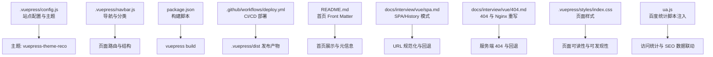
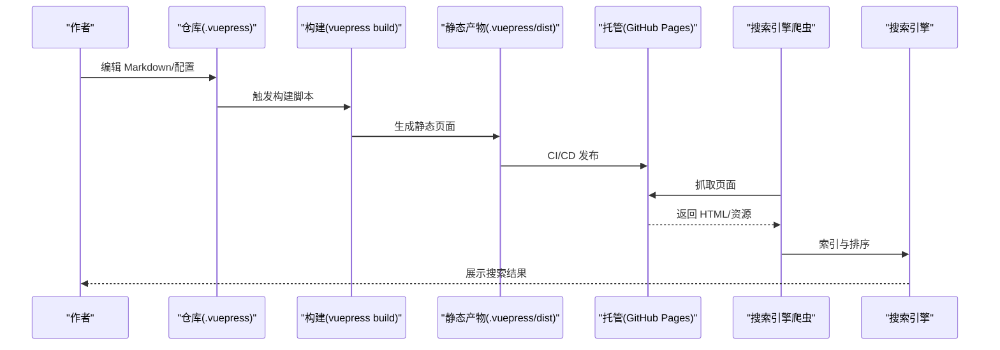
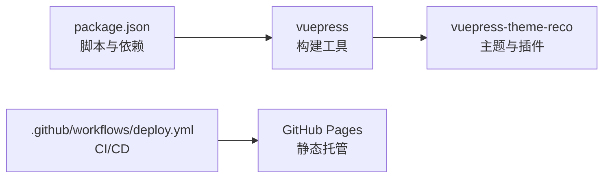
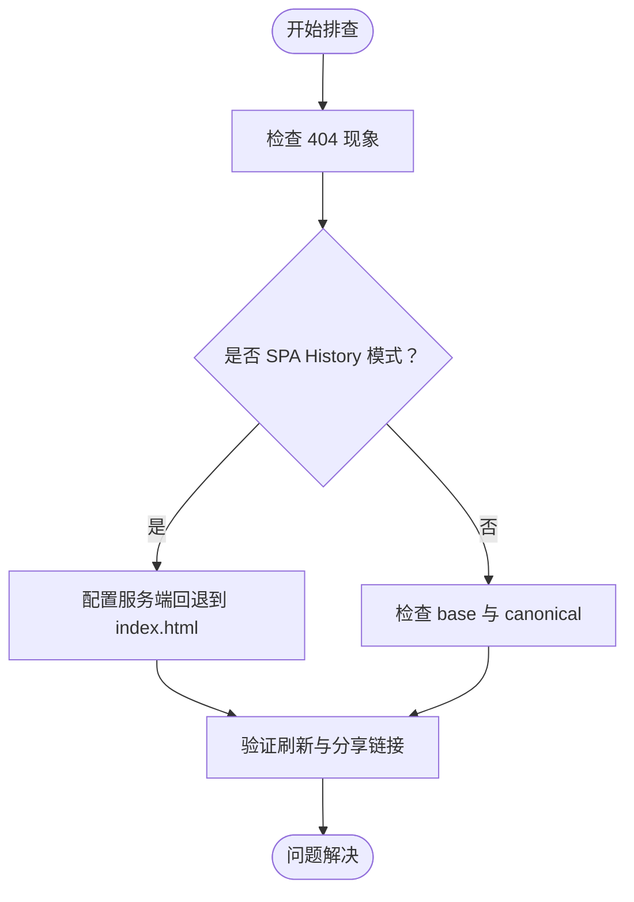

# SEO优化

<cite>
**本文引用的文件**
- [config.js](file://.vuepress/config.js)
- [navbar.js](file://.vuepress/navbar.js)
- [package.json](file://package.json)
- [deploy.yml](file://.github/workflows/deploy.yml)
- [README.md](file://README.md)
- [404.md](file://docs/interview/vue/404.md)
- [spa.md](file://docs/interview/vue/spa.md)
- [ua.js](file://.vuepress/reference/wangtunan/.vuepress/ua.js)
- [index.css](file://.vuepress/styles/index.css)
</cite>

## 目录
1. [简介](#简介)
2. [项目结构](#项目结构)
3. [核心组件](#核心组件)
4. [架构总览](#架构总览)
5. [详细组件分析](#详细组件分析)
6. [依赖分析](#依赖分析)
7. [性能考量](#性能考量)
8. [故障排查指南](#故障排查指南)
9. [结论](#结论)
10. [附录](#附录)

## 简介
本指南面向使用 VuePress 的静态站点进行搜索引擎优化（SEO）的开发者与运营人员，围绕 Meta 标签、Open Graph 协议、结构化数据标记、URL 规范化、robots.txt、Sitemap 生成策略、关键词/描述/标题优化、移动端 SEO、AMP 页面配置、Schema.org 标记实现、索引策略与排名因素、SEO 效果监控与分析等方面，提供可落地的实践建议与实施路径。同时结合本仓库现有配置与工作流，给出与当前技术栈（VuePress 2、主题 reco、GitHub Actions）相匹配的优化策略。

## 项目结构
本项目采用 VuePress 2 + vuepress-theme-reco 的文档站点结构，关键位置如下：
- 站点配置与主题：.vuepress/config.js、.vuepress/navbar.js
- 构建与部署：package.json、.github/workflows/deploy.yml
- 内容首页与导航：README.md、.vuepress/navbar.js
- 组件样式与页面样式：.vuepress/styles/index.css
- SEO 相关脚本与第三方统计：.vuepress/reference/wangtunan/.vuepress/ua.js
- SPA 与 404 路由问题：docs/interview/vue/spa.md、docs/interview/vue/404.md

图表来源
- [.vuepress/config.js:1-18](file://.vuepress/config.js#L1-L18)
- [.vuepress/navbar.js:1-142](file://.vuepress/navbar.js#L1-L142)
- [package.json:1-17](file://package.json#L1-L17)
- [.github/workflows/deploy.yml:1-36](file://.github/workflows/deploy.yml#L1-L36)
- [README.md:1-12](file://README.md#L1-L12)
- [spa.md:140-153](file://docs/interview/vue/spa.md#L140-L153)
- [404.md:105-126](file://docs/interview/vue/404.md#L105-L126)
- [.vuepress/styles/index.css:93-104](file://.vuepress/styles/index.css#L93-L104)
- [.vuepress/reference/wangtunan/.vuepress/ua.js:1-14](file://.vuepress/reference/wangtunan/.vuepress/ua.js#L1-L14)

章节来源
- [.vuepress/config.js:1-18](file://.vuepress/config.js#L1-L18)
- [.vuepress/navbar.js:1-142](file://.vuepress/navbar.js#L1-L142)
- [package.json:1-17](file://package.json#L1-L17)
- [.github/workflows/deploy.yml:1-36](file://.github/workflows/deploy.yml#L1-L36)
- [README.md:1-12](file://README.md#L1-L12)
- [spa.md:140-153](file://docs/interview/vue/spa.md#L140-L153)
- [404.md:105-126](file://docs/interview/vue/404.md#L105-L126)
- [.vuepress/styles/index.css:93-104](file://.vuepress/styles/index.css#L93-L104)
- [.vuepress/reference/wangtunan/.vuepress/ua.js:1-14](file://.vuepress/reference/wangtunan/.vuepress/ua.js#L1-L14)

## 核心组件
- 站点配置与主题
  - 站点标题、描述、基础路径、主题参数等在站点配置中集中管理，直接影响搜索引擎抓取与索引呈现。
- 导航与内容组织
  - 导航结构决定页面层级与 URL 设计，影响爬虫抓取顺序与权重分配。
- 构建与部署
  - 通过构建脚本生成静态产物，配合 CI/CD 将产物发布到托管平台。
- 首页与元信息
  - 首页 Front Matter 中的模块与布局影响首页可读性与可发现性。
- URL 规范化与回退
  - SPA History 模式下的 404 与服务端回退配置，避免爬虫抓取到 404。
- 统计与监控
  - 百度统计脚本注入，用于 SEO 效果与流量分析。

章节来源
- [.vuepress/config.js:5-17](file://.vuepress/config.js#L5-L17)
- [.vuepress/navbar.js:1-142](file://.vuepress/navbar.js#L1-L142)
- [package.json:8-12](file://package.json#L8-L12)
- [.github/workflows/deploy.yml:18-36](file://.github/workflows/deploy.yml#L18-L36)
- [README.md:1-12](file://README.md#L1-L12)
- [404.md:105-126](file://docs/interview/vue/404.md#L105-L126)
- [.vuepress/reference/wangtunan/.vuepress/ua.js:1-14](file://.vuepress/reference/wangtunan/.vuepress/ua.js#L1-L14)

## 架构总览
下图展示了从内容到构建、部署、搜索引擎抓取与展示的关键路径，以及与 SEO 相关的配置点位。

图表来源
- [package.json:8-12](file://package.json#L8-L12)
- [.github/workflows/deploy.yml:18-36](file://.github/workflows/deploy.yml#L18-L36)
- [.vuepress/config.js:5-17](file://.vuepress/config.js#L5-L17)

## 详细组件分析

### 站点配置与 Meta 标签
- 当前配置中已设置站点标题与描述，这是搜索引擎结果页的基础信息来源。
- 建议补充：
  - Open Graph 协议：og:title、og:description、og:image、og:url、og:type
  - Twitter Card：twitter:card、twitter:title、twitter:description、twitter:image
  - 结构化数据：针对文章类页面添加 Article 或 BlogPosting Schema
  - 主题与插件：利用主题提供的 meta 注入能力或自定义插件扩展
- 实施要点：
  - 在页面 Front Matter 中为特定页面设置 og:image、description 等字段
  - 使用主题或插件统一注入通用 meta（如 site_name、locale）
  - 对首页、列表页、详情页分别设置差异化描述与图像

章节来源
- [.vuepress/config.js:6-8](file://.vuepress/config.js#L6-L8)

### Open Graph 协议与 Twitter Card
- OG 图像建议尺寸：1200x630，文件大小控制在 5MB 以内
- 图像需与页面内容强关联，避免误导
- Twitter Card 建议使用 summary_large_image 类型，确保图像比例一致
- 为每篇文章设置唯一 og:url，避免重复内容

[本节为通用实践说明，无需列出具体文件来源]

### 结构化数据标记（Schema.org）
- 文章类页面推荐使用 Article 或 BlogPosting
- 关键字段：headline、datePublished、dateModified、author、publisher、image、description
- 使用 JSON-LD 格式内联在页面 head 中，便于搜索引擎解析
- 避免与 OG 标签冲突，保持字段一致性

[本节为通用实践说明，无需列出具体文件来源]

### URL 规范化与 robots.txt
- 基础路径 base：当前配置中已设置基础路径，有助于避免多入口导致的重复内容
- robots.txt：在站点根目录放置 robots.txt，声明 sitemap.xml 位置与允许/禁止抓取的路径
- 建议：
  - 禁止抓取后台、私有目录与无意义页面
  - 允许抓取文章详情页与分类页
  - 为搜索引擎提供 sitemap.xml 的绝对路径

章节来源
- [.vuepress/config.js:9](file://.vuepress/config.js#L9)

### Sitemap 生成策略
- 方案一：构建阶段生成 XML 并输出到 .vuepress/dist
- 方案二：使用插件自动扫描路由生成 sitemap
- 建议：
  - 包含文章详情页、分类页、标签页等重要页面
  - 排除重复内容与低价值页面
  - 提交 sitemap 到搜索引擎平台

[本节为通用实践说明，无需列出具体文件来源]

### 关键词优化、描述优化、标题优化
- 标题：包含主关键词，长度控制在 50-60 字符内
- 描述：突出价值主张，包含主关键词，长度控制在 150-160 字符内
- 关键词：避免堆砌，优先自然融入正文与元描述
- 页面级优化：为不同页面设置差异化标题与描述，避免全站重复

[本节为通用实践说明，无需列出具体文件来源]

### 移动端 SEO 优化
- 响应式设计：确保页面在移动设备上可读、可点击
- 加载速度：压缩图片、延迟加载、减少首屏 JS
- 触摸交互：按钮与链接尺寸适中，避免误触
- viewport 设置：确保缩放与显示正常

章节来源
- [.vuepress/styles/index.css:93-104](file://.vuepress/styles/index.css#L93-L104)

### AMP 页面配置
- 若需要 AMP 页面，可在主题或插件层面启用 AMP 输出
- AMP 页面需遵循严格的规范，确保脚本与样式合规
- 建议：优先保证标准页面体验，AMP 作为补充

[本节为通用实践说明，无需列出具体文件来源]

### 索引策略与排名因素
- 内容质量：原创、深度、可读性强
- 技术质量：页面加载速度、移动端体验、结构化数据
- 信号质量：外部链接、社交互动、用户停留时长
- 索引策略：通过 robots.txt 与 noindex 控制抓取范围

[本节为通用实践说明，无需列出具体文件来源]

### SEO 效果监控与分析
- 访问统计：集成百度统计等工具，观察流量趋势与来源
- 搜索引擎平台：提交 sitemap、查看索引状态、监控点击率
- A/B 测试：对标题、描述、图像进行小范围测试
- 工具链：Google Search Console、百度站长平台、第三方 SEO 工具

章节来源
- [.vuepress/reference/wangtunan/.vuepress/ua.js:1-14](file://.vuepress/reference/wangtunan/.vuepress/ua.js#L1-L14)

## 依赖分析
- 构建与主题
  - vuepress 2.0.0-beta.60、vuepress-theme-reco 2.0.0-beta.53
  - CI/CD 使用 GitHub Actions，发布到 GitHub Pages
- 插件生态
  - 主题内置多种插件（如搜索、缩放、进度条等），可作为 SEO 辅助能力
- 依赖关系
  - 构建脚本依赖 Node 环境与 npm/yarn
  - 部署脚本依赖 GitHub Secrets（ACCESS_TOKEN、邮箱、用户名）

图表来源
- [package.json:8-16](file://package.json#L8-L16)
- [.github/workflows/deploy.yml:18-36](file://.github/workflows/deploy.yml#L18-L36)

章节来源
- [package.json:8-16](file://package.json#L8-L16)
- [.github/workflows/deploy.yml:18-36](file://.github/workflows/deploy.yml#L18-L36)

## 性能考量
- 首屏渲染：减少首屏 JS，按需加载非关键资源
- 资源优化：压缩图片、启用 CDN、开启缓存
- 渲染性能：避免阻塞渲染的脚本，使用 defer/async
- 移动端性能：控制字体与图标体积，减少重排重绘

[本节为通用实践说明，无需列出具体文件来源]

## 故障排查指南
- 404 问题（SPA History 模式）
  - 症状：刷新子路由出现 404
  - 解决：服务端回退到 index.html，确保所有路径均指向入口
  - 参考：docs/interview/vue/404.md 中的 Nginx 配置与回退策略
- URL 规范化
  - 症状：同一内容多入口导致重复
  - 解决：设置基础路径 base，统一入口与 canonical
  - 参考：.vuepress/config.js 中的 base 配置
- 首页与导航
  - 症状：首页展示异常或导航缺失
  - 解决：检查 README.md 的 Front Matter 与 .vuepress/navbar.js 的导航项
  - 参考：README.md、.vuepress/navbar.js

图表来源
- [404.md:105-126](file://docs/interview/vue/404.md#L105-L126)
- [.vuepress/config.js:9](file://.vuepress/config.js#L9)

章节来源
- [404.md:105-126](file://docs/interview/vue/404.md#L105-L126)
- [.vuepress/config.js:9](file://.vuepress/config.js#L9)
- [README.md:1-12](file://README.md#L1-L12)
- [.vuepress/navbar.js:1-142](file://.vuepress/navbar.js#L1-L142)

## 结论
本指南基于当前仓库的技术栈与配置，给出了面向 VuePress 的 SEO 实践路径：完善 Meta 与协议标签、生成结构化数据、落实 URL 规范化与 robots 策略、生成并提交 sitemap、优化标题/描述/关键词、强化移动端体验、配置 AMP（可选）、建立监控与分析体系。结合 CI/CD 自动化部署，可形成从内容到索引的完整闭环。

[本节为总结性内容，无需列出具体文件来源]

## 附录
- 快速清单
  - 补充 Open Graph 与 Twitter Card
  - 为文章页设置差异化描述与图像
  - 生成并提交 sitemap
  - 设置 robots.txt 与 canonical
  - 集成百度统计并观察指标
  - 验证 404 回退与基础路径配置

[本节为通用实践说明，无需列出具体文件来源]