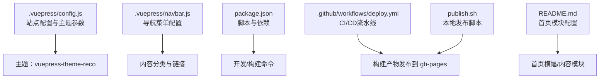
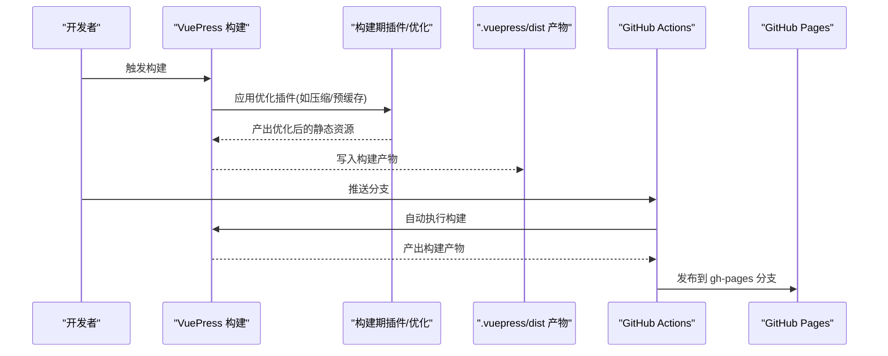
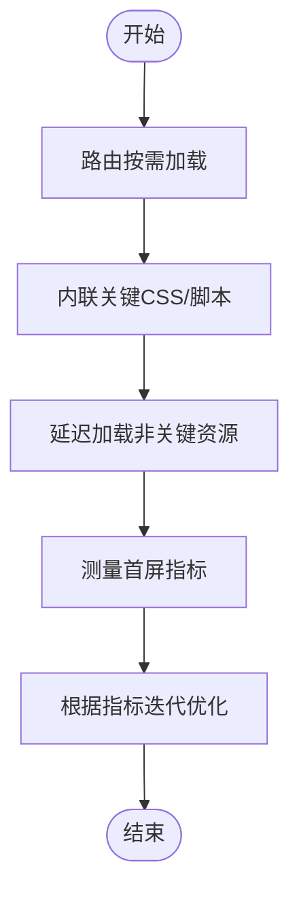
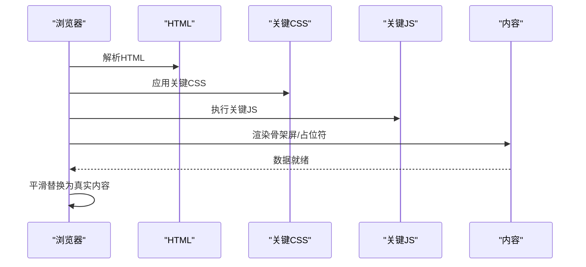
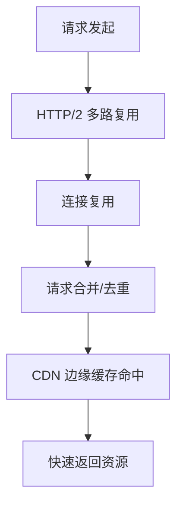
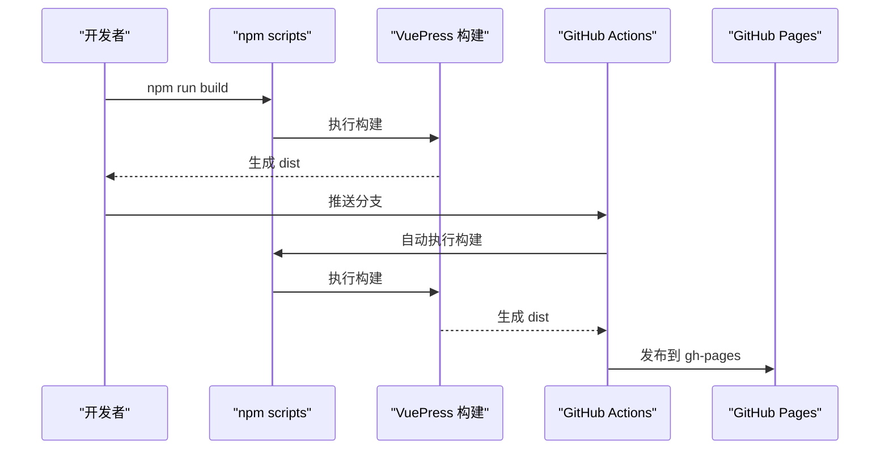
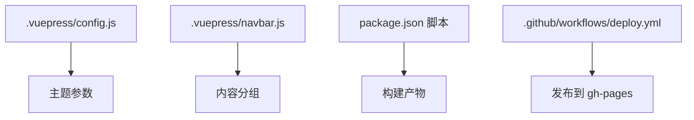

# 加载性能优化

<cite>
**本文引用的文件**
- [config.js](file://.vuepress/config.js)
- [navbar.js](file://.vuepress/navbar.js)
- [package.json](file://package.json)
- [deploy.yml](file://.github/workflows/deploy.yml)
- [publish.sh](file://publish.sh)
- [README.md](file://README.md)
- [first_page_time.md](file://docs/interview/vue/first_page_time.md)
- [webpack/case.md](file://.vuepress/reference/wangtunan/webpack/webpack/case.md)
- [http.js](file://.vuepress/series/interview/http.js)
</cite>

## 目录
1. [简介](#简介)
2. [项目结构](#项目结构)
3. [核心组件](#核心组件)
4. [架构总览](#架构总览)
5. [详细组件分析](#详细组件分析)
6. [依赖关系分析](#依赖关系分析)
7. [性能考量](#性能考量)
8. [故障排查指南](#故障排查指南)
9. [结论](#结论)
10. [附录](#附录)

## 简介
本指南面向使用 VuePress 的静态站点，围绕首屏加载时间优化、页面渲染优化、网络请求优化、缓存策略与移动端/弱网适配等方面，提供可落地的实践路径。结合项目现有配置与文档，给出从构建到部署、从资源加载到运行时体验的系统化优化建议。

## 项目结构
本项目基于 VuePress 2 主题进行内容组织与导航配置，采用 GitHub Actions 自动化构建与部署至 GitHub Pages。整体结构清晰，便于在构建阶段集成性能优化能力。

图表来源
- [.vuepress/config.js:1-18](file://.vuepress/config.js#L1-L18)
- [.vuepress/navbar.js:1-142](file://.vuepress/navbar.js#L1-L142)
- [package.json:1-17](file://package.json#L1-L17)
- [.github/workflows/deploy.yml:1-36](file://.github/workflows/deploy.yml#L1-L36)
- [publish.sh:1-20](file://publish.sh#L1-L20)
- [README.md:1-12](file://README.md#L1-L12)

章节来源
- [.vuepress/config.js:1-18](file://.vuepress/config.js#L1-L18)
- [.vuepress/navbar.js:1-142](file://.vuepress/navbar.js#L1-L142)
- [package.json:1-17](file://package.json#L1-L17)
- [.github/workflows/deploy.yml:1-36](file://.github/workflows/deploy.yml#L1-L36)
- [publish.sh:1-20](file://publish.sh#L1-L20)
- [README.md:1-12](file://README.md#L1-L12)

## 核心组件
- 站点配置与主题
  - 基础路径、标题、描述、Logo、主题参数等在站点配置中集中管理，便于统一控制构建输出与运行时行为。
- 导航与内容组织
  - 导航菜单覆盖多领域知识体系，有助于在构建时进行内容分组与资源优先级规划。
- 构建与部署
  - 通过 npm 脚本与 GitHub Actions 实现自动化构建与发布，适合在构建阶段集成性能优化插件与产物压缩。
- 首页模块
  - 首页通过模块化配置定义横幅与内容区域，利于在构建阶段对关键视觉元素进行关键渲染路径优化。

章节来源
- [.vuepress/config.js:1-18](file://.vuepress/config.js#L1-L18)
- [.vuepress/navbar.js:1-142](file://.vuepress/navbar.js#L1-L142)
- [package.json:1-17](file://package.json#L1-L17)
- [README.md:1-12](file://README.md#L1-L12)

## 架构总览
下图展示了从开发到发布的整体链路，以及在构建阶段可插入的关键性能优化点。

图表来源
- [package.json:8-12](file://package.json#L8-L12)
- [.github/workflows/deploy.yml:18-36](file://.github/workflows/deploy.yml#L18-L36)
- [.vuepress/config.js:9](file://.vuepress/config.js#L9)

## 详细组件分析

### 首屏加载时间优化
- 路由懒加载与代码分割
  - 通过路由动态导入实现按需加载，减小初始包体，缩短首屏可交互时间。
- 资源体积控制
  - 压缩与去重：在构建阶段启用压缩与公共依赖抽取，降低传输体积。
- 关键资源内联
  - 对极少量关键 CSS/脚本进行内联，缩短首字节时间；其余资源延迟加载。
- 渲染阻塞规避
  - 将非关键脚本标记为异步或推迟执行，避免阻塞 DOMContentLoaded。

章节来源
- [docs/interview/vue/first_page_time.md:62-79](file://docs/interview/vue/first_page_time.md#L62-L79)
- [docs/interview/vue/first_page_time.md:138-171](file://docs/interview/vue/first_page_time.md#L138-L171)

### 页面渲染优化与骨架屏
- 骨架屏/占位符
  - 首屏渲染采用骨架屏或占位符，提升感知速度；内容加载完成后平滑过渡。
- 关键渲染路径
  - 保证首屏所需 CSS/HTML/JS 最小化并尽快到达，避免不必要的回流与重绘。

章节来源
- [docs/interview/vue/first_page_time.md:82-91](file://docs/interview/vue/first_page_time.md#L82-L91)

### 网络请求优化
- HTTP/2 与连接复用
  - 启用 HTTP/2，利用多路复用与头部压缩减少连接建立与队头阻塞。
- 请求合并与资源复用
  - 合理合并小文件，减少请求数；对重复资源使用强缓存。
- CDN 与边缘缓存
  - 将静态资源托管至 CDN，就近分发，降低时延。

章节来源
- [.vuepress/series/interview/http.js:1-16](file://.vuepress/series/interview/http.js#L1-L16)

### 缓存策略配置
- 浏览器缓存
  - 设置合理的 Cache-Control/LRU 策略，区分静态资源与动态接口。
- Service Worker 离线缓存
  - 通过构建期插件生成 SW，预缓存关键资源，实现离线可用与秒开。
- CDN 缓存
  - 配置 CDN 缓存策略与刷新机制，确保版本更新与一致性。

章节来源
- [docs/interview/vue/first_page_time.md:86-88](file://docs/interview/vue/first_page_time.md#L86-L88)
- [.vuepress/reference/wangtunan/webpack/webpack/case.md:4-29](file://.vuepress/reference/wangtunan/webpack/webpack/case.md#L4-L29)

### 移动端与弱网环境适配
- 资源压缩与格式优化
  - 图片采用现代格式（WebP）与自适应尺寸；脚本与样式开启压缩。
- 降级策略
  - 弱网自动切换低质量资源或骨架屏，保障可读性与可用性。
- 网络感知
  - 结合网络类型与带宽，动态调整资源加载优先级与并发数。

章节来源
- [docs/interview/vue/first_page_time.md:128-135](file://docs/interview/vue/first_page_time.md#L128-L135)

### 构建与部署链路中的优化点
- 构建脚本与依赖
  - 使用统一的构建脚本，确保在生产环境启用压缩与缓存策略。
- 自动化部署
  - 通过 CI 自动构建并发布到 gh-pages，减少人工干预带来的不一致。

图表来源
- [package.json:8-12](file://package.json#L8-L12)
- [.github/workflows/deploy.yml:18-36](file://.github/workflows/deploy.yml#L18-L36)

章节来源
- [package.json:1-17](file://package.json#L1-17)
- [.github/workflows/deploy.yml:1-36](file://.github/workflows/deploy.yml#L1-L36)
- [publish.sh:1-20](file://publish.sh#L1-L20)

## 依赖关系分析
- 主题与配置
  - 站点配置依赖主题参数，主题参数影响构建产物的样式与交互行为。
- 导航与内容
  - 导航菜单决定内容分组与访问路径，间接影响资源加载优先级与缓存策略。
- 构建与部署
  - 构建脚本与 CI 工作流共同决定产物质量与发布效率。

图表来源
- [.vuepress/config.js:1-18](file://.vuepress/config.js#L1-L18)
- [.vuepress/navbar.js:1-142](file://.vuepress/navbar.js#L1-L142)
- [package.json:8-12](file://package.json#L8-L12)
- [.github/workflows/deploy.yml:26-36](file://.github/workflows/deploy.yml#L26-L36)

章节来源
- [.vuepress/config.js:1-18](file://.vuepress/config.js#L1-L18)
- [.vuepress/navbar.js:1-142](file://.vuepress/navbar.js#L1-L142)
- [package.json:1-17](file://package.json#L1-L17)
- [.github/workflows/deploy.yml:1-36](file://.github/workflows/deploy.yml#L1-L36)

## 性能考量
- 构建期优化
  - 在构建阶段启用压缩、去重与预缓存，显著降低传输体积与首屏等待。
- 运行时优化
  - 首屏关键资源内联、非关键资源延迟加载；合理使用缓存与 CDN。
- 监控与迭代
  - 建立首屏指标监控，持续迭代优化策略。

## 故障排查指南
- 首屏指标异常
  - 检查关键 CSS/JS 是否正确内联，是否存在阻塞渲染的脚本。
- 缓存未生效
  - 校验缓存头与 CDN 配置，确认 Service Worker 预缓存清单是否正确。
- 部署产物缺失
  - 确认 CI 工作流是否正确构建与发布，检查发布分支与权限。

章节来源
- [docs/interview/vue/first_page_time.md:19-35](file://docs/interview/vue/first_page_time.md#L19-L35)
- [.github/workflows/deploy.yml:26-36](file://.github/workflows/deploy.yml#L26-L36)

## 结论
通过在构建阶段集成压缩、缓存与预缓存，在运行时采用关键渲染路径优化与骨架屏策略，并结合 CDN 与 Service Worker，可显著提升 VuePress 站点的首屏加载性能。配合自动化部署与监控，形成闭环优化体系，持续改善用户体验。

## 附录
- 相关文档与参考
  - 首屏加载优化思路与实践
  - PWA 与 Service Worker 预缓存配置示例
  - HTTP 系列知识点（CDN、DNS、HTTP/1.1/2.0、HTTPS、TCP/IP、WebSocket 等）

章节来源
- [docs/interview/vue/first_page_time.md:1-200](file://docs/interview/vue/first_page_time.md#L1-L200)
- [.vuepress/reference/wangtunan/webpack/webpack/case.md:1-54](file://.vuepress/reference/wangtunan/webpack/webpack/case.md#L1-L54)
- [.vuepress/series/interview/http.js:1-16](file://.vuepress/series/interview/http.js#L1-L16)