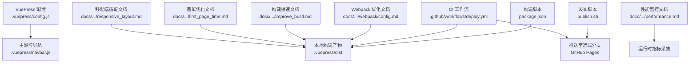
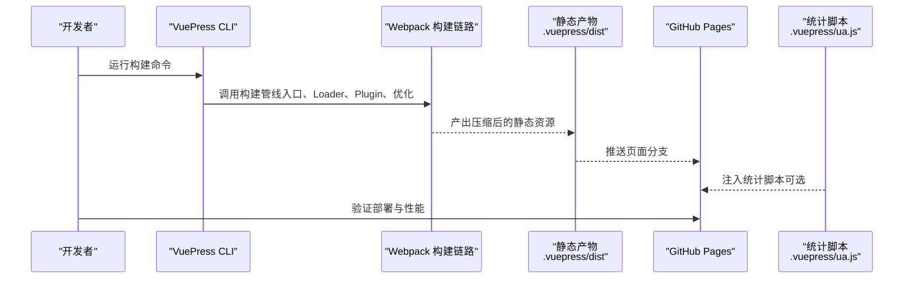
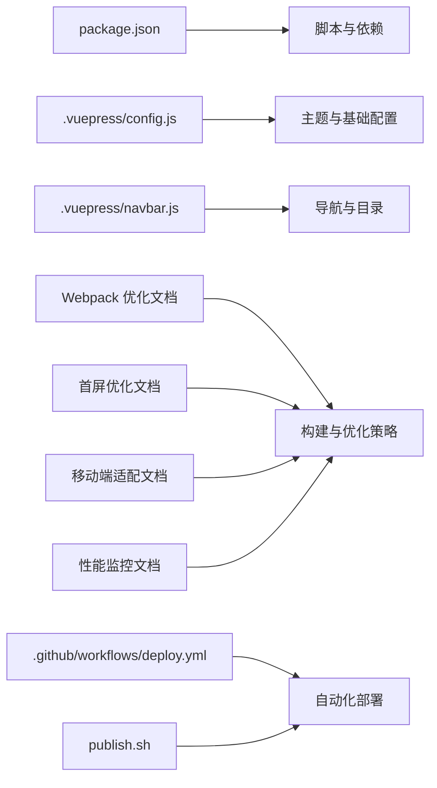

# 性能优化

<cite>
**本文引用的文件**
- [package.json](file://package.json)
- [.vuepress/config.js](file://.vuepress/config.js)
- [.vuepress/navbar.js](file://.vuepress/navbar.js)
- [publish.sh](file://publish.sh)
- [.github/workflows/deploy.yml](file://.github/workflows/deploy.yml)
- [docs/frontend-advanced/webpack/config.md](file://docs/frontend-advanced/webpack/config.md)
- [docs/interview/webpack/improve_build.md](file://docs/interview/webpack/improve_build.md)
- [docs/interview/vue/first_page_time.md](file://docs/interview/vue/first_page_time.md)
- [docs/interview/css/responsive_layout.md](file://docs/interview/css/responsive_layout.md)
- [docs/interview/node/performance.md](file://docs/interview/node/performance.md)
- [.vuepress/reference/wangtunan/webpack/webpack/advanced.md](file://.vuepress/reference/wangtunan/webpack/webpack/advanced.md)
- [.vuepress/reference/wangtunan/.vuepress/ua.js](file://.vuepress/reference/wangtunan/.vuepress/ua.js)
</cite>

## 目录
1. [简介](#简介)
2. [项目结构](#项目结构)
3. [核心组件](#核心组件)
4. [架构总览](#架构总览)
5. [详细组件分析](#详细组件分析)
6. [依赖分析](#依赖分析)
7. [性能考量](#性能考量)
8. [故障排查指南](#故障排查指南)
9. [结论](#结论)
10. [附录](#附录)

## 简介
本指南面向使用 VuePress 的静态站点，围绕性能优化提供系统化实践，涵盖静态资源优化与压缩、图片懒加载、代码分割、缓存策略、Webpack 配置优化与构建提速、SEO 优化、首屏加载时间优化、移动端适配、CDN 与静态资源托管、以及性能监控与持续集成部署。内容基于仓库现有配置与文档整理，帮助开发者在不侵入主题的前提下，最大化站点性能与可维护性。

## 项目结构
- 配置层：VuePress 主题与基础配置位于 .vuepress/config.js；导航菜单在 .vuepress/navbar.js。
- 构建与部署：package.json 定义构建脚本；publish.sh 与 .github/workflows/deploy.yml 提供本地与 CI 部署流程。
- 文档与参考：docs/frontend-advanced/webpack/config.md、docs/interview/webpack/improve_build.md 等文档提供了 Webpack 优化与构建提速的实操要点；docs/interview/vue/first_page_time.md、docs/interview/css/responsive_layout.md 提供首屏与移动端适配思路；docs/interview/node/performance.md 提供性能监控指标与方法；.vuepress/reference/wangtunan/webpack/webpack/advanced.md 提供多环境配置组织与打包产物结构建议；.vuepress/reference/wangtunan/.vuepress/ua.js 提供统计脚本注入参考。

**图表来源**
- [.vuepress/config.js:1-18](file://.vuepress/config.js#L1-L18)
- [.vuepress/navbar.js:1-142](file://.vuepress/navbar.js#L1-L142)
- [package.json:1-17](file://package.json#L1-L17)
- [publish.sh:1-20](file://publish.sh#L1-L20)
- [.github/workflows/deploy.yml:1-36](file://.github/workflows/deploy.yml#L1-L36)
- [docs/frontend-advanced/webpack/config.md:1-890](file://docs/frontend-advanced/webpack/config.md#L1-L890)
- [docs/interview/webpack/improve_build.md:166-222](file://docs/interview/webpack/improve_build.md#L166-L222)
- [docs/interview/vue/first_page_time.md:134-184](file://docs/interview/vue/first_page_time.md#L134-L184)
- [docs/interview/css/responsive_layout.md:1-141](file://docs/interview/css/responsive_layout.md#L1-L141)
- [docs/interview/node/performance.md:1-58](file://docs/interview/node/performance.md#L1-L58)

**章节来源**
- [.vuepress/config.js:1-18](file://.vuepress/config.js#L1-L18)
- [.vuepress/navbar.js:1-142](file://.vuepress/navbar.js#L1-L142)
- [package.json:1-17](file://package.json#L1-L17)
- [publish.sh:1-20](file://publish.sh#L1-L20)
- [.github/workflows/deploy.yml:1-36](file://.github/workflows/deploy.yml#L1-L36)

## 核心组件
- VuePress 主题与基础配置：负责站点标题、描述、基础路径、主题样式与导航等。
- 导航与目录：通过 navbar.js 组织多层级导航，便于用户快速定位内容，间接影响首屏内容可见性与交互路径。
- 构建与部署：本地 npm run build 产出静态资源；publish.sh 与 GitHub Actions 自动化部署至 GitHub Pages。
- Webpack 优化参考：文档提供代码分割、Tree Shaking、压缩、缓存与构建提速等策略，可迁移至 VuePress 的构建链路。
- 性能监控：Node 性能指标采集与监控方法，可用于服务端或本地开发环境的性能观测。

**章节来源**
- [.vuepress/config.js:1-18](file://.vuepress/config.js#L1-L18)
- [.vuepress/navbar.js:1-142](file://.vuepress/navbar.js#L1-L142)
- [package.json:8-12](file://package.json#L8-L12)
- [publish.sh:1-20](file://publish.sh#L1-L20)
- [.github/workflows/deploy.yml:18-36](file://.github/workflows/deploy.yml#L18-L36)
- [docs/frontend-advanced/webpack/config.md:544-856](file://docs/frontend-advanced/webpack/config.md#L544-L856)
- [docs/interview/node/performance.md:1-58](file://docs/interview/node/performance.md#L1-L58)

## 架构总览
下图展示了从开发到部署的关键路径，以及与性能优化相关的环节（构建、压缩、缓存、CDN、监控）：

**图表来源**
- [package.json:8-12](file://package.json#L8-L12)
- [.github/workflows/deploy.yml:18-36](file://.github/workflows/deploy.yml#L18-L36)
- [.vuepress/reference/wangtunan/.vuepress/ua.js:1-14](file://.vuepress/reference/wangtunan/.vuepress/ua.js#L1-L14)

## 详细组件分析

### 静态资源优化与压缩
- 资源类型与处理
  - 图片与字体：通过内置资源模块处理，支持输出路径与 publicPath 定制，便于后续 CDN 与缓存策略落地。
  - CSS/JS：通过压缩与 Tree Shaking 减少体积；生产环境建议开启压缩与副作用标记。
- 压缩与缓存
  - 压缩：可结合 Gzip/Brotli 在服务器侧启用；Webpack 侧可配合压缩插件与多进程压缩。
  - 缓存：通过 output.publicPath 与文件名指纹策略，配合长期缓存与协商缓存。
- 产物结构
  - 保持稳定的输出目录与文件命名，有利于 CDN 缓存命中与回滚。

**章节来源**
- [docs/frontend-advanced/webpack/config.md:58-62](file://docs/frontend-advanced/webpack/config.md#L58-L62)
- [docs/frontend-advanced/webpack/config.md:276-406](file://docs/frontend-advanced/webpack/config.md#L276-L406)
- [docs/interview/vue/first_page_time.md:138-171](file://docs/interview/vue/first_page_time.md#L138-L171)

### 图片懒加载与资源加载优化
- 懒加载策略
  - 优先使用浏览器原生 loading=lazy；对第三方图片可采用占位图与渐进加载。
  - 对大图与多图场景，采用响应式图片与 srcset，按设备像素比与视口选择合适尺寸。
- 资源提示
  - 使用 preload/prefetch 提示关键与未来资源，优化关键路径与空闲带宽利用。
- 渲染优化
  - 首屏关键 CSS 内联，非关键 CSS 异步加载；避免阻塞渲染的脚本与样式。

**章节来源**
- [docs/frontend-advanced/webpack/config.md:552-560](file://docs/frontend-advanced/webpack/config.md#L552-L560)
- [docs/interview/css/responsive_layout.md:23-141](file://docs/interview/css/responsive_layout.md#L23-L141)

### 代码分割与按需加载
- 入口与动态导入
  - 通过动态 import() 将路由或组件拆分，配合魔法注释命名 chunk，提升缓存命中与加载效率。
- SplitChunks 与缓存组
  - 合理设置最小体积、最大并行请求数与缓存组优先级，平衡缓存稳定性与更新频率。
- Tree Shaking
  - 配合 usedExports 与副作用标记，移除未使用代码，减小包体。

**章节来源**
- [docs/frontend-advanced/webpack/config.md:544-611](file://docs/frontend-advanced/webpack/config.md#L544-L611)
- [docs/frontend-advanced/webpack/config.md:661-669](file://docs/frontend-advanced/webpack/config.md#L661-L669)

### 缓存策略与长期缓存
- 文件指纹与命名
  - 使用 contenthash/长缓存友好命名策略，确保资源更新时指纹变化。
- 缓存控制
  - 通过 output.publicPath 与服务器端 Cache-Control/ETag 策略，实现强缓存与协商缓存。
- CDN 与边缘缓存
  - 将静态资源托管至 CDN，结合全球节点与持久缓存，显著降低首屏时延。

**章节来源**
- [docs/frontend-advanced/webpack/config.md:294-300](file://docs/frontend-advanced/webpack/config.md#L294-L300)
- [docs/frontend-advanced/webpack/config.md:384-397](file://docs/frontend-advanced/webpack/config.md#L384-L397)

### Webpack 配置优化与构建速度提升
- 多环境配置组织
  - 将公共配置与开发/生产配置分离，避免重复与冲突；通过合并工具统一管理。
- Loader 与解析优化
  - 缩小 Loader 应用范围、减少 resolve 条目、禁用符号链接解析、启用 noParse。
- 构建提速
  - 多进程压缩、缓存 Loader、合理 sourceMap、避免生产环境不必要的优化步骤。
- 运行时优化
  - runtimeChunk 策略、模块 ID 算法、最小化器配置。

**章节来源**
- [.vuepress/reference/wangtunan/webpack/webpack/advanced.md:122-190](file://.vuepress/reference/wangtunan/webpack/webpack/advanced.md#L122-L190)
- [docs/interview/webpack/improve_build.md:166-222](file://docs/interview/webpack/improve_build.md#L166-L222)
- [docs/frontend-advanced/webpack/config.md:638-659](file://docs/frontend-advanced/webpack/config.md#L638-L659)
- [docs/frontend-advanced/webpack/config.md:702-789](file://docs/frontend-advanced/webpack/config.md#L702-L789)

### SEO 优化与首屏加载时间优化
- SEO 基础
  - 标题、描述、Open Graph、结构化数据等元信息完善；避免 404 与死链。
- 首屏优化
  - 关键资源内联、骨架屏/占位图、预加载关键资源、减少主线程阻塞。
- 服务器侧优化
  - Gzip/Brotli 压缩、HTTP/2 多路复用、CDN 边缘加速。
- 统计与埋点
  - 注入统计脚本（如百度统计），辅助性能与用户行为分析。

**章节来源**
- [.vuepress/config.js:6-8](file://.vuepress/config.js#L6-L8)
- [docs/interview/vue/first_page_time.md:138-184](file://docs/interview/vue/first_page_time.md#L138-L184)
- [.vuepress/reference/wangtunan/.vuepress/ua.js:1-14](file://.vuepress/reference/wangtunan/.vuepress/ua.js#L1-L14)

### 移动端适配与响应式布局
- viewport 与媒体查询
  - 正确设置 viewport，结合媒体查询与 rem/vw 等单位实现灵活布局。
- 图片与字体
  - 使用 srcset 与响应式图片，避免移动端加载过大资源。
- 交互与渲染
  - 避免移动端卡顿，减少首屏阻塞，优先加载可见区域内容。

**章节来源**
- [docs/interview/css/responsive_layout.md:23-141](file://docs/interview/css/responsive_layout.md#L23-L141)

### CDN 配置与静态资源托管
- 资源托管
  - 将构建产物托管至 CDN，结合自定义域名与缓存策略，提升全球访问速度。
- 输出路径与 publicPath
  - 通过 output.publicPath 与资源生成器配置，确保资源引用与缓存一致。
- 回滚与灰度
  - 基于指纹与版本化策略，实现平滑回滚与灰度发布。

**章节来源**
- [docs/frontend-advanced/webpack/config.md:384-397](file://docs/frontend-advanced/webpack/config.md#L384-L397)
- [docs/frontend-advanced/webpack/config.md:201-243](file://docs/frontend-advanced/webpack/config.md#L201-L243)

### 性能监控与优化实践
- 指标体系
  - CPU、内存、I/O、网络等维度监控；关注首屏时间、TTFB、FP/LCP 等关键指标。
- 采集与上报
  - 在运行时采集内存、网络与渲染指标，结合日志与监控平台进行趋势分析。
- 优化闭环
  - 建立性能基线，定期回归测试，形成“观测—分析—优化—验证”的闭环。

**章节来源**
- [docs/interview/node/performance.md:1-58](file://docs/interview/node/performance.md#L1-L58)

## 依赖分析
- 构建与部署
  - package.json 定义 dev/build 脚本；publish.sh 与 GitHub Actions 自动化部署。
- 主题与配置
  - VuePress 主题与基础配置集中于 .vuepress/config.js；导航在 navbar.js。
- 优化参考
  - Webpack 优化与构建提速、首屏优化、移动端适配、性能监控等文档提供策略与实操。

**图表来源**
- [package.json:1-17](file://package.json#L1-L17)
- [.vuepress/config.js:1-18](file://.vuepress/config.js#L1-L18)
- [.vuepress/navbar.js:1-142](file://.vuepress/navbar.js#L1-L142)
- [docs/frontend-advanced/webpack/config.md:1-890](file://docs/frontend-advanced/webpack/config.md#L1-L890)
- [docs/interview/webpack/improve_build.md:166-222](file://docs/interview/webpack/improve_build.md#L166-L222)
- [docs/interview/vue/first_page_time.md:134-184](file://docs/interview/vue/first_page_time.md#L134-L184)
- [docs/interview/css/responsive_layout.md:1-141](file://docs/interview/css/responsive_layout.md#L1-L141)
- [docs/interview/node/performance.md:1-58](file://docs/interview/node/performance.md#L1-L58)
- [.github/workflows/deploy.yml:1-36](file://.github/workflows/deploy.yml#L1-L36)
- [publish.sh:1-20](file://publish.sh#L1-L20)

**章节来源**
- [package.json:1-17](file://package.json#L1-L17)
- [.vuepress/config.js:1-18](file://.vuepress/config.js#L1-L18)
- [.vuepress/navbar.js:1-142](file://.vuepress/navbar.js#L1-L142)
- [docs/frontend-advanced/webpack/config.md:1-890](file://docs/frontend-advanced/webpack/config.md#L1-L890)
- [docs/interview/webpack/improve_build.md:166-222](file://docs/interview/webpack/improve_build.md#L166-L222)
- [docs/interview/vue/first_page_time.md:134-184](file://docs/interview/vue/first_page_time.md#L134-L184)
- [docs/interview/css/responsive_layout.md:1-141](file://docs/interview/css/responsive_layout.md#L1-L141)
- [docs/interview/node/performance.md:1-58](file://docs/interview/node/performance.md#L1-L58)
- [.github/workflows/deploy.yml:1-36](file://.github/workflows/deploy.yml#L1-L36)
- [publish.sh:1-20](file://publish.sh#L1-L20)

## 性能考量
- 构建阶段
  - 合理划分环境配置、启用多进程压缩、缓存 Loader、减少解析开销。
- 运行阶段
  - 长期缓存与指纹策略、CDN 加速、Gzip/Brotli 压缩、关键资源预加载。
- 用户体验
  - 首屏优化、骨架屏、懒加载、移动端自适应、避免阻塞渲染的资源。

[本节为通用指导，无需列出具体文件来源]

## 故障排查指南
- 部署后 404
  - 检查基础路径与服务器静态资源目录配置，确保 SPA 路由回退至 index.html。
- 构建产物异常
  - 确认输出目录与 publicPath 配置一致；检查多环境配置合并是否正确。
- 性能不达预期
  - 使用性能监控指标定位瓶颈；逐步关闭非关键优化，验证收益。

**章节来源**
- [docs/interview/vue/404.md:1-57](file://docs/interview/vue/404.md#L1-L57)

## 结论
通过在 VuePress 项目中系统性地应用静态资源优化、代码分割、缓存与 CDN、首屏与移动端优化、以及性能监控与自动化部署，可显著提升站点性能与用户体验。建议以文档为依据，结合项目实际迭代优化策略，建立持续的性能治理流程。

[本节为总结性内容，无需列出具体文件来源]

## 附录
- 关键路径参考
  - 构建命令与脚本：[package.json:8-12](file://package.json#L8-L12)
  - 自动化部署：[deploy.yml:18-36](file://.github/workflows/deploy.yml#L18-L36)
  - 本地发布：[publish.sh:1-20](file://publish.sh#L1-L20)
  - 主题与基础配置：[config.js:1-18](file://.vuepress/config.js#L1-L18)
  - 导航配置：[navbar.js:1-142](file://.vuepress/navbar.js#L1-L142)
  - Webpack 优化与构建提速：[docs/frontend-advanced/webpack/config.md:1-890](file://docs/frontend-advanced/webpack/config.md#L1-L890)、[docs/interview/webpack/improve_build.md:166-222](file://docs/interview/webpack/improve_build.md#L166-L222)
  - 首屏优化：[docs/interview/vue/first_page_time.md:134-184](file://docs/interview/vue/first_page_time.md#L134-L184)
  - 移动端适配：[docs/interview/css/responsive_layout.md:1-141](file://docs/interview/css/responsive_layout.md#L1-L141)
  - 性能监控：[docs/interview/node/performance.md:1-58](file://docs/interview/node/performance.md#L1-L58)
  - 多环境配置组织：[.vuepress/reference/wangtunan/webpack/webpack/advanced.md:122-190](file://.vuepress/reference/wangtunan/webpack/webpack/advanced.md#L122-L190)
  - 统计脚本注入：[.vuepress/reference/wangtunan/.vuepress/ua.js:1-14](file://.vuepress/reference/wangtunan/.vuepress/ua.js#L1-L14)