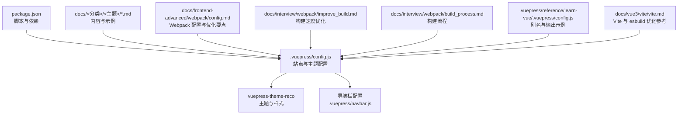
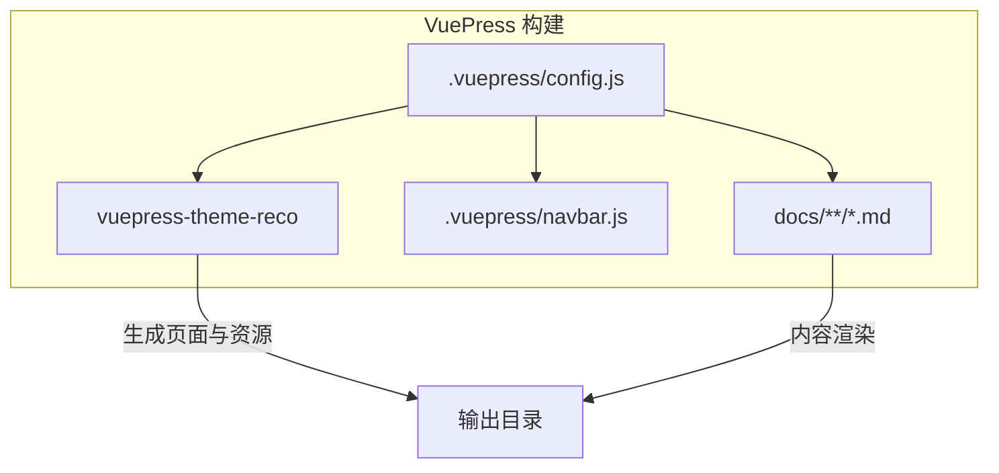
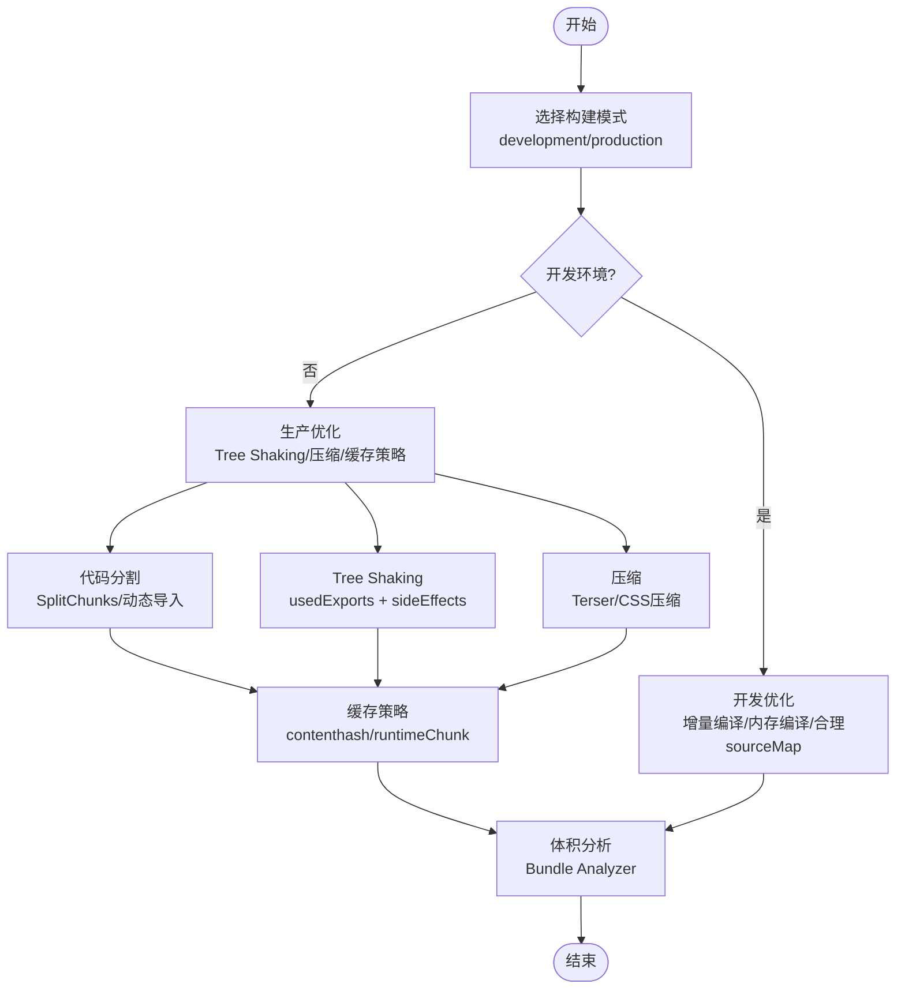
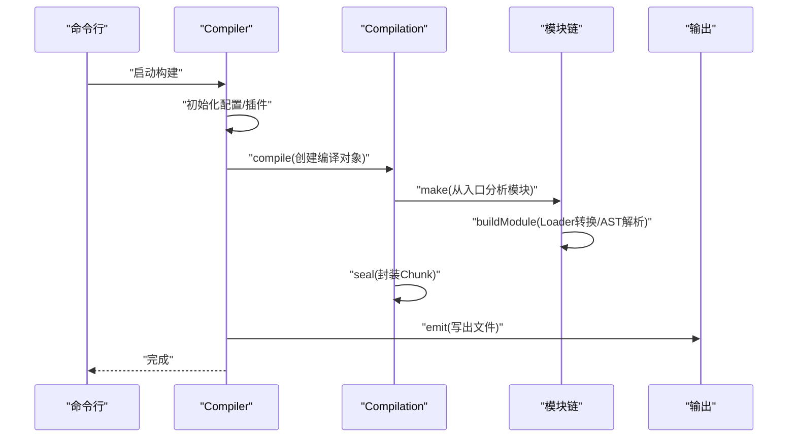
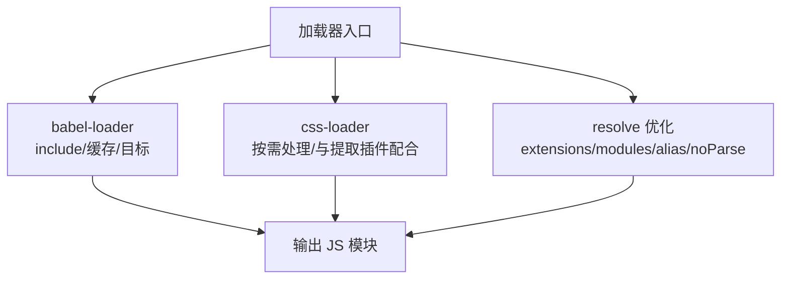
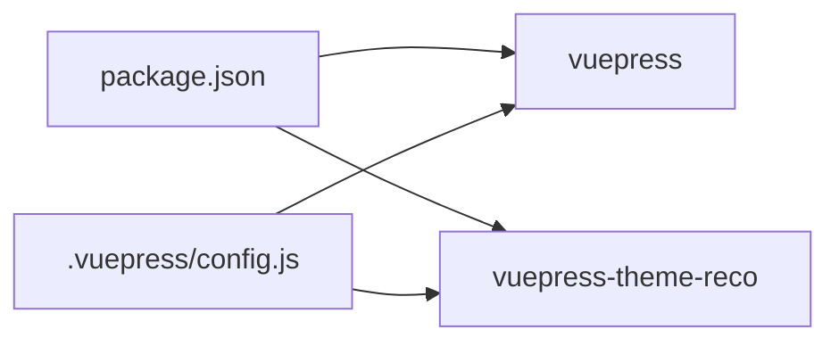

# 构建优化

<cite>
**本文引用的文件**
- [package.json](file://package.json)
- [.vuepress/config.js](file://.vuepress/config.js)
- [.vuepress/navbar.js](file://.vuepress/navbar.js)
- [docs/frontend-advanced/webpack/config.md](file://docs/frontend-advanced/webpack/config.md)
- [docs/interview/webpack/improve_build.md](file://docs/interview/webpack/improve_build.md)
- [docs/interview/webpack/build_process.md](file://docs/interview/webpack/build_process.md)
- [.vuepress/reference/learn-vue/.vuepress/config.js](file://.vuepress/reference/learn-vue/.vuepress/config.js)
- [docs/vue3/vite/vite.md](file://docs/vue3/vite/vite.md)
</cite>

## 目录
1. [简介](#简介)
2. [项目结构](#项目结构)
3. [核心组件](#核心组件)
4. [架构总览](#架构总览)
5. [详细组件分析](#详细组件分析)
6. [依赖分析](#依赖分析)
7. [性能考量](#性能考量)
8. [故障排查指南](#故障排查指南)
9. [结论](#结论)
10. [附录](#附录)

## 简介
本指南面向使用 VuePress 的项目，围绕构建优化展开，重点覆盖：
- Webpack 构建配置优化策略：代码分割、Tree Shaking、压缩配置等
- 加载器配置优化：babel-loader、css-loader 等以提升构建速度
- 生产环境优化：资源压缩、缓存策略
- 使用 Bundle Analyzer 分析包体积、识别冗余依赖
- 构建时间监控与性能分析方法
- 结合仓库现有文档与配置，给出可落地的实践建议

## 项目结构
该项目为 VuePress 2.x 主题项目，核心入口与主题配置位于 .vuepress 目录，文档内容分布在 docs 下。主题通过 vuepress-theme-reco 提供样式与交互能力，基础构建由 VuePress 内部驱动。

图表来源
- [package.json:1-17](file://package.json#L1-L17)
- [.vuepress/config.js:1-18](file://.vuepress/config.js#L1-L18)
- [.vuepress/navbar.js:1-142](file://.vuepress/navbar.js#L1-L142)
- [docs/frontend-advanced/webpack/config.md:1-890](file://docs/frontend-advanced/webpack/config.md#L1-L890)
- [docs/interview/webpack/improve_build.md:1-222](file://docs/interview/webpack/improve_build.md#L1-L222)
- [docs/interview/webpack/build_process.md:1-219](file://docs/interview/webpack/build_process.md#L1-L219)
- [.vuepress/reference/learn-vue/.vuepress/config.js:1-73](file://.vuepress/reference/learn-vue/.vuepress/config.js#L1-L73)
- [docs/vue3/vite/vite.md:645-696](file://docs/vue3/vite/vite.md#L645-L696)

章节来源
- [package.json:1-17](file://package.json#L1-L17)
- [.vuepress/config.js:1-18](file://.vuepress/config.js#L1-L18)
- [.vuepress/navbar.js:1-142](file://.vuepress/navbar.js#L1-L142)

## 核心组件
- 站点与主题配置：定义标题、描述、基础路径、主题与样式等
- 主题与样式：vuepress-theme-reco 提供主题能力与默认样式
- 导航栏：组织文档分类与链接
- 文档与示例：包含大量 Webpack 与构建优化相关文档

章节来源
- [.vuepress/config.js:5-17](file://.vuepress/config.js#L5-L17)
- [.vuepress/navbar.js:1-142](file://.vuepress/navbar.js#L1-L142)

## 架构总览
VuePress 2.x 通过主题与配置驱动构建，内部使用打包工具（Webpack 或 Vite）进行资源处理与输出。本项目以 VuePress 主题为核心，构建流程由主题与配置共同决定。

图表来源
- [.vuepress/config.js:1-18](file://.vuepress/config.js#L1-L18)
- [.vuepress/navbar.js:1-142](file://.vuepress/navbar.js#L1-L142)

## 详细组件分析

### Webpack 构建配置优化（策略与落地）
- 代码分割
  - 入口分离与动态导入：通过动态 import() 与魔法注释实现按需加载与命名 chunk
  - SplitChunks：合理设置缓存组、最小体积、最大并行请求数，提升缓存命中与加载性能
- Tree Shaking
  - 使用 usedExports 与 package.json sideEffects 配置，剔除未使用导出
  - 注意样式与副作用模块需纳入 sideEffects 白名单
- 压缩配置
  - 生产环境启用压缩（如 Terser），并开启多进程以提升速度
  - CSS 压缩可通过 CssMinimizer 插件接入
- 加载器优化
  - babel-loader：限定 include 范围、开启缓存、选择合适的目标环境
  - css-loader：按需处理样式，避免不必要的模块转换
- 输出与缓存
  - 使用 contenthash/全量 hash 与 deterministic 策略，提升缓存稳定性
  - runtimeChunk/single 策略减少重复运行时代码
- 性能与体积分析
  - 使用 Bundle Analyzer 生成可视化报告，定位大体积模块与冗余依赖

图表来源
- [docs/frontend-advanced/webpack/config.md:544-611](file://docs/frontend-advanced/webpack/config.md#L544-L611)
- [docs/frontend-advanced/webpack/config.md:661-669](file://docs/frontend-advanced/webpack/config.md#L661-L669)
- [docs/frontend-advanced/webpack/config.md:702-788](file://docs/frontend-advanced/webpack/config.md#L702-L788)
- [docs/interview/webpack/improve_build.md:31-222](file://docs/interview/webpack/improve_build.md#L31-L222)

章节来源
- [docs/frontend-advanced/webpack/config.md:544-611](file://docs/frontend-advanced/webpack/config.md#L544-L611)
- [docs/frontend-advanced/webpack/config.md:661-669](file://docs/frontend-advanced/webpack/config.md#L661-L669)
- [docs/frontend-advanced/webpack/config.md:702-788](file://docs/frontend-advanced/webpack/config.md#L702-L788)
- [docs/interview/webpack/improve_build.md:31-222](file://docs/interview/webpack/improve_build.md#L31-L222)

### 构建流程（初始化—编译—输出）
- 初始化：读取配置与参数，初始化 Compiler 与插件执行环境
- 编译：从入口出发，递归解析模块依赖，调用 Loader 转换，生成 AST 并收集依赖
- 输出：封装 Chunk，生成文件并输出到文件系统

图表来源
- [docs/interview/webpack/build_process.md:109-204](file://docs/interview/webpack/build_process.md#L109-L204)

章节来源
- [docs/interview/webpack/build_process.md:109-204](file://docs/interview/webpack/build_process.md#L109-L204)

### 加载器与解析优化（babel-loader、css-loader 等）
- babel-loader
  - 限定 include 范围，避免对 node_modules 全量处理
  - 开启缓存（cacheDirectory），显著提升二次构建速度
  - 选择合适的目标环境与预设，减少转换成本
- css-loader
  - 按需处理样式，避免对非样式资源的不必要转换
  - 与 MiniCssExtractPlugin 或内联方案配合，平衡体积与加载性能
- 解析优化
  - resolve.extensions 与 resolve.modules 精简查找路径
  - resolve.alias 指向常用目录，减少层级查找
  - noParse 忽略大型稳定库（如 jQuery、Lodash）

图表来源
- [docs/interview/webpack/improve_build.md:31-107](file://docs/interview/webpack/improve_build.md#L31-L107)
- [docs/frontend-advanced/webpack/config.md:53-61](file://docs/frontend-advanced/webpack/config.md#L53-L61)
- [docs/frontend-advanced/webpack/config.md:92-135](file://docs/frontend-advanced/webpack/config.md#L92-L135)

章节来源
- [docs/interview/webpack/improve_build.md:31-107](file://docs/interview/webpack/improve_build.md#L31-L107)
- [docs/frontend-advanced/webpack/config.md:53-61](file://docs/frontend-advanced/webpack/config.md#L53-L61)
- [docs/frontend-advanced/webpack/config.md:92-135](file://docs/frontend-advanced/webpack/config.md#L92-L135)

### 生产环境优化（资源压缩、缓存策略）
- 资源压缩
  - JS：TerserPlugin 多进程压缩
  - CSS：CssMinimizer 接入
- 缓存策略
  - contenthash/全量 hash：提升缓存命中率
  - deterministic：稳定 ID 便于长期缓存
  - runtimeChunk/single：复用运行时，减少重复
- 输出与路径
  - publicPath 与输出目录规划，结合 CDN 与静态资源部署策略

章节来源
- [docs/frontend-advanced/webpack/config.md:702-788](file://docs/frontend-advanced/webpack/config.md#L702-L788)
- [docs/interview/webpack/improve_build.md:184-198](file://docs/interview/webpack/improve_build.md#L184-L198)

### 使用 Bundle Analyzer 分析包体积
- 安装与集成：在生产配置中添加 BundleAnalyzerPlugin
- 分析与优化：根据报告定位大体积模块与冗余依赖，针对性拆分与剔除

章节来源
- [.vuepress/reference/learn-vue/.vuepress/config.js:10-21](file://.vuepress/reference/learn-vue/.vuepress/config.js#L10-L21)

### 构建时间监控与性能分析
- 监控手段
  - 使用 Bundle Analyzer 生成体积报告
  - 通过构建日志与统计信息观察耗时热点
- 优化闭环
  - 识别瓶颈（大模块/重复依赖/不必要转换）
  - 落地优化（拆分/剔除/缓存/并行）
  - 回测验证（体积变化与加载性能）

章节来源
- [docs/interview/webpack/improve_build.md:1-222](file://docs/interview/webpack/improve_build.md#L1-L222)
- [docs/frontend-advanced/webpack/config.md:638-658](file://docs/frontend-advanced/webpack/config.md#L638-L658)

## 依赖分析
- 项目依赖
  - vuepress 2.0.0-beta.60
  - vuepress-theme-reco 2.0.0-beta.53
- 脚本
  - dev/start：vuepress dev .
  - build：vuepress build .

图表来源
- [package.json:8-16](file://package.json#L8-L16)
- [.vuepress/config.js:10-16](file://.vuepress/config.js#L10-L16)

章节来源
- [package.json:1-17](file://package.json#L1-L17)
- [.vuepress/config.js:1-18](file://.vuepress/config.js#L1-L18)

## 性能考量
- 通用建议
  - 使用较新版本 Node 与打包工具
  - loader 仅作用于必要模块
  - 解析路径精简，避免过多文件系统查询
  - 合理使用 noParse 忽略大型稳定库
- 开发环境
  - 增量编译与内存编译
  - 合理的 sourceMap 与 devtool
  - 避免生产专用优化步骤
- 生产环境
  - 适度的 sourceMap 与压缩策略
  - Tree Shaking 与代码分割
  - 缓存与运行时优化

章节来源
- [docs/frontend-advanced/webpack/config.md:638-658](file://docs/frontend-advanced/webpack/config.md#L638-L658)
- [docs/interview/webpack/improve_build.md:18-26](file://docs/interview/webpack/improve_build.md#L18-L26)

## 故障排查指南
- 构建缓慢
  - 检查 loader include/exclude 是否过宽
  - 开启 babel-loader 缓存
  - 使用 cache-loader 缓存昂贵转换
  - 启用 Terser 多进程
- 体积过大
  - 使用 Bundle Analyzer 定位大模块
  - 检查是否遗漏 Tree Shaking 配置
  - 评估 SplitChunks 与动态导入策略
- 缓存失效频繁
  - 使用 contenthash/全量 hash
  - 稳定模块 ID（deterministic）
  - 合理 runtimeChunk 策略

章节来源
- [docs/interview/webpack/improve_build.md:31-222](file://docs/interview/webpack/improve_build.md#L31-L222)
- [docs/frontend-advanced/webpack/config.md:544-611](file://docs/frontend-advanced/webpack/config.md#L544-L611)
- [docs/frontend-advanced/webpack/config.md:702-788](file://docs/frontend-advanced/webpack/config.md#L702-L788)

## 结论
本指南基于仓库现有文档与配置，给出了 VuePress 项目在构建优化方面的系统化实践建议。通过合理配置代码分割、Tree Shaking、压缩与缓存策略，并结合 Bundle Analyzer 与构建流程理解，可有效缩短构建时间、降低包体积并提升加载性能。

## 附录
- 参考文档
  - Webpack 配置与优化要点
  - 构建速度优化
  - 构建流程
  - Vite 与 esbuild 优化参考（可作为对比与迁移参考）

章节来源
- [docs/frontend-advanced/webpack/config.md:1-890](file://docs/frontend-advanced/webpack/config.md#L1-L890)
- [docs/interview/webpack/improve_build.md:1-222](file://docs/interview/webpack/improve_build.md#L1-L222)
- [docs/interview/webpack/build_process.md:1-219](file://docs/interview/webpack/build_process.md#L1-L219)
- [docs/vue3/vite/vite.md:645-696](file://docs/vue3/vite/vite.md#L645-L696)