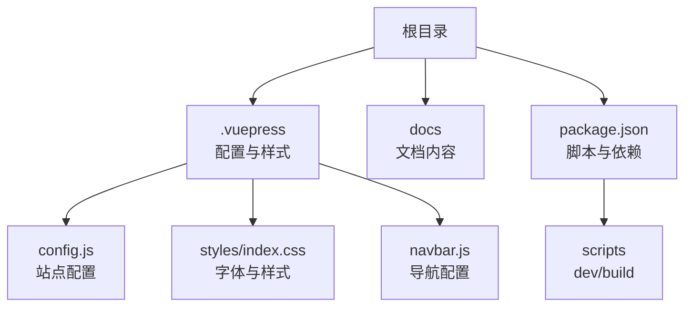
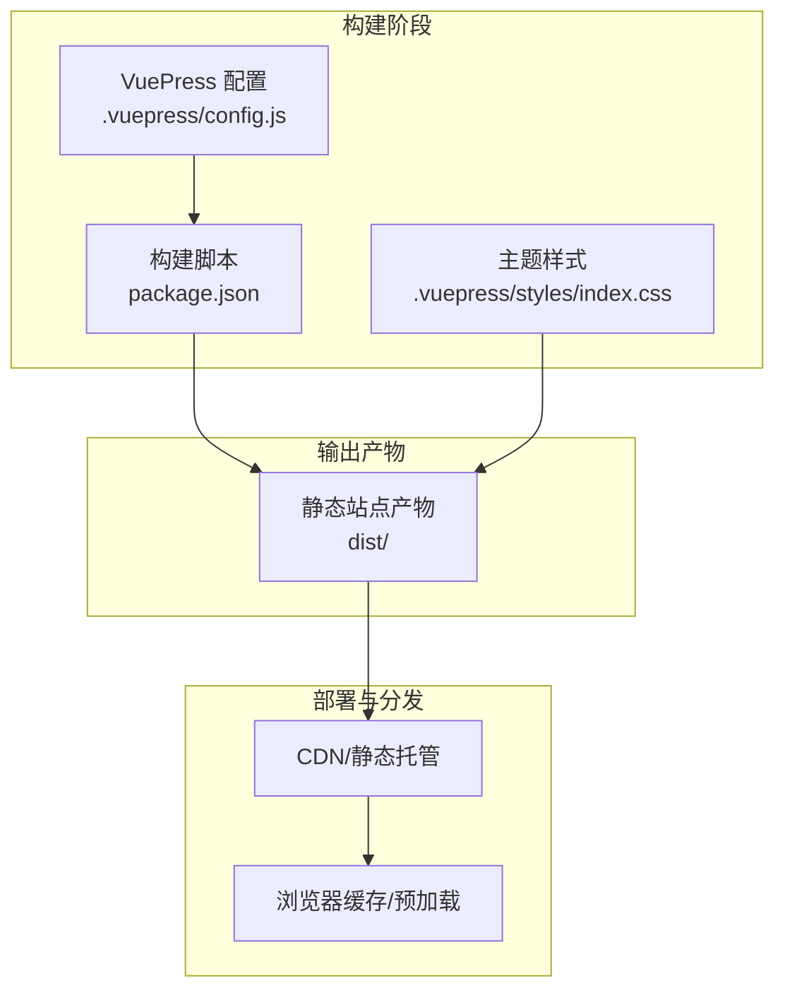
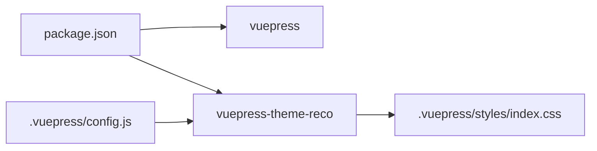

# 资源优化

<cite>
**本文引用的文件**
- [.vuepress/config.js](file://.vuepress/config.js)
- [package.json](file://package.json)
- [.vuepress/styles/index.css](file://.vuepress/styles/index.css)
- [README.md](file://README.md)
- [.vuepress/navbar.js](file://.vuepress/navbar.js)
</cite>

## 目录
1. [简介](#简介)
2. [项目结构](#项目结构)
3. [核心组件](#核心组件)
4. [架构总览](#架构总览)
5. [详细组件分析](#详细组件分析)
6. [依赖分析](#依赖分析)
7. [性能考量](#性能考量)
8. [故障排查指南](#故障排查指南)
9. [结论](#结论)
10. [附录](#附录)

## 简介
本指南面向 VuePress 项目（基于主题：vuepress-theme-reco）的资源优化实践，聚焦于静态资源处理策略（图片、字体、CSS/JS）、CDN 与静态资源托管、版本管理与缓存策略、图片懒加载、资源预加载/预取、资源指纹与缓存失效、第三方资源加载优化等。文档以仓库现有配置与文件为基础，结合最佳实践给出可落地的优化建议与实施路径。

## 项目结构
- 构建与主题配置位于 .vuepress 目录，核心入口为配置文件与导航栏配置。
- 样式自定义通过 .vuepress/styles/index.css 实现，包含字体声明与页面排版优化。
- 文档内容分布在 docs 目录，其中包含大量 Markdown 文档与内嵌图片引用示例。
- 包管理与构建脚本在 package.json 中定义，使用 VuePress 2 的构建命令进行站点生成。

**图表来源**
- [.vuepress/config.js:1-18](file://.vuepress/config.js#L1-L18)
- [.vuepress/styles/index.css:1-105](file://.vuepress/styles/index.css#L1-L105)
- [.vuepress/navbar.js:1-142](file://.vuepress/navbar.js#L1-L142)
- [package.json:1-17](file://package.json#L1-L17)

**章节来源**
- [.vuepress/config.js:1-18](file://.vuepress/config.js#L1-L18)
- [package.json:1-17](file://package.json#L1-L17)

## 核心组件
- 站点配置与基础路径
  - 基础路径 base 设置为“/my-blog/”，影响静态资源的相对路径与部署位置，需确保 CDN 或托管路径与之匹配。
  - 主题为 vuepress-theme-reco，样式与交互由主题提供，可在 .vuepress/styles 中扩展或覆盖。
- 字体与样式
  - 自定义字体声明与 font-display: swap，有助于避免 FOIT/FOUT 并改善首屏渲染。
  - 页面排版与目录样式优化，提升阅读体验。
- 导航与资源访问
  - 导航项包含外部链接，涉及第三方资源加载，应纳入优化与安全策略。

**章节来源**
- [.vuepress/config.js:1-18](file://.vuepress/config.js#L1-L18)
- [.vuepress/styles/index.css:1-105](file://.vuepress/styles/index.css#L1-L105)
- [.vuepress/navbar.js:1-142](file://.vuepress/navbar.js#L1-L142)

## 架构总览
下图展示从构建到部署的关键环节，以及资源优化关注点：

**图表来源**
- [.vuepress/config.js:1-18](file://.vuepress/config.js#L1-L18)
- [package.json:1-17](file://package.json#L1-L17)
- [.vuepress/styles/index.css:1-105](file://.vuepress/styles/index.css#L1-L105)

## 详细组件分析

### 图片压缩与懒加载
- 现状
  - 文档中存在多处图片引用示例，但仓库未见专门的图片压缩或懒加载配置。
- 优化建议
  - 构建期压缩：在 CI 中引入图片压缩工具链（如针对 PNG/JPEG/WebP），在构建前对 docs 下的图片进行无损/有损压缩与格式转换。
  - 运行期懒加载：在主题或自定义布局中启用图片懒加载（IntersectionObserver），仅在进入视口时加载图片，降低首屏带宽与内存占用。
  - 占位图与骨架屏：对大图采用低质量占位图或骨架屏，提升感知性能。
- 参考实施路径
  - 在构建脚本前后钩子中集成图片处理任务。
  - 使用主题提供的客户端增强能力注入懒加载逻辑。

**章节来源**
- [README.md:1-12](file://README.md#L1-L12)

### 字体优化
- 现状
  - 已声明自定义字体并设置 font-display: swap，有助于避免阻塞渲染。
- 优化建议
  - 字体子集化：仅包含页面实际使用的字符集，显著减小体积。
  - 字体格式优先级：优先使用 WOFF2，回退至 WOFF，确保兼容性。
  - 字体缓存：为字体资源设置长缓存策略，配合版本号或内容哈希。
  - 备选字体：确保系统字体作为回退，避免降级影响阅读体验。

**章节来源**
- [.vuepress/styles/index.css:1-20](file://.vuepress/styles/index.css#L1-L20)

### CSS/JS 压缩与分割
- 现状
  - VuePress 默认构建已包含压缩与最小化；主题样式与自定义样式均在构建时合并。
- 优化建议
  - 分割与按需加载：将主题样式与自定义样式拆分，按页面或功能模块按需加载。
  - Tree Shaking：确保未使用的样式与脚本被移除，减少体积。
  - Source Map：生产环境关闭或外置，平衡调试与安全性。
  - 预连接与预加载：对关键字体、图标、主题资源进行预连接或预加载，缩短关键路径。

**章节来源**
- [.vuepress/config.js:1-18](file://.vuepress/config.js#L1-L18)
- [.vuepress/styles/index.css:1-105](file://.vuepress/styles/index.css#L1-L105)

### CDN 配置与静态资源托管
- 现状
  - 基础路径 base 为“/my-blog/”，需确保 CDN 或托管路径一致。
- 优化建议
  - CDN 加速：将 dist/ 产物上传至 CDN，配置全球节点与边缘缓存。
  - 资源路径：保持 base 与 CDN 路径一致，避免相对路径导致的资源 404。
  - 回源策略：对 HTML 设置短缓存，对静态资源（JS/CSS/图片/字体）设置长缓存。
  - HTTPS 与安全：启用 HTTPS、HSTS、CSP 等安全策略。

**章节来源**
- [.vuepress/config.js:1-18](file://.vuepress/config.js#L1-L18)

### 版本管理与缓存策略
- 现状
  - 未见资源指纹或版本化策略。
- 优化建议
  - 资源指纹：为 JS/CSS/图片/字体添加内容哈希后缀，确保强缓存命中与更新可控。
  - 版本号：在 HTML 中注入构建版本号，用于全站级缓存失效。
  - 缓存层次：HTML 短缓存，静态资源长缓存；对动态内容（如搜索索引）单独控制。
  - 渐进式失效：先对新资源启用缓存，观察后再推广至旧资源。

**章节来源**
- [.vuepress/config.js:1-18](file://.vuepress/config.js#L1-L18)

### 图片懒加载实现
- 现状
  - 未见懒加载配置。
- 优化建议
  - IntersectionObserver：在主题客户端增强中注册懒加载指令，仅在可见区域加载图片。
  - 占位策略：使用低质量占位图或空白占位，避免跳变。
  - 兼容性：为不支持的浏览器提供降级方案（如直接加载）。

**章节来源**
- [README.md:1-12](file://README.md#L1-L12)

### 资源预加载与预取
- 现状
  - 未见显式的预加载/预取配置。
- 优化建议
  - 关键字体与图标：使用 rel="prefetch/preload" 提前加载。
  - 首屏资源：对首屏关键 CSS/JS 进行预加载，非关键资源预取。
  - 第三方资源：对外部搜索、评论等插件资源进行预取，减少交互延迟。

**章节来源**
- [.vuepress/styles/index.css:1-105](file://.vuepress/styles/index.css#L1-L105)

### 第三方资源加载优化
- 现状
  - 导航中包含外部链接，涉及第三方资源加载。
- 优化建议
  - 异步加载：对非关键第三方脚本采用 async/defer，避免阻塞渲染。
  - 预连接：对第三方域名使用 rel="preconnect/dns-prefetch"，缩短握手时间。
  - 按需加载：仅在需要时加载第三方组件（如搜索、评论），减少初始负载。
  - 安全与隐私：限制第三方脚本权限，遵守隐私政策。

**章节来源**
- [.vuepress/navbar.js:1-142](file://.vuepress/navbar.js#L1-L142)

## 依赖分析
- 构建与主题依赖
  - VuePress 2 与主题依赖在 package.json 中声明，构建脚本使用默认命令。
- 样式与主题关系
  - 自定义样式与主题样式共同决定最终渲染效果，需注意覆盖顺序与冲突。

**图表来源**
- [package.json:1-17](file://package.json#L1-L17)
- [.vuepress/config.js:1-18](file://.vuepress/config.js#L1-L18)
- [.vuepress/styles/index.css:1-105](file://.vuepress/styles/index.css#L1-L105)

**章节来源**
- [package.json:1-17](file://package.json#L1-L17)
- [.vuepress/config.js:1-18](file://.vuepress/config.js#L1-L18)

## 性能考量
- 关键指标
  - 首屏渲染时间（FCP/LCP）、交互可用时间（INP）、资源体积与请求数。
- 优化重点
  - 减少阻塞：压缩与分割、异步加载、预加载/预取。
  - 提升感知：占位图、骨架屏、字体与关键资源优先加载。
  - 缓存策略：合理设置缓存头与版本化，避免陈旧资源。
- 监控与回归
  - 使用 Web Vitals 与 Lighthouse 持续监控，建立回归测试。

## 故障排查指南
- 资源 404
  - 检查 base 路径与部署路径是否一致；确认 CDN/托管路径映射正确。
- 字体加载异常
  - 确认字体格式与路径；检查跨域与缓存头；验证 font-display 行为。
- 第三方资源阻塞
  - 检查加载方式（同步/异步）、预连接配置与域名白名单。
- 缓存问题
  - 核对缓存头与指纹策略；清理浏览器缓存与 CDN 缓存；验证版本号生效。

## 结论
本指南基于现有 VuePress 项目配置，提出了从构建到部署的资源优化实践路径。建议优先落实图片压缩、字体子集化、资源指纹与缓存策略，并结合懒加载、预加载/预取与第三方资源异步化，持续监控与迭代，以获得更优的加载性能与用户体验。

## 附录
- 快速清单
  - 启用图片压缩与 WebP 转换
  - 字体子集化与 WOFF2 优先
  - 为静态资源添加内容哈希与长缓存
  - 首屏关键资源预加载，非关键资源预取
  - 第三方资源异步加载与预连接
  - 监控 Web Vitals 与 Lighthouse