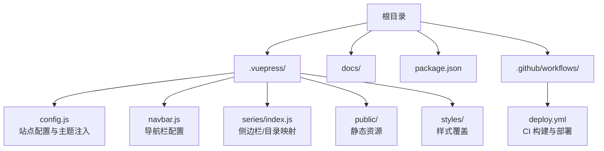
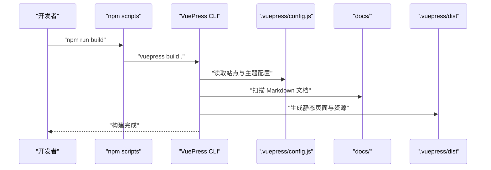
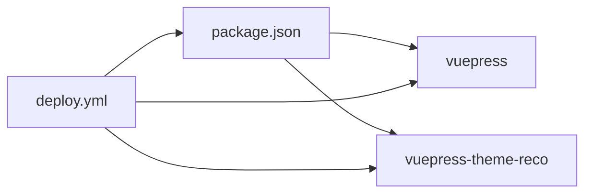

# 本地构建

<cite>
**本文引用的文件**
- [package.json](file://package.json)
- [.vuepress/config.js](file://.vuepress/config.js)
- [.vuepress/navbar.js](file://.vuepress/navbar.js)
- [.vuepress/series/index.js](file://.vuepress/series/index.js)
- [publish.sh](file://publish.sh)
- [.github/workflows/deploy.yml](file://.github/workflows/deploy.yml)
- [README.md](file://README.md)
</cite>

## 目录
1. [简介](#简介)
2. [项目结构](#项目结构)
3. [核心组件](#核心组件)
4. [架构概览](#架构概览)
5. [详细组件分析](#详细组件分析)
6. [依赖分析](#依赖分析)
7. [性能考虑](#性能考虑)
8. [故障排查指南](#故障排查指南)
9. [结论](#结论)
10. [附录](#附录)

## 简介
本指南面向开发者，提供本地构建 VuePress 项目的完整操作手册与最佳实践。内容涵盖：
- 构建命令与工作原理
- 构建产物目录与结构说明
- 构建前准备与环境检查清单
- 常见错误排查与解决方案
- 本地与 CI/CD 的构建差异与注意事项

## 项目结构
该项目为 VuePress 2.x 主题项目，采用主题推荐器（vuepress-theme-reco）作为默认主题，站点基础路径通过配置项进行设置，导航栏与系列目录通过独立模块注入。

图表来源
- [.vuepress/config.js:1-18](file://.vuepress/config.js#L1-L18)
- [.vuepress/navbar.js:1-142](file://.vuepress/navbar.js#L1-L142)
- [.vuepress/series/index.js:1-58](file://.vuepress/series/index.js#L1-L58)
- [.github/workflows/deploy.yml:1-36](file://.github/workflows/deploy.yml#L1-L36)

章节来源
- [.vuepress/config.js:1-18](file://.vuepress/config.js#L1-L18)
- [.vuepress/navbar.js:1-142](file://.vuepress/navbar.js#L1-L142)
- [.vuepress/series/index.js:1-58](file://.vuepress/series/index.js#L1-L58)
- [.github/workflows/deploy.yml:1-36](file://.github/workflows/deploy.yml#L1-L36)

## 核心组件
- 构建脚本与命令
  - 本地开发：npm run dev 或 npm start
  - 生产构建：npm run build
- 站点配置
  - 站点标题、描述、图标、基础路径、主题与主题参数
- 导航栏与目录
  - 导航栏数组与系列目录映射，决定页面入口与侧边栏结构
- CI/CD 配置
  - GitHub Actions 工作流负责安装依赖、执行构建并将产物部署至 GitHub Pages

章节来源
- [package.json:8-12](file://package.json#L8-L12)
- [.vuepress/config.js:5-17](file://.vuepress/config.js#L5-L17)
- [.vuepress/navbar.js:1-142](file://.vuepress/navbar.js#L1-L142)
- [.vuepress/series/index.js:29-57](file://.vuepress/series/index.js#L29-L57)
- [.github/workflows/deploy.yml:18-35](file://.github/workflows/deploy.yml#L18-L35)

## 架构概览
本地构建从 package.json 中的 scripts 触发 VuePress CLI，读取 .vuepress/config.js 中的主题与站点配置，扫描 docs 目录生成页面，最终输出到 .vuepress/dist。CI/CD 流程复用相同构建步骤，并将 dist 推送至 GitHub Pages。

图表来源
- [package.json:8-12](file://package.json#L8-L12)
- [.vuepress/config.js:5-17](file://.vuepress/config.js#L5-L17)

## 详细组件分析

### 构建命令与工作原理
- 命令入口
  - npm run build 对应 vuepress build .，用于生产环境构建
- 构建流程要点
  - 解析站点配置（标题、描述、图标、基础路径、主题）
  - 扫描 docs 目录，按文件层级与 frontmatter 生成页面
  - 应用主题样式与导航栏/侧边栏配置
  - 输出静态资源到 .vuepress/dist

章节来源
- [package.json:8-12](file://package.json#L8-L12)
- [.vuepress/config.js:5-17](file://.vuepress/config.js#L5-L17)

### 构建产物目录与结构
- 输出目录
  - .vuepress/dist：构建产物的静态站点目录
- 典型结构
  - HTML 页面（按路由生成）
  - 静态资源（CSS、JS、图片等）
  - 基础路径 base 影响资源与链接的相对路径
- 注意事项
  - 若 base 非根路径，需确保托管服务正确配置路径前缀
  - 本地预览可使用静态服务器或 VuePress dev 命令

章节来源
- [.vuepress/config.js:9-9](file://.vuepress/config.js#L9-L9)
- [.github/workflows/deploy.yml:30-30](file://.github/workflows/deploy.yml#L30-L30)

### 导航栏与系列目录
- 导航栏
  - 通过 .vuepress/navbar.js 定义多级菜单与链接
- 系列目录
  - 通过 .vuepress/series/index.js 将 docs 子目录映射为侧边栏
- 影响
  - 决定页面入口、面包屑与侧边栏结构
  - 构建时会依据这些配置生成对应页面与链接

章节来源
- [.vuepress/navbar.js:1-142](file://.vuepress/navbar.js#L1-L142)
- [.vuepress/series/index.js:29-57](file://.vuepress/series/index.js#L29-L57)

### CI/CD 构建与部署
- 本地脚本
  - publish.sh：本地构建后将 dist 推送到远端分支 page
- GitHub Actions
  - 自动安装依赖、执行构建、将 .vuepress/dist 部署到 GitHub Pages

章节来源
- [publish.sh:4-14](file://publish.sh#L4-L14)
- [.github/workflows/deploy.yml:18-35](file://.github/workflows/deploy.yml#L18-L35)

## 依赖分析
- 核心依赖
  - vuepress：2.0.0-beta.60
  - vuepress-theme-reco：2.0.0-beta.53
- 本地与 CI 的差异
  - 本地可能使用不同包管理器（npm/yarn/pnpm），但命令一致
  - CI 使用固定 Node 版本（示例为 16.x）

图表来源
- [package.json:13-16](file://package.json#L13-L16)
- [.github/workflows/deploy.yml:20-24](file://.github/workflows/deploy.yml#L20-L24)

章节来源
- [package.json:13-16](file://package.json#L13-L16)
- [.github/workflows/deploy.yml:20-24](file://.github/workflows/deploy.yml#L20-L24)

## 性能考虑
- 构建优化建议
  - 控制文档数量与复杂度，避免过多深度嵌套
  - 合理使用 frontmatter 与插件，减少不必要的处理
  - 使用主题提供的缓存与压缩策略（如主题内置）
- 资源优化
  - 图片与媒体资源尽量压缩与懒加载
  - 避免在 Markdown 中使用过大的内联资源
- 基础路径影响
  - base 设置会影响资源路径与缓存命中，建议保持稳定

## 故障排查指南
- 构建失败：找不到依赖
  - 现象：安装阶段报错或构建阶段找不到模块
  - 排查：确认 Node 版本与包管理器版本；尝试清理缓存后重装依赖
  - 参考：CI 中固定 Node 版本与安装步骤
- 构建成功但页面空白或资源 404
  - 现象：访问页面白屏或资源加载失败
  - 排查：检查 base 配置是否与托管路径一致；确认 dist 目录结构
  - 参考：站点配置中的 base 与 CI 部署路径
- 导航栏/侧边栏不生效
  - 现象：页面缺少导航或目录
  - 排查：核对 navbar.js 与 series/index.js 的路径与键名
- 本地与 CI 构建结果不一致
  - 现象：本地可运行，CI 失败
  - 排查：统一 Node 版本、依赖版本与构建命令；检查 CI 中的安装与构建步骤
- 本地预览与线上不一致
  - 现象：本地 dev 正常，dist 预览异常
  - 排查：确认基础路径、静态资源引用与托管配置

章节来源
- [.vuepress/config.js:9-9](file://.vuepress/config.js#L9-L9)
- [.vuepress/navbar.js:1-142](file://.vuepress/navbar.js#L1-L142)
- [.vuepress/series/index.js:29-57](file://.vuepress/series/index.js#L29-L57)
- [.github/workflows/deploy.yml:20-24](file://.github/workflows/deploy.yml#L20-L24)
- [publish.sh:4-14](file://publish.sh#L4-L14)

## 结论
本地构建的关键在于理解 VuePress 的配置与命令流程，确保站点配置、导航与目录映射正确，以及基础路径与托管路径一致。结合 CI/CD 流程可实现自动化构建与部署。遵循本文的准备清单与排障建议，可显著降低构建与部署风险。

## 附录

### 本地构建操作手册（步骤）
- 准备工作
  - 确认 Node.js 版本（建议与 CI 一致）
  - 安装依赖（npm/yarn/pnpm 任选其一）
  - 确认 .vuepress/config.js、navbar.js、series/index.js 配置正确
- 执行构建
  - 运行 npm run build
  - 检查 .vuepress/dist 是否生成
- 本地预览
  - 使用静态服务器或 npm run dev 预览
- 提交与部署
  - 如需手动推送，可参考 publish.sh 的流程

章节来源
- [package.json:8-12](file://package.json#L8-L12)
- [.vuepress/config.js:5-17](file://.vuepress/config.js#L5-L17)
- [.vuepress/navbar.js:1-142](file://.vuepress/navbar.js#L1-L142)
- [.vuepress/series/index.js:29-57](file://.vuepress/series/index.js#L29-L57)
- [publish.sh:4-14](file://publish.sh#L4-L14)

### 环境检查清单
- Node.js 版本与包管理器
- 依赖安装是否成功
- 站点配置（title/description/logo/base/theme）是否正确
- 导航栏与系列目录映射是否完整
- 基础路径与托管路径是否一致
- 构建产物目录是否存在且可访问

章节来源
- [.vuepress/config.js:5-17](file://.vuepress/config.js#L5-L17)
- [.vuepress/navbar.js:1-142](file://.vuepress/navbar.js#L1-L142)
- [.vuepress/series/index.js:29-57](file://.vuepress/series/index.js#L29-L57)
- [.github/workflows/deploy.yml:20-24](file://.github/workflows/deploy.yml#L20-L24)