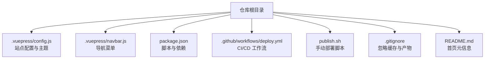
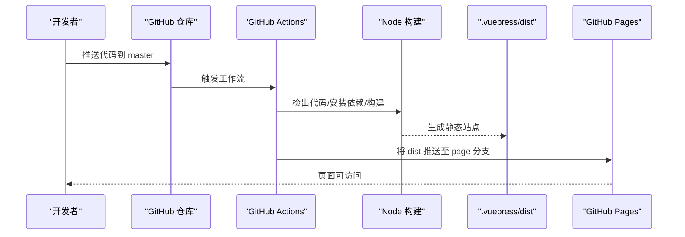
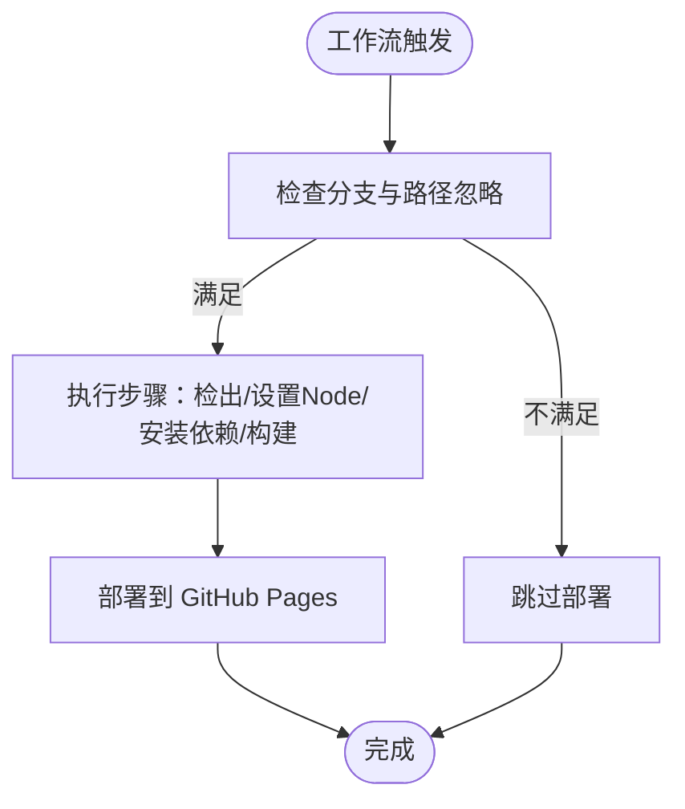
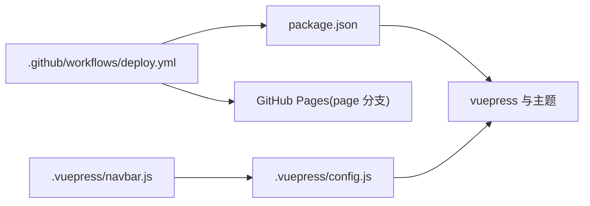

# 监控维护

<cite>
**本文引用的文件**
- [.github/workflows/deploy.yml](file://.github/workflows/deploy.yml)
- [package.json](file://package.json)
- [publish.sh](file://publish.sh)
- [.vuepress/config.js](file://.vuepress/config.js)
- [.vuepress/navbar.js](file://.vuepress/navbar.js)
- [.gitignore](file://.gitignore)
- [README.md](file://README.md)
- [docs/frontend-advanced/project-architecture/introduction.md](file://docs/frontend-advanced/project-architecture/introduction.md)
</cite>

## 目录
1. [引言](#引言)
2. [项目结构](#项目结构)
3. [核心组件](#核心组件)
4. [架构总览](#架构总览)
5. [详细组件分析](#详细组件分析)
6. [依赖分析](#依赖分析)
7. [性能考量](#性能考量)
8. [故障排查指南](#故障排查指南)
9. [结论](#结论)
10. [附录](#附录)

## 引言
本指南面向项目维护者与运营人员，围绕构建状态监控、部署日志分析、GitHub Actions 工作流监控与调试、网站可用性监控与访问统计、版本更新与依赖升级、安全补丁维护、备份与数据恢复等主题，提供可落地的操作流程与应急处理建议。文档同时给出可视化图示，帮助非技术读者理解整体运维闭环。

## 项目结构
该项目为 VuePress 文档站点，采用 GitHub Actions 自动化构建与部署至 GitHub Pages。关键路径与职责概览：
- 构建与主题配置：.vuepress/config.js、.vuepress/navbar.js
- 构建脚本与依赖：package.json
- 自动化部署：.github/workflows/deploy.yml
- 手动部署脚本：publish.sh
- 版本与缓存忽略：.gitignore
- 仓库首页元信息：README.md

图表来源
- [.vuepress/config.js:1-18](file://.vuepress/config.js#L1-L18)
- [.vuepress/navbar.js:1-142](file://.vuepress/navbar.js#L1-L142)
- [package.json:1-17](file://package.json#L1-L17)
- [.github/workflows/deploy.yml:1-36](file://.github/workflows/deploy.yml#L1-L36)
- [publish.sh:1-20](file://publish.sh#L1-L20)
- [.gitignore:1-8](file://.gitignore#L1-L8)
- [README.md:1-12](file://README.md#L1-L12)

章节来源
- [.vuepress/config.js:1-18](file://.vuepress/config.js#L1-L18)
- [.vuepress/navbar.js:1-142](file://.vuepress/navbar.js#L1-L142)
- [package.json:1-17](file://package.json#L1-L17)
- [.github/workflows/deploy.yml:1-36](file://.github/workflows/deploy.yml#L1-L36)
- [publish.sh:1-20](file://publish.sh#L1-L20)
- [.gitignore:1-8](file://.gitignore#L1-L8)
- [README.md:1-12](file://README.md#L1-L12)

## 核心组件
- 构建与主题配置
  - 站点标题、描述、基础路径、主题与导航等由 .vuepress/config.js 统一管理；导航由 .vuepress/navbar.js 维护。
- 构建脚本与依赖
  - package.json 定义 dev/build 脚本与依赖版本，确保本地与 CI 环境一致。
- 自动化部署
  - .github/workflows/deploy.yml 在 master 推送时触发，执行 checkout、安装依赖、构建、部署到 GitHub Pages。
- 手动部署
  - publish.sh 提供本地构建后推送到 GitHub Pages 的替代路径，便于离线或自建流水线集成。
- 忽略规则
  - .gitignore 忽略 .vuepress/dist、.vuepress/.cache、node_modules 等，避免无关文件进入仓库。

章节来源
- [.vuepress/config.js:1-18](file://.vuepress/config.js#L1-L18)
- [.vuepress/navbar.js:1-142](file://.vuepress/navbar.js#L1-L142)
- [package.json:1-17](file://package.json#L1-L17)
- [.github/workflows/deploy.yml:1-36](file://.github/workflows/deploy.yml#L1-L36)
- [publish.sh:1-20](file://publish.sh#L1-L20)
- [.gitignore:1-8](file://.gitignore#L1-L8)

## 架构总览
下图展示从代码提交到页面上线的完整链路，涵盖 CI 步骤、产物与分支映射、部署目标。

图表来源
- [.github/workflows/deploy.yml:1-36](file://.github/workflows/deploy.yml#L1-L36)
- [package.json:8-11](file://package.json#L8-L11)
- [.vuepress/config.js:9](file://.vuepress/config.js#L9)

## 详细组件分析

### GitHub Actions 工作流监控与调试
- 触发条件
  - master 分支推送触发；README.md 变更不触发部署。
- 关键步骤
  - 检出代码、设置 Node 版本、安装依赖、构建、部署到 GitHub Pages 的 page 分支。
- 监控要点
  - 任务运行日志：关注 checkout、install、build、Deploy 步骤的耗时与错误。
  - 分支与产物：确认构建产物目录与目标分支正确。
  - 密钥与凭据：检查 secrets 的 ACCESS_TOKEN、MY_USER_NAME、MY_USER_EMAIL 是否配置。
- 调试技巧
  - 临时添加调试步骤输出环境变量与目录结构。
  - 本地复现：使用相同 Node 版本与依赖安装方式，执行构建脚本。
  - 分段验证：先单独运行 install 与 build，再启用部署步骤。

图表来源
- [.github/workflows/deploy.yml:3-35](file://.github/workflows/deploy.yml#L3-L35)

章节来源
- [.github/workflows/deploy.yml:1-36](file://.github/workflows/deploy.yml#L1-L36)

### 构建状态监控与日志分析
- 本地构建
  - 使用 package.json 中的 build 脚本进行构建，确保 .vuepress/dist 生成。
- CI 构建
  - Actions 中的构建步骤与本地一致，若失败优先对比 Node 版本与依赖安装日志。
- 日志定位
  - 关注安装依赖阶段的网络与权限问题、构建阶段的样式/主题加载错误、部署阶段的权限与分支冲突。
- 常见问题
  - 依赖安装失败：检查网络、registry、锁文件。
  - 构建失败：检查主题版本兼容性与配置文件语法。
  - 部署失败：检查 ACCESS_TOKEN 权限与 page 分支保护策略。

章节来源
- [package.json:8-11](file://package.json#L8-L11)
- [.github/workflows/deploy.yml:18-24](file://.github/workflows/deploy.yml#L18-L24)

### 站点可用性监控与访问统计
- 可用性监控
  - 建议使用外部健康检查服务定期访问站点首页，检测响应码与首屏加载时间。
  - 对比不同地区与网络环境的访问质量，识别区域差异。
- 访问统计
  - 可在站点头部或页脚嵌入轻量统计脚本，采集 PV/UV、入口来源、设备信息等。
  - 结合 CI 构建日志中的部署时间与分支信息，形成“变更-访问波动”的关联分析。
- 报警阈值
  - 参考项目文档中的建议：日 PV/UV 显著下降、报错量激增、长时间无访问时触发报警。

章节来源
- [docs/frontend-advanced/project-architecture/introduction.md:37-66](file://docs/frontend-advanced/project-architecture/introduction.md#L37-L66)

### 版本更新、依赖升级与安全补丁
- 版本更新
  - 通过 package.json 的版本字段与依赖声明进行版本管理；升级前先在本地验证构建。
- 依赖升级
  - 使用 npm/yarn/pnpm 的升级命令更新依赖，执行安装与构建验证。
- 安全补丁
  - 定期扫描依赖漏洞，优先修复高危风险；在 CI 中加入安全扫描步骤。
- 回滚策略
  - 若升级导致构建失败，回退到上一个稳定提交与锁定的依赖版本。

章节来源
- [package.json:13-16](file://package.json#L13-L16)

### 备份策略与数据恢复
- 备份范围
  - 仓库源码与 .vuepress/dist 产物（如需保留历史页面快照）。
- 备份方式
  - 仓库本身即版本化备份；可定期导出 page 分支的静态产物作为归档。
- 恢复流程
  - 从最近一次成功的 CI 构建产物恢复；或从 page 分支回滚到稳定提交。
- 重要提示
  - .gitignore 已忽略 .vuepress/dist，若需备份请调整策略或在 CI 中额外归档。

章节来源
- [.gitignore:3-4](file://.gitignore#L3-L4)
- [.github/workflows/deploy.yml:30](file://.github/workflows/deploy.yml#L30)

## 依赖分析
- 组件耦合
  - 工作流依赖 package.json 的脚本与依赖；站点配置依赖主题与导航。
- 外部依赖
  - GitHub Actions Runner、GitHub Pages、Node 生态与主题包。
- 潜在风险
  - 主题版本升级可能影响构建；依赖版本不一致导致 CI 与本地差异。

图表来源
- [.github/workflows/deploy.yml:18-35](file://.github/workflows/deploy.yml#L18-L35)
- [package.json:8-16](file://package.json#L8-L16)
- [.vuepress/config.js:10-16](file://.vuepress/config.js#L10-L16)
- [.vuepress/navbar.js:1-142](file://.vuepress/navbar.js#L1-L142)

章节来源
- [.github/workflows/deploy.yml:18-35](file://.github/workflows/deploy.yml#L18-L35)
- [package.json:8-16](file://package.json#L8-L16)
- [.vuepress/config.js:10-16](file://.vuepress/config.js#L10-L16)
- [.vuepress/navbar.js:1-142](file://.vuepress/navbar.js#L1-L142)

## 性能考量
- 构建性能
  - 使用缓存策略减少依赖安装时间；在 CI 中复用依赖缓存。
- 部署性能
  - 控制构建产物体积，优化图片与样式；合理设置基础路径以减少资源查找开销。
- 可用性与体验
  - 通过健康检查与访问统计持续观测站点性能与稳定性。

## 故障排查指南
- 构建失败
  - 检查 Node 版本与依赖安装日志；核对 package.json 脚本与主题版本。
- 部署失败
  - 核对 ACCESS_TOKEN 权限、page 分支保护策略与用户名/邮箱配置。
- 本地与 CI 差异
  - 使用相同 Node 版本与依赖安装方式复现；对比环境变量与工作目录。
- 回滚与恢复
  - 基于 CI 成功记录回滚；必要时从 page 分支恢复到稳定提交。

章节来源
- [.github/workflows/deploy.yml:18-35](file://.github/workflows/deploy.yml#L18-L35)
- [publish.sh:4-14](file://publish.sh#L4-L14)

## 结论
本指南提供了从构建到部署、从监控到维护的完整运维闭环。通过规范化的 CI 流程、可观测的站点指标与完善的备份恢复策略，可显著提升项目的稳定性与可维护性。建议将本文流程纳入团队标准作业程序，并在实践中持续迭代。

## 附录
- 快速检查清单
  - CI 工作流是否成功运行并完成部署
  - 构建产物是否存在且可访问
  - page 分支是否为公开可访问
  - 依赖与主题版本是否与本地一致
  - 是否配置并验证健康检查与访问统计
  - 是否具备回滚与恢复路径