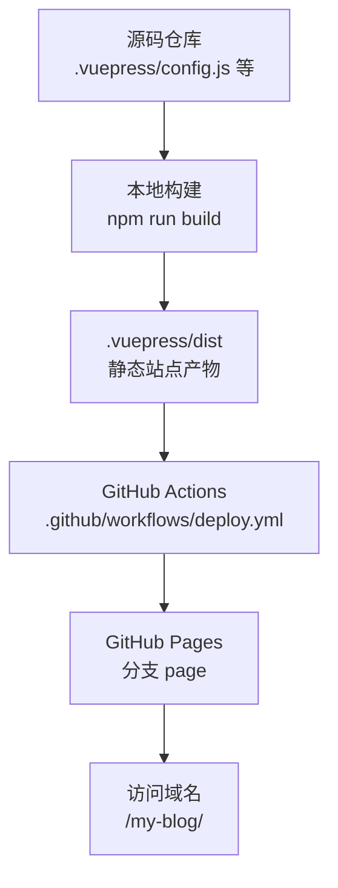
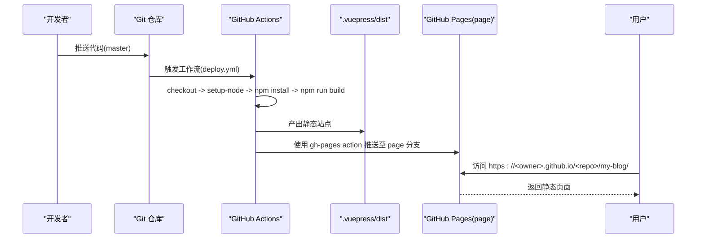
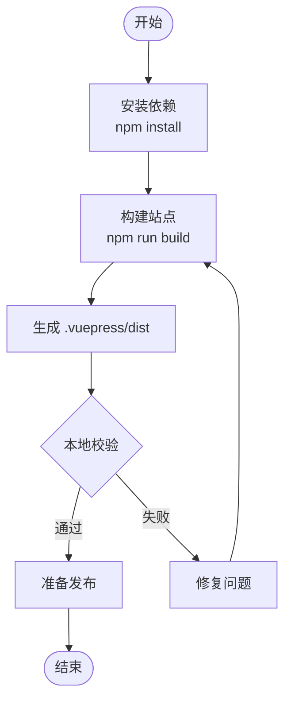
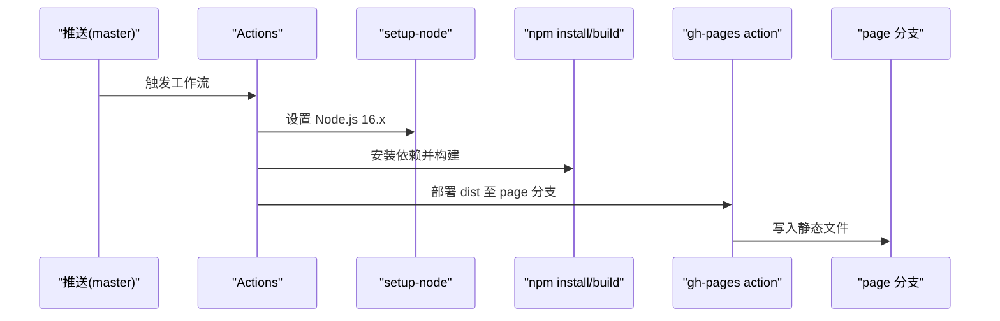
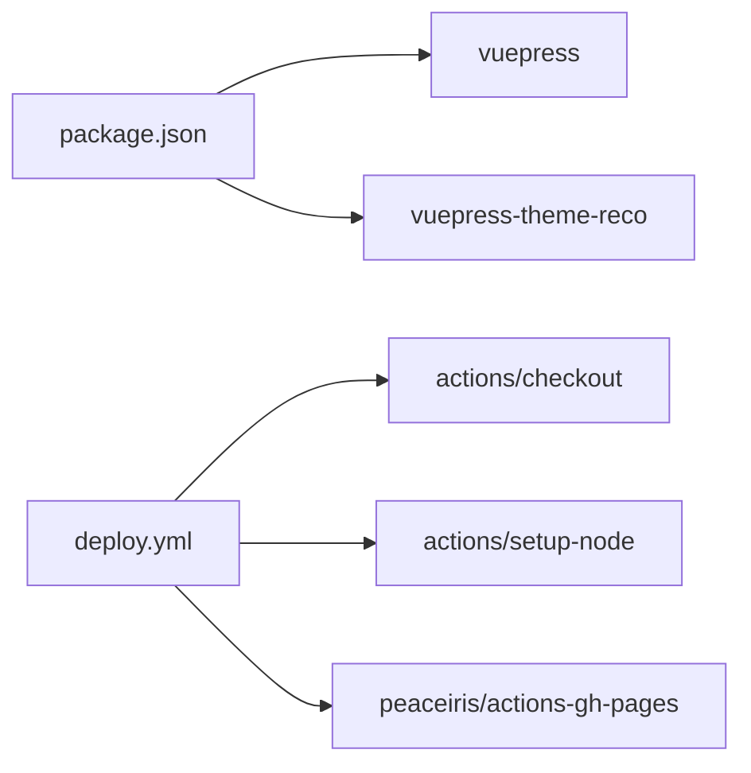

# 部署运维

<cite>
**本文引用的文件**
- [deploy.yml](file://.github/workflows/deploy.yml)
- [package.json](file://package.json)
- [publish.sh](file://publish.sh)
- [config.js](file://.vuepress/config.js)
- [navbar.js](file://.vuepress/navbar.js)
- [README.md](file://README.md)
</cite>

## 目录
1. [引言](#引言)
2. [项目结构](#项目结构)
3. [核心组件](#核心组件)
4. [架构总览](#架构总览)
5. [详细组件分析](#详细组件分析)
6. [依赖分析](#依赖分析)
7. [性能考量](#性能考量)
8. [故障排查指南](#故障排查指南)
9. [结论](#结论)
10. [附录](#附录)

## 引言
本指南面向项目维护者与运维工程师，系统阐述本 VuePress 博客项目的本地构建流程、生产环境部署步骤、GitHub Pages 自动部署配置与原理、CI/CD 最佳实践、性能优化与监控建议、域名与 HTTPS 配置、SEO 优化要点，以及故障排查与应急处理方法。目标是帮助团队以标准化、自动化的方式持续交付高质量站点。

## 项目结构
本项目采用 VuePress 2 + 主题的静态站点结构，核心产物为 .vuepress/dist 目录，通过 GitHub Actions 自动发布至 GitHub Pages 的 page 分支，实现零服务器托管与一键发布。

图表来源
- [.vuepress/config.js:1-18](file://.vuepress/config.js#L1-L18)
- [.github/workflows/deploy.yml:1-36](file://.github/workflows/deploy.yml#L1-L36)

章节来源
- [.vuepress/config.js:1-18](file://.vuepress/config.js#L1-L18)
- [.github/workflows/deploy.yml:1-36](file://.github/workflows/deploy.yml#L1-L36)
- [package.json:1-17](file://package.json#L1-L17)

## 核心组件
- 构建与主题配置
  - VuePress 配置集中于 .vuepress/config.js，包含站点标题、描述、基础路径、主题与导航等。
  - 主题与系列目录通过 navbar.js 与 series 目录组织，形成清晰的导航与侧边栏结构。
- 本地构建脚本
  - package.json 中定义 dev/build 脚本，使用 vuepress 命令进行开发与构建。
- 自动化部署
  - .github/workflows/deploy.yml 定义 CI 流水线：拉取代码、安装依赖、构建、部署到 GitHub Pages 的 page 分支。
- 手动发布脚本
  - publish.sh 提供本地构建后推送到 page 分支的便捷流程，便于离线或调试场景。

章节来源
- [.vuepress/config.js:1-18](file://.vuepress/config.js#L1-L18)
- [.vuepress/navbar.js:1-142](file://.vuepress/navbar.js#L1-L142)
- [package.json:8-12](file://package.json#L8-L12)
- [.github/workflows/deploy.yml:9-36](file://.github/workflows/deploy.yml#L9-L36)
- [publish.sh:1-20](file://publish.sh#L1-L20)

## 架构总览
下图展示从代码提交到用户访问的完整链路，强调自动化与静态化特征：

图表来源
- [.github/workflows/deploy.yml:15-36](file://.github/workflows/deploy.yml#L15-L36)
- [.vuepress/config.js:9](file://.vuepress/config.js#L9)

## 详细组件分析

### 本地构建流程
- 本地开发
  - 使用 npm run dev 启动开发服务器，实时预览与热更新。
- 生产构建
  - 使用 npm run build 生成 .vuepress/dist 静态站点目录，供发布使用。
- 构建产物
  - 产物目录包含 HTML、CSS、JS 与资源文件，配合 base 路径实现子路径部署。

图表来源
- [package.json:8-12](file://package.json#L8-L12)

章节来源
- [package.json:8-12](file://package.json#L8-L12)

### GitHub Pages 自动部署（CI/CD）
- 触发条件
  - master 分支 push 时触发，paths-ignore 中排除 README.md 等文件变更，降低不必要触发。
- 步骤说明
  - 检出代码、设置 Node.js、安装依赖、构建站点。
  - 使用 peaceiris/actions-gh-pages 将 .vuepress/dist 发布到 page 分支。
  - 配置提交者信息与目标分支，确保历史提交与部署一致。
- 关键配置点
  - publish_dir: .vuepress/dist
  - github_token: 使用仓库 secrets 中的令牌
  - user_name/user_email: 提交者身份
  - branch: page

图表来源
- [.github/workflows/deploy.yml:3-36](file://.github/workflows/deploy.yml#L3-L36)

章节来源
- [.github/workflows/deploy.yml:1-36](file://.github/workflows/deploy.yml#L1-L36)

### 手动发布脚本（publish.sh）
- 用途
  - 本地构建后，切换至 dist 目录，初始化 Git，提交并强制推送到 page 分支，便于离线或快速验证。
- 注意事项
  - 该脚本适用于本地调试与快速发布，生产推荐使用 CI 自动化。
  - 推送前请确认远端 page 分支存在或允许创建。

章节来源
- [publish.sh:1-20](file://publish.sh#L1-L20)

### 基础路径与子路径部署
- base 配置
  - .vuepress/config.js 中的 base: '/my-blog/' 指定子路径部署，确保静态资源与链接正确解析。
- 影响范围
  - 影响导航、资源路径、搜索索引等，需保持与 GitHub Pages page 分支路径一致。

章节来源
- [.vuepress/config.js:9](file://.vuepress/config.js#L9)

### 导航与站点结构
- 导航组织
  - .vuepress/navbar.js 定义多层级导航，覆盖前端、后端、面试等主题，便于用户浏览。
- 与构建的关系
  - 导航链接与文档路径需与实际文档一致，避免构建后出现 404。

章节来源
- [.vuepress/navbar.js:1-142](file://.vuepress/navbar.js#L1-L142)

## 依赖分析
- 运行时依赖
  - vuepress 与主题依赖在 package.json 中声明，确保 CI 与本地环境一致性。
- CI 依赖
  - actions/checkout 与 actions/setup-node 为标准流水线依赖；gh-pages action 负责发布。

图表来源
- [package.json:13-16](file://package.json#L13-L16)
- [.github/workflows/deploy.yml:15-31](file://.github/workflows/deploy.yml#L15-L31)

章节来源
- [package.json:13-16](file://package.json#L13-L16)
- [.github/workflows/deploy.yml:15-31](file://.github/workflows/deploy.yml#L15-L31)

## 性能考量
- 构建与资源
  - 使用 VuePress 2 的静态站点能力，产物为纯静态文件，无需运行时服务端逻辑，天然具备高并发与低延迟优势。
- 资源路径
  - base 路径与相对链接有助于减少重定向与额外请求。
- CI 优化建议
  - 使用 Node.js 缓存（如 actions/setup-node 的缓存）减少依赖安装时间。
  - 将构建产物缓存至 artifact，加速后续测试或发布阶段。
- 前端性能
  - 避免在文档中引入过大的图片或视频；必要时使用 CDN 或外部托管。
  - 合理组织导航与目录，减少首页与目录页的渲染压力。

[本节为通用指导，无需特定文件引用]

## 故障排查指南
- CI 构建失败
  - 检查 Node.js 版本与依赖安装日志，确认 actions/setup-node 与 npm ci/npm install 步骤。
  - 查看构建日志中是否存在样式或插件报错。
- 部署失败
  - 确认 secrets 中 ACCESS_TOKEN、MY_USER_NAME、MY_USER_EMAIL 是否配置。
  - 检查 gh-pages action 的分支与权限，确保对仓库有推送权限。
- 页面空白或资源 404
  - 核对 base 路径与实际访问路径是否一致。
  - 确认 .vuepress/dist 是否包含预期文件。
- 本地预览正常但线上异常
  - 检查本地与 CI 的 Node.js 版本差异。
  - 确保 CI 中的构建命令与本地一致（npm run build）。

章节来源
- [.github/workflows/deploy.yml:19-36](file://.github/workflows/deploy.yml#L19-L36)
- [.vuepress/config.js:9](file://.vuepress/config.js#L9)

## 结论
本项目通过 VuePress 2 + GitHub Pages 的组合，实现了低成本、高可靠的静态站点发布。借助 CI/CD 自动化流水线，可确保每次提交都能快速、稳定地交付到线上。建议在现有基础上完善缓存与监控，持续优化构建与资源加载体验。

[本节为总结，无需特定文件引用]

## 附录

### A. 本地构建与发布清单
- 本地开发
  - npm run dev
- 生产构建
  - npm run build
- 手动发布（本地）
  - sh publish.sh
- CI 发布
  - 推送 master 分支，等待 Actions 完成

章节来源
- [package.json:8-12](file://package.json#L8-L12)
- [publish.sh:1-20](file://publish.sh#L1-L20)
- [.github/workflows/deploy.yml:3-36](file://.github/workflows/deploy.yml#L3-L36)

### B. 域名与 HTTPS 配置
- GitHub Pages 域名
  - 使用自定义域名时，需在仓库 Settings → Pages 中配置并绑定 CNAME。
- HTTPS
  - GitHub Pages 默认启用 HTTPS；若使用自定义域名，确保 CNAME 指向正确并启用 HTTPS。
- SEO 优化
  - 在 .vuepress/config.js 中完善 title、description，确保搜索引擎可正确识别站点元信息。
  - 使用 navbar.js 与目录结构提升可读性与索引质量。

章节来源
- [.vuepress/config.js:6-8](file://.vuepress/config.js#L6-L8)
- [.vuepress/navbar.js:1-142](file://.vuepress/navbar.js#L1-L142)

### C. 监控与告警（建议）
- 访问监控
  - 使用 GitHub Pages 提供的基础访问统计，或接入第三方统计（如自建统计服务）。
- 健康检查
  - 定期 HEAD /my-blog/ 或 GET /my-blog/index.html，验证站点可用性。
- 日志与回滚
  - 通过 page 分支历史回滚至上一个稳定版本，保障快速恢复。

[本节为通用建议，无需特定文件引用]