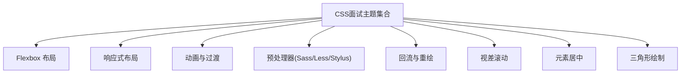
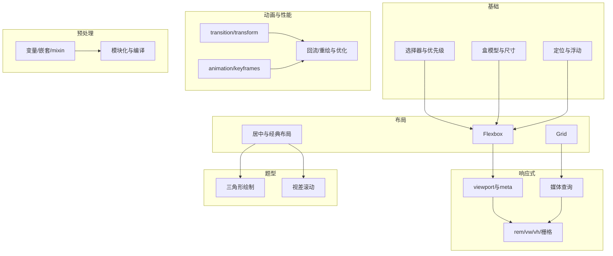
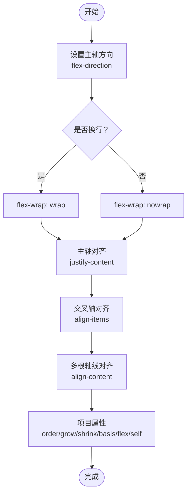
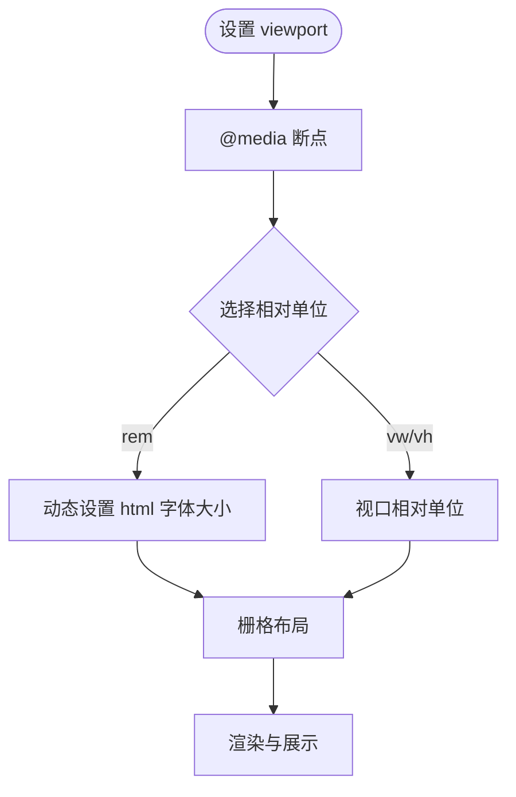
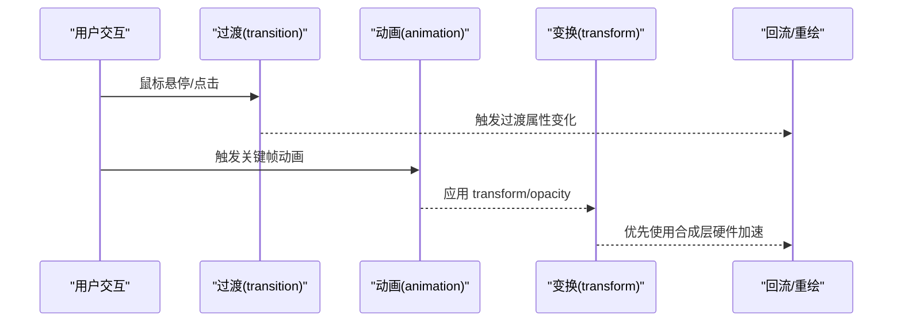
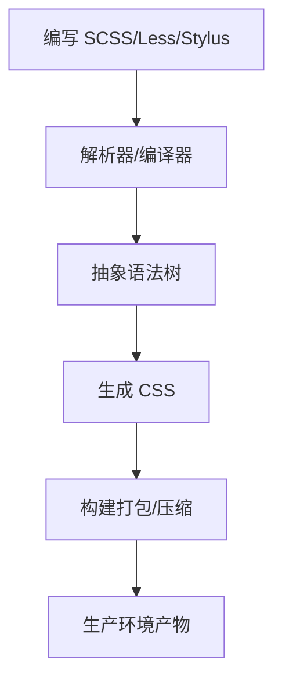
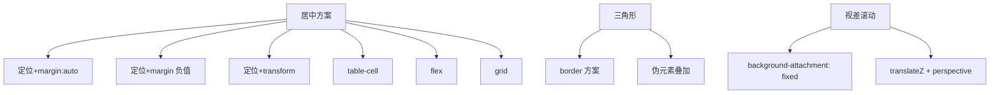

# CSS面试

<cite>
**本文引用的文件**
- [flexbox.md](file://docs/interview/css/flexbox.md)
- [responsive_layout.md](file://docs/interview/css/responsive_layout.md)
- [animation.md](file://docs/interview/css/animation.md)
- [sass_less_stylus.md](file://docs/interview/css/sass_less_stylus.md)
- [layout_painting.md](file://docs/interview/css/layout_painting.md)
- [visual_scrolling.md](file://docs/interview/css/visual_scrolling.md)
- [center.md](file://docs/interview/css/center.md)
- [triangle.md](file://docs/interview/css/triangle.md)
- [css.js](file://.vuepress/series/interview/css.js)
- [README.md](file://.vuepress/reference/wangtunan/cssPrecompiler/sass/README.md)
- [README.md](file://.vuepress/reference/wangtunan/cssPrecompiler/sassLoader/README.md)
</cite>

## 目录
1. [引言](#引言)
2. [项目结构](#项目结构)
3. [核心组件](#核心组件)
4. [架构总览](#架构总览)
5. [详细组件分析](#详细组件分析)
6. [依赖分析](#依赖分析)
7. [性能考量](#性能考量)
8. [故障排查指南](#故障排查指南)
9. [结论](#结论)
10. [附录](#附录)

## 引言
本指南面向CSS面试，系统梳理基础知识（选择器、盒模型、定位、浮动与清除）、Flexbox/Grid布局要点、响应式与移动端适配、动画与过渡、性能优化、预处理器（Sass/Less/Stylus）与常见问题，并提供布局题解题思路与最佳实践。内容均来源于仓库中的CSS面试与参考材料。

## 项目结构
仓库中与CSS面试直接相关的资料集中在 docs/interview/css 下，涵盖：
- Flexbox 布局
- 响应式布局
- 动画与过渡
- 预处理器（Sass/Less/Stylus）
- 回流与重绘
- 视差滚动
- 元素居中
- 三角形绘制

**章节来源**
- [css.js:1-22](file://.vuepress/series/interview/css.js#L1-L22)

## 核心组件
- 选择器与盒模型：掌握各类选择器、优先级与盒模型（content/border/padding/margin）。
- 定位与浮动：理解 static/relative/absolute/fixed/sticky 与 float、clear 的行为与清除技巧。
- Flexbox：主轴/交叉轴、容器与项目属性、flex 各分量（grow/shrink/basis）、align-self。
- Grid：网格容器与项目、线、轨道、间距与对齐。
- 响应式：viewport、媒体查询、rem/vw/vh、栅格与断点策略。
- 动画与过渡：transition、transform、animation/keyframes 的使用与性能。
- 性能：回流/重绘触发点、批处理、硬件加速、避免强制同步布局。
- 预处理器：变量、嵌套、mixin、模块化、编译产物与工程化。
- 布局题：居中、三角形、视差滚动等典型题型的思路与实现要点。

**章节来源**
- [flexbox.md:1-270](file://docs/interview/css/flexbox.md#L1-L270)
- [responsive_layout.md:1-172](file://docs/interview/css/responsive_layout.md#L1-L172)
- [animation.md:1-187](file://docs/interview/css/animation.md#L1-L187)
- [sass_less_stylus.md:1-286](file://docs/interview/css/sass_less_stylus.md#L1-L286)
- [layout_painting.md:1-178](file://docs/interview/css/layout_painting.md#L1-L178)
- [visual_scrolling.md:1-169](file://docs/interview/css/visual_scrolling.md#L1-L169)
- [center.md:1-259](file://docs/interview/css/center.md#L1-L259)
- [triangle.md:1-144](file://docs/interview/css/triangle.md#L1-L144)

## 架构总览
本指南将CSS知识按“基础—布局—响应式—动画—性能—预处理—题型”的层次组织，便于面试复习与实战迁移。

## 详细组件分析

### Flexbox 布局
- 主轴/交叉轴与方向：flex-direction（row/row-reverse/column/column-reverse）。
- 换行：flex-wrap（nowrap/wrap/wrap-reverse）。
- 容器属性：flex-flow（简写）、justify-content（主轴对齐）、align-items/align-content（交叉轴对齐）。
- 项目属性：order、flex-grow、flex-shrink、flex-basis、flex（简写）、align-self。
- 场景：两栏/三栏自适应、水平垂直居中、等比/不等比分配。

**图表来源**
- [flexbox.md:30-136](file://docs/interview/css/flexbox.md#L30-L136)

**章节来源**
- [flexbox.md:1-270](file://docs/interview/css/flexbox.md#L1-L270)

### 响应式设计与移动端适配
- viewport：width/initial-scale/maximum-scale/user-scalable。
- 媒体查询：@media 与断点策略。
- 相对单位：%、vw/vh、rem（配合 JS 动态设置根字体）。
- 栅格：UI 框架栅格或自建栅格系统。
- 优缺点：灵活性与复杂度权衡、兼容成本与性能影响。

**图表来源**
- [responsive_layout.md:23-141](file://docs/interview/css/responsive_layout.md#L23-L141)

**章节来源**
- [responsive_layout.md:1-172](file://docs/interview/css/responsive_layout.md#L1-L172)

### 动画、过渡与性能
- transition：属性、持续时间、缓动函数、延迟。
- transform：translate/rotate/scale/skew 与组合。
- animation：duration/timing-function/delay/iteration-count/direction/fill-mode/play-state/name。
- 回流/重绘：布局计算（回流）与绘制（重绘）的触发点与优化策略。
- 视差滚动：background-attachment 与 transform: translateZ。

**图表来源**
- [animation.md:19-171](file://docs/interview/css/animation.md#L19-L171)
- [layout_painting.md:28-86](file://docs/interview/css/layout_painting.md#L28-L86)

**章节来源**
- [animation.md:1-187](file://docs/interview/css/animation.md#L1-L187)
- [layout_painting.md:1-178](file://docs/interview/css/layout_painting.md#L1-L178)
- [visual_scrolling.md:1-169](file://docs/interview/css/visual_scrolling.md#L1-L169)

### 预处理器（Sass/Less/Stylus）
- 变量：统一主题与间距。
- 嵌套：减少重复选择器、提升可读性。
- Mixin：复用样式、支持参数与默认值。
- 模块化：@import/@use（Sass）组织样式。
- 编译与工程化：构建工具链、产物体积与可维护性。
- 三者差异：语法风格、作用域、混入与模块化差异。

**图表来源**
- [sass_less_stylus.md:19-286](file://docs/interview/css/sass_less_stylus.md#L19-L286)
- [README.md:1-800](file://.vuepress/reference/wangtunan/cssPrecompiler/sass/README.md#L1-L800)
- [README.md:1-4](file://.vuepress/reference/wangtunan/cssPrecompiler/sassLoader/README.md#L1-L4)

**章节来源**
- [sass_less_stylus.md:1-286](file://docs/interview/css/sass_less_stylus.md#L1-L286)
- [README.md:1-800](file://.vuepress/reference/wangtunan/cssPrecompiler/sass/README.md#L1-L800)
- [README.md:1-4](file://.vuepress/reference/wangtunan/cssPrecompiler/sassLoader/README.md#L1-L4)

### 布局题：居中、三角形与视差滚动
- 水平垂直居中：定位+margin/auto、定位+transform、table-cell、flex、grid。
- 三角形：border 与伪元素实现，内外层三角形与空心三角形。
- 视差滚动：background-attachment: fixed 与 transform: translateZ。

**图表来源**
- [center.md:23-212](file://docs/interview/css/center.md#L23-L212)
- [triangle.md:14-103](file://docs/interview/css/triangle.md#L14-L103)
- [visual_scrolling.md:16-92](file://docs/interview/css/visual_scrolling.md#L16-L92)

**章节来源**
- [center.md:1-259](file://docs/interview/css/center.md#L1-L259)
- [triangle.md:1-144](file://docs/interview/css/triangle.md#L1-L144)
- [visual_scrolling.md:1-169](file://docs/interview/css/visual_scrolling.md#L1-L169)

## 依赖分析
- 知识依赖：基础（选择器/盒模型/定位/浮动）→ 布局（Flexbox/Grid）→ 响应式 → 动画/性能 → 预处理 → 题型。
- 工具链依赖：Sass/Less/Stylus 与构建工具（Webpack/Vite 等）集成，关注编译产物与体积。
- 浏览器兼容：CSS 动画、transform、媒体查询、rem 等的兼容性与降级策略。

## 性能考量
- 回流/重绘触发：DOM 尺寸变化、布局读取（offset/scroll/getComputedStyle）、颜色/阴影变化。
- 优化策略：批处理写操作、使用类名合并样式、脱离文档流（absolute/fixed）、transform/opacity 硬件加速、避免 table/iframe 等慢元素。
- JS 与 CSS 协作：DocumentFragment、离线操作、避免强制同步布局。

**章节来源**
- [layout_painting.md:28-178](file://docs/interview/css/layout_painting.md#L28-L178)

## 故障排查指南
- 常见问题
  - 居中失效：未设置宽高或定位上下左右为 0；flex/grid 属性误用。
  - 三角形留白：border 宽度与透明色导致的视觉占位。
  - 视差滚动异常：容器未开启 3D 上下文或 translateZ 未生效。
  - 动画卡顿：使用低效属性（如 layout 相关）或未启用硬件加速。
  - 响应式断点：断点选择不当、单位混用导致的布局错乱。
- 排查步骤
  - 定位问题：逐步注释/简化样式，确认触发回流/重绘的最小集合。
  - 单元测试：针对关键布局（居中、三角形、视差）建立最小可复现。
  - 性能分析：使用浏览器性能面板观察回流/重绘热点。

**章节来源**
- [center.md:1-259](file://docs/interview/css/center.md#L1-L259)
- [triangle.md:1-144](file://docs/interview/css/triangle.md#L1-L144)
- [visual_scrolling.md:1-169](file://docs/interview/css/visual_scrolling.md#L1-L169)
- [layout_painting.md:28-178](file://docs/interview/css/layout_painting.md#L28-L178)

## 结论
CSS 面试应以“基础扎实、布局熟练、响应式与性能兼顾、预处理工程化、题型精进”为主线。通过本指南的知识体系与图示，可在面试中清晰阐述原理、场景与最佳实践，并具备快速定位与优化问题的能力。

## 附录
- 面试清单（可对照自检）
  - 选择器优先级与常见坑
  - 盒模型与 BFC/IFC
  - 定位与浮动清除
  - Flexbox 主轴/交叉轴、容器/项目属性、flex 各分量
  - Grid 网格线/轨道/间距/对齐
  - 响应式 viewport、媒体查询、rem/vw/vh、栅格
  - transition/transform/animation/keyframes
  - 回流/重绘触发与优化
  - Sass/Less/Stylus 变量/嵌套/mixin/模块化
  - 居中/三角形/视差滚动等题型思路