# JavaScript面试

<cite>
**本文档引用的文件**
- [原型和原型链的特点](file://docs/interview/JavaScript/prototype.md)
- [对作用域链的理解](file://docs/interview/JavaScript/scope.md)
- [对闭包的理解](file://docs/interview/JavaScript/closure.md)
- [Javascript实现继承](file://docs/interview/JavaScript/inherit.md)
- [数组的常用方法](file://docs/interview/JavaScript/array_api.md)
- [字符串的常用方法有哪些](file://docs/interview/JavaScript/string_api.md)
- [JavaScript中的数据类型和存储上的差别](file://docs/interview/JavaScript/data_type.md)
- [JavaScript中的类型转换机制](file://docs/interview/JavaScript/type_conversion.md)
- [JavaScript中的事件模型](file://docs/interview/JavaScript/event_Model.md)
- [对函数式编程的理解](file://docs/interview/JavaScript/functional_programming.md)
- [js数据结构](file://docs/interview/JavaScript/js_data_structure.md)
- [数字精度丢失的问题如何解决](file://docs/interview/JavaScript/loss_accuracy.md)
- [对正则表达式的理解](file://docs/interview/JavaScript/regexp.md)
- [typeof 与 instanceof 区别](file://docs/interview/JavaScript/typeof_instanceof.md)
- [== 和 ===区别](file://docs/interview/JavaScript/equal.md)
</cite>

## 目录
1. [简介](#简介)
2. [项目结构](#项目结构)
3. [核心组件](#核心组件)
4. [架构总览](#架构总览)
5. [详细组件分析](#详细组件分析)
6. [依赖分析](#依赖分析)
7. [性能考量](#性能考量)
8. [故障排查指南](#故障排查指南)
9. [结论](#结论)
10. [附录](#附录)

## 简介
本指南面向JavaScript面试，系统梳理基础语法、原型链与继承、作用域与闭包、this绑定、ES6+新特性（箭头函数、模块化、Promise、async/await）、TypeScript相关要点、常见题型与解题思路（数组、字符串、对象、正则、函数式编程、数据结构与精度问题），并提供性能优化建议与答题技巧。

## 项目结构
仓库中与JavaScript面试密切相关的知识分布在“面试”和“前端基础/高级”两大板块：
- 面试-JavaScript：覆盖原型链、作用域、闭包、继承、数组/字符串API、事件模型、函数式编程、数据结构、精度问题、正则、类型判断与相等比较等
- 前端基础/高级：包含ES6语法、JavaScript对象与模块化等主题，补充ES6+相关内容

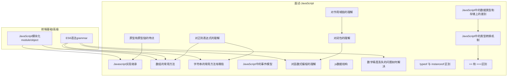

**图表来源**
- [原型和原型链的特点:1-129](file://docs/interview/JavaScript/prototype.md#L1-L129)
- [Javascript实现继承:1-254](file://docs/interview/JavaScript/inherit.md#L1-L254)
- [对作用域链的理解:1-136](file://docs/interview/JavaScript/scope.md#L1-L136)
- [对闭包的理解:1-162](file://docs/interview/JavaScript/closure.md#L1-L162)
- [对函数式编程的理解:1-233](file://docs/interview/JavaScript/functional_programming.md#L1-L233)
- [JavaScript中的数据类型和存储上的差别:1-244](file://docs/interview/JavaScript/data_type.md#L1-L244)
- [JavaScript中的类型转换机制:1-193](file://docs/interview/JavaScript/type_conversion.md#L1-L193)
- [== 和 ===区别:1-132](file://docs/interview/JavaScript/equal.md#L1-L132)
- [对正则表达式的理解:1-351](file://docs/interview/JavaScript/regexp.md#L1-L351)
- [数组的常用方法:1-295](file://docs/interview/JavaScript/array_api.md#L1-L295)
- [字符串的常用方法有哪些:1-189](file://docs/interview/JavaScript/string_api.md#L1-L189)
- [js数据结构:1-78](file://docs/interview/JavaScript/js_data_structure.md#L1-L78)
- [数字精度丢失的问题如何解决:1-171](file://docs/interview/JavaScript/loss_accuracy.md#L1-L171)
- [ES6语法（grammar）](file://docs/frontend-advanced/es6/grammar.md)
- [JavaScript模块化（module/object）](file://docs/frontend-advanced/javascript/module.md)

**章节来源**
- [原型和原型链的特点:1-129](file://docs/interview/JavaScript/prototype.md#L1-L129)
- [Javascript实现继承:1-254](file://docs/interview/JavaScript/inherit.md#L1-L254)
- [对作用域链的理解:1-136](file://docs/interview/JavaScript/scope.md#L1-L136)
- [对闭包的理解:1-162](file://docs/interview/JavaScript/closure.md#L1-L162)
- [对函数式编程的理解:1-233](file://docs/interview/JavaScript/functional_programming.md#L1-L233)
- [JavaScript中的数据类型和存储上的差别:1-244](file://docs/interview/JavaScript/data_type.md#L1-L244)
- [JavaScript中的类型转换机制:1-193](file://docs/interview/JavaScript/type_conversion.md#L1-L193)
- [== 和 ===区别:1-132](file://docs/interview/JavaScript/equal.md#L1-L132)
- [对正则表达式的理解:1-351](file://docs/interview/JavaScript/regexp.md#L1-L351)
- [数组的常用方法:1-295](file://docs/interview/JavaScript/array_api.md#L1-L295)
- [字符串的常用方法有哪些:1-189](file://docs/interview/JavaScript/string_api.md#L1-L189)
- [js数据结构:1-78](file://docs/interview/JavaScript/js_data_structure.md#L1-L78)
- [数字精度丢失的问题如何解决:1-171](file://docs/interview/JavaScript/loss_accuracy.md#L1-L171)
- [ES6语法（grammar）](file://docs/frontend-advanced/es6/grammar.md)
- [JavaScript模块化（module/object）](file://docs/frontend-advanced/javascript/module.md)

## 核心组件
- 原型与原型链：理解对象的__proto__与构造函数prototype关系，掌握原型链的查找机制与终点
- 作用域与闭包：掌握词法作用域、作用域链、闭包的形成与应用（私有变量、柯里化、模块化）
- 继承：掌握多种继承方式（原型链、借用构造函数、组合、寄生、寄生组合）与ES6 class/extends
- 数据类型与转换：掌握基本类型与引用类型存储差异、显式/隐式转换规则、相等与全等
- 数组与字符串API：熟练使用增删改查、排序、迭代、转换、模板匹配等方法
- 事件模型：理解事件捕获/冒泡、DOM0/DOM2模型、addEventListener细节
- 函数式编程：纯函数、高阶函数、柯里化、组合与管道
- 正则表达式：匹配规则、量词、分组、先行/后行断言、exec/test/match等方法
- 数据结构：数组、栈、队列、链表、字典、散列表、树、图、堆
- 精度问题：IEEE754双精度浮点数、精度丢失成因与解决方案
- ES6+与模块化：箭头函数、模块化、Promise、async/await
- TypeScript：类型系统、接口、泛型、装饰器、命名空间/模块等（参考TypeScript语法）

**章节来源**
- [原型和原型链的特点:1-129](file://docs/interview/JavaScript/prototype.md#L1-L129)
- [对作用域链的理解:1-136](file://docs/interview/JavaScript/scope.md#L1-L136)
- [对闭包的理解:1-162](file://docs/interview/JavaScript/closure.md#L1-L162)
- [Javascript实现继承:1-254](file://docs/interview/JavaScript/inherit.md#L1-L254)
- [JavaScript中的数据类型和存储上的差别:1-244](file://docs/interview/JavaScript/data_type.md#L1-L244)
- [JavaScript中的类型转换机制:1-193](file://docs/interview/JavaScript/type_conversion.md#L1-L193)
- [数组的常用方法:1-295](file://docs/interview/JavaScript/array_api.md#L1-L295)
- [字符串的常用方法有哪些:1-189](file://docs/interview/JavaScript/string_api.md#L1-L189)
- [JavaScript中的事件模型:1-241](file://docs/interview/JavaScript/event_Model.md#L1-L241)
- [对函数式编程的理解:1-233](file://docs/interview/JavaScript/functional_programming.md#L1-L233)
- [对正则表达式的理解:1-351](file://docs/interview/JavaScript/regexp.md#L1-L351)
- [js数据结构:1-78](file://docs/interview/JavaScript/js_data_structure.md#L1-L78)
- [数字精度丢失的问题如何解决:1-171](file://docs/interview/JavaScript/loss_accuracy.md#L1-L171)
- [ES6语法（grammar）](file://docs/frontend-advanced/es6/grammar.md)
- [JavaScript模块化（module/object）](file://docs/frontend-advanced/javascript/module.md)

## 架构总览
以下图展示面试知识点之间的关联与支撑关系，帮助建立整体认知框架：

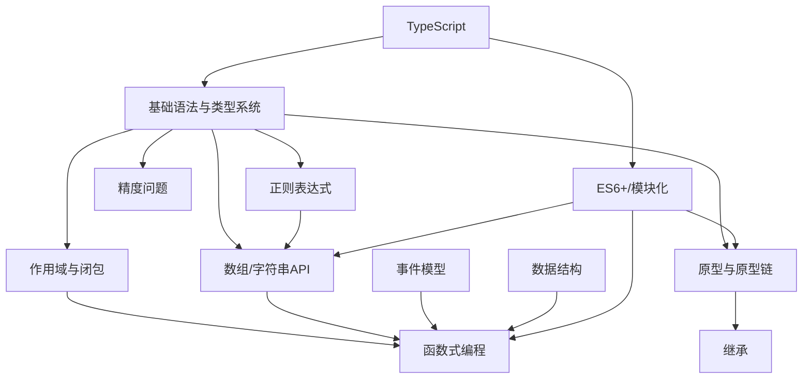

**图表来源**
- [对作用域链的理解:1-136](file://docs/interview/JavaScript/scope.md#L1-L136)
- [对闭包的理解:1-162](file://docs/interview/JavaScript/closure.md#L1-L162)
- [原型和原型链的特点:1-129](file://docs/interview/JavaScript/prototype.md#L1-L129)
- [Javascript实现继承:1-254](file://docs/interview/JavaScript/inherit.md#L1-L254)
- [数组的常用方法:1-295](file://docs/interview/JavaScript/array_api.md#L1-L295)
- [字符串的常用方法有哪些:1-189](file://docs/interview/JavaScript/string_api.md#L1-L189)
- [JavaScript中的事件模型:1-241](file://docs/interview/JavaScript/event_Model.md#L1-L241)
- [对函数式编程的理解:1-233](file://docs/interview/JavaScript/functional_programming.md#L1-L233)
- [对正则表达式的理解:1-351](file://docs/interview/JavaScript/regexp.md#L1-L351)
- [js数据结构:1-78](file://docs/interview/JavaScript/js_data_structure.md#L1-L78)
- [数字精度丢失的问题如何解决:1-171](file://docs/interview/JavaScript/loss_accuracy.md#L1-L171)
- [ES6语法（grammar）](file://docs/frontend-advanced/es6/grammar.md)
- [JavaScript模块化（module/object）](file://docs/frontend-advanced/javascript/module.md)

## 详细组件分析

### 原型与原型链
- 关键点
  - 每个函数有prototype，实例的__proto__指向构造函数prototype
  - 原型链自下而上查找，Object.prototype.__proto__为null
  - Function.prototype与Function.__proto__指向自身，形成闭环
- 面试重点
  - 解释原型链查找过程与终点
  - 画出典型对象/函数/Function/Object的关系图
  - 如何判断某属性来自实例还是原型
- 性能与陷阱
  - 避免在原型上放置大型共享数据导致内存浪费
  - 注意原型污染与属性遮蔽

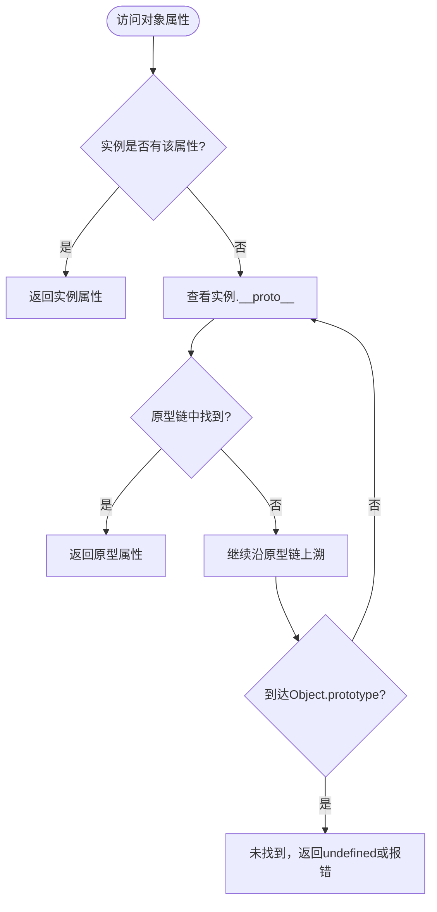

**图表来源**
- [原型和原型链的特点:43-124](file://docs/interview/JavaScript/prototype.md#L43-L124)

**章节来源**
- [原型和原型链的特点:1-129](file://docs/interview/JavaScript/prototype.md#L1-L129)

### 作用域与闭包
- 关键点
  - 词法作用域：函数在定义时决定作用域
  - 作用域链：自内向外查找变量
  - 闭包：内层函数引用外层作用域变量，延长变量生命周期
- 面试重点
  - 解释作用域链与词法作用域的区别
  - 闭包的创建条件与应用场景（私有变量、柯里化、模块化）
  - 闭包的内存影响与优化策略
- 典型题型
  - 循环中使用闭包处理异步/定时器
  - 模块化写法与命名空间隔离

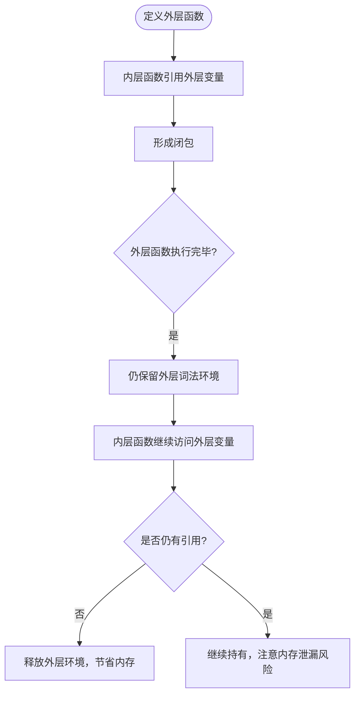

**图表来源**
- [对闭包的理解:1-162](file://docs/interview/JavaScript/closure.md#L1-L162)
- [对作用域链的理解:1-136](file://docs/interview/JavaScript/scope.md#L1-L136)

**章节来源**
- [对作用域链的理解:1-136](file://docs/interview/JavaScript/scope.md#L1-L136)
- [对闭包的理解:1-162](file://docs/interview/JavaScript/closure.md#L1-L162)

### 继承
- 关键点
  - 原型链继承：共享引用类型属性
  - 借用构造函数：解决引用共享，但无法继承原型方法
  - 组合继承：兼顾实例与原型，但父构造函数调用两次
  - 寄生组合继承：最优方案，避免多余构造
  - ES6 class/extends：语法糖，底层仍为寄生组合继承
- 面试重点
  - 各种继承方式的优缺点与适用场景
  - 手写寄生组合继承
  - class与传统构造函数的区别

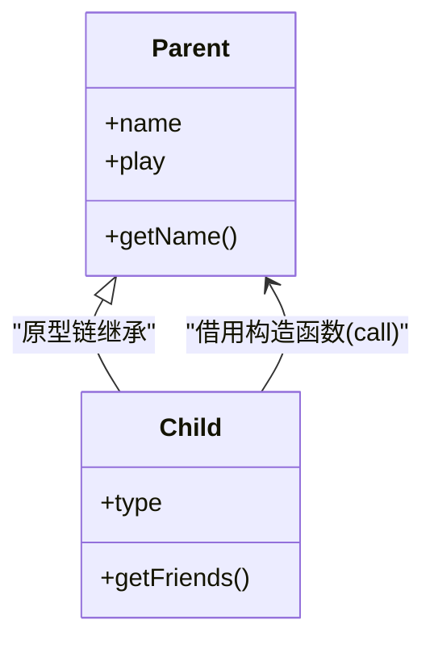

**图表来源**
- [Javascript实现继承:1-254](file://docs/interview/JavaScript/inherit.md#L1-L254)

**章节来源**
- [Javascript实现继承:1-254](file://docs/interview/JavaScript/inherit.md#L1-L254)

### 数据类型与类型转换
- 关键点
  - 基本类型：Number、String、Boolean、Undefined、Null、Symbol
  - 引用类型：Object、Array、Function等
  - 存储差异：基本类型栈存储，引用类型堆存储
  - 显式转换：Number/parseInt/String/Boolean
  - 隐式转换：==比较、布尔上下文、算术运算
  - 相等与全等：==会做类型转换，===不转换
- 面试重点
  - 三大误区：typeof null、[]与{}的类型判断、==与===区别
  - 通用类型判断：Object.prototype.toString
- 典型题型
  - “==”反直觉结果与解释
  - 安全判断null/undefined的写法

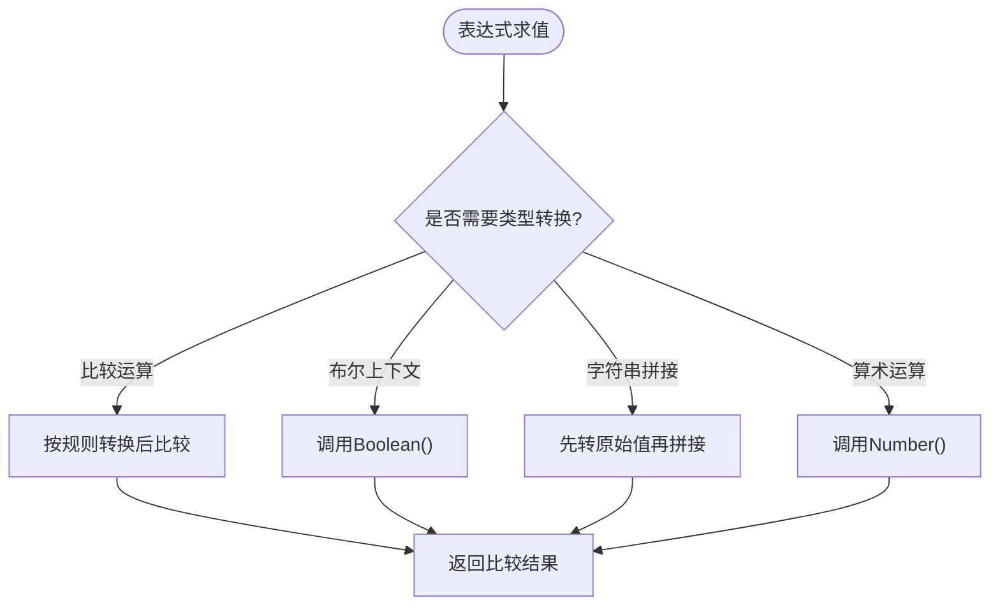

**图表来源**
- [JavaScript中的类型转换机制:1-193](file://docs/interview/JavaScript/type_conversion.md#L1-L193)
- [== 和 ===区别:1-132](file://docs/interview/JavaScript/equal.md#L1-L132)
- [typeof 与 instanceof 区别:1-144](file://docs/interview/JavaScript/typeof_instanceof.md#L1-L144)

**章节来源**
- [JavaScript中的数据类型和存储上的差别:1-244](file://docs/interview/JavaScript/data_type.md#L1-L244)
- [JavaScript中的类型转换机制:1-193](file://docs/interview/JavaScript/type_conversion.md#L1-L193)
- [== 和 ===区别:1-132](file://docs/interview/JavaScript/equal.md#L1-L132)
- [typeof 与 instanceof 区别:1-144](file://docs/interview/JavaScript/typeof_instanceof.md#L1-L144)

### 数组与字符串API
- 关键点
  - 数组：增（push/unshift/splice）、删（pop/shift/splice）、改（splice）、查（indexOf/includes/find/findIndex）
  - 排序：reverse/sort(compare)
  - 转换：join
  - 迭代：some/every/forEach/filter/map
  - 字符串：增（concat/模板）、删（slice/substr/substring）、改（trim/repeat/padStart/padEnd/大小写）、查（charAt/indexOf/startsWith/includes）、模板匹配（match/search/replace/split）
- 面试重点
  - 区分slice/substring/substr
  - map/filter/find区别与性能
  - 不可变性与副作用
- 典型题型
  - 数组扁平化、去重、排序
  - 字符串压缩/反转、驼峰化

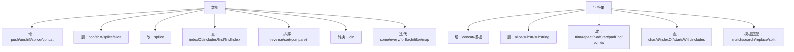

**图表来源**
- [数组的常用方法:1-295](file://docs/interview/JavaScript/array_api.md#L1-L295)
- [字符串的常用方法有哪些:1-189](file://docs/interview/JavaScript/string_api.md#L1-L189)

**章节来源**
- [数组的常用方法:1-295](file://docs/interview/JavaScript/array_api.md#L1-L295)
- [字符串的常用方法有哪些:1-189](file://docs/interview/JavaScript/string_api.md#L1-L189)

### 事件模型
- 关键点
  - 事件流：捕获阶段 → 目标阶段 → 冒泡阶段
  - DOM0（onclick）：简单但不支持捕获、易覆盖
  - DOM2（addEventListener）：支持捕获/冒泡、可绑定多个处理器
  - IE事件模型（attachEvent/detachEvent）：基本淘汰
- 面试重点
  - 事件代理与冒泡/捕获的应用
  - preventDefault/stopPropagation使用
  - 性能与内存泄漏防范

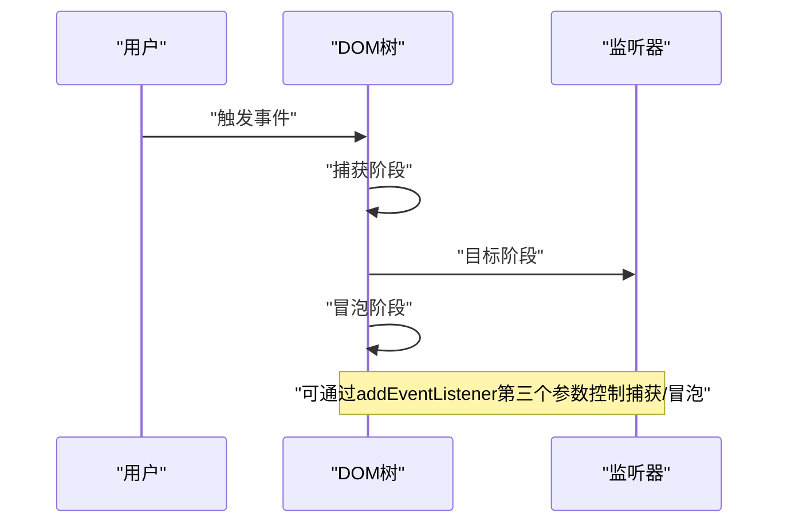

**图表来源**
- [JavaScript中的事件模型:1-241](file://docs/interview/JavaScript/event_Model.md#L1-L241)

**章节来源**
- [JavaScript中的事件模型:1-241](file://docs/interview/JavaScript/event_Model.md#L1-L241)

### 函数式编程
- 关键点
  - 纯函数：无副作用、相同输入恒有相同输出
  - 高阶函数：以函数为输入/输出
  - 柯里化：多参转单参链式调用
  - 组合与管道：从右到左/从左到右组合
- 面试重点
  - 纯函数与副作用控制
  - 柯里化在参数复用与惰性求值中的应用
  - 与命令式编程的对比与权衡

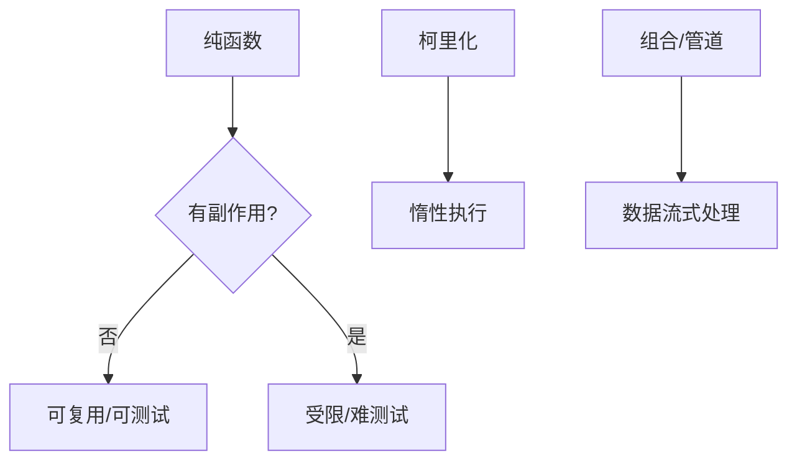

**图表来源**
- [对函数式编程的理解:1-233](file://docs/interview/JavaScript/functional_programming.md#L1-L233)

**章节来源**
- [对函数式编程的理解:1-233](file://docs/interview/JavaScript/functional_programming.md#L1-L233)

### 正则表达式
- 关键点
  - 基本规则：字符类、量词、锚点、分组、断言
  - 标志：g/i/m/s/u/y
  - 匹配方法：match/matchAll/search/replace/split
  - exec/test：有/无全局时的行为差异
- 面试重点
  - 贪婪/懒惰量词与回溯
  - 分组捕获与反向引用
  - 常见场景：邮箱/手机号/URL解析、参数提取

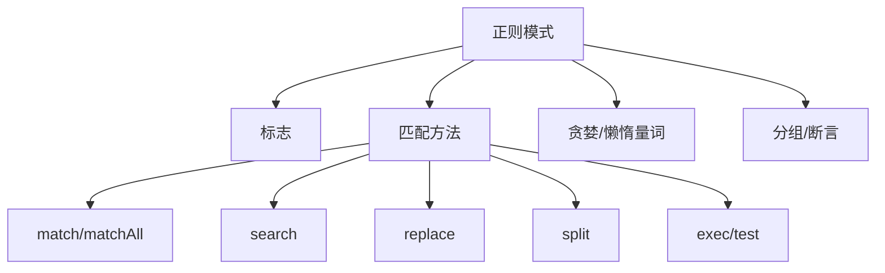

**图表来源**
- [对正则表达式的理解:1-351](file://docs/interview/JavaScript/regexp.md#L1-L351)

**章节来源**
- [对正则表达式的理解:1-351](file://docs/interview/JavaScript/regexp.md#L1-L351)

### 数据结构
- 关键点
  - 数组：连续内存、随机访问
  - 栈：LIFO
  - 队列：FIFO
  - 链表：动态、插入/删除高效
  - 字典/散列表：键值映射、哈希冲突处理
  - 树/图/堆：高级结构与算法基础
- 面试重点
  - 各结构的时间复杂度与适用场景
  - 常见算法：LRU、拓扑排序、最小生成树等

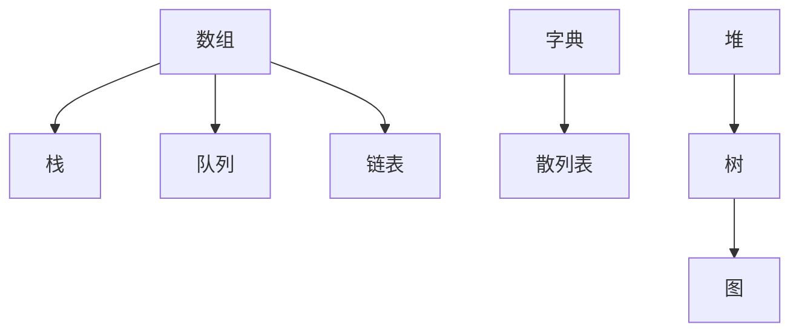

**图表来源**
- [js数据结构:1-78](file://docs/interview/JavaScript/js_data_structure.md#L1-L78)

**章节来源**
- [js数据结构:1-78](file://docs/interview/JavaScript/js_data_structure.md#L1-L78)

### 精度问题
- 关键点
  - IEEE754双精度浮点数：符号位、指数位、尾数位
  - 0.1+0.2≠0.3 的成因与表现
  - 解决方案：toPrecision、转整数运算、第三方库
- 面试重点
  - 解释浮点数存储与舍入误差
  - 提供可落地的修复方案

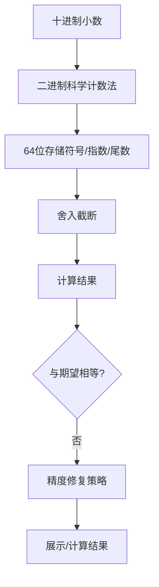

**图表来源**
- [数字精度丢失的问题如何解决:1-171](file://docs/interview/JavaScript/loss_accuracy.md#L1-L171)

**章节来源**
- [数字精度丢失的问题如何解决:1-171](file://docs/interview/JavaScript/loss_accuracy.md#L1-L171)

### ES6+/模块化与TypeScript
- ES6+要点
  - 箭头函数：词法绑定this、简洁体、与普通函数差异
  - 模块化：import/export、默认/具名导出、动态导入
  - Promise：状态机、链式调用、错误处理
  - async/await：语法糖，简化Promise链
- TypeScript要点
  - 类型系统：基础类型、联合/交叉、泛型、接口
  - 装饰器、命名空间/模块、编译选项
- 面试重点
  - 箭头函数this绑定与适用场景
  - Promise/async-await的错误处理与并发控制
  - TS类型推导与编译期检查的价值

**章节来源**
- [ES6语法（grammar）](file://docs/frontend-advanced/es6/grammar.md)
- [JavaScript模块化（module/object）](file://docs/frontend-advanced/javascript/module.md)

## 依赖分析
- 概念耦合
  - 作用域与闭包依赖于词法作用域与变量生命周期
  - 原型链与继承紧密相关，寄生组合继承是现代最优解
  - 数组/字符串API与函数式编程方法（map/filter/find）高度契合
  - 事件模型与DOM操作、防抖节流密切相关
  - 正则表达式广泛应用于数组/字符串处理
  - 精度问题贯穿数值计算与金融/支付场景
- 工程实践
  - ES6+模块化与TypeScript提升代码可维护性与可测试性
  - 函数式编程与数据结构结合，提升算法效率与可读性

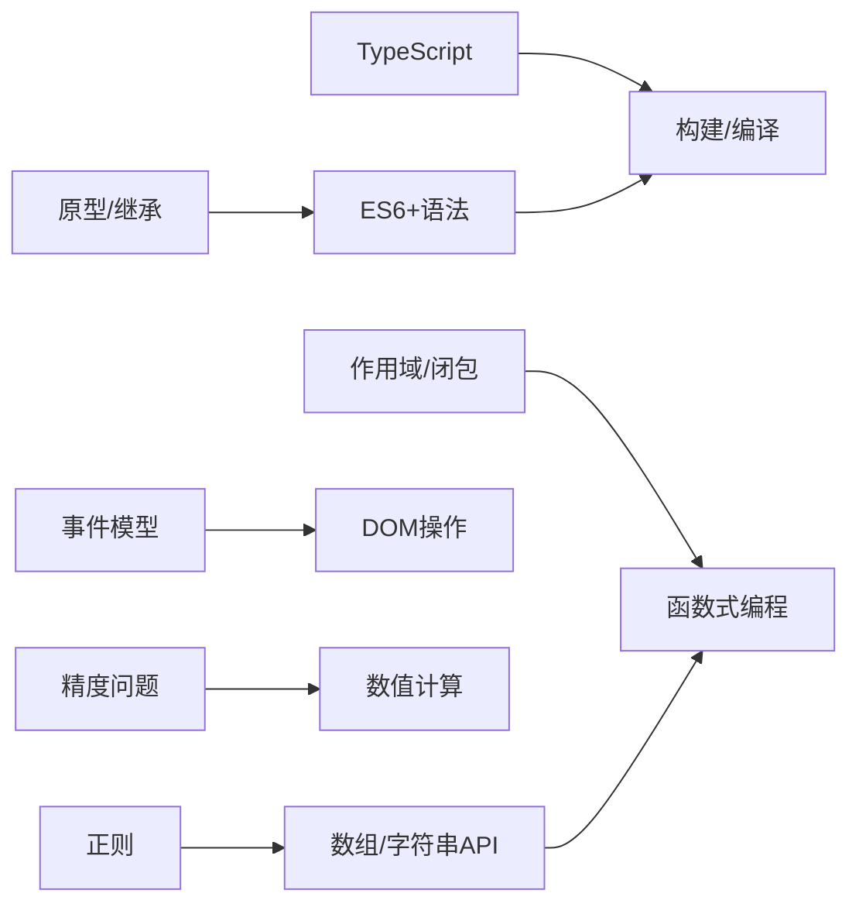

**图表来源**
- [对作用域链的理解:1-136](file://docs/interview/JavaScript/scope.md#L1-L136)
- [对闭包的理解:1-162](file://docs/interview/JavaScript/closure.md#L1-L162)
- [对函数式编程的理解:1-233](file://docs/interview/JavaScript/functional_programming.md#L1-L233)
- [原型和原型链的特点:1-129](file://docs/interview/JavaScript/prototype.md#L1-L129)
- [Javascript实现继承:1-254](file://docs/interview/JavaScript/inherit.md#L1-L254)
- [数组的常用方法:1-295](file://docs/interview/JavaScript/array_api.md#L1-L295)
- [字符串的常用方法有哪些:1-189](file://docs/interview/JavaScript/string_api.md#L1-L189)
- [对正则表达式的理解:1-351](file://docs/interview/JavaScript/regexp.md#L1-L351)
- [JavaScript中的事件模型:1-241](file://docs/interview/JavaScript/event_Model.md#L1-L241)
- [数字精度丢失的问题如何解决:1-171](file://docs/interview/JavaScript/loss_accuracy.md#L1-L171)
- [ES6语法（grammar）](file://docs/frontend-advanced/es6/grammar.md)
- [JavaScript模块化（module/object）](file://docs/frontend-advanced/javascript/module.md)

## 性能考量
- 闭包与内存
  - 避免在闭包中持有过大对象或长期引用
  - 使用工厂函数与原型方法替代实例方法绑定
- 数组/字符串
  - 尽量使用链式调用减少中间数组创建
  - 大数组过滤/映射优先考虑生成器或分批处理
- 事件
  - 使用事件委托减少监听器数量
  - 及时移除不再使用的监听器，防止内存泄漏
- 正则
  - 避免回溯灾难（如重复量词嵌套）
  - 复杂匹配可拆分为多个简单正则
- 精度
  - 金额计算统一转为整数或使用高精度库
  - 输出时使用toFixed或toPrecision控制精度

[本节为通用指导，无需特定文件来源]

## 故障排查指南
- 类型判断
  - 避免使用typeof判断null与数组，优先使用Object.prototype.toString或instanceof
- 相等比较
  - 一般使用===；判断null/undefined时可使用==简化
- 事件异常
  - 检查事件是否正确阻止冒泡/默认行为
  - 确认监听器是否重复绑定
- 正则死循环
  - 检查量词与锚点，必要时使用y标志或拆分正则
- 精度异常
  - 使用toPrecision或转整数策略，避免直接比较浮点结果

**章节来源**
- [typeof 与 instanceof 区别:1-144](file://docs/interview/JavaScript/typeof_instanceof.md#L1-L144)
- [== 和 ===区别:1-132](file://docs/interview/JavaScript/equal.md#L1-L132)
- [JavaScript中的事件模型:1-241](file://docs/interview/JavaScript/event_Model.md#L1-L241)
- [对正则表达式的理解:1-351](file://docs/interview/JavaScript/regexp.md#L1-L351)
- [数字精度丢失的问题如何解决:1-171](file://docs/interview/JavaScript/loss_accuracy.md#L1-L171)

## 结论
本指南将JavaScript面试所需的核心知识体系化呈现，建议按“基础语法→原型/作用域/闭包→继承→API与数据结构→事件/正则→函数式/精度→ES6+/TS”的路径复习，并结合典型题型强化实战能力。答题时强调“概念清晰、流程严谨、边界意识、性能与可维护性兼顾”。

[本节为总结性内容，无需特定文件来源]

## 附录
- 常见题型与解题思路
  - 数组：去重、扁平化、排序、分组、滑动窗口
  - 字符串：反转、压缩、回文、通配匹配
  - 对象：深拷贝、属性遍历、防抖节流
  - 正则：邮箱/URL/时间解析、参数提取
  - 函数式：map/filter/reduce组合、柯里化、记忆化
  - 数据结构：LRU、TopK、并查集、堆排序
- 答题技巧
  - 先口头描述再代码实现
  - 边界条件优先考虑（空值、异常、溢出）
  - 说明时间/空间复杂度与优化空间
  - 用测试用例验证正确性

[本节为通用指导，无需特定文件来源]