# React面试

<cite>
**本文档引用的文件**
- [React.md](file://docs/interview/React/React.md)
- [state_props.md](file://docs/interview/React/state_props.md)
- [setState.md](file://docs/interview/React/setState.md)
- [diff.md](file://docs/interview/React/diff.md)
- [Real DOM_Virtual DOM.md](file://docs/interview/React/Real DOM_Virtual DOM.md)
- [Fiber.md](file://docs/interview/React/Fiber.md)
- [React Router.md](file://docs/interview/React/React Router.md)
- [React Router model.md](file://docs/interview/React/React Router model.md)
- [High order components.md](file://docs/interview/React/High order components.md)
- [communication.md](file://docs/interview/React/communication.md)
- [SyntheticEvent.md](file://docs/interview/React/SyntheticEvent.md)
- [Improve performance.md](file://docs/interview/React/Improve performance.md)
- [key.md](file://docs/interview/React/key.md)
- [render.md](file://docs/interview/React/render.md)
- [server side rendering.md](file://docs/interview/React/server side rendering.md)
- [how to use redux.md](file://docs/interview/React/how to use redux.md)
</cite>

## 目录
1. [简介](#简介)
2. [项目结构](#项目结构)
3. [核心组件](#核心组件)
4. [架构总览](#架构总览)
5. [详细组件分析](#详细组件分析)
6. [依赖分析](#依赖分析)
7. [性能考量](#性能考量)
8. [故障排查指南](#故障排查指南)
9. [结论](#结论)
10. [附录](#附录)

## 简介
本指南面向React面试，系统梳理React核心与进阶知识，覆盖组件、Props、State、生命周期与渲染、Hooks、高阶组件、Fiber架构、Diff算法、虚拟DOM、React Router、Redux使用、服务端渲染、性能优化等高频考点，并提供解题思路与可视化图示，帮助读者建立完整的知识体系。

## 项目结构
仓库为VuePress文档站点，React面试相关内容集中在 docs/interview/React 目录下，按主题拆分文档，便于查阅与复习。

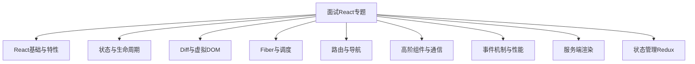

## 核心组件
- 组件与Props/State：组件化思想、Props单向传递、State驱动渲染、setState更新机制与批处理。
- 渲染与JSX：render原理、JSX编译、createElement生成虚拟DOM。
- Diff与Key：Tree/Component/Element三层策略、Key的作用与最佳实践。
- Fiber：可中断/可恢复的协作式调度、优先级与requestIdleCallback。
- 路由：BrowserRouter/HashRouter、Route/Link/NavLink、Switch/Redirect、Hooks(useHistory/useParams/useLocation)。
- 高阶组件：HOC模式、约定与ref转发、典型场景（权限、日志、性能监控）。
- 事件机制：合成事件、事件注册/冒泡/派发、与原生事件的执行顺序与阻止策略。
- 性能优化：避免内联函数、Fragment、事件绑定优化、Immutable、懒加载、SSR。
- 服务端渲染：SSR原理、同构、renderToString、StaticRouter上下文。
- Redux：Provider/connect、mapStateToProps/mapDispatchToProps、项目结构划分。

章节来源
- [React.md:1-140](file://docs/interview/React/React.md#L1-L140)
- [state_props.md:1-89](file://docs/interview/React/state_props.md#L1-L89)
- [setState.md:1-215](file://docs/interview/React/setState.md#L1-L215)
- [render.md:1-218](file://docs/interview/React/render.md#L1-L218)
- [diff.md:1-154](file://docs/interview/React/diff.md#L1-L154)
- [key.md:1-131](file://docs/interview/React/key.md#L1-L131)
- [Fiber.md:1-136](file://docs/interview/React/Fiber.md#L1-L136)
- [React Router.md:1-349](file://docs/interview/React/React Router.md#L1-L349)
- [React Router model.md:1-168](file://docs/interview/React/React Router model.md#L1-L168)
- [High order components.md:1-180](file://docs/interview/React/High order components.md#L1-L180)
- [communication.md:1-197](file://docs/interview/React/communication.md#L1-L197)
- [SyntheticEvent.md:1-155](file://docs/interview/React/SyntheticEvent.md#L1-L155)
- [Improve performance.md:1-206](file://docs/interview/React/Improve performance.md#L1-L206)
- [server side rendering.md:1-285](file://docs/interview/React/server side rendering.md#L1-L285)
- [how to use redux.md:1-231](file://docs/interview/React/how to use redux.md#L1-L231)

## 架构总览
React以组件为核心，通过Props/State驱动渲染，借助虚拟DOM与Diff算法高效更新UI；Fiber实现可中断/可恢复的协作式调度；路由通过BrowserRouter/HashRouter与Route/Link等组件实现SPA导航；状态管理可通过Redux连接React与集中式Store；SSR提升首屏性能与SEO。

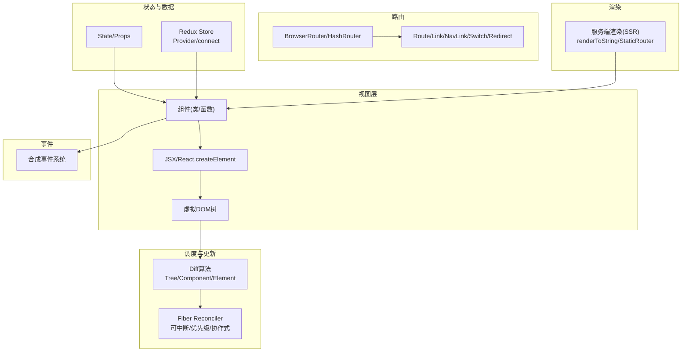

图表来源
- [render.md:1-218](file://docs/interview/React/render.md#L1-L218)
- [Fiber.md:1-136](file://docs/interview/React/Fiber.md#L1-L136)
- [diff.md:1-154](file://docs/interview/React/diff.md#L1-L154)
- [React Router.md:1-349](file://docs/interview/React/React Router.md#L1-L349)
- [how to use redux.md:1-231](file://docs/interview/React/how to use redux.md#L1-L231)
- [server side rendering.md:1-285](file://docs/interview/React/server side rendering.md#L1-L285)
- [SyntheticEvent.md:1-155](file://docs/interview/React/SyntheticEvent.md#L1-L155)

## 详细组件分析

### 组件、Props与State
- 组件化思想：一切皆组件，函数组件与类组件均可，Props自上而下传递，State在组件内部管理。
- setState机制：异步更新、批处理合并、函数式setState保证依赖前一个state。
- 渲染触发：类组件setState必触发render；函数组件useState在值变化时触发render。

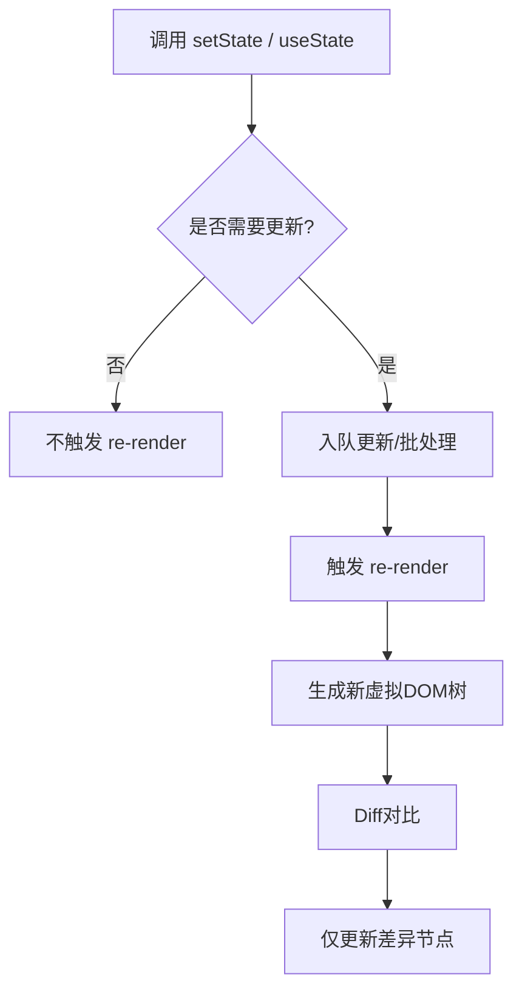

图表来源
- [setState.md:1-215](file://docs/interview/React/setState.md#L1-L215)
- [render.md:1-218](file://docs/interview/React/render.md#L1-L218)

章节来源
- [React.md:1-140](file://docs/interview/React/React.md#L1-L140)
- [state_props.md:1-89](file://docs/interview/React/state_props.md#L1-L89)
- [setState.md:1-215](file://docs/interview/React/setState.md#L1-L215)
- [render.md:1-218](file://docs/interview/React/render.md#L1-L218)

### 虚拟DOM与Diff算法
- 虚拟DOM：以JS对象描述真实DOM，JSX经编译为createElement，形成VDOM树。
- Diff策略：Tree层级拒绝跨级移动；Component层级同类型才深入；Element层级用Key定位节点，减少移动/插入/删除。
- Key最佳实践：稳定唯一、不使用随机数、index非key。

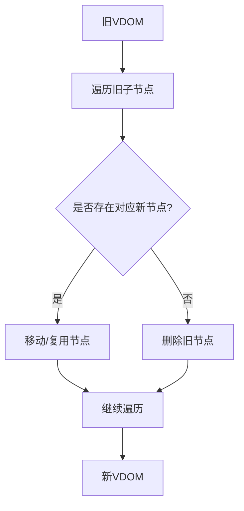

图表来源
- [diff.md:1-154](file://docs/interview/React/diff.md#L1-L154)
- [key.md:1-131](file://docs/interview/React/key.md#L1-L131)
- [Real DOM_Virtual DOM.md:1-94](file://docs/interview/React/Real DOM_Virtual DOM.md#L1-L94)

章节来源
- [Real DOM_Virtual DOM.md:1-94](file://docs/interview/React/Real DOM_Virtual DOM.md#L1-L94)
- [diff.md:1-154](file://docs/interview/React/diff.md#L1-L154)
- [key.md:1-131](file://docs/interview/React/key.md#L1-L131)

### Fiber架构与调度
- 问题：Stack Reconciler渲染过程不可中断，长任务阻塞主线程。
- 解决：Fiber将渲染拆分为多个子任务，具备优先级、可中断/恢复、协作式调度；基于链表结构快速定位下一个执行目标。
- 数据结构：Fiber节点包含tag、child、sibling、return、pendingProps、memoizedProps、updateQueue、effect等。

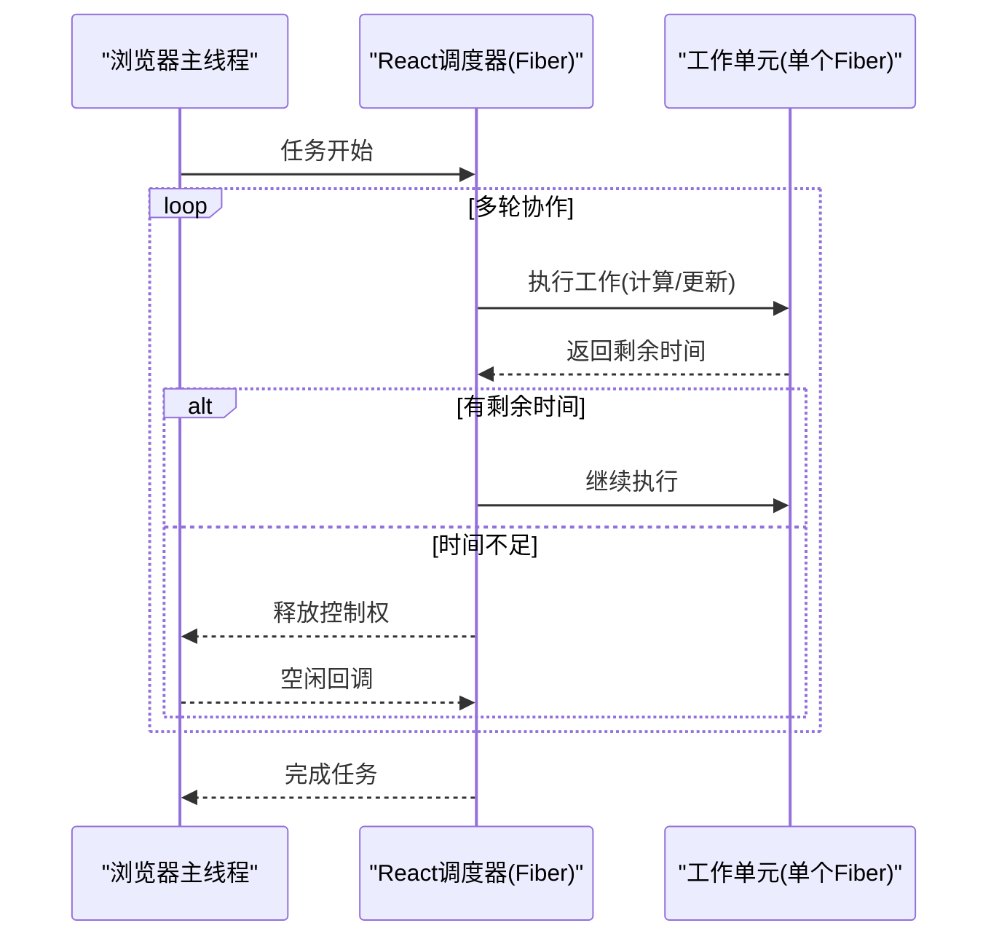

图表来源
- [Fiber.md:1-136](file://docs/interview/React/Fiber.md#L1-L136)

章节来源
- [Fiber.md:1-136](file://docs/interview/React/Fiber.md#L1-L136)

### React Router与导航
- 模式：hash模式(HashRouter)与history模式(BrowserRouter)。
- 组件：Route、Link/NavLink、Switch、Redirect；Hooks：useHistory、useParams、useLocation。
- 参数传递：动态路由(:id)、search查询参数、to传对象。

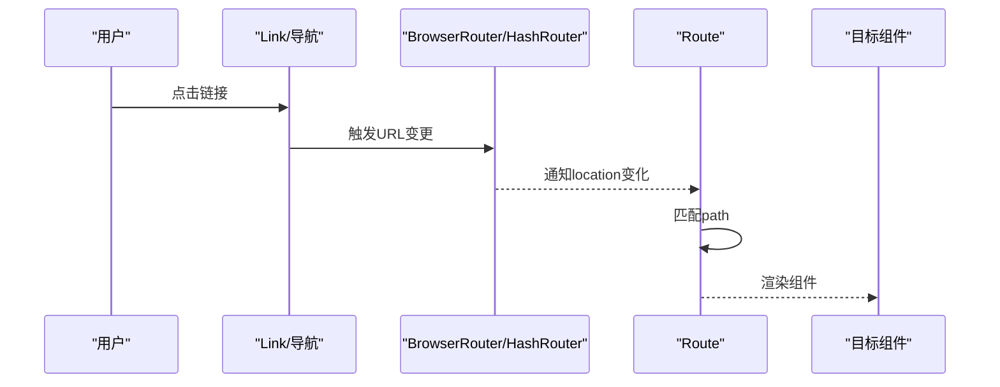

图表来源
- [React Router.md:1-349](file://docs/interview/React/React Router.md#L1-L349)
- [React Router model.md:1-168](file://docs/interview/React/React Router model.md#L1-L168)

章节来源
- [React Router.md:1-349](file://docs/interview/React/React Router.md#L1-L349)
- [React Router model.md:1-168](file://docs/interview/React/React Router model.md#L1-L168)

### 高阶组件(HOC)与组件通信
- HOC：以函数包装组件，透传props、避免重复逻辑、注意ref转发与显示名。
- 通信：父子、子父、兄弟、跨代(Provider/Consumer或Context)、非关系(全局状态如Redux)。

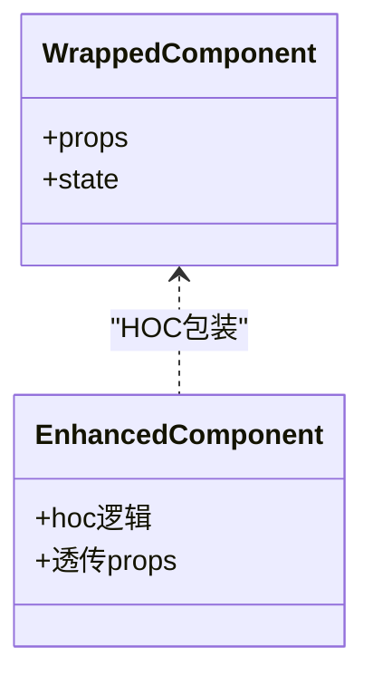

图表来源
- [High order components.md:1-180](file://docs/interview/React/High order components.md#L1-L180)
- [communication.md:1-197](file://docs/interview/React/communication.md#L1-L197)

章节来源
- [High order components.md:1-180](file://docs/interview/React/High order components.md#L1-L180)
- [communication.md:1-197](file://docs/interview/React/communication.md#L1-L197)

### 事件机制与合成事件
- 合成事件：React统一在document注册事件，跨浏览器包装，提供与原生事件相同接口。
- 执行顺序：原生事件先于React事件，最后document事件；阻止冒泡需区分stopPropagation与stopImmediatePropagation。

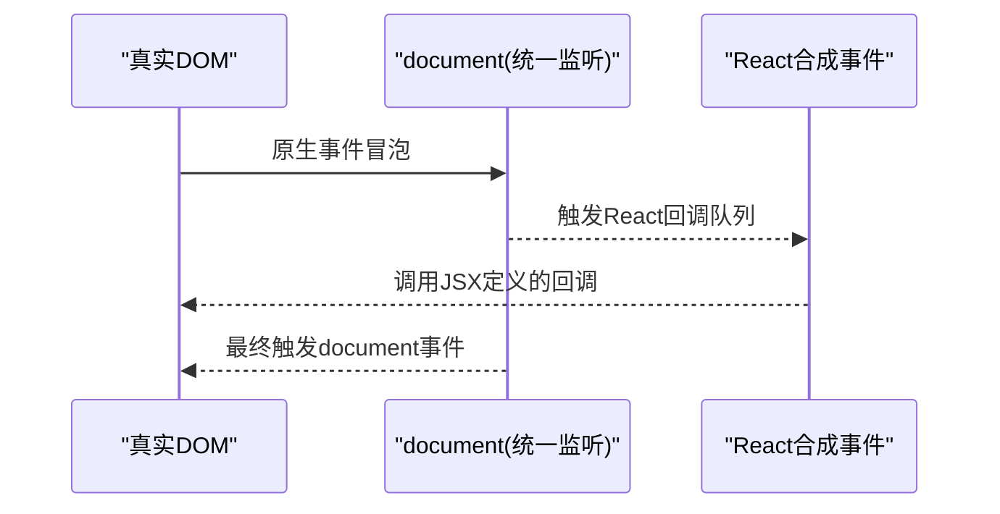

图表来源
- [SyntheticEvent.md:1-155](file://docs/interview/React/SyntheticEvent.md#L1-L155)

章节来源
- [SyntheticEvent.md:1-155](file://docs/interview/React/SyntheticEvent.md#L1-L155)

### 性能优化
- 避免内联函数与bind/箭头函数在render中创建新实例；使用Fragment减少多余容器；事件绑定优化。
- 使用Immutable减少深比较成本；React.lazy/Suspense实现懒加载；SSR加速首屏。
- shouldComponentUpdate/PureComponent/React.memo减少不必要渲染。

章节来源
- [Improve performance.md:1-206](file://docs/interview/React/Improve performance.md#L1-L206)

### 服务端渲染(SSR)
- 原理：服务端renderToString生成HTML，客户端hydrate接管交互；路由需用StaticRouter并传递context。
- 同构：服务端渲染结构，客户端绑定事件与交互。

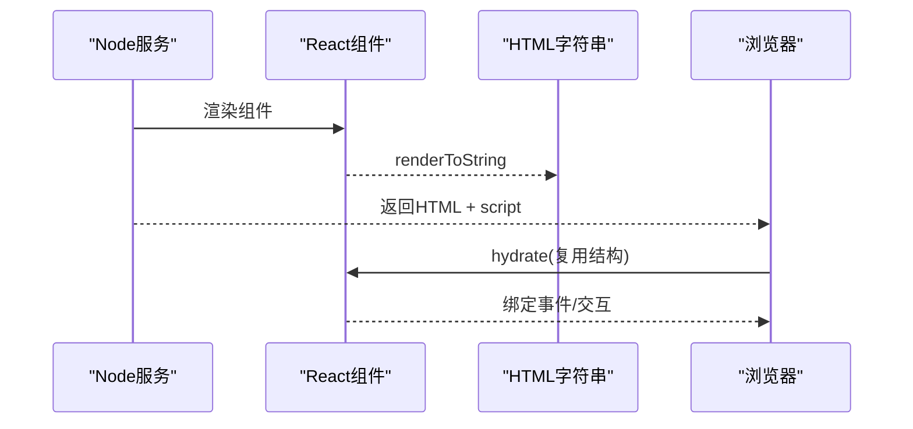

图表来源
- [server side rendering.md:1-285](file://docs/interview/React/server side rendering.md#L1-L285)

章节来源
- [server side rendering.md:1-285](file://docs/interview/React/server side rendering.md#L1-L285)

### Redux在React中的使用
- Provider：将store注入应用根部。
- connect：mapStateToProps与mapDispatchToProps将state/dispatch映射为props。
- 项目结构：按角色(MVC)或按功能模块划分。

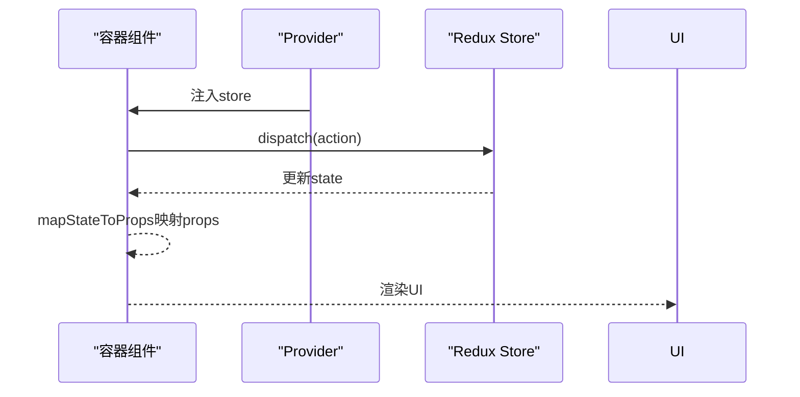

图表来源
- [how to use redux.md:1-231](file://docs/interview/React/how to use redux.md#L1-L231)

章节来源
- [how to use redux.md:1-231](file://docs/interview/React/how to use redux.md#L1-L231)

## 依赖分析
- 组件与渲染：组件依赖Props/State，render生成VDOM，Diff更新真实DOM。
- Fiber：Reconciler依赖Fiber节点结构与优先级队列。
- 路由：Router监听URL变化，Route匹配并渲染组件。
- 事件：合成事件统一在document注册，与原生事件顺序相关。
- 状态：Redux通过Provider/connect与组件解耦。
- SSR：服务端renderToString与客户端hydrate配合。

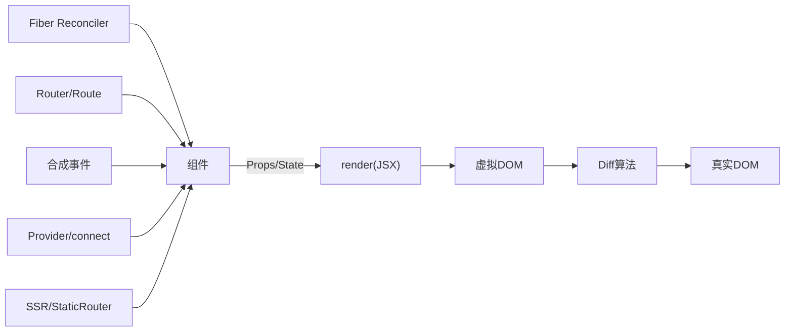

图表来源
- [render.md:1-218](file://docs/interview/React/render.md#L1-L218)
- [Fiber.md:1-136](file://docs/interview/React/Fiber.md#L1-L136)
- [React Router.md:1-349](file://docs/interview/React/React Router.md#L1-L349)
- [SyntheticEvent.md:1-155](file://docs/interview/React/SyntheticEvent.md#L1-L155)
- [how to use redux.md:1-231](file://docs/interview/React/how to use redux.md#L1-L231)
- [server side rendering.md:1-285](file://docs/interview/React/server side rendering.md#L1-L285)

## 性能考量
- 渲染层面：减少不必要的render，使用PureComponent/React.memo；避免内联函数与bind/箭头函数在render中创建新实例。
- 工程层面：代码分割与懒加载；Webpack/Treeshaking；SSR提升首屏。
- 机制层面：Fiber协作式调度；Diff算法最小化DOM变更；Key优化列表更新。

## 故障排查指南
- 列表渲染警告：未设置唯一key；建议使用稳定字段或避免使用index作为key。
- 事件冒泡：合成事件与原生事件顺序不同，需使用stopPropagation或stopImmediatePropagation区分处理。
- setState不生效：直接修改state不会触发更新，需通过setState；在setTimeout或原生事件中为同步更新。
- 路由跳转：HashRouter/History模式差异；Switch仅匹配首个Route；参数传递使用动态路由/查询参数/对象形式。
- SSR同构：服务端与客户端结构需一致，使用StaticRouter并传递context；hydrate失败多因结构不匹配。

章节来源
- [key.md:1-131](file://docs/interview/React/key.md#L1-L131)
- [SyntheticEvent.md:1-155](file://docs/interview/React/SyntheticEvent.md#L1-L155)
- [setState.md:1-215](file://docs/interview/React/setState.md#L1-L215)
- [React Router.md:1-349](file://docs/interview/React/React Router.md#L1-L349)
- [server side rendering.md:1-285](file://docs/interview/React/server side rendering.md#L1-L285)

## 结论
本指南从基础到进阶系统梳理React面试高频知识点，强调原理与实践结合，建议配合代码片段路径与可视化图示进行记忆与讲解，针对不同岗位侧重可调整复习重点（如前端岗偏重Hooks/Diff/Router，中高级偏重Fiber/SSR/性能）。

## 附录
- 常见面试题思路
  - 说说对React的理解：组件化、声明式、虚拟DOM、单向数据流。
  - setState执行机制：异步批处理、函数式更新、同步场景。
  - Diff与Key：Tree/Component/Element策略、Key稳定性与性能。
  - Fiber：协作式调度、优先级、可中断恢复。
  - React Router：模式与组件、参数传递、Hooks使用。
  - 事件机制：合成事件、执行顺序、阻止策略。
  - 性能优化：减少render、懒加载、SSR、Immutable。
  - SSR：原理、同构、StaticRouter、hydrate。
  - Redux：Provider/connect、mapStateToProps/mapDispatchToProps、项目结构。