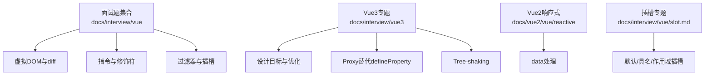
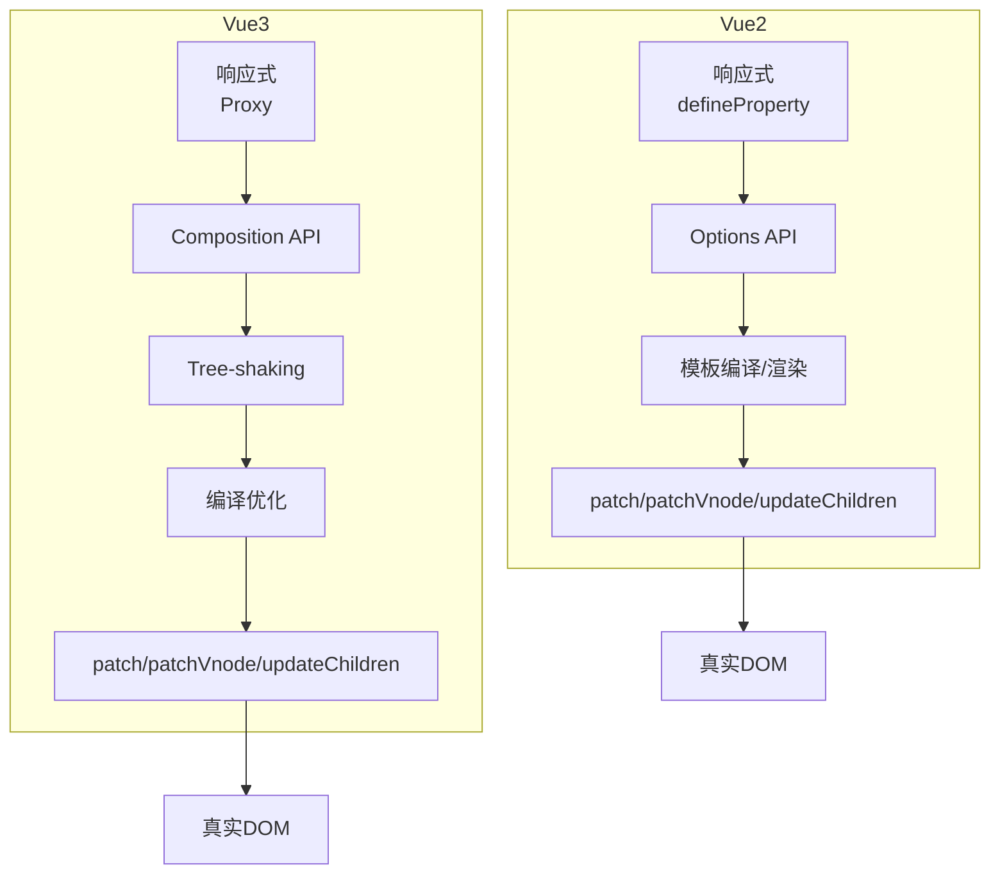
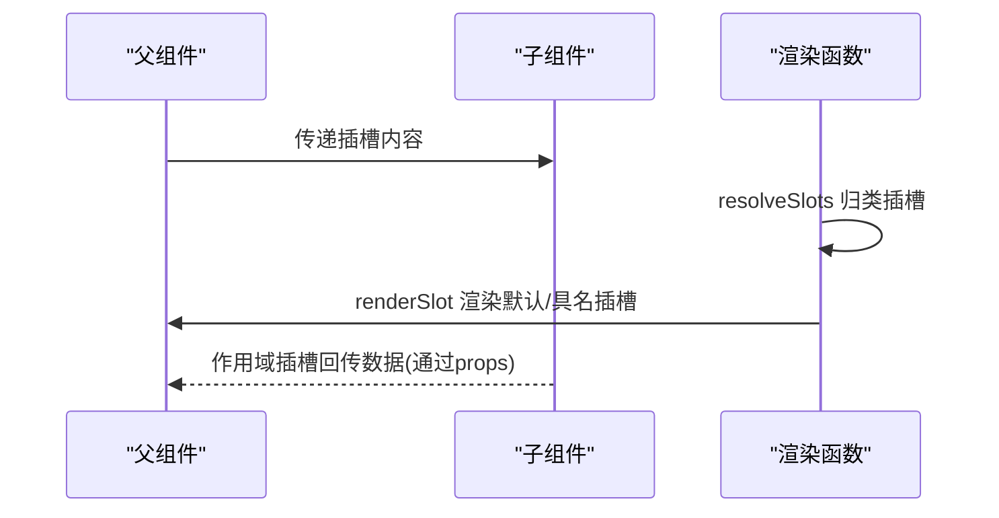
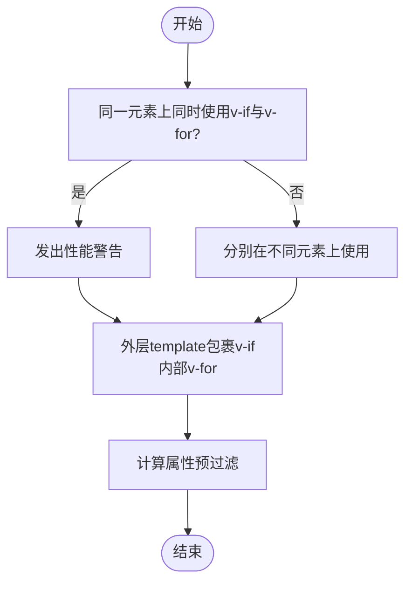
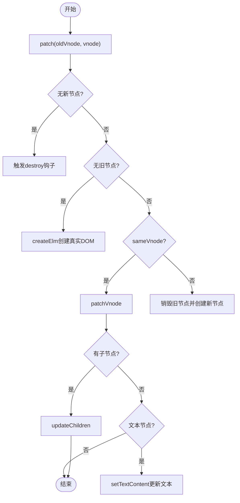
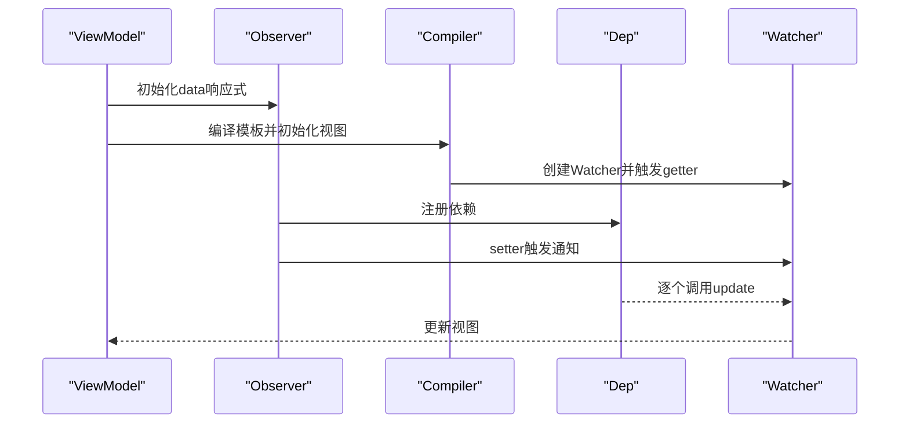
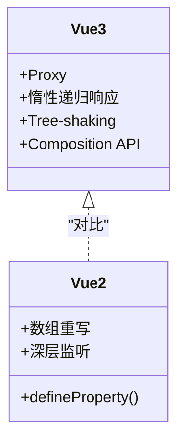
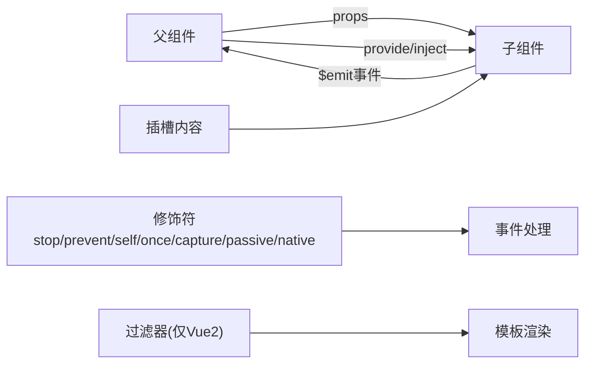

# Vue面试

<cite>
**本文引用的文件**   
- [面试官：有使用过vue吗？说说你对vue的理解](file://docs/interview/vue/vue.md)
- [面试官：Vue3.0的设计目标是什么？做了哪些优化](file://docs/interview/vue3/goal.md)
- [面试官：Vue3.0里为什么要用 Proxy API 替代 defineProperty API ？](file://docs/interview/vue3/proxy.md)
- [面试官：说说Vue 3.0中Treeshaking特性？举例说明一下？](file://docs/interview/vue3/treeshaking.md)
- [面试官：你了解vue的diff算法吗？说说看](file://docs/interview/vue/diff.md)
- [面试官：什么是虚拟DOM？如何实现一个虚拟DOM？说说你的思路](file://docs/interview/vue/vnode.md)
- [双向数据绑定](file://docs/interview/vue/bind.md)
- [面试官：v-if和v-for的优先级是什么？](file://docs/interview/vue/if_for.md)
- [面试官：v-show和v-if有什么区别？使用场景分别是什么？](file://docs/interview/vue/show_if.md)
- [面试官：Vue常用的修饰符有哪些有什么应用场景](file://docs/interview/vue/modifier.md)
- [面试官：Vue中的过滤器了解吗？过滤器的应用场景有哪些？](file://docs/interview/vue/filter.md)
- [data处理](file://docs/vue2/vue/reactive/data.md)
- [slot.md](file://docs/interview/vue/slot.md)
</cite>

## 目录
1. [引言](#引言)
2. [项目结构](#项目结构)
3. [核心组件](#核心组件)
4. [架构总览](#架构总览)
5. [详细组件分析](#详细组件分析)
6. [依赖分析](#依赖分析)
7. [性能考量](#性能考量)
8. [故障排查指南](#故障排查指南)
9. [结论](#结论)
10. [附录](#附录)

## 引言
本指南面向Vue面试，覆盖Vue2与Vue3的核心概念、差异对比、组件通信、生命周期、指令系统、路由与状态管理等主题。特别聚焦Vue3新特性（Composition API、响应式原理、Tree-shaking、Proxy替代defineProperty等）、虚拟DOM与diff算法、双向数据绑定原理、以及实际开发中的最佳实践与答题技巧。内容均来自仓库中的文档，确保与项目知识体系一致。

## 项目结构
本仓库包含大量前端面试与进阶知识文档，其中与Vue相关的内容主要分布在以下路径：
- docs/interview/vue：Vue面试题与原理详解
- docs/interview/vue3：Vue3专题（目标、Proxy、Tree-shaking）
- docs/vue2/vue/reactive：Vue2响应式与data处理
- docs/interview/vue/slot.md：插槽专题

**图表来源**
- [面试官：你了解vue的diff算法吗？说说看:1-341](file://docs/interview/vue/diff.md#L1-L341)
- [面试官：v-show和v-if有什么区别？使用场景分别是什么？:1-130](file://docs/interview/vue/show_if.md#L1-L130)
- [面试官：Vue3.0的设计目标是什么？做了哪些优化:1-238](file://docs/interview/vue3/goal.md#L1-L238)
- [面试官：Vue3.0里为什么要用 Proxy API 替代 defineProperty API ？:1-300](file://docs/interview/vue3/proxy.md#L1-L300)
- [面试官：说说Vue 3.0中Treeshaking特性？举例说明一下？:1-164](file://docs/interview/vue3/treeshaking.md#L1-L164)
- [data处理:1-162](file://docs/vue2/vue/reactive/data.md#L1-L162)
- [slot.md:1-294](file://docs/interview/vue/slot.md#L1-L294)

**章节来源**
- [面试官：有使用过vue吗？说说你对vue的理解:1-119](file://docs/interview/vue/vue.md#L1-L119)
- [面试官：Vue3.0的设计目标是什么？做了哪些优化:1-238](file://docs/interview/vue3/goal.md#L1-L238)
- [面试官：Vue3.0里为什么要用 Proxy API 替代 defineProperty API ？:1-300](file://docs/interview/vue3/proxy.md#L1-L300)
- [面试官：说说Vue 3.0中Treeshaking特性？举例说明一下？:1-164](file://docs/interview/vue3/treeshaking.md#L1-L164)
- [面试官：你了解vue的diff算法吗？说说看:1-341](file://docs/interview/vue/diff.md#L1-L341)
- [面试官：什么是虚拟DOM？如何实现一个虚拟DOM？说说你的思路:1-401](file://docs/interview/vue/vnode.md#L1-L401)
- [双向数据绑定:1-227](file://docs/interview/vue/bind.md#L1-L227)
- [面试官：v-if和v-for的优先级是什么？:1-152](file://docs/interview/vue/if_for.md#L1-L152)
- [面试官：v-show和v-if有什么区别？使用场景分别是什么？:1-130](file://docs/interview/vue/show_if.md#L1-L130)
- [面试官：Vue常用的修饰符有哪些有什么应用场景:1-260](file://docs/interview/vue/modifier.md#L1-L260)
- [面试官：Vue中的过滤器了解吗？过滤器的应用场景有哪些？:1-233](file://docs/interview/vue/filter.md#L1-L233)
- [data处理:1-162](file://docs/vue2/vue/reactive/data.md#L1-L162)
- [slot.md:1-294](file://docs/interview/vue/slot.md#L1-L294)

## 核心组件
- MVVM与组件化：Vue以MVVM为核心，强调视图与模型的自动同步；组件化提升复用性、可维护性与可调试性。
- 指令系统：v-if/v-show/v-for/v-bind/v-on/v-model等，配合修饰符实现丰富交互。
- 生命周期：挂载、更新、卸载阶段的钩子贯穿组件全生命周期。
- 虚拟DOM与diff：通过VNode树与diff算法最小化真实DOM变更。
- 响应式系统：Vue2基于Object.defineProperty，Vue3基于Proxy；Vue3引入Tree-shaking与Composition API。
- 状态管理：Vue2常用Vuex，Vue3推荐Pinia；二者均围绕state、actions、mutations/computed等概念组织。

**章节来源**
- [面试官：有使用过vue吗？说说你对vue的理解:46-119](file://docs/interview/vue/vue.md#L46-L119)
- [面试官：Vue3.0的设计目标是什么？做了哪些优化:5-55](file://docs/interview/vue3/goal.md#L5-L55)
- [面试官：Vue3.0里为什么要用 Proxy API 替代 defineProperty API ？:7-139](file://docs/interview/vue3/proxy.md#L7-L139)
- [面试官：说说Vue 3.0中Treeshaking特性？举例说明一下？:5-32](file://docs/interview/vue3/treeshaking.md#L5-L32)
- [面试官：你了解vue的diff算法吗？说说看:5-14](file://docs/interview/vue/diff.md#L5-L14)
- [面试官：什么是虚拟DOM？如何实现一个虚拟DOM？说说你的思路:5-16](file://docs/interview/vue/vnode.md#L5-L16)
- [data处理:3-64](file://docs/vue2/vue/reactive/data.md#L3-L64)

## 架构总览
Vue2/Vue3在架构层面的关键差异：
- 响应式内核：Vue2通过defineProperty遍历属性；Vue3通过Proxy拦截对象，天然支持新增/删除属性与数组方法监听，且惰性递归响应。
- 语法API：Vue2以Options API为主；Vue3引入Composition API，提升逻辑组织与复用能力。
- Tree-shaking：Vue3按需导出API，减少打包体积；Vue2全局API难以摇树。
- 虚拟DOM与diff：Vue2的patch/patchVnode/updateChildren实现同层比较与双向指针更新；Vue3沿用相似策略并结合编译优化（静态提升、事件缓存等）。

**图表来源**
- [面试官：Vue3.0的设计目标是什么？做了哪些优化:31-55](file://docs/interview/vue3/goal.md#L31-L55)
- [面试官：Vue3.0里为什么要用 Proxy API 替代 defineProperty API ？:142-280](file://docs/interview/vue3/proxy.md#L142-L280)
- [面试官：说说Vue 3.0中Treeshaking特性？举例说明一下？:35-43](file://docs/interview/vue3/treeshaking.md#L35-L43)
- [面试官：你了解vue的diff算法吗？说说看:57-101](file://docs/interview/vue/diff.md#L57-L101)

## 详细组件分析

### 组件通信与插槽（slot）
- 插槽本质：承载分发内容的出口，支持默认、具名与作用域插槽；作用域插槽允许子组件向父组件回传数据。
- 使用场景：布局组件、表格列、下拉选、弹窗等复用场景。
- 原理要点：renderSlot与resolveSlots将父组件内容归类到对应插槽；作用域插槽通过props在父组件解构使用。

**图表来源**
- [slot.md:164-286](file://docs/interview/vue/slot.md#L164-L286)

**章节来源**
- [slot.md:50-161](file://docs/interview/vue/slot.md#L50-L161)

### 指令系统与修饰符
- 常用指令：v-if、v-show、v-for、v-bind、v-on、v-model等。
- 修饰符类别：表单修饰符（lazy、trim、number）、事件修饰符（stop、prevent、self、once、capture、passive、native）、按键修饰符（enter、tab、delete、space、esc、方向键、系统修饰键）、v-bind修饰符（sync、prop、camel）。
- 优先级：v-for优先于v-if；避免在同一元素上同时使用v-if与v-for，建议在外层template或计算属性中预过滤。

**图表来源**
- [面试官：v-if和v-for的优先级是什么？:24-129](file://docs/interview/vue/if_for.md#L24-L129)

**章节来源**
- [面试官：Vue常用的修饰符有哪些有什么应用场景:11-254](file://docs/interview/vue/modifier.md#L11-L254)
- [面试官：v-if和v-for的优先级是什么？:24-152](file://docs/interview/vue/if_for.md#L24-L152)

### 虚拟DOM与diff算法
- 虚拟DOM：以JavaScript对象描述真实DOM，具备tag、data、children、text等属性；通过VNode树映射到真实DOM。
- diff策略：同层比较、双向指针从两端向中间收敛；命中key可显著提升复用效率。
- patch流程：patch/patchVnode/updateChildren分别处理节点一致、文本节点、子节点差异等分支。

**图表来源**
- [面试官：你了解vue的diff算法吗？说说看:57-186](file://docs/interview/vue/diff.md#L57-L186)

**章节来源**
- [面试官：什么是虚拟DOM？如何实现一个虚拟DOM？说说你的思路:5-148](file://docs/interview/vue/vnode.md#L5-L148)
- [面试官：你了解vue的diff算法吗？说说看:57-334](file://docs/interview/vue/diff.md#L57-L334)

### 双向数据绑定（MVVM）
- 核心三要素：Model、View、ViewModel；ViewModel负责数据变化更新视图、视图变化更新数据。
- 实现路径：Observer监听数据属性；Compiler解析指令模板；Watcher在依赖收集与通知更新中起桥梁作用。
- Vue2：defineProperty遍历属性，深层监听与数组方法重写；Vue3：Proxy拦截对象，惰性递归响应。

**图表来源**
- [双向数据绑定:35-47](file://docs/interview/vue/bind.md#L35-L47)

**章节来源**
- [双向数据绑定:13-214](file://docs/interview/vue/bind.md#L13-L214)
- [面试官：Vue3.0里为什么要用 Proxy API 替代 defineProperty API ？:7-139](file://docs/interview/vue3/proxy.md#L7-L139)

### Vue3新特性与性能优化
- 设计目标：更小（Tree-shaking）、更快（编译优化/SSR优化/事件缓存/静态提升）、更友好（Composition API/TS支持）。
- Proxy替代defineProperty：支持新增/删除属性、数组方法监听、惰性递归响应，避免Vue2中set/delete与数组重写。
- Tree-shaking：按需导入API，未使用功能不打入包体；对比Vue2全局API无法摇树。
- Composition API：逻辑组织与复用能力增强，避免mixin命名冲突与来源不清。

**图表来源**
- [面试官：Vue3.0的设计目标是什么？做了哪些优化:87-177](file://docs/interview/vue3/goal.md#L87-L177)
- [面试官：Vue3.0里为什么要用 Proxy API 替代 defineProperty API ？:142-280](file://docs/interview/vue3/proxy.md#L142-L280)
- [面试官：说说Vue 3.0中Treeshaking特性？举例说明一下？:35-158](file://docs/interview/vue3/treeshaking.md#L35-L158)

**章节来源**
- [面试官：Vue3.0的设计目标是什么？做了哪些优化:5-86](file://docs/interview/vue3/goal.md#L5-L86)
- [面试官：Vue3.0里为什么要用 Proxy API 替代 defineProperty API ？:142-280](file://docs/interview/vue3/proxy.md#L142-L280)
- [面试官：说说Vue 3.0中Treeshaking特性？举例说明一下？:35-158](file://docs/interview/vue3/treeshaking.md#L35-L158)

### Vue2响应式与data处理
- data处理流程：类型判断取值、命名冲突校验（与props/methods冲突、保留字段）、proxy代理、observe递归响应式。
- 作用：确保组件data为纯对象、避免命名冲突、提供响应式能力。

**章节来源**
- [data处理:18-64](file://docs/vue2/vue/reactive/data.md#L18-L64)

### 过滤器（Vue2）与替代方案（Vue3）
- Vue2过滤器：用于文本格式化，可串联；Vue3已废弃。
- 替代建议：使用计算属性或工具函数；在模板中通过方法调用或计算属性实现相同效果。

**章节来源**
- [面试官：Vue中的过滤器了解吗？过滤器的应用场景有哪些？:1-100](file://docs/interview/vue/filter.md#L1-L100)

## 依赖分析
- 组件间通信：props/events、provide/inject、全局状态（Vuex/Pinia）、插槽（默认/具名/作用域）。
- 指令与修饰符：事件修饰符（stop、prevent、self、once、capture、passive、native）、表单修饰符（lazy、trim、number）、按键修饰符、v-bind修饰符（sync、prop、camel）。
- 生命周期：beforeCreate、created、beforeMount、mounted、beforeUpdate、updated、beforeDestroy、destroyed（Vue2）；Vue3生命周期钩子名称与行为保持一致。

**图表来源**
- [面试官：v-show和v-if有什么区别？使用场景分别是什么？:21-37](file://docs/interview/vue/show_if.md#L21-L37)
- [面试官：Vue常用的修饰符有哪些有什么应用场景:56-149](file://docs/interview/vue/modifier.md#L56-L149)
- [slot.md:164-286](file://docs/interview/vue/slot.md#L164-L286)
- [面试官：Vue中的过滤器了解吗？过滤器的应用场景有哪些？:14-100](file://docs/interview/vue/filter.md#L14-L100)

**章节来源**
- [面试官：v-show和v-if有什么区别？使用场景分别是什么？:21-37](file://docs/interview/vue/show_if.md#L21-L37)
- [面试官：Vue常用的修饰符有哪些有什么应用场景:56-149](file://docs/interview/vue/modifier.md#L56-L149)
- [slot.md:164-286](file://docs/interview/vue/slot.md#L164-L286)
- [面试官：Vue中的过滤器了解吗？过滤器的应用场景有哪些？:14-100](file://docs/interview/vue/filter.md#L14-L100)

## 性能考量
- Tree-shaking：按需导入API，减少包体与执行时间。
- 编译优化：静态提升、事件监听缓存、SSR优化、diff优化。
- Proxy响应式：惰性递归，避免深层监听性能问题；天然支持新增/删除属性与数组方法。
- 指令优先级：避免在同一元素上同时使用v-if与v-for，必要时通过template或计算属性预过滤。
- v-show与v-if：频繁切换用v-show，条件很少改变用v-if；注意生命周期钩子触发差异。

**章节来源**
- [面试官：说说Vue 3.0中Treeshaking特性？举例说明一下？:152-162](file://docs/interview/vue3/treeshaking.md#L152-L162)
- [面试官：Vue3.0的设计目标是什么？做了哪些优化:39-48](file://docs/interview/vue3/goal.md#L39-L48)
- [面试官：Vue3.0里为什么要用 Proxy API 替代 defineProperty API ？:132-167](file://docs/interview/vue3/proxy.md#L132-L167)
- [面试官：v-if和v-for的优先级是什么？:131-152](file://docs/interview/vue/if_for.md#L131-L152)
- [面试官：v-show和v-if有什么区别？使用场景分别是什么？:37-124](file://docs/interview/vue/show_if.md#L37-L124)

## 故障排查指南
- v-if与v-for同时使用：出现性能浪费，建议外层template或计算属性预过滤。
- 插槽内容为空：检查父组件是否正确传递内容，确认具名插槽name与v-slot匹配。
- 修饰符顺序：事件修饰符顺序影响行为，如.prevent.self与.self.prevent含义不同。
- 过滤器废弃：Vue3中使用计算属性或方法替代过滤器。
- Proxy兼容性：IE不支持Proxy，需考虑降级策略或polyfill。

**章节来源**
- [面试官：v-if和v-for的优先级是什么？:131-152](file://docs/interview/vue/if_for.md#L131-L152)
- [slot.md:155-161](file://docs/interview/vue/slot.md#L155-L161)
- [面试官：Vue常用的修饰符有哪些有什么应用场景:95-139](file://docs/interview/vue/modifier.md#L95-L139)
- [面试官：Vue中的过滤器了解吗？过滤器的应用场景有哪些？:14-14](file://docs/interview/vue/filter.md#L14-L14)
- [面试官：Vue3.0里为什么要用 Proxy API 替代 defineProperty API ？:297-298](file://docs/interview/vue3/proxy.md#L297-L298)

## 结论
- Vue2与Vue3在响应式、API形态与打包体积方面存在显著差异；Vue3通过Proxy、Tree-shaking与Composition API显著提升开发体验与性能。
- 指令系统与修饰符是实现交互的关键；插槽与组件通信机制支撑高复用性。
- 虚拟DOM与diff算法保证最小化DOM变更；双向数据绑定与生命周期钩子贯穿组件开发全流程。
- 面试答题建议：先总后分、结合源码与编译产物（render函数）解释原理，辅以性能优化与最佳实践。

## 附录
- 面试答题技巧
  - 先讲概念与背景，再结合源码与编译产物解释实现细节。
  - 对比Vue2与Vue3差异，突出Vue3优势与迁移成本。
  - 以场景化案例说明指令、修饰符、插槽、过滤器等的使用与替代方案。
  - 关注性能优化与工程化实践，体现对Tree-shaking、编译优化、生命周期钩子的掌握。