# 算法面试

<cite>
**本文引用的文件**
- [Algorithm.md](file://docs/frontend-advanced/algorithm/Algorithm.md)
- [structure.md](file://docs/frontend-advanced/algorithm/structure.md)
- [stack_queue.md](file://docs/frontend-advanced/algorithm/stack_queue.md)
- [array.md](file://docs/frontend-advanced/algorithm/array.md)
- [string.md](file://docs/frontend-advanced/algorithm/string.md)
- [linked-list.md](file://docs/frontend-advanced/algorithm/linked-list.md)
- [tree-example.md](file://docs/frontend-advanced/algorithm/tree-example.md)
- [dynamic-programming.md](file://docs/frontend-advanced/algorithm/dynamic-programming.md)
- [greedy.md](file://docs/frontend-advanced/algorithm/greedy.md)
- [back-trace.md](file://docs/frontend-advanced/algorithm/back-trace.md)
- [bubbleSort.md](file://docs/frontend-advanced/algorithm/bubbleSort.md)
- [selectionSort.md](file://docs/frontend-advanced/algorithm/selectionSort.md)
- [design1.md](file://docs/frontend-advanced/algorithm/design1.md)
</cite>

## 目录
1. [简介](#简介)
2. [项目结构](#项目结构)
3. [核心组件](#核心组件)
4. [架构概览](#架构概览)
5. [详细组件分析](#详细组件分析)
6. [依赖分析](#依赖分析)
7. [性能考量](#性能考量)
8. [故障排查指南](#故障排查指南)
9. [结论](#结论)
10. [附录](#附录)

## 简介
本指南面向算法面试，系统梳理常见数据结构与算法题型，覆盖数组、字符串、链表、树、图等；归纳动态规划、贪心、回溯等高级技巧；总结排序与搜索要点；并提供 LeetCode 等平台常见题目的解题思路与实现路径，帮助在有限时间内给出最优解。

## 项目结构
本仓库的前端高级算法专题位于 docs/frontend-advanced/algorithm 目录，包含：
- 算法与数据结构基础
- 线性结构（栈、队列、链表）
- 数组与字符串算法案例
- 链表、树的实战题
- 动态规划、贪心、回溯
- 排序与搜索思想
- 设计范式（分而治之、动态规划）

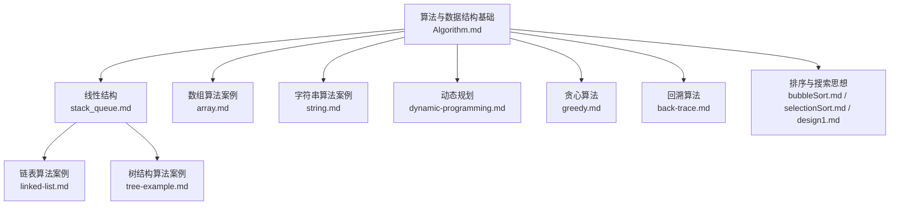

图表来源
- [Algorithm.md:1-60](file://docs/frontend-advanced/algorithm/Algorithm.md#L1-L60)
- [stack_queue.md:1-283](file://docs/frontend-advanced/algorithm/stack_queue.md#L1-L283)
- [array.md:1-161](file://docs/frontend-advanced/algorithm/array.md#L1-L161)
- [string.md:1-207](file://docs/frontend-advanced/algorithm/string.md#L1-L207)
- [linked-list.md:1-342](file://docs/frontend-advanced/algorithm/linked-list.md#L1-L342)
- [tree-example.md:1-532](file://docs/frontend-advanced/algorithm/tree-example.md#L1-L532)
- [dynamic-programming.md:1-210](file://docs/frontend-advanced/algorithm/dynamic-programming.md#L1-L210)
- [greedy.md:1-380](file://docs/frontend-advanced/algorithm/greedy.md#L1-L380)
- [back-trace.md:1-433](file://docs/frontend-advanced/algorithm/back-trace.md#L1-L433)
- [bubbleSort.md:1-104](file://docs/frontend-advanced/algorithm/bubbleSort.md#L1-L104)
- [selectionSort.md:1-88](file://docs/frontend-advanced/algorithm/selectionSort.md#L1-L88)
- [design1.md:1-86](file://docs/frontend-advanced/algorithm/design1.md#L1-L86)

章节来源
- [Algorithm.md:1-60](file://docs/frontend-advanced/algorithm/Algorithm.md#L1-L60)
- [structure.md:1-80](file://docs/frontend-advanced/algorithm/structure.md#L1-L80)

## 核心组件
- 算法与数据结构基础：明确算法特性、数据结构分类与关系，奠定解题思维。
- 线性结构：栈、队列、链表的定义、操作与典型应用。
- 数组与字符串：双指针、滑动窗口、原地变换等高频技巧。
- 链表与树：指针操作、层序遍历、递归与迭代、BST 性质。
- 高级技巧：动态规划、贪心、回溯的通用步骤与典型题型。
- 排序与搜索：分而治之、二分搜索、选择/冒泡排序思想与优化。
- 设计范式：分而治之与动态规划的区别与适用场景。

章节来源
- [Algorithm.md:1-60](file://docs/frontend-advanced/algorithm/Algorithm.md#L1-L60)
- [structure.md:1-80](file://docs/frontend-advanced/algorithm/structure.md#L1-L80)
- [stack_queue.md:1-283](file://docs/frontend-advanced/algorithm/stack_queue.md#L1-L283)
- [array.md:1-161](file://docs/frontend-advanced/algorithm/array.md#L1-L161)
- [string.md:1-207](file://docs/frontend-advanced/algorithm/string.md#L1-L207)
- [linked-list.md:1-342](file://docs/frontend-advanced/algorithm/linked-list.md#L1-L342)
- [tree-example.md:1-532](file://docs/frontend-advanced/algorithm/tree-example.md#L1-L532)
- [dynamic-programming.md:1-210](file://docs/frontend-advanced/algorithm/dynamic-programming.md#L1-L210)
- [greedy.md:1-380](file://docs/frontend-advanced/algorithm/greedy.md#L1-L380)
- [back-trace.md:1-433](file://docs/frontend-advanced/algorithm/back-trace.md#L1-L433)
- [bubbleSort.md:1-104](file://docs/frontend-advanced/algorithm/bubbleSort.md#L1-L104)
- [selectionSort.md:1-88](file://docs/frontend-advanced/algorithm/selectionSort.md#L1-L88)
- [design1.md:1-86](file://docs/frontend-advanced/algorithm/design1.md#L1-L86)

## 架构概览
本专题以“数据结构—算法技巧—题型实践”的层次组织，形成“基础—方法—应用”的闭环：
- 基础层：数据结构定义与关系（数组、栈、队列、链表、树、图、堆、散列表）。
- 方法层：分而治之、动态规划、贪心、回溯等设计范式与步骤。
- 应用层：数组/字符串/链表/树/图等题型的套路与模板。

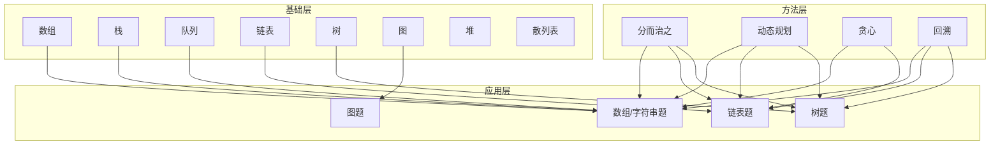

图表来源
- [structure.md:23-80](file://docs/frontend-advanced/algorithm/structure.md#L23-L80)
- [design1.md:3-86](file://docs/frontend-advanced/algorithm/design1.md#L3-L86)
- [dynamic-programming.md:1-210](file://docs/frontend-advanced/algorithm/dynamic-programming.md#L1-L210)
- [greedy.md:1-380](file://docs/frontend-advanced/algorithm/greedy.md#L1-L380)
- [back-trace.md:1-433](file://docs/frontend-advanced/algorithm/back-trace.md#L1-L433)

## 详细组件分析

### 数据结构总览与关系
- 线性结构：数组（随机访问）、栈（后进先出）、队列（先进先出）、链表（插入/删除 O(1)）。
- 非线性结构：树（父子关系）、图（多对多）、堆（完全二叉树性质）、散列表（键值映射）。
- 关系与选择：根据读写特征与性能需求选择合适结构，如 LRU 缓存常用链表 + 哈希表。

章节来源
- [structure.md:1-80](file://docs/frontend-advanced/algorithm/structure.md#L1-L80)
- [stack_queue.md:1-283](file://docs/frontend-advanced/algorithm/stack_queue.md#L1-L283)

### 线性结构：栈、队列、链表
- 栈：入栈/出栈操作，典型应用括号匹配、函数调用栈。
- 队列：循环队列避免假溢，典型应用 BFS、滑动窗口。
- 链表：虚拟头节点统一操作，快慢指针定位，指针穿针引线。

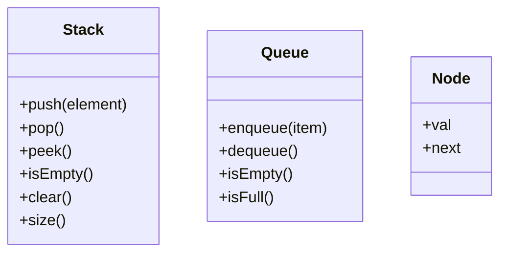

图表来源
- [stack_queue.md:13-138](file://docs/frontend-advanced/algorithm/stack_queue.md#L13-L138)
- [linked-list.md:81-96](file://docs/frontend-advanced/algorithm/linked-list.md#L81-L96)

章节来源
- [stack_queue.md:1-283](file://docs/frontend-advanced/algorithm/stack_queue.md#L1-L283)
- [linked-list.md:1-342](file://docs/frontend-advanced/algorithm/linked-list.md#L1-L342)

### 数组算法案例
- 移除元素：快慢指针原地覆盖。
- 有序数组的平方：首尾双指针从大到小填充。
- 长度最小的子数组：滑动窗口（双指针）维护窗口和。
- 螺旋矩阵：按圈层填充，控制起始与偏移。

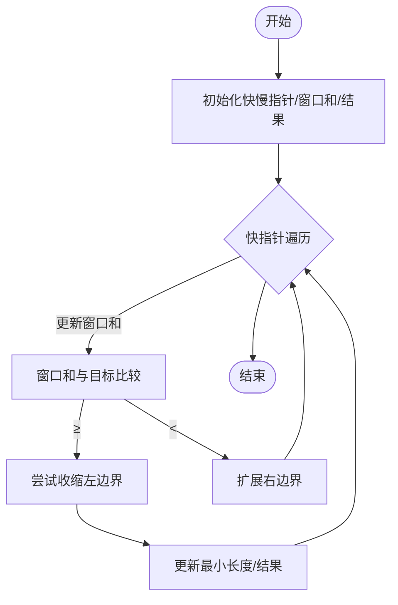

图表来源
- [array.md:75-109](file://docs/frontend-advanced/algorithm/array.md#L75-L109)

章节来源
- [array.md:1-161](file://docs/frontend-advanced/algorithm/array.md#L1-L161)

### 字符串算法案例
- 反转字符串：双指针原地交换。
- 反转字符串II：按 2k 区间反转前 k 个字符。
- 替换空格：从后向前填充，避免覆盖。
- 翻转单词：先去多余空格，再整体反转与逐词反转。
- 左旋转字符串：三次反转拼接。
- 重复的子字符串：枚举子串长度并重复验证。

章节来源
- [string.md:1-207](file://docs/frontend-advanced/algorithm/string.md#L1-L207)

### 链表算法案例
- 原则：画图、指针修改、链表拼接、边界与环。
- 技巧：虚拟头、快慢指针、穿针引线、先穿再排后判空。
- 题型：移除链表元素、反转链表、两两交换、删除倒数第 N 个、链表相交。

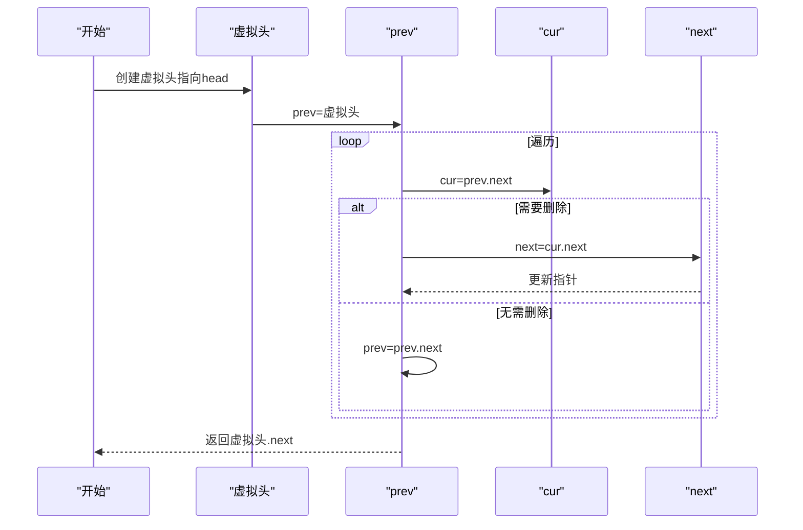

图表来源
- [linked-list.md:72-215](file://docs/frontend-advanced/algorithm/linked-list.md#L72-L215)

章节来源
- [linked-list.md:1-342](file://docs/frontend-advanced/algorithm/linked-list.md#L1-L342)

### 树结构算法案例
- 层序遍历：队列逐层收集，记录每层长度。
- 右视图/层平均值/最大值：按层处理，维护统计量。
- 填充右侧指针：层内节点 next 指向队列下一个。
- 最大/最小深度：BFS 层数即深度。
- 对称二叉树：递归比较外侧与内侧。
- BST 搜索/验证/最小绝对差：中序遍历有序性。
- 最近公共祖先：后序递归返回条件。

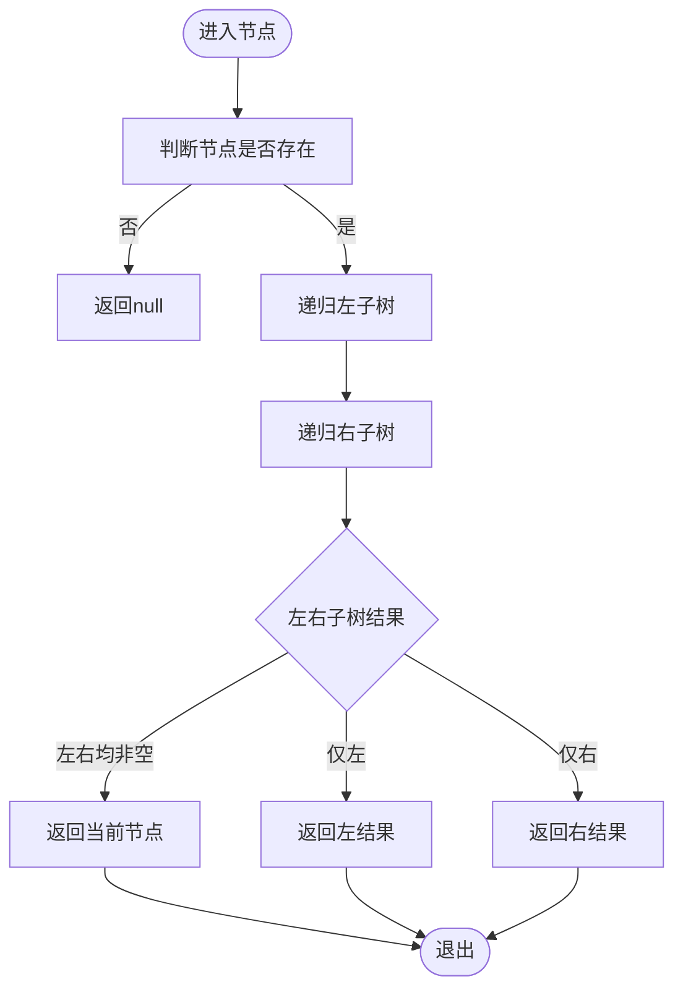

图表来源
- [tree-example.md:510-531](file://docs/frontend-advanced/algorithm/tree-example.md#L510-L531)

章节来源
- [tree-example.md:1-532](file://docs/frontend-advanced/algorithm/tree-example.md#L1-L532)

### 动态规划
- 定义：重叠子问题 + 最优子结构。
- 步骤：dp 定义、递推公式、初始化、遍历顺序、举例推导。
- 典型题：爬楼梯、最小花费爬楼梯、不同路径、整数拆分、分割等和子集、最后一块石头、一和零、零钱兑换 II。

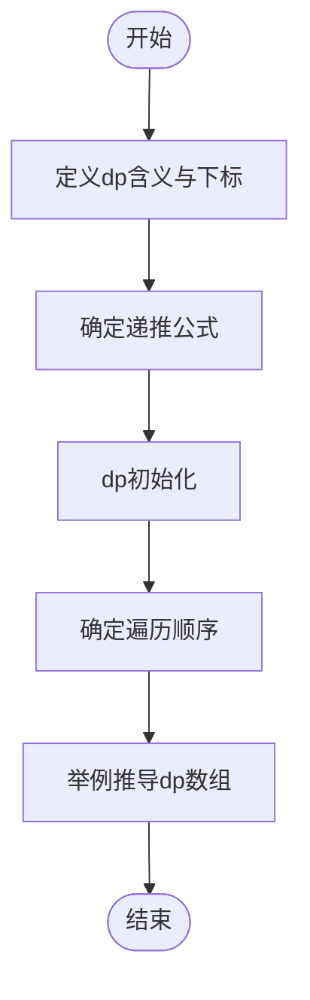

图表来源
- [dynamic-programming.md:9-16](file://docs/frontend-advanced/algorithm/dynamic-programming.md#L9-L16)

章节来源
- [dynamic-programming.md:1-210](file://docs/frontend-advanced/algorithm/dynamic-programming.md#L1-L210)

### 贪心算法
- 本质：每步局部最优达到全局最优。
- 步骤：分解子问题、选择贪心策略、合并解。
- 典型题：分发饼干、最大子数组和、买卖股票 II、跳跃游戏/II、K 次取反最大化、加油站、分发糖果、柠檬水找零、用最少箭引爆气球、无重叠区间、划分字母区间、合并区间、单调递增数字。

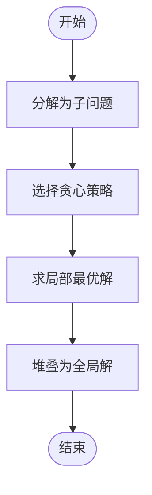

图表来源
- [greedy.md:5-13](file://docs/frontend-advanced/algorithm/greedy.md#L5-L13)

章节来源
- [greedy.md:1-380](file://docs/frontend-advanced/algorithm/greedy.md#L1-L380)

### 回溯算法
- 本质：在搜索空间树中穷举，三部曲：函数参数、终止条件、单层搜索逻辑。
- 典型题：组合、电话号码的字母组合、组合总和/II、切割复原 IP 地址、子集/II、全排列/II、N 皇后。

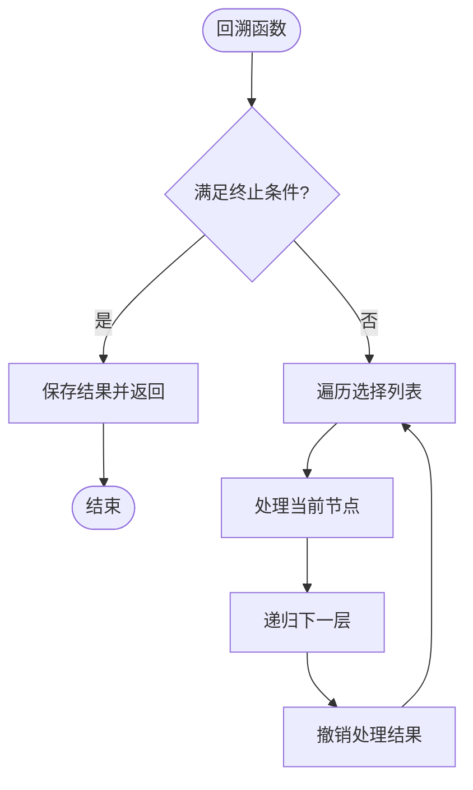

图表来源
- [back-trace.md:29-81](file://docs/frontend-advanced/algorithm/back-trace.md#L29-L81)

章节来源
- [back-trace.md:1-433](file://docs/frontend-advanced/algorithm/back-trace.md#L1-L433)

### 排序与搜索思想
- 冒泡排序：相邻比较与交换，稳定，时间复杂度 O(n^2)，可优化提前结束与边界收敛。
- 选择排序：每轮选择最小值，不稳定，时间复杂度 O(n^2)。
- 分而治之：分解、解决、合并；二分搜索递归实现；归并/快速排序体现该思想。

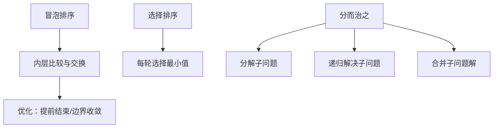

图表来源
- [bubbleSort.md:69-98](file://docs/frontend-advanced/algorithm/bubbleSort.md#L69-L98)
- [selectionSort.md:66-88](file://docs/frontend-advanced/algorithm/selectionSort.md#L66-L88)
- [design1.md:26-42](file://docs/frontend-advanced/algorithm/design1.md#L26-L42)

章节来源
- [bubbleSort.md:1-104](file://docs/frontend-advanced/algorithm/bubbleSort.md#L1-L104)
- [selectionSort.md:1-88](file://docs/frontend-advanced/algorithm/selectionSort.md#L1-L88)
- [design1.md:1-86](file://docs/frontend-advanced/algorithm/design1.md#L1-L86)

## 依赖分析
- 结构耦合：数组/字符串/链表/树均依赖线性结构（栈/队列）与双指针技巧；动态规划依赖最优子结构与重叠子问题；贪心依赖局部最优策略；回溯依赖搜索树与剪枝。
- 外部依赖：LeetCode 题目作为具体实现载体，提供题意与约束，驱动算法设计与实现。

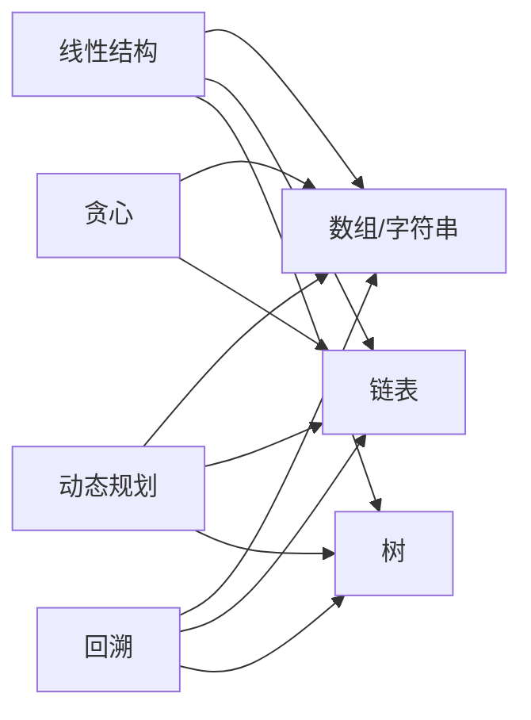

图表来源
- [stack_queue.md:1-283](file://docs/frontend-advanced/algorithm/stack_queue.md#L1-L283)
- [array.md:1-161](file://docs/frontend-advanced/algorithm/array.md#L1-L161)
- [linked-list.md:1-342](file://docs/frontend-advanced/algorithm/linked-list.md#L1-L342)
- [tree-example.md:1-532](file://docs/frontend-advanced/algorithm/tree-example.md#L1-L532)
- [dynamic-programming.md:1-210](file://docs/frontend-advanced/algorithm/dynamic-programming.md#L1-L210)
- [greedy.md:1-380](file://docs/frontend-advanced/algorithm/greedy.md#L1-L380)
- [back-trace.md:1-433](file://docs/frontend-advanced/algorithm/back-trace.md#L1-L433)

## 性能考量
- 时间复杂度：数组/字符串双指针与滑窗常为 O(n)；链表指针操作 O(1) 插入/删除；树的遍历 O(n)；动态规划通常 O(n) 或 O(n^2) 等，取决于状态维度；贪心多数 O(n)；回溯指数级，需剪枝。
- 空间复杂度：栈/队列/递归深度决定额外空间；动态规划可用滚动数组降维；哈希表辅助查询可降低时间成本。
- 优化技巧：预处理（前缀和/后缀和）、双指针、滑动窗口、分治、记忆化、贪心策略选择、回溯剪枝。

## 故障排查指南
- 链表类问题
  - 症状：死循环/断链/越界
  - 排查：画图定位指针变更；使用虚拟头；检查边界与空指针
- 数组/字符串
  - 症状：越界/重复/遗漏
  - 排查：确认索引范围；双指针边界；滑窗收缩条件
- 树
  - 症状：递归错误/层序统计异常
  - 排查：终止条件；层长记录；中序/前序/后序一致性
- 动态规划
  - 症状：状态转移错误/初始化不当
  - 排查：dp 含义与下标；递推公式；初始化与遍历顺序
- 贪心
  - 症状：局部最优不等价全局最优
  - 排查：策略正确性证明；边界与特例
- 回溯
  - 症状：重复组合/超时
  - 排查：剪枝条件；去重；终止条件

章节来源
- [linked-list.md:52-71](file://docs/frontend-advanced/algorithm/linked-list.md#L52-L71)
- [array.md:75-109](file://docs/frontend-advanced/algorithm/array.md#L75-L109)
- [tree-example.md:187-260](file://docs/frontend-advanced/algorithm/tree-example.md#L187-L260)
- [dynamic-programming.md:9-16](file://docs/frontend-advanced/algorithm/dynamic-programming.md#L9-L16)
- [greedy.md:5-13](file://docs/frontend-advanced/algorithm/greedy.md#L5-L13)
- [back-trace.md:29-81](file://docs/frontend-advanced/algorithm/back-trace.md#L29-L81)

## 结论
本指南以数据结构为基础，以设计范式为方法，以题型实践为落点，构建了系统化的算法面试准备体系。建议按“理解—模板—练习—优化”的路径推进，结合本仓库的案例与步骤，快速掌握高频题型与通用套路。

## 附录
- 常见题型清单（按主题）
  - 数组：移除元素、有序数组平方、最小子数组、螺旋矩阵
  - 字符串：反转、替换空格、翻转单词、左旋转、重复子串
  - 链表：反转、两两交换、删除倒数 N、相交
  - 树：右视图、层平均值、最大/最小深度、对称、BST 操作、最近公共祖先
  - 动态规划：爬楼梯、不同路径、分割等和子集、最后一块石头、一和零、零钱兑换 II
  - 贪心：最大子数组和、跳跃游戏、K 次取反、合并区间、划分字母区间
  - 回溯：组合、电话号码、组合总和、切割 IP、子集、全排列、N 皇后
  - 排序与搜索：冒泡/选择排序思想、二分搜索、分而治之