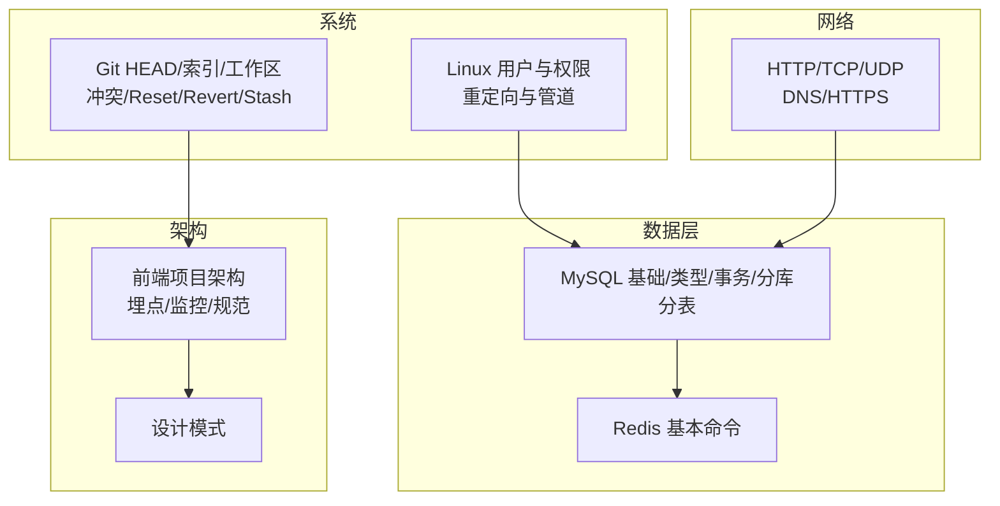
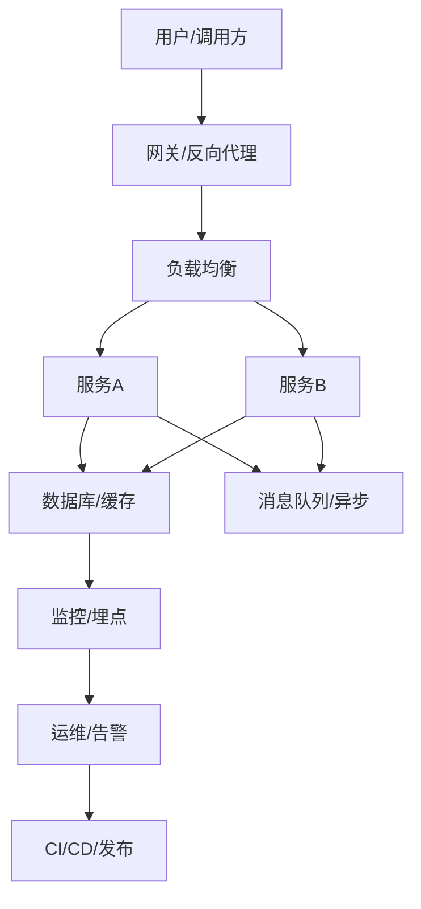
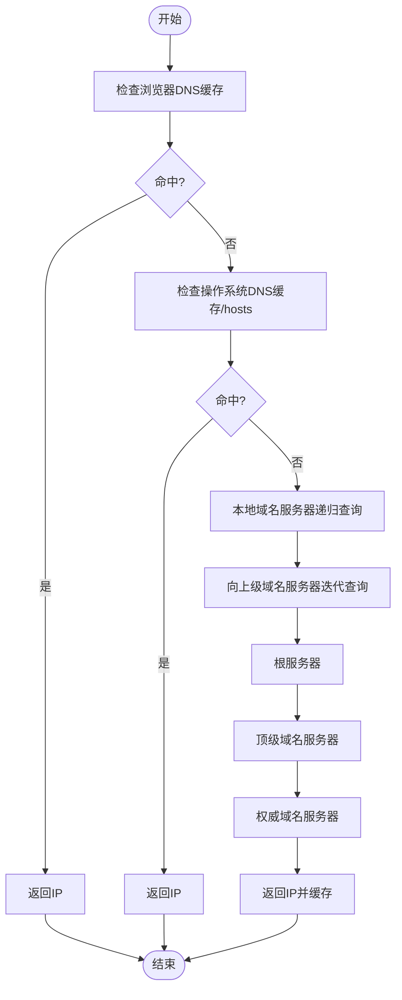
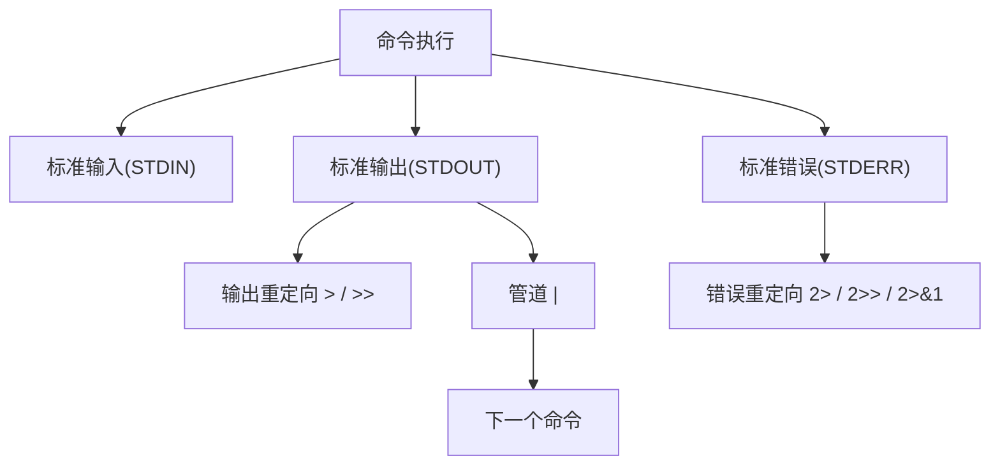
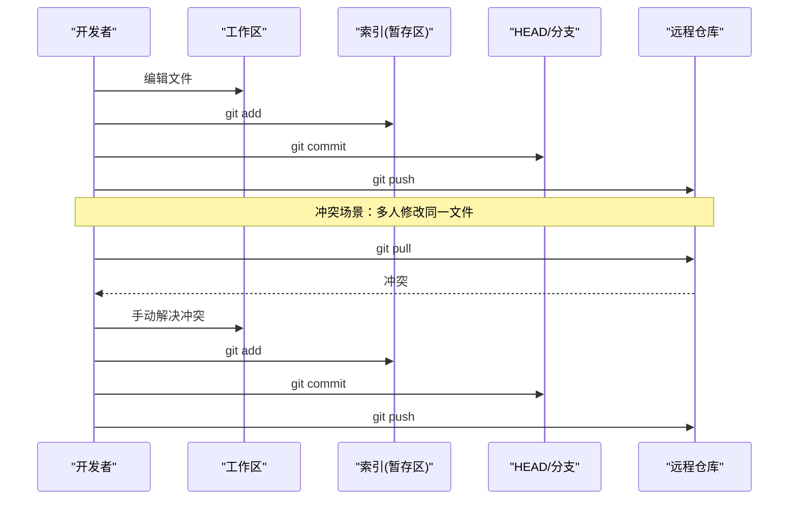
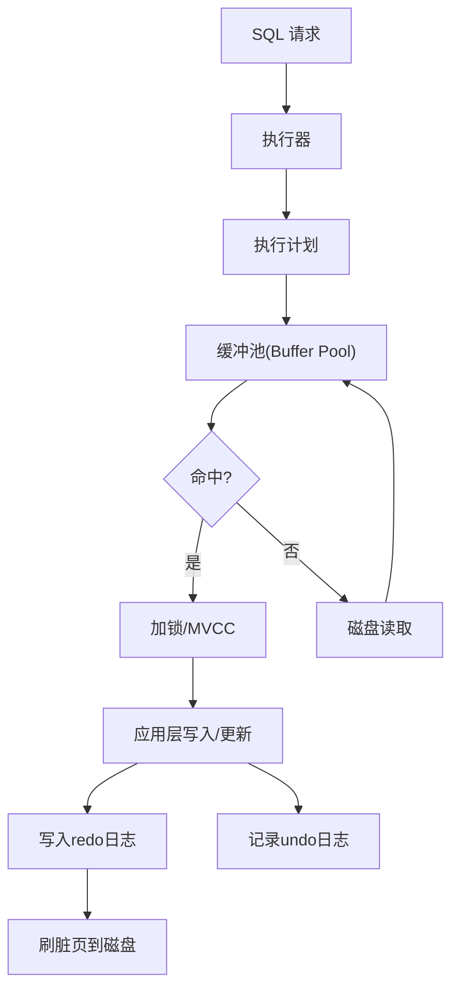
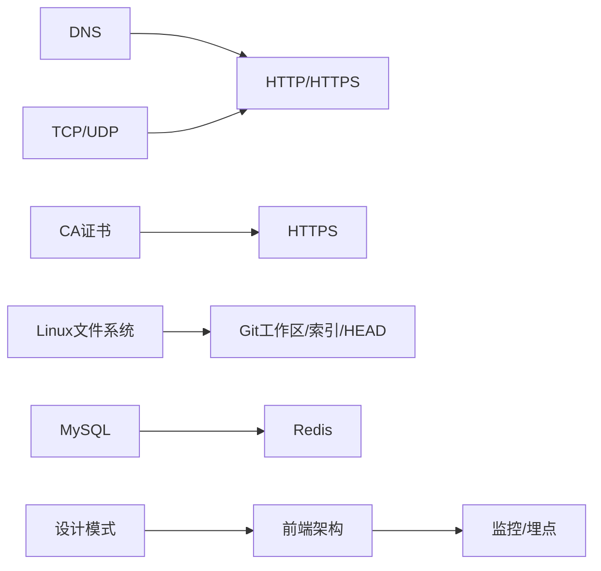

# 系统设计面试

<cite>
**本文引用的文件**
- [UDP_TCP.md](file://docs/interview/http/UDP_TCP.md)
- [DNS.md](file://docs/interview/http/DNS.md)
- [HTTPS.md](file://docs/interview/http/HTTPS.md)
- [linux users.md](file://docs/interview/linux/linux%20users.md)
- [redirect_pipe.md](file://docs/interview/linux/redirect_pipe.md)
- [HEAD_tree_index.md](file://docs/interview/git/HEAD_tree_index.md)
- [conflict.md](file://docs/interview/git/conflict.md)
- [git reset_ git revert.md](file://docs/interview/git/git%20reset_%20git%20revert.md)
- [git stash.md](file://docs/interview/git/git%20stash.md)
- [base.md](file://docs/backend-base/mysql/base.md)
- [data-type.md](file://docs/backend-base/mysql/data-type.md)
- [transaction.md](file://docs/backend-base/mysql/transaction.md)
- [sub-db.md](file://docs/backend-base/mysql/sub-db.md)
- [redis-base.md](file://docs/backend-base/redis-base.md)
- [design.md](file://docs/interview/design/design.md)
- [introduction.md](file://docs/frontend-advanced/project-architecture/introduction.md)
</cite>

## 目录
1. [引言](#引言)
2. [项目结构](#项目结构)
3. [核心组件](#核心组件)
4. [架构总览](#架构总览)
5. [详细组件分析](#详细组件分析)
6. [依赖分析](#依赖分析)
7. [性能考量](#性能考量)
8. [故障排查指南](#故障排查指南)
9. [结论](#结论)
10. [附录](#附录)

## 引言
本指南面向系统设计面试，围绕计算机网络（HTTP/TCP/IP）、Linux 命令行、Git 版本控制、数据库与缓存、系统架构与微服务等主题，结合仓库中的资料进行系统化梳理。内容以“概念—原理—实践—面试答题思路”为主线，辅以图示帮助理解。

## 项目结构
本仓库包含大量与系统设计相关的知识素材，涵盖：
- 计算机网络：HTTP、TCP/UDP、DNS、HTTPS
- Linux：用户与权限、重定向与管道
- Git：HEAD/工作区/索引、冲突、reset/revert、stash
- 数据库：MySQL 基础、数据类型、事务、分库分表
- 缓存：Redis 基本命令
- 架构：前端项目架构与监控埋点
- 设计模式：常用设计模式要点

**章节来源**
- [UDP_TCP.md:1-67](file://docs/interview/http/UDP_TCP.md#L1-L67)
- [DNS.md:1-77](file://docs/interview/http/DNS.md#L1-L77)
- [HTTPS.md:1-121](file://docs/interview/http/HTTPS.md#L1-L121)
- [linux users.md:1-329](file://docs/interview/linux/linux%20users.md#L1-L329)
- [redirect_pipe.md:1-113](file://docs/interview/linux/redirect_pipe.md#L1-L113)
- [HEAD_tree_index.md:1-74](file://docs/interview/git/HEAD_tree_index.md#L1-L74)
- [conflict.md:1-106](file://docs/interview/git/conflict.md#L1-L106)
- [git reset_ git revert.md:1-109](file://docs/interview/git/git%20reset_%20git%20revert.md#L1-L109)
- [git stash.md:1-143](file://docs/interview/git/git%20stash.md#L1-L143)
- [base.md:1-30](file://docs/backend-base/mysql/base.md#L1-L30)
- [data-type.md:1-59](file://docs/backend-base/mysql/data-type.md#L1-L59)
- [transaction.md:1-128](file://docs/backend-base/mysql/transaction.md#L1-L128)
- [sub-db.md:1-57](file://docs/backend-base/mysql/sub-db.md#L1-L57)
- [redis-base.md:1-89](file://docs/backend-base/redis-base.md#L1-L89)
- [design.md:1-122](file://docs/interview/design/design.md#L1-L122)
- [introduction.md:1-101](file://docs/frontend-advanced/project-architecture/introduction.md#L1-L101)

## 核心组件
- 网络协议与安全
  - TCP/UDP 的区别、报文结构与适用场景
  - DNS 查询流程与缓存层次
  - HTTPS 加密、证书与 TLS 握手
- Linux 基础与命令行
  - 用户/用户组与文件权限模型
  - 输入输出重定向与管道
- Git 工作流与问题处理
  - HEAD、工作区、索引三者关系
  - 冲突场景与解决步骤
  - reset 与 revert 的区别与适用场景
  - stash 的使用与典型场景
- 数据库与缓存
  - MySQL 基础、数据类型、事务特性与原理
  - 分库分表策略
  - Redis 基本命令与适用场景
- 架构与设计模式
  - 前端项目架构要点（埋点、监控、规范）
  - 常见设计模式与适用场景

**章节来源**
- [UDP_TCP.md:38-67](file://docs/interview/http/UDP_TCP.md#L38-L67)
- [DNS.md:49-76](file://docs/interview/http/DNS.md#L49-L76)
- [HTTPS.md:18-121](file://docs/interview/http/HTTPS.md#L18-L121)
- [linux users.md:21-329](file://docs/interview/linux/linux%20users.md#L21-L329)
- [redirect_pipe.md:7-113](file://docs/interview/linux/redirect_pipe.md#L7-L113)
- [HEAD_tree_index.md:5-74](file://docs/interview/git/HEAD_tree_index.md#L5-L74)
- [conflict.md:5-106](file://docs/interview/git/conflict.md#L5-L106)
- [git reset_ git revert.md:6-109](file://docs/interview/git/git%20reset_%20git%20revert.md#L6-L109)
- [git stash.md:7-143](file://docs/interview/git/git%20stash.md#L7-L143)
- [base.md:14-30](file://docs/backend-base/mysql/base.md#L14-L30)
- [data-type.md:1-59](file://docs/backend-base/mysql/data-type.md#L1-L59)
- [transaction.md:19-128](file://docs/backend-base/mysql/transaction.md#L19-L128)
- [sub-db.md:16-57](file://docs/backend-base/mysql/sub-db.md#L16-L57)
- [redis-base.md:1-89](file://docs/backend-base/redis-base.md#L1-L89)
- [design.md:23-122](file://docs/interview/design/design.md#L23-L122)
- [introduction.md:13-101](file://docs/frontend-advanced/project-architecture/introduction.md#L13-L101)

## 架构总览
系统设计面试常围绕“问题域—数据—服务—部署—可观测性—演进”展开。以下图示给出一个通用视角，便于在面试中组织答案。

## 详细组件分析

### 网络协议与安全（HTTP/TCP/IP、DNS、HTTPS）
- TCP/UDP
  - 面向连接 vs 无连接、可靠性、报文形态、效率与流量/拥塞控制差异
  - 适用场景：实时性与可靠性权衡
- DNS
  - 域名层次、查询方式（递归/迭代）、缓存层次（浏览器/系统/本地服务器/根/顶级/权威）
  - 查询流程：缓存命中→本地服务器递归→上级迭代→返回并缓存
- HTTPS
  - 机密性（对称加密）、完整性（摘要）、身份认证（CA 数字证书）、不可否认（数字签名）
  - TLS 握手：参数协商、证书下发、会话密钥生成、对称加密传输

**图表来源**
- [DNS.md:49-76](file://docs/interview/http/DNS.md#L49-L76)

**章节来源**
- [UDP_TCP.md:38-67](file://docs/interview/http/UDP_TCP.md#L38-L67)
- [DNS.md:28-76](file://docs/interview/http/DNS.md#L28-L76)
- [HTTPS.md:18-121](file://docs/interview/http/HTTPS.md#L18-L121)

### Linux 基础与命令行
- 用户与用户组
  - 文件所有者、用户组成员、其他人三层权限模型
  - 权限位与 rwx 分组、用户/组关系（一对多/多对一/多对多）
- 重定向与管道
  - 标准输入/输出/错误（0/1/2）
  - 输出重定向（覆盖/追加）、输入重定向、错误重定向与组合
  - 管道连接两个命令，优先级与进程模型

**图表来源**
- [redirect_pipe.md:7-65](file://docs/interview/linux/redirect_pipe.md#L7-L65)

**章节来源**
- [linux users.md:21-329](file://docs/interview/linux/linux%20users.md#L21-L329)
- [redirect_pipe.md:7-113](file://docs/interview/linux/redirect_pipe.md#L7-L113)

### Git 工作流与问题处理
- HEAD、工作区、索引
  - HEAD 指向当前分支；工作区为实际编辑内容；索引为暂存区
  - 提交流程：工作区 → 索引 → 仓库
- 冲突
  - 场景：多分支修改同一文件/名称；合并/补丁应用时
  - 解决：手动编辑冲突标记区域、git add 标记解决、提交
- reset 与 revert
  - reset：删除历史，适合本地回退
  - revert：新增一次提交抵消历史，适合公开分支的安全撤销
- stash
  - 保存暂存区与未暂存改动；支持 list/pop/apply/show/drop/clear

**图表来源**
- [HEAD_tree_index.md:41-66](file://docs/interview/git/HEAD_tree_index.md#L41-L66)
- [conflict.md:12-106](file://docs/interview/git/conflict.md#L12-L106)
- [git reset_ git revert.md:6-109](file://docs/interview/git/git%20reset_%20git%20revert.md#L6-L109)
- [git stash.md:7-143](file://docs/interview/git/git%20stash.md#L7-L143)

**章节来源**
- [HEAD_tree_index.md:5-74](file://docs/interview/git/HEAD_tree_index.md#L5-L74)
- [conflict.md:5-106](file://docs/interview/git/conflict.md#L5-L106)
- [git reset_ git revert.md:6-109](file://docs/interview/git/git%20reset_%20git%20revert.md#L6-L109)
- [git stash.md:7-143](file://docs/interview/git/git%20stash.md#L7-L143)

### 数据库与缓存
- MySQL 基础
  - 启动/停止、客户端连接、SQL 语法与注释
- 数据类型
  - 数值、字符串、日期时间类型与选择建议
- 事务
  - ACID 特性、并发问题（脏读/不可重复读/幻读）、原理（redo/undo 日志、缓冲池、锁与 MVCC）
- 分库分表
  - 垂直/水平拆分方式与特点
- Redis
  - 基本命令：字符串/Hash/列表/集合/有序集合/通用命令

**图表来源**
- [transaction.md:56-128](file://docs/backend-base/mysql/transaction.md#L56-L128)

**章节来源**
- [base.md:14-30](file://docs/backend-base/mysql/base.md#L14-L30)
- [data-type.md:1-59](file://docs/backend-base/mysql/data-type.md#L1-L59)
- [transaction.md:19-128](file://docs/backend-base/mysql/transaction.md#L19-L128)
- [sub-db.md:16-57](file://docs/backend-base/mysql/sub-db.md#L16-L57)
- [redis-base.md:1-89](file://docs/backend-base/redis-base.md#L1-L89)

### 架构与设计模式
- 前端项目架构
  - 基础层：自建 Gitlab、自动编译发布、埋点系统、监控报警、代码规范与提交规范、Mock
  - 应用层：多页/单页选型、库与UI组件库、图标库
- 设计模式
  - 常见模式：单例、工厂、策略、代理、中介者、装饰者等
  - 价值：可维护性、可扩展性、沟通效率、方案复用

**章节来源**
- [introduction.md:13-101](file://docs/frontend-advanced/project-architecture/introduction.md#L13-L101)
- [design.md:23-122](file://docs/interview/design/design.md#L23-L122)

## 依赖分析
- 网络层依赖
  - HTTP 依赖 TCP/UDP；HTTPS 依赖 TLS/CA；DNS 为域名解析基础设施
- 系统层依赖
  - Linux 用户/权限与文件系统；重定向/管道为命令链路组合
- 版本控制依赖
  - HEAD/索引/工作区三者构成 Git 历史与工作流基础
- 数据层依赖
  - MySQL 事务与日志（redo/undo）支撑 ACID；缓存（Redis）提升读性能
- 架构依赖
  - 前端埋点/监控依赖数据采集与可视化；设计模式支撑模块解耦与扩展

**图表来源**
- [DNS.md:14-76](file://docs/interview/http/DNS.md#L14-L76)
- [HTTPS.md:18-121](file://docs/interview/http/HTTPS.md#L18-L121)
- [HEAD_tree_index.md:41-66](file://docs/interview/git/HEAD_tree_index.md#L41-L66)
- [transaction.md:40-128](file://docs/backend-base/mysql/transaction.md#L40-L128)
- [redis-base.md:1-89](file://docs/backend-base/redis-base.md#L1-L89)
- [introduction.md:25-47](file://docs/frontend-advanced/project-architecture/introduction.md#L25-L47)
- [design.md:23-122](file://docs/interview/design/design.md#L23-L122)

**章节来源**
- [DNS.md:14-76](file://docs/interview/http/DNS.md#L14-L76)
- [HTTPS.md:18-121](file://docs/interview/http/HTTPS.md#L18-L121)
- [HEAD_tree_index.md:41-66](file://docs/interview/git/HEAD_tree_index.md#L41-L66)
- [transaction.md:40-128](file://docs/backend-base/mysql/transaction.md#L40-L128)
- [redis-base.md:1-89](file://docs/backend-base/redis-base.md#L1-L89)
- [introduction.md:25-47](file://docs/frontend-advanced/project-architecture/introduction.md#L25-L47)
- [design.md:23-122](file://docs/interview/design/design.md#L23-L122)

## 性能考量
- 网络
  - 选择 TCP/UDP：可靠性优先选 TCP，实时性优先选 UDP
  - DNS 缓存与就近解析，减少跨域查询
  - HTTPS 会话密钥复用与 ALPN，降低握手开销
- Linux
  - 合理使用重定向/管道减少 I/O 与进程切换
  - 权限最小化与目录结构清晰，降低系统调用与上下文切换成本
- 数据库
  - 事务与日志：WAL（redo）顺序写优于随机写；缓冲池命中率与锁竞争
  - 分库分表：热点分离、读写分离、分片键设计
- 缓存
  - Redis 命令选择：字符串适合 KV，Hash/有序集合适合结构化数据
  - 过期策略与内存淘汰策略匹配业务特征
- 架构
  - 前端多页架构降低版本耦合，灰度发布与监控报警前置

[本节为通用指导，无需特定文件来源]

## 故障排查指南
- Git 冲突
  - 现象：合并/补丁应用失败，出现冲突标记
  - 步骤：定位冲突文件、编辑冲突标记、git add 标记解决、提交
- reset 与 revert
  - reset：删除历史，适合本地回退；注意对公开分支的风险
  - revert：新增一次提交抵消历史，适合公开分支的安全撤销
- stash
  - 保存当前进度，避免未提交代码丢失；注意默认不包含未跟踪文件
- Linux 重定向/管道
  - 错误输出与标准输出分离，必要时使用 2>&1 统一输出
  - 管道优先级高于输出重定向，注意命令组合顺序
- MySQL 事务
  - 关注 redo/undo 日志与缓冲池，定位慢查询与锁等待
  - 事务隔离级别与 MVCC 影响并发与一致性

**章节来源**
- [conflict.md:5-106](file://docs/interview/git/conflict.md#L5-L106)
- [git reset_ git revert.md:6-109](file://docs/interview/git/git%20reset_%20git%20revert.md#L6-L109)
- [git stash.md:7-143](file://docs/interview/git/git%20stash.md#L7-L143)
- [redirect_pipe.md:28-65](file://docs/interview/linux/redirect_pipe.md#L28-L65)
- [transaction.md:40-128](file://docs/backend-base/mysql/transaction.md#L40-L128)

## 结论
系统设计面试强调“以问题为导向”的工程思维：先定义边界与约束，再设计数据与服务，最后落实到可观测与可演进。本指南以仓库内容为基础，构建了从网络、系统、版本控制、数据库与缓存到架构与设计模式的知识地图，配合图示与流程，帮助在面试中清晰表达思路与权衡。

[本节为总结，无需特定文件来源]

## 附录
- 面试答题思路模板
  - 问题理解：边界、约束、指标（吞吐/延迟/一致性）
  - 方案设计：数据模型、服务拆分、缓存/异步策略、限流/降级
  - 架构落地：部署拓扑、监控告警、灰度发布
  - 风险与权衡：CAP 与 BASE、一致性代价、扩展性瓶颈
- 常见题目类型
  - 设计秒杀/订单/评论/消息队列
  - 高并发读写与一致性
  - 分布式 ID/分布式锁/幂等
  - 微服务拆分与网关治理
- 绘图技巧
  - 用简洁节点与箭头表达“调用/数据/事件”流向
  - 标注关键决策点（分片键、缓存策略、熔断阈值）
  - 用颜色或形状区分“用户侧/服务侧/数据侧”

[本节为通用指导，无需特定文件来源]