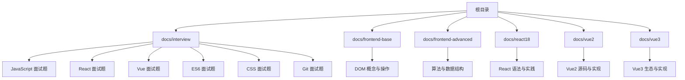
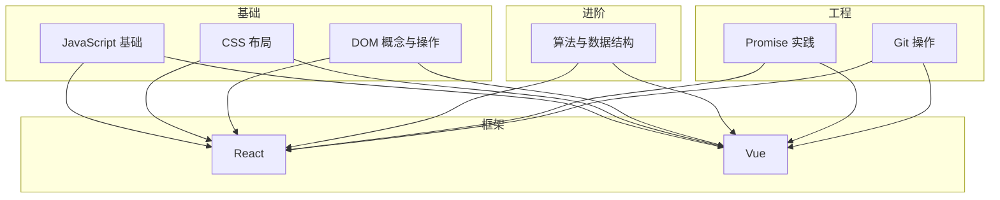
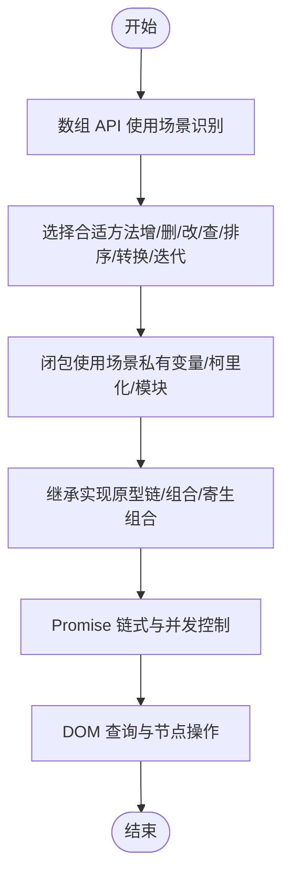
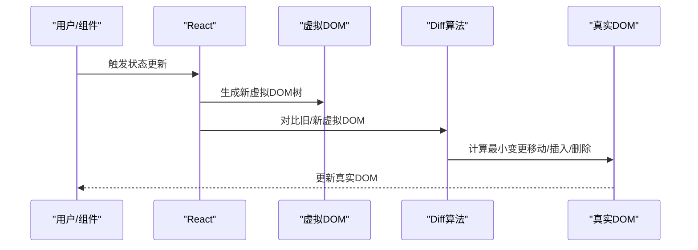
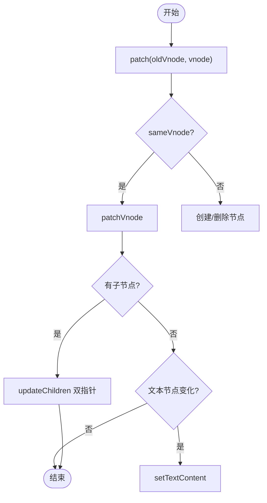
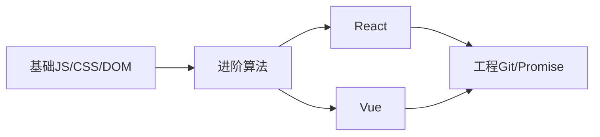

# 面试准备

<cite>
**本文引用的文件**
- [README.md](file://README.md)
- [package.json](file://package.json)
- [数组常用方法.md](file://docs/interview/JavaScript/array_api.md)
- [闭包.md](file://docs/interview/JavaScript/closure.md)
- [继承.md](file://docs/interview/JavaScript/inherit.md)
- [React 概念与特性.md](file://docs/interview/React/React.md)
- [React diff 原理.md](file://docs/interview/React/diff.md)
- [Vue 概念与特性.md](file://docs/interview/vue/vue.md)
- [Vue diff 算法.md](file://docs/interview/vue/diff.md)
- [Promise 理解与用法.md](file://docs/interview/es6/promise.md)
- [Flex 弹性布局.md](file://docs/interview/css/flexbox.md)
- [Git reset 与 revert 区别.md](file://docs/interview/git/git reset_ git revert.md)
- [算法理解.md](file://docs/frontend-advanced/algorithm/Algorithm.md)
- [React 语法.md](file://docs/react18/react/grammar.md)
- [DOM 概念与操作.md](file://docs/frontend-base/javascript/dom.md)
</cite>

## 目录
1. [简介](#简介)
2. [项目结构](#项目结构)
3. [核心组件](#核心组件)
4. [架构总览](#架构总览)
5. [详细组件分析](#详细组件分析)
6. [依赖分析](#依赖分析)
7. [性能考量](#性能考量)
8. [故障排查指南](#故障排查指南)
9. [结论](#结论)
10. [附录](#附录)

## 简介
本文件面向技术面试者，系统梳理前端知识体系与实战能力，覆盖 JavaScript、CSS、React、Vue 等核心技术要点，配套算法与工程实践（含 Git），并提供模拟面试练习与评分建议，帮助候选人高效准备与稳定发挥。

## 项目结构
该仓库为 VuePress 主题示例站点，文档按主题与模块组织，便于检索与复习。核心结构如下：
- docs/interview：面试专题，覆盖 JS、React、Vue、ES6、CSS、Git 等高频考点
- docs/frontend-base：前端基础（DOM、JS 基础）
- docs/frontend-advanced：前端进阶（算法、数据结构）
- docs/react18、docs/vue2、docs/vue3：React/Vue 版本化知识
- 根目录：站点配置与依赖

图表来源
- [README.md:1-12](file://README.md#L1-L12)
- [package.json:1-17](file://package.json#L1-L17)

章节来源
- [README.md:1-12](file://README.md#L1-L12)
- [package.json:1-17](file://package.json#L1-L17)

## 核心组件
- JavaScript 面试专题：数组 API、闭包、继承、Promise、DOM 概念与操作
- React 面试专题：概念与特性、diff 原理、语法与状态管理
- Vue 面试专题：概念与特性、diff 算法
- CSS 面试专题：Flex 弹性布局
- ES6 面试专题：Promise 理解与用法
- 算法专题：算法理解与数据结构应用
- Git 专题：reset 与 revert 的区别与使用场景

章节来源
- [数组常用方法.md:1-295](file://docs/interview/JavaScript/array_api.md#L1-L295)
- [闭包.md:1-162](file://docs/interview/JavaScript/closure.md#L1-L162)
- [继承.md:1-254](file://docs/interview/JavaScript/inherit.md#L1-L254)
- [React 概念与特性.md:1-140](file://docs/interview/React/React.md#L1-L140)
- [React diff 原理.md:1-154](file://docs/interview/React/diff.md#L1-L154)
- [Vue 概念与特性.md:1-119](file://docs/interview/vue/vue.md#L1-L119)
- [Vue diff 算法.md:1-341](file://docs/interview/vue/diff.md#L1-L341)
- [Promise 理解与用法.md:1-388](file://docs/interview/es6/promise.md#L1-L388)
- [Flex 弹性布局.md:1-270](file://docs/interview/css/flexbox.md#L1-L270)
- [Git reset 与 revert 区别.md:1-109](file://docs/interview/git/git reset_ git revert.md#L1-L109)
- [算法理解.md:1-60](file://docs/frontend-advanced/algorithm/Algorithm.md#L1-L60)
- [React 语法.md:1-800](file://docs/react18/react/grammar.md#L1-L800)
- [DOM 概念与操作.md:1-800](file://docs/frontend-base/javascript/dom.md#L1-L800)

## 架构总览
面试准备的知识体系由“基础—进阶—框架—工程实践—算法”五条主线构成，形成“知识图谱 + 实战案例”的闭环。

图表来源
- [React 概念与特性.md:1-140](file://docs/interview/React/React.md#L1-L140)
- [Vue 概念与特性.md:1-119](file://docs/interview/vue/vue.md#L1-L119)
- [算法理解.md:1-60](file://docs/frontend-advanced/algorithm/Algorithm.md#L1-L60)
- [Promise 理解与用法.md:1-388](file://docs/interview/es6/promise.md#L1-L388)
- [Git reset 与 revert 区别.md:1-109](file://docs/interview/git/git reset_ git revert.md#L1-L109)

## 详细组件分析

### JavaScript：数组 API、闭包、继承、Promise、DOM
- 数组 API：掌握增删改查、排序、转换、迭代方法及其对原数组的影响，能结合场景选择合适方法
- 闭包：理解词法作用域与引用、创建私有变量与延长生命周期、性能与内存影响
- 继承：原型链、构造函数、组合、寄生组合式继承，以及 ES6 class/extends 的实现原理
- Promise：状态机、链式调用、all/race/allSettled、错误冒泡与 finally
- DOM：节点类型、节点关系、节点操作、NodeList/HTMLCollection、document 状态与查询

图表来源
- [数组常用方法.md:1-295](file://docs/interview/JavaScript/array_api.md#L1-L295)
- [闭包.md:1-162](file://docs/interview/JavaScript/closure.md#L1-L162)
- [继承.md:1-254](file://docs/interview/JavaScript/inherit.md#L1-L254)
- [Promise 理解与用法.md:1-388](file://docs/interview/es6/promise.md#L1-L388)
- [DOM 概念与操作.md:1-800](file://docs/frontend-base/javascript/dom.md#L1-L800)

章节来源
- [数组常用方法.md:1-295](file://docs/interview/JavaScript/array_api.md#L1-L295)
- [闭包.md:1-162](file://docs/interview/JavaScript/closure.md#L1-L162)
- [继承.md:1-254](file://docs/interview/JavaScript/inherit.md#L1-L254)
- [Promise 理解与用法.md:1-388](file://docs/interview/es6/promise.md#L1-L388)
- [DOM 概念与操作.md:1-800](file://docs/frontend-base/javascript/dom.md#L1-L800)

### React：概念、特性与 diff 原理
- 概念与特性：组件化、声明式、虚拟 DOM、单向数据流、JSX 语法
- diff 原理：tree/component/element 三层策略、key 的作用、移动/插入/删除策略、性能权衡

图表来源
- [React 概念与特性.md:1-140](file://docs/interview/React/React.md#L1-L140)
- [React diff 原理.md:1-154](file://docs/interview/React/diff.md#L1-L154)

章节来源
- [React 概念与特性.md:1-140](file://docs/interview/React/React.md#L1-L140)
- [React diff 原理.md:1-154](file://docs/interview/React/diff.md#L1-L154)

### Vue：概念、特性与 diff 算法
- 概念与特性：MVVM、组件化、指令系统、数据驱动视图
- diff 算法：同层比较、双向指针从两端向中间收敛、key 的高效复用与回退策略

图表来源
- [Vue diff 算法.md:1-341](file://docs/interview/vue/diff.md#L1-L341)

章节来源
- [Vue 概念与特性.md:1-119](file://docs/interview/vue/vue.md#L1-L119)
- [Vue diff 算法.md:1-341](file://docs/interview/vue/diff.md#L1-L341)

### CSS：Flex 弹性布局
- 主轴/交叉轴、flex-direction/wrap、justify-content/align-items/align-content
- order/flex-grow/flex-shrink/flex-basis/flex/align-self
- 常见布局场景与移动端适配

章节来源
- [Flex 弹性布局.md:1-270](file://docs/interview/css/flexbox.md#L1-L270)

### ES6：Promise 理解与用法
- 状态机、then/catch/finally、all/race/allSettled/resolve/reject
- 错误冒泡、超时控制、并发与串行场景

章节来源
- [Promise 理解与用法.md:1-388](file://docs/interview/es6/promise.md#L1-L388)

### 算法：理解与应用
- 算法五大特性、数据结构与算法的关系
- 虚拟 DOM 与 diff 的数据结构基础、AST 与编译工具链

章节来源
- [算法理解.md:1-60](file://docs/frontend-advanced/algorithm/Algorithm.md#L1-L60)

### Git：reset 与 revert
- reset：重设本地提交，删除历史，适合未推送或仅本地回退
- revert：新增一次提交抵消历史，保留历史，适合已推送场景
- 使用场景与注意事项

章节来源
- [Git reset 与 revert 区别.md:1-109](file://docs/interview/git/git reset_ git revert.md#L1-L109)

### React 语法与状态管理
- JSX 语法规则、事件处理、条件/列表渲染
- useState/useReducer 状态更新机制、对象/数组不可变更新、useImmer

章节来源
- [React 语法.md:1-800](file://docs/react18/react/grammar.md#L1-L800)

## 依赖分析
- 站点依赖：VuePress 与主题，用于文档构建与发布
- 面试知识依赖：基础（JS/CSS/DOM）→ 进阶（算法）→ 框架（React/Vue）→ 工程（Git/Promise）

图表来源
- [package.json:1-17](file://package.json#L1-L17)

章节来源
- [package.json:1-17](file://package.json#L1-L17)

## 性能考量
- React/Vue diff：key 设计、同层比较、移动 vs 修改文本的权衡
- Promise 并发：all/race/allSettled 的选择与错误处理
- DOM 操作：批量更新、避免强制同步布局、节点集合的动态性
- 算法与数据结构：选择合适的数据结构（如前缀树）降低查询成本

## 故障排查指南
- diff 无效或闪烁：检查 key 是否唯一且稳定，避免索引作为 key
- Promise 未捕获错误：确保链路中有 catch 或统一异常处理
- DOM 查询异常：确认 readyState、节点存在性与集合动态性
- Git 历史冲突：已推送使用 revert，未推送使用 reset；注意 --soft/--mixed/--hard 的影响范围

章节来源
- [React diff 原理.md:92-147](file://docs/interview/React/diff.md#L92-L147)
- [Promise 理解与用法.md:104-131](file://docs/interview/es6/promise.md#L104-L131)
- [DOM 概念与操作.md:645-669](file://docs/frontend-base/javascript/dom.md#L645-L669)
- [Git reset 与 revert 区别.md:87-104](file://docs/interview/git/git reset_ git revert.md#L87-L104)

## 结论
本文件将面试知识点系统化为“知识图谱 + 实战案例 + 工程实践”，配合算法与工程能力，形成可执行的准备路径。建议以“理解原理 → 举证案例 → 对照规范 → 模拟演练”的节奏推进。

## 附录

### 模拟面试练习与评分标准（建议）
- 自我介绍（2min）：项目背景、角色职责、技术栈、产出价值
- 技术问答（10-15min）：按专题抽题（如 React diff、Vue diff、Promise 并发、Flex 布局、Git 回退策略）
- 代码/设计题（10-15min）：如“实现一个稳定的 diff 算法思路”“设计一个 Promise 并发调度器”
- 项目复盘（5-10min）：亮点、坑点、优化点、可复用的模式
- 评分维度（满分 5 分）：
  - 技术深度（2分）：原理、边界、性能、可维护性
  - 代码质量（1分）：结构、健壮性、可读性
  - 工程化（1分）：可测试、可观测、可演进
  - 沟通表达（1分）：条理、举例、引导

### 高频考点速记
- React：JSX/组件/声明式/虚拟 DOM/diff/key
- Vue：MVVM/组件化/指令/响应式/双向绑定
- JS：闭包/继承/数组 API/Promise
- CSS：Flex 布局/居中/移动端适配
- 算法：diff/AST/前缀树/动态规划
- 工程：Git reset/revert/分支策略/并发控制